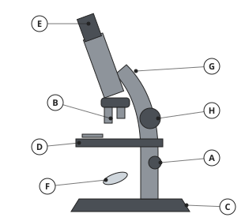
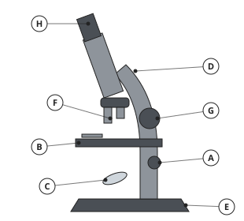
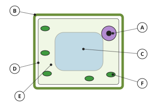
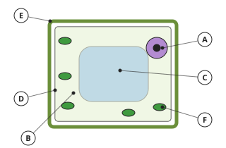
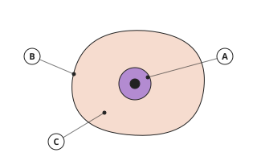
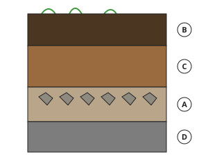

# Biology Form 1, Batch B1: authored answers for review

Every answer fixed by a person, not computed. Part 1: the tables, conventions and rules that computed answers come from.
Part 2: every authored question template, with all its data (keys, statements, pairs, choices and feedback) and sources.
Regenerate with `npm run review:biology`. Item IDs (TR-…) match `docs/teacher-review.md`.

## Part 1: rules, table and drawings the answers use (src/engine/lib/biology.js)

- **Magnification (TR-L01)**: total = eyepiece × objective (×10 and ×4 → ×40; ×10 and ×40 → ×400; ×15 and ×100 → ×1500).
- **Cell discoveries (TR-L02)**: 1665: Robert Hooke looked at thin slices of cork and named the little boxes he saw “cells”; 1674: Antonie van Leeuwenhoek made strong lenses and was the first to see living micro-organisms; 1838: Matthias Schleiden said that all plants are made of cells; 1839: Theodor Schwann said that all animals are made of cells.
- **Drawings with lettered parts (TR-L03)**: microscope (eyepiece, objective lenses, stage, coarse focus knob, fine focus knob, mirror, arm, base); plant cell (cell wall, cell membrane, cytoplasm, nucleus, vacuole, chloroplast); animal cell (cell membrane, cytoplasm, nucleus); soil profile (topsoil, subsoil, weathered rock (parent material), bedrock).

## Part 2: authored question templates

| # | Template | Lesson | Type, level | Sources |
|---|---|---|---|---|
| 1 | `b1-branch` | 1 | matching, 1 | biology-intro |
| 2 | `b1-career` | 1 | multiple choice, 1 | biology-intro |
| 3 | `b1-which` | 1 | multiple choice, 2 | biology-intro |
| 4 | `b1-spot` | 1 | spot the error, 3 | biology-intro |
| 5 | `bc1-1-check` (card bc1-1) | 1 | multiple choice, 1 | biology-intro |
| 6 | `b2-match` | 2 | matching, 1 | living-things |
| 7 | `b2-which` | 2 | multiple choice, 1 | living-things |
| 8 | `b2-sort` | 2 | matching, 2 | living-things |
| 9 | `b2-spot` | 2 | spot the error, 3 | living-things |
| 10 | `bc2-3-check` (card bc2-3) | 2 | multiple choice, 1 | living-things |
| 11 | `b3-diff` | 3 | multiple choice, 1 | plants-animals |
| 12 | `b3-sort` | 3 | matching, 1 | plants-animals |
| 13 | `b3-why` | 3 | multiple choice, 2 | plants-animals |
| 14 | `b3-spot` | 3 | spot the error, 3 | plants-animals, living-things |
| 15 | `bc3-3-check` (card bc3-3) | 3 | multiple choice, 1 | plants-animals |
| 16 | `b4-order` | 4 | ordering, 1 | scientific-approach |
| 17 | `b4-hyp` | 4 | multiple choice, 1 | scientific-approach |
| 18 | `b4-step` | 4 | multiple choice, 2 | scientific-approach |
| 19 | `b4-spot` | 4 | spot the error, 3 | scientific-approach |
| 20 | `bc4-3-check` (card bc4-3) | 4 | multiple choice, 1 | scientific-approach |
| 21 | `b5-where` | 5 | multiple choice, 1 | field-lab |
| 22 | `b5-tool` | 5 | matching, 1 | field-lab |
| 23 | `b5-adv` | 5 | multiple choice, 2 | field-lab |
| 24 | `b5-spot` | 5 | spot the error, 3 | field-lab |
| 25 | `bc5-3-check` (card bc5-3) | 5 | multiple choice, 1 | field-lab |
| 26 | `b6-rule` | 6 | multiple choice, 1 | lab-safety |
| 27 | `b6-equip` | 6 | matching, 1 | lab-safety |
| 28 | `b6-sort` | 6 | matching, 2 | lab-safety |
| 29 | `b6-spot` | 6 | spot the error, 3 | lab-safety |
| 30 | `bc6-3-check` (card bc6-3) | 6 | multiple choice, 1 | lab-safety |
| 31 | `b7-part` | 7 | multiple choice, 1 | microscope |
| 32 | `b7-letter` | 7 | multiple choice, 1 | microscope |
| 33 | `b7-use` | 7 | multiple choice, 2 | microscope |
| 34 | `b8-order` | 8 | ordering, 1 | microscope |
| 35 | `b8-why` | 8 | multiple choice, 1 | microscope |
| 36 | `b8-image` | 8 | multiple choice, 2 | microscope |
| 37 | `b8-spot` | 8 | spot the error, 3 | microscope |
| 38 | `bc8-3-check` (card bc8-3) | 8 | multiple choice, 1 | microscope |
| 39 | `b9-uni` | 9 | matching, 1 | cells |
| 40 | `b9-who` | 9 | multiple choice, 1 | cells |
| 41 | `b9-order` | 9 | ordering, 2 | cells |
| 42 | `b9-types` | 9 | multiple choice, 2 | cells |
| 43 | `b9-spot` | 9 | spot the error, 3 | cells |
| 44 | `bc9-3-check` (card bc9-3) | 9 | multiple choice, 1 | cells |
| 45 | `b13-part` | 13 | multiple choice, 1 | cells |
| 46 | `b13-letter` | 13 | multiple choice, 1 | cells |
| 47 | `b13-animal` | 13 | multiple choice, 1 | cells |
| 48 | `b13-sort` | 13 | matching, 2 | cells |
| 49 | `b13-job` | 13 | multiple choice, 2 | cells |
| 50 | `b13-spot` | 13 | spot the error, 3 | cells |
| 51 | `b14-order` | 14 | ordering, 1 | cells |
| 52 | `b14-see` | 14 | multiple choice, 1 | cells |
| 53 | `b14-bubble` | 14 | multiple choice, 2 | cells |
| 54 | `b14-green` | 14 | multiple choice, 2 | cells |
| 55 | `b14-spot` | 14 | spot the error, 3 | cells |
| 56 | `bc14-3-check` (card bc14-3) | 14 | multiple choice, 1 | cells |
| 57 | `b15-habitat` | 15 | multiple choice, 1 | environment-factors |
| 58 | `b15-sort` | 15 | matching, 1 | environment-factors |
| 59 | `b15-north` | 15 | multiple choice, 2 | environment-factors |
| 60 | `b15-spot` | 15 | spot the error, 3 | environment-factors |
| 61 | `bc15-3-check` (card bc15-3) | 15 | multiple choice, 1 | environment-factors |
| 62 | `b16-sort` | 16 | matching, 1 | day-seasons |
| 63 | `b16-plant` | 16 | multiple choice, 1 | day-seasons |
| 64 | `b16-season` | 16 | multiple choice, 2 | day-seasons |
| 65 | `b16-spot` | 16 | spot the error, 3 | day-seasons |
| 66 | `bc16-3-check` (card bc16-3) | 16 | multiple choice, 1 | day-seasons |
| 67 | `b17-match` | 17 | matching, 1 | interactions |
| 68 | `b17-which` | 17 | multiple choice, 1 | interactions |
| 69 | `b17-weeds` | 17 | multiple choice, 2 | interactions |
| 70 | `b17-spot` | 17 | spot the error, 3 | interactions |
| 71 | `bc17-3-check` (card bc17-3) | 17 | multiple choice, 1 | interactions |
| 72 | `b18-tool` | 18 | matching, 1 | specimens |
| 73 | `b18-safe` | 18 | multiple choice, 1 | specimens |
| 74 | `b18-sort` | 18 | matching, 2 | specimens |
| 75 | `b18-spot` | 18 | spot the error, 3 | specimens |
| 76 | `bc18-3-check` (card bc18-3) | 18 | multiple choice, 1 | specimens |
| 77 | `b19-made` | 19 | multiple choice, 1 | soil |
| 78 | `b19-layer` | 19 | multiple choice, 1 | soil |
| 79 | `b19-type` | 19 | multiple choice, 1 | soil |
| 80 | `b19-order` | 19 | ordering, 2 | soil |
| 81 | `b19-spot` | 19 | spot the error, 3 | soil |
| 82 | `b20-good` | 20 | multiple choice, 1 | soil |
| 83 | `b20-improve` | 20 | matching, 1 | soil |
| 84 | `b20-how` | 20 | multiple choice, 2 | soil |
| 85 | `b20-spot` | 20 | spot the error, 3 | soil |
| 86 | `bc20-3-check` (card bc20-3) | 20 | multiple choice, 1 | soil |
| 87 | `b21-sort` | 21 | matching, 1 | farming |
| 88 | `b21-slope` | 21 | multiple choice, 1 | farming |
| 89 | `b21-why` | 21 | multiple choice, 2 | farming |
| 90 | `b21-spot` | 21 | spot the error, 3 | farming |
| 91 | `bc21-3-check` (card bc21-3) | 21 | multiple choice, 1 | farming |

### `b1-branch` · Lesson 1 · matching, level 1

Prompt: Match each branch of biology with what it studies.

Pairs (4 shown each time):

- botany → **plants**
- zoology → **animals**
- microbiology → **micro-organisms such as bacteria**
- ecology → **living things and their environment**
- anatomy → **the structure of the body**
- physiology → **how the parts of the body work**
- genetics → **how features pass from parents to offspring**

Three generated variants:

> Match each branch of biology with what it studies.

Right-hand side (shuffled): animals · how features pass from parents to offspring · plants · how the parts of the body work
- physiology → **how the parts of the body work**
- genetics → **how features pass from parents to offspring**
- botany → **plants**
- zoology → **animals**

Full working after a second miss:

> The right pairs are:  
> physiology → how the parts of the body work  
> genetics → how features pass from parents to offspring  
> botany → plants  
> zoology → animals  

> Match each branch of biology with what it studies.

Right-hand side (shuffled): how features pass from parents to offspring · how the parts of the body work · plants · the structure of the body
- genetics → **how features pass from parents to offspring**
- botany → **plants**
- physiology → **how the parts of the body work**
- anatomy → **the structure of the body**

Full working after a second miss:

> The right pairs are:  
> genetics → how features pass from parents to offspring  
> botany → plants  
> physiology → how the parts of the body work  
> anatomy → the structure of the body  

> Match each branch of biology with what it studies.

Right-hand side (shuffled): animals · living things and their environment · how the parts of the body work · how features pass from parents to offspring
- physiology → **how the parts of the body work**
- ecology → **living things and their environment**
- genetics → **how features pass from parents to offspring**
- zoology → **animals**

Full working after a second miss:

> The right pairs are:  
> physiology → how the parts of the body work  
> ecology → living things and their environment  
> genetics → how features pass from parents to offspring  
> zoology → animals  

Sources: biology-intro (What biology is; branches; careers)

### `b1-career` · Lesson 1 · multiple choice, level 1

Prompt: Who {x.t}?

Table `x` (one row is picked each time):

| t | a | why |
|---|---|---|
| treats sick animals | a vet | A vet: treats sick animals. |
| helps farmers grow better crops | an agronomist | An agronomist: helps farmers grow better crops. |
| cares for patients in hospital | a nurse | A nurse: cares for patients in hospital. |
| prepares and sells medicines | a pharmacist | A pharmacist: prepares and sells medicines. |
| tests blood and other samples | a laboratory technician | A laboratory technician: tests blood and other samples. |
| looks after forests | a forester | A forester: looks after forests. |

Right answer: `{x.a}`; wrong choices: `a vet`, `an agronomist`, `a nurse`, `a pharmacist`, `a laboratory technician`, `a forester`

- Feedback `other`: “Not that career. Read what each person does.”

Three generated variants:

> Who helps farmers grow better crops?

- ◻️ a laboratory technician  
  _↳ feedback if chosen: Not that career. Read what each person does._
- ◻️ a nurse  
  _↳ feedback if chosen: Not that career. Read what each person does._
- ✅ an agronomist
- ◻️ a vet  
  _↳ feedback if chosen: Not that career. Read what each person does._

Full working after a second miss:

> An agronomist: helps farmers grow better crops.  
> Answer: an agronomist.  

> Who helps farmers grow better crops?

- ◻️ a pharmacist  
  _↳ feedback if chosen: Not that career. Read what each person does._
- ◻️ a forester  
  _↳ feedback if chosen: Not that career. Read what each person does._
- ◻️ a nurse  
  _↳ feedback if chosen: Not that career. Read what each person does._
- ✅ an agronomist

Full working after a second miss:

> An agronomist: helps farmers grow better crops.  
> Answer: an agronomist.  

> Who helps farmers grow better crops?

- ◻️ a nurse  
  _↳ feedback if chosen: Not that career. Read what each person does._
- ◻️ a forester  
  _↳ feedback if chosen: Not that career. Read what each person does._
- ◻️ a laboratory technician  
  _↳ feedback if chosen: Not that career. Read what each person does._
- ✅ an agronomist

Full working after a second miss:

> An agronomist: helps farmers grow better crops.  
> Answer: an agronomist.  

Sources: biology-intro (What biology is; branches; careers)

### `b1-which` · Lesson 1 · multiple choice, level 2

Prompt: Which branch of biology studies {x.t}?

Table `x` (one row is picked each time):

| t | a | why |
|---|---|---|
| how bees pollinate flowers | ecology | Ecology: how bees pollinate flowers. |
| the bones of the human skeleton | anatomy | Anatomy: the bones of the human skeleton. |
| how the kidneys clean the blood | physiology | Physiology: how the kidneys clean the blood. |
| why a child has her mother’s eyes | genetics | Genetics: why a child has her mother’s eyes. |
| the bacteria that cause cholera | microbiology | Microbiology: the bacteria that cause cholera. |
| the trees of the rainforest | botany | Botany: the trees of the rainforest. |

Right answer: `{x.a}`; wrong choices: `botany`, `zoology`, `microbiology`, `ecology`, `anatomy`, `physiology`, `genetics`

- Feedback `other`: “Not that branch. Read what each branch studies.”

Three generated variants:

> Which branch of biology studies the trees of the rainforest?

- ◻️ anatomy  
  _↳ feedback if chosen: Not that branch. Read what each branch studies._
- ✅ botany
- ◻️ zoology  
  _↳ feedback if chosen: Not that branch. Read what each branch studies._
- ◻️ microbiology  
  _↳ feedback if chosen: Not that branch. Read what each branch studies._

Full working after a second miss:

> Botany: the trees of the rainforest.  
> Answer: botany.  

> Which branch of biology studies the bacteria that cause cholera?

- ◻️ zoology  
  _↳ feedback if chosen: Not that branch. Read what each branch studies._
- ◻️ genetics  
  _↳ feedback if chosen: Not that branch. Read what each branch studies._
- ◻️ ecology  
  _↳ feedback if chosen: Not that branch. Read what each branch studies._
- ✅ microbiology

Full working after a second miss:

> Microbiology: the bacteria that cause cholera.  
> Answer: microbiology.  

> Which branch of biology studies how bees pollinate flowers?

- ✅ ecology
- ◻️ zoology  
  _↳ feedback if chosen: Not that branch. Read what each branch studies._
- ◻️ genetics  
  _↳ feedback if chosen: Not that branch. Read what each branch studies._
- ◻️ anatomy  
  _↳ feedback if chosen: Not that branch. Read what each branch studies._

Full working after a second miss:

> Ecology: how bees pollinate flowers.  
> Answer: ecology.  

Sources: biology-intro (What biology is; branches; careers)

### `b1-spot` · Lesson 1 · spot the error, level 3

Prompt: One sentence is wrong. Which one?

Shows 3 correct and 1 wrong statement(s), drawn from:

- ✅ Botany is the study of plants.
- ✅ Zoology is the study of animals.
- ✅ Biology helps doctors fight disease.
- ✅ Ecology studies living things and their environment.
- ❌ Biology only studies animals.  
  _↳ Biology studies all living things: plants, animals, people and micro-organisms._
- ❌ Microbiology studies very large animals.  
  _↳ Microbiology studies micro-organisms._
- ❌ Genetics is the study of soils.  
  _↳ Genetics studies how features pass from parents to offspring._

Three generated variants:

> One sentence is wrong. Which one?

- ◻️ Ecology studies living things and their environment.
- ◻️ Zoology is the study of animals.
- ✅ Microbiology studies very large animals.  
  _↳ explanation: Microbiology studies micro-organisms._
- ◻️ Biology helps doctors fight disease.

Full working after a second miss:

> The wrong statement is “Microbiology studies very large animals.”.  
> Microbiology studies micro-organisms.  

> One sentence is wrong. Which one?

- ◻️ Zoology is the study of animals.
- ◻️ Biology helps doctors fight disease.
- ◻️ Ecology studies living things and their environment.
- ✅ Genetics is the study of soils.  
  _↳ explanation: Genetics studies how features pass from parents to offspring._

Full working after a second miss:

> The wrong statement is “Genetics is the study of soils.”.  
> Genetics studies how features pass from parents to offspring.  

> One sentence is wrong. Which one?

- ◻️ Zoology is the study of animals.
- ◻️ Ecology studies living things and their environment.
- ◻️ Botany is the study of plants.
- ✅ Microbiology studies very large animals.  
  _↳ explanation: Microbiology studies micro-organisms._

Full working after a second miss:

> The wrong statement is “Microbiology studies very large animals.”.  
> Microbiology studies micro-organisms.  

Sources: biology-intro (What biology is; branches; careers)

### `bc1-1-check` · Lesson 1 · multiple choice, level 1

Prompt: Which question is a biology question?

Shows 1 true and 3 false statement(s), drawn from:

- ✅ How do plants make their food?
- ✅ How does the heart pump blood?
- ✅ How do mosquitoes spread malaria?
- ❌ How fast does a car move?  
  _↳ That is Physics._
- ❌ What is table salt made of?  
  _↳ That is Chemistry._
- ❌ When did Cameroon become independent?  
  _↳ That is History._
- ❌ How do you add fractions?  
  _↳ That is Mathematics._

Three generated variants:

> Which question is a biology question?

- ◻️ When did Cameroon become independent?  
  _↳ feedback if chosen: That is History._
- ◻️ What is table salt made of?  
  _↳ feedback if chosen: That is Chemistry._
- ✅ How do plants make their food?
- ◻️ How fast does a car move?  
  _↳ feedback if chosen: That is Physics._

Full working after a second miss:

> The true statement is “How do plants make their food?”.  
> “When did Cameroon become independent?” is false: That is History.  
> “What is table salt made of?” is false: That is Chemistry.  
> “How fast does a car move?” is false: That is Physics.  

> Which question is a biology question?

- ◻️ How do you add fractions?  
  _↳ feedback if chosen: That is Mathematics._
- ◻️ How fast does a car move?  
  _↳ feedback if chosen: That is Physics._
- ◻️ When did Cameroon become independent?  
  _↳ feedback if chosen: That is History._
- ✅ How does the heart pump blood?

Full working after a second miss:

> The true statement is “How does the heart pump blood?”.  
> “How do you add fractions?” is false: That is Mathematics.  
> “How fast does a car move?” is false: That is Physics.  
> “When did Cameroon become independent?” is false: That is History.  

> Which question is a biology question?

- ◻️ When did Cameroon become independent?  
  _↳ feedback if chosen: That is History._
- ✅ How do mosquitoes spread malaria?
- ◻️ How do you add fractions?  
  _↳ feedback if chosen: That is Mathematics._
- ◻️ How fast does a car move?  
  _↳ feedback if chosen: That is Physics._

Full working after a second miss:

> The true statement is “How do mosquitoes spread malaria?”.  
> “When did Cameroon become independent?” is false: That is History.  
> “How do you add fractions?” is false: That is Mathematics.  
> “How fast does a car move?” is false: That is Physics.  

Sources: biology-intro (What biology is; branches; careers)

### `b2-match` · Lesson 2 · matching, level 1

Prompt: Match each characteristic of living things with its meaning.

Pairs (4 shown each time):

- movement → **moving the body or a part of it**
- respiration → **releasing energy from food**
- sensitivity → **noticing and responding to changes around**
- growth → **getting bigger**
- reproduction → **making young ones**
- excretion → **getting rid of waste made in the body**
- nutrition → **taking in or making food**

Three generated variants:

> Match each characteristic of living things with its meaning.

Right-hand side (shuffled): taking in or making food · releasing energy from food · getting rid of waste made in the body · getting bigger
- respiration → **releasing energy from food**
- nutrition → **taking in or making food**
- excretion → **getting rid of waste made in the body**
- growth → **getting bigger**

Full working after a second miss:

> The right pairs are:  
> respiration → releasing energy from food  
> nutrition → taking in or making food  
> excretion → getting rid of waste made in the body  
> growth → getting bigger  

> Match each characteristic of living things with its meaning.

Right-hand side (shuffled): moving the body or a part of it · noticing and responding to changes around · getting rid of waste made in the body · making young ones
- excretion → **getting rid of waste made in the body**
- reproduction → **making young ones**
- sensitivity → **noticing and responding to changes around**
- movement → **moving the body or a part of it**

Full working after a second miss:

> The right pairs are:  
> excretion → getting rid of waste made in the body  
> reproduction → making young ones  
> sensitivity → noticing and responding to changes around  
> movement → moving the body or a part of it  

> Match each characteristic of living things with its meaning.

Right-hand side (shuffled): releasing energy from food · noticing and responding to changes around · getting rid of waste made in the body · moving the body or a part of it
- excretion → **getting rid of waste made in the body**
- respiration → **releasing energy from food**
- movement → **moving the body or a part of it**
- sensitivity → **noticing and responding to changes around**

Full working after a second miss:

> The right pairs are:  
> excretion → getting rid of waste made in the body  
> respiration → releasing energy from food  
> movement → moving the body or a part of it  
> sensitivity → noticing and responding to changes around  

Sources: living-things (Characteristics of living things (MRS GREN))

### `b2-which` · Lesson 2 · multiple choice, level 1

Prompt: Which characteristic of living things is shown? / {x.t}

Table `x` (one row is picked each time):

| t | a | why |
|---|---|---|
| A sunflower turns to face the sun. | sensitivity | Sensitivity: A sunflower turns to face the sun. |
| A hen lays eggs that hatch into chicks. | reproduction | Reproduction: A hen lays eggs that hatch into chicks. |
| A baby becomes a child, then an adult. | growth | Growth: A baby becomes a child, then an adult. |
| A goat eats grass. | nutrition | Nutrition: A goat eats grass. |
| We breathe out carbon dioxide made in our cells. | excretion | Excretion: We breathe out carbon dioxide made in our cells. |
| A cell releases energy from sugar. | respiration | Respiration: A cell releases energy from sugar. |
| A lizard runs away from a cat. | movement | Movement: A lizard runs away from a cat. |

Right answer: `{x.a}`; wrong choices: `movement`, `respiration`, `sensitivity`, `growth`, `reproduction`, `excretion`, `nutrition`

- Feedback `other`: “Not that one. Read MRS GREN again.”

Three generated variants:

> Which characteristic of living things is shown?
> We breathe out carbon dioxide made in our cells.

- ◻️ nutrition  
  _↳ feedback if chosen: Not that one. Read MRS GREN again._
- ◻️ respiration  
  _↳ feedback if chosen: Not that one. Read MRS GREN again._
- ✅ excretion
- ◻️ movement  
  _↳ feedback if chosen: Not that one. Read MRS GREN again._

Full working after a second miss:

> Excretion: We breathe out carbon dioxide made in our cells.  
> Answer: excretion.  

> Which characteristic of living things is shown?
> A goat eats grass.

- ✅ nutrition
- ◻️ respiration  
  _↳ feedback if chosen: Not that one. Read MRS GREN again._
- ◻️ sensitivity  
  _↳ feedback if chosen: Not that one. Read MRS GREN again._
- ◻️ growth  
  _↳ feedback if chosen: Not that one. Read MRS GREN again._

Full working after a second miss:

> Nutrition: A goat eats grass.  
> Answer: nutrition.  

> Which characteristic of living things is shown?
> A baby becomes a child, then an adult.

- ◻️ sensitivity  
  _↳ feedback if chosen: Not that one. Read MRS GREN again._
- ◻️ reproduction  
  _↳ feedback if chosen: Not that one. Read MRS GREN again._
- ◻️ movement  
  _↳ feedback if chosen: Not that one. Read MRS GREN again._
- ✅ growth

Full working after a second miss:

> Growth: A baby becomes a child, then an adult.  
> Answer: growth.  

Sources: living-things (Characteristics of living things (MRS GREN))

### `b2-sort` · Lesson 2 · matching, level 2

Prompt: Sort these: living or non-living?

Pairs (6 shown each time, sorted into groups):

- a mushroom → **living**
- a mango tree → **living**
- a cockroach → **living**
- bacteria → **living**
- a fish → **living**
- a car → **non-living**
- a fire → **non-living**
- a stone → **non-living**
- the wind → **non-living**
- a radio → **non-living**

Three generated variants:

> Sort these: living or non-living?

Groups: living · non-living
- a fish → **living**
- a mango tree → **living**
- bacteria → **living**
- a radio → **non-living**
- a car → **non-living**
- a cockroach → **living**

Full working after a second miss:

> The right pairs are:  
> a fish → living  
> a mango tree → living  
> bacteria → living  
> a radio → non-living  
> a car → non-living  
> a cockroach → living  

> Sort these: living or non-living?

Groups: living · non-living
- the wind → **non-living**
- a fish → **living**
- a car → **non-living**
- bacteria → **living**
- a cockroach → **living**
- a radio → **non-living**

Full working after a second miss:

> The right pairs are:  
> the wind → non-living  
> a fish → living  
> a car → non-living  
> bacteria → living  
> a cockroach → living  
> a radio → non-living  

> Sort these: living or non-living?

Groups: living · non-living
- a cockroach → **living**
- a radio → **non-living**
- a stone → **non-living**
- a mango tree → **living**
- a fire → **non-living**
- bacteria → **living**

Full working after a second miss:

> The right pairs are:  
> a cockroach → living  
> a radio → non-living  
> a stone → non-living  
> a mango tree → living  
> a fire → non-living  
> bacteria → living  

Sources: living-things (Characteristics of living things (MRS GREN))

### `b2-spot` · Lesson 2 · spot the error, level 3

Prompt: One sentence is wrong. Which one?

Shows 3 correct and 1 wrong statement(s), drawn from:

- ✅ Plants can respond to light.
- ✅ All living things reproduce.
- ✅ Excretion is getting rid of waste made in the body.
- ✅ Respiration releases energy from food.
- ❌ A car is living because it moves.  
  _↳ A car does not grow or reproduce._
- ❌ Plants do not need nutrition.  
  _↳ Green plants make their own food: that is nutrition._
- ❌ Respiration is the same as breathing in air.  
  _↳ Respiration releases energy from food in the cells; breathing moves air in and out._

Three generated variants:

> One sentence is wrong. Which one?

- ◻️ Excretion is getting rid of waste made in the body.
- ✅ A car is living because it moves.  
  _↳ explanation: A car does not grow or reproduce._
- ◻️ Plants can respond to light.
- ◻️ Respiration releases energy from food.

Full working after a second miss:

> The wrong statement is “A car is living because it moves.”.  
> A car does not grow or reproduce.  

> One sentence is wrong. Which one?

- ✅ Respiration is the same as breathing in air.  
  _↳ explanation: Respiration releases energy from food in the cells; breathing moves air in and out._
- ◻️ Respiration releases energy from food.
- ◻️ Plants can respond to light.
- ◻️ Excretion is getting rid of waste made in the body.

Full working after a second miss:

> The wrong statement is “Respiration is the same as breathing in air.”.  
> Respiration releases energy from food in the cells; breathing moves air in and out.  

> One sentence is wrong. Which one?

- ◻️ All living things reproduce.
- ✅ Plants do not need nutrition.  
  _↳ explanation: Green plants make their own food: that is nutrition._
- ◻️ Excretion is getting rid of waste made in the body.
- ◻️ Plants can respond to light.

Full working after a second miss:

> The wrong statement is “Plants do not need nutrition.”.  
> Green plants make their own food: that is nutrition.  

Sources: living-things (Characteristics of living things (MRS GREN))

### `bc2-3-check` · Lesson 2 · multiple choice, level 1

Prompt: Which of these is a living thing?

Shows 1 true and 3 false statement(s), drawn from:

- ✅ a mushroom
- ✅ a mango tree
- ✅ a goat
- ✅ a mosquito
- ❌ a car  
  _↳ A car does not grow or reproduce._
- ❌ a fire  
  _↳ A fire does not reproduce or excrete._
- ❌ a stone  
  _↳ A stone shows none of the characteristics._
- ❌ the wind  
  _↳ The wind is not living._

Three generated variants:

> Which of these is a living thing?

- ◻️ a stone  
  _↳ feedback if chosen: A stone shows none of the characteristics._
- ✅ a mushroom
- ◻️ a car  
  _↳ feedback if chosen: A car does not grow or reproduce._
- ◻️ a fire  
  _↳ feedback if chosen: A fire does not reproduce or excrete._

Full working after a second miss:

> The true statement is “a mushroom”.  
> “a stone” is false: A stone shows none of the characteristics.  
> “a car” is false: A car does not grow or reproduce.  
> “a fire” is false: A fire does not reproduce or excrete.  

> Which of these is a living thing?

- ◻️ a fire  
  _↳ feedback if chosen: A fire does not reproduce or excrete._
- ◻️ a car  
  _↳ feedback if chosen: A car does not grow or reproduce._
- ◻️ the wind  
  _↳ feedback if chosen: The wind is not living._
- ✅ a mango tree

Full working after a second miss:

> The true statement is “a mango tree”.  
> “a fire” is false: A fire does not reproduce or excrete.  
> “a car” is false: A car does not grow or reproduce.  
> “the wind” is false: The wind is not living.  

> Which of these is a living thing?

- ✅ a goat
- ◻️ a stone  
  _↳ feedback if chosen: A stone shows none of the characteristics._
- ◻️ a car  
  _↳ feedback if chosen: A car does not grow or reproduce._
- ◻️ a fire  
  _↳ feedback if chosen: A fire does not reproduce or excrete._

Full working after a second miss:

> The true statement is “a goat”.  
> “a stone” is false: A stone shows none of the characteristics.  
> “a car” is false: A car does not grow or reproduce.  
> “a fire” is false: A fire does not reproduce or excrete.  

Sources: living-things (Characteristics of living things (MRS GREN))

### `b3-diff` · Lesson 3 · multiple choice, level 1

Prompt: Which one {x.t}?

Table `x` (one row is picked each time):

| t | a | why |
|---|---|---|
| makes its own food using sunlight | a plant | A plant: makes its own food using sunlight. |
| eats food | an animal | An animal: eats food. |
| contains green chlorophyll | a plant | A plant: contains green chlorophyll. |
| moves from place to place | an animal | An animal: moves from place to place. |
| has cells with a cell wall | a plant | A plant: has cells with a cell wall. |
| stops growing when adult | an animal | An animal: stops growing when adult. |

Right answer: `{x.a}`; wrong choices: `a plant`, `an animal`

- Feedback `other`: “Think about food, movement and growth.”

Three generated variants:

> Which one eats food?

- ✅ an animal
- ◻️ a plant  
  _↳ feedback if chosen: Think about food, movement and growth._

Full working after a second miss:

> An animal: eats food.  
> Answer: an animal.  

> Which one eats food?

- ◻️ a plant  
  _↳ feedback if chosen: Think about food, movement and growth._
- ✅ an animal

Full working after a second miss:

> An animal: eats food.  
> Answer: an animal.  

> Which one stops growing when adult?

- ✅ an animal
- ◻️ a plant  
  _↳ feedback if chosen: Think about food, movement and growth._

Full working after a second miss:

> An animal: stops growing when adult.  
> Answer: an animal.  

Sources: plants-animals (Differences between plants and animals)

### `b3-sort` · Lesson 3 · matching, level 1

Prompt: Sort these: plant or animal?

Pairs (6 shown each time, sorted into groups):

- cassava → **plant**
- a mango tree → **plant**
- grass → **plant**
- an orchid → **plant**
- a fern → **plant**
- a snail → **animal**
- a goat → **animal**
- a butterfly → **animal**
- a frog → **animal**
- a pangolin → **animal**

Three generated variants:

> Sort these: plant or animal?

Groups: plant · animal
- grass → **plant**
- an orchid → **plant**
- cassava → **plant**
- a fern → **plant**
- a pangolin → **animal**
- a frog → **animal**

Full working after a second miss:

> The right pairs are:  
> grass → plant  
> an orchid → plant  
> cassava → plant  
> a fern → plant  
> a pangolin → animal  
> a frog → animal  

> Sort these: plant or animal?

Groups: plant · animal
- a pangolin → **animal**
- a fern → **plant**
- cassava → **plant**
- a goat → **animal**
- a frog → **animal**
- a snail → **animal**

Full working after a second miss:

> The right pairs are:  
> a pangolin → animal  
> a fern → plant  
> cassava → plant  
> a goat → animal  
> a frog → animal  
> a snail → animal  

> Sort these: plant or animal?

Groups: plant · animal
- a snail → **animal**
- a mango tree → **plant**
- a butterfly → **animal**
- a fern → **plant**
- grass → **plant**
- cassava → **plant**

Full working after a second miss:

> The right pairs are:  
> a snail → animal  
> a mango tree → plant  
> a butterfly → animal  
> a fern → plant  
> grass → plant  
> cassava → plant  

Sources: plants-animals (Differences between plants and animals)

### `b3-why` · Lesson 3 · multiple choice, level 2

Prompt: Why do plants not need to move about to find food?

Shows 1 true and 3 false statement(s), drawn from:

- ✅ They make their own food using sunlight, water and carbon dioxide.
- ❌ They do not need food.  
  _↳ All living things need food; plants make theirs._
- ❌ Animals bring food to them.  
  _↳ Plants make their own food._
- ❌ They eat soil.  
  _↳ They take water and minerals from the soil but make their food in the leaves._
- ❌ They sleep all the time.  
  _↳ Plants make their own food by photosynthesis._

Three generated variants:

> Why do plants not need to move about to find food?

- ◻️ They do not need food.  
  _↳ feedback if chosen: All living things need food; plants make theirs._
- ◻️ Animals bring food to them.  
  _↳ feedback if chosen: Plants make their own food._
- ◻️ They sleep all the time.  
  _↳ feedback if chosen: Plants make their own food by photosynthesis._
- ✅ They make their own food using sunlight, water and carbon dioxide.

Full working after a second miss:

> The true statement is “They make their own food using sunlight, water and carbon dioxide.”.  
> “They do not need food.” is false: All living things need food; plants make theirs.  
> “Animals bring food to them.” is false: Plants make their own food.  
> “They sleep all the time.” is false: Plants make their own food by photosynthesis.  

> Why do plants not need to move about to find food?

- ✅ They make their own food using sunlight, water and carbon dioxide.
- ◻️ They sleep all the time.  
  _↳ feedback if chosen: Plants make their own food by photosynthesis._
- ◻️ They do not need food.  
  _↳ feedback if chosen: All living things need food; plants make theirs._
- ◻️ They eat soil.  
  _↳ feedback if chosen: They take water and minerals from the soil but make their food in the leaves._

Full working after a second miss:

> The true statement is “They make their own food using sunlight, water and carbon dioxide.”.  
> “They sleep all the time.” is false: Plants make their own food by photosynthesis.  
> “They do not need food.” is false: All living things need food; plants make theirs.  
> “They eat soil.” is false: They take water and minerals from the soil but make their food in the leaves.  

> Why do plants not need to move about to find food?

- ◻️ Animals bring food to them.  
  _↳ feedback if chosen: Plants make their own food._
- ✅ They make their own food using sunlight, water and carbon dioxide.
- ◻️ They do not need food.  
  _↳ feedback if chosen: All living things need food; plants make theirs._
- ◻️ They sleep all the time.  
  _↳ feedback if chosen: Plants make their own food by photosynthesis._

Full working after a second miss:

> The true statement is “They make their own food using sunlight, water and carbon dioxide.”.  
> “Animals bring food to them.” is false: Plants make their own food.  
> “They do not need food.” is false: All living things need food; plants make theirs.  
> “They sleep all the time.” is false: Plants make their own food by photosynthesis.  

Sources: plants-animals (Differences between plants and animals)

### `b3-spot` · Lesson 3 · spot the error, level 3

Prompt: One sentence is wrong. Which one?

Shows 3 correct and 1 wrong statement(s), drawn from:

- ✅ Plants make their own food.
- ✅ Most animals move from place to place.
- ✅ Plant cells have a cell wall.
- ✅ Chlorophyll makes plants green.
- ❌ Animals make their food by photosynthesis.  
  _↳ Plants do; animals eat food._
- ❌ Plants stop growing when they are a year old.  
  _↳ Plants grow all their lives._
- ❌ Animal cells have a cell wall.  
  _↳ Animal cells have no cell wall._

Three generated variants:

> One sentence is wrong. Which one?

- ◻️ Most animals move from place to place.
- ✅ Animal cells have a cell wall.  
  _↳ explanation: Animal cells have no cell wall._
- ◻️ Plant cells have a cell wall.
- ◻️ Chlorophyll makes plants green.

Full working after a second miss:

> The wrong statement is “Animal cells have a cell wall.”.  
> Animal cells have no cell wall.  

> One sentence is wrong. Which one?

- ◻️ Plants make their own food.
- ◻️ Most animals move from place to place.
- ✅ Animals make their food by photosynthesis.  
  _↳ explanation: Plants do; animals eat food._
- ◻️ Chlorophyll makes plants green.

Full working after a second miss:

> The wrong statement is “Animals make their food by photosynthesis.”.  
> Plants do; animals eat food.  

> One sentence is wrong. Which one?

- ◻️ Chlorophyll makes plants green.
- ◻️ Plants make their own food.
- ✅ Plants stop growing when they are a year old.  
  _↳ explanation: Plants grow all their lives._
- ◻️ Plant cells have a cell wall.

Full working after a second miss:

> The wrong statement is “Plants stop growing when they are a year old.”.  
> Plants grow all their lives.  

Sources: plants-animals (Differences between plants and animals); living-things (Characteristics of living things (MRS GREN))

### `bc3-3-check` · Lesson 3 · multiple choice, level 1

Prompt: Which is true of plants but not animals?

Shows 1 true and 3 false statement(s), drawn from:

- ✅ They make their own food using sunlight.
- ✅ They contain chlorophyll.
- ✅ Their cells have a cell wall.
- ❌ They need water.  
  _↳ Animals need water too._
- ❌ They respire.  
  _↳ Animals respire too._
- ❌ They reproduce.  
  _↳ Animals reproduce too._
- ❌ They grow.  
  _↳ Animals grow too._

Three generated variants:

> Which is true of plants but not animals?

- ◻️ They respire.  
  _↳ feedback if chosen: Animals respire too._
- ◻️ They grow.  
  _↳ feedback if chosen: Animals grow too._
- ◻️ They reproduce.  
  _↳ feedback if chosen: Animals reproduce too._
- ✅ Their cells have a cell wall.

Full working after a second miss:

> The true statement is “Their cells have a cell wall.”.  
> “They respire.” is false: Animals respire too.  
> “They grow.” is false: Animals grow too.  
> “They reproduce.” is false: Animals reproduce too.  

> Which is true of plants but not animals?

- ◻️ They grow.  
  _↳ feedback if chosen: Animals grow too._
- ◻️ They respire.  
  _↳ feedback if chosen: Animals respire too._
- ◻️ They reproduce.  
  _↳ feedback if chosen: Animals reproduce too._
- ✅ They contain chlorophyll.

Full working after a second miss:

> The true statement is “They contain chlorophyll.”.  
> “They grow.” is false: Animals grow too.  
> “They respire.” is false: Animals respire too.  
> “They reproduce.” is false: Animals reproduce too.  

> Which is true of plants but not animals?

- ✅ They make their own food using sunlight.
- ◻️ They respire.  
  _↳ feedback if chosen: Animals respire too._
- ◻️ They reproduce.  
  _↳ feedback if chosen: Animals reproduce too._
- ◻️ They need water.  
  _↳ feedback if chosen: Animals need water too._

Full working after a second miss:

> The true statement is “They make their own food using sunlight.”.  
> “They respire.” is false: Animals respire too.  
> “They reproduce.” is false: Animals reproduce too.  
> “They need water.” is false: Animals need water too.  

Sources: plants-animals (Differences between plants and animals)

### `b4-order` · Lesson 4 · ordering, level 1

Prompt: Put the steps of the scientific approach in order.

Items in the right order:

1. observe and ask a question
2. make a hypothesis (a possible answer)
3. plan and do an experiment
4. record the results
5. draw a conclusion
6. report what you found

Three generated variants:

> Put the steps of the scientific approach in order.

Shown as: make a hypothesis (a possible answer) · draw a conclusion · record the results · plan and do an experiment · observe and ask a question · report what you found
Correct order: observe and ask a question → make a hypothesis (a possible answer) → plan and do an experiment → record the results → draw a conclusion → report what you found

Full working after a second miss:

> The correct order is: observe and ask a question → make a hypothesis (a possible answer) → plan and do an experiment → record the results → draw a conclusion → report what you found.  

> Put the steps of the scientific approach in order.

Shown as: report what you found · draw a conclusion · record the results · plan and do an experiment · observe and ask a question · make a hypothesis (a possible answer)
Correct order: observe and ask a question → make a hypothesis (a possible answer) → plan and do an experiment → record the results → draw a conclusion → report what you found

Full working after a second miss:

> The correct order is: observe and ask a question → make a hypothesis (a possible answer) → plan and do an experiment → record the results → draw a conclusion → report what you found.  

> Put the steps of the scientific approach in order.

Shown as: observe and ask a question · make a hypothesis (a possible answer) · record the results · report what you found · plan and do an experiment · draw a conclusion
Correct order: observe and ask a question → make a hypothesis (a possible answer) → plan and do an experiment → record the results → draw a conclusion → report what you found

Full working after a second miss:

> The correct order is: observe and ask a question → make a hypothesis (a possible answer) → plan and do an experiment → record the results → draw a conclusion → report what you found.  

Sources: scientific-approach (The scientific approach; fair tests and controls)

### `b4-hyp` · Lesson 4 · multiple choice, level 1

Prompt: Which is a hypothesis?

Shows 1 true and 3 false statement(s), drawn from:

- ✅ Seeds need water to germinate.
- ✅ Plants grow faster in sunlight.
- ✅ Mosquitoes breed in still water.
- ❌ Why are the leaves yellow?  
  _↳ That is a question. A hypothesis is a possible answer._
- ❌ I put the seeds in a dish.  
  _↳ That is part of the experiment._
- ❌ The seeds germinated in three days.  
  _↳ That is a result._
- ❌ Write a report.  
  _↳ That is the last step._

Three generated variants:

> Which is a hypothesis?

- ✅ Mosquitoes breed in still water.
- ◻️ Why are the leaves yellow?  
  _↳ feedback if chosen: That is a question. A hypothesis is a possible answer._
- ◻️ I put the seeds in a dish.  
  _↳ feedback if chosen: That is part of the experiment._
- ◻️ Write a report.  
  _↳ feedback if chosen: That is the last step._

Full working after a second miss:

> The true statement is “Mosquitoes breed in still water.”.  
> “Why are the leaves yellow?” is false: That is a question. A hypothesis is a possible answer.  
> “I put the seeds in a dish.” is false: That is part of the experiment.  
> “Write a report.” is false: That is the last step.  

> Which is a hypothesis?

- ◻️ The seeds germinated in three days.  
  _↳ feedback if chosen: That is a result._
- ◻️ Why are the leaves yellow?  
  _↳ feedback if chosen: That is a question. A hypothesis is a possible answer._
- ◻️ Write a report.  
  _↳ feedback if chosen: That is the last step._
- ✅ Plants grow faster in sunlight.

Full working after a second miss:

> The true statement is “Plants grow faster in sunlight.”.  
> “The seeds germinated in three days.” is false: That is a result.  
> “Why are the leaves yellow?” is false: That is a question. A hypothesis is a possible answer.  
> “Write a report.” is false: That is the last step.  

> Which is a hypothesis?

- ◻️ I put the seeds in a dish.  
  _↳ feedback if chosen: That is part of the experiment._
- ✅ Seeds need water to germinate.
- ◻️ Why are the leaves yellow?  
  _↳ feedback if chosen: That is a question. A hypothesis is a possible answer._
- ◻️ Write a report.  
  _↳ feedback if chosen: That is the last step._

Full working after a second miss:

> The true statement is “Seeds need water to germinate.”.  
> “I put the seeds in a dish.” is false: That is part of the experiment.  
> “Why are the leaves yellow?” is false: That is a question. A hypothesis is a possible answer.  
> “Write a report.” is false: That is the last step.  

Sources: scientific-approach (The scientific approach; fair tests and controls)

### `b4-step` · Lesson 4 · multiple choice, level 2

Prompt: Which step of the scientific approach is this? / {x.t}

Table `x` (one row is picked each time):

| t | a | why |
|---|---|---|
| “The maize leaves are turning yellow.” | observing | Observing: “The maize leaves are turning yellow.”. |
| “Maybe the soil lacks nitrogen.” | making a hypothesis | Making a hypothesis: “Maybe the soil lacks nitrogen.”. |
| Adding fertiliser to half the plants and none to the rest | doing an experiment | Doing an experiment: Adding fertiliser to half the plants and none to the rest. |
| Measuring the height of each plant every week | recording results | Recording results: Measuring the height of each plant every week. |
| “The plants with fertiliser grew greener, so the soil lacked nitrogen.” | drawing a conclusion | Drawing a conclusion: “The plants with fertiliser grew greener, so the soil lacked nitrogen.”. |

Right answer: `{x.a}`; wrong choices: `observing`, `making a hypothesis`, `doing an experiment`, `recording results`, `drawing a conclusion`

- Feedback `other`: “Not that step. Read the steps in order again.”

Three generated variants:

> Which step of the scientific approach is this?
> “The plants with fertiliser grew greener, so the soil lacked nitrogen.”

- ◻️ recording results  
  _↳ feedback if chosen: Not that step. Read the steps in order again._
- ◻️ observing  
  _↳ feedback if chosen: Not that step. Read the steps in order again._
- ◻️ making a hypothesis  
  _↳ feedback if chosen: Not that step. Read the steps in order again._
- ✅ drawing a conclusion

Full working after a second miss:

> Drawing a conclusion: “The plants with fertiliser grew greener, so the soil lacked nitrogen.”.  
> Answer: drawing a conclusion.  

> Which step of the scientific approach is this?
> Measuring the height of each plant every week

- ◻️ drawing a conclusion  
  _↳ feedback if chosen: Not that step. Read the steps in order again._
- ◻️ doing an experiment  
  _↳ feedback if chosen: Not that step. Read the steps in order again._
- ✅ recording results
- ◻️ observing  
  _↳ feedback if chosen: Not that step. Read the steps in order again._

Full working after a second miss:

> Recording results: Measuring the height of each plant every week.  
> Answer: recording results.  

> Which step of the scientific approach is this?
> “The plants with fertiliser grew greener, so the soil lacked nitrogen.”

- ✅ drawing a conclusion
- ◻️ doing an experiment  
  _↳ feedback if chosen: Not that step. Read the steps in order again._
- ◻️ recording results  
  _↳ feedback if chosen: Not that step. Read the steps in order again._
- ◻️ observing  
  _↳ feedback if chosen: Not that step. Read the steps in order again._

Full working after a second miss:

> Drawing a conclusion: “The plants with fertiliser grew greener, so the soil lacked nitrogen.”.  
> Answer: drawing a conclusion.  

Sources: scientific-approach (The scientific approach; fair tests and controls)

### `b4-spot` · Lesson 4 · spot the error, level 3

Prompt: One sentence is wrong. Which one?

Shows 3 correct and 1 wrong statement(s), drawn from:

- ✅ A hypothesis can be tested.
- ✅ A fair test changes only one thing.
- ✅ Results should be recorded carefully.
- ✅ Repeating an experiment makes results more reliable.
- ❌ A conclusion is made before the experiment.  
  _↳ The conclusion comes after the results._
- ❌ In a fair test you change everything at once.  
  _↳ Change only one thing._
- ❌ A control is not needed.  
  _↳ A control gives something to compare with._

Three generated variants:

> One sentence is wrong. Which one?

- ◻️ Results should be recorded carefully.
- ◻️ Repeating an experiment makes results more reliable.
- ✅ In a fair test you change everything at once.  
  _↳ explanation: Change only one thing._
- ◻️ A hypothesis can be tested.

Full working after a second miss:

> The wrong statement is “In a fair test you change everything at once.”.  
> Change only one thing.  

> One sentence is wrong. Which one?

- ◻️ Results should be recorded carefully.
- ◻️ Repeating an experiment makes results more reliable.
- ◻️ A fair test changes only one thing.
- ✅ A control is not needed.  
  _↳ explanation: A control gives something to compare with._

Full working after a second miss:

> The wrong statement is “A control is not needed.”.  
> A control gives something to compare with.  

> One sentence is wrong. Which one?

- ◻️ Repeating an experiment makes results more reliable.
- ◻️ A hypothesis can be tested.
- ✅ In a fair test you change everything at once.  
  _↳ explanation: Change only one thing._
- ◻️ Results should be recorded carefully.

Full working after a second miss:

> The wrong statement is “In a fair test you change everything at once.”.  
> Change only one thing.  

Sources: scientific-approach (The scientific approach; fair tests and controls)

### `bc4-3-check` · Lesson 4 · multiple choice, level 1

Prompt: What makes an experiment a fair test?

Shows 1 true and 3 false statement(s), drawn from:

- ✅ Only one thing is changed; everything else stays the same.
- ❌ Everything is changed at once.  
  _↳ Then you cannot tell which change caused the result._
- ❌ The experiment is done only once.  
  _↳ Repeating makes it more reliable, but fairness means changing one thing._
- ❌ The results are guessed.  
  _↳ Results must be measured and recorded._
- ❌ The teacher does it alone.  
  _↳ Fairness is about changing only one thing._

Three generated variants:

> What makes an experiment a fair test?

- ◻️ The results are guessed.  
  _↳ feedback if chosen: Results must be measured and recorded._
- ◻️ Everything is changed at once.  
  _↳ feedback if chosen: Then you cannot tell which change caused the result._
- ◻️ The experiment is done only once.  
  _↳ feedback if chosen: Repeating makes it more reliable, but fairness means changing one thing._
- ✅ Only one thing is changed; everything else stays the same.

Full working after a second miss:

> The true statement is “Only one thing is changed; everything else stays the same.”.  
> “The results are guessed.” is false: Results must be measured and recorded.  
> “Everything is changed at once.” is false: Then you cannot tell which change caused the result.  
> “The experiment is done only once.” is false: Repeating makes it more reliable, but fairness means changing one thing.  

> What makes an experiment a fair test?

- ◻️ The experiment is done only once.  
  _↳ feedback if chosen: Repeating makes it more reliable, but fairness means changing one thing._
- ✅ Only one thing is changed; everything else stays the same.
- ◻️ The teacher does it alone.  
  _↳ feedback if chosen: Fairness is about changing only one thing._
- ◻️ The results are guessed.  
  _↳ feedback if chosen: Results must be measured and recorded._

Full working after a second miss:

> The true statement is “Only one thing is changed; everything else stays the same.”.  
> “The experiment is done only once.” is false: Repeating makes it more reliable, but fairness means changing one thing.  
> “The teacher does it alone.” is false: Fairness is about changing only one thing.  
> “The results are guessed.” is false: Results must be measured and recorded.  

> What makes an experiment a fair test?

- ◻️ The experiment is done only once.  
  _↳ feedback if chosen: Repeating makes it more reliable, but fairness means changing one thing._
- ◻️ The results are guessed.  
  _↳ feedback if chosen: Results must be measured and recorded._
- ✅ Only one thing is changed; everything else stays the same.
- ◻️ The teacher does it alone.  
  _↳ feedback if chosen: Fairness is about changing only one thing._

Full working after a second miss:

> The true statement is “Only one thing is changed; everything else stays the same.”.  
> “The experiment is done only once.” is false: Repeating makes it more reliable, but fairness means changing one thing.  
> “The results are guessed.” is false: Results must be measured and recorded.  
> “The teacher does it alone.” is false: Fairness is about changing only one thing.  

Sources: scientific-approach (The scientific approach; fair tests and controls)

### `b5-where` · Lesson 5 · multiple choice, level 1

Prompt: Where is this best done: {x.t}?

Table `x` (one row is picked each time):

| t | a | why |
|---|---|---|
| watching where weaver birds build nests | in the field | In the field: watching where weaver birds build nests. |
| looking at pond water through a microscope | in the laboratory | In the laboratory: looking at pond water through a microscope. |
| counting the kinds of plants on the school field | in the field | In the field: counting the kinds of plants on the school field. |
| measuring the temperature at which seeds germinate best, with everything else controlled | in the laboratory | In the laboratory: measuring the temperature at which seeds germinate best, with everything else controlled. |
| seeing what a chameleon eats in the bush | in the field | In the field: seeing what a chameleon eats in the bush. |

Right answer: `{x.a}`; wrong choices: `in the field`, `in the laboratory`

- Feedback `other`: “Think: real home, or controlled conditions?”

Three generated variants:

> Where is this best done: measuring the temperature at which seeds germinate best, with everything else controlled?

- ◻️ in the field  
  _↳ feedback if chosen: Think: real home, or controlled conditions?_
- ✅ in the laboratory

Full working after a second miss:

> In the laboratory: measuring the temperature at which seeds germinate best, with everything else controlled.  
> Answer: in the laboratory.  

> Where is this best done: measuring the temperature at which seeds germinate best, with everything else controlled?

- ◻️ in the field  
  _↳ feedback if chosen: Think: real home, or controlled conditions?_
- ✅ in the laboratory

Full working after a second miss:

> In the laboratory: measuring the temperature at which seeds germinate best, with everything else controlled.  
> Answer: in the laboratory.  

> Where is this best done: measuring the temperature at which seeds germinate best, with everything else controlled?

- ✅ in the laboratory
- ◻️ in the field  
  _↳ feedback if chosen: Think: real home, or controlled conditions?_

Full working after a second miss:

> In the laboratory: measuring the temperature at which seeds germinate best, with everything else controlled.  
> Answer: in the laboratory.  

Sources: field-lab (Studying organisms in the field and in the laboratory; field tools)

### `b5-tool` · Lesson 5 · matching, level 1

Prompt: Match each tool with its use.

Pairs (4 shown each time):

- quadrat → **counting plants in a square area**
- sweep net → **catching insects in long grass**
- hand lens → **seeing small details**
- collecting jar → **keeping small animals for a short time**
- notebook → **recording observations**

Three generated variants:

> Match each tool with its use.

Right-hand side (shuffled): recording observations · counting plants in a square area · seeing small details · keeping small animals for a short time
- hand lens → **seeing small details**
- notebook → **recording observations**
- quadrat → **counting plants in a square area**
- collecting jar → **keeping small animals for a short time**

Full working after a second miss:

> The right pairs are:  
> hand lens → seeing small details  
> notebook → recording observations  
> quadrat → counting plants in a square area  
> collecting jar → keeping small animals for a short time  

> Match each tool with its use.

Right-hand side (shuffled): catching insects in long grass · counting plants in a square area · keeping small animals for a short time · seeing small details
- collecting jar → **keeping small animals for a short time**
- hand lens → **seeing small details**
- quadrat → **counting plants in a square area**
- sweep net → **catching insects in long grass**

Full working after a second miss:

> The right pairs are:  
> collecting jar → keeping small animals for a short time  
> hand lens → seeing small details  
> quadrat → counting plants in a square area  
> sweep net → catching insects in long grass  

> Match each tool with its use.

Right-hand side (shuffled): catching insects in long grass · keeping small animals for a short time · counting plants in a square area · seeing small details
- quadrat → **counting plants in a square area**
- hand lens → **seeing small details**
- collecting jar → **keeping small animals for a short time**
- sweep net → **catching insects in long grass**

Full working after a second miss:

> The right pairs are:  
> quadrat → counting plants in a square area  
> hand lens → seeing small details  
> collecting jar → keeping small animals for a short time  
> sweep net → catching insects in long grass  

Sources: field-lab (Studying organisms in the field and in the laboratory; field tools)

### `b5-adv` · Lesson 5 · multiple choice, level 2

Prompt: What is an advantage of studying living things in the laboratory?

Shows 1 true and 3 false statement(s), drawn from:

- ✅ Conditions can be controlled and things looked at closely.
- ❌ You see how the organism lives in its real home.  
  _↳ That is an advantage of a field study._
- ❌ The organism is always happier there.  
  _↳ It is away from its real home._
- ❌ No equipment is needed.  
  _↳ The laboratory has special equipment._
- ❌ You can collect protected species.  
  _↳ Protected species must not be collected._

Three generated variants:

> What is an advantage of studying living things in the laboratory?

- ◻️ You see how the organism lives in its real home.  
  _↳ feedback if chosen: That is an advantage of a field study._
- ◻️ You can collect protected species.  
  _↳ feedback if chosen: Protected species must not be collected._
- ✅ Conditions can be controlled and things looked at closely.
- ◻️ No equipment is needed.  
  _↳ feedback if chosen: The laboratory has special equipment._

Full working after a second miss:

> The true statement is “Conditions can be controlled and things looked at closely.”.  
> “You see how the organism lives in its real home.” is false: That is an advantage of a field study.  
> “You can collect protected species.” is false: Protected species must not be collected.  
> “No equipment is needed.” is false: The laboratory has special equipment.  

> What is an advantage of studying living things in the laboratory?

- ◻️ You see how the organism lives in its real home.  
  _↳ feedback if chosen: That is an advantage of a field study._
- ◻️ No equipment is needed.  
  _↳ feedback if chosen: The laboratory has special equipment._
- ◻️ You can collect protected species.  
  _↳ feedback if chosen: Protected species must not be collected._
- ✅ Conditions can be controlled and things looked at closely.

Full working after a second miss:

> The true statement is “Conditions can be controlled and things looked at closely.”.  
> “You see how the organism lives in its real home.” is false: That is an advantage of a field study.  
> “No equipment is needed.” is false: The laboratory has special equipment.  
> “You can collect protected species.” is false: Protected species must not be collected.  

> What is an advantage of studying living things in the laboratory?

- ◻️ No equipment is needed.  
  _↳ feedback if chosen: The laboratory has special equipment._
- ◻️ You see how the organism lives in its real home.  
  _↳ feedback if chosen: That is an advantage of a field study._
- ◻️ You can collect protected species.  
  _↳ feedback if chosen: Protected species must not be collected._
- ✅ Conditions can be controlled and things looked at closely.

Full working after a second miss:

> The true statement is “Conditions can be controlled and things looked at closely.”.  
> “No equipment is needed.” is false: The laboratory has special equipment.  
> “You see how the organism lives in its real home.” is false: That is an advantage of a field study.  
> “You can collect protected species.” is false: Protected species must not be collected.  

Sources: field-lab (Studying organisms in the field and in the laboratory; field tools)

### `b5-spot` · Lesson 5 · spot the error, level 3

Prompt: One sentence is wrong. Which one?

Shows 3 correct and 1 wrong statement(s), drawn from:

- ✅ A quadrat is used to count plants.
- ✅ Field studies show how organisms really live.
- ✅ A microscope is used in the laboratory.
- ✅ Animals should be returned after study.
- ❌ Protected species may be collected for fun.  
  _↳ Protected species must never be collected._
- ❌ In the laboratory you see an organism in its real home.  
  _↳ That is in the field._
- ❌ A sweep net is used to look at cells.  
  _↳ A sweep net catches insects; a microscope shows cells._

Three generated variants:

> One sentence is wrong. Which one?

- ◻️ A microscope is used in the laboratory.
- ◻️ Animals should be returned after study.
- ◻️ Field studies show how organisms really live.
- ✅ In the laboratory you see an organism in its real home.  
  _↳ explanation: That is in the field._

Full working after a second miss:

> The wrong statement is “In the laboratory you see an organism in its real home.”.  
> That is in the field.  

> One sentence is wrong. Which one?

- ✅ In the laboratory you see an organism in its real home.  
  _↳ explanation: That is in the field._
- ◻️ Field studies show how organisms really live.
- ◻️ A quadrat is used to count plants.
- ◻️ A microscope is used in the laboratory.

Full working after a second miss:

> The wrong statement is “In the laboratory you see an organism in its real home.”.  
> That is in the field.  

> One sentence is wrong. Which one?

- ◻️ A quadrat is used to count plants.
- ✅ Protected species may be collected for fun.  
  _↳ explanation: Protected species must never be collected._
- ◻️ Animals should be returned after study.
- ◻️ A microscope is used in the laboratory.

Full working after a second miss:

> The wrong statement is “Protected species may be collected for fun.”.  
> Protected species must never be collected.  

Sources: field-lab (Studying organisms in the field and in the laboratory; field tools)

### `bc5-3-check` · Lesson 5 · multiple choice, level 1

Prompt: What should you do with a frog after studying it in the field?

Shows 1 true and 3 false statement(s), drawn from:

- ✅ put it back where you found it
- ❌ take it home as a pet  
  _↳ Return animals to where you found them._
- ❌ throw it far away  
  _↳ Put it back where it lives._
- ❌ keep it in a jar without water  
  _↳ That would kill it._
- ❌ sell it  
  _↳ Return animals to where you found them._

Three generated variants:

> What should you do with a frog after studying it in the field?

- ◻️ sell it  
  _↳ feedback if chosen: Return animals to where you found them._
- ✅ put it back where you found it
- ◻️ take it home as a pet  
  _↳ feedback if chosen: Return animals to where you found them._
- ◻️ throw it far away  
  _↳ feedback if chosen: Put it back where it lives._

Full working after a second miss:

> The true statement is “put it back where you found it”.  
> “sell it” is false: Return animals to where you found them.  
> “take it home as a pet” is false: Return animals to where you found them.  
> “throw it far away” is false: Put it back where it lives.  

> What should you do with a frog after studying it in the field?

- ◻️ sell it  
  _↳ feedback if chosen: Return animals to where you found them._
- ✅ put it back where you found it
- ◻️ take it home as a pet  
  _↳ feedback if chosen: Return animals to where you found them._
- ◻️ keep it in a jar without water  
  _↳ feedback if chosen: That would kill it._

Full working after a second miss:

> The true statement is “put it back where you found it”.  
> “sell it” is false: Return animals to where you found them.  
> “take it home as a pet” is false: Return animals to where you found them.  
> “keep it in a jar without water” is false: That would kill it.  

> What should you do with a frog after studying it in the field?

- ✅ put it back where you found it
- ◻️ keep it in a jar without water  
  _↳ feedback if chosen: That would kill it._
- ◻️ sell it  
  _↳ feedback if chosen: Return animals to where you found them._
- ◻️ throw it far away  
  _↳ feedback if chosen: Put it back where it lives._

Full working after a second miss:

> The true statement is “put it back where you found it”.  
> “keep it in a jar without water” is false: That would kill it.  
> “sell it” is false: Return animals to where you found them.  
> “throw it far away” is false: Put it back where it lives.  

Sources: field-lab (Studying organisms in the field and in the laboratory; field tools)

### `b6-rule` · Lesson 6 · multiple choice, level 1

Prompt: Which is a safety rule in the biology laboratory?

Shows 1 true and 3 false statement(s), drawn from:

- ✅ Never eat or drink in the laboratory.
- ✅ Wash your hands after handling specimens.
- ✅ Report any accident to the teacher at once.
- ✅ Handle scalpels carefully.
- ❌ Taste a specimen to identify it.  
  _↳ Never taste anything in the laboratory._
- ❌ Run between the benches.  
  _↳ Running causes accidents._
- ❌ Pick up broken glass with your hands.  
  _↳ Tell the teacher; do not touch broken glass._
- ❌ Hide a spill so you are not blamed.  
  _↳ Report spills at once._

Three generated variants:

> Which is a safety rule in the biology laboratory?

- ◻️ Hide a spill so you are not blamed.  
  _↳ feedback if chosen: Report spills at once._
- ◻️ Pick up broken glass with your hands.  
  _↳ feedback if chosen: Tell the teacher; do not touch broken glass._
- ✅ Report any accident to the teacher at once.
- ◻️ Taste a specimen to identify it.  
  _↳ feedback if chosen: Never taste anything in the laboratory._

Full working after a second miss:

> The true statement is “Report any accident to the teacher at once.”.  
> “Hide a spill so you are not blamed.” is false: Report spills at once.  
> “Pick up broken glass with your hands.” is false: Tell the teacher; do not touch broken glass.  
> “Taste a specimen to identify it.” is false: Never taste anything in the laboratory.  

> Which is a safety rule in the biology laboratory?

- ✅ Handle scalpels carefully.
- ◻️ Run between the benches.  
  _↳ feedback if chosen: Running causes accidents._
- ◻️ Pick up broken glass with your hands.  
  _↳ feedback if chosen: Tell the teacher; do not touch broken glass._
- ◻️ Hide a spill so you are not blamed.  
  _↳ feedback if chosen: Report spills at once._

Full working after a second miss:

> The true statement is “Handle scalpels carefully.”.  
> “Run between the benches.” is false: Running causes accidents.  
> “Pick up broken glass with your hands.” is false: Tell the teacher; do not touch broken glass.  
> “Hide a spill so you are not blamed.” is false: Report spills at once.  

> Which is a safety rule in the biology laboratory?

- ◻️ Hide a spill so you are not blamed.  
  _↳ feedback if chosen: Report spills at once._
- ◻️ Run between the benches.  
  _↳ feedback if chosen: Running causes accidents._
- ◻️ Pick up broken glass with your hands.  
  _↳ feedback if chosen: Tell the teacher; do not touch broken glass._
- ✅ Handle scalpels carefully.

Full working after a second miss:

> The true statement is “Handle scalpels carefully.”.  
> “Hide a spill so you are not blamed.” is false: Report spills at once.  
> “Run between the benches.” is false: Running causes accidents.  
> “Pick up broken glass with your hands.” is false: Tell the teacher; do not touch broken glass.  

Sources: lab-safety (Biology laboratory safety rules and common equipment)

### `b6-equip` · Lesson 6 · matching, level 1

Prompt: Match each piece of equipment with its use.

Pairs (4 shown each time):

- microscope → **makes very small things look bigger**
- hand lens → **magnifies small details a little**
- slide and cover slip → **hold a specimen to look at under the microscope**
- dropper → **adds liquids drop by drop**
- forceps → **pick up small or delicate things**
- scalpel → **cuts thin pieces of a specimen**
- petri dish → **holds small samples or growing seeds**
- beaker → **holds and measures liquids roughly**

Three generated variants:

> Match each piece of equipment with its use.

Right-hand side (shuffled): adds liquids drop by drop · makes very small things look bigger · magnifies small details a little · cuts thin pieces of a specimen
- microscope → **makes very small things look bigger**
- scalpel → **cuts thin pieces of a specimen**
- hand lens → **magnifies small details a little**
- dropper → **adds liquids drop by drop**

Full working after a second miss:

> The right pairs are:  
> microscope → makes very small things look bigger  
> scalpel → cuts thin pieces of a specimen  
> hand lens → magnifies small details a little  
> dropper → adds liquids drop by drop  

> Match each piece of equipment with its use.

Right-hand side (shuffled): holds small samples or growing seeds · makes very small things look bigger · pick up small or delicate things · magnifies small details a little
- microscope → **makes very small things look bigger**
- hand lens → **magnifies small details a little**
- forceps → **pick up small or delicate things**
- petri dish → **holds small samples or growing seeds**

Full working after a second miss:

> The right pairs are:  
> microscope → makes very small things look bigger  
> hand lens → magnifies small details a little  
> forceps → pick up small or delicate things  
> petri dish → holds small samples or growing seeds  

> Match each piece of equipment with its use.

Right-hand side (shuffled): holds and measures liquids roughly · adds liquids drop by drop · magnifies small details a little · cuts thin pieces of a specimen
- beaker → **holds and measures liquids roughly**
- dropper → **adds liquids drop by drop**
- scalpel → **cuts thin pieces of a specimen**
- hand lens → **magnifies small details a little**

Full working after a second miss:

> The right pairs are:  
> beaker → holds and measures liquids roughly  
> dropper → adds liquids drop by drop  
> scalpel → cuts thin pieces of a specimen  
> hand lens → magnifies small details a little  

Sources: lab-safety (Biology laboratory safety rules and common equipment)

### `b6-sort` · Lesson 6 · matching, level 2

Prompt: Sort these: safe or unsafe in the laboratory?

Pairs (6 shown each time, sorted into groups):

- washing hands after the practical → **safe**
- carrying the microscope with two hands → **safe**
- telling the teacher about a cut → **safe**
- tying back long hair → **safe**
- eating biscuits at the bench → **unsafe**
- tasting a leaf specimen → **unsafe**
- pointing a scalpel at a friend → **unsafe**
- leaving a broken slide on the floor → **unsafe**

Three generated variants:

> Sort these: safe or unsafe in the laboratory?

Groups: safe · unsafe
- tasting a leaf specimen → **unsafe**
- leaving a broken slide on the floor → **unsafe**
- carrying the microscope with two hands → **safe**
- pointing a scalpel at a friend → **unsafe**
- tying back long hair → **safe**
- eating biscuits at the bench → **unsafe**

Full working after a second miss:

> The right pairs are:  
> tasting a leaf specimen → unsafe  
> leaving a broken slide on the floor → unsafe  
> carrying the microscope with two hands → safe  
> pointing a scalpel at a friend → unsafe  
> tying back long hair → safe  
> eating biscuits at the bench → unsafe  

> Sort these: safe or unsafe in the laboratory?

Groups: safe · unsafe
- tasting a leaf specimen → **unsafe**
- telling the teacher about a cut → **safe**
- washing hands after the practical → **safe**
- pointing a scalpel at a friend → **unsafe**
- carrying the microscope with two hands → **safe**
- tying back long hair → **safe**

Full working after a second miss:

> The right pairs are:  
> tasting a leaf specimen → unsafe  
> telling the teacher about a cut → safe  
> washing hands after the practical → safe  
> pointing a scalpel at a friend → unsafe  
> carrying the microscope with two hands → safe  
> tying back long hair → safe  

> Sort these: safe or unsafe in the laboratory?

Groups: safe · unsafe
- pointing a scalpel at a friend → **unsafe**
- tying back long hair → **safe**
- tasting a leaf specimen → **unsafe**
- leaving a broken slide on the floor → **unsafe**
- eating biscuits at the bench → **unsafe**
- telling the teacher about a cut → **safe**

Full working after a second miss:

> The right pairs are:  
> pointing a scalpel at a friend → unsafe  
> tying back long hair → safe  
> tasting a leaf specimen → unsafe  
> leaving a broken slide on the floor → unsafe  
> eating biscuits at the bench → unsafe  
> telling the teacher about a cut → safe  

Sources: lab-safety (Biology laboratory safety rules and common equipment)

### `b6-spot` · Lesson 6 · spot the error, level 3

Prompt: One sentence is wrong. Which one?

Shows 3 correct and 1 wrong statement(s), drawn from:

- ✅ Forceps are used to pick up small things.
- ✅ A scalpel is used to cut thin pieces.
- ✅ Equipment should be cleaned after use.
- ✅ A dropper adds liquids drop by drop.
- ❌ You may taste specimens if you are careful.  
  _↳ Never taste anything in the laboratory._
- ❌ A microscope should be carried with one hand by the eyepiece.  
  _↳ Use two hands: arm and base._
- ❌ Small cuts need not be reported.  
  _↳ Report every cut or accident._

Three generated variants:

> One sentence is wrong. Which one?

- ◻️ A dropper adds liquids drop by drop.
- ✅ A microscope should be carried with one hand by the eyepiece.  
  _↳ explanation: Use two hands: arm and base._
- ◻️ A scalpel is used to cut thin pieces.
- ◻️ Forceps are used to pick up small things.

Full working after a second miss:

> The wrong statement is “A microscope should be carried with one hand by the eyepiece.”.  
> Use two hands: arm and base.  

> One sentence is wrong. Which one?

- ✅ You may taste specimens if you are careful.  
  _↳ explanation: Never taste anything in the laboratory._
- ◻️ A scalpel is used to cut thin pieces.
- ◻️ A dropper adds liquids drop by drop.
- ◻️ Forceps are used to pick up small things.

Full working after a second miss:

> The wrong statement is “You may taste specimens if you are careful.”.  
> Never taste anything in the laboratory.  

> One sentence is wrong. Which one?

- ◻️ A scalpel is used to cut thin pieces.
- ✅ You may taste specimens if you are careful.  
  _↳ explanation: Never taste anything in the laboratory._
- ◻️ Equipment should be cleaned after use.
- ◻️ A dropper adds liquids drop by drop.

Full working after a second miss:

> The wrong statement is “You may taste specimens if you are careful.”.  
> Never taste anything in the laboratory.  

Sources: lab-safety (Biology laboratory safety rules and common equipment)

### `bc6-3-check` · Lesson 6 · multiple choice, level 1

Prompt: How should you carry a microscope?

Shows 1 true and 3 false statement(s), drawn from:

- ✅ with two hands: one on the arm and one under the base
- ❌ by the eyepiece  
  _↳ The eyepiece can fall out._
- ❌ with one hand, swinging it  
  _↳ It can fall and break._
- ❌ upside down  
  _↳ Parts can fall out._
- ❌ by the mirror  
  _↳ The mirror can come off._

Three generated variants:

> How should you carry a microscope?

- ✅ with two hands: one on the arm and one under the base
- ◻️ by the eyepiece  
  _↳ feedback if chosen: The eyepiece can fall out._
- ◻️ with one hand, swinging it  
  _↳ feedback if chosen: It can fall and break._
- ◻️ by the mirror  
  _↳ feedback if chosen: The mirror can come off._

Full working after a second miss:

> The true statement is “with two hands: one on the arm and one under the base”.  
> “by the eyepiece” is false: The eyepiece can fall out.  
> “with one hand, swinging it” is false: It can fall and break.  
> “by the mirror” is false: The mirror can come off.  

> How should you carry a microscope?

- ◻️ with one hand, swinging it  
  _↳ feedback if chosen: It can fall and break._
- ◻️ upside down  
  _↳ feedback if chosen: Parts can fall out._
- ◻️ by the eyepiece  
  _↳ feedback if chosen: The eyepiece can fall out._
- ✅ with two hands: one on the arm and one under the base

Full working after a second miss:

> The true statement is “with two hands: one on the arm and one under the base”.  
> “with one hand, swinging it” is false: It can fall and break.  
> “upside down” is false: Parts can fall out.  
> “by the eyepiece” is false: The eyepiece can fall out.  

> How should you carry a microscope?

- ◻️ by the mirror  
  _↳ feedback if chosen: The mirror can come off._
- ◻️ upside down  
  _↳ feedback if chosen: Parts can fall out._
- ◻️ by the eyepiece  
  _↳ feedback if chosen: The eyepiece can fall out._
- ✅ with two hands: one on the arm and one under the base

Full working after a second miss:

> The true statement is “with two hands: one on the arm and one under the base”.  
> “by the mirror” is false: The mirror can come off.  
> “upside down” is false: Parts can fall out.  
> “by the eyepiece” is false: The eyepiece can fall out.  

Sources: lab-safety (Biology laboratory safety rules and common equipment)

### `b7-part` · Lesson 7 · multiple choice, level 1

Prompt: What is the part labelled {bioLetter(k, 8, x.i)}?

Table `x` (one row is picked each time):

| p | i | why |
|---|---|---|
| eyepiece | 0 | The eyepiece is the lens you look through. |
| objective lenses | 1 | The objective lenses are the lenses near the specimen; they give different magnifications. |
| stage | 2 | The stage holds the slide. |
| coarse focus knob | 3 | The coarse focus knob moves the lenses a lot, to focus roughly. |
| fine focus knob | 4 | The fine focus knob moves the lenses a little, to make the image sharp. |
| mirror | 5 | The mirror reflects light up through the specimen. |
| arm | 6 | The arm is used to carry the microscope and holds the tube. |
| base | 7 | The base keeps the microscope steady. |

Right answer: `{x.p}`; wrong choices: `eyepiece`, `objective lenses`, `stage`, `coarse focus knob`, `fine focus knob`, `mirror`, `arm`, `base`

- Feedback `other`: “Look again at what the letter is next to.”

Three generated variants:

> What is the part labelled A?

- ✅ fine focus knob
- ◻️ coarse focus knob  
  _↳ feedback if chosen: Look again at what the letter is next to._
- ◻️ objective lenses  
  _↳ feedback if chosen: Look again at what the letter is next to._
- ◻️ arm  
  _↳ feedback if chosen: Look again at what the letter is next to._

Full working after a second miss:

> Letter A is next to the fine focus knob.  
> The fine focus knob moves the lenses a little, to make the image sharp.  

> What is the part labelled F?

- ✅ eyepiece
- ◻️ stage  
  _↳ feedback if chosen: Look again at what the letter is next to._
- ◻️ objective lenses  
  _↳ feedback if chosen: Look again at what the letter is next to._
- ◻️ mirror  
  _↳ feedback if chosen: Look again at what the letter is next to._

Full working after a second miss:

> Letter F is next to the eyepiece.  
> The eyepiece is the lens you look through.  

> What is the part labelled E?

- ◻️ fine focus knob  
  _↳ feedback if chosen: Look again at what the letter is next to._
- ✅ coarse focus knob
- ◻️ base  
  _↳ feedback if chosen: Look again at what the letter is next to._
- ◻️ eyepiece  
  _↳ feedback if chosen: Look again at what the letter is next to._

Full working after a second miss:

> Letter E is next to the coarse focus knob.  
> The coarse focus knob moves the lenses a lot, to focus roughly.  

Sources: microscope (Hand lens and compound light microscope: parts, use, magnification = eyepiece × objective (computed))

### `b7-letter` · Lesson 7 · multiple choice, level 1

Prompt: Which letter shows the {microPart(i)}?

Right answer: `{bioLetter(k, 8, i)}`; wrong choices: `A`, `B`, `C`, `D`, `E`, `F`, `G`, `H`

- Feedback `other`: “That letter is next to a different part.”

Three generated variants:

> Which letter shows the mirror?

- ◻️ D  
  _↳ feedback if chosen: That letter is next to a different part._
- ◻️ B  
  _↳ feedback if chosen: That letter is next to a different part._
- ✅ F
- ◻️ H  
  _↳ feedback if chosen: That letter is next to a different part._

Full working after a second miss:

> The mirror is labelled F.  

> Which letter shows the arm?

- ◻️ A  
  _↳ feedback if chosen: That letter is next to a different part._
- ◻️ B  
  _↳ feedback if chosen: That letter is next to a different part._
- ✅ D
- ◻️ E  
  _↳ feedback if chosen: That letter is next to a different part._

Full working after a second miss:

> The arm is labelled D.  

> Which letter shows the coarse focus knob?

- ✅ H
- ◻️ E  
  _↳ feedback if chosen: That letter is next to a different part._
- ◻️ F  
  _↳ feedback if chosen: That letter is next to a different part._
- ◻️ B  
  _↳ feedback if chosen: That letter is next to a different part._

Full working after a second miss:

> The coarse focus knob is labelled H.  

Sources: microscope (Hand lens and compound light microscope: parts, use, magnification = eyepiece × objective (computed))

### `b7-use` · Lesson 7 · multiple choice, level 2

Prompt: Which part of the microscope {x.t}?

Table `x` (one row is picked each time):

| t | a | why |
|---|---|---|
| holds the slide | stage | Stage: holds the slide. |
| is the lens you look through | eyepiece | Eyepiece: is the lens you look through. |
| makes the image sharp with a small movement | fine focus knob | Fine focus knob: makes the image sharp with a small movement. |
| reflects light up through the specimen | mirror | Mirror: reflects light up through the specimen. |
| is held when carrying the microscope | arm | Arm: is held when carrying the microscope. |
| focuses roughly with a big movement | coarse focus knob | Coarse focus knob: focuses roughly with a big movement. |

Right answer: `{x.a}`; wrong choices: `eyepiece`, `objective lenses`, `stage`, `coarse focus knob`, `fine focus knob`, `mirror`, `arm`, `base`

- Feedback `other`: “That part has a different job.”

Three generated variants:

> Which part of the microscope reflects light up through the specimen?

- ◻️ eyepiece  
  _↳ feedback if chosen: That part has a different job._
- ◻️ coarse focus knob  
  _↳ feedback if chosen: That part has a different job._
- ✅ mirror
- ◻️ objective lenses  
  _↳ feedback if chosen: That part has a different job._

Full working after a second miss:

> Mirror: reflects light up through the specimen.  
> Answer: mirror.  

> Which part of the microscope holds the slide?

- ◻️ base  
  _↳ feedback if chosen: That part has a different job._
- ◻️ mirror  
  _↳ feedback if chosen: That part has a different job._
- ◻️ objective lenses  
  _↳ feedback if chosen: That part has a different job._
- ✅ stage

Full working after a second miss:

> Stage: holds the slide.  
> Answer: stage.  

> Which part of the microscope is the lens you look through?

- ◻️ fine focus knob  
  _↳ feedback if chosen: That part has a different job._
- ✅ eyepiece
- ◻️ objective lenses  
  _↳ feedback if chosen: That part has a different job._
- ◻️ base  
  _↳ feedback if chosen: That part has a different job._

Full working after a second miss:

> Eyepiece: is the lens you look through.  
> Answer: eyepiece.  

Sources: microscope (Hand lens and compound light microscope: parts, use, magnification = eyepiece × objective (computed))

### `b8-order` · Lesson 8 · ordering, level 1

Prompt: Put the steps for using a microscope in order.

Items in the right order:

1. put the slide on the stage and hold it with the clips
2. turn the lowest-power objective into place
3. looking from the side, lower the objective close to the slide with the coarse knob
4. look through the eyepiece and turn the coarse knob slowly upwards until the image appears
5. make the image sharp with the fine knob

Three generated variants:

> Put the steps for using a microscope in order.

Shown as: turn the lowest-power objective into place · looking from the side, lower the objective close to the slide with the coarse knob · put the slide on the stage and hold it with the clips · look through the eyepiece and turn the coarse knob slowly upwards until the image appears · make the image sharp with the fine knob
Correct order: put the slide on the stage and hold it with the clips → turn the lowest-power objective into place → looking from the side, lower the objective close to the slide with the coarse knob → look through the eyepiece and turn the coarse knob slowly upwards until the image appears → make the image sharp with the fine knob

Full working after a second miss:

> The correct order is: put the slide on the stage and hold it with the clips → turn the lowest-power objective into place → looking from the side, lower the objective close to the slide with the coarse knob → look through the eyepiece and turn the coarse knob slowly upwards until the image appears → make the image sharp with the fine knob.  

> Put the steps for using a microscope in order.

Shown as: turn the lowest-power objective into place · look through the eyepiece and turn the coarse knob slowly upwards until the image appears · make the image sharp with the fine knob · put the slide on the stage and hold it with the clips · looking from the side, lower the objective close to the slide with the coarse knob
Correct order: put the slide on the stage and hold it with the clips → turn the lowest-power objective into place → looking from the side, lower the objective close to the slide with the coarse knob → look through the eyepiece and turn the coarse knob slowly upwards until the image appears → make the image sharp with the fine knob

Full working after a second miss:

> The correct order is: put the slide on the stage and hold it with the clips → turn the lowest-power objective into place → looking from the side, lower the objective close to the slide with the coarse knob → look through the eyepiece and turn the coarse knob slowly upwards until the image appears → make the image sharp with the fine knob.  

> Put the steps for using a microscope in order.

Shown as: looking from the side, lower the objective close to the slide with the coarse knob · turn the lowest-power objective into place · look through the eyepiece and turn the coarse knob slowly upwards until the image appears · make the image sharp with the fine knob · put the slide on the stage and hold it with the clips
Correct order: put the slide on the stage and hold it with the clips → turn the lowest-power objective into place → looking from the side, lower the objective close to the slide with the coarse knob → look through the eyepiece and turn the coarse knob slowly upwards until the image appears → make the image sharp with the fine knob

Full working after a second miss:

> The correct order is: put the slide on the stage and hold it with the clips → turn the lowest-power objective into place → looking from the side, lower the objective close to the slide with the coarse knob → look through the eyepiece and turn the coarse knob slowly upwards until the image appears → make the image sharp with the fine knob.  

Sources: microscope (Hand lens and compound light microscope: parts, use, magnification = eyepiece × objective (computed))

### `b8-why` · Lesson 8 · multiple choice, level 1

Prompt: Why do you look from the side while lowering the objective?

Shows 1 true and 3 false statement(s), drawn from:

- ✅ so that the lens does not hit and break the slide
- ❌ to see the image better  
  _↳ You cannot see the image from the side._
- ❌ to save electricity  
  _↳ It is to protect the slide and the lens._
- ❌ because the eyepiece is dirty  
  _↳ It is to protect the slide and the lens._
- ❌ to make the image bigger  
  _↳ Looking from the side does not change the magnification._

Three generated variants:

> Why do you look from the side while lowering the objective?

- ◻️ to save electricity  
  _↳ feedback if chosen: It is to protect the slide and the lens._
- ◻️ to make the image bigger  
  _↳ feedback if chosen: Looking from the side does not change the magnification._
- ✅ so that the lens does not hit and break the slide
- ◻️ to see the image better  
  _↳ feedback if chosen: You cannot see the image from the side._

Full working after a second miss:

> The true statement is “so that the lens does not hit and break the slide”.  
> “to save electricity” is false: It is to protect the slide and the lens.  
> “to make the image bigger” is false: Looking from the side does not change the magnification.  
> “to see the image better” is false: You cannot see the image from the side.  

> Why do you look from the side while lowering the objective?

- ◻️ because the eyepiece is dirty  
  _↳ feedback if chosen: It is to protect the slide and the lens._
- ✅ so that the lens does not hit and break the slide
- ◻️ to save electricity  
  _↳ feedback if chosen: It is to protect the slide and the lens._
- ◻️ to see the image better  
  _↳ feedback if chosen: You cannot see the image from the side._

Full working after a second miss:

> The true statement is “so that the lens does not hit and break the slide”.  
> “because the eyepiece is dirty” is false: It is to protect the slide and the lens.  
> “to save electricity” is false: It is to protect the slide and the lens.  
> “to see the image better” is false: You cannot see the image from the side.  

> Why do you look from the side while lowering the objective?

- ✅ so that the lens does not hit and break the slide
- ◻️ to make the image bigger  
  _↳ feedback if chosen: Looking from the side does not change the magnification._
- ◻️ to see the image better  
  _↳ feedback if chosen: You cannot see the image from the side._
- ◻️ because the eyepiece is dirty  
  _↳ feedback if chosen: It is to protect the slide and the lens._

Full working after a second miss:

> The true statement is “so that the lens does not hit and break the slide”.  
> “to make the image bigger” is false: Looking from the side does not change the magnification.  
> “to see the image better” is false: You cannot see the image from the side.  
> “because the eyepiece is dirty” is false: It is to protect the slide and the lens.  

Sources: microscope (Hand lens and compound light microscope: parts, use, magnification = eyepiece × objective (computed))

### `b8-image` · Lesson 8 · multiple choice, level 2

Prompt: What is true of the image under a microscope?

Shows 1 true and 3 false statement(s), drawn from:

- ✅ It is upside down and the wrong way round.
- ❌ It is always smaller than the object.  
  _↳ It is magnified: bigger._
- ❌ It shows colours that are not there.  
  _↳ It shows the specimen as it is, only bigger._
- ❌ It is the same way round as the object.  
  _↳ It is upside down and reversed._
- ❌ It can only be seen at night.  
  _↳ A lamp or mirror gives light at any time._

Three generated variants:

> What is true of the image under a microscope?

- ✅ It is upside down and the wrong way round.
- ◻️ It is always smaller than the object.  
  _↳ feedback if chosen: It is magnified: bigger._
- ◻️ It is the same way round as the object.  
  _↳ feedback if chosen: It is upside down and reversed._
- ◻️ It shows colours that are not there.  
  _↳ feedback if chosen: It shows the specimen as it is, only bigger._

Full working after a second miss:

> The true statement is “It is upside down and the wrong way round.”.  
> “It is always smaller than the object.” is false: It is magnified: bigger.  
> “It is the same way round as the object.” is false: It is upside down and reversed.  
> “It shows colours that are not there.” is false: It shows the specimen as it is, only bigger.  

> What is true of the image under a microscope?

- ◻️ It is always smaller than the object.  
  _↳ feedback if chosen: It is magnified: bigger._
- ◻️ It shows colours that are not there.  
  _↳ feedback if chosen: It shows the specimen as it is, only bigger._
- ◻️ It can only be seen at night.  
  _↳ feedback if chosen: A lamp or mirror gives light at any time._
- ✅ It is upside down and the wrong way round.

Full working after a second miss:

> The true statement is “It is upside down and the wrong way round.”.  
> “It is always smaller than the object.” is false: It is magnified: bigger.  
> “It shows colours that are not there.” is false: It shows the specimen as it is, only bigger.  
> “It can only be seen at night.” is false: A lamp or mirror gives light at any time.  

> What is true of the image under a microscope?

- ◻️ It can only be seen at night.  
  _↳ feedback if chosen: A lamp or mirror gives light at any time._
- ◻️ It is the same way round as the object.  
  _↳ feedback if chosen: It is upside down and reversed._
- ◻️ It is always smaller than the object.  
  _↳ feedback if chosen: It is magnified: bigger._
- ✅ It is upside down and the wrong way round.

Full working after a second miss:

> The true statement is “It is upside down and the wrong way round.”.  
> “It can only be seen at night.” is false: A lamp or mirror gives light at any time.  
> “It is the same way round as the object.” is false: It is upside down and reversed.  
> “It is always smaller than the object.” is false: It is magnified: bigger.  

Sources: microscope (Hand lens and compound light microscope: parts, use, magnification = eyepiece × objective (computed))

### `b8-spot` · Lesson 8 · spot the error, level 3

Prompt: One sentence is wrong. Which one?

Shows 3 correct and 1 wrong statement(s), drawn from:

- ✅ Start with the lowest-power objective.
- ✅ Use the fine knob at high power.
- ✅ The slide is held by clips on the stage.
- ✅ Total magnification is eyepiece × objective.
- ❌ Lower the objective while looking through the eyepiece.  
  _↳ Look from the side, or you may break the slide._
- ❌ Start with the highest-power objective.  
  _↳ Start with the lowest power._
- ❌ Total magnification is eyepiece + objective.  
  _↳ Multiply, do not add._

Three generated variants:

> One sentence is wrong. Which one?

- ◻️ Use the fine knob at high power.
- ◻️ Start with the lowest-power objective.
- ✅ Start with the highest-power objective.  
  _↳ explanation: Start with the lowest power._
- ◻️ The slide is held by clips on the stage.

Full working after a second miss:

> The wrong statement is “Start with the highest-power objective.”.  
> Start with the lowest power.  

> One sentence is wrong. Which one?

- ✅ Total magnification is eyepiece + objective.  
  _↳ explanation: Multiply, do not add._
- ◻️ Total magnification is eyepiece × objective.
- ◻️ The slide is held by clips on the stage.
- ◻️ Use the fine knob at high power.

Full working after a second miss:

> The wrong statement is “Total magnification is eyepiece + objective.”.  
> Multiply, do not add.  

> One sentence is wrong. Which one?

- ✅ Lower the objective while looking through the eyepiece.  
  _↳ explanation: Look from the side, or you may break the slide._
- ◻️ The slide is held by clips on the stage.
- ◻️ Total magnification is eyepiece × objective.
- ◻️ Start with the lowest-power objective.

Full working after a second miss:

> The wrong statement is “Lower the objective while looking through the eyepiece.”.  
> Look from the side, or you may break the slide.  

Sources: microscope (Hand lens and compound light microscope: parts, use, magnification = eyepiece × objective (computed))

### `bc8-3-check` · Lesson 8 · multiple choice, level 1

Prompt: How do you use a hand lens?

Shows 1 true and 3 false statement(s), drawn from:

- ✅ Hold it close to your eye and move the object until it is clear.
- ❌ Hold it at arm’s length and close your eyes.  
  _↳ Hold it close to your eye and look._
- ❌ Use it to look at the Sun.  
  _↳ Never look at the Sun through a lens: it damages the eyes._
- ❌ Put it on the stage of a microscope.  
  _↳ A hand lens is used on its own._
- ❌ Shake it until the image is clear.  
  _↳ Move the object slowly until it is clear._

Three generated variants:

> How do you use a hand lens?

- ◻️ Put it on the stage of a microscope.  
  _↳ feedback if chosen: A hand lens is used on its own._
- ✅ Hold it close to your eye and move the object until it is clear.
- ◻️ Shake it until the image is clear.  
  _↳ feedback if chosen: Move the object slowly until it is clear._
- ◻️ Use it to look at the Sun.  
  _↳ feedback if chosen: Never look at the Sun through a lens: it damages the eyes._

Full working after a second miss:

> The true statement is “Hold it close to your eye and move the object until it is clear.”.  
> “Put it on the stage of a microscope.” is false: A hand lens is used on its own.  
> “Shake it until the image is clear.” is false: Move the object slowly until it is clear.  
> “Use it to look at the Sun.” is false: Never look at the Sun through a lens: it damages the eyes.  

> How do you use a hand lens?

- ◻️ Hold it at arm’s length and close your eyes.  
  _↳ feedback if chosen: Hold it close to your eye and look._
- ✅ Hold it close to your eye and move the object until it is clear.
- ◻️ Use it to look at the Sun.  
  _↳ feedback if chosen: Never look at the Sun through a lens: it damages the eyes._
- ◻️ Put it on the stage of a microscope.  
  _↳ feedback if chosen: A hand lens is used on its own._

Full working after a second miss:

> The true statement is “Hold it close to your eye and move the object until it is clear.”.  
> “Hold it at arm’s length and close your eyes.” is false: Hold it close to your eye and look.  
> “Use it to look at the Sun.” is false: Never look at the Sun through a lens: it damages the eyes.  
> “Put it on the stage of a microscope.” is false: A hand lens is used on its own.  

> How do you use a hand lens?

- ◻️ Hold it at arm’s length and close your eyes.  
  _↳ feedback if chosen: Hold it close to your eye and look._
- ◻️ Put it on the stage of a microscope.  
  _↳ feedback if chosen: A hand lens is used on its own._
- ◻️ Shake it until the image is clear.  
  _↳ feedback if chosen: Move the object slowly until it is clear._
- ✅ Hold it close to your eye and move the object until it is clear.

Full working after a second miss:

> The true statement is “Hold it close to your eye and move the object until it is clear.”.  
> “Hold it at arm’s length and close your eyes.” is false: Hold it close to your eye and look.  
> “Put it on the stage of a microscope.” is false: A hand lens is used on its own.  
> “Shake it until the image is clear.” is false: Move the object slowly until it is clear.  

Sources: microscope (Hand lens and compound light microscope: parts, use, magnification = eyepiece × objective (computed))

### `b9-uni` · Lesson 9 · matching, level 1

Prompt: Sort these: unicellular (one cell) or multicellular (many cells)?

Pairs (6 shown each time, sorted into groups):

- amoeba → **unicellular**
- paramecium → **unicellular**
- bacteria → **unicellular**
- yeast → **unicellular**
- a goat → **multicellular**
- a maize plant → **multicellular**
- a person → **multicellular**
- a frog → **multicellular**

Three generated variants:

> Sort these: unicellular (one cell) or multicellular (many cells)?

Groups: unicellular · multicellular
- amoeba → **unicellular**
- paramecium → **unicellular**
- yeast → **unicellular**
- a frog → **multicellular**
- bacteria → **unicellular**
- a goat → **multicellular**

Full working after a second miss:

> The right pairs are:  
> amoeba → unicellular  
> paramecium → unicellular  
> yeast → unicellular  
> a frog → multicellular  
> bacteria → unicellular  
> a goat → multicellular  

> Sort these: unicellular (one cell) or multicellular (many cells)?

Groups: unicellular · multicellular
- a frog → **multicellular**
- paramecium → **unicellular**
- a maize plant → **multicellular**
- a goat → **multicellular**
- yeast → **unicellular**
- bacteria → **unicellular**

Full working after a second miss:

> The right pairs are:  
> a frog → multicellular  
> paramecium → unicellular  
> a maize plant → multicellular  
> a goat → multicellular  
> yeast → unicellular  
> bacteria → unicellular  

> Sort these: unicellular (one cell) or multicellular (many cells)?

Groups: unicellular · multicellular
- amoeba → **unicellular**
- a person → **multicellular**
- a maize plant → **multicellular**
- a goat → **multicellular**
- paramecium → **unicellular**
- a frog → **multicellular**

Full working after a second miss:

> The right pairs are:  
> amoeba → unicellular  
> a person → multicellular  
> a maize plant → multicellular  
> a goat → multicellular  
> paramecium → unicellular  
> a frog → multicellular  

Sources: cells (The cell: discovery (Hooke 1665, van Leeuwenhoek 1670s, Schleiden 1838, Schwann 1839), structure, plant and animal cells, preparing onion and cheek cells)

### `b9-who` · Lesson 9 · multiple choice, level 1

Prompt: Who {discoveryWhat(i)}?

Right answer: `{discoverer(i)}`; wrong choices: `{discoverer(0)}`, `{discoverer(1)}`, `{discoverer(2)}`, `{discoverer(3)}`

- Feedback `other`: “Hooke named cells (cork); van Leeuwenhoek saw micro-organisms; Schleiden: plants; Schwann: animals.”

Three generated variants:

> Who said that all animals are made of cells?

- ◻️ Robert Hooke  
  _↳ feedback if chosen: Hooke named cells (cork); van Leeuwenhoek saw micro-organisms; Schleiden: plants; Schwann: animals._
- ◻️ Antonie van Leeuwenhoek  
  _↳ feedback if chosen: Hooke named cells (cork); van Leeuwenhoek saw micro-organisms; Schleiden: plants; Schwann: animals._
- ◻️ Matthias Schleiden  
  _↳ feedback if chosen: Hooke named cells (cork); van Leeuwenhoek saw micro-organisms; Schleiden: plants; Schwann: animals._
- ✅ Theodor Schwann

Full working after a second miss:

> In 1839, Theodor Schwann said that all animals are made of cells.  
> Answer: Theodor Schwann.  

> Who said that all animals are made of cells?

- ◻️ Robert Hooke  
  _↳ feedback if chosen: Hooke named cells (cork); van Leeuwenhoek saw micro-organisms; Schleiden: plants; Schwann: animals._
- ◻️ Antonie van Leeuwenhoek  
  _↳ feedback if chosen: Hooke named cells (cork); van Leeuwenhoek saw micro-organisms; Schleiden: plants; Schwann: animals._
- ✅ Theodor Schwann
- ◻️ Matthias Schleiden  
  _↳ feedback if chosen: Hooke named cells (cork); van Leeuwenhoek saw micro-organisms; Schleiden: plants; Schwann: animals._

Full working after a second miss:

> In 1839, Theodor Schwann said that all animals are made of cells.  
> Answer: Theodor Schwann.  

> Who looked at thin slices of cork and named the little boxes he saw “cells”?

- ◻️ Matthias Schleiden  
  _↳ feedback if chosen: Hooke named cells (cork); van Leeuwenhoek saw micro-organisms; Schleiden: plants; Schwann: animals._
- ✅ Robert Hooke
- ◻️ Antonie van Leeuwenhoek  
  _↳ feedback if chosen: Hooke named cells (cork); van Leeuwenhoek saw micro-organisms; Schleiden: plants; Schwann: animals._
- ◻️ Theodor Schwann  
  _↳ feedback if chosen: Hooke named cells (cork); van Leeuwenhoek saw micro-organisms; Schleiden: plants; Schwann: animals._

Full working after a second miss:

> In 1665, Robert Hooke looked at thin slices of cork and named the little boxes he saw “cells”.  
> Answer: Robert Hooke.  

Sources: cells (The cell: discovery (Hooke 1665, van Leeuwenhoek 1670s, Schleiden 1838, Schwann 1839), structure, plant and animal cells, preparing onion and cheek cells)

### `b9-order` · Lesson 9 · ordering, level 2

Prompt: Put these discoveries in order, earliest first.

Items in the right order:

1. {discoverer(s[0])} {discoveryWhat(s[0])}
2. {discoverer(s[1])} {discoveryWhat(s[1])}
3. {discoverer(s[2])} {discoveryWhat(s[2])}

Three generated variants:

> Put these discoveries in order, earliest first.

Shown as: Antonie van Leeuwenhoek made strong lenses and was the first to see living micro-organisms · Theodor Schwann said that all animals are made of cells · Robert Hooke looked at thin slices of cork and named the little boxes he saw “cells”
Correct order: Robert Hooke looked at thin slices of cork and named the little boxes he saw “cells” → Antonie van Leeuwenhoek made strong lenses and was the first to see living micro-organisms → Theodor Schwann said that all animals are made of cells

Full working after a second miss:

> The correct order is: Robert Hooke looked at thin slices of cork and named the little boxes he saw “cells” → Antonie van Leeuwenhoek made strong lenses and was the first to see living micro-organisms → Theodor Schwann said that all animals are made of cells.  

> Put these discoveries in order, earliest first.

Shown as: Theodor Schwann said that all animals are made of cells · Antonie van Leeuwenhoek made strong lenses and was the first to see living micro-organisms · Robert Hooke looked at thin slices of cork and named the little boxes he saw “cells”
Correct order: Robert Hooke looked at thin slices of cork and named the little boxes he saw “cells” → Antonie van Leeuwenhoek made strong lenses and was the first to see living micro-organisms → Theodor Schwann said that all animals are made of cells

Full working after a second miss:

> The correct order is: Robert Hooke looked at thin slices of cork and named the little boxes he saw “cells” → Antonie van Leeuwenhoek made strong lenses and was the first to see living micro-organisms → Theodor Schwann said that all animals are made of cells.  

> Put these discoveries in order, earliest first.

Shown as: Antonie van Leeuwenhoek made strong lenses and was the first to see living micro-organisms · Theodor Schwann said that all animals are made of cells · Robert Hooke looked at thin slices of cork and named the little boxes he saw “cells”
Correct order: Robert Hooke looked at thin slices of cork and named the little boxes he saw “cells” → Antonie van Leeuwenhoek made strong lenses and was the first to see living micro-organisms → Theodor Schwann said that all animals are made of cells

Full working after a second miss:

> The correct order is: Robert Hooke looked at thin slices of cork and named the little boxes he saw “cells” → Antonie van Leeuwenhoek made strong lenses and was the first to see living micro-organisms → Theodor Schwann said that all animals are made of cells.  

Sources: cells (The cell: discovery (Hooke 1665, van Leeuwenhoek 1670s, Schleiden 1838, Schwann 1839), structure, plant and animal cells, preparing onion and cheek cells)

### `b9-types` · Lesson 9 · multiple choice, level 2

Prompt: What is the main difference between bacteria cells and plant or animal cells?

Shows 1 true and 3 false statement(s), drawn from:

- ✅ Bacteria cells have no nucleus.
- ❌ Bacteria cells are much bigger.  
  _↳ Bacteria are much smaller._
- ❌ Plant cells have no nucleus.  
  _↳ Plant cells have a nucleus._
- ❌ Animal cells have no cytoplasm.  
  _↳ All cells have cytoplasm._
- ❌ Bacteria are not living.  
  _↳ Bacteria are living things._

Three generated variants:

> What is the main difference between bacteria cells and plant or animal cells?

- ◻️ Bacteria are not living.  
  _↳ feedback if chosen: Bacteria are living things._
- ✅ Bacteria cells have no nucleus.
- ◻️ Plant cells have no nucleus.  
  _↳ feedback if chosen: Plant cells have a nucleus._
- ◻️ Bacteria cells are much bigger.  
  _↳ feedback if chosen: Bacteria are much smaller._

Full working after a second miss:

> The true statement is “Bacteria cells have no nucleus.”.  
> “Bacteria are not living.” is false: Bacteria are living things.  
> “Plant cells have no nucleus.” is false: Plant cells have a nucleus.  
> “Bacteria cells are much bigger.” is false: Bacteria are much smaller.  

> What is the main difference between bacteria cells and plant or animal cells?

- ◻️ Bacteria are not living.  
  _↳ feedback if chosen: Bacteria are living things._
- ◻️ Plant cells have no nucleus.  
  _↳ feedback if chosen: Plant cells have a nucleus._
- ✅ Bacteria cells have no nucleus.
- ◻️ Bacteria cells are much bigger.  
  _↳ feedback if chosen: Bacteria are much smaller._

Full working after a second miss:

> The true statement is “Bacteria cells have no nucleus.”.  
> “Bacteria are not living.” is false: Bacteria are living things.  
> “Plant cells have no nucleus.” is false: Plant cells have a nucleus.  
> “Bacteria cells are much bigger.” is false: Bacteria are much smaller.  

> What is the main difference between bacteria cells and plant or animal cells?

- ✅ Bacteria cells have no nucleus.
- ◻️ Animal cells have no cytoplasm.  
  _↳ feedback if chosen: All cells have cytoplasm._
- ◻️ Plant cells have no nucleus.  
  _↳ feedback if chosen: Plant cells have a nucleus._
- ◻️ Bacteria are not living.  
  _↳ feedback if chosen: Bacteria are living things._

Full working after a second miss:

> The true statement is “Bacteria cells have no nucleus.”.  
> “Animal cells have no cytoplasm.” is false: All cells have cytoplasm.  
> “Plant cells have no nucleus.” is false: Plant cells have a nucleus.  
> “Bacteria are not living.” is false: Bacteria are living things.  

Sources: cells (The cell: discovery (Hooke 1665, van Leeuwenhoek 1670s, Schleiden 1838, Schwann 1839), structure, plant and animal cells, preparing onion and cheek cells)

### `b9-spot` · Lesson 9 · spot the error, level 3

Prompt: One sentence is wrong. Which one?

Shows 3 correct and 1 wrong statement(s), drawn from:

- ✅ The cell is the basic unit of life.
- ✅ Robert Hooke named cells.
- ✅ An amoeba is unicellular.
- ✅ People are multicellular.
- ❌ Only animals are made of cells.  
  _↳ Plants, animals and micro-organisms are all made of cells._
- ❌ Bacteria cells have a nucleus.  
  _↳ Bacteria have no nucleus._
- ❌ Hooke first saw cells in a piece of meat.  
  _↳ He looked at thin slices of cork._

Three generated variants:

> One sentence is wrong. Which one?

- ◻️ An amoeba is unicellular.
- ✅ Only animals are made of cells.  
  _↳ explanation: Plants, animals and micro-organisms are all made of cells._
- ◻️ The cell is the basic unit of life.
- ◻️ People are multicellular.

Full working after a second miss:

> The wrong statement is “Only animals are made of cells.”.  
> Plants, animals and micro-organisms are all made of cells.  

> One sentence is wrong. Which one?

- ◻️ Robert Hooke named cells.
- ◻️ People are multicellular.
- ✅ Bacteria cells have a nucleus.  
  _↳ explanation: Bacteria have no nucleus._
- ◻️ The cell is the basic unit of life.

Full working after a second miss:

> The wrong statement is “Bacteria cells have a nucleus.”.  
> Bacteria have no nucleus.  

> One sentence is wrong. Which one?

- ✅ Only animals are made of cells.  
  _↳ explanation: Plants, animals and micro-organisms are all made of cells._
- ◻️ Robert Hooke named cells.
- ◻️ People are multicellular.
- ◻️ An amoeba is unicellular.

Full working after a second miss:

> The wrong statement is “Only animals are made of cells.”.  
> Plants, animals and micro-organisms are all made of cells.  

Sources: cells (The cell: discovery (Hooke 1665, van Leeuwenhoek 1670s, Schleiden 1838, Schwann 1839), structure, plant and animal cells, preparing onion and cheek cells)

### `bc9-3-check` · Lesson 9 · multiple choice, level 1

Prompt: Which organism is unicellular (one cell)?

Shows 1 true and 3 false statement(s), drawn from:

- ✅ an amoeba
- ✅ a paramecium
- ✅ a bacterium
- ✅ yeast
- ❌ a goat  
  _↳ A goat has many cells._
- ❌ a mango tree  
  _↳ A tree has many cells._
- ❌ a person  
  _↳ People have many cells._
- ❌ a mushroom  
  _↳ A mushroom has many cells._

Three generated variants:

> Which organism is unicellular (one cell)?

- ◻️ a goat  
  _↳ feedback if chosen: A goat has many cells._
- ◻️ a person  
  _↳ feedback if chosen: People have many cells._
- ◻️ a mushroom  
  _↳ feedback if chosen: A mushroom has many cells._
- ✅ a paramecium

Full working after a second miss:

> The true statement is “a paramecium”.  
> “a goat” is false: A goat has many cells.  
> “a person” is false: People have many cells.  
> “a mushroom” is false: A mushroom has many cells.  

> Which organism is unicellular (one cell)?

- ◻️ a mango tree  
  _↳ feedback if chosen: A tree has many cells._
- ◻️ a person  
  _↳ feedback if chosen: People have many cells._
- ✅ a paramecium
- ◻️ a mushroom  
  _↳ feedback if chosen: A mushroom has many cells._

Full working after a second miss:

> The true statement is “a paramecium”.  
> “a mango tree” is false: A tree has many cells.  
> “a person” is false: People have many cells.  
> “a mushroom” is false: A mushroom has many cells.  

> Which organism is unicellular (one cell)?

- ◻️ a mushroom  
  _↳ feedback if chosen: A mushroom has many cells._
- ◻️ a person  
  _↳ feedback if chosen: People have many cells._
- ✅ a bacterium
- ◻️ a goat  
  _↳ feedback if chosen: A goat has many cells._

Full working after a second miss:

> The true statement is “a bacterium”.  
> “a mushroom” is false: A mushroom has many cells.  
> “a person” is false: People have many cells.  
> “a goat” is false: A goat has many cells.  

Sources: cells (The cell: discovery (Hooke 1665, van Leeuwenhoek 1670s, Schleiden 1838, Schwann 1839), structure, plant and animal cells, preparing onion and cheek cells)

### `b13-part` · Lesson 13 · multiple choice, level 1

Prompt: What is the part labelled {bioLetter(k, 6, x.i)}?

Table `x` (one row is picked each time):

| p | i | why |
|---|---|---|
| cell wall | 0 | The cell wall is a firm outer layer that gives the plant cell its shape and support. |
| cell membrane | 1 | The cell membrane is a thin layer that controls what enters and leaves the cell. |
| cytoplasm | 2 | The cytoplasm is the jelly where most of the cell’s work happens. |
| nucleus | 3 | The nucleus controls the cell and holds the instructions for its life. |
| vacuole | 4 | The vacuole is a large space full of cell sap that keeps the cell firm. |
| chloroplast | 5 | The chloroplast contains green chlorophyll and makes food by photosynthesis. |

Right answer: `{x.p}`; wrong choices: `cell wall`, `cell membrane`, `cytoplasm`, `nucleus`, `vacuole`, `chloroplast`

- Feedback `other`: “Look again at what the letter is next to.”

Three generated variants:

> What is the part labelled D?

- ◻️ vacuole  
  _↳ feedback if chosen: Look again at what the letter is next to._
- ✅ cell membrane
- ◻️ cell wall  
  _↳ feedback if chosen: Look again at what the letter is next to._
- ◻️ cytoplasm  
  _↳ feedback if chosen: Look again at what the letter is next to._

Full working after a second miss:

> Letter D is next to the cell membrane.  
> The cell membrane is a thin layer that controls what enters and leaves the cell.  

> What is the part labelled D?

- ◻️ chloroplast  
  _↳ feedback if chosen: Look again at what the letter is next to._
- ◻️ cytoplasm  
  _↳ feedback if chosen: Look again at what the letter is next to._
- ✅ cell membrane
- ◻️ vacuole  
  _↳ feedback if chosen: Look again at what the letter is next to._

Full working after a second miss:

> Letter D is next to the cell membrane.  
> The cell membrane is a thin layer that controls what enters and leaves the cell.  

> What is the part labelled B?

- ◻️ nucleus  
  _↳ feedback if chosen: Look again at what the letter is next to._
- ◻️ cell wall  
  _↳ feedback if chosen: Look again at what the letter is next to._
- ◻️ cytoplasm  
  _↳ feedback if chosen: Look again at what the letter is next to._
- ✅ vacuole

Full working after a second miss:

> Letter B is next to the vacuole.  
> The vacuole is a large space full of cell sap that keeps the cell firm.  

Sources: cells (The cell: discovery (Hooke 1665, van Leeuwenhoek 1670s, Schleiden 1838, Schwann 1839), structure, plant and animal cells, preparing onion and cheek cells)

### `b13-letter` · Lesson 13 · multiple choice, level 1

Prompt: Which letter shows the {plantPart(i)}?

Right answer: `{bioLetter(k, 6, i)}`; wrong choices: `A`, `B`, `C`, `D`, `E`, `F`

- Feedback `other`: “That letter is next to a different part.”

Three generated variants:

> Which letter shows the vacuole?

- ◻️ C  
  _↳ feedback if chosen: That letter is next to a different part._
- ◻️ E  
  _↳ feedback if chosen: That letter is next to a different part._
- ✅ B
- ◻️ D  
  _↳ feedback if chosen: That letter is next to a different part._

Full working after a second miss:

> The vacuole is labelled B.  

> Which letter shows the cytoplasm?

- ◻️ A  
  _↳ feedback if chosen: That letter is next to a different part._
- ◻️ F  
  _↳ feedback if chosen: That letter is next to a different part._
- ✅ D
- ◻️ E  
  _↳ feedback if chosen: That letter is next to a different part._

Full working after a second miss:

> The cytoplasm is labelled D.  

> Which letter shows the vacuole?

- ◻️ F  
  _↳ feedback if chosen: That letter is next to a different part._
- ◻️ A  
  _↳ feedback if chosen: That letter is next to a different part._
- ◻️ D  
  _↳ feedback if chosen: That letter is next to a different part._
- ✅ B

Full working after a second miss:

> The vacuole is labelled B.  

Sources: cells (The cell: discovery (Hooke 1665, van Leeuwenhoek 1670s, Schleiden 1838, Schwann 1839), structure, plant and animal cells, preparing onion and cheek cells)

### `b13-animal` · Lesson 13 · multiple choice, level 1

Prompt: In this animal cell, which part is labelled {bioLetter(k, 3, i)}?

Right answer: `{animalPart(i)}`; wrong choices: `cell membrane`, `cytoplasm`, `nucleus`, `cell wall`, `chloroplast`

- Feedback `plant`: “Animal cells have no cell wall and no chloroplasts.”
- Feedback `other`: “Look again: the edge is the membrane, the jelly is the cytoplasm, the dark round part is the nucleus.”

Three generated variants:

> In this animal cell, which part is labelled B?

- ◻️ cell wall  
  _↳ feedback if chosen: Animal cells have no cell wall and no chloroplasts._
- ◻️ nucleus  
  _↳ feedback if chosen: Look again: the edge is the membrane, the jelly is the cytoplasm, the dark round part is the nucleus._
- ✅ cytoplasm

Full working after a second miss:

> Letter B points to the cytoplasm.  

> In this animal cell, which part is labelled C?

- ◻️ nucleus  
  _↳ feedback if chosen: Look again: the edge is the membrane, the jelly is the cytoplasm, the dark round part is the nucleus._
- ◻️ chloroplast  
  _↳ feedback if chosen: Animal cells have no cell wall and no chloroplasts._
- ✅ cytoplasm

Full working after a second miss:

> Letter C points to the cytoplasm.  

> In this animal cell, which part is labelled C?

- ✅ cytoplasm
- ◻️ cell wall  
  _↳ feedback if chosen: Animal cells have no cell wall and no chloroplasts._
- ◻️ nucleus  
  _↳ feedback if chosen: Look again: the edge is the membrane, the jelly is the cytoplasm, the dark round part is the nucleus._

Full working after a second miss:

> Letter C points to the cytoplasm.  

Sources: cells (The cell: discovery (Hooke 1665, van Leeuwenhoek 1670s, Schleiden 1838, Schwann 1839), structure, plant and animal cells, preparing onion and cheek cells)

### `b13-sort` · Lesson 13 · matching, level 2

Prompt: Sort these cell parts: in both plant and animal cells, or only in plant cells?

Pairs (5 shown each time, sorted into groups):

- cell membrane → **both**
- cytoplasm → **both**
- nucleus → **both**
- cell wall → **plant cells only**
- chloroplast → **plant cells only**
- large vacuole full of sap → **plant cells only**

Three generated variants:

> Sort these cell parts: in both plant and animal cells, or only in plant cells?

Groups: both · plant cells only
- cell membrane → **both**
- nucleus → **both**
- cytoplasm → **both**
- cell wall → **plant cells only**
- large vacuole full of sap → **plant cells only**

Full working after a second miss:

> The right pairs are:  
> cell membrane → both  
> nucleus → both  
> cytoplasm → both  
> cell wall → plant cells only  
> large vacuole full of sap → plant cells only  

> Sort these cell parts: in both plant and animal cells, or only in plant cells?

Groups: both · plant cells only
- nucleus → **both**
- chloroplast → **plant cells only**
- large vacuole full of sap → **plant cells only**
- cytoplasm → **both**
- cell wall → **plant cells only**

Full working after a second miss:

> The right pairs are:  
> nucleus → both  
> chloroplast → plant cells only  
> large vacuole full of sap → plant cells only  
> cytoplasm → both  
> cell wall → plant cells only  

> Sort these cell parts: in both plant and animal cells, or only in plant cells?

Groups: both · plant cells only
- cytoplasm → **both**
- chloroplast → **plant cells only**
- cell wall → **plant cells only**
- nucleus → **both**
- cell membrane → **both**

Full working after a second miss:

> The right pairs are:  
> cytoplasm → both  
> chloroplast → plant cells only  
> cell wall → plant cells only  
> nucleus → both  
> cell membrane → both  

Sources: cells (The cell: discovery (Hooke 1665, van Leeuwenhoek 1670s, Schleiden 1838, Schwann 1839), structure, plant and animal cells, preparing onion and cheek cells)

### `b13-job` · Lesson 13 · multiple choice, level 2

Prompt: Which cell part {x.t}?

Table `x` (one row is picked each time):

| t | a | why |
|---|---|---|
| controls the whole cell | nucleus | Nucleus: controls the whole cell. |
| controls what enters and leaves the cell | cell membrane | Cell membrane: controls what enters and leaves the cell. |
| gives a plant cell its shape and support | cell wall | Cell wall: gives a plant cell its shape and support. |
| makes food using light | chloroplast | Chloroplast: makes food using light. |
| keeps a plant cell firm with cell sap | vacuole | Vacuole: keeps a plant cell firm with cell sap. |
| is the jelly where most of the cell’s work happens | cytoplasm | Cytoplasm: is the jelly where most of the cell’s work happens. |

Right answer: `{x.a}`; wrong choices: `cell wall`, `cell membrane`, `cytoplasm`, `nucleus`, `vacuole`, `chloroplast`

- Feedback `other`: “That part has a different job.”

Three generated variants:

> Which cell part controls the whole cell?

- ◻️ cell wall  
  _↳ feedback if chosen: That part has a different job._
- ◻️ vacuole  
  _↳ feedback if chosen: That part has a different job._
- ✅ nucleus
- ◻️ chloroplast  
  _↳ feedback if chosen: That part has a different job._

Full working after a second miss:

> Nucleus: controls the whole cell.  
> Answer: nucleus.  

> Which cell part controls the whole cell?

- ✅ nucleus
- ◻️ cytoplasm  
  _↳ feedback if chosen: That part has a different job._
- ◻️ cell membrane  
  _↳ feedback if chosen: That part has a different job._
- ◻️ chloroplast  
  _↳ feedback if chosen: That part has a different job._

Full working after a second miss:

> Nucleus: controls the whole cell.  
> Answer: nucleus.  

> Which cell part controls the whole cell?

- ✅ nucleus
- ◻️ cell wall  
  _↳ feedback if chosen: That part has a different job._
- ◻️ cell membrane  
  _↳ feedback if chosen: That part has a different job._
- ◻️ chloroplast  
  _↳ feedback if chosen: That part has a different job._

Full working after a second miss:

> Nucleus: controls the whole cell.  
> Answer: nucleus.  

Sources: cells (The cell: discovery (Hooke 1665, van Leeuwenhoek 1670s, Schleiden 1838, Schwann 1839), structure, plant and animal cells, preparing onion and cheek cells)

### `b13-spot` · Lesson 13 · spot the error, level 3

Prompt: One sentence is wrong. Which one?

Shows 3 correct and 1 wrong statement(s), drawn from:

- ✅ Plant cells have a cell wall.
- ✅ Animal cells have a nucleus.
- ✅ Chloroplasts make food by photosynthesis.
- ✅ All cells have cytoplasm.
- ❌ Animal cells have chloroplasts.  
  _↳ Only plant cells (in green parts) have chloroplasts._
- ❌ The cell wall controls the cell.  
  _↳ The nucleus controls the cell._
- ❌ Animal cells have a cell wall.  
  _↳ Animal cells have only a cell membrane._

Three generated variants:

> One sentence is wrong. Which one?

- ◻️ Plant cells have a cell wall.
- ◻️ All cells have cytoplasm.
- ✅ Animal cells have chloroplasts.  
  _↳ explanation: Only plant cells (in green parts) have chloroplasts._
- ◻️ Chloroplasts make food by photosynthesis.

Full working after a second miss:

> The wrong statement is “Animal cells have chloroplasts.”.  
> Only plant cells (in green parts) have chloroplasts.  

> One sentence is wrong. Which one?

- ✅ Animal cells have a cell wall.  
  _↳ explanation: Animal cells have only a cell membrane._
- ◻️ Chloroplasts make food by photosynthesis.
- ◻️ Plant cells have a cell wall.
- ◻️ Animal cells have a nucleus.

Full working after a second miss:

> The wrong statement is “Animal cells have a cell wall.”.  
> Animal cells have only a cell membrane.  

> One sentence is wrong. Which one?

- ✅ The cell wall controls the cell.  
  _↳ explanation: The nucleus controls the cell._
- ◻️ All cells have cytoplasm.
- ◻️ Chloroplasts make food by photosynthesis.
- ◻️ Plant cells have a cell wall.

Full working after a second miss:

> The wrong statement is “The cell wall controls the cell.”.  
> The nucleus controls the cell.  

Sources: cells (The cell: discovery (Hooke 1665, van Leeuwenhoek 1670s, Schleiden 1838, Schwann 1839), structure, plant and animal cells, preparing onion and cheek cells)

### `b14-order` · Lesson 14 · ordering, level 1

Prompt: Put the steps for preparing onion cells in order.

Items in the right order:

1. peel a thin layer of skin from inside an onion scale
2. lay it flat in a drop of water on a slide
3. add a drop of iodine solution to stain it
4. lower a cover slip slowly at an angle to avoid air bubbles
5. look at it under low power, then high power

Three generated variants:

> Put the steps for preparing onion cells in order.

Shown as: add a drop of iodine solution to stain it · peel a thin layer of skin from inside an onion scale · lower a cover slip slowly at an angle to avoid air bubbles · lay it flat in a drop of water on a slide · look at it under low power, then high power
Correct order: peel a thin layer of skin from inside an onion scale → lay it flat in a drop of water on a slide → add a drop of iodine solution to stain it → lower a cover slip slowly at an angle to avoid air bubbles → look at it under low power, then high power

Full working after a second miss:

> The correct order is: peel a thin layer of skin from inside an onion scale → lay it flat in a drop of water on a slide → add a drop of iodine solution to stain it → lower a cover slip slowly at an angle to avoid air bubbles → look at it under low power, then high power.  

> Put the steps for preparing onion cells in order.

Shown as: lower a cover slip slowly at an angle to avoid air bubbles · lay it flat in a drop of water on a slide · peel a thin layer of skin from inside an onion scale · add a drop of iodine solution to stain it · look at it under low power, then high power
Correct order: peel a thin layer of skin from inside an onion scale → lay it flat in a drop of water on a slide → add a drop of iodine solution to stain it → lower a cover slip slowly at an angle to avoid air bubbles → look at it under low power, then high power

Full working after a second miss:

> The correct order is: peel a thin layer of skin from inside an onion scale → lay it flat in a drop of water on a slide → add a drop of iodine solution to stain it → lower a cover slip slowly at an angle to avoid air bubbles → look at it under low power, then high power.  

> Put the steps for preparing onion cells in order.

Shown as: peel a thin layer of skin from inside an onion scale · add a drop of iodine solution to stain it · lower a cover slip slowly at an angle to avoid air bubbles · look at it under low power, then high power · lay it flat in a drop of water on a slide
Correct order: peel a thin layer of skin from inside an onion scale → lay it flat in a drop of water on a slide → add a drop of iodine solution to stain it → lower a cover slip slowly at an angle to avoid air bubbles → look at it under low power, then high power

Full working after a second miss:

> The correct order is: peel a thin layer of skin from inside an onion scale → lay it flat in a drop of water on a slide → add a drop of iodine solution to stain it → lower a cover slip slowly at an angle to avoid air bubbles → look at it under low power, then high power.  

Sources: cells (The cell: discovery (Hooke 1665, van Leeuwenhoek 1670s, Schleiden 1838, Schwann 1839), structure, plant and animal cells, preparing onion and cheek cells)

### `b14-see` · Lesson 14 · multiple choice, level 1

Prompt: Which cells are these: {x.t}?

Table `x` (one row is picked each time):

| t | a | why |
|---|---|---|
| box-shaped cells with walls, side by side | onion cells | Onion cells: box-shaped cells with walls, side by side. |
| flat, rounded cells with no wall | cheek cells | Cheek cells: flat, rounded cells with no wall. |
| cells stained with iodine | onion cells | Onion cells: cells stained with iodine. |
| cells stained with methylene blue | cheek cells | Cheek cells: cells stained with methylene blue. |

Right answer: `{x.a}`; wrong choices: `onion cells`, `cheek cells`

- Feedback `other`: “Plant cells have walls; animal cells do not.”

Three generated variants:

> Which cells are these: box-shaped cells with walls, side by side?

- ✅ onion cells
- ◻️ cheek cells  
  _↳ feedback if chosen: Plant cells have walls; animal cells do not._

Full working after a second miss:

> Onion cells: box-shaped cells with walls, side by side.  
> Answer: onion cells.  

> Which cells are these: cells stained with methylene blue?

- ✅ cheek cells
- ◻️ onion cells  
  _↳ feedback if chosen: Plant cells have walls; animal cells do not._

Full working after a second miss:

> Cheek cells: cells stained with methylene blue.  
> Answer: cheek cells.  

> Which cells are these: box-shaped cells with walls, side by side?

- ◻️ cheek cells  
  _↳ feedback if chosen: Plant cells have walls; animal cells do not._
- ✅ onion cells

Full working after a second miss:

> Onion cells: box-shaped cells with walls, side by side.  
> Answer: onion cells.  

Sources: cells (The cell: discovery (Hooke 1665, van Leeuwenhoek 1670s, Schleiden 1838, Schwann 1839), structure, plant and animal cells, preparing onion and cheek cells)

### `b14-bubble` · Lesson 14 · multiple choice, level 2

Prompt: Why is the cover slip lowered slowly at an angle?

Shows 1 true and 3 false statement(s), drawn from:

- ✅ to avoid trapping air bubbles
- ❌ to make the cells grow  
  _↳ It only pushes the air out._
- ❌ to stain the cells  
  _↳ The stain is added separately._
- ❌ to break the slide  
  _↳ Careful handling avoids breaking it._
- ❌ to make the image upside down  
  _↳ The microscope does that._

Three generated variants:

> Why is the cover slip lowered slowly at an angle?

- ✅ to avoid trapping air bubbles
- ◻️ to make the cells grow  
  _↳ feedback if chosen: It only pushes the air out._
- ◻️ to make the image upside down  
  _↳ feedback if chosen: The microscope does that._
- ◻️ to break the slide  
  _↳ feedback if chosen: Careful handling avoids breaking it._

Full working after a second miss:

> The true statement is “to avoid trapping air bubbles”.  
> “to make the cells grow” is false: It only pushes the air out.  
> “to make the image upside down” is false: The microscope does that.  
> “to break the slide” is false: Careful handling avoids breaking it.  

> Why is the cover slip lowered slowly at an angle?

- ✅ to avoid trapping air bubbles
- ◻️ to make the image upside down  
  _↳ feedback if chosen: The microscope does that._
- ◻️ to make the cells grow  
  _↳ feedback if chosen: It only pushes the air out._
- ◻️ to break the slide  
  _↳ feedback if chosen: Careful handling avoids breaking it._

Full working after a second miss:

> The true statement is “to avoid trapping air bubbles”.  
> “to make the image upside down” is false: The microscope does that.  
> “to make the cells grow” is false: It only pushes the air out.  
> “to break the slide” is false: Careful handling avoids breaking it.  

> Why is the cover slip lowered slowly at an angle?

- ✅ to avoid trapping air bubbles
- ◻️ to make the cells grow  
  _↳ feedback if chosen: It only pushes the air out._
- ◻️ to stain the cells  
  _↳ feedback if chosen: The stain is added separately._
- ◻️ to break the slide  
  _↳ feedback if chosen: Careful handling avoids breaking it._

Full working after a second miss:

> The true statement is “to avoid trapping air bubbles”.  
> “to make the cells grow” is false: It only pushes the air out.  
> “to stain the cells” is false: The stain is added separately.  
> “to break the slide” is false: Careful handling avoids breaking it.  

Sources: cells (The cell: discovery (Hooke 1665, van Leeuwenhoek 1670s, Schleiden 1838, Schwann 1839), structure, plant and animal cells, preparing onion and cheek cells)

### `b14-green` · Lesson 14 · multiple choice, level 2

Prompt: Why are there no chloroplasts in onion skin cells?

Shows 1 true and 3 false statement(s), drawn from:

- ✅ The onion bulb grows under the ground, away from light, so it is not green.
- ❌ Onions are animals.  
  _↳ Onions are plants._
- ❌ The iodine destroyed them.  
  _↳ There were none: the bulb is not green._
- ❌ Chloroplasts are only in animal cells.  
  _↳ Chloroplasts are only in plant cells, in green parts._
- ❌ The microscope cannot see them.  
  _↳ In green leaves they are easy to see._

Three generated variants:

> Why are there no chloroplasts in onion skin cells?

- ◻️ Chloroplasts are only in animal cells.  
  _↳ feedback if chosen: Chloroplasts are only in plant cells, in green parts._
- ◻️ The microscope cannot see them.  
  _↳ feedback if chosen: In green leaves they are easy to see._
- ◻️ Onions are animals.  
  _↳ feedback if chosen: Onions are plants._
- ✅ The onion bulb grows under the ground, away from light, so it is not green.

Full working after a second miss:

> The true statement is “The onion bulb grows under the ground, away from light, so it is not green.”.  
> “Chloroplasts are only in animal cells.” is false: Chloroplasts are only in plant cells, in green parts.  
> “The microscope cannot see them.” is false: In green leaves they are easy to see.  
> “Onions are animals.” is false: Onions are plants.  

> Why are there no chloroplasts in onion skin cells?

- ◻️ Onions are animals.  
  _↳ feedback if chosen: Onions are plants._
- ✅ The onion bulb grows under the ground, away from light, so it is not green.
- ◻️ The iodine destroyed them.  
  _↳ feedback if chosen: There were none: the bulb is not green._
- ◻️ Chloroplasts are only in animal cells.  
  _↳ feedback if chosen: Chloroplasts are only in plant cells, in green parts._

Full working after a second miss:

> The true statement is “The onion bulb grows under the ground, away from light, so it is not green.”.  
> “Onions are animals.” is false: Onions are plants.  
> “The iodine destroyed them.” is false: There were none: the bulb is not green.  
> “Chloroplasts are only in animal cells.” is false: Chloroplasts are only in plant cells, in green parts.  

> Why are there no chloroplasts in onion skin cells?

- ✅ The onion bulb grows under the ground, away from light, so it is not green.
- ◻️ The microscope cannot see them.  
  _↳ feedback if chosen: In green leaves they are easy to see._
- ◻️ Chloroplasts are only in animal cells.  
  _↳ feedback if chosen: Chloroplasts are only in plant cells, in green parts._
- ◻️ The iodine destroyed them.  
  _↳ feedback if chosen: There were none: the bulb is not green._

Full working after a second miss:

> The true statement is “The onion bulb grows under the ground, away from light, so it is not green.”.  
> “The microscope cannot see them.” is false: In green leaves they are easy to see.  
> “Chloroplasts are only in animal cells.” is false: Chloroplasts are only in plant cells, in green parts.  
> “The iodine destroyed them.” is false: There were none: the bulb is not green.  

Sources: cells (The cell: discovery (Hooke 1665, van Leeuwenhoek 1670s, Schleiden 1838, Schwann 1839), structure, plant and animal cells, preparing onion and cheek cells)

### `b14-spot` · Lesson 14 · spot the error, level 3

Prompt: One sentence is wrong. Which one?

Shows 3 correct and 1 wrong statement(s), drawn from:

- ✅ Onion cells have cell walls.
- ✅ Cheek cells have a nucleus.
- ✅ A used cotton bud goes straight in the bin.
- ✅ Iodine helps to show onion cells.
- ❌ Cheek cells have cell walls.  
  _↳ Cheek cells are animal cells: no wall._
- ❌ You should scrape a friend’s cheek with your bud.  
  _↳ Use only your own cheek and a clean bud._
- ❌ Air bubbles are the cells you want to see.  
  _↳ Air bubbles are mistakes; avoid them._

Three generated variants:

> One sentence is wrong. Which one?

- ✅ Cheek cells have cell walls.  
  _↳ explanation: Cheek cells are animal cells: no wall._
- ◻️ Onion cells have cell walls.
- ◻️ Iodine helps to show onion cells.
- ◻️ Cheek cells have a nucleus.

Full working after a second miss:

> The wrong statement is “Cheek cells have cell walls.”.  
> Cheek cells are animal cells: no wall.  

> One sentence is wrong. Which one?

- ◻️ A used cotton bud goes straight in the bin.
- ✅ You should scrape a friend’s cheek with your bud.  
  _↳ explanation: Use only your own cheek and a clean bud._
- ◻️ Cheek cells have a nucleus.
- ◻️ Onion cells have cell walls.

Full working after a second miss:

> The wrong statement is “You should scrape a friend’s cheek with your bud.”.  
> Use only your own cheek and a clean bud.  

> One sentence is wrong. Which one?

- ◻️ Cheek cells have a nucleus.
- ✅ Air bubbles are the cells you want to see.  
  _↳ explanation: Air bubbles are mistakes; avoid them._
- ◻️ Iodine helps to show onion cells.
- ◻️ A used cotton bud goes straight in the bin.

Full working after a second miss:

> The wrong statement is “Air bubbles are the cells you want to see.”.  
> Air bubbles are mistakes; avoid them.  

Sources: cells (The cell: discovery (Hooke 1665, van Leeuwenhoek 1670s, Schleiden 1838, Schwann 1839), structure, plant and animal cells, preparing onion and cheek cells)

### `bc14-3-check` · Lesson 14 · multiple choice, level 1

Prompt: Why is a stain such as iodine added to the slide?

Shows 1 true and 3 false statement(s), drawn from:

- ✅ to make the cell parts easier to see
- ❌ to kill germs on the slide  
  _↳ Its job here is to colour the cells so they show._
- ❌ to make the cells bigger  
  _↳ A stain colours; the microscope magnifies._
- ❌ to glue the cover slip  
  _↳ The water holds the cover slip; the stain colours._
- ❌ to feed the cells  
  _↳ The stain only colours the cells._

Three generated variants:

> Why is a stain such as iodine added to the slide?

- ◻️ to make the cells bigger  
  _↳ feedback if chosen: A stain colours; the microscope magnifies._
- ✅ to make the cell parts easier to see
- ◻️ to glue the cover slip  
  _↳ feedback if chosen: The water holds the cover slip; the stain colours._
- ◻️ to feed the cells  
  _↳ feedback if chosen: The stain only colours the cells._

Full working after a second miss:

> The true statement is “to make the cell parts easier to see”.  
> “to make the cells bigger” is false: A stain colours; the microscope magnifies.  
> “to glue the cover slip” is false: The water holds the cover slip; the stain colours.  
> “to feed the cells” is false: The stain only colours the cells.  

> Why is a stain such as iodine added to the slide?

- ◻️ to make the cells bigger  
  _↳ feedback if chosen: A stain colours; the microscope magnifies._
- ◻️ to feed the cells  
  _↳ feedback if chosen: The stain only colours the cells._
- ◻️ to glue the cover slip  
  _↳ feedback if chosen: The water holds the cover slip; the stain colours._
- ✅ to make the cell parts easier to see

Full working after a second miss:

> The true statement is “to make the cell parts easier to see”.  
> “to make the cells bigger” is false: A stain colours; the microscope magnifies.  
> “to feed the cells” is false: The stain only colours the cells.  
> “to glue the cover slip” is false: The water holds the cover slip; the stain colours.  

> Why is a stain such as iodine added to the slide?

- ◻️ to glue the cover slip  
  _↳ feedback if chosen: The water holds the cover slip; the stain colours._
- ◻️ to make the cells bigger  
  _↳ feedback if chosen: A stain colours; the microscope magnifies._
- ◻️ to feed the cells  
  _↳ feedback if chosen: The stain only colours the cells._
- ✅ to make the cell parts easier to see

Full working after a second miss:

> The true statement is “to make the cell parts easier to see”.  
> “to glue the cover slip” is false: The water holds the cover slip; the stain colours.  
> “to make the cells bigger” is false: A stain colours; the microscope magnifies.  
> “to feed the cells” is false: The stain only colours the cells.  

Sources: cells (The cell: discovery (Hooke 1665, van Leeuwenhoek 1670s, Schleiden 1838, Schwann 1839), structure, plant and animal cells, preparing onion and cheek cells)

### `b15-habitat` · Lesson 15 · multiple choice, level 1

Prompt: What is the habitat of {x.t}?

Table `x` (one row is picked each time):

| t | a | why |
|---|---|---|
| a tilapia | a river or lake | A river or lake: a tilapia. |
| an earthworm | the soil | The soil: an earthworm. |
| a gorilla | the rainforest | The rainforest: a gorilla. |
| a mangrove tree | salty coastal mud | Salty coastal mud: a mangrove tree. |
| a giraffe | the savanna | The savanna: a giraffe. |

Right answer: `{x.a}`; wrong choices: `a river or lake`, `the soil`, `the rainforest`, `salty coastal mud`, `the savanna`

- Feedback `other`: “Not its habitat. Where does it live?”

Three generated variants:

> What is the habitat of an earthworm?

- ◻️ salty coastal mud  
  _↳ feedback if chosen: Not its habitat. Where does it live?_
- ◻️ the savanna  
  _↳ feedback if chosen: Not its habitat. Where does it live?_
- ◻️ the rainforest  
  _↳ feedback if chosen: Not its habitat. Where does it live?_
- ✅ the soil

Full working after a second miss:

> The soil: an earthworm.  
> Answer: the soil.  

> What is the habitat of an earthworm?

- ◻️ salty coastal mud  
  _↳ feedback if chosen: Not its habitat. Where does it live?_
- ✅ the soil
- ◻️ the rainforest  
  _↳ feedback if chosen: Not its habitat. Where does it live?_
- ◻️ a river or lake  
  _↳ feedback if chosen: Not its habitat. Where does it live?_

Full working after a second miss:

> The soil: an earthworm.  
> Answer: the soil.  

> What is the habitat of a mangrove tree?

- ◻️ the soil  
  _↳ feedback if chosen: Not its habitat. Where does it live?_
- ◻️ the rainforest  
  _↳ feedback if chosen: Not its habitat. Where does it live?_
- ✅ salty coastal mud
- ◻️ a river or lake  
  _↳ feedback if chosen: Not its habitat. Where does it live?_

Full working after a second miss:

> Salty coastal mud: a mangrove tree.  
> Answer: salty coastal mud.  

Sources: environment-factors (Habitats; climatic, edaphic and biotic factors)

### `b15-sort` · Lesson 15 · matching, level 1

Prompt: Sort these: climatic or edaphic factor?

Pairs (6 shown each time, sorted into groups):

- rainfall → **climatic**
- temperature → **climatic**
- light → **climatic**
- humidity → **climatic**
- wind → **climatic**
- soil texture → **edaphic**
- soil water → **edaphic**
- humus → **edaphic**
- soil acidity → **edaphic**
- minerals in the soil → **edaphic**

Three generated variants:

> Sort these: climatic or edaphic factor?

Groups: climatic · edaphic
- minerals in the soil → **edaphic**
- rainfall → **climatic**
- soil texture → **edaphic**
- wind → **climatic**
- light → **climatic**
- soil water → **edaphic**

Full working after a second miss:

> The right pairs are:  
> minerals in the soil → edaphic  
> rainfall → climatic  
> soil texture → edaphic  
> wind → climatic  
> light → climatic  
> soil water → edaphic  

> Sort these: climatic or edaphic factor?

Groups: climatic · edaphic
- light → **climatic**
- wind → **climatic**
- soil water → **edaphic**
- humus → **edaphic**
- temperature → **climatic**
- minerals in the soil → **edaphic**

Full working after a second miss:

> The right pairs are:  
> light → climatic  
> wind → climatic  
> soil water → edaphic  
> humus → edaphic  
> temperature → climatic  
> minerals in the soil → edaphic  

> Sort these: climatic or edaphic factor?

Groups: climatic · edaphic
- light → **climatic**
- temperature → **climatic**
- soil acidity → **edaphic**
- minerals in the soil → **edaphic**
- humidity → **climatic**
- rainfall → **climatic**

Full working after a second miss:

> The right pairs are:  
> light → climatic  
> temperature → climatic  
> soil acidity → edaphic  
> minerals in the soil → edaphic  
> humidity → climatic  
> rainfall → climatic  

Sources: environment-factors (Habitats; climatic, edaphic and biotic factors)

### `b15-north` · Lesson 15 · multiple choice, level 2

Prompt: Why do grasses and few trees grow in the far north of Cameroon?

Shows 1 true and 3 false statement(s), drawn from:

- ✅ The dry season is long and the rainfall is low.
- ❌ The soil is too wet.  
  _↳ The north is dry._
- ❌ There is no sunlight.  
  _↳ There is plenty of sunlight._
- ❌ Trees are not allowed.  
  _↳ The reason is the climate._
- ❌ It snows every year.  
  _↳ It does not snow there._

Three generated variants:

> Why do grasses and few trees grow in the far north of Cameroon?

- ✅ The dry season is long and the rainfall is low.
- ◻️ The soil is too wet.  
  _↳ feedback if chosen: The north is dry._
- ◻️ It snows every year.  
  _↳ feedback if chosen: It does not snow there._
- ◻️ Trees are not allowed.  
  _↳ feedback if chosen: The reason is the climate._

Full working after a second miss:

> The true statement is “The dry season is long and the rainfall is low.”.  
> “The soil is too wet.” is false: The north is dry.  
> “It snows every year.” is false: It does not snow there.  
> “Trees are not allowed.” is false: The reason is the climate.  

> Why do grasses and few trees grow in the far north of Cameroon?

- ◻️ Trees are not allowed.  
  _↳ feedback if chosen: The reason is the climate._
- ◻️ It snows every year.  
  _↳ feedback if chosen: It does not snow there._
- ✅ The dry season is long and the rainfall is low.
- ◻️ There is no sunlight.  
  _↳ feedback if chosen: There is plenty of sunlight._

Full working after a second miss:

> The true statement is “The dry season is long and the rainfall is low.”.  
> “Trees are not allowed.” is false: The reason is the climate.  
> “It snows every year.” is false: It does not snow there.  
> “There is no sunlight.” is false: There is plenty of sunlight.  

> Why do grasses and few trees grow in the far north of Cameroon?

- ◻️ It snows every year.  
  _↳ feedback if chosen: It does not snow there._
- ◻️ There is no sunlight.  
  _↳ feedback if chosen: There is plenty of sunlight._
- ✅ The dry season is long and the rainfall is low.
- ◻️ The soil is too wet.  
  _↳ feedback if chosen: The north is dry._

Full working after a second miss:

> The true statement is “The dry season is long and the rainfall is low.”.  
> “It snows every year.” is false: It does not snow there.  
> “There is no sunlight.” is false: There is plenty of sunlight.  
> “The soil is too wet.” is false: The north is dry.  

Sources: environment-factors (Habitats; climatic, edaphic and biotic factors)

### `b15-spot` · Lesson 15 · spot the error, level 3

Prompt: One sentence is wrong. Which one?

Shows 3 correct and 1 wrong statement(s), drawn from:

- ✅ Rainfall is a climatic factor.
- ✅ Soil texture is an edaphic factor.
- ✅ A habitat is where an organism lives.
- ✅ Predators are a biotic factor.
- ❌ Humus is a climatic factor.  
  _↳ Humus is part of the soil: edaphic._
- ❌ Wind is an edaphic factor.  
  _↳ Wind is climatic._
- ❌ The habitat of a tilapia is the desert.  
  _↳ Tilapia live in rivers and lakes._

Three generated variants:

> One sentence is wrong. Which one?

- ✅ Wind is an edaphic factor.  
  _↳ explanation: Wind is climatic._
- ◻️ Soil texture is an edaphic factor.
- ◻️ Rainfall is a climatic factor.
- ◻️ A habitat is where an organism lives.

Full working after a second miss:

> The wrong statement is “Wind is an edaphic factor.”.  
> Wind is climatic.  

> One sentence is wrong. Which one?

- ✅ Humus is a climatic factor.  
  _↳ explanation: Humus is part of the soil: edaphic._
- ◻️ Rainfall is a climatic factor.
- ◻️ Predators are a biotic factor.
- ◻️ Soil texture is an edaphic factor.

Full working after a second miss:

> The wrong statement is “Humus is a climatic factor.”.  
> Humus is part of the soil: edaphic.  

> One sentence is wrong. Which one?

- ✅ Wind is an edaphic factor.  
  _↳ explanation: Wind is climatic._
- ◻️ Soil texture is an edaphic factor.
- ◻️ A habitat is where an organism lives.
- ◻️ Rainfall is a climatic factor.

Full working after a second miss:

> The wrong statement is “Wind is an edaphic factor.”.  
> Wind is climatic.  

Sources: environment-factors (Habitats; climatic, edaphic and biotic factors)

### `bc15-3-check` · Lesson 15 · multiple choice, level 1

Prompt: Which is an edaphic (soil) factor?

Shows 1 true and 3 false statement(s), drawn from:

- ✅ the amount of humus in the soil
- ✅ the texture of the soil
- ✅ the water in the soil
- ✅ soil acidity
- ❌ rainfall  
  _↳ That is a climatic factor._
- ❌ temperature of the air  
  _↳ That is a climatic factor._
- ❌ wind  
  _↳ That is a climatic factor._
- ❌ sunlight  
  _↳ That is a climatic factor._

Three generated variants:

> Which is an edaphic (soil) factor?

- ◻️ wind  
  _↳ feedback if chosen: That is a climatic factor._
- ✅ the water in the soil
- ◻️ rainfall  
  _↳ feedback if chosen: That is a climatic factor._
- ◻️ temperature of the air  
  _↳ feedback if chosen: That is a climatic factor._

Full working after a second miss:

> The true statement is “the water in the soil”.  
> “wind” is false: That is a climatic factor.  
> “rainfall” is false: That is a climatic factor.  
> “temperature of the air” is false: That is a climatic factor.  

> Which is an edaphic (soil) factor?

- ◻️ rainfall  
  _↳ feedback if chosen: That is a climatic factor._
- ◻️ wind  
  _↳ feedback if chosen: That is a climatic factor._
- ◻️ sunlight  
  _↳ feedback if chosen: That is a climatic factor._
- ✅ the texture of the soil

Full working after a second miss:

> The true statement is “the texture of the soil”.  
> “rainfall” is false: That is a climatic factor.  
> “wind” is false: That is a climatic factor.  
> “sunlight” is false: That is a climatic factor.  

> Which is an edaphic (soil) factor?

- ✅ the amount of humus in the soil
- ◻️ rainfall  
  _↳ feedback if chosen: That is a climatic factor._
- ◻️ temperature of the air  
  _↳ feedback if chosen: That is a climatic factor._
- ◻️ sunlight  
  _↳ feedback if chosen: That is a climatic factor._

Full working after a second miss:

> The true statement is “the amount of humus in the soil”.  
> “rainfall” is false: That is a climatic factor.  
> “temperature of the air” is false: That is a climatic factor.  
> “sunlight” is false: That is a climatic factor.  

Sources: environment-factors (Habitats; climatic, edaphic and biotic factors)

### `b16-sort` · Lesson 16 · matching, level 1

Prompt: Sort these animals: diurnal (day) or nocturnal (night)?

Pairs (6 shown each time, sorted into groups):

- butterfly → **diurnal**
- weaver bird → **diurnal**
- lizard → **diurnal**
- chicken → **diurnal**
- owl → **nocturnal**
- bat → **nocturnal**
- bush baby → **nocturnal**
- most moths → **nocturnal**

Three generated variants:

> Sort these animals: diurnal (day) or nocturnal (night)?

Groups: diurnal · nocturnal
- weaver bird → **diurnal**
- most moths → **nocturnal**
- lizard → **diurnal**
- bat → **nocturnal**
- chicken → **diurnal**
- butterfly → **diurnal**

Full working after a second miss:

> The right pairs are:  
> weaver bird → diurnal  
> most moths → nocturnal  
> lizard → diurnal  
> bat → nocturnal  
> chicken → diurnal  
> butterfly → diurnal  

> Sort these animals: diurnal (day) or nocturnal (night)?

Groups: diurnal · nocturnal
- owl → **nocturnal**
- lizard → **diurnal**
- chicken → **diurnal**
- butterfly → **diurnal**
- weaver bird → **diurnal**
- bush baby → **nocturnal**

Full working after a second miss:

> The right pairs are:  
> owl → nocturnal  
> lizard → diurnal  
> chicken → diurnal  
> butterfly → diurnal  
> weaver bird → diurnal  
> bush baby → nocturnal  

> Sort these animals: diurnal (day) or nocturnal (night)?

Groups: diurnal · nocturnal
- bat → **nocturnal**
- weaver bird → **diurnal**
- chicken → **diurnal**
- lizard → **diurnal**
- most moths → **nocturnal**
- bush baby → **nocturnal**

Full working after a second miss:

> The right pairs are:  
> bat → nocturnal  
> weaver bird → diurnal  
> chicken → diurnal  
> lizard → diurnal  
> most moths → nocturnal  
> bush baby → nocturnal  

Sources: day-seasons (Effects of day and night and of the rainy and dry seasons on living things)

### `b16-plant` · Lesson 16 · multiple choice, level 1

Prompt: When do green plants make food by photosynthesis?

Shows 1 true and 3 false statement(s), drawn from:

- ✅ only when there is light
- ❌ only at night  
  _↳ Photosynthesis needs light._
- ❌ only in the dry season  
  _↳ They make food whenever there is light, water and air._
- ❌ never  
  _↳ Green plants make their food._
- ❌ only when it rains  
  _↳ They need light; water comes from the soil._

Three generated variants:

> When do green plants make food by photosynthesis?

- ◻️ never  
  _↳ feedback if chosen: Green plants make their food._
- ✅ only when there is light
- ◻️ only when it rains  
  _↳ feedback if chosen: They need light; water comes from the soil._
- ◻️ only in the dry season  
  _↳ feedback if chosen: They make food whenever there is light, water and air._

Full working after a second miss:

> The true statement is “only when there is light”.  
> “never” is false: Green plants make their food.  
> “only when it rains” is false: They need light; water comes from the soil.  
> “only in the dry season” is false: They make food whenever there is light, water and air.  

> When do green plants make food by photosynthesis?

- ◻️ only in the dry season  
  _↳ feedback if chosen: They make food whenever there is light, water and air._
- ◻️ only when it rains  
  _↳ feedback if chosen: They need light; water comes from the soil._
- ✅ only when there is light
- ◻️ never  
  _↳ feedback if chosen: Green plants make their food._

Full working after a second miss:

> The true statement is “only when there is light”.  
> “only in the dry season” is false: They make food whenever there is light, water and air.  
> “only when it rains” is false: They need light; water comes from the soil.  
> “never” is false: Green plants make their food.  

> When do green plants make food by photosynthesis?

- ✅ only when there is light
- ◻️ only in the dry season  
  _↳ feedback if chosen: They make food whenever there is light, water and air._
- ◻️ only when it rains  
  _↳ feedback if chosen: They need light; water comes from the soil._
- ◻️ only at night  
  _↳ feedback if chosen: Photosynthesis needs light._

Full working after a second miss:

> The true statement is “only when there is light”.  
> “only in the dry season” is false: They make food whenever there is light, water and air.  
> “only when it rains” is false: They need light; water comes from the soil.  
> “only at night” is false: Photosynthesis needs light.  

Sources: day-seasons (Effects of day and night and of the rainy and dry seasons on living things)

### `b16-season` · Lesson 16 · multiple choice, level 2

Prompt: When does this happen: {x.t}?

Table `x` (one row is picked each time):

| t | a | why |
|---|---|---|
| farmers plant maize and groundnuts | the rainy season | The rainy season: farmers plant maize and groundnuts. |
| the grass dries and turns brown | the dry season | The dry season: the grass dries and turns brown. |
| many mosquitoes breed in puddles | the rainy season | The rainy season: many mosquitoes breed in puddles. |
| herders move cattle to find grass and water | the dry season | The dry season: herders move cattle to find grass and water. |
| some trees lose their leaves | the dry season | The dry season: some trees lose their leaves. |

Right answer: `{x.a}`; wrong choices: `the rainy season`, `the dry season`

- Feedback `other`: “Think: lots of water, or little water?”

Three generated variants:

> When does this happen: many mosquitoes breed in puddles?

- ✅ the rainy season
- ◻️ the dry season  
  _↳ feedback if chosen: Think: lots of water, or little water?_

Full working after a second miss:

> The rainy season: many mosquitoes breed in puddles.  
> Answer: the rainy season.  

> When does this happen: some trees lose their leaves?

- ◻️ the rainy season  
  _↳ feedback if chosen: Think: lots of water, or little water?_
- ✅ the dry season

Full working after a second miss:

> The dry season: some trees lose their leaves.  
> Answer: the dry season.  

> When does this happen: farmers plant maize and groundnuts?

- ◻️ the dry season  
  _↳ feedback if chosen: Think: lots of water, or little water?_
- ✅ the rainy season

Full working after a second miss:

> The rainy season: farmers plant maize and groundnuts.  
> Answer: the rainy season.  

Sources: day-seasons (Effects of day and night and of the rainy and dry seasons on living things)

### `b16-spot` · Lesson 16 · spot the error, level 3

Prompt: One sentence is wrong. Which one?

Shows 3 correct and 1 wrong statement(s), drawn from:

- ✅ Owls are nocturnal.
- ✅ Plants respire day and night.
- ✅ Many farmers plant at the start of the rains.
- ✅ Grass dries in the dry season.
- ❌ Plants make food by photosynthesis at night.  
  _↳ Photosynthesis needs light._
- ❌ Butterflies are nocturnal.  
  _↳ Butterflies are active by day._
- ❌ Mosquitoes increase in the dry season.  
  _↳ They breed in water, so they increase in the rainy season._

Three generated variants:

> One sentence is wrong. Which one?

- ✅ Butterflies are nocturnal.  
  _↳ explanation: Butterflies are active by day._
- ◻️ Plants respire day and night.
- ◻️ Many farmers plant at the start of the rains.
- ◻️ Grass dries in the dry season.

Full working after a second miss:

> The wrong statement is “Butterflies are nocturnal.”.  
> Butterflies are active by day.  

> One sentence is wrong. Which one?

- ✅ Plants make food by photosynthesis at night.  
  _↳ explanation: Photosynthesis needs light._
- ◻️ Grass dries in the dry season.
- ◻️ Many farmers plant at the start of the rains.
- ◻️ Plants respire day and night.

Full working after a second miss:

> The wrong statement is “Plants make food by photosynthesis at night.”.  
> Photosynthesis needs light.  

> One sentence is wrong. Which one?

- ✅ Mosquitoes increase in the dry season.  
  _↳ explanation: They breed in water, so they increase in the rainy season._
- ◻️ Owls are nocturnal.
- ◻️ Grass dries in the dry season.
- ◻️ Many farmers plant at the start of the rains.

Full working after a second miss:

> The wrong statement is “Mosquitoes increase in the dry season.”.  
> They breed in water, so they increase in the rainy season.  

Sources: day-seasons (Effects of day and night and of the rainy and dry seasons on living things)

### `bc16-3-check` · Lesson 16 · multiple choice, level 1

Prompt: Why do some trees lose their leaves in the dry season?

Shows 1 true and 3 false statement(s), drawn from:

- ✅ to save water
- ❌ because they are dead  
  _↳ They grow new leaves when the rains come._
- ❌ to get more sunlight  
  _↳ The leaves make food from sunlight; they drop them to save water._
- ❌ because insects eat them all  
  _↳ The reason is to save water._
- ❌ to keep warm  
  _↳ Cameroon’s dry season is not cold; the reason is water._

Three generated variants:

> Why do some trees lose their leaves in the dry season?

- ✅ to save water
- ◻️ to get more sunlight  
  _↳ feedback if chosen: The leaves make food from sunlight; they drop them to save water._
- ◻️ to keep warm  
  _↳ feedback if chosen: Cameroon’s dry season is not cold; the reason is water._
- ◻️ because insects eat them all  
  _↳ feedback if chosen: The reason is to save water._

Full working after a second miss:

> The true statement is “to save water”.  
> “to get more sunlight” is false: The leaves make food from sunlight; they drop them to save water.  
> “to keep warm” is false: Cameroon’s dry season is not cold; the reason is water.  
> “because insects eat them all” is false: The reason is to save water.  

> Why do some trees lose their leaves in the dry season?

- ◻️ because they are dead  
  _↳ feedback if chosen: They grow new leaves when the rains come._
- ◻️ to get more sunlight  
  _↳ feedback if chosen: The leaves make food from sunlight; they drop them to save water._
- ✅ to save water
- ◻️ because insects eat them all  
  _↳ feedback if chosen: The reason is to save water._

Full working after a second miss:

> The true statement is “to save water”.  
> “because they are dead” is false: They grow new leaves when the rains come.  
> “to get more sunlight” is false: The leaves make food from sunlight; they drop them to save water.  
> “because insects eat them all” is false: The reason is to save water.  

> Why do some trees lose their leaves in the dry season?

- ◻️ because insects eat them all  
  _↳ feedback if chosen: The reason is to save water._
- ◻️ because they are dead  
  _↳ feedback if chosen: They grow new leaves when the rains come._
- ✅ to save water
- ◻️ to get more sunlight  
  _↳ feedback if chosen: The leaves make food from sunlight; they drop them to save water._

Full working after a second miss:

> The true statement is “to save water”.  
> “because insects eat them all” is false: The reason is to save water.  
> “because they are dead” is false: They grow new leaves when the rains come.  
> “to get more sunlight” is false: The leaves make food from sunlight; they drop them to save water.  

Sources: day-seasons (Effects of day and night and of the rainy and dry seasons on living things)

### `b17-match` · Lesson 17 · matching, level 1

Prompt: Match each type of interaction with an example.

Pairs (4 shown each time):

- predation → **one animal kills and eats another: an owl and a rat**
- parasitism → **one lives on or in another and harms it: a tick on a dog**
- mutualism → **both gain: bees get nectar and the flowers are pollinated**
- competition → **both need the same thing that is in short supply: weeds and maize for water and light**
- commensalism → **one gains and the other is not harmed: an orchid growing on a tree branch**

Three generated variants:

> Match each type of interaction with an example.

Right-hand side (shuffled): both need the same thing that is in short supply: weeds and maize for water and light · one animal kills and eats another: an owl and a rat · one lives on or in another and harms it: a tick on a dog · both gain: bees get nectar and the flowers are pollinated
- parasitism → **one lives on or in another and harms it: a tick on a dog**
- competition → **both need the same thing that is in short supply: weeds and maize for water and light**
- mutualism → **both gain: bees get nectar and the flowers are pollinated**
- predation → **one animal kills and eats another: an owl and a rat**

Full working after a second miss:

> The right pairs are:  
> parasitism → one lives on or in another and harms it: a tick on a dog  
> competition → both need the same thing that is in short supply: weeds and maize for water and light  
> mutualism → both gain: bees get nectar and the flowers are pollinated  
> predation → one animal kills and eats another: an owl and a rat  

> Match each type of interaction with an example.

Right-hand side (shuffled): one lives on or in another and harms it: a tick on a dog · both gain: bees get nectar and the flowers are pollinated · one gains and the other is not harmed: an orchid growing on a tree branch · both need the same thing that is in short supply: weeds and maize for water and light
- competition → **both need the same thing that is in short supply: weeds and maize for water and light**
- commensalism → **one gains and the other is not harmed: an orchid growing on a tree branch**
- mutualism → **both gain: bees get nectar and the flowers are pollinated**
- parasitism → **one lives on or in another and harms it: a tick on a dog**

Full working after a second miss:

> The right pairs are:  
> competition → both need the same thing that is in short supply: weeds and maize for water and light  
> commensalism → one gains and the other is not harmed: an orchid growing on a tree branch  
> mutualism → both gain: bees get nectar and the flowers are pollinated  
> parasitism → one lives on or in another and harms it: a tick on a dog  

> Match each type of interaction with an example.

Right-hand side (shuffled): both gain: bees get nectar and the flowers are pollinated · one lives on or in another and harms it: a tick on a dog · one gains and the other is not harmed: an orchid growing on a tree branch · one animal kills and eats another: an owl and a rat
- predation → **one animal kills and eats another: an owl and a rat**
- parasitism → **one lives on or in another and harms it: a tick on a dog**
- mutualism → **both gain: bees get nectar and the flowers are pollinated**
- commensalism → **one gains and the other is not harmed: an orchid growing on a tree branch**

Full working after a second miss:

> The right pairs are:  
> predation → one animal kills and eats another: an owl and a rat  
> parasitism → one lives on or in another and harms it: a tick on a dog  
> mutualism → both gain: bees get nectar and the flowers are pollinated  
> commensalism → one gains and the other is not harmed: an orchid growing on a tree branch  

Sources: interactions (Predation, parasitism, mutualism, commensalism, competition; pollination and seed dispersal)

### `b17-which` · Lesson 17 · multiple choice, level 1

Prompt: Which type of interaction is this? / {x.t}

Table `x` (one row is picked each time):

| t | a | why |
|---|---|---|
| A leopard kills and eats an antelope. | predation | Predation: A leopard kills and eats an antelope. |
| Mosquitoes suck human blood and can spread malaria. | parasitism | Parasitism: Mosquitoes suck human blood and can spread malaria. |
| Bacteria in bean root nodules get food; the bean plant gets nitrogen. | mutualism | Mutualism: Bacteria in bean root nodules get food; the bean plant gets nitrogen. |
| Weeds and cassava both need the same water and light. | competition | Competition: Weeds and cassava both need the same water and light. |
| A fern grows on a palm trunk without harming the palm. | commensalism | Commensalism: A fern grows on a palm trunk without harming the palm. |

Right answer: `{x.a}`; wrong choices: `predation`, `parasitism`, `mutualism`, `competition`, `commensalism`

- Feedback `other`: “Ask: who gains, and who is harmed?”

Three generated variants:

> Which type of interaction is this?
> Weeds and cassava both need the same water and light.

- ✅ competition
- ◻️ parasitism  
  _↳ feedback if chosen: Ask: who gains, and who is harmed?_
- ◻️ mutualism  
  _↳ feedback if chosen: Ask: who gains, and who is harmed?_
- ◻️ commensalism  
  _↳ feedback if chosen: Ask: who gains, and who is harmed?_

Full working after a second miss:

> Competition: Weeds and cassava both need the same water and light.  
> Answer: competition.  

> Which type of interaction is this?
> Weeds and cassava both need the same water and light.

- ◻️ parasitism  
  _↳ feedback if chosen: Ask: who gains, and who is harmed?_
- ✅ competition
- ◻️ predation  
  _↳ feedback if chosen: Ask: who gains, and who is harmed?_
- ◻️ commensalism  
  _↳ feedback if chosen: Ask: who gains, and who is harmed?_

Full working after a second miss:

> Competition: Weeds and cassava both need the same water and light.  
> Answer: competition.  

> Which type of interaction is this?
> A fern grows on a palm trunk without harming the palm.

- ◻️ parasitism  
  _↳ feedback if chosen: Ask: who gains, and who is harmed?_
- ◻️ predation  
  _↳ feedback if chosen: Ask: who gains, and who is harmed?_
- ◻️ competition  
  _↳ feedback if chosen: Ask: who gains, and who is harmed?_
- ✅ commensalism

Full working after a second miss:

> Commensalism: A fern grows on a palm trunk without harming the palm.  
> Answer: commensalism.  

Sources: interactions (Predation, parasitism, mutualism, commensalism, competition; pollination and seed dispersal)

### `b17-weeds` · Lesson 17 · multiple choice, level 2

Prompt: Why do farmers remove weeds from a maize farm?

Shows 1 true and 3 false statement(s), drawn from:

- ✅ Weeds compete with the maize for water, light and minerals.
- ❌ Weeds are predators of maize.  
  _↳ Weeds compete; they do not eat the maize._
- ❌ Weeds pollinate the maize.  
  _↳ Weeds compete with the maize._
- ❌ Weeds give the maize more water.  
  _↳ Weeds take water away._
- ❌ Weeds are the maize’s parasites.  
  _↳ Weeds compete; they do not live on the maize._

Three generated variants:

> Why do farmers remove weeds from a maize farm?

- ◻️ Weeds are the maize’s parasites.  
  _↳ feedback if chosen: Weeds compete; they do not live on the maize._
- ✅ Weeds compete with the maize for water, light and minerals.
- ◻️ Weeds are predators of maize.  
  _↳ feedback if chosen: Weeds compete; they do not eat the maize._
- ◻️ Weeds give the maize more water.  
  _↳ feedback if chosen: Weeds take water away._

Full working after a second miss:

> The true statement is “Weeds compete with the maize for water, light and minerals.”.  
> “Weeds are the maize’s parasites.” is false: Weeds compete; they do not live on the maize.  
> “Weeds are predators of maize.” is false: Weeds compete; they do not eat the maize.  
> “Weeds give the maize more water.” is false: Weeds take water away.  

> Why do farmers remove weeds from a maize farm?

- ◻️ Weeds are the maize’s parasites.  
  _↳ feedback if chosen: Weeds compete; they do not live on the maize._
- ◻️ Weeds pollinate the maize.  
  _↳ feedback if chosen: Weeds compete with the maize._
- ✅ Weeds compete with the maize for water, light and minerals.
- ◻️ Weeds are predators of maize.  
  _↳ feedback if chosen: Weeds compete; they do not eat the maize._

Full working after a second miss:

> The true statement is “Weeds compete with the maize for water, light and minerals.”.  
> “Weeds are the maize’s parasites.” is false: Weeds compete; they do not live on the maize.  
> “Weeds pollinate the maize.” is false: Weeds compete with the maize.  
> “Weeds are predators of maize.” is false: Weeds compete; they do not eat the maize.  

> Why do farmers remove weeds from a maize farm?

- ✅ Weeds compete with the maize for water, light and minerals.
- ◻️ Weeds are the maize’s parasites.  
  _↳ feedback if chosen: Weeds compete; they do not live on the maize._
- ◻️ Weeds give the maize more water.  
  _↳ feedback if chosen: Weeds take water away._
- ◻️ Weeds are predators of maize.  
  _↳ feedback if chosen: Weeds compete; they do not eat the maize._

Full working after a second miss:

> The true statement is “Weeds compete with the maize for water, light and minerals.”.  
> “Weeds are the maize’s parasites.” is false: Weeds compete; they do not live on the maize.  
> “Weeds give the maize more water.” is false: Weeds take water away.  
> “Weeds are predators of maize.” is false: Weeds compete; they do not eat the maize.  

Sources: interactions (Predation, parasitism, mutualism, commensalism, competition; pollination and seed dispersal)

### `b17-spot` · Lesson 17 · spot the error, level 3

Prompt: One sentence is wrong. Which one?

Shows 3 correct and 1 wrong statement(s), drawn from:

- ✅ In mutualism both organisms gain.
- ✅ A predator kills and eats its prey.
- ✅ Weeds compete with crops.
- ✅ Insects can pollinate flowers.
- ❌ A parasite helps its host.  
  _↳ A parasite harms its host._
- ❌ In predation both animals gain.  
  _↳ The prey is killed._
- ❌ Competition happens when there is more than enough for all.  
  _↳ Competition happens when something is in short supply._

Three generated variants:

> One sentence is wrong. Which one?

- ◻️ In mutualism both organisms gain.
- ✅ Competition happens when there is more than enough for all.  
  _↳ explanation: Competition happens when something is in short supply._
- ◻️ A predator kills and eats its prey.
- ◻️ Weeds compete with crops.

Full working after a second miss:

> The wrong statement is “Competition happens when there is more than enough for all.”.  
> Competition happens when something is in short supply.  

> One sentence is wrong. Which one?

- ✅ A parasite helps its host.  
  _↳ explanation: A parasite harms its host._
- ◻️ In mutualism both organisms gain.
- ◻️ Insects can pollinate flowers.
- ◻️ A predator kills and eats its prey.

Full working after a second miss:

> The wrong statement is “A parasite helps its host.”.  
> A parasite harms its host.  

> One sentence is wrong. Which one?

- ✅ Competition happens when there is more than enough for all.  
  _↳ explanation: Competition happens when something is in short supply._
- ◻️ Weeds compete with crops.
- ◻️ A predator kills and eats its prey.
- ◻️ Insects can pollinate flowers.

Full working after a second miss:

> The wrong statement is “Competition happens when there is more than enough for all.”.  
> Competition happens when something is in short supply.  

Sources: interactions (Predation, parasitism, mutualism, commensalism, competition; pollination and seed dispersal)

### `bc17-3-check` · Lesson 17 · multiple choice, level 1

Prompt: How do bees help flowering plants reproduce?

Shows 1 true and 3 false statement(s), drawn from:

- ✅ They carry pollen from flower to flower.
- ❌ They eat the seeds.  
  _↳ Bees collect nectar and pollen; they carry pollen between flowers._
- ❌ They water the plants.  
  _↳ They carry pollen._
- ❌ They kill pests in the soil.  
  _↳ They carry pollen._
- ❌ They dig holes for seeds.  
  _↳ They carry pollen._

Three generated variants:

> How do bees help flowering plants reproduce?

- ✅ They carry pollen from flower to flower.
- ◻️ They eat the seeds.  
  _↳ feedback if chosen: Bees collect nectar and pollen; they carry pollen between flowers._
- ◻️ They water the plants.  
  _↳ feedback if chosen: They carry pollen._
- ◻️ They dig holes for seeds.  
  _↳ feedback if chosen: They carry pollen._

Full working after a second miss:

> The true statement is “They carry pollen from flower to flower.”.  
> “They eat the seeds.” is false: Bees collect nectar and pollen; they carry pollen between flowers.  
> “They water the plants.” is false: They carry pollen.  
> “They dig holes for seeds.” is false: They carry pollen.  

> How do bees help flowering plants reproduce?

- ✅ They carry pollen from flower to flower.
- ◻️ They dig holes for seeds.  
  _↳ feedback if chosen: They carry pollen._
- ◻️ They kill pests in the soil.  
  _↳ feedback if chosen: They carry pollen._
- ◻️ They eat the seeds.  
  _↳ feedback if chosen: Bees collect nectar and pollen; they carry pollen between flowers._

Full working after a second miss:

> The true statement is “They carry pollen from flower to flower.”.  
> “They dig holes for seeds.” is false: They carry pollen.  
> “They kill pests in the soil.” is false: They carry pollen.  
> “They eat the seeds.” is false: Bees collect nectar and pollen; they carry pollen between flowers.  

> How do bees help flowering plants reproduce?

- ◻️ They water the plants.  
  _↳ feedback if chosen: They carry pollen._
- ✅ They carry pollen from flower to flower.
- ◻️ They kill pests in the soil.  
  _↳ feedback if chosen: They carry pollen._
- ◻️ They eat the seeds.  
  _↳ feedback if chosen: Bees collect nectar and pollen; they carry pollen between flowers._

Full working after a second miss:

> The true statement is “They carry pollen from flower to flower.”.  
> “They water the plants.” is false: They carry pollen.  
> “They kill pests in the soil.” is false: They carry pollen.  
> “They eat the seeds.” is false: Bees collect nectar and pollen; they carry pollen between flowers.  

Sources: interactions (Predation, parasitism, mutualism, commensalism, competition; pollination and seed dispersal)

### `b18-tool` · Lesson 18 · matching, level 1

Prompt: Match each collecting tool with its use.

Pairs (4 shown each time):

- sweep net → **catching insects in long grass**
- pitfall trap → **catching crawling animals**
- plant press → **drying plants flat**
- pooter → **sucking up small insects into a jar**
- collecting jar → **keeping small animals for a short time**

Three generated variants:

> Match each collecting tool with its use.

Right-hand side (shuffled): sucking up small insects into a jar · catching crawling animals · drying plants flat · keeping small animals for a short time
- pitfall trap → **catching crawling animals**
- pooter → **sucking up small insects into a jar**
- collecting jar → **keeping small animals for a short time**
- plant press → **drying plants flat**

Full working after a second miss:

> The right pairs are:  
> pitfall trap → catching crawling animals  
> pooter → sucking up small insects into a jar  
> collecting jar → keeping small animals for a short time  
> plant press → drying plants flat  

> Match each collecting tool with its use.

Right-hand side (shuffled): sucking up small insects into a jar · keeping small animals for a short time · catching insects in long grass · catching crawling animals
- pooter → **sucking up small insects into a jar**
- collecting jar → **keeping small animals for a short time**
- pitfall trap → **catching crawling animals**
- sweep net → **catching insects in long grass**

Full working after a second miss:

> The right pairs are:  
> pooter → sucking up small insects into a jar  
> collecting jar → keeping small animals for a short time  
> pitfall trap → catching crawling animals  
> sweep net → catching insects in long grass  

> Match each collecting tool with its use.

Right-hand side (shuffled): drying plants flat · catching insects in long grass · keeping small animals for a short time · sucking up small insects into a jar
- plant press → **drying plants flat**
- pooter → **sucking up small insects into a jar**
- sweep net → **catching insects in long grass**
- collecting jar → **keeping small animals for a short time**

Full working after a second miss:

> The right pairs are:  
> plant press → drying plants flat  
> pooter → sucking up small insects into a jar  
> sweep net → catching insects in long grass  
> collecting jar → keeping small animals for a short time  

Sources: specimens (Collecting biological specimens: tools, safety, labelling, conservation)

### `b18-safe` · Lesson 18 · multiple choice, level 1

Prompt: Which is a safe rule when collecting specimens?

Shows 1 true and 3 false statement(s), drawn from:

- ✅ Never touch snakes or scorpions.
- ✅ Go with a teacher or adult.
- ✅ Wear closed shoes.
- ✅ Wash your hands afterwards.
- ❌ Taste unknown berries to identify them.  
  _↳ Never taste unknown plants: some are poisonous._
- ❌ Pick up a snake if it looks small.  
  _↳ Never touch snakes._
- ❌ Go into the forest alone.  
  _↳ Always go with an adult._
- ❌ Collect as many rare animals as possible.  
  _↳ Never collect rare or protected species._

Three generated variants:

> Which is a safe rule when collecting specimens?

- ◻️ Go into the forest alone.  
  _↳ feedback if chosen: Always go with an adult._
- ◻️ Pick up a snake if it looks small.  
  _↳ feedback if chosen: Never touch snakes._
- ✅ Wash your hands afterwards.
- ◻️ Taste unknown berries to identify them.  
  _↳ feedback if chosen: Never taste unknown plants: some are poisonous._

Full working after a second miss:

> The true statement is “Wash your hands afterwards.”.  
> “Go into the forest alone.” is false: Always go with an adult.  
> “Pick up a snake if it looks small.” is false: Never touch snakes.  
> “Taste unknown berries to identify them.” is false: Never taste unknown plants: some are poisonous.  

> Which is a safe rule when collecting specimens?

- ✅ Go with a teacher or adult.
- ◻️ Taste unknown berries to identify them.  
  _↳ feedback if chosen: Never taste unknown plants: some are poisonous._
- ◻️ Collect as many rare animals as possible.  
  _↳ feedback if chosen: Never collect rare or protected species._
- ◻️ Pick up a snake if it looks small.  
  _↳ feedback if chosen: Never touch snakes._

Full working after a second miss:

> The true statement is “Go with a teacher or adult.”.  
> “Taste unknown berries to identify them.” is false: Never taste unknown plants: some are poisonous.  
> “Collect as many rare animals as possible.” is false: Never collect rare or protected species.  
> “Pick up a snake if it looks small.” is false: Never touch snakes.  

> Which is a safe rule when collecting specimens?

- ◻️ Go into the forest alone.  
  _↳ feedback if chosen: Always go with an adult._
- ◻️ Taste unknown berries to identify them.  
  _↳ feedback if chosen: Never taste unknown plants: some are poisonous._
- ✅ Wash your hands afterwards.
- ◻️ Collect as many rare animals as possible.  
  _↳ feedback if chosen: Never collect rare or protected species._

Full working after a second miss:

> The true statement is “Wash your hands afterwards.”.  
> “Go into the forest alone.” is false: Always go with an adult.  
> “Taste unknown berries to identify them.” is false: Never taste unknown plants: some are poisonous.  
> “Collect as many rare animals as possible.” is false: Never collect rare or protected species.  

Sources: specimens (Collecting biological specimens: tools, safety, labelling, conservation)

### `b18-sort` · Lesson 18 · matching, level 2

Prompt: Sort these: good practice or bad practice when collecting?

Pairs (6 shown each time, sorted into groups):

- labelling each specimen → **good**
- returning a frog where it was found → **good**
- collecting only what is needed → **good**
- pressing a plant between newspapers → **good**
- collecting a protected orchid → **bad**
- keeping a snail in a jar for weeks → **bad**
- picking up a scorpion → **bad**
- leaving specimens without labels → **bad**

Three generated variants:

> Sort these: good practice or bad practice when collecting?

Groups: good · bad
- keeping a snail in a jar for weeks → **bad**
- collecting a protected orchid → **bad**
- returning a frog where it was found → **good**
- collecting only what is needed → **good**
- leaving specimens without labels → **bad**
- picking up a scorpion → **bad**

Full working after a second miss:

> The right pairs are:  
> keeping a snail in a jar for weeks → bad  
> collecting a protected orchid → bad  
> returning a frog where it was found → good  
> collecting only what is needed → good  
> leaving specimens without labels → bad  
> picking up a scorpion → bad  

> Sort these: good practice or bad practice when collecting?

Groups: good · bad
- collecting a protected orchid → **bad**
- leaving specimens without labels → **bad**
- pressing a plant between newspapers → **good**
- labelling each specimen → **good**
- keeping a snail in a jar for weeks → **bad**
- returning a frog where it was found → **good**

Full working after a second miss:

> The right pairs are:  
> collecting a protected orchid → bad  
> leaving specimens without labels → bad  
> pressing a plant between newspapers → good  
> labelling each specimen → good  
> keeping a snail in a jar for weeks → bad  
> returning a frog where it was found → good  

> Sort these: good practice or bad practice when collecting?

Groups: good · bad
- keeping a snail in a jar for weeks → **bad**
- pressing a plant between newspapers → **good**
- returning a frog where it was found → **good**
- collecting a protected orchid → **bad**
- labelling each specimen → **good**
- collecting only what is needed → **good**

Full working after a second miss:

> The right pairs are:  
> keeping a snail in a jar for weeks → bad  
> pressing a plant between newspapers → good  
> returning a frog where it was found → good  
> collecting a protected orchid → bad  
> labelling each specimen → good  
> collecting only what is needed → good  

Sources: specimens (Collecting biological specimens: tools, safety, labelling, conservation)

### `b18-spot` · Lesson 18 · spot the error, level 3

Prompt: One sentence is wrong. Which one?

Shows 3 correct and 1 wrong statement(s), drawn from:

- ✅ A sweep net is used for insects in grass.
- ✅ Specimens should be labelled.
- ✅ Live animals should be returned.
- ✅ A plant press dries plants flat.
- ❌ Rare and protected species should be collected first.  
  _↳ Never collect them._
- ❌ You may taste mushrooms to identify them.  
  _↳ Some mushrooms are deadly: never taste them._
- ❌ A pitfall trap is hung in a tree.  
  _↳ A pitfall trap is sunk in the ground._

Three generated variants:

> One sentence is wrong. Which one?

- ◻️ A sweep net is used for insects in grass.
- ✅ A pitfall trap is hung in a tree.  
  _↳ explanation: A pitfall trap is sunk in the ground._
- ◻️ Live animals should be returned.
- ◻️ Specimens should be labelled.

Full working after a second miss:

> The wrong statement is “A pitfall trap is hung in a tree.”.  
> A pitfall trap is sunk in the ground.  

> One sentence is wrong. Which one?

- ✅ You may taste mushrooms to identify them.  
  _↳ explanation: Some mushrooms are deadly: never taste them._
- ◻️ Live animals should be returned.
- ◻️ A plant press dries plants flat.
- ◻️ A sweep net is used for insects in grass.

Full working after a second miss:

> The wrong statement is “You may taste mushrooms to identify them.”.  
> Some mushrooms are deadly: never taste them.  

> One sentence is wrong. Which one?

- ◻️ A sweep net is used for insects in grass.
- ✅ You may taste mushrooms to identify them.  
  _↳ explanation: Some mushrooms are deadly: never taste them._
- ◻️ Specimens should be labelled.
- ◻️ Live animals should be returned.

Full working after a second miss:

> The wrong statement is “You may taste mushrooms to identify them.”.  
> Some mushrooms are deadly: never taste them.  

Sources: specimens (Collecting biological specimens: tools, safety, labelling, conservation)

### `bc18-3-check` · Lesson 18 · multiple choice, level 1

Prompt: What should a specimen label say?

Shows 1 true and 3 false statement(s), drawn from:

- ✅ what it is, where and when it was found, and who collected it
- ❌ only the price  
  _↳ A specimen’s value is the information about it._
- ❌ nothing  
  _↳ Without a label the information is lost._
- ❌ a joke  
  _↳ A label gives true information._
- ❌ the name of a friend who was not there  
  _↳ Write who really collected it._

Three generated variants:

> What should a specimen label say?

- ◻️ the name of a friend who was not there  
  _↳ feedback if chosen: Write who really collected it._
- ◻️ nothing  
  _↳ feedback if chosen: Without a label the information is lost._
- ✅ what it is, where and when it was found, and who collected it
- ◻️ a joke  
  _↳ feedback if chosen: A label gives true information._

Full working after a second miss:

> The true statement is “what it is, where and when it was found, and who collected it”.  
> “the name of a friend who was not there” is false: Write who really collected it.  
> “nothing” is false: Without a label the information is lost.  
> “a joke” is false: A label gives true information.  

> What should a specimen label say?

- ◻️ only the price  
  _↳ feedback if chosen: A specimen’s value is the information about it._
- ✅ what it is, where and when it was found, and who collected it
- ◻️ the name of a friend who was not there  
  _↳ feedback if chosen: Write who really collected it._
- ◻️ nothing  
  _↳ feedback if chosen: Without a label the information is lost._

Full working after a second miss:

> The true statement is “what it is, where and when it was found, and who collected it”.  
> “only the price” is false: A specimen’s value is the information about it.  
> “the name of a friend who was not there” is false: Write who really collected it.  
> “nothing” is false: Without a label the information is lost.  

> What should a specimen label say?

- ◻️ the name of a friend who was not there  
  _↳ feedback if chosen: Write who really collected it._
- ◻️ only the price  
  _↳ feedback if chosen: A specimen’s value is the information about it._
- ◻️ nothing  
  _↳ feedback if chosen: Without a label the information is lost._
- ✅ what it is, where and when it was found, and who collected it

Full working after a second miss:

> The true statement is “what it is, where and when it was found, and who collected it”.  
> “the name of a friend who was not there” is false: Write who really collected it.  
> “only the price” is false: A specimen’s value is the information about it.  
> “nothing” is false: Without a label the information is lost.  

Sources: specimens (Collecting biological specimens: tools, safety, labelling, conservation)

### `b19-made` · Lesson 19 · multiple choice, level 1

Prompt: What is soil made of?

Shows 1 true and 3 false statement(s), drawn from:

- ✅ mineral particles, humus, water, air and living things
- ❌ only sand  
  _↳ Soil also has humus, water, air and living things._
- ❌ only water and air  
  _↳ Soil also has mineral particles and humus._
- ❌ plastic and metal  
  _↳ Those are waste, not soil._
- ❌ only dead leaves  
  _↳ Dead leaves become humus, one part of soil._

Three generated variants:

> What is soil made of?

- ✅ mineral particles, humus, water, air and living things
- ◻️ only sand  
  _↳ feedback if chosen: Soil also has humus, water, air and living things._
- ◻️ plastic and metal  
  _↳ feedback if chosen: Those are waste, not soil._
- ◻️ only water and air  
  _↳ feedback if chosen: Soil also has mineral particles and humus._

Full working after a second miss:

> The true statement is “mineral particles, humus, water, air and living things”.  
> “only sand” is false: Soil also has humus, water, air and living things.  
> “plastic and metal” is false: Those are waste, not soil.  
> “only water and air” is false: Soil also has mineral particles and humus.  

> What is soil made of?

- ◻️ only water and air  
  _↳ feedback if chosen: Soil also has mineral particles and humus._
- ✅ mineral particles, humus, water, air and living things
- ◻️ only sand  
  _↳ feedback if chosen: Soil also has humus, water, air and living things._
- ◻️ only dead leaves  
  _↳ feedback if chosen: Dead leaves become humus, one part of soil._

Full working after a second miss:

> The true statement is “mineral particles, humus, water, air and living things”.  
> “only water and air” is false: Soil also has mineral particles and humus.  
> “only sand” is false: Soil also has humus, water, air and living things.  
> “only dead leaves” is false: Dead leaves become humus, one part of soil.  

> What is soil made of?

- ✅ mineral particles, humus, water, air and living things
- ◻️ only dead leaves  
  _↳ feedback if chosen: Dead leaves become humus, one part of soil._
- ◻️ only sand  
  _↳ feedback if chosen: Soil also has humus, water, air and living things._
- ◻️ only water and air  
  _↳ feedback if chosen: Soil also has mineral particles and humus._

Full working after a second miss:

> The true statement is “mineral particles, humus, water, air and living things”.  
> “only dead leaves” is false: Dead leaves become humus, one part of soil.  
> “only sand” is false: Soil also has humus, water, air and living things.  
> “only water and air” is false: Soil also has mineral particles and humus.  

Sources: soil (Soil formation, composition, types and profile; fertile soil and how to improve it)

### `b19-layer` · Lesson 19 · multiple choice, level 1

Prompt: What is the part labelled {bioLetter(k, 4, x.i)}?

Table `x` (one row is picked each time):

| p | i | why |
|---|---|---|
| topsoil | 0 | Topsoil is the dark top layer, rich in humus, where most roots and soil animals live. |
| subsoil | 1 | Subsoil is lighter in colour, with less humus, below the topsoil. |
| weathered rock (parent material) | 2 | Weathered rock is rock that is breaking up into small pieces. |
| bedrock | 3 | Bedrock is the solid rock at the bottom. |

Right answer: `{x.p}`; wrong choices: `topsoil`, `subsoil`, `weathered rock (parent material)`, `bedrock`

- Feedback `other`: “Look again at what the letter is next to.”

Three generated variants:

> What is the part labelled D?

- ◻️ subsoil  
  _↳ feedback if chosen: Look again at what the letter is next to._
- ◻️ bedrock  
  _↳ feedback if chosen: Look again at what the letter is next to._
- ◻️ topsoil  
  _↳ feedback if chosen: Look again at what the letter is next to._
- ✅ weathered rock (parent material)

Full working after a second miss:

> Letter D is next to the weathered rock (parent material).  
> Weathered rock is rock that is breaking up into small pieces.  

> What is the part labelled A?

- ◻️ subsoil  
  _↳ feedback if chosen: Look again at what the letter is next to._
- ◻️ bedrock  
  _↳ feedback if chosen: Look again at what the letter is next to._
- ✅ weathered rock (parent material)
- ◻️ topsoil  
  _↳ feedback if chosen: Look again at what the letter is next to._

Full working after a second miss:

> Letter A is next to the weathered rock (parent material).  
> Weathered rock is rock that is breaking up into small pieces.  

> What is the part labelled A?

- ◻️ subsoil  
  _↳ feedback if chosen: Look again at what the letter is next to._
- ◻️ topsoil  
  _↳ feedback if chosen: Look again at what the letter is next to._
- ✅ weathered rock (parent material)
- ◻️ bedrock  
  _↳ feedback if chosen: Look again at what the letter is next to._

Full working after a second miss:

> Letter A is next to the weathered rock (parent material).  
> Weathered rock is rock that is breaking up into small pieces.  

Sources: soil (Soil formation, composition, types and profile; fertile soil and how to improve it)

### `b19-type` · Lesson 19 · multiple choice, level 1

Prompt: Which soil {x.t}?

Table `x` (one row is picked each time):

| t | a | why |
|---|---|---|
| has large particles and drains fast | sandy soil | Sandy soil: has large particles and drains fast. |
| has tiny particles, is sticky when wet and holds water | clay soil | Clay soil: has tiny particles, is sticky when wet and holds water. |
| is a mixture with humus and is best for most crops | loam | Loam: is a mixture with humus and is best for most crops. |
| cracks and becomes hard when dry | clay soil | Clay soil: cracks and becomes hard when dry. |
| holds very little water | sandy soil | Sandy soil: holds very little water. |

Right answer: `{x.a}`; wrong choices: `sandy soil`, `clay soil`, `loam`

- Feedback `other`: “Not that soil. Think about particle size and water.”

Three generated variants:

> Which soil has large particles and drains fast?

- ◻️ loam  
  _↳ feedback if chosen: Not that soil. Think about particle size and water._
- ◻️ clay soil  
  _↳ feedback if chosen: Not that soil. Think about particle size and water._
- ✅ sandy soil

Full working after a second miss:

> Sandy soil: has large particles and drains fast.  
> Answer: sandy soil.  

> Which soil has tiny particles, is sticky when wet and holds water?

- ◻️ loam  
  _↳ feedback if chosen: Not that soil. Think about particle size and water._
- ◻️ sandy soil  
  _↳ feedback if chosen: Not that soil. Think about particle size and water._
- ✅ clay soil

Full working after a second miss:

> Clay soil: has tiny particles, is sticky when wet and holds water.  
> Answer: clay soil.  

> Which soil has large particles and drains fast?

- ◻️ clay soil  
  _↳ feedback if chosen: Not that soil. Think about particle size and water._
- ✅ sandy soil
- ◻️ loam  
  _↳ feedback if chosen: Not that soil. Think about particle size and water._

Full working after a second miss:

> Sandy soil: has large particles and drains fast.  
> Answer: sandy soil.  

Sources: soil (Soil formation, composition, types and profile; fertile soil and how to improve it)

### `b19-order` · Lesson 19 · ordering, level 2

Prompt: Put the layers of a soil profile in order, from the top down.

Items in the right order:

1. topsoil
2. subsoil
3. weathered rock (parent material)
4. bedrock

Three generated variants:

> Put the layers of a soil profile in order, from the top down.

Shown as: bedrock · topsoil · weathered rock (parent material) · subsoil
Correct order: topsoil → subsoil → weathered rock (parent material) → bedrock

Full working after a second miss:

> The correct order is: topsoil → subsoil → weathered rock (parent material) → bedrock.  

> Put the layers of a soil profile in order, from the top down.

Shown as: bedrock · weathered rock (parent material) · subsoil · topsoil
Correct order: topsoil → subsoil → weathered rock (parent material) → bedrock

Full working after a second miss:

> The correct order is: topsoil → subsoil → weathered rock (parent material) → bedrock.  

> Put the layers of a soil profile in order, from the top down.

Shown as: topsoil · weathered rock (parent material) · bedrock · subsoil
Correct order: topsoil → subsoil → weathered rock (parent material) → bedrock

Full working after a second miss:

> The correct order is: topsoil → subsoil → weathered rock (parent material) → bedrock.  

Sources: soil (Soil formation, composition, types and profile; fertile soil and how to improve it)

### `b19-spot` · Lesson 19 · spot the error, level 3

Prompt: One sentence is wrong. Which one?

Shows 3 correct and 1 wrong statement(s), drawn from:

- ✅ Topsoil is rich in humus.
- ✅ Loam is good for farming.
- ✅ Weathering breaks rock into small pieces.
- ✅ Clay soil holds water.
- ❌ Sandy soil holds more water than clay soil.  
  _↳ Clay holds more water; sand drains fast._
- ❌ Bedrock is the top layer of soil.  
  _↳ Bedrock is at the bottom._
- ❌ Humus comes from rocks.  
  _↳ Humus comes from dead plants and animals that rot._

Three generated variants:

> One sentence is wrong. Which one?

- ◻️ Topsoil is rich in humus.
- ✅ Humus comes from rocks.  
  _↳ explanation: Humus comes from dead plants and animals that rot._
- ◻️ Loam is good for farming.
- ◻️ Clay soil holds water.

Full working after a second miss:

> The wrong statement is “Humus comes from rocks.”.  
> Humus comes from dead plants and animals that rot.  

> One sentence is wrong. Which one?

- ◻️ Clay soil holds water.
- ✅ Sandy soil holds more water than clay soil.  
  _↳ explanation: Clay holds more water; sand drains fast._
- ◻️ Topsoil is rich in humus.
- ◻️ Weathering breaks rock into small pieces.

Full working after a second miss:

> The wrong statement is “Sandy soil holds more water than clay soil.”.  
> Clay holds more water; sand drains fast.  

> One sentence is wrong. Which one?

- ✅ Humus comes from rocks.  
  _↳ explanation: Humus comes from dead plants and animals that rot._
- ◻️ Loam is good for farming.
- ◻️ Clay soil holds water.
- ◻️ Topsoil is rich in humus.

Full working after a second miss:

> The wrong statement is “Humus comes from rocks.”.  
> Humus comes from dead plants and animals that rot.  

Sources: soil (Soil formation, composition, types and profile; fertile soil and how to improve it)

### `b20-good` · Lesson 20 · multiple choice, level 1

Prompt: Which is a sign of a fertile soil?

Shows 1 true and 3 false statement(s), drawn from:

- ✅ It is dark and rich in humus.
- ✅ It has many earthworms.
- ✅ It holds water but does not stay waterlogged.
- ❌ It is very hard and cracked.  
  _↳ Hard, cracked soil has little air and humus._
- ❌ Nothing lives in it.  
  _↳ Fertile soil is full of life._
- ❌ Water stays on top for days.  
  _↳ Waterlogged soil has no air for roots._
- ❌ It is pale and sandy with no humus.  
  _↳ That soil is poor._

Three generated variants:

> Which is a sign of a fertile soil?

- ◻️ Nothing lives in it.  
  _↳ feedback if chosen: Fertile soil is full of life._
- ◻️ Water stays on top for days.  
  _↳ feedback if chosen: Waterlogged soil has no air for roots._
- ✅ It is dark and rich in humus.
- ◻️ It is pale and sandy with no humus.  
  _↳ feedback if chosen: That soil is poor._

Full working after a second miss:

> The true statement is “It is dark and rich in humus.”.  
> “Nothing lives in it.” is false: Fertile soil is full of life.  
> “Water stays on top for days.” is false: Waterlogged soil has no air for roots.  
> “It is pale and sandy with no humus.” is false: That soil is poor.  

> Which is a sign of a fertile soil?

- ◻️ Water stays on top for days.  
  _↳ feedback if chosen: Waterlogged soil has no air for roots._
- ◻️ Nothing lives in it.  
  _↳ feedback if chosen: Fertile soil is full of life._
- ◻️ It is very hard and cracked.  
  _↳ feedback if chosen: Hard, cracked soil has little air and humus._
- ✅ It has many earthworms.

Full working after a second miss:

> The true statement is “It has many earthworms.”.  
> “Water stays on top for days.” is false: Waterlogged soil has no air for roots.  
> “Nothing lives in it.” is false: Fertile soil is full of life.  
> “It is very hard and cracked.” is false: Hard, cracked soil has little air and humus.  

> Which is a sign of a fertile soil?

- ✅ It has many earthworms.
- ◻️ It is pale and sandy with no humus.  
  _↳ feedback if chosen: That soil is poor._
- ◻️ It is very hard and cracked.  
  _↳ feedback if chosen: Hard, cracked soil has little air and humus._
- ◻️ Nothing lives in it.  
  _↳ feedback if chosen: Fertile soil is full of life._

Full working after a second miss:

> The true statement is “It has many earthworms.”.  
> “It is pale and sandy with no humus.” is false: That soil is poor.  
> “It is very hard and cracked.” is false: Hard, cracked soil has little air and humus.  
> “Nothing lives in it.” is false: Fertile soil is full of life.  

Sources: soil (Soil formation, composition, types and profile; fertile soil and how to improve it)

### `b20-improve` · Lesson 20 · matching, level 1

Prompt: Sort these: improves the soil, or harms it?

Pairs (6 shown each time, sorted into groups):

- adding compost → **improves**
- adding animal manure → **improves**
- mulching with dry grass → **improves**
- growing beans and digging them in → **improves**
- leaving land to rest (fallow) → **improves**
- burning the bush → **harms**
- using too much fertiliser → **harms**
- leaving the soil bare → **harms**
- planting the same crop every year → **harms**

Three generated variants:

> Sort these: improves the soil, or harms it?

Groups: improves · harms
- leaving land to rest (fallow) → **improves**
- burning the bush → **harms**
- adding animal manure → **improves**
- mulching with dry grass → **improves**
- adding compost → **improves**
- using too much fertiliser → **harms**

Full working after a second miss:

> The right pairs are:  
> leaving land to rest (fallow) → improves  
> burning the bush → harms  
> adding animal manure → improves  
> mulching with dry grass → improves  
> adding compost → improves  
> using too much fertiliser → harms  

> Sort these: improves the soil, or harms it?

Groups: improves · harms
- burning the bush → **harms**
- mulching with dry grass → **improves**
- growing beans and digging them in → **improves**
- planting the same crop every year → **harms**
- leaving the soil bare → **harms**
- using too much fertiliser → **harms**

Full working after a second miss:

> The right pairs are:  
> burning the bush → harms  
> mulching with dry grass → improves  
> growing beans and digging them in → improves  
> planting the same crop every year → harms  
> leaving the soil bare → harms  
> using too much fertiliser → harms  

> Sort these: improves the soil, or harms it?

Groups: improves · harms
- using too much fertiliser → **harms**
- adding animal manure → **improves**
- burning the bush → **harms**
- leaving the soil bare → **harms**
- growing beans and digging them in → **improves**
- planting the same crop every year → **harms**

Full working after a second miss:

> The right pairs are:  
> using too much fertiliser → harms  
> adding animal manure → improves  
> burning the bush → harms  
> leaving the soil bare → harms  
> growing beans and digging them in → improves  
> planting the same crop every year → harms  

Sources: soil (Soil formation, composition, types and profile; fertile soil and how to improve it)

### `b20-how` · Lesson 20 · multiple choice, level 2

Prompt: Which is the best way to improve this soil? / {x.t}

Table `x` (one row is picked each time):

| t | a | why |
|---|---|---|
| The soil is sandy and dries out fast. | add compost or manure | Add compost or manure: The soil is sandy and dries out fast. |
| The soil is too acidic. | add lime | Add lime: The soil is too acidic. |
| The soil loses water to the hot sun. | mulch it with dry grass or leaves | Mulch it with dry grass or leaves: The soil loses water to the hot sun. |
| The soil is tired after many years of maize. | rotate crops or leave it fallow | Rotate crops or leave it fallow: The soil is tired after many years of maize. |

Right answer: `{x.a}`; wrong choices: `add compost or manure`, `add lime`, `mulch it with dry grass or leaves`, `rotate crops or leave it fallow`

- Feedback `other`: “That helps a different problem.”

Three generated variants:

> Which is the best way to improve this soil?
> The soil is tired after many years of maize.

- ✅ rotate crops or leave it fallow
- ◻️ mulch it with dry grass or leaves  
  _↳ feedback if chosen: That helps a different problem._
- ◻️ add compost or manure  
  _↳ feedback if chosen: That helps a different problem._
- ◻️ add lime  
  _↳ feedback if chosen: That helps a different problem._

Full working after a second miss:

> Rotate crops or leave it fallow: The soil is tired after many years of maize.  
> Answer: rotate crops or leave it fallow.  

> Which is the best way to improve this soil?
> The soil is too acidic.

- ◻️ add compost or manure  
  _↳ feedback if chosen: That helps a different problem._
- ◻️ rotate crops or leave it fallow  
  _↳ feedback if chosen: That helps a different problem._
- ✅ add lime
- ◻️ mulch it with dry grass or leaves  
  _↳ feedback if chosen: That helps a different problem._

Full working after a second miss:

> Add lime: The soil is too acidic.  
> Answer: add lime.  

> Which is the best way to improve this soil?
> The soil is tired after many years of maize.

- ◻️ mulch it with dry grass or leaves  
  _↳ feedback if chosen: That helps a different problem._
- ◻️ add compost or manure  
  _↳ feedback if chosen: That helps a different problem._
- ✅ rotate crops or leave it fallow
- ◻️ add lime  
  _↳ feedback if chosen: That helps a different problem._

Full working after a second miss:

> Rotate crops or leave it fallow: The soil is tired after many years of maize.  
> Answer: rotate crops or leave it fallow.  

Sources: soil (Soil formation, composition, types and profile; fertile soil and how to improve it)

### `b20-spot` · Lesson 20 · spot the error, level 3

Prompt: One sentence is wrong. Which one?

Shows 3 correct and 1 wrong statement(s), drawn from:

- ✅ Compost adds humus to the soil.
- ✅ Mulching keeps the soil moist.
- ✅ Lime can help acidic soil.
- ✅ Earthworms help to mix the soil.
- ❌ Burning the bush adds humus.  
  _↳ Burning destroys humus._
- ❌ The more fertiliser, the better.  
  _↳ Too much fertiliser harms soil and water: follow instructions._
- ❌ Waterlogged soil is best for most crops.  
  _↳ Roots need air; waterlogged soil has none._

Three generated variants:

> One sentence is wrong. Which one?

- ◻️ Compost adds humus to the soil.
- ✅ Burning the bush adds humus.  
  _↳ explanation: Burning destroys humus._
- ◻️ Mulching keeps the soil moist.
- ◻️ Earthworms help to mix the soil.

Full working after a second miss:

> The wrong statement is “Burning the bush adds humus.”.  
> Burning destroys humus.  

> One sentence is wrong. Which one?

- ◻️ Lime can help acidic soil.
- ◻️ Compost adds humus to the soil.
- ◻️ Earthworms help to mix the soil.
- ✅ Waterlogged soil is best for most crops.  
  _↳ explanation: Roots need air; waterlogged soil has none._

Full working after a second miss:

> The wrong statement is “Waterlogged soil is best for most crops.”.  
> Roots need air; waterlogged soil has none.  

> One sentence is wrong. Which one?

- ◻️ Compost adds humus to the soil.
- ✅ Burning the bush adds humus.  
  _↳ explanation: Burning destroys humus._
- ◻️ Mulching keeps the soil moist.
- ◻️ Earthworms help to mix the soil.

Full working after a second miss:

> The wrong statement is “Burning the bush adds humus.”.  
> Burning destroys humus.  

Sources: soil (Soil formation, composition, types and profile; fertile soil and how to improve it)

### `bc20-3-check` · Lesson 20 · multiple choice, level 1

Prompt: Why is bush burning bad for the soil?

Shows 1 true and 3 false statement(s), drawn from:

- ✅ It destroys humus and the living things in the soil.
- ❌ It makes the soil too wet.  
  _↳ Burning dries the soil._
- ❌ It adds too much humus.  
  _↳ It destroys humus._
- ❌ It makes the rain fall harder.  
  _↳ The harm is to humus and soil life._
- ❌ It is good for the soil.  
  _↳ It destroys humus and soil life and leaves the soil bare._

Three generated variants:

> Why is bush burning bad for the soil?

- ◻️ It adds too much humus.  
  _↳ feedback if chosen: It destroys humus._
- ✅ It destroys humus and the living things in the soil.
- ◻️ It is good for the soil.  
  _↳ feedback if chosen: It destroys humus and soil life and leaves the soil bare._
- ◻️ It makes the rain fall harder.  
  _↳ feedback if chosen: The harm is to humus and soil life._

Full working after a second miss:

> The true statement is “It destroys humus and the living things in the soil.”.  
> “It adds too much humus.” is false: It destroys humus.  
> “It is good for the soil.” is false: It destroys humus and soil life and leaves the soil bare.  
> “It makes the rain fall harder.” is false: The harm is to humus and soil life.  

> Why is bush burning bad for the soil?

- ◻️ It is good for the soil.  
  _↳ feedback if chosen: It destroys humus and soil life and leaves the soil bare._
- ✅ It destroys humus and the living things in the soil.
- ◻️ It makes the soil too wet.  
  _↳ feedback if chosen: Burning dries the soil._
- ◻️ It adds too much humus.  
  _↳ feedback if chosen: It destroys humus._

Full working after a second miss:

> The true statement is “It destroys humus and the living things in the soil.”.  
> “It is good for the soil.” is false: It destroys humus and soil life and leaves the soil bare.  
> “It makes the soil too wet.” is false: Burning dries the soil.  
> “It adds too much humus.” is false: It destroys humus.  

> Why is bush burning bad for the soil?

- ◻️ It is good for the soil.  
  _↳ feedback if chosen: It destroys humus and soil life and leaves the soil bare._
- ◻️ It makes the rain fall harder.  
  _↳ feedback if chosen: The harm is to humus and soil life._
- ◻️ It adds too much humus.  
  _↳ feedback if chosen: It destroys humus._
- ✅ It destroys humus and the living things in the soil.

Full working after a second miss:

> The true statement is “It destroys humus and the living things in the soil.”.  
> “It is good for the soil.” is false: It destroys humus and soil life and leaves the soil bare.  
> “It makes the rain fall harder.” is false: The harm is to humus and soil life.  
> “It adds too much humus.” is false: It destroys humus.  

Sources: soil (Soil formation, composition, types and profile; fertile soil and how to improve it)

### `b21-sort` · Lesson 21 · matching, level 1

Prompt: Sort these: responsible or harmful farming?

Pairs (6 shown each time, sorted into groups):

- crop rotation → **responsible**
- mixed cropping → **responsible**
- mulching → **responsible**
- contour ridges on slopes → **responsible**
- planting trees among crops → **responsible**
- bush burning → **harmful**
- washing sprayers in the river → **harmful**
- ridges straight down the slope → **harmful**
- farming right up to the river bank → **harmful**
- spraying without protective clothing → **harmful**

Three generated variants:

> Sort these: responsible or harmful farming?

Groups: responsible · harmful
- contour ridges on slopes → **responsible**
- farming right up to the river bank → **harmful**
- washing sprayers in the river → **harmful**
- spraying without protective clothing → **harmful**
- mixed cropping → **responsible**
- ridges straight down the slope → **harmful**

Full working after a second miss:

> The right pairs are:  
> contour ridges on slopes → responsible  
> farming right up to the river bank → harmful  
> washing sprayers in the river → harmful  
> spraying without protective clothing → harmful  
> mixed cropping → responsible  
> ridges straight down the slope → harmful  

> Sort these: responsible or harmful farming?

Groups: responsible · harmful
- contour ridges on slopes → **responsible**
- ridges straight down the slope → **harmful**
- planting trees among crops → **responsible**
- spraying without protective clothing → **harmful**
- mulching → **responsible**
- washing sprayers in the river → **harmful**

Full working after a second miss:

> The right pairs are:  
> contour ridges on slopes → responsible  
> ridges straight down the slope → harmful  
> planting trees among crops → responsible  
> spraying without protective clothing → harmful  
> mulching → responsible  
> washing sprayers in the river → harmful  

> Sort these: responsible or harmful farming?

Groups: responsible · harmful
- washing sprayers in the river → **harmful**
- ridges straight down the slope → **harmful**
- mulching → **responsible**
- spraying without protective clothing → **harmful**
- farming right up to the river bank → **harmful**
- crop rotation → **responsible**

Full working after a second miss:

> The right pairs are:  
> washing sprayers in the river → harmful  
> ridges straight down the slope → harmful  
> mulching → responsible  
> spraying without protective clothing → harmful  
> farming right up to the river bank → harmful  
> crop rotation → responsible  

Sources: farming (Responsible farming practices (crop rotation, contour ridges, terraces, agroforestry, safe use of agrochemicals))

### `b21-slope` · Lesson 21 · multiple choice, level 1

Prompt: On a steep slope, how should ridges be made?

Shows 1 true and 3 false statement(s), drawn from:

- ✅ across the slope, along the contour
- ❌ straight down the slope  
  _↳ That lets water run down and carry the soil away._
- ❌ no ridges, and burn the grass  
  _↳ Bare, burnt soil washes away._
- ❌ only at the top of the hill  
  _↳ Ridges are needed all across the slope._
- ❌ in a circle around one tree  
  _↳ Ridges should run across the slope._

Three generated variants:

> On a steep slope, how should ridges be made?

- ◻️ only at the top of the hill  
  _↳ feedback if chosen: Ridges are needed all across the slope._
- ◻️ straight down the slope  
  _↳ feedback if chosen: That lets water run down and carry the soil away._
- ◻️ in a circle around one tree  
  _↳ feedback if chosen: Ridges should run across the slope._
- ✅ across the slope, along the contour

Full working after a second miss:

> The true statement is “across the slope, along the contour”.  
> “only at the top of the hill” is false: Ridges are needed all across the slope.  
> “straight down the slope” is false: That lets water run down and carry the soil away.  
> “in a circle around one tree” is false: Ridges should run across the slope.  

> On a steep slope, how should ridges be made?

- ◻️ straight down the slope  
  _↳ feedback if chosen: That lets water run down and carry the soil away._
- ◻️ only at the top of the hill  
  _↳ feedback if chosen: Ridges are needed all across the slope._
- ✅ across the slope, along the contour
- ◻️ in a circle around one tree  
  _↳ feedback if chosen: Ridges should run across the slope._

Full working after a second miss:

> The true statement is “across the slope, along the contour”.  
> “straight down the slope” is false: That lets water run down and carry the soil away.  
> “only at the top of the hill” is false: Ridges are needed all across the slope.  
> “in a circle around one tree” is false: Ridges should run across the slope.  

> On a steep slope, how should ridges be made?

- ◻️ straight down the slope  
  _↳ feedback if chosen: That lets water run down and carry the soil away._
- ◻️ only at the top of the hill  
  _↳ feedback if chosen: Ridges are needed all across the slope._
- ◻️ no ridges, and burn the grass  
  _↳ feedback if chosen: Bare, burnt soil washes away._
- ✅ across the slope, along the contour

Full working after a second miss:

> The true statement is “across the slope, along the contour”.  
> “straight down the slope” is false: That lets water run down and carry the soil away.  
> “only at the top of the hill” is false: Ridges are needed all across the slope.  
> “no ridges, and burn the grass” is false: Bare, burnt soil washes away.  

Sources: farming (Responsible farming practices (crop rotation, contour ridges, terraces, agroforestry, safe use of agrochemicals))

### `b21-why` · Lesson 21 · multiple choice, level 2

Prompt: Why is {x.t} a good practice?

Table `x` (one row is picked each time):

| t | a | why |
|---|---|---|
| crop rotation | keeps the soil fertile and reduces pests | Crop rotation keeps the soil fertile and reduces pests. |
| mulching | keeps the soil moist and adds humus | Mulching keeps the soil moist and adds humus. |
| terracing | stops soil being washed down the slope | Terracing stops soil being washed down the slope. |
| planting trees among crops | protects the soil and gives shade, fruit and wood | Planting trees among crops protects the soil and gives shade, fruit and wood. |
| not farming on river banks | stops soil falling into the river | Not farming on river banks stops soil falling into the river. |

Right answer: `{x.a}`; wrong choices: `keeps the soil fertile and reduces pests`, `keeps the soil moist and adds humus`, `stops soil being washed down the slope`, `protects the soil and gives shade, fruit and wood`, `stops soil falling into the river`

- Feedback `other`: “That is the reason for a different practice.”

Three generated variants:

> Why is mulching a good practice?

- ◻️ protects the soil and gives shade, fruit and wood  
  _↳ feedback if chosen: That is the reason for a different practice._
- ◻️ stops soil being washed down the slope  
  _↳ feedback if chosen: That is the reason for a different practice._
- ✅ keeps the soil moist and adds humus
- ◻️ keeps the soil fertile and reduces pests  
  _↳ feedback if chosen: That is the reason for a different practice._

Full working after a second miss:

> Mulching keeps the soil moist and adds humus.  
> Answer: keeps the soil moist and adds humus.  

> Why is planting trees among crops a good practice?

- ✅ protects the soil and gives shade, fruit and wood
- ◻️ keeps the soil fertile and reduces pests  
  _↳ feedback if chosen: That is the reason for a different practice._
- ◻️ keeps the soil moist and adds humus  
  _↳ feedback if chosen: That is the reason for a different practice._
- ◻️ stops soil falling into the river  
  _↳ feedback if chosen: That is the reason for a different practice._

Full working after a second miss:

> Planting trees among crops protects the soil and gives shade, fruit and wood.  
> Answer: protects the soil and gives shade, fruit and wood.  

> Why is crop rotation a good practice?

- ◻️ keeps the soil moist and adds humus  
  _↳ feedback if chosen: That is the reason for a different practice._
- ◻️ protects the soil and gives shade, fruit and wood  
  _↳ feedback if chosen: That is the reason for a different practice._
- ✅ keeps the soil fertile and reduces pests
- ◻️ stops soil falling into the river  
  _↳ feedback if chosen: That is the reason for a different practice._

Full working after a second miss:

> Crop rotation keeps the soil fertile and reduces pests.  
> Answer: keeps the soil fertile and reduces pests.  

Sources: farming (Responsible farming practices (crop rotation, contour ridges, terraces, agroforestry, safe use of agrochemicals))

### `b21-spot` · Lesson 21 · spot the error, level 3

Prompt: One sentence is wrong. Which one?

Shows 3 correct and 1 wrong statement(s), drawn from:

- ✅ Crop rotation helps keep soil fertile.
- ✅ Terraces reduce soil erosion on slopes.
- ✅ Pesticides must be kept away from children.
- ✅ Trees among crops can protect the soil.
- ❌ Bush burning improves soil fertility.  
  _↳ Burning destroys humus and soil life._
- ❌ Sprayers should be washed in the river.  
  _↳ That poisons the river._
- ❌ Ridges down the slope stop erosion.  
  _↳ Ridges down the slope make erosion worse._

Three generated variants:

> One sentence is wrong. Which one?

- ◻️ Terraces reduce soil erosion on slopes.
- ◻️ Pesticides must be kept away from children.
- ◻️ Crop rotation helps keep soil fertile.
- ✅ Sprayers should be washed in the river.  
  _↳ explanation: That poisons the river._

Full working after a second miss:

> The wrong statement is “Sprayers should be washed in the river.”.  
> That poisons the river.  

> One sentence is wrong. Which one?

- ◻️ Terraces reduce soil erosion on slopes.
- ◻️ Pesticides must be kept away from children.
- ◻️ Trees among crops can protect the soil.
- ✅ Bush burning improves soil fertility.  
  _↳ explanation: Burning destroys humus and soil life._

Full working after a second miss:

> The wrong statement is “Bush burning improves soil fertility.”.  
> Burning destroys humus and soil life.  

> One sentence is wrong. Which one?

- ◻️ Pesticides must be kept away from children.
- ◻️ Terraces reduce soil erosion on slopes.
- ◻️ Crop rotation helps keep soil fertile.
- ✅ Ridges down the slope stop erosion.  
  _↳ explanation: Ridges down the slope make erosion worse._

Full working after a second miss:

> The wrong statement is “Ridges down the slope stop erosion.”.  
> Ridges down the slope make erosion worse.  

Sources: farming (Responsible farming practices (crop rotation, contour ridges, terraces, agroforestry, safe use of agrochemicals))

### `bc21-3-check` · Lesson 21 · multiple choice, level 1

Prompt: What is the safe way to use pesticides?

Shows 1 true and 3 false statement(s), drawn from:

- ✅ Follow the instructions and wear protective clothing.
- ❌ Use as much as possible.  
  _↳ Too much harms people, soil and water._
- ❌ Wash the sprayer in the river.  
  _↳ That poisons the water and fish._
- ❌ Store them with food.  
  _↳ Keep them away from food and children._
- ❌ Spray without covering your skin.  
  _↳ Wear protective clothing._

Three generated variants:

> What is the safe way to use pesticides?

- ◻️ Spray without covering your skin.  
  _↳ feedback if chosen: Wear protective clothing._
- ◻️ Use as much as possible.  
  _↳ feedback if chosen: Too much harms people, soil and water._
- ◻️ Wash the sprayer in the river.  
  _↳ feedback if chosen: That poisons the water and fish._
- ✅ Follow the instructions and wear protective clothing.

Full working after a second miss:

> The true statement is “Follow the instructions and wear protective clothing.”.  
> “Spray without covering your skin.” is false: Wear protective clothing.  
> “Use as much as possible.” is false: Too much harms people, soil and water.  
> “Wash the sprayer in the river.” is false: That poisons the water and fish.  

> What is the safe way to use pesticides?

- ◻️ Use as much as possible.  
  _↳ feedback if chosen: Too much harms people, soil and water._
- ◻️ Spray without covering your skin.  
  _↳ feedback if chosen: Wear protective clothing._
- ◻️ Store them with food.  
  _↳ feedback if chosen: Keep them away from food and children._
- ✅ Follow the instructions and wear protective clothing.

Full working after a second miss:

> The true statement is “Follow the instructions and wear protective clothing.”.  
> “Use as much as possible.” is false: Too much harms people, soil and water.  
> “Spray without covering your skin.” is false: Wear protective clothing.  
> “Store them with food.” is false: Keep them away from food and children.  

> What is the safe way to use pesticides?

- ◻️ Use as much as possible.  
  _↳ feedback if chosen: Too much harms people, soil and water._
- ◻️ Spray without covering your skin.  
  _↳ feedback if chosen: Wear protective clothing._
- ✅ Follow the instructions and wear protective clothing.
- ◻️ Wash the sprayer in the river.  
  _↳ feedback if chosen: That poisons the water and fish._

Full working after a second miss:

> The true statement is “Follow the instructions and wear protective clothing.”.  
> “Use as much as possible.” is false: Too much harms people, soil and water.  
> “Spray without covering your skin.” is false: Wear protective clothing.  
> “Wash the sprayer in the river.” is false: That poisons the water and fish.  

Sources: farming (Responsible farming practices (crop rotation, contour ridges, terraces, agroforestry, safe use of agrochemicals))

