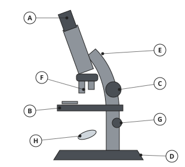
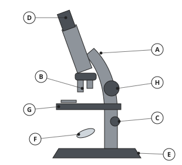
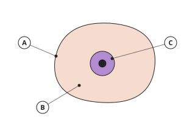
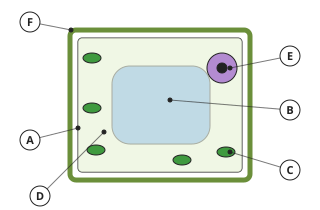
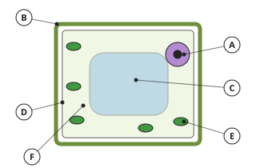
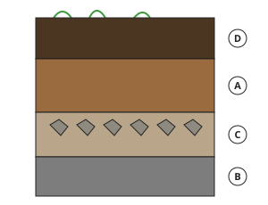

# Biology Form 1, Batch B1: drafts for review (Lessons 1–9, 13–21)

Generated by `npm run review:biology` from `content/biology/*.json`. Every question and drawing below was built by the engine.
All notes, teach cards, worked examples and paper tasks are **status: draft**. “Authored key” means a person fixed the
right answer (see `AUTHORED.md`); “computed by rule” means code worked it out (a formula, a conversion, a spelling rule).

Teach mode: cards (idea + example + 1 level-1 check) → worked example → practice (levels 1–3) → the note as a summary.

## Sample rendered lesson: Lesson 7 in teach mode

### Lesson 7: Equipment used to study living things (five senses, hand lens, microscope, etc.)

**Card bc7-1** (draft)

> A microscope has an eyepiece, objective lenses, a stage, a mirror or lamp, focus knobs, an arm and a base.
>
> _You look through the eyepiece; the slide sits on the stage._  

Check question: `b7-part` · multiple choice, level 1 · **authored key**, reused from practice

> What is the part labelled B?

- ✅ mirror
- ◻️ arm  
  _↳ feedback if chosen: Look again at what the letter is next to._
- ◻️ base  
  _↳ feedback if chosen: Look again at what the letter is next to._
- ◻️ eyepiece  
  _↳ feedback if chosen: Look again at what the letter is next to._

Full working after a second miss:

> Letter B is next to the mirror.  
> The mirror reflects light up through the specimen.  

**Card bc7-2** (draft)

> Total magnification = eyepiece × objective.
>
> _×10 eyepiece and ×4 objective: 10 × 4 = ×40._  

Check question: `b7-mag` · number, level 1 · computed by rule, reused from practice

> A microscope has a ×10 eyepiece and a ×100 objective. What is the total magnification?

Answer: **1000**
- Typed **110** (add) → “Multiply the two magnifications; do not add them.”

Full working after a second miss:

> Total magnification = eyepiece × objective.  
> 10 × 100 = 1000.  

**Card bc7-3** (draft)

> A hand lens magnifies a little; a microscope magnifies much more and shows cells.
>
> _A hand lens shows the hairs on a leaf; a microscope shows its cells._  

Check question: `b7-letter` · multiple choice, level 1 · **authored key**, reused from practice

> Which letter shows the fine focus knob?

- ◻️ C  
  _↳ feedback if chosen: That letter is next to a different part._
- ◻️ B  
  _↳ feedback if chosen: That letter is next to a different part._
- ◻️ A  
  _↳ feedback if chosen: That letter is next to a different part._
- ✅ G

Full working after a second miss:

> The fine focus knob is labelled G.  

**Worked example** (draft)

> A microscope has a ×10 eyepiece and a ×40 objective. What is the total magnification?

1. Total magnification = eyepiece × objective.
2. 10 × 40 = 400.

**Answer:** ×400

**Practice** (one generated question per template, easiest first)

Practice 1: `b7-part` · multiple choice, level 1 · **authored key**

> What is the part labelled H?

- ◻️ eyepiece  
  _↳ feedback if chosen: Look again at what the letter is next to._
- ◻️ base  
  _↳ feedback if chosen: Look again at what the letter is next to._
- ✅ coarse focus knob
- ◻️ arm  
  _↳ feedback if chosen: Look again at what the letter is next to._

Full working after a second miss:

> Letter H is next to the coarse focus knob.  
> The coarse focus knob moves the lenses a lot, to focus roughly.  

Practice 2: `b7-letter` · multiple choice, level 1 · **authored key**

> Which letter shows the stage?

- ◻️ D  
  _↳ feedback if chosen: That letter is next to a different part._
- ◻️ A  
  _↳ feedback if chosen: That letter is next to a different part._
- ✅ F
- ◻️ E  
  _↳ feedback if chosen: That letter is next to a different part._

Full working after a second miss:

> The stage is labelled F.  

Practice 3: `b7-mag` · number, level 1 · computed by rule

> A microscope has a ×5 eyepiece and a ×100 objective. What is the total magnification?

Answer: **500**
- Typed **105** (add) → “Multiply the two magnifications; do not add them.”

Full working after a second miss:

> Total magnification = eyepiece × objective.  
> 5 × 100 = 500.  

Practice 4: `b7-use` · multiple choice, level 2 · **authored key**

> Which part of the microscope makes the image sharp with a small movement?

- ✅ fine focus knob
- ◻️ stage  
  _↳ feedback if chosen: That part has a different job._
- ◻️ arm  
  _↳ feedback if chosen: That part has a different job._
- ◻️ base  
  _↳ feedback if chosen: That part has a different job._

Full working after a second miss:

> Fine focus knob: makes the image sharp with a small movement.  
> Answer: fine focus knob.  

Practice 5: `b7-objective` · number, level 3 · computed by rule

> The total magnification is ×600 and the eyepiece is ×15. What is the magnification of the objective lens?

Answer: **40**
- Typed **9000** (times) → “Divide the total by the eyepiece magnification.”

Full working after a second miss:

> Total = eyepiece × objective, so objective = total ÷ eyepiece.  
> 600 ÷ 15 = 40.  

**Summary (the note)**

> We study living things first with our five senses: sight, hearing, touch, smell (and taste only at home with food, never in the laboratory).
> A hand lens magnifies a little (about five to ten times).
> A compound light microscope magnifies much more. Its parts: eyepiece, objective lenses (on a turning nosepiece), stage with clips, mirror or lamp, coarse focus knob, fine focus knob, arm and base.
> Total magnification = eyepiece magnification × objective magnification. With a ×10 eyepiece and a ×40 objective, the total is ×400.
> The image under a microscope is upside down and the wrong way round.

## All drafts

| Lesson | Title (sheet) | Status | Cards | Practice | Paper task |
|---|---|---|---|---|---|
| 1 | Notion of Biology | draft | 3 | 4 | — |
| 2 | Characteristics of living things | draft | 3 | 4 | — |
| 3 | Differences between living and non-living things/plants and animals | draft | 3 | 4 | — |
| 4 | Studying living things: The scientific approach | draft | 3 | 4 | — |
| 5 | Studying living things: In the laboratory and their natural environment | draft | 3 | 4 | — |
| 6 | Experiment 1: Introduction to the laboratory: Safety rules, identification of equipment, uses and care | draft | 3 | 4 | — |
| 7 | Equipment used to study living things (five senses, hand lens, microscope, etc.) | draft | 3 | 5 | — |
| 8 | Experiment 2: Use of hand lens and compound light microscope | draft | 3 | 5 | — |
| 9 | The cell: Notion, discovery, types | draft | 3 | 5 | — |
| 13 | Observing cells: structure, functions of parts, differences between plant and animal cells | draft | 3 | 6 | — |
| 14 | Experiment 3: Observing plant and animal cells | draft | 3 | 5 | — |
| 15 | Notions, environmental factors (climatic and edaphic) | draft | 3 | 4 | — |
| 16 | Effects of Day and night/Seasons | draft | 3 | 4 | — |
| 17 | Interactions between living organisms - feeding, reproduction, etc | draft | 3 | 4 | — |
| 18 | Experiment 4: Collection of biological specimens | draft | 3 | 4 | — |
| 19 | Notion, formation, composition, types | draft | 3 | 5 | — |
| 20 | Qualities of good soils and improving soil quality | draft | 3 | 4 | — |
| 21 | Responsible farming practices | draft | 3 | 4 | — |

## Lesson 1: Notion of Biology

Prerequisites: none · Skill: b1 (What biology is)

**Note** (draft)

> Biology is the study of living things (organisms): plants, animals, people and micro-organisms.
> Branches of biology:
> • botany: plants;
> • zoology: animals;
> • microbiology: micro-organisms such as bacteria;
> • ecology: living things and their environment;
> • anatomy: the structure of the body;
> • physiology: how the parts of the body work;
> • genetics: how features pass from parents to children.
> Why study biology? To keep healthy and fight disease, to grow more food, to protect plants, animals and the environment, and for careers such as doctor, nurse, pharmacist, veterinary doctor (vet), laboratory technician, agronomist and forester.

**Card bc1-1** (draft)

> Biology is the study of living things: plants, animals, people and micro-organisms.
>
> _How a mango tree grows and how a goat digests grass are biology questions._  

Check question: `bc1-1-check` · multiple choice, level 1 · **authored key**

> Which question is a biology question?

- ◻️ What is table salt made of?  
  _↳ feedback if chosen: That is Chemistry._
- ✅ How do mosquitoes spread malaria?
- ◻️ How do you add fractions?  
  _↳ feedback if chosen: That is Mathematics._
- ◻️ How fast does a car move?  
  _↳ feedback if chosen: That is Physics._

Full working after a second miss:

> The true statement is “How do mosquitoes spread malaria?”.  
> “What is table salt made of?” is false: That is Chemistry.  
> “How do you add fractions?” is false: That is Mathematics.  
> “How fast does a car move?” is false: That is Physics.  

**Card bc1-2** (draft)

> Biology has branches: botany (plants), zoology (animals), microbiology (micro-organisms), ecology, anatomy, physiology, genetics.
>
> _A zoologist studies animals such as gorillas in the forest._  

Check question: `b1-branch` · matching, level 1 · **authored key**, reused from practice

> Match each branch of biology with what it studies.

Right-hand side (shuffled): living things and their environment · the structure of the body · plants · animals
- anatomy → **the structure of the body**
- ecology → **living things and their environment**
- zoology → **animals**
- botany → **plants**

Full working after a second miss:

> The right pairs are:  
> anatomy → the structure of the body  
> ecology → living things and their environment  
> zoology → animals  
> botany → plants  

**Card bc1-3** (draft)

> Biology helps us stay healthy, grow food and protect nature, and leads to many careers.
>
> _A vet treats sick animals; an agronomist helps farmers grow better crops._  

Check question: `b1-career` · multiple choice, level 1 · **authored key**, reused from practice

> Who cares for patients in hospital?

- ✅ a nurse
- ◻️ a vet  
  _↳ feedback if chosen: Not that career. Read what each person does._
- ◻️ a forester  
  _↳ feedback if chosen: Not that career. Read what each person does._
- ◻️ a pharmacist  
  _↳ feedback if chosen: Not that career. Read what each person does._

Full working after a second miss:

> A nurse: cares for patients in hospital.  
> Answer: a nurse.  

**Worked example** (draft)

> A scientist at Limbe Botanic Garden studies how cocoa trees grow, and another studies the bacteria that make yoghurt. Which branches of biology are they using?

1. Cocoa trees are plants: botany.
2. Bacteria are micro-organisms: microbiology.

**Answer:** Botany and microbiology.

**Practice** `b1-branch` · matching, level 1 · **authored key**

> Match each branch of biology with what it studies.

Right-hand side (shuffled): animals · living things and their environment · how the parts of the body work · how features pass from parents to offspring
- physiology → **how the parts of the body work**
- ecology → **living things and their environment**
- genetics → **how features pass from parents to offspring**
- zoology → **animals**

Full working after a second miss:

> The right pairs are:  
> physiology → how the parts of the body work  
> ecology → living things and their environment  
> genetics → how features pass from parents to offspring  
> zoology → animals  

> Match each branch of biology with what it studies.

Right-hand side (shuffled): living things and their environment · how the parts of the body work · micro-organisms such as bacteria · the structure of the body
- anatomy → **the structure of the body**
- microbiology → **micro-organisms such as bacteria**
- ecology → **living things and their environment**
- physiology → **how the parts of the body work**

Full working after a second miss:

> The right pairs are:  
> anatomy → the structure of the body  
> microbiology → micro-organisms such as bacteria  
> ecology → living things and their environment  
> physiology → how the parts of the body work  

**Practice** `b1-career` · multiple choice, level 1 · **authored key**

> Who helps farmers grow better crops?

- ◻️ a nurse  
  _↳ feedback if chosen: Not that career. Read what each person does._
- ◻️ a forester  
  _↳ feedback if chosen: Not that career. Read what each person does._
- ◻️ a laboratory technician  
  _↳ feedback if chosen: Not that career. Read what each person does._
- ✅ an agronomist

Full working after a second miss:

> An agronomist: helps farmers grow better crops.  
> Answer: an agronomist.  

> Who tests blood and other samples?

- ◻️ a pharmacist  
  _↳ feedback if chosen: Not that career. Read what each person does._
- ◻️ a nurse  
  _↳ feedback if chosen: Not that career. Read what each person does._
- ◻️ an agronomist  
  _↳ feedback if chosen: Not that career. Read what each person does._
- ✅ a laboratory technician

Full working after a second miss:

> A laboratory technician: tests blood and other samples.  
> Answer: a laboratory technician.  

**Practice** `b1-which` · multiple choice, level 2 · **authored key**

> Which branch of biology studies how bees pollinate flowers?

- ✅ ecology
- ◻️ zoology  
  _↳ feedback if chosen: Not that branch. Read what each branch studies._
- ◻️ genetics  
  _↳ feedback if chosen: Not that branch. Read what each branch studies._
- ◻️ anatomy  
  _↳ feedback if chosen: Not that branch. Read what each branch studies._

Full working after a second miss:

> Ecology: how bees pollinate flowers.  
> Answer: ecology.  

> Which branch of biology studies why a child has her mother’s eyes?

- ◻️ physiology  
  _↳ feedback if chosen: Not that branch. Read what each branch studies._
- ◻️ zoology  
  _↳ feedback if chosen: Not that branch. Read what each branch studies._
- ◻️ microbiology  
  _↳ feedback if chosen: Not that branch. Read what each branch studies._
- ✅ genetics

Full working after a second miss:

> Genetics: why a child has her mother’s eyes.  
> Answer: genetics.  

**Practice** `b1-spot` · spot the error, level 3 · **authored key**

> One sentence is wrong. Which one?

- ◻️ Zoology is the study of animals.
- ◻️ Ecology studies living things and their environment.
- ◻️ Botany is the study of plants.
- ✅ Microbiology studies very large animals.  
  _↳ explanation: Microbiology studies micro-organisms._

Full working after a second miss:

> The wrong statement is “Microbiology studies very large animals.”.  
> Microbiology studies micro-organisms.  

> One sentence is wrong. Which one?

- ◻️ Biology helps doctors fight disease.
- ◻️ Botany is the study of plants.
- ✅ Biology only studies animals.  
  _↳ explanation: Biology studies all living things: plants, animals, people and micro-organisms._
- ◻️ Zoology is the study of animals.

Full working after a second miss:

> The wrong statement is “Biology only studies animals.”.  
> Biology studies all living things: plants, animals, people and micro-organisms.  

## Lesson 2: Characteristics of living things

Prerequisites: 1 · Skill: b2 (Characteristics of living things)

**Note** (draft)

> All living things share seven characteristics. Remember MRS GREN:
> • Movement: moving the body or a part of it (a plant turns its leaves to the light);
> • Respiration: releasing energy from food;
> • Sensitivity: noticing and responding to changes (light, heat, touch);
> • Growth: getting bigger;
> • Reproduction: making young ones;
> • Excretion: getting rid of waste made in the body (urine, carbon dioxide, sweat);
> • Nutrition: taking in food (animals) or making it (green plants).
> A thing is living only if it shows all seven. A car moves and uses fuel, but it does not grow or reproduce, so it is not living.

**Card bc2-1** (draft)

> Living things share seven characteristics: Movement, Respiration, Sensitivity, Growth, Reproduction, Excretion, Nutrition (MRS GREN).
>
> _A goat moves, breathes, feels, grows, has kids, excretes and eats._  

Check question: `b2-match` · matching, level 1 · **authored key**, reused from practice

> Match each characteristic of living things with its meaning.

Right-hand side (shuffled): moving the body or a part of it · taking in or making food · noticing and responding to changes around · getting rid of waste made in the body
- nutrition → **taking in or making food**
- excretion → **getting rid of waste made in the body**
- sensitivity → **noticing and responding to changes around**
- movement → **moving the body or a part of it**

Full working after a second miss:

> The right pairs are:  
> nutrition → taking in or making food  
> excretion → getting rid of waste made in the body  
> sensitivity → noticing and responding to changes around  
> movement → moving the body or a part of it  

**Card bc2-2** (draft)

> Plants show them too: leaves turn to the light (movement, sensitivity), plants grow, make seeds and make their own food.
>
> _A bean seedling bends towards the window._  

Check question: `b2-which` · multiple choice, level 1 · **authored key**, reused from practice

> Which characteristic of living things is shown?
> We breathe out carbon dioxide made in our cells.

- ✅ excretion
- ◻️ sensitivity  
  _↳ feedback if chosen: Not that one. Read MRS GREN again._
- ◻️ nutrition  
  _↳ feedback if chosen: Not that one. Read MRS GREN again._
- ◻️ movement  
  _↳ feedback if chosen: Not that one. Read MRS GREN again._

Full working after a second miss:

> Excretion: We breathe out carbon dioxide made in our cells.  
> Answer: excretion.  

**Card bc2-3** (draft)

> A thing is living only if it shows all seven characteristics.
>
> _A car moves but does not grow or reproduce: it is not living._  

Check question: `bc2-3-check` · multiple choice, level 1 · **authored key**

> Which of these is a living thing?

- ◻️ a car  
  _↳ feedback if chosen: A car does not grow or reproduce._
- ◻️ a stone  
  _↳ feedback if chosen: A stone shows none of the characteristics._
- ◻️ the wind  
  _↳ feedback if chosen: The wind is not living._
- ✅ a mushroom

Full working after a second miss:

> The true statement is “a mushroom”.  
> “a car” is false: A car does not grow or reproduce.  
> “a stone” is false: A stone shows none of the characteristics.  
> “the wind” is false: The wind is not living.  

**Worked example** (draft)

> A fire grows bigger, moves and uses air. Is fire a living thing?

1. Check MRS GREN.
2. A fire does not reproduce young ones, has no sensitivity and does not excrete waste made in a body.
3. It does not show all seven characteristics.

**Answer:** No, fire is not living.

**Practice** `b2-match` · matching, level 1 · **authored key**

> Match each characteristic of living things with its meaning.

Right-hand side (shuffled): releasing energy from food · noticing and responding to changes around · getting rid of waste made in the body · moving the body or a part of it
- excretion → **getting rid of waste made in the body**
- respiration → **releasing energy from food**
- movement → **moving the body or a part of it**
- sensitivity → **noticing and responding to changes around**

Full working after a second miss:

> The right pairs are:  
> excretion → getting rid of waste made in the body  
> respiration → releasing energy from food  
> movement → moving the body or a part of it  
> sensitivity → noticing and responding to changes around  

> Match each characteristic of living things with its meaning.

Right-hand side (shuffled): noticing and responding to changes around · moving the body or a part of it · releasing energy from food · getting bigger
- movement → **moving the body or a part of it**
- sensitivity → **noticing and responding to changes around**
- growth → **getting bigger**
- respiration → **releasing energy from food**

Full working after a second miss:

> The right pairs are:  
> movement → moving the body or a part of it  
> sensitivity → noticing and responding to changes around  
> growth → getting bigger  
> respiration → releasing energy from food  

**Practice** `b2-which` · multiple choice, level 1 · **authored key**

> Which characteristic of living things is shown?
> A baby becomes a child, then an adult.

- ◻️ sensitivity  
  _↳ feedback if chosen: Not that one. Read MRS GREN again._
- ◻️ reproduction  
  _↳ feedback if chosen: Not that one. Read MRS GREN again._
- ◻️ movement  
  _↳ feedback if chosen: Not that one. Read MRS GREN again._
- ✅ growth

Full working after a second miss:

> Growth: A baby becomes a child, then an adult.  
> Answer: growth.  

> Which characteristic of living things is shown?
> A sunflower turns to face the sun.

- ◻️ movement  
  _↳ feedback if chosen: Not that one. Read MRS GREN again._
- ◻️ nutrition  
  _↳ feedback if chosen: Not that one. Read MRS GREN again._
- ◻️ excretion  
  _↳ feedback if chosen: Not that one. Read MRS GREN again._
- ✅ sensitivity

Full working after a second miss:

> Sensitivity: A sunflower turns to face the sun.  
> Answer: sensitivity.  

**Practice** `b2-sort` · matching, level 2 · **authored key**

> Sort these: living or non-living?

Groups: living · non-living
- a cockroach → **living**
- a radio → **non-living**
- a stone → **non-living**
- a mango tree → **living**
- a fire → **non-living**
- bacteria → **living**

Full working after a second miss:

> The right pairs are:  
> a cockroach → living  
> a radio → non-living  
> a stone → non-living  
> a mango tree → living  
> a fire → non-living  
> bacteria → living  

> Sort these: living or non-living?

Groups: living · non-living
- bacteria → **living**
- a mushroom → **living**
- a car → **non-living**
- a fire → **non-living**
- a stone → **non-living**
- a radio → **non-living**

Full working after a second miss:

> The right pairs are:  
> bacteria → living  
> a mushroom → living  
> a car → non-living  
> a fire → non-living  
> a stone → non-living  
> a radio → non-living  

**Practice** `b2-spot` · spot the error, level 3 · **authored key**

> One sentence is wrong. Which one?

- ◻️ All living things reproduce.
- ✅ Plants do not need nutrition.  
  _↳ explanation: Green plants make their own food: that is nutrition._
- ◻️ Excretion is getting rid of waste made in the body.
- ◻️ Plants can respond to light.

Full working after a second miss:

> The wrong statement is “Plants do not need nutrition.”.  
> Green plants make their own food: that is nutrition.  

> One sentence is wrong. Which one?

- ◻️ Excretion is getting rid of waste made in the body.
- ◻️ Respiration releases energy from food.
- ◻️ All living things reproduce.
- ✅ A car is living because it moves.  
  _↳ explanation: A car does not grow or reproduce._

Full working after a second miss:

> The wrong statement is “A car is living because it moves.”.  
> A car does not grow or reproduce.  

## Lesson 3: Differences between living and non-living things/plants and animals

Prerequisites: 2 · Skill: b3 (Living and non-living; plants and animals)

**Note** (draft)

> Living things show all seven characteristics (MRS GREN); non-living things do not.
> Differences between plants and animals:
> • Plants make their own food by photosynthesis, using sunlight; animals eat food.
> • Most plants are green: they contain chlorophyll. Animals have none.
> • Plants stay in one place (they move only parts, slowly); most animals move from place to place.
> • Plants grow all their lives; most animals stop growing when adult.
> • Plant cells have a cell wall; animal cells do not.
> • Animals respond quickly (nerves, muscles); plants respond slowly.

**Card bc3-1** (draft)

> Plants make their own food using sunlight (photosynthesis); animals must eat food.
>
> _A maize plant makes sugar in its green leaves; a goat eats the leaves._  

Check question: `b3-diff` · multiple choice, level 1 · **authored key**, reused from practice

> Which one moves from place to place?

- ◻️ a plant  
  _↳ feedback if chosen: Think about food, movement and growth._
- ✅ an animal

Full working after a second miss:

> An animal: moves from place to place.  
> Answer: an animal.  

**Card bc3-2** (draft)

> Plants stay in one place and grow all their lives; most animals move about and stop growing when adult.
>
> _A tree keeps growing taller for many years._  

Check question: `b3-sort` · matching, level 1 · **authored key**, reused from practice

> Sort these: plant or animal?

Groups: plant · animal
- a fern → **plant**
- a frog → **animal**
- an orchid → **plant**
- a mango tree → **plant**
- a goat → **animal**
- cassava → **plant**

Full working after a second miss:

> The right pairs are:  
> a fern → plant  
> a frog → animal  
> an orchid → plant  
> a mango tree → plant  
> a goat → animal  
> cassava → plant  

**Card bc3-3** (draft)

> Plant cells have a cell wall and chlorophyll; animal cells have neither.
>
> _Chlorophyll makes leaves green._  

Check question: `bc3-3-check` · multiple choice, level 1 · **authored key**

> Which is true of plants but not animals?

- ◻️ They reproduce.  
  _↳ feedback if chosen: Animals reproduce too._
- ◻️ They grow.  
  _↳ feedback if chosen: Animals grow too._
- ◻️ They need water.  
  _↳ feedback if chosen: Animals need water too._
- ✅ They contain chlorophyll.

Full working after a second miss:

> The true statement is “They contain chlorophyll.”.  
> “They reproduce.” is false: Animals reproduce too.  
> “They grow.” is false: Animals grow too.  
> “They need water.” is false: Animals need water too.  

**Worked example** (draft)

> Give two ways in which a cassava plant is different from a goat.

1. The cassava plant makes its own food using sunlight; the goat must eat food.
2. The cassava plant stays in one place; the goat moves from place to place.

**Answer:** It makes its own food, and it does not move from place to place.

**Practice** `b3-diff` · multiple choice, level 1 · **authored key**

> Which one stops growing when adult?

- ✅ an animal
- ◻️ a plant  
  _↳ feedback if chosen: Think about food, movement and growth._

Full working after a second miss:

> An animal: stops growing when adult.  
> Answer: an animal.  

> Which one contains green chlorophyll?

- ✅ a plant
- ◻️ an animal  
  _↳ feedback if chosen: Think about food, movement and growth._

Full working after a second miss:

> A plant: contains green chlorophyll.  
> Answer: a plant.  

**Practice** `b3-sort` · matching, level 1 · **authored key**

> Sort these: plant or animal?

Groups: plant · animal
- a snail → **animal**
- a mango tree → **plant**
- a butterfly → **animal**
- a fern → **plant**
- grass → **plant**
- cassava → **plant**

Full working after a second miss:

> The right pairs are:  
> a snail → animal  
> a mango tree → plant  
> a butterfly → animal  
> a fern → plant  
> grass → plant  
> cassava → plant  

> Sort these: plant or animal?

Groups: plant · animal
- cassava → **plant**
- an orchid → **plant**
- a butterfly → **animal**
- grass → **plant**
- a fern → **plant**
- a snail → **animal**

Full working after a second miss:

> The right pairs are:  
> cassava → plant  
> an orchid → plant  
> a butterfly → animal  
> grass → plant  
> a fern → plant  
> a snail → animal  

**Practice** `b3-why` · multiple choice, level 2 · **authored key**

> Why do plants not need to move about to find food?

- ◻️ Animals bring food to them.  
  _↳ feedback if chosen: Plants make their own food._
- ✅ They make their own food using sunlight, water and carbon dioxide.
- ◻️ They do not need food.  
  _↳ feedback if chosen: All living things need food; plants make theirs._
- ◻️ They sleep all the time.  
  _↳ feedback if chosen: Plants make their own food by photosynthesis._

Full working after a second miss:

> The true statement is “They make their own food using sunlight, water and carbon dioxide.”.  
> “Animals bring food to them.” is false: Plants make their own food.  
> “They do not need food.” is false: All living things need food; plants make theirs.  
> “They sleep all the time.” is false: Plants make their own food by photosynthesis.  

> Why do plants not need to move about to find food?

- ◻️ They do not need food.  
  _↳ feedback if chosen: All living things need food; plants make theirs._
- ✅ They make their own food using sunlight, water and carbon dioxide.
- ◻️ Animals bring food to them.  
  _↳ feedback if chosen: Plants make their own food._
- ◻️ They sleep all the time.  
  _↳ feedback if chosen: Plants make their own food by photosynthesis._

Full working after a second miss:

> The true statement is “They make their own food using sunlight, water and carbon dioxide.”.  
> “They do not need food.” is false: All living things need food; plants make theirs.  
> “Animals bring food to them.” is false: Plants make their own food.  
> “They sleep all the time.” is false: Plants make their own food by photosynthesis.  

**Practice** `b3-spot` · spot the error, level 3 · **authored key**

> One sentence is wrong. Which one?

- ◻️ Chlorophyll makes plants green.
- ◻️ Plants make their own food.
- ✅ Plants stop growing when they are a year old.  
  _↳ explanation: Plants grow all their lives._
- ◻️ Plant cells have a cell wall.

Full working after a second miss:

> The wrong statement is “Plants stop growing when they are a year old.”.  
> Plants grow all their lives.  

> One sentence is wrong. Which one?

- ◻️ Plant cells have a cell wall.
- ✅ Animal cells have a cell wall.  
  _↳ explanation: Animal cells have no cell wall._
- ◻️ Plants make their own food.
- ◻️ Chlorophyll makes plants green.

Full working after a second miss:

> The wrong statement is “Animal cells have a cell wall.”.  
> Animal cells have no cell wall.  

## Lesson 4: Studying living things: The scientific approach

Prerequisites: 1 · Skill: b4 (The scientific approach)

**Note** (draft)

> Biologists find out about living things with the scientific approach:
> 1. Observe and ask a question (Why are the leaves of this plant yellow?).
> 2. Make a hypothesis: a possible answer that can be tested (It does not get enough light).
> 3. Plan and do an experiment to test it.
> 4. Record the results carefully (tables, drawings, measurements).
> 5. Draw a conclusion: was the hypothesis right?
> 6. Report what you found so others can check it.
> A fair test changes only one thing (the variable) and keeps everything else the same. A control is the set-up that is left unchanged, for comparison. Repeating an experiment makes the results more reliable.

**Card bc4-1** (draft)

> The scientific approach: observe and ask, make a hypothesis, experiment, record, conclude, report.
>
> _Observation: the leaves are yellow. Hypothesis: the plant lacks light._  

Check question: `b4-order` · ordering, level 1 · **authored key**, reused from practice

> Put the steps of the scientific approach in order.

Shown as: draw a conclusion · report what you found · observe and ask a question · record the results · make a hypothesis (a possible answer) · plan and do an experiment
Correct order: observe and ask a question → make a hypothesis (a possible answer) → plan and do an experiment → record the results → draw a conclusion → report what you found

Full working after a second miss:

> The correct order is: observe and ask a question → make a hypothesis (a possible answer) → plan and do an experiment → record the results → draw a conclusion → report what you found.  

**Card bc4-2** (draft)

> A hypothesis is a possible answer that can be tested by an experiment.
>
> _“Seeds need water to germinate” can be tested._  

Check question: `b4-hyp` · multiple choice, level 1 · **authored key**, reused from practice

> Which is a hypothesis?

- ◻️ I put the seeds in a dish.  
  _↳ feedback if chosen: That is part of the experiment._
- ◻️ Why are the leaves yellow?  
  _↳ feedback if chosen: That is a question. A hypothesis is a possible answer._
- ✅ Seeds need water to germinate.
- ◻️ Write a report.  
  _↳ feedback if chosen: That is the last step._

Full working after a second miss:

> The true statement is “Seeds need water to germinate.”.  
> “I put the seeds in a dish.” is false: That is part of the experiment.  
> “Why are the leaves yellow?” is false: That is a question. A hypothesis is a possible answer.  
> “Write a report.” is false: That is the last step.  

**Card bc4-3** (draft)

> A fair test changes only one thing and keeps everything else the same; the control is used for comparison.
>
> _Same seeds, same place, same temperature: only the water changes._  

Check question: `bc4-3-check` · multiple choice, level 1 · **authored key**

> What makes an experiment a fair test?

- ◻️ Everything is changed at once.  
  _↳ feedback if chosen: Then you cannot tell which change caused the result._
- ◻️ The teacher does it alone.  
  _↳ feedback if chosen: Fairness is about changing only one thing._
- ✅ Only one thing is changed; everything else stays the same.
- ◻️ The experiment is done only once.  
  _↳ feedback if chosen: Repeating makes it more reliable, but fairness means changing one thing._

Full working after a second miss:

> The true statement is “Only one thing is changed; everything else stays the same.”.  
> “Everything is changed at once.” is false: Then you cannot tell which change caused the result.  
> “The teacher does it alone.” is false: Fairness is about changing only one thing.  
> “The experiment is done only once.” is false: Repeating makes it more reliable, but fairness means changing one thing.  

**Worked example** (draft)

> Mbah wants to know if bean seeds need water to germinate. He puts seeds on wet cotton in one dish and on dry cotton in another, both in the same warm place. Which dish is the control, and why is it a fair test?

1. Only one thing is different: water.
2. The temperature, light and kind of seed are the same.
3. The dish with wet cotton shows normal conditions to compare with: it is the control.

**Answer:** Wet cotton is the control; only the water is changed, so it is fair.

**Practice** `b4-order` · ordering, level 1 · **authored key**

> Put the steps of the scientific approach in order.

Shown as: observe and ask a question · make a hypothesis (a possible answer) · record the results · report what you found · plan and do an experiment · draw a conclusion
Correct order: observe and ask a question → make a hypothesis (a possible answer) → plan and do an experiment → record the results → draw a conclusion → report what you found

Full working after a second miss:

> The correct order is: observe and ask a question → make a hypothesis (a possible answer) → plan and do an experiment → record the results → draw a conclusion → report what you found.  

> Put the steps of the scientific approach in order.

Shown as: draw a conclusion · report what you found · make a hypothesis (a possible answer) · plan and do an experiment · record the results · observe and ask a question
Correct order: observe and ask a question → make a hypothesis (a possible answer) → plan and do an experiment → record the results → draw a conclusion → report what you found

Full working after a second miss:

> The correct order is: observe and ask a question → make a hypothesis (a possible answer) → plan and do an experiment → record the results → draw a conclusion → report what you found.  

**Practice** `b4-hyp` · multiple choice, level 1 · **authored key**

> Which is a hypothesis?

- ◻️ I put the seeds in a dish.  
  _↳ feedback if chosen: That is part of the experiment._
- ✅ Seeds need water to germinate.
- ◻️ Why are the leaves yellow?  
  _↳ feedback if chosen: That is a question. A hypothesis is a possible answer._
- ◻️ Write a report.  
  _↳ feedback if chosen: That is the last step._

Full working after a second miss:

> The true statement is “Seeds need water to germinate.”.  
> “I put the seeds in a dish.” is false: That is part of the experiment.  
> “Why are the leaves yellow?” is false: That is a question. A hypothesis is a possible answer.  
> “Write a report.” is false: That is the last step.  

> Which is a hypothesis?

- ✅ Mosquitoes breed in still water.
- ◻️ I put the seeds in a dish.  
  _↳ feedback if chosen: That is part of the experiment._
- ◻️ Why are the leaves yellow?  
  _↳ feedback if chosen: That is a question. A hypothesis is a possible answer._
- ◻️ The seeds germinated in three days.  
  _↳ feedback if chosen: That is a result._

Full working after a second miss:

> The true statement is “Mosquitoes breed in still water.”.  
> “I put the seeds in a dish.” is false: That is part of the experiment.  
> “Why are the leaves yellow?” is false: That is a question. A hypothesis is a possible answer.  
> “The seeds germinated in three days.” is false: That is a result.  

**Practice** `b4-step` · multiple choice, level 2 · **authored key**

> Which step of the scientific approach is this?
> “The plants with fertiliser grew greener, so the soil lacked nitrogen.”

- ✅ drawing a conclusion
- ◻️ doing an experiment  
  _↳ feedback if chosen: Not that step. Read the steps in order again._
- ◻️ recording results  
  _↳ feedback if chosen: Not that step. Read the steps in order again._
- ◻️ observing  
  _↳ feedback if chosen: Not that step. Read the steps in order again._

Full working after a second miss:

> Drawing a conclusion: “The plants with fertiliser grew greener, so the soil lacked nitrogen.”.  
> Answer: drawing a conclusion.  

> Which step of the scientific approach is this?
> Measuring the height of each plant every week

- ◻️ making a hypothesis  
  _↳ feedback if chosen: Not that step. Read the steps in order again._
- ◻️ drawing a conclusion  
  _↳ feedback if chosen: Not that step. Read the steps in order again._
- ◻️ doing an experiment  
  _↳ feedback if chosen: Not that step. Read the steps in order again._
- ✅ recording results

Full working after a second miss:

> Recording results: Measuring the height of each plant every week.  
> Answer: recording results.  

**Practice** `b4-spot` · spot the error, level 3 · **authored key**

> One sentence is wrong. Which one?

- ◻️ Repeating an experiment makes results more reliable.
- ◻️ A hypothesis can be tested.
- ✅ In a fair test you change everything at once.  
  _↳ explanation: Change only one thing._
- ◻️ Results should be recorded carefully.

Full working after a second miss:

> The wrong statement is “In a fair test you change everything at once.”.  
> Change only one thing.  

> One sentence is wrong. Which one?

- ◻️ Repeating an experiment makes results more reliable.
- ◻️ Results should be recorded carefully.
- ◻️ A hypothesis can be tested.
- ✅ In a fair test you change everything at once.  
  _↳ explanation: Change only one thing._

Full working after a second miss:

> The wrong statement is “In a fair test you change everything at once.”.  
> Change only one thing.  

## Lesson 5: Studying living things: In the laboratory and their natural environment

Prerequisites: 4 · Skill: b5 (Studying living things in the field and the laboratory)

**Note** (draft)

> Living things can be studied in two places:
> • In their natural environment (field study): we see how they really live, what they eat, where they shelter and how they behave with other living things. Tools: notebook and pencil, hand lens, collecting bags and jars, sweep net, quadrat (a square frame for counting plants), camera.
> • In the laboratory: we can control the conditions, measure carefully and look closely with a microscope. But the organism is away from its real home.
> The two go together: observe in the field, then study samples in the laboratory.
> In the field: disturb living things as little as possible, return animals where you found them, and never collect protected species.

**Card bc5-1** (draft)

> A field study observes living things in their natural environment.
>
> _Counting the plants in a quadrat on the school field is a field study._  

Check question: `b5-where` · multiple choice, level 1 · **authored key**, reused from practice

> Where is this best done: looking at pond water through a microscope?

- ◻️ in the field  
  _↳ feedback if chosen: Think: real home, or controlled conditions?_
- ✅ in the laboratory

Full working after a second miss:

> In the laboratory: looking at pond water through a microscope.  
> Answer: in the laboratory.  

**Card bc5-2** (draft)

> In the laboratory we control conditions and look closely, for example with a microscope.
>
> _Pond water is brought to the lab to look for tiny organisms._  

Check question: `b5-tool` · matching, level 1 · **authored key**, reused from practice

> Match each tool with its use.

Right-hand side (shuffled): seeing small details · recording observations · keeping small animals for a short time · counting plants in a square area
- quadrat → **counting plants in a square area**
- collecting jar → **keeping small animals for a short time**
- notebook → **recording observations**
- hand lens → **seeing small details**

Full working after a second miss:

> The right pairs are:  
> quadrat → counting plants in a square area  
> collecting jar → keeping small animals for a short time  
> notebook → recording observations  
> hand lens → seeing small details  

**Card bc5-3** (draft)

> In the field: disturb as little as possible, return animals and never collect protected species.
>
> _A frog is looked at, then put back where it was found._  

Check question: `bc5-3-check` · multiple choice, level 1 · **authored key**

> What should you do with a frog after studying it in the field?

- ◻️ take it home as a pet  
  _↳ feedback if chosen: Return animals to where you found them._
- ✅ put it back where you found it
- ◻️ throw it far away  
  _↳ feedback if chosen: Put it back where it lives._
- ◻️ sell it  
  _↳ feedback if chosen: Return animals to where you found them._

Full working after a second miss:

> The true statement is “put it back where you found it”.  
> “take it home as a pet” is false: Return animals to where you found them.  
> “throw it far away” is false: Put it back where it lives.  
> “sell it” is false: Return animals to where you found them.  

**Worked example** (draft)

> To learn what weaver birds use to build their nests and where they build them, should Ewane study them in the field or in the laboratory?

1. Nest building happens in the birds’ real home, in trees near water and villages.
2. Watching them there shows the real behaviour.

**Answer:** In the field (their natural environment).

**Practice** `b5-where` · multiple choice, level 1 · **authored key**

> Where is this best done: measuring the temperature at which seeds germinate best, with everything else controlled?

- ✅ in the laboratory
- ◻️ in the field  
  _↳ feedback if chosen: Think: real home, or controlled conditions?_

Full working after a second miss:

> In the laboratory: measuring the temperature at which seeds germinate best, with everything else controlled.  
> Answer: in the laboratory.  

> Where is this best done: watching where weaver birds build nests?

- ◻️ in the laboratory  
  _↳ feedback if chosen: Think: real home, or controlled conditions?_
- ✅ in the field

Full working after a second miss:

> In the field: watching where weaver birds build nests.  
> Answer: in the field.  

**Practice** `b5-tool` · matching, level 1 · **authored key**

> Match each tool with its use.

Right-hand side (shuffled): catching insects in long grass · keeping small animals for a short time · counting plants in a square area · seeing small details
- quadrat → **counting plants in a square area**
- hand lens → **seeing small details**
- collecting jar → **keeping small animals for a short time**
- sweep net → **catching insects in long grass**

Full working after a second miss:

> The right pairs are:  
> quadrat → counting plants in a square area  
> hand lens → seeing small details  
> collecting jar → keeping small animals for a short time  
> sweep net → catching insects in long grass  

> Match each tool with its use.

Right-hand side (shuffled): keeping small animals for a short time · catching insects in long grass · seeing small details · counting plants in a square area
- collecting jar → **keeping small animals for a short time**
- quadrat → **counting plants in a square area**
- sweep net → **catching insects in long grass**
- hand lens → **seeing small details**

Full working after a second miss:

> The right pairs are:  
> collecting jar → keeping small animals for a short time  
> quadrat → counting plants in a square area  
> sweep net → catching insects in long grass  
> hand lens → seeing small details  

**Practice** `b5-adv` · multiple choice, level 2 · **authored key**

> What is an advantage of studying living things in the laboratory?

- ◻️ No equipment is needed.  
  _↳ feedback if chosen: The laboratory has special equipment._
- ◻️ You see how the organism lives in its real home.  
  _↳ feedback if chosen: That is an advantage of a field study._
- ◻️ You can collect protected species.  
  _↳ feedback if chosen: Protected species must not be collected._
- ✅ Conditions can be controlled and things looked at closely.

Full working after a second miss:

> The true statement is “Conditions can be controlled and things looked at closely.”.  
> “No equipment is needed.” is false: The laboratory has special equipment.  
> “You see how the organism lives in its real home.” is false: That is an advantage of a field study.  
> “You can collect protected species.” is false: Protected species must not be collected.  

> What is an advantage of studying living things in the laboratory?

- ◻️ You can collect protected species.  
  _↳ feedback if chosen: Protected species must not be collected._
- ✅ Conditions can be controlled and things looked at closely.
- ◻️ The organism is always happier there.  
  _↳ feedback if chosen: It is away from its real home._
- ◻️ You see how the organism lives in its real home.  
  _↳ feedback if chosen: That is an advantage of a field study._

Full working after a second miss:

> The true statement is “Conditions can be controlled and things looked at closely.”.  
> “You can collect protected species.” is false: Protected species must not be collected.  
> “The organism is always happier there.” is false: It is away from its real home.  
> “You see how the organism lives in its real home.” is false: That is an advantage of a field study.  

**Practice** `b5-spot` · spot the error, level 3 · **authored key**

> One sentence is wrong. Which one?

- ◻️ A quadrat is used to count plants.
- ✅ Protected species may be collected for fun.  
  _↳ explanation: Protected species must never be collected._
- ◻️ Animals should be returned after study.
- ◻️ A microscope is used in the laboratory.

Full working after a second miss:

> The wrong statement is “Protected species may be collected for fun.”.  
> Protected species must never be collected.  

> One sentence is wrong. Which one?

- ◻️ A microscope is used in the laboratory.
- ✅ A sweep net is used to look at cells.  
  _↳ explanation: A sweep net catches insects; a microscope shows cells._
- ◻️ Field studies show how organisms really live.
- ◻️ A quadrat is used to count plants.

Full working after a second miss:

> The wrong statement is “A sweep net is used to look at cells.”.  
> A sweep net catches insects; a microscope shows cells.  

## Lesson 6: Experiment 1: Introduction to the laboratory: Safety rules, identification of equipment, uses and care

Prerequisites: 5 · Skill: b6 (Laboratory safety and equipment)

**Note** (draft)

> This practical is done in the school laboratory with a teacher; here you prepare for it.
> Safety rules:
> • enter only with a teacher, and follow instructions;
> • never eat, drink or taste anything in the laboratory;
> • wash your hands after handling specimens and soil;
> • handle glass slides, scalpels and needles carefully; report any cut, spill or breakage at once;
> • tie back long hair; keep bags off the benches.
> Common equipment: microscope, hand lens, slides and cover slips, dropper, forceps, scalpel, petri dish, beaker.
> Care: carry a microscope with two hands (one under the base); clean and dry equipment after use; put everything back in its place.

**Card bc6-1** (draft)

> Laboratory rules: never eat, drink or taste anything; wash hands; report accidents at once.
>
> _Some specimens and chemicals can carry germs or be poisonous._  

Check question: `b6-rule` · multiple choice, level 1 · **authored key**, reused from practice

> Which is a safety rule in the biology laboratory?

- ◻️ Pick up broken glass with your hands.  
  _↳ feedback if chosen: Tell the teacher; do not touch broken glass._
- ◻️ Taste a specimen to identify it.  
  _↳ feedback if chosen: Never taste anything in the laboratory._
- ◻️ Run between the benches.  
  _↳ feedback if chosen: Running causes accidents._
- ✅ Report any accident to the teacher at once.

Full working after a second miss:

> The true statement is “Report any accident to the teacher at once.”.  
> “Pick up broken glass with your hands.” is false: Tell the teacher; do not touch broken glass.  
> “Taste a specimen to identify it.” is false: Never taste anything in the laboratory.  
> “Run between the benches.” is false: Running causes accidents.  

**Card bc6-2** (draft)

> Each piece of equipment has a job: forceps pick up, a scalpel cuts, a dropper adds drops.
>
> _Forceps lift a thin onion skin without tearing it._  

Check question: `b6-equip` · matching, level 1 · **authored key**, reused from practice

> Match each piece of equipment with its use.

Right-hand side (shuffled): hold a specimen to look at under the microscope · holds and measures liquids roughly · pick up small or delicate things · holds small samples or growing seeds
- beaker → **holds and measures liquids roughly**
- slide and cover slip → **hold a specimen to look at under the microscope**
- petri dish → **holds small samples or growing seeds**
- forceps → **pick up small or delicate things**

Full working after a second miss:

> The right pairs are:  
> beaker → holds and measures liquids roughly  
> slide and cover slip → hold a specimen to look at under the microscope  
> petri dish → holds small samples or growing seeds  
> forceps → pick up small or delicate things  

**Card bc6-3** (draft)

> Care for equipment: carry a microscope with two hands, clean and dry things, put them back.
>
> _One hand holds the arm, the other supports the base._  

Check question: `bc6-3-check` · multiple choice, level 1 · **authored key**

> How should you carry a microscope?

- ◻️ by the eyepiece  
  _↳ feedback if chosen: The eyepiece can fall out._
- ◻️ upside down  
  _↳ feedback if chosen: Parts can fall out._
- ◻️ with one hand, swinging it  
  _↳ feedback if chosen: It can fall and break._
- ✅ with two hands: one on the arm and one under the base

Full working after a second miss:

> The true statement is “with two hands: one on the arm and one under the base”.  
> “by the eyepiece” is false: The eyepiece can fall out.  
> “upside down” is false: Parts can fall out.  
> “with one hand, swinging it” is false: It can fall and break.  

**Worked example** (draft)

> Sirri drops a glass slide and it breaks on the floor. What should Sirri do?

1. Do not pick up the broken glass with bare hands.
2. Tell the teacher at once.
3. The teacher clears it safely, for example with a brush and dustpan.

**Answer:** Leave the glass, tell the teacher at once.

**Practice** `b6-rule` · multiple choice, level 1 · **authored key**

> Which is a safety rule in the biology laboratory?

- ◻️ Hide a spill so you are not blamed.  
  _↳ feedback if chosen: Report spills at once._
- ◻️ Run between the benches.  
  _↳ feedback if chosen: Running causes accidents._
- ◻️ Pick up broken glass with your hands.  
  _↳ feedback if chosen: Tell the teacher; do not touch broken glass._
- ✅ Handle scalpels carefully.

Full working after a second miss:

> The true statement is “Handle scalpels carefully.”.  
> “Hide a spill so you are not blamed.” is false: Report spills at once.  
> “Run between the benches.” is false: Running causes accidents.  
> “Pick up broken glass with your hands.” is false: Tell the teacher; do not touch broken glass.  

> Which is a safety rule in the biology laboratory?

- ✅ Handle scalpels carefully.
- ◻️ Hide a spill so you are not blamed.  
  _↳ feedback if chosen: Report spills at once._
- ◻️ Pick up broken glass with your hands.  
  _↳ feedback if chosen: Tell the teacher; do not touch broken glass._
- ◻️ Run between the benches.  
  _↳ feedback if chosen: Running causes accidents._

Full working after a second miss:

> The true statement is “Handle scalpels carefully.”.  
> “Hide a spill so you are not blamed.” is false: Report spills at once.  
> “Pick up broken glass with your hands.” is false: Tell the teacher; do not touch broken glass.  
> “Run between the benches.” is false: Running causes accidents.  

**Practice** `b6-equip` · matching, level 1 · **authored key**

> Match each piece of equipment with its use.

Right-hand side (shuffled): holds and measures liquids roughly · adds liquids drop by drop · magnifies small details a little · cuts thin pieces of a specimen
- beaker → **holds and measures liquids roughly**
- dropper → **adds liquids drop by drop**
- scalpel → **cuts thin pieces of a specimen**
- hand lens → **magnifies small details a little**

Full working after a second miss:

> The right pairs are:  
> beaker → holds and measures liquids roughly  
> dropper → adds liquids drop by drop  
> scalpel → cuts thin pieces of a specimen  
> hand lens → magnifies small details a little  

> Match each piece of equipment with its use.

Right-hand side (shuffled): adds liquids drop by drop · pick up small or delicate things · hold a specimen to look at under the microscope · magnifies small details a little
- forceps → **pick up small or delicate things**
- dropper → **adds liquids drop by drop**
- slide and cover slip → **hold a specimen to look at under the microscope**
- hand lens → **magnifies small details a little**

Full working after a second miss:

> The right pairs are:  
> forceps → pick up small or delicate things  
> dropper → adds liquids drop by drop  
> slide and cover slip → hold a specimen to look at under the microscope  
> hand lens → magnifies small details a little  

**Practice** `b6-sort` · matching, level 2 · **authored key**

> Sort these: safe or unsafe in the laboratory?

Groups: safe · unsafe
- pointing a scalpel at a friend → **unsafe**
- tying back long hair → **safe**
- tasting a leaf specimen → **unsafe**
- leaving a broken slide on the floor → **unsafe**
- eating biscuits at the bench → **unsafe**
- telling the teacher about a cut → **safe**

Full working after a second miss:

> The right pairs are:  
> pointing a scalpel at a friend → unsafe  
> tying back long hair → safe  
> tasting a leaf specimen → unsafe  
> leaving a broken slide on the floor → unsafe  
> eating biscuits at the bench → unsafe  
> telling the teacher about a cut → safe  

> Sort these: safe or unsafe in the laboratory?

Groups: safe · unsafe
- pointing a scalpel at a friend → **unsafe**
- telling the teacher about a cut → **safe**
- tasting a leaf specimen → **unsafe**
- tying back long hair → **safe**
- carrying the microscope with two hands → **safe**
- leaving a broken slide on the floor → **unsafe**

Full working after a second miss:

> The right pairs are:  
> pointing a scalpel at a friend → unsafe  
> telling the teacher about a cut → safe  
> tasting a leaf specimen → unsafe  
> tying back long hair → safe  
> carrying the microscope with two hands → safe  
> leaving a broken slide on the floor → unsafe  

**Practice** `b6-spot` · spot the error, level 3 · **authored key**

> One sentence is wrong. Which one?

- ◻️ A scalpel is used to cut thin pieces.
- ✅ You may taste specimens if you are careful.  
  _↳ explanation: Never taste anything in the laboratory._
- ◻️ Equipment should be cleaned after use.
- ◻️ A dropper adds liquids drop by drop.

Full working after a second miss:

> The wrong statement is “You may taste specimens if you are careful.”.  
> Never taste anything in the laboratory.  

> One sentence is wrong. Which one?

- ◻️ A dropper adds liquids drop by drop.
- ◻️ Forceps are used to pick up small things.
- ✅ Small cuts need not be reported.  
  _↳ explanation: Report every cut or accident._
- ◻️ Equipment should be cleaned after use.

Full working after a second miss:

> The wrong statement is “Small cuts need not be reported.”.  
> Report every cut or accident.  

## Lesson 7: Equipment used to study living things (five senses, hand lens, microscope, etc.)

Prerequisites: 6 · Skill: b7 (The hand lens and the microscope)

**Note** (draft)

> We study living things first with our five senses: sight, hearing, touch, smell (and taste only at home with food, never in the laboratory).
> A hand lens magnifies a little (about five to ten times).
> A compound light microscope magnifies much more. Its parts: eyepiece, objective lenses (on a turning nosepiece), stage with clips, mirror or lamp, coarse focus knob, fine focus knob, arm and base.
> Total magnification = eyepiece magnification × objective magnification. With a ×10 eyepiece and a ×40 objective, the total is ×400.
> The image under a microscope is upside down and the wrong way round.

**Card bc7-1** (draft)

> A microscope has an eyepiece, objective lenses, a stage, a mirror or lamp, focus knobs, an arm and a base.
>
> _You look through the eyepiece; the slide sits on the stage._  

Check question: `b7-part` · multiple choice, level 1 · **authored key**, reused from practice

> What is the part labelled H?

- ◻️ eyepiece  
  _↳ feedback if chosen: Look again at what the letter is next to._
- ◻️ base  
  _↳ feedback if chosen: Look again at what the letter is next to._
- ✅ coarse focus knob
- ◻️ arm  
  _↳ feedback if chosen: Look again at what the letter is next to._

Full working after a second miss:

> Letter H is next to the coarse focus knob.  
> The coarse focus knob moves the lenses a lot, to focus roughly.  

**Card bc7-2** (draft)

> Total magnification = eyepiece × objective.
>
> _×10 eyepiece and ×4 objective: 10 × 4 = ×40._  

Check question: `b7-mag` · number, level 1 · computed by rule, reused from practice

> A microscope has a ×10 eyepiece and a ×4 objective. What is the total magnification?

Answer: **40**
- Typed **14** (add) → “Multiply the two magnifications; do not add them.”

Full working after a second miss:

> Total magnification = eyepiece × objective.  
> 10 × 4 = 40.  

**Card bc7-3** (draft)

> A hand lens magnifies a little; a microscope magnifies much more and shows cells.
>
> _A hand lens shows the hairs on a leaf; a microscope shows its cells._  

Check question: `b7-letter` · multiple choice, level 1 · **authored key**, reused from practice

> Which letter shows the base?

- ◻️ G  
  _↳ feedback if chosen: That letter is next to a different part._
- ◻️ E  
  _↳ feedback if chosen: That letter is next to a different part._
- ◻️ H  
  _↳ feedback if chosen: That letter is next to a different part._
- ✅ F

Full working after a second miss:

> The base is labelled F.  

**Worked example** (draft)

> A microscope has a ×10 eyepiece and a ×40 objective. What is the total magnification?

1. Total magnification = eyepiece × objective.
2. 10 × 40 = 400.

**Answer:** ×400

**Practice** `b7-part` · multiple choice, level 1 · **authored key**

> What is the part labelled E?

- ◻️ fine focus knob  
  _↳ feedback if chosen: Look again at what the letter is next to._
- ✅ coarse focus knob
- ◻️ base  
  _↳ feedback if chosen: Look again at what the letter is next to._
- ◻️ eyepiece  
  _↳ feedback if chosen: Look again at what the letter is next to._

Full working after a second miss:

> Letter E is next to the coarse focus knob.  
> The coarse focus knob moves the lenses a lot, to focus roughly.  

> What is the part labelled H?

- ◻️ arm  
  _↳ feedback if chosen: Look again at what the letter is next to._
- ◻️ objective lenses  
  _↳ feedback if chosen: Look again at what the letter is next to._
- ✅ fine focus knob
- ◻️ stage  
  _↳ feedback if chosen: Look again at what the letter is next to._

Full working after a second miss:

> Letter H is next to the fine focus knob.  
> The fine focus knob moves the lenses a little, to make the image sharp.  

**Practice** `b7-letter` · multiple choice, level 1 · **authored key**

> Which letter shows the coarse focus knob?

- ✅ H
- ◻️ E  
  _↳ feedback if chosen: That letter is next to a different part._
- ◻️ F  
  _↳ feedback if chosen: That letter is next to a different part._
- ◻️ B  
  _↳ feedback if chosen: That letter is next to a different part._

Full working after a second miss:

> The coarse focus knob is labelled H.  

> Which letter shows the arm?

- ◻️ D  
  _↳ feedback if chosen: That letter is next to a different part._
- ✅ B
- ◻️ H  
  _↳ feedback if chosen: That letter is next to a different part._
- ◻️ E  
  _↳ feedback if chosen: That letter is next to a different part._

Full working after a second miss:

> The arm is labelled B.  

**Practice** `b7-mag` · number, level 1 · computed by rule

> A microscope has a ×5 eyepiece and a ×100 objective. What is the total magnification?

Answer: **500**
- Typed **105** (add) → “Multiply the two magnifications; do not add them.”

Full working after a second miss:

> Total magnification = eyepiece × objective.  
> 5 × 100 = 500.  

> A microscope has a ×10 eyepiece and a ×40 objective. What is the total magnification?

Answer: **400**
- Typed **50** (add) → “Multiply the two magnifications; do not add them.”

Full working after a second miss:

> Total magnification = eyepiece × objective.  
> 10 × 40 = 400.  

**Practice** `b7-use` · multiple choice, level 2 · **authored key**

> Which part of the microscope is the lens you look through?

- ◻️ fine focus knob  
  _↳ feedback if chosen: That part has a different job._
- ✅ eyepiece
- ◻️ objective lenses  
  _↳ feedback if chosen: That part has a different job._
- ◻️ base  
  _↳ feedback if chosen: That part has a different job._

Full working after a second miss:

> Eyepiece: is the lens you look through.  
> Answer: eyepiece.  

> Which part of the microscope holds the slide?

- ◻️ coarse focus knob  
  _↳ feedback if chosen: That part has a different job._
- ✅ stage
- ◻️ objective lenses  
  _↳ feedback if chosen: That part has a different job._
- ◻️ eyepiece  
  _↳ feedback if chosen: That part has a different job._

Full working after a second miss:

> Stage: holds the slide.  
> Answer: stage.  

**Practice** `b7-objective` · number, level 3 · computed by rule

> The total magnification is ×20 and the eyepiece is ×5. What is the magnification of the objective lens?

Answer: **4**
- Typed **100** (times) → “Divide the total by the eyepiece magnification.”

Full working after a second miss:

> Total = eyepiece × objective, so objective = total ÷ eyepiece.  
> 20 ÷ 5 = 4.  

> The total magnification is ×150 and the eyepiece is ×15. What is the magnification of the objective lens?

Answer: **10**
- Typed **2250** (times) → “Divide the total by the eyepiece magnification.”

Full working after a second miss:

> Total = eyepiece × objective, so objective = total ÷ eyepiece.  
> 150 ÷ 15 = 10.  

## Lesson 8: Experiment 2: Use of hand lens and compound light microscope

Prerequisites: 7 · Skill: b8 (Using the hand lens and the microscope)

**Note** (draft)

> This practical needs a microscope in the laboratory; here you learn the steps.
> Using a hand lens: hold the lens close to your eye, then bring the object towards it until it is clear.
> Using a microscope:
> 1. Put the slide on the stage and hold it with the clips.
> 2. Turn the lowest-power objective into place.
> 3. Adjust the mirror (or switch on the lamp) so light passes through.
> 4. Looking from the side, lower the objective close to the slide with the coarse knob.
> 5. Look through the eyepiece and turn the coarse knob slowly upwards until the image appears.
> 6. Make it sharp with the fine knob.
> To see more detail, turn to a higher-power objective and use only the fine knob.
> Never lower the objective while looking through the eyepiece: it can break the slide.

**Card bc8-1** (draft)

> Start with the lowest-power objective, and lower it while looking from the side.
>
> _Looking from the side stops the lens from crushing the slide._  

Check question: `b8-order` · ordering, level 1 · **authored key**, reused from practice

> Put the steps for using a microscope in order.

Shown as: turn the lowest-power objective into place · look through the eyepiece and turn the coarse knob slowly upwards until the image appears · looking from the side, lower the objective close to the slide with the coarse knob · make the image sharp with the fine knob · put the slide on the stage and hold it with the clips
Correct order: put the slide on the stage and hold it with the clips → turn the lowest-power objective into place → looking from the side, lower the objective close to the slide with the coarse knob → look through the eyepiece and turn the coarse knob slowly upwards until the image appears → make the image sharp with the fine knob

Full working after a second miss:

> The correct order is: put the slide on the stage and hold it with the clips → turn the lowest-power objective into place → looking from the side, lower the objective close to the slide with the coarse knob → look through the eyepiece and turn the coarse knob slowly upwards until the image appears → make the image sharp with the fine knob.  

**Card bc8-2** (draft)

> Focus upwards with the coarse knob, then make the image sharp with the fine knob.
>
> _At high power, use only the fine knob._  

Check question: `b8-why` · multiple choice, level 1 · **authored key**, reused from practice

> Why do you look from the side while lowering the objective?

- ◻️ to save electricity  
  _↳ feedback if chosen: It is to protect the slide and the lens._
- ✅ so that the lens does not hit and break the slide
- ◻️ to make the image bigger  
  _↳ feedback if chosen: Looking from the side does not change the magnification._
- ◻️ to see the image better  
  _↳ feedback if chosen: You cannot see the image from the side._

Full working after a second miss:

> The true statement is “so that the lens does not hit and break the slide”.  
> “to save electricity” is false: It is to protect the slide and the lens.  
> “to make the image bigger” is false: Looking from the side does not change the magnification.  
> “to see the image better” is false: You cannot see the image from the side.  

**Card bc8-3** (draft)

> A hand lens is held close to the eye; the object is moved until it is clear.
>
> _Bring the leaf towards the lens, not the lens towards the leaf._  

Check question: `bc8-3-check` · multiple choice, level 1 · **authored key**

> How do you use a hand lens?

- ◻️ Shake it until the image is clear.  
  _↳ feedback if chosen: Move the object slowly until it is clear._
- ◻️ Use it to look at the Sun.  
  _↳ feedback if chosen: Never look at the Sun through a lens: it damages the eyes._
- ✅ Hold it close to your eye and move the object until it is clear.
- ◻️ Hold it at arm’s length and close your eyes.  
  _↳ feedback if chosen: Hold it close to your eye and look._

Full working after a second miss:

> The true statement is “Hold it close to your eye and move the object until it is clear.”.  
> “Shake it until the image is clear.” is false: Move the object slowly until it is clear.  
> “Use it to look at the Sun.” is false: Never look at the Sun through a lens: it damages the eyes.  
> “Hold it at arm’s length and close your eyes.” is false: Hold it close to your eye and look.  

**Worked example** (draft)

> Ngwa views onion cells with a ×10 eyepiece and the ×4 objective, then turns to the ×40 objective. How many times more is the magnification now?

1. First: 10 × 4 = ×40.
2. Then: 10 × 40 = ×400.
3. 400 ÷ 40 = 10.

**Answer:** 10 times more.

**Practice** `b8-order` · ordering, level 1 · **authored key**

> Put the steps for using a microscope in order.

Shown as: looking from the side, lower the objective close to the slide with the coarse knob · turn the lowest-power objective into place · look through the eyepiece and turn the coarse knob slowly upwards until the image appears · make the image sharp with the fine knob · put the slide on the stage and hold it with the clips
Correct order: put the slide on the stage and hold it with the clips → turn the lowest-power objective into place → looking from the side, lower the objective close to the slide with the coarse knob → look through the eyepiece and turn the coarse knob slowly upwards until the image appears → make the image sharp with the fine knob

Full working after a second miss:

> The correct order is: put the slide on the stage and hold it with the clips → turn the lowest-power objective into place → looking from the side, lower the objective close to the slide with the coarse knob → look through the eyepiece and turn the coarse knob slowly upwards until the image appears → make the image sharp with the fine knob.  

> Put the steps for using a microscope in order.

Shown as: make the image sharp with the fine knob · put the slide on the stage and hold it with the clips · looking from the side, lower the objective close to the slide with the coarse knob · turn the lowest-power objective into place · look through the eyepiece and turn the coarse knob slowly upwards until the image appears
Correct order: put the slide on the stage and hold it with the clips → turn the lowest-power objective into place → looking from the side, lower the objective close to the slide with the coarse knob → look through the eyepiece and turn the coarse knob slowly upwards until the image appears → make the image sharp with the fine knob

Full working after a second miss:

> The correct order is: put the slide on the stage and hold it with the clips → turn the lowest-power objective into place → looking from the side, lower the objective close to the slide with the coarse knob → look through the eyepiece and turn the coarse knob slowly upwards until the image appears → make the image sharp with the fine knob.  

**Practice** `b8-why` · multiple choice, level 1 · **authored key**

> Why do you look from the side while lowering the objective?

- ✅ so that the lens does not hit and break the slide
- ◻️ to make the image bigger  
  _↳ feedback if chosen: Looking from the side does not change the magnification._
- ◻️ to see the image better  
  _↳ feedback if chosen: You cannot see the image from the side._
- ◻️ because the eyepiece is dirty  
  _↳ feedback if chosen: It is to protect the slide and the lens._

Full working after a second miss:

> The true statement is “so that the lens does not hit and break the slide”.  
> “to make the image bigger” is false: Looking from the side does not change the magnification.  
> “to see the image better” is false: You cannot see the image from the side.  
> “because the eyepiece is dirty” is false: It is to protect the slide and the lens.  

> Why do you look from the side while lowering the objective?

- ✅ so that the lens does not hit and break the slide
- ◻️ to see the image better  
  _↳ feedback if chosen: You cannot see the image from the side._
- ◻️ to make the image bigger  
  _↳ feedback if chosen: Looking from the side does not change the magnification._
- ◻️ because the eyepiece is dirty  
  _↳ feedback if chosen: It is to protect the slide and the lens._

Full working after a second miss:

> The true statement is “so that the lens does not hit and break the slide”.  
> “to see the image better” is false: You cannot see the image from the side.  
> “to make the image bigger” is false: Looking from the side does not change the magnification.  
> “because the eyepiece is dirty” is false: It is to protect the slide and the lens.  

**Practice** `b8-times` · number, level 2 · computed by rule

> With a ×15 eyepiece, you change from the ×4 objective to the ×40 objective. What is the new total magnification?

Answer: **600**
- Typed **60** (old) → “That was the old magnification. Use the new objective.”
- Typed **55** (add) → “Multiply, do not add.”

Full working after a second miss:

> New total = eyepiece × new objective.  
> 15 × 40 = 600.  

> With a ×15 eyepiece, you change from the ×4 objective to the ×40 objective. What is the new total magnification?

Answer: **600**
- Typed **60** (old) → “That was the old magnification. Use the new objective.”
- Typed **55** (add) → “Multiply, do not add.”

Full working after a second miss:

> New total = eyepiece × new objective.  
> 15 × 40 = 600.  

**Practice** `b8-image` · multiple choice, level 2 · **authored key**

> What is true of the image under a microscope?

- ◻️ It can only be seen at night.  
  _↳ feedback if chosen: A lamp or mirror gives light at any time._
- ◻️ It is the same way round as the object.  
  _↳ feedback if chosen: It is upside down and reversed._
- ◻️ It is always smaller than the object.  
  _↳ feedback if chosen: It is magnified: bigger._
- ✅ It is upside down and the wrong way round.

Full working after a second miss:

> The true statement is “It is upside down and the wrong way round.”.  
> “It can only be seen at night.” is false: A lamp or mirror gives light at any time.  
> “It is the same way round as the object.” is false: It is upside down and reversed.  
> “It is always smaller than the object.” is false: It is magnified: bigger.  

> What is true of the image under a microscope?

- ◻️ It is always smaller than the object.  
  _↳ feedback if chosen: It is magnified: bigger._
- ◻️ It shows colours that are not there.  
  _↳ feedback if chosen: It shows the specimen as it is, only bigger._
- ◻️ It can only be seen at night.  
  _↳ feedback if chosen: A lamp or mirror gives light at any time._
- ✅ It is upside down and the wrong way round.

Full working after a second miss:

> The true statement is “It is upside down and the wrong way round.”.  
> “It is always smaller than the object.” is false: It is magnified: bigger.  
> “It shows colours that are not there.” is false: It shows the specimen as it is, only bigger.  
> “It can only be seen at night.” is false: A lamp or mirror gives light at any time.  

**Practice** `b8-spot` · spot the error, level 3 · **authored key**

> One sentence is wrong. Which one?

- ✅ Lower the objective while looking through the eyepiece.  
  _↳ explanation: Look from the side, or you may break the slide._
- ◻️ The slide is held by clips on the stage.
- ◻️ Total magnification is eyepiece × objective.
- ◻️ Start with the lowest-power objective.

Full working after a second miss:

> The wrong statement is “Lower the objective while looking through the eyepiece.”.  
> Look from the side, or you may break the slide.  

> One sentence is wrong. Which one?

- ◻️ The slide is held by clips on the stage.
- ◻️ Total magnification is eyepiece × objective.
- ✅ Start with the highest-power objective.  
  _↳ explanation: Start with the lowest power._
- ◻️ Start with the lowest-power objective.

Full working after a second miss:

> The wrong statement is “Start with the highest-power objective.”.  
> Start with the lowest power.  

## Lesson 9: The cell: Notion, discovery, types

Prerequisites: 7 · Skill: b9 (The cell: discovery and types)

**Note** (draft)

> The cell is the basic unit of life: every living thing is made of one or more cells.
> Discovery:
> • 1665: Robert Hooke looked at thin cork through his microscope and named the little boxes “cells”.
> • 1670s: Antonie van Leeuwenhoek made strong lenses and was the first to see living micro-organisms.
> • 1838–1839: Matthias Schleiden (plants) and Theodor Schwann (animals) said all living things are made of cells (the cell theory).
> Types of organisms:
> • unicellular (one cell): amoeba, paramecium, bacteria, yeast;
> • multicellular (many cells): plants, animals, people.
> Types of cells: cells without a nucleus (prokaryotic: bacteria) and cells with a nucleus (eukaryotic: plants, animals, fungi).

**Card bc9-1** (draft)

> The cell is the basic unit of life: every living thing is made of cells.
>
> _A human body has many millions of cells; an amoeba is just one cell._  

Check question: `b9-uni` · matching, level 1 · **authored key**, reused from practice

> Sort these: unicellular (one cell) or multicellular (many cells)?

Groups: unicellular · multicellular
- a person → **multicellular**
- a maize plant → **multicellular**
- a goat → **multicellular**
- a frog → **multicellular**
- yeast → **unicellular**
- bacteria → **unicellular**

Full working after a second miss:

> The right pairs are:  
> a person → multicellular  
> a maize plant → multicellular  
> a goat → multicellular  
> a frog → multicellular  
> yeast → unicellular  
> bacteria → unicellular  

**Card bc9-2** (draft)

> Robert Hooke named cells; van Leeuwenhoek first saw living micro-organisms; Schleiden and Schwann said all living things are made of cells.
>
> _In 1665, Hooke looked at cork._  

Check question: `b9-who` · multiple choice, level 1 · **authored key**, reused from practice

> Who made strong lenses and was the first to see living micro-organisms?

- ◻️ Robert Hooke  
  _↳ feedback if chosen: Hooke named cells (cork); van Leeuwenhoek saw micro-organisms; Schleiden: plants; Schwann: animals._
- ◻️ Matthias Schleiden  
  _↳ feedback if chosen: Hooke named cells (cork); van Leeuwenhoek saw micro-organisms; Schleiden: plants; Schwann: animals._
- ◻️ Theodor Schwann  
  _↳ feedback if chosen: Hooke named cells (cork); van Leeuwenhoek saw micro-organisms; Schleiden: plants; Schwann: animals._
- ✅ Antonie van Leeuwenhoek

Full working after a second miss:

> In 1674, Antonie van Leeuwenhoek made strong lenses and was the first to see living micro-organisms.  
> Answer: Antonie van Leeuwenhoek.  

**Card bc9-3** (draft)

> Unicellular organisms have one cell; multicellular organisms have many.
>
> _Yeast is unicellular; a mango tree is multicellular._  

Check question: `bc9-3-check` · multiple choice, level 1 · **authored key**

> Which organism is unicellular (one cell)?

- ◻️ a goat  
  _↳ feedback if chosen: A goat has many cells._
- ✅ yeast
- ◻️ a mushroom  
  _↳ feedback if chosen: A mushroom has many cells._
- ◻️ a mango tree  
  _↳ feedback if chosen: A tree has many cells._

Full working after a second miss:

> The true statement is “yeast”.  
> “a goat” is false: A goat has many cells.  
> “a mushroom” is false: A mushroom has many cells.  
> “a mango tree” is false: A tree has many cells.  

**Worked example** (draft)

> Who first used the word “cell”, and what was he looking at?

1. In 1665, Robert Hooke looked at thin slices of cork through a microscope.
2. He saw little boxes and named them cells.

**Answer:** Robert Hooke, looking at cork.

**Practice** `b9-uni` · matching, level 1 · **authored key**

> Sort these: unicellular (one cell) or multicellular (many cells)?

Groups: unicellular · multicellular
- amoeba → **unicellular**
- a person → **multicellular**
- a maize plant → **multicellular**
- a goat → **multicellular**
- paramecium → **unicellular**
- a frog → **multicellular**

Full working after a second miss:

> The right pairs are:  
> amoeba → unicellular  
> a person → multicellular  
> a maize plant → multicellular  
> a goat → multicellular  
> paramecium → unicellular  
> a frog → multicellular  

> Sort these: unicellular (one cell) or multicellular (many cells)?

Groups: unicellular · multicellular
- amoeba → **unicellular**
- a person → **multicellular**
- paramecium → **unicellular**
- a maize plant → **multicellular**
- bacteria → **unicellular**
- a frog → **multicellular**

Full working after a second miss:

> The right pairs are:  
> amoeba → unicellular  
> a person → multicellular  
> paramecium → unicellular  
> a maize plant → multicellular  
> bacteria → unicellular  
> a frog → multicellular  

**Practice** `b9-who` · multiple choice, level 1 · **authored key**

> Who looked at thin slices of cork and named the little boxes he saw “cells”?

- ◻️ Matthias Schleiden  
  _↳ feedback if chosen: Hooke named cells (cork); van Leeuwenhoek saw micro-organisms; Schleiden: plants; Schwann: animals._
- ✅ Robert Hooke
- ◻️ Antonie van Leeuwenhoek  
  _↳ feedback if chosen: Hooke named cells (cork); van Leeuwenhoek saw micro-organisms; Schleiden: plants; Schwann: animals._
- ◻️ Theodor Schwann  
  _↳ feedback if chosen: Hooke named cells (cork); van Leeuwenhoek saw micro-organisms; Schleiden: plants; Schwann: animals._

Full working after a second miss:

> In 1665, Robert Hooke looked at thin slices of cork and named the little boxes he saw “cells”.  
> Answer: Robert Hooke.  

> Who made strong lenses and was the first to see living micro-organisms?

- ◻️ Robert Hooke  
  _↳ feedback if chosen: Hooke named cells (cork); van Leeuwenhoek saw micro-organisms; Schleiden: plants; Schwann: animals._
- ◻️ Theodor Schwann  
  _↳ feedback if chosen: Hooke named cells (cork); van Leeuwenhoek saw micro-organisms; Schleiden: plants; Schwann: animals._
- ◻️ Matthias Schleiden  
  _↳ feedback if chosen: Hooke named cells (cork); van Leeuwenhoek saw micro-organisms; Schleiden: plants; Schwann: animals._
- ✅ Antonie van Leeuwenhoek

Full working after a second miss:

> In 1674, Antonie van Leeuwenhoek made strong lenses and was the first to see living micro-organisms.  
> Answer: Antonie van Leeuwenhoek.  

**Practice** `b9-order` · ordering, level 2 · **authored key**

> Put these discoveries in order, earliest first.

Shown as: Antonie van Leeuwenhoek made strong lenses and was the first to see living micro-organisms · Theodor Schwann said that all animals are made of cells · Robert Hooke looked at thin slices of cork and named the little boxes he saw “cells”
Correct order: Robert Hooke looked at thin slices of cork and named the little boxes he saw “cells” → Antonie van Leeuwenhoek made strong lenses and was the first to see living micro-organisms → Theodor Schwann said that all animals are made of cells

Full working after a second miss:

> The correct order is: Robert Hooke looked at thin slices of cork and named the little boxes he saw “cells” → Antonie van Leeuwenhoek made strong lenses and was the first to see living micro-organisms → Theodor Schwann said that all animals are made of cells.  

> Put these discoveries in order, earliest first.

Shown as: Theodor Schwann said that all animals are made of cells · Antonie van Leeuwenhoek made strong lenses and was the first to see living micro-organisms · Robert Hooke looked at thin slices of cork and named the little boxes he saw “cells”
Correct order: Robert Hooke looked at thin slices of cork and named the little boxes he saw “cells” → Antonie van Leeuwenhoek made strong lenses and was the first to see living micro-organisms → Theodor Schwann said that all animals are made of cells

Full working after a second miss:

> The correct order is: Robert Hooke looked at thin slices of cork and named the little boxes he saw “cells” → Antonie van Leeuwenhoek made strong lenses and was the first to see living micro-organisms → Theodor Schwann said that all animals are made of cells.  

**Practice** `b9-types` · multiple choice, level 2 · **authored key**

> What is the main difference between bacteria cells and plant or animal cells?

- ✅ Bacteria cells have no nucleus.
- ◻️ Animal cells have no cytoplasm.  
  _↳ feedback if chosen: All cells have cytoplasm._
- ◻️ Plant cells have no nucleus.  
  _↳ feedback if chosen: Plant cells have a nucleus._
- ◻️ Bacteria are not living.  
  _↳ feedback if chosen: Bacteria are living things._

Full working after a second miss:

> The true statement is “Bacteria cells have no nucleus.”.  
> “Animal cells have no cytoplasm.” is false: All cells have cytoplasm.  
> “Plant cells have no nucleus.” is false: Plant cells have a nucleus.  
> “Bacteria are not living.” is false: Bacteria are living things.  

> What is the main difference between bacteria cells and plant or animal cells?

- ◻️ Animal cells have no cytoplasm.  
  _↳ feedback if chosen: All cells have cytoplasm._
- ◻️ Bacteria cells are much bigger.  
  _↳ feedback if chosen: Bacteria are much smaller._
- ✅ Bacteria cells have no nucleus.
- ◻️ Bacteria are not living.  
  _↳ feedback if chosen: Bacteria are living things._

Full working after a second miss:

> The true statement is “Bacteria cells have no nucleus.”.  
> “Animal cells have no cytoplasm.” is false: All cells have cytoplasm.  
> “Bacteria cells are much bigger.” is false: Bacteria are much smaller.  
> “Bacteria are not living.” is false: Bacteria are living things.  

**Practice** `b9-spot` · spot the error, level 3 · **authored key**

> One sentence is wrong. Which one?

- ✅ Only animals are made of cells.  
  _↳ explanation: Plants, animals and micro-organisms are all made of cells._
- ◻️ Robert Hooke named cells.
- ◻️ People are multicellular.
- ◻️ An amoeba is unicellular.

Full working after a second miss:

> The wrong statement is “Only animals are made of cells.”.  
> Plants, animals and micro-organisms are all made of cells.  

> One sentence is wrong. Which one?

- ◻️ An amoeba is unicellular.
- ◻️ Robert Hooke named cells.
- ◻️ The cell is the basic unit of life.
- ✅ Bacteria cells have a nucleus.  
  _↳ explanation: Bacteria have no nucleus._

Full working after a second miss:

> The wrong statement is “Bacteria cells have a nucleus.”.  
> Bacteria have no nucleus.  

## Lesson 13: Observing cells: structure, functions of parts, differences between plant and animal cells

Prerequisites: 9 · Skill: b13 (Plant and animal cells)

**Note** (draft)

> Parts found in both plant and animal cells:
> • cell membrane: a thin layer that controls what enters and leaves;
> • cytoplasm: a jelly where most of the cell’s work happens;
> • nucleus: controls the cell and holds its instructions.
> Parts found only in plant cells:
> • cell wall: a firm outer layer of cellulose that gives shape and support;
> • large vacuole full of cell sap: keeps the cell firm;
> • chloroplasts: contain green chlorophyll and make food (in green parts only).
> So plant cells are often box-shaped with a wall; animal cells are rounder, with no wall, no chloroplasts and only small vacuoles, if any.

**Card bc13-1** (draft)

> Every cell has a cell membrane, cytoplasm and a nucleus.
>
> _The nucleus is the control centre of the cell._  

Check question: `b13-animal` · multiple choice, level 1 · **authored key**, reused from practice

> In this animal cell, which part is labelled C?

- ◻️ cell wall  
  _↳ feedback if chosen: Animal cells have no cell wall and no chloroplasts._
- ◻️ chloroplast  
  _↳ feedback if chosen: Animal cells have no cell wall and no chloroplasts._
- ✅ nucleus

Full working after a second miss:

> Letter C points to the nucleus.  

**Card bc13-2** (draft)

> Plant cells also have a cell wall, a large vacuole and (in green parts) chloroplasts.
>
> _The cell wall makes plant cells look like little boxes._  

Check question: `b13-part` · multiple choice, level 1 · **authored key**, reused from practice

> What is the part labelled C?

- ✅ vacuole
- ◻️ cell membrane  
  _↳ feedback if chosen: Look again at what the letter is next to._
- ◻️ chloroplast  
  _↳ feedback if chosen: Look again at what the letter is next to._
- ◻️ cell wall  
  _↳ feedback if chosen: Look again at what the letter is next to._

Full working after a second miss:

> Letter C is next to the vacuole.  
> The vacuole is a large space full of cell sap that keeps the cell firm.  

**Card bc13-3** (draft)

> Each part has a job: the membrane controls entry, the nucleus controls the cell, chloroplasts make food.
>
> _The vacuole full of sap keeps a leaf firm; without water, the leaf wilts._  

Check question: `b13-letter` · multiple choice, level 1 · **authored key**, reused from practice

> Which letter shows the cell membrane?

- ◻️ B  
  _↳ feedback if chosen: That letter is next to a different part._
- ◻️ C  
  _↳ feedback if chosen: That letter is next to a different part._
- ✅ E
- ◻️ F  
  _↳ feedback if chosen: That letter is next to a different part._

Full working after a second miss:

> The cell membrane is labelled E.  

**Worked example** (draft)

> In the drawing of a plant cell, what is part F, and what does it do?

1. Part F points to the small green bodies in the cytoplasm.
2. These are chloroplasts: they contain chlorophyll and make food by photosynthesis.

**Answer:** A chloroplast: it makes food by photosynthesis.

**Practice** `b13-part` · multiple choice, level 1 · **authored key**

> What is the part labelled B?

- ◻️ nucleus  
  _↳ feedback if chosen: Look again at what the letter is next to._
- ◻️ cell wall  
  _↳ feedback if chosen: Look again at what the letter is next to._
- ◻️ cytoplasm  
  _↳ feedback if chosen: Look again at what the letter is next to._
- ✅ vacuole

Full working after a second miss:

> Letter B is next to the vacuole.  
> The vacuole is a large space full of cell sap that keeps the cell firm.  

> What is the part labelled F?

- ◻️ chloroplast  
  _↳ feedback if chosen: Look again at what the letter is next to._
- ◻️ cytoplasm  
  _↳ feedback if chosen: Look again at what the letter is next to._
- ◻️ cell membrane  
  _↳ feedback if chosen: Look again at what the letter is next to._
- ✅ cell wall

Full working after a second miss:

> Letter F is next to the cell wall.  
> The cell wall is a firm outer layer that gives the plant cell its shape and support.  

**Practice** `b13-letter` · multiple choice, level 1 · **authored key**

> Which letter shows the vacuole?

- ◻️ F  
  _↳ feedback if chosen: That letter is next to a different part._
- ◻️ A  
  _↳ feedback if chosen: That letter is next to a different part._
- ◻️ D  
  _↳ feedback if chosen: That letter is next to a different part._
- ✅ B

Full working after a second miss:

> The vacuole is labelled B.  

> Which letter shows the chloroplast?

- ✅ E
- ◻️ D  
  _↳ feedback if chosen: That letter is next to a different part._
- ◻️ F  
  _↳ feedback if chosen: That letter is next to a different part._
- ◻️ A  
  _↳ feedback if chosen: That letter is next to a different part._

Full working after a second miss:

> The chloroplast is labelled E.  

**Practice** `b13-animal` · multiple choice, level 1 · **authored key**

> In this animal cell, which part is labelled C?

- ✅ cytoplasm
- ◻️ cell wall  
  _↳ feedback if chosen: Animal cells have no cell wall and no chloroplasts._
- ◻️ nucleus  
  _↳ feedback if chosen: Look again: the edge is the membrane, the jelly is the cytoplasm, the dark round part is the nucleus._

Full working after a second miss:

> Letter C points to the cytoplasm.  

> In this animal cell, which part is labelled B?

- ◻️ cell membrane  
  _↳ feedback if chosen: Look again: the edge is the membrane, the jelly is the cytoplasm, the dark round part is the nucleus._
- ◻️ cell wall  
  _↳ feedback if chosen: Animal cells have no cell wall and no chloroplasts._
- ✅ cytoplasm

Full working after a second miss:

> Letter B points to the cytoplasm.  

**Practice** `b13-sort` · matching, level 2 · **authored key**

> Sort these cell parts: in both plant and animal cells, or only in plant cells?

Groups: both · plant cells only
- cytoplasm → **both**
- chloroplast → **plant cells only**
- cell wall → **plant cells only**
- nucleus → **both**
- cell membrane → **both**

Full working after a second miss:

> The right pairs are:  
> cytoplasm → both  
> chloroplast → plant cells only  
> cell wall → plant cells only  
> nucleus → both  
> cell membrane → both  

> Sort these cell parts: in both plant and animal cells, or only in plant cells?

Groups: both · plant cells only
- cytoplasm → **both**
- nucleus → **both**
- large vacuole full of sap → **plant cells only**
- cell membrane → **both**
- chloroplast → **plant cells only**

Full working after a second miss:

> The right pairs are:  
> cytoplasm → both  
> nucleus → both  
> large vacuole full of sap → plant cells only  
> cell membrane → both  
> chloroplast → plant cells only  

**Practice** `b13-job` · multiple choice, level 2 · **authored key**

> Which cell part controls the whole cell?

- ✅ nucleus
- ◻️ cell wall  
  _↳ feedback if chosen: That part has a different job._
- ◻️ cell membrane  
  _↳ feedback if chosen: That part has a different job._
- ◻️ chloroplast  
  _↳ feedback if chosen: That part has a different job._

Full working after a second miss:

> Nucleus: controls the whole cell.  
> Answer: nucleus.  

> Which cell part controls what enters and leaves the cell?

- ◻️ cytoplasm  
  _↳ feedback if chosen: That part has a different job._
- ◻️ cell wall  
  _↳ feedback if chosen: That part has a different job._
- ✅ cell membrane
- ◻️ chloroplast  
  _↳ feedback if chosen: That part has a different job._

Full working after a second miss:

> Cell membrane: controls what enters and leaves the cell.  
> Answer: cell membrane.  

**Practice** `b13-spot` · spot the error, level 3 · **authored key**

> One sentence is wrong. Which one?

- ✅ The cell wall controls the cell.  
  _↳ explanation: The nucleus controls the cell._
- ◻️ All cells have cytoplasm.
- ◻️ Chloroplasts make food by photosynthesis.
- ◻️ Plant cells have a cell wall.

Full working after a second miss:

> The wrong statement is “The cell wall controls the cell.”.  
> The nucleus controls the cell.  

> One sentence is wrong. Which one?

- ◻️ Animal cells have a nucleus.
- ◻️ Plant cells have a cell wall.
- ◻️ All cells have cytoplasm.
- ✅ Animal cells have chloroplasts.  
  _↳ explanation: Only plant cells (in green parts) have chloroplasts._

Full working after a second miss:

> The wrong statement is “Animal cells have chloroplasts.”.  
> Only plant cells (in green parts) have chloroplasts.  

## Lesson 14: Experiment 3: Observing plant and animal cells

Prerequisites: 8, 13 · Skill: b14 (Preparing and observing cells)

**Note** (draft)

> This practical needs a microscope; here you learn the steps.
> Onion cells (plant):
> 1. Peel a thin layer of skin from inside an onion scale.
> 2. Lay it flat in a drop of water on a slide.
> 3. Add a drop of iodine solution to stain it.
> 4. Lower a cover slip slowly at an angle, to avoid air bubbles.
> 5. Look under low power, then high power.
> You see box-shaped cells side by side, each with a cell wall and a nucleus. Onion skin has no chloroplasts: it is not green.
> Cheek cells (animal): gently scrape the inside of your own cheek with a clean cotton bud, smear it on a slide, add a drop of methylene blue stain and a cover slip. You see flat, rounded cells with a nucleus and no wall. Put the used bud in the bin at once.

**Card bc14-1** (draft)

> To see onion cells: thin skin, a drop of water, iodine stain, a cover slip lowered at an angle, then the microscope.
>
> _A stain makes the nucleus and wall easier to see._  

Check question: `b14-order` · ordering, level 1 · **authored key**, reused from practice

> Put the steps for preparing onion cells in order.

Shown as: peel a thin layer of skin from inside an onion scale · lay it flat in a drop of water on a slide · lower a cover slip slowly at an angle to avoid air bubbles · look at it under low power, then high power · add a drop of iodine solution to stain it
Correct order: peel a thin layer of skin from inside an onion scale → lay it flat in a drop of water on a slide → add a drop of iodine solution to stain it → lower a cover slip slowly at an angle to avoid air bubbles → look at it under low power, then high power

Full working after a second miss:

> The correct order is: peel a thin layer of skin from inside an onion scale → lay it flat in a drop of water on a slide → add a drop of iodine solution to stain it → lower a cover slip slowly at an angle to avoid air bubbles → look at it under low power, then high power.  

**Card bc14-2** (draft)

> Onion cells look like boxes with walls; cheek cells are rounder with no wall.
>
> _Both have a nucleus._  

Check question: `b14-see` · multiple choice, level 1 · **authored key**, reused from practice

> Which cells are these: cells stained with iodine?

- ◻️ cheek cells  
  _↳ feedback if chosen: Plant cells have walls; animal cells do not._
- ✅ onion cells

Full working after a second miss:

> Onion cells: cells stained with iodine.  
> Answer: onion cells.  

**Card bc14-3** (draft)

> Stains such as iodine (plants) and methylene blue (cheek cells) make cell parts easier to see.
>
> _Without a stain the cells are almost clear._  

Check question: `bc14-3-check` · multiple choice, level 1 · **authored key**

> Why is a stain such as iodine added to the slide?

- ◻️ to glue the cover slip  
  _↳ feedback if chosen: The water holds the cover slip; the stain colours._
- ◻️ to kill germs on the slide  
  _↳ feedback if chosen: Its job here is to colour the cells so they show._
- ◻️ to make the cells bigger  
  _↳ feedback if chosen: A stain colours; the microscope magnifies._
- ✅ to make the cell parts easier to see

Full working after a second miss:

> The true statement is “to make the cell parts easier to see”.  
> “to glue the cover slip” is false: The water holds the cover slip; the stain colours.  
> “to kill germs on the slide” is false: Its job here is to colour the cells so they show.  
> “to make the cells bigger” is false: A stain colours; the microscope magnifies.  

**Worked example** (draft)

> Why is the cover slip lowered slowly at an angle?

1. Dropping it flat traps air.
2. Air bubbles look like round shapes and can be mistaken for cells.
3. Lowering it at an angle pushes the air out.

**Answer:** To avoid air bubbles.

**Practice** `b14-order` · ordering, level 1 · **authored key**

> Put the steps for preparing onion cells in order.

Shown as: peel a thin layer of skin from inside an onion scale · add a drop of iodine solution to stain it · lower a cover slip slowly at an angle to avoid air bubbles · look at it under low power, then high power · lay it flat in a drop of water on a slide
Correct order: peel a thin layer of skin from inside an onion scale → lay it flat in a drop of water on a slide → add a drop of iodine solution to stain it → lower a cover slip slowly at an angle to avoid air bubbles → look at it under low power, then high power

Full working after a second miss:

> The correct order is: peel a thin layer of skin from inside an onion scale → lay it flat in a drop of water on a slide → add a drop of iodine solution to stain it → lower a cover slip slowly at an angle to avoid air bubbles → look at it under low power, then high power.  

> Put the steps for preparing onion cells in order.

Shown as: lay it flat in a drop of water on a slide · add a drop of iodine solution to stain it · peel a thin layer of skin from inside an onion scale · look at it under low power, then high power · lower a cover slip slowly at an angle to avoid air bubbles
Correct order: peel a thin layer of skin from inside an onion scale → lay it flat in a drop of water on a slide → add a drop of iodine solution to stain it → lower a cover slip slowly at an angle to avoid air bubbles → look at it under low power, then high power

Full working after a second miss:

> The correct order is: peel a thin layer of skin from inside an onion scale → lay it flat in a drop of water on a slide → add a drop of iodine solution to stain it → lower a cover slip slowly at an angle to avoid air bubbles → look at it under low power, then high power.  

**Practice** `b14-see` · multiple choice, level 1 · **authored key**

> Which cells are these: box-shaped cells with walls, side by side?

- ◻️ cheek cells  
  _↳ feedback if chosen: Plant cells have walls; animal cells do not._
- ✅ onion cells

Full working after a second miss:

> Onion cells: box-shaped cells with walls, side by side.  
> Answer: onion cells.  

> Which cells are these: box-shaped cells with walls, side by side?

- ✅ onion cells
- ◻️ cheek cells  
  _↳ feedback if chosen: Plant cells have walls; animal cells do not._

Full working after a second miss:

> Onion cells: box-shaped cells with walls, side by side.  
> Answer: onion cells.  

**Practice** `b14-bubble` · multiple choice, level 2 · **authored key**

> Why is the cover slip lowered slowly at an angle?

- ✅ to avoid trapping air bubbles
- ◻️ to make the cells grow  
  _↳ feedback if chosen: It only pushes the air out._
- ◻️ to stain the cells  
  _↳ feedback if chosen: The stain is added separately._
- ◻️ to break the slide  
  _↳ feedback if chosen: Careful handling avoids breaking it._

Full working after a second miss:

> The true statement is “to avoid trapping air bubbles”.  
> “to make the cells grow” is false: It only pushes the air out.  
> “to stain the cells” is false: The stain is added separately.  
> “to break the slide” is false: Careful handling avoids breaking it.  

> Why is the cover slip lowered slowly at an angle?

- ◻️ to make the cells grow  
  _↳ feedback if chosen: It only pushes the air out._
- ✅ to avoid trapping air bubbles
- ◻️ to break the slide  
  _↳ feedback if chosen: Careful handling avoids breaking it._
- ◻️ to stain the cells  
  _↳ feedback if chosen: The stain is added separately._

Full working after a second miss:

> The true statement is “to avoid trapping air bubbles”.  
> “to make the cells grow” is false: It only pushes the air out.  
> “to break the slide” is false: Careful handling avoids breaking it.  
> “to stain the cells” is false: The stain is added separately.  

**Practice** `b14-green` · multiple choice, level 2 · **authored key**

> Why are there no chloroplasts in onion skin cells?

- ✅ The onion bulb grows under the ground, away from light, so it is not green.
- ◻️ The microscope cannot see them.  
  _↳ feedback if chosen: In green leaves they are easy to see._
- ◻️ Chloroplasts are only in animal cells.  
  _↳ feedback if chosen: Chloroplasts are only in plant cells, in green parts._
- ◻️ The iodine destroyed them.  
  _↳ feedback if chosen: There were none: the bulb is not green._

Full working after a second miss:

> The true statement is “The onion bulb grows under the ground, away from light, so it is not green.”.  
> “The microscope cannot see them.” is false: In green leaves they are easy to see.  
> “Chloroplasts are only in animal cells.” is false: Chloroplasts are only in plant cells, in green parts.  
> “The iodine destroyed them.” is false: There were none: the bulb is not green.  

> Why are there no chloroplasts in onion skin cells?

- ◻️ The microscope cannot see them.  
  _↳ feedback if chosen: In green leaves they are easy to see._
- ◻️ The iodine destroyed them.  
  _↳ feedback if chosen: There were none: the bulb is not green._
- ✅ The onion bulb grows under the ground, away from light, so it is not green.
- ◻️ Onions are animals.  
  _↳ feedback if chosen: Onions are plants._

Full working after a second miss:

> The true statement is “The onion bulb grows under the ground, away from light, so it is not green.”.  
> “The microscope cannot see them.” is false: In green leaves they are easy to see.  
> “The iodine destroyed them.” is false: There were none: the bulb is not green.  
> “Onions are animals.” is false: Onions are plants.  

**Practice** `b14-spot` · spot the error, level 3 · **authored key**

> One sentence is wrong. Which one?

- ◻️ Cheek cells have a nucleus.
- ✅ Air bubbles are the cells you want to see.  
  _↳ explanation: Air bubbles are mistakes; avoid them._
- ◻️ Iodine helps to show onion cells.
- ◻️ A used cotton bud goes straight in the bin.

Full working after a second miss:

> The wrong statement is “Air bubbles are the cells you want to see.”.  
> Air bubbles are mistakes; avoid them.  

> One sentence is wrong. Which one?

- ◻️ Cheek cells have a nucleus.
- ◻️ Iodine helps to show onion cells.
- ◻️ Onion cells have cell walls.
- ✅ Cheek cells have cell walls.  
  _↳ explanation: Cheek cells are animal cells: no wall._

Full working after a second miss:

> The wrong statement is “Cheek cells have cell walls.”.  
> Cheek cells are animal cells: no wall.  

## Lesson 15: Notions, environmental factors (climatic and edaphic)

Prerequisites: 5 · Skill: b15 (Habitats and environmental factors)

**Note** (draft)

> A habitat is the place where an organism lives, for example a forest, a river, a savanna or the soil.
> The environment is everything around an organism. Environmental factors affect what can live in a place:
> • climatic factors (weather and climate): temperature, rainfall, light, humidity and wind;
> • edaphic factors (soil): texture (sand, clay, loam), the amount of water and air in the soil, minerals and humus, and acidity (pH);
> • biotic factors: the other living things (food, predators, competitors, people).
> Example: the rainforest of the South has heavy rain, warmth and deep, humus-rich soil; the savanna of the North has a long dry season, so grasses and drought-tolerant trees grow there.

**Card bc15-1** (draft)

> A habitat is the place where an organism lives.
>
> _The habitat of a fish is water; the habitat of an earthworm is the soil._  

Check question: `b15-habitat` · multiple choice, level 1 · **authored key**, reused from practice

> What is the habitat of a gorilla?

- ◻️ the savanna  
  _↳ feedback if chosen: Not its habitat. Where does it live?_
- ◻️ a river or lake  
  _↳ feedback if chosen: Not its habitat. Where does it live?_
- ✅ the rainforest
- ◻️ the soil  
  _↳ feedback if chosen: Not its habitat. Where does it live?_

Full working after a second miss:

> The rainforest: a gorilla.  
> Answer: the rainforest.  

**Card bc15-2** (draft)

> Climatic factors are about weather: temperature, rainfall, light, humidity, wind.
>
> _The Far North gets less rainfall than the South._  

Check question: `b15-sort` · matching, level 1 · **authored key**, reused from practice

> Sort these: climatic or edaphic factor?

Groups: climatic · edaphic
- humus → **edaphic**
- light → **climatic**
- temperature → **climatic**
- wind → **climatic**
- soil acidity → **edaphic**
- soil texture → **edaphic**

Full working after a second miss:

> The right pairs are:  
> humus → edaphic  
> light → climatic  
> temperature → climatic  
> wind → climatic  
> soil acidity → edaphic  
> soil texture → edaphic  

**Card bc15-3** (draft)

> Edaphic factors are about soil: texture, water, air, minerals, humus, acidity.
>
> _Sandy soil drains fast; clay soil holds water._  

Check question: `bc15-3-check` · multiple choice, level 1 · **authored key**

> Which is an edaphic (soil) factor?

- ◻️ wind  
  _↳ feedback if chosen: That is a climatic factor._
- ✅ the texture of the soil
- ◻️ rainfall  
  _↳ feedback if chosen: That is a climatic factor._
- ◻️ temperature of the air  
  _↳ feedback if chosen: That is a climatic factor._

Full working after a second miss:

> The true statement is “the texture of the soil”.  
> “wind” is false: That is a climatic factor.  
> “rainfall” is false: That is a climatic factor.  
> “temperature of the air” is false: That is a climatic factor.  

**Worked example** (draft)

> Why do mangroves grow along the coast near Douala and Limbe, but not on the dry plains of the Far North?

1. Mangroves need salty, waterlogged mud and a warm, wet climate.
2. The coast has these edaphic and climatic factors; the Far North is dry.

**Answer:** Only the coast gives the wet, salty soil and climate they need.

**Practice** `b15-habitat` · multiple choice, level 1 · **authored key**

> What is the habitat of a mangrove tree?

- ◻️ the soil  
  _↳ feedback if chosen: Not its habitat. Where does it live?_
- ◻️ the rainforest  
  _↳ feedback if chosen: Not its habitat. Where does it live?_
- ✅ salty coastal mud
- ◻️ a river or lake  
  _↳ feedback if chosen: Not its habitat. Where does it live?_

Full working after a second miss:

> Salty coastal mud: a mangrove tree.  
> Answer: salty coastal mud.  

> What is the habitat of a gorilla?

- ◻️ the soil  
  _↳ feedback if chosen: Not its habitat. Where does it live?_
- ◻️ salty coastal mud  
  _↳ feedback if chosen: Not its habitat. Where does it live?_
- ◻️ the savanna  
  _↳ feedback if chosen: Not its habitat. Where does it live?_
- ✅ the rainforest

Full working after a second miss:

> The rainforest: a gorilla.  
> Answer: the rainforest.  

**Practice** `b15-sort` · matching, level 1 · **authored key**

> Sort these: climatic or edaphic factor?

Groups: climatic · edaphic
- light → **climatic**
- temperature → **climatic**
- soil acidity → **edaphic**
- minerals in the soil → **edaphic**
- humidity → **climatic**
- rainfall → **climatic**

Full working after a second miss:

> The right pairs are:  
> light → climatic  
> temperature → climatic  
> soil acidity → edaphic  
> minerals in the soil → edaphic  
> humidity → climatic  
> rainfall → climatic  

> Sort these: climatic or edaphic factor?

Groups: climatic · edaphic
- soil texture → **edaphic**
- rainfall → **climatic**
- light → **climatic**
- soil water → **edaphic**
- humus → **edaphic**
- humidity → **climatic**

Full working after a second miss:

> The right pairs are:  
> soil texture → edaphic  
> rainfall → climatic  
> light → climatic  
> soil water → edaphic  
> humus → edaphic  
> humidity → climatic  

**Practice** `b15-north` · multiple choice, level 2 · **authored key**

> Why do grasses and few trees grow in the far north of Cameroon?

- ◻️ It snows every year.  
  _↳ feedback if chosen: It does not snow there._
- ◻️ There is no sunlight.  
  _↳ feedback if chosen: There is plenty of sunlight._
- ✅ The dry season is long and the rainfall is low.
- ◻️ The soil is too wet.  
  _↳ feedback if chosen: The north is dry._

Full working after a second miss:

> The true statement is “The dry season is long and the rainfall is low.”.  
> “It snows every year.” is false: It does not snow there.  
> “There is no sunlight.” is false: There is plenty of sunlight.  
> “The soil is too wet.” is false: The north is dry.  

> Why do grasses and few trees grow in the far north of Cameroon?

- ✅ The dry season is long and the rainfall is low.
- ◻️ The soil is too wet.  
  _↳ feedback if chosen: The north is dry._
- ◻️ There is no sunlight.  
  _↳ feedback if chosen: There is plenty of sunlight._
- ◻️ It snows every year.  
  _↳ feedback if chosen: It does not snow there._

Full working after a second miss:

> The true statement is “The dry season is long and the rainfall is low.”.  
> “The soil is too wet.” is false: The north is dry.  
> “There is no sunlight.” is false: There is plenty of sunlight.  
> “It snows every year.” is false: It does not snow there.  

**Practice** `b15-spot` · spot the error, level 3 · **authored key**

> One sentence is wrong. Which one?

- ✅ Wind is an edaphic factor.  
  _↳ explanation: Wind is climatic._
- ◻️ Soil texture is an edaphic factor.
- ◻️ A habitat is where an organism lives.
- ◻️ Rainfall is a climatic factor.

Full working after a second miss:

> The wrong statement is “Wind is an edaphic factor.”.  
> Wind is climatic.  

> One sentence is wrong. Which one?

- ◻️ A habitat is where an organism lives.
- ✅ Humus is a climatic factor.  
  _↳ explanation: Humus is part of the soil: edaphic._
- ◻️ Soil texture is an edaphic factor.
- ◻️ Rainfall is a climatic factor.

Full working after a second miss:

> The wrong statement is “Humus is a climatic factor.”.  
> Humus is part of the soil: edaphic.  

## Lesson 16: Effects of Day and night/Seasons

Prerequisites: 15 · Skill: b16 (Day and night, seasons and living things)

**Note** (draft)

> Day and night:
> • green plants make food (photosynthesis) only in light; all living things respire day and night;
> • diurnal animals are active by day (most birds, butterflies, lizards); nocturnal animals are active at night (owls, bats, many moths, bush babies);
> • some flowers open in the day and close at night.
> Seasons in Cameroon are mainly the rainy season and the dry season:
> • in the rainy season, plants grow fast, farmers plant, many animals breed, mosquitoes increase;
> • in the dry season, grass dries, some trees lose their leaves to save water, some animals move to find water and grass (cattle herders practise transhumance), and some rest underground until the rains (aestivation).

**Card bc16-1** (draft)

> Diurnal animals are active by day; nocturnal animals are active at night.
>
> _Bats and owls are nocturnal; butterflies are diurnal._  

Check question: `b16-sort` · matching, level 1 · **authored key**, reused from practice

> Sort these animals: diurnal (day) or nocturnal (night)?

Groups: diurnal · nocturnal
- butterfly → **diurnal**
- owl → **nocturnal**
- weaver bird → **diurnal**
- lizard → **diurnal**
- bush baby → **nocturnal**
- most moths → **nocturnal**

Full working after a second miss:

> The right pairs are:  
> butterfly → diurnal  
> owl → nocturnal  
> weaver bird → diurnal  
> lizard → diurnal  
> bush baby → nocturnal  
> most moths → nocturnal  

**Card bc16-2** (draft)

> Plants make food only in light, but respire day and night.
>
> _At night a plant uses some of the food it made in the day._  

Check question: `b16-plant` · multiple choice, level 1 · **authored key**, reused from practice

> When do green plants make food by photosynthesis?

- ✅ only when there is light
- ◻️ only when it rains  
  _↳ feedback if chosen: They need light; water comes from the soil._
- ◻️ only at night  
  _↳ feedback if chosen: Photosynthesis needs light._
- ◻️ only in the dry season  
  _↳ feedback if chosen: They make food whenever there is light, water and air._

Full working after a second miss:

> The true statement is “only when there is light”.  
> “only when it rains” is false: They need light; water comes from the soil.  
> “only at night” is false: Photosynthesis needs light.  
> “only in the dry season” is false: They make food whenever there is light, water and air.  

**Card bc16-3** (draft)

> In the dry season some trees lose leaves, grass dries and animals move to find water.
>
> _Herders move their cattle south in the dry season to find grass._  

Check question: `bc16-3-check` · multiple choice, level 1 · **authored key**

> Why do some trees lose their leaves in the dry season?

- ◻️ to get more sunlight  
  _↳ feedback if chosen: The leaves make food from sunlight; they drop them to save water._
- ◻️ because insects eat them all  
  _↳ feedback if chosen: The reason is to save water._
- ✅ to save water
- ◻️ because they are dead  
  _↳ feedback if chosen: They grow new leaves when the rains come._

Full working after a second miss:

> The true statement is “to save water”.  
> “to get more sunlight” is false: The leaves make food from sunlight; they drop them to save water.  
> “because insects eat them all” is false: The reason is to save water.  
> “because they are dead” is false: They grow new leaves when the rains come.  

**Worked example** (draft)

> An owl hunts rats at night and sleeps during the day. What kind of animal is it, and why does hunting at night help?

1. Animals active at night are nocturnal.
2. Rats come out at night, and the owl sees and hears well in the dark.

**Answer:** Nocturnal; it can catch rats that are active at night.

**Practice** `b16-sort` · matching, level 1 · **authored key**

> Sort these animals: diurnal (day) or nocturnal (night)?

Groups: diurnal · nocturnal
- bat → **nocturnal**
- weaver bird → **diurnal**
- chicken → **diurnal**
- lizard → **diurnal**
- most moths → **nocturnal**
- bush baby → **nocturnal**

Full working after a second miss:

> The right pairs are:  
> bat → nocturnal  
> weaver bird → diurnal  
> chicken → diurnal  
> lizard → diurnal  
> most moths → nocturnal  
> bush baby → nocturnal  

> Sort these animals: diurnal (day) or nocturnal (night)?

Groups: diurnal · nocturnal
- bush baby → **nocturnal**
- chicken → **diurnal**
- butterfly → **diurnal**
- weaver bird → **diurnal**
- lizard → **diurnal**
- most moths → **nocturnal**

Full working after a second miss:

> The right pairs are:  
> bush baby → nocturnal  
> chicken → diurnal  
> butterfly → diurnal  
> weaver bird → diurnal  
> lizard → diurnal  
> most moths → nocturnal  

**Practice** `b16-plant` · multiple choice, level 1 · **authored key**

> When do green plants make food by photosynthesis?

- ✅ only when there is light
- ◻️ only in the dry season  
  _↳ feedback if chosen: They make food whenever there is light, water and air._
- ◻️ only when it rains  
  _↳ feedback if chosen: They need light; water comes from the soil._
- ◻️ only at night  
  _↳ feedback if chosen: Photosynthesis needs light._

Full working after a second miss:

> The true statement is “only when there is light”.  
> “only in the dry season” is false: They make food whenever there is light, water and air.  
> “only when it rains” is false: They need light; water comes from the soil.  
> “only at night” is false: Photosynthesis needs light.  

> When do green plants make food by photosynthesis?

- ◻️ never  
  _↳ feedback if chosen: Green plants make their food._
- ✅ only when there is light
- ◻️ only when it rains  
  _↳ feedback if chosen: They need light; water comes from the soil._
- ◻️ only at night  
  _↳ feedback if chosen: Photosynthesis needs light._

Full working after a second miss:

> The true statement is “only when there is light”.  
> “never” is false: Green plants make their food.  
> “only when it rains” is false: They need light; water comes from the soil.  
> “only at night” is false: Photosynthesis needs light.  

**Practice** `b16-season` · multiple choice, level 2 · **authored key**

> When does this happen: farmers plant maize and groundnuts?

- ◻️ the dry season  
  _↳ feedback if chosen: Think: lots of water, or little water?_
- ✅ the rainy season

Full working after a second miss:

> The rainy season: farmers plant maize and groundnuts.  
> Answer: the rainy season.  

> When does this happen: herders move cattle to find grass and water?

- ✅ the dry season
- ◻️ the rainy season  
  _↳ feedback if chosen: Think: lots of water, or little water?_

Full working after a second miss:

> The dry season: herders move cattle to find grass and water.  
> Answer: the dry season.  

**Practice** `b16-spot` · spot the error, level 3 · **authored key**

> One sentence is wrong. Which one?

- ✅ Mosquitoes increase in the dry season.  
  _↳ explanation: They breed in water, so they increase in the rainy season._
- ◻️ Owls are nocturnal.
- ◻️ Grass dries in the dry season.
- ◻️ Many farmers plant at the start of the rains.

Full working after a second miss:

> The wrong statement is “Mosquitoes increase in the dry season.”.  
> They breed in water, so they increase in the rainy season.  

> One sentence is wrong. Which one?

- ◻️ Plants respire day and night.
- ◻️ Grass dries in the dry season.
- ✅ Butterflies are nocturnal.  
  _↳ explanation: Butterflies are active by day._
- ◻️ Many farmers plant at the start of the rains.

Full working after a second miss:

> The wrong statement is “Butterflies are nocturnal.”.  
> Butterflies are active by day.  

## Lesson 17: Interactions between living organisms - feeding, reproduction, etc

Prerequisites: 15 · Skill: b17 (Interactions between living things)

**Note** (draft)

> Living things depend on each other. Types of interaction:
> • predation: a predator kills and eats its prey (owl and rat, lion and antelope);
> • parasitism: a parasite lives on or in a host and harms it (tick on a dog, tapeworm in the gut, mistletoe on a tree);
> • mutualism: both gain (bees and flowers; bacteria in the root nodules of beans);
> • commensalism: one gains, the other is not harmed (an orchid growing on a branch);
> • competition: both need the same thing that is in short supply (weeds and maize for light, water and minerals).
> Interactions also help reproduction: insects and birds pollinate flowers, and animals spread seeds by eating fruits.

**Card bc17-1** (draft)

> Predation: a predator kills and eats its prey. Parasitism: a parasite lives on or in a host and harms it.
>
> _A snake eating a frog is predation; a tapeworm in the gut is parasitism._  

Check question: `b17-match` · matching, level 1 · **authored key**, reused from practice

> Match each type of interaction with an example.

Right-hand side (shuffled): one lives on or in another and harms it: a tick on a dog · one gains and the other is not harmed: an orchid growing on a tree branch · both need the same thing that is in short supply: weeds and maize for water and light · both gain: bees get nectar and the flowers are pollinated
- parasitism → **one lives on or in another and harms it: a tick on a dog**
- mutualism → **both gain: bees get nectar and the flowers are pollinated**
- commensalism → **one gains and the other is not harmed: an orchid growing on a tree branch**
- competition → **both need the same thing that is in short supply: weeds and maize for water and light**

Full working after a second miss:

> The right pairs are:  
> parasitism → one lives on or in another and harms it: a tick on a dog  
> mutualism → both gain: bees get nectar and the flowers are pollinated  
> commensalism → one gains and the other is not harmed: an orchid growing on a tree branch  
> competition → both need the same thing that is in short supply: weeds and maize for water and light  

**Card bc17-2** (draft)

> Mutualism: both gain. Commensalism: one gains, the other is not harmed. Competition: both need the same scarce thing.
>
> _Bees and flowers both gain: mutualism._  

Check question: `b17-which` · multiple choice, level 1 · **authored key**, reused from practice

> Which type of interaction is this?
> A fern grows on a palm trunk without harming the palm.

- ◻️ predation  
  _↳ feedback if chosen: Ask: who gains, and who is harmed?_
- ◻️ competition  
  _↳ feedback if chosen: Ask: who gains, and who is harmed?_
- ✅ commensalism
- ◻️ mutualism  
  _↳ feedback if chosen: Ask: who gains, and who is harmed?_

Full working after a second miss:

> Commensalism: A fern grows on a palm trunk without harming the palm.  
> Answer: commensalism.  

**Card bc17-3** (draft)

> Animals help plants reproduce: insects pollinate flowers and animals spread seeds.
>
> _Birds eat fruits and drop the seeds far away._  

Check question: `bc17-3-check` · multiple choice, level 1 · **authored key**

> How do bees help flowering plants reproduce?

- ◻️ They eat the seeds.  
  _↳ feedback if chosen: Bees collect nectar and pollen; they carry pollen between flowers._
- ✅ They carry pollen from flower to flower.
- ◻️ They water the plants.  
  _↳ feedback if chosen: They carry pollen._
- ◻️ They dig holes for seeds.  
  _↳ feedback if chosen: They carry pollen._

Full working after a second miss:

> The true statement is “They carry pollen from flower to flower.”.  
> “They eat the seeds.” is false: Bees collect nectar and pollen; they carry pollen between flowers.  
> “They water the plants.” is false: They carry pollen.  
> “They dig holes for seeds.” is false: They carry pollen.  

**Worked example** (draft)

> A tick sucks blood from a dog, and the dog becomes weak. What type of interaction is this?

1. The tick gains food; the dog is harmed.
2. One lives on another and harms it: parasitism. The tick is the parasite and the dog is the host.

**Answer:** Parasitism.

**Practice** `b17-match` · matching, level 1 · **authored key**

> Match each type of interaction with an example.

Right-hand side (shuffled): both gain: bees get nectar and the flowers are pollinated · one lives on or in another and harms it: a tick on a dog · one gains and the other is not harmed: an orchid growing on a tree branch · one animal kills and eats another: an owl and a rat
- predation → **one animal kills and eats another: an owl and a rat**
- parasitism → **one lives on or in another and harms it: a tick on a dog**
- mutualism → **both gain: bees get nectar and the flowers are pollinated**
- commensalism → **one gains and the other is not harmed: an orchid growing on a tree branch**

Full working after a second miss:

> The right pairs are:  
> predation → one animal kills and eats another: an owl and a rat  
> parasitism → one lives on or in another and harms it: a tick on a dog  
> mutualism → both gain: bees get nectar and the flowers are pollinated  
> commensalism → one gains and the other is not harmed: an orchid growing on a tree branch  

> Match each type of interaction with an example.

Right-hand side (shuffled): both gain: bees get nectar and the flowers are pollinated · one gains and the other is not harmed: an orchid growing on a tree branch · one lives on or in another and harms it: a tick on a dog · both need the same thing that is in short supply: weeds and maize for water and light
- mutualism → **both gain: bees get nectar and the flowers are pollinated**
- competition → **both need the same thing that is in short supply: weeds and maize for water and light**
- commensalism → **one gains and the other is not harmed: an orchid growing on a tree branch**
- parasitism → **one lives on or in another and harms it: a tick on a dog**

Full working after a second miss:

> The right pairs are:  
> mutualism → both gain: bees get nectar and the flowers are pollinated  
> competition → both need the same thing that is in short supply: weeds and maize for water and light  
> commensalism → one gains and the other is not harmed: an orchid growing on a tree branch  
> parasitism → one lives on or in another and harms it: a tick on a dog  

**Practice** `b17-which` · multiple choice, level 1 · **authored key**

> Which type of interaction is this?
> A fern grows on a palm trunk without harming the palm.

- ◻️ parasitism  
  _↳ feedback if chosen: Ask: who gains, and who is harmed?_
- ◻️ predation  
  _↳ feedback if chosen: Ask: who gains, and who is harmed?_
- ◻️ competition  
  _↳ feedback if chosen: Ask: who gains, and who is harmed?_
- ✅ commensalism

Full working after a second miss:

> Commensalism: A fern grows on a palm trunk without harming the palm.  
> Answer: commensalism.  

> Which type of interaction is this?
> Weeds and cassava both need the same water and light.

- ✅ competition
- ◻️ parasitism  
  _↳ feedback if chosen: Ask: who gains, and who is harmed?_
- ◻️ predation  
  _↳ feedback if chosen: Ask: who gains, and who is harmed?_
- ◻️ commensalism  
  _↳ feedback if chosen: Ask: who gains, and who is harmed?_

Full working after a second miss:

> Competition: Weeds and cassava both need the same water and light.  
> Answer: competition.  

**Practice** `b17-weeds` · multiple choice, level 2 · **authored key**

> Why do farmers remove weeds from a maize farm?

- ✅ Weeds compete with the maize for water, light and minerals.
- ◻️ Weeds are the maize’s parasites.  
  _↳ feedback if chosen: Weeds compete; they do not live on the maize._
- ◻️ Weeds give the maize more water.  
  _↳ feedback if chosen: Weeds take water away._
- ◻️ Weeds are predators of maize.  
  _↳ feedback if chosen: Weeds compete; they do not eat the maize._

Full working after a second miss:

> The true statement is “Weeds compete with the maize for water, light and minerals.”.  
> “Weeds are the maize’s parasites.” is false: Weeds compete; they do not live on the maize.  
> “Weeds give the maize more water.” is false: Weeds take water away.  
> “Weeds are predators of maize.” is false: Weeds compete; they do not eat the maize.  

> Why do farmers remove weeds from a maize farm?

- ◻️ Weeds are the maize’s parasites.  
  _↳ feedback if chosen: Weeds compete; they do not live on the maize._
- ✅ Weeds compete with the maize for water, light and minerals.
- ◻️ Weeds are predators of maize.  
  _↳ feedback if chosen: Weeds compete; they do not eat the maize._
- ◻️ Weeds give the maize more water.  
  _↳ feedback if chosen: Weeds take water away._

Full working after a second miss:

> The true statement is “Weeds compete with the maize for water, light and minerals.”.  
> “Weeds are the maize’s parasites.” is false: Weeds compete; they do not live on the maize.  
> “Weeds are predators of maize.” is false: Weeds compete; they do not eat the maize.  
> “Weeds give the maize more water.” is false: Weeds take water away.  

**Practice** `b17-spot` · spot the error, level 3 · **authored key**

> One sentence is wrong. Which one?

- ✅ Competition happens when there is more than enough for all.  
  _↳ explanation: Competition happens when something is in short supply._
- ◻️ Weeds compete with crops.
- ◻️ A predator kills and eats its prey.
- ◻️ Insects can pollinate flowers.

Full working after a second miss:

> The wrong statement is “Competition happens when there is more than enough for all.”.  
> Competition happens when something is in short supply.  

> One sentence is wrong. Which one?

- ◻️ A predator kills and eats its prey.
- ✅ A parasite helps its host.  
  _↳ explanation: A parasite harms its host._
- ◻️ Insects can pollinate flowers.
- ◻️ Weeds compete with crops.

Full working after a second miss:

> The wrong statement is “A parasite helps its host.”.  
> A parasite harms its host.  

## Lesson 18: Experiment 4: Collection of biological specimens

Prerequisites: 5, 17 · Skill: b18 (Collecting specimens safely)

**Note** (draft)

> This practical is done outdoors with a teacher; here you prepare for it.
> Tools: sweep net (insects in grass), pooter (small insects), pitfall trap (a jar sunk in the ground for crawling animals), collecting jars and bags, a plant press (to dry plants flat between newspapers), labels and a notebook.
> Rules:
> • go with a teacher or adult; wear closed shoes;
> • never touch snakes, scorpions, unknown plants or mushrooms;
> • collect only what you need, and never protected or rare species;
> • return live animals where you found them;
> • label every specimen: what it is, where and when it was found, and by whom;
> • wash your hands afterwards.

**Card bc18-1** (draft)

> Each collecting tool has a use: sweep net for insects in grass, pitfall trap for crawling animals, plant press for plants.
>
> _A pitfall trap is a jar sunk level with the ground._  

Check question: `b18-tool` · matching, level 1 · **authored key**, reused from practice

> Match each collecting tool with its use.

Right-hand side (shuffled): catching crawling animals · drying plants flat · keeping small animals for a short time · sucking up small insects into a jar
- plant press → **drying plants flat**
- pitfall trap → **catching crawling animals**
- pooter → **sucking up small insects into a jar**
- collecting jar → **keeping small animals for a short time**

Full working after a second miss:

> The right pairs are:  
> plant press → drying plants flat  
> pitfall trap → catching crawling animals  
> pooter → sucking up small insects into a jar  
> collecting jar → keeping small animals for a short time  

**Card bc18-2** (draft)

> Safety: go with an adult, wear closed shoes, never touch snakes, scorpions or unknown plants and mushrooms.
>
> _Some caterpillars and plants cause a painful rash._  

Check question: `b18-safe` · multiple choice, level 1 · **authored key**, reused from practice

> Which is a safe rule when collecting specimens?

- ◻️ Pick up a snake if it looks small.  
  _↳ feedback if chosen: Never touch snakes._
- ◻️ Collect as many rare animals as possible.  
  _↳ feedback if chosen: Never collect rare or protected species._
- ✅ Go with a teacher or adult.
- ◻️ Go into the forest alone.  
  _↳ feedback if chosen: Always go with an adult._

Full working after a second miss:

> The true statement is “Go with a teacher or adult.”.  
> “Pick up a snake if it looks small.” is false: Never touch snakes.  
> “Collect as many rare animals as possible.” is false: Never collect rare or protected species.  
> “Go into the forest alone.” is false: Always go with an adult.  

**Card bc18-3** (draft)

> Collect only what you need, never protected species; return animals; label everything.
>
> _A label: what, where, when, who._  

Check question: `bc18-3-check` · multiple choice, level 1 · **authored key**

> What should a specimen label say?

- ✅ what it is, where and when it was found, and who collected it
- ◻️ only the price  
  _↳ feedback if chosen: A specimen’s value is the information about it._
- ◻️ nothing  
  _↳ feedback if chosen: Without a label the information is lost._
- ◻️ a joke  
  _↳ feedback if chosen: A label gives true information._

Full working after a second miss:

> The true statement is “what it is, where and when it was found, and who collected it”.  
> “only the price” is false: A specimen’s value is the information about it.  
> “nothing” is false: Without a label the information is lost.  
> “a joke” is false: A label gives true information.  

**Worked example** (draft)

> Bih collects a leaf, a snail and a beetle near the school. What should she write on each label?

1. What the specimen is (or a description if unknown).
2. Where it was found, and the date.
3. Who collected it.

**Answer:** Name, place, date and collector.

**Practice** `b18-tool` · matching, level 1 · **authored key**

> Match each collecting tool with its use.

Right-hand side (shuffled): drying plants flat · catching insects in long grass · keeping small animals for a short time · sucking up small insects into a jar
- plant press → **drying plants flat**
- pooter → **sucking up small insects into a jar**
- sweep net → **catching insects in long grass**
- collecting jar → **keeping small animals for a short time**

Full working after a second miss:

> The right pairs are:  
> plant press → drying plants flat  
> pooter → sucking up small insects into a jar  
> sweep net → catching insects in long grass  
> collecting jar → keeping small animals for a short time  

> Match each collecting tool with its use.

Right-hand side (shuffled): drying plants flat · keeping small animals for a short time · sucking up small insects into a jar · catching insects in long grass
- collecting jar → **keeping small animals for a short time**
- plant press → **drying plants flat**
- sweep net → **catching insects in long grass**
- pooter → **sucking up small insects into a jar**

Full working after a second miss:

> The right pairs are:  
> collecting jar → keeping small animals for a short time  
> plant press → drying plants flat  
> sweep net → catching insects in long grass  
> pooter → sucking up small insects into a jar  

**Practice** `b18-safe` · multiple choice, level 1 · **authored key**

> Which is a safe rule when collecting specimens?

- ◻️ Go into the forest alone.  
  _↳ feedback if chosen: Always go with an adult._
- ◻️ Taste unknown berries to identify them.  
  _↳ feedback if chosen: Never taste unknown plants: some are poisonous._
- ✅ Wash your hands afterwards.
- ◻️ Collect as many rare animals as possible.  
  _↳ feedback if chosen: Never collect rare or protected species._

Full working after a second miss:

> The true statement is “Wash your hands afterwards.”.  
> “Go into the forest alone.” is false: Always go with an adult.  
> “Taste unknown berries to identify them.” is false: Never taste unknown plants: some are poisonous.  
> “Collect as many rare animals as possible.” is false: Never collect rare or protected species.  

> Which is a safe rule when collecting specimens?

- ◻️ Pick up a snake if it looks small.  
  _↳ feedback if chosen: Never touch snakes._
- ✅ Go with a teacher or adult.
- ◻️ Go into the forest alone.  
  _↳ feedback if chosen: Always go with an adult._
- ◻️ Taste unknown berries to identify them.  
  _↳ feedback if chosen: Never taste unknown plants: some are poisonous._

Full working after a second miss:

> The true statement is “Go with a teacher or adult.”.  
> “Pick up a snake if it looks small.” is false: Never touch snakes.  
> “Go into the forest alone.” is false: Always go with an adult.  
> “Taste unknown berries to identify them.” is false: Never taste unknown plants: some are poisonous.  

**Practice** `b18-sort` · matching, level 2 · **authored key**

> Sort these: good practice or bad practice when collecting?

Groups: good · bad
- keeping a snail in a jar for weeks → **bad**
- pressing a plant between newspapers → **good**
- returning a frog where it was found → **good**
- collecting a protected orchid → **bad**
- labelling each specimen → **good**
- collecting only what is needed → **good**

Full working after a second miss:

> The right pairs are:  
> keeping a snail in a jar for weeks → bad  
> pressing a plant between newspapers → good  
> returning a frog where it was found → good  
> collecting a protected orchid → bad  
> labelling each specimen → good  
> collecting only what is needed → good  

> Sort these: good practice or bad practice when collecting?

Groups: good · bad
- collecting only what is needed → **good**
- pressing a plant between newspapers → **good**
- labelling each specimen → **good**
- returning a frog where it was found → **good**
- picking up a scorpion → **bad**
- collecting a protected orchid → **bad**

Full working after a second miss:

> The right pairs are:  
> collecting only what is needed → good  
> pressing a plant between newspapers → good  
> labelling each specimen → good  
> returning a frog where it was found → good  
> picking up a scorpion → bad  
> collecting a protected orchid → bad  

**Practice** `b18-spot` · spot the error, level 3 · **authored key**

> One sentence is wrong. Which one?

- ◻️ A sweep net is used for insects in grass.
- ✅ You may taste mushrooms to identify them.  
  _↳ explanation: Some mushrooms are deadly: never taste them._
- ◻️ Specimens should be labelled.
- ◻️ Live animals should be returned.

Full working after a second miss:

> The wrong statement is “You may taste mushrooms to identify them.”.  
> Some mushrooms are deadly: never taste them.  

> One sentence is wrong. Which one?

- ✅ A pitfall trap is hung in a tree.  
  _↳ explanation: A pitfall trap is sunk in the ground._
- ◻️ Live animals should be returned.
- ◻️ A sweep net is used for insects in grass.
- ◻️ Specimens should be labelled.

Full working after a second miss:

> The wrong statement is “A pitfall trap is hung in a tree.”.  
> A pitfall trap is sunk in the ground.  

## Lesson 19: Notion, formation, composition, types

Prerequisites: 15 · Skill: b19 (Soil: formation, composition and types)

**Note** (draft)

> Soil is the loose top layer of the Earth’s surface in which plants grow.
> Formation: rock is slowly broken into small pieces (weathering) by heat and cold, water, and plant roots; dead plants and animals rot and add humus.
> Composition: mineral particles (sand, silt, clay), humus (organic matter), water, air and living things (earthworms, insects, bacteria).
> Types:
> • sandy soil: large particles, drains fast, holds little water, often poor;
> • clay soil: tiny particles, holds water, sticky when wet and hard when dry, little air;
> • loam: a mixture of sand, silt and clay with humus; holds water and air well; best for farming.
> A soil profile shows the layers: topsoil, subsoil, weathered rock (parent material) and bedrock.

**Card bc19-1** (draft)

> Soil forms when rock is broken into small pieces (weathering) and dead things rot into humus.
>
> _Roots growing in cracks help break rock apart._  

Check question: `b19-made` · multiple choice, level 1 · **authored key**, reused from practice

> What is soil made of?

- ◻️ only water and air  
  _↳ feedback if chosen: Soil also has mineral particles and humus._
- ✅ mineral particles, humus, water, air and living things
- ◻️ plastic and metal  
  _↳ feedback if chosen: Those are waste, not soil._
- ◻️ only dead leaves  
  _↳ feedback if chosen: Dead leaves become humus, one part of soil._

Full working after a second miss:

> The true statement is “mineral particles, humus, water, air and living things”.  
> “only water and air” is false: Soil also has mineral particles and humus.  
> “plastic and metal” is false: Those are waste, not soil.  
> “only dead leaves” is false: Dead leaves become humus, one part of soil.  

**Card bc19-2** (draft)

> Soil contains mineral particles, humus, water, air and living things.
>
> _Earthworms mix the soil and let air in._  

Check question: `b19-layer` · multiple choice, level 1 · **authored key**, reused from practice

> What is the part labelled A?

- ◻️ bedrock  
  _↳ feedback if chosen: Look again at what the letter is next to._
- ◻️ topsoil  
  _↳ feedback if chosen: Look again at what the letter is next to._
- ✅ subsoil
- ◻️ weathered rock (parent material)  
  _↳ feedback if chosen: Look again at what the letter is next to._

Full working after a second miss:

> Letter A is next to the subsoil.  
> Subsoil is lighter in colour, with less humus, below the topsoil.  

**Card bc19-3** (draft)

> Sandy soil drains fast; clay soil holds water; loam holds water and air well and is best for farming.
>
> _Water poured on sand disappears quickly._  

Check question: `b19-type` · multiple choice, level 1 · **authored key**, reused from practice

> Which soil has large particles and drains fast?

- ◻️ loam  
  _↳ feedback if chosen: Not that soil. Think about particle size and water._
- ◻️ clay soil  
  _↳ feedback if chosen: Not that soil. Think about particle size and water._
- ✅ sandy soil

Full working after a second miss:

> Sandy soil: has large particles and drains fast.  
> Answer: sandy soil.  

**Worked example** (draft)

> In the soil profile, which letter shows the layer where most plant roots and earthworms live, and why?

1. The top layer is dark because it is rich in humus.
2. Humus and air are food and shelter for roots and soil animals.
3. That layer is the topsoil: letter A.

**Answer:** A: the topsoil, rich in humus.

**Practice** `b19-made` · multiple choice, level 1 · **authored key**

> What is soil made of?

- ✅ mineral particles, humus, water, air and living things
- ◻️ only dead leaves  
  _↳ feedback if chosen: Dead leaves become humus, one part of soil._
- ◻️ only sand  
  _↳ feedback if chosen: Soil also has humus, water, air and living things._
- ◻️ only water and air  
  _↳ feedback if chosen: Soil also has mineral particles and humus._

Full working after a second miss:

> The true statement is “mineral particles, humus, water, air and living things”.  
> “only dead leaves” is false: Dead leaves become humus, one part of soil.  
> “only sand” is false: Soil also has humus, water, air and living things.  
> “only water and air” is false: Soil also has mineral particles and humus.  

> What is soil made of?

- ✅ mineral particles, humus, water, air and living things
- ◻️ plastic and metal  
  _↳ feedback if chosen: Those are waste, not soil._
- ◻️ only sand  
  _↳ feedback if chosen: Soil also has humus, water, air and living things._
- ◻️ only water and air  
  _↳ feedback if chosen: Soil also has mineral particles and humus._

Full working after a second miss:

> The true statement is “mineral particles, humus, water, air and living things”.  
> “plastic and metal” is false: Those are waste, not soil.  
> “only sand” is false: Soil also has humus, water, air and living things.  
> “only water and air” is false: Soil also has mineral particles and humus.  

**Practice** `b19-layer` · multiple choice, level 1 · **authored key**

> What is the part labelled A?

- ◻️ subsoil  
  _↳ feedback if chosen: Look again at what the letter is next to._
- ◻️ topsoil  
  _↳ feedback if chosen: Look again at what the letter is next to._
- ✅ weathered rock (parent material)
- ◻️ bedrock  
  _↳ feedback if chosen: Look again at what the letter is next to._

Full working after a second miss:

> Letter A is next to the weathered rock (parent material).  
> Weathered rock is rock that is breaking up into small pieces.  

> What is the part labelled B?

- ◻️ weathered rock (parent material)  
  _↳ feedback if chosen: Look again at what the letter is next to._
- ◻️ topsoil  
  _↳ feedback if chosen: Look again at what the letter is next to._
- ✅ bedrock
- ◻️ subsoil  
  _↳ feedback if chosen: Look again at what the letter is next to._

Full working after a second miss:

> Letter B is next to the bedrock.  
> Bedrock is the solid rock at the bottom.  

**Practice** `b19-type` · multiple choice, level 1 · **authored key**

> Which soil has large particles and drains fast?

- ◻️ clay soil  
  _↳ feedback if chosen: Not that soil. Think about particle size and water._
- ✅ sandy soil
- ◻️ loam  
  _↳ feedback if chosen: Not that soil. Think about particle size and water._

Full working after a second miss:

> Sandy soil: has large particles and drains fast.  
> Answer: sandy soil.  

> Which soil has large particles and drains fast?

- ◻️ loam  
  _↳ feedback if chosen: Not that soil. Think about particle size and water._
- ◻️ clay soil  
  _↳ feedback if chosen: Not that soil. Think about particle size and water._
- ✅ sandy soil

Full working after a second miss:

> Sandy soil: has large particles and drains fast.  
> Answer: sandy soil.  

**Practice** `b19-order` · ordering, level 2 · **authored key**

> Put the layers of a soil profile in order, from the top down.

Shown as: topsoil · weathered rock (parent material) · bedrock · subsoil
Correct order: topsoil → subsoil → weathered rock (parent material) → bedrock

Full working after a second miss:

> The correct order is: topsoil → subsoil → weathered rock (parent material) → bedrock.  

> Put the layers of a soil profile in order, from the top down.

Shown as: subsoil · weathered rock (parent material) · bedrock · topsoil
Correct order: topsoil → subsoil → weathered rock (parent material) → bedrock

Full working after a second miss:

> The correct order is: topsoil → subsoil → weathered rock (parent material) → bedrock.  

**Practice** `b19-spot` · spot the error, level 3 · **authored key**

> One sentence is wrong. Which one?

- ✅ Humus comes from rocks.  
  _↳ explanation: Humus comes from dead plants and animals that rot._
- ◻️ Loam is good for farming.
- ◻️ Clay soil holds water.
- ◻️ Topsoil is rich in humus.

Full working after a second miss:

> The wrong statement is “Humus comes from rocks.”.  
> Humus comes from dead plants and animals that rot.  

> One sentence is wrong. Which one?

- ✅ Bedrock is the top layer of soil.  
  _↳ explanation: Bedrock is at the bottom._
- ◻️ Clay soil holds water.
- ◻️ Topsoil is rich in humus.
- ◻️ Weathering breaks rock into small pieces.

Full working after a second miss:

> The wrong statement is “Bedrock is the top layer of soil.”.  
> Bedrock is at the bottom.  

## Lesson 20: Qualities of good soils and improving soil quality

Prerequisites: 19 · Skill: b20 (Fertile soils and improving soil)

**Note** (draft)

> A fertile (good) soil:
> • is rich in humus and minerals (nutrients);
> • holds water but also drains well, so it is not waterlogged;
> • has air spaces for roots;
> • is deep enough for roots;
> • is neither too acidic nor too alkaline;
> • has many living things such as earthworms.
> Ways to improve soil:
> • add compost or animal manure (humus and nutrients);
> • use green manure: grow beans or other legumes and dig them in;
> • mulch: cover the soil with dry grass or leaves to keep it moist;
> • rotate crops and leave land to rest (fallow);
> • use fertilisers carefully, as instructed;
> • add lime to very acidic soil;
> • do not burn the bush, which destroys humus.

**Card bc20-1** (draft)

> A fertile soil is rich in humus and nutrients, holds water but drains, has air and many living things.
>
> _Many earthworms are a sign of a healthy soil._  

Check question: `b20-good` · multiple choice, level 1 · **authored key**, reused from practice

> Which is a sign of a fertile soil?

- ◻️ It is pale and sandy with no humus.  
  _↳ feedback if chosen: That soil is poor._
- ◻️ It is very hard and cracked.  
  _↳ feedback if chosen: Hard, cracked soil has little air and humus._
- ◻️ Nothing lives in it.  
  _↳ feedback if chosen: Fertile soil is full of life._
- ✅ It is dark and rich in humus.

Full working after a second miss:

> The true statement is “It is dark and rich in humus.”.  
> “It is pale and sandy with no humus.” is false: That soil is poor.  
> “It is very hard and cracked.” is false: Hard, cracked soil has little air and humus.  
> “Nothing lives in it.” is false: Fertile soil is full of life.  

**Card bc20-2** (draft)

> Compost, manure and green manure add humus and nutrients to the soil.
>
> _Kitchen peelings can be turned into compost._  

Check question: `b20-improve` · matching, level 1 · **authored key**, reused from practice

> Sort these: improves the soil, or harms it?

Groups: improves · harms
- mulching with dry grass → **improves**
- using too much fertiliser → **harms**
- adding animal manure → **improves**
- growing beans and digging them in → **improves**
- leaving the soil bare → **harms**
- adding compost → **improves**

Full working after a second miss:

> The right pairs are:  
> mulching with dry grass → improves  
> using too much fertiliser → harms  
> adding animal manure → improves  
> growing beans and digging them in → improves  
> leaving the soil bare → harms  
> adding compost → improves  

**Card bc20-3** (draft)

> Mulching keeps soil moist; bush burning destroys humus.
>
> _Dry grass on the soil shades it from the sun._  

Check question: `bc20-3-check` · multiple choice, level 1 · **authored key**

> Why is bush burning bad for the soil?

- ✅ It destroys humus and the living things in the soil.
- ◻️ It adds too much humus.  
  _↳ feedback if chosen: It destroys humus._
- ◻️ It is good for the soil.  
  _↳ feedback if chosen: It destroys humus and soil life and leaves the soil bare._
- ◻️ It makes the soil too wet.  
  _↳ feedback if chosen: Burning dries the soil._

Full working after a second miss:

> The true statement is “It destroys humus and the living things in the soil.”.  
> “It adds too much humus.” is false: It destroys humus.  
> “It is good for the soil.” is false: It destroys humus and soil life and leaves the soil bare.  
> “It makes the soil too wet.” is false: Burning dries the soil.  

**Worked example** (draft)

> A farmer’s soil is sandy and dries out quickly. Give two ways to improve it.

1. Add compost or manure: humus helps sandy soil hold water and gives nutrients.
2. Mulch the soil with dry grass to keep the water in.

**Answer:** Add compost or manure, and mulch.

**Practice** `b20-good` · multiple choice, level 1 · **authored key**

> Which is a sign of a fertile soil?

- ✅ It has many earthworms.
- ◻️ It is pale and sandy with no humus.  
  _↳ feedback if chosen: That soil is poor._
- ◻️ It is very hard and cracked.  
  _↳ feedback if chosen: Hard, cracked soil has little air and humus._
- ◻️ Nothing lives in it.  
  _↳ feedback if chosen: Fertile soil is full of life._

Full working after a second miss:

> The true statement is “It has many earthworms.”.  
> “It is pale and sandy with no humus.” is false: That soil is poor.  
> “It is very hard and cracked.” is false: Hard, cracked soil has little air and humus.  
> “Nothing lives in it.” is false: Fertile soil is full of life.  

> Which is a sign of a fertile soil?

- ✅ It holds water but does not stay waterlogged.
- ◻️ Water stays on top for days.  
  _↳ feedback if chosen: Waterlogged soil has no air for roots._
- ◻️ It is very hard and cracked.  
  _↳ feedback if chosen: Hard, cracked soil has little air and humus._
- ◻️ Nothing lives in it.  
  _↳ feedback if chosen: Fertile soil is full of life._

Full working after a second miss:

> The true statement is “It holds water but does not stay waterlogged.”.  
> “Water stays on top for days.” is false: Waterlogged soil has no air for roots.  
> “It is very hard and cracked.” is false: Hard, cracked soil has little air and humus.  
> “Nothing lives in it.” is false: Fertile soil is full of life.  

**Practice** `b20-improve` · matching, level 1 · **authored key**

> Sort these: improves the soil, or harms it?

Groups: improves · harms
- using too much fertiliser → **harms**
- adding animal manure → **improves**
- burning the bush → **harms**
- leaving the soil bare → **harms**
- growing beans and digging them in → **improves**
- planting the same crop every year → **harms**

Full working after a second miss:

> The right pairs are:  
> using too much fertiliser → harms  
> adding animal manure → improves  
> burning the bush → harms  
> leaving the soil bare → harms  
> growing beans and digging them in → improves  
> planting the same crop every year → harms  

> Sort these: improves the soil, or harms it?

Groups: improves · harms
- adding compost → **improves**
- burning the bush → **harms**
- using too much fertiliser → **harms**
- growing beans and digging them in → **improves**
- adding animal manure → **improves**
- mulching with dry grass → **improves**

Full working after a second miss:

> The right pairs are:  
> adding compost → improves  
> burning the bush → harms  
> using too much fertiliser → harms  
> growing beans and digging them in → improves  
> adding animal manure → improves  
> mulching with dry grass → improves  

**Practice** `b20-how` · multiple choice, level 2 · **authored key**

> Which is the best way to improve this soil?
> The soil is tired after many years of maize.

- ◻️ mulch it with dry grass or leaves  
  _↳ feedback if chosen: That helps a different problem._
- ◻️ add compost or manure  
  _↳ feedback if chosen: That helps a different problem._
- ✅ rotate crops or leave it fallow
- ◻️ add lime  
  _↳ feedback if chosen: That helps a different problem._

Full working after a second miss:

> Rotate crops or leave it fallow: The soil is tired after many years of maize.  
> Answer: rotate crops or leave it fallow.  

> Which is the best way to improve this soil?
> The soil is sandy and dries out fast.

- ◻️ rotate crops or leave it fallow  
  _↳ feedback if chosen: That helps a different problem._
- ◻️ add lime  
  _↳ feedback if chosen: That helps a different problem._
- ◻️ mulch it with dry grass or leaves  
  _↳ feedback if chosen: That helps a different problem._
- ✅ add compost or manure

Full working after a second miss:

> Add compost or manure: The soil is sandy and dries out fast.  
> Answer: add compost or manure.  

**Practice** `b20-spot` · spot the error, level 3 · **authored key**

> One sentence is wrong. Which one?

- ◻️ Compost adds humus to the soil.
- ✅ Burning the bush adds humus.  
  _↳ explanation: Burning destroys humus._
- ◻️ Mulching keeps the soil moist.
- ◻️ Earthworms help to mix the soil.

Full working after a second miss:

> The wrong statement is “Burning the bush adds humus.”.  
> Burning destroys humus.  

> One sentence is wrong. Which one?

- ◻️ Lime can help acidic soil.
- ✅ Waterlogged soil is best for most crops.  
  _↳ explanation: Roots need air; waterlogged soil has none._
- ◻️ Mulching keeps the soil moist.
- ◻️ Compost adds humus to the soil.

Full working after a second miss:

> The wrong statement is “Waterlogged soil is best for most crops.”.  
> Roots need air; waterlogged soil has none.  

## Lesson 21: Responsible farming practices

Prerequisites: 20 · Skill: b21 (Responsible farming practices)

**Note** (draft)

> Responsible farming produces food while protecting the soil, water, people and wildlife:
> • crop rotation and mixed cropping (intercropping), to keep the soil fertile and reduce pests;
> • no bush burning; use mulch and compost instead;
> • on slopes: plant across the slope (contour ridges), make terraces, and keep cover crops;
> • agroforestry: keep or plant trees among crops;
> • use fertilisers and pesticides only as instructed, wear protective clothing, keep them away from children, food and water, and never wash sprayers in rivers;
> • do not farm right up to river banks;
> • save water and keep animals out of drinking-water sources.

**Card bc21-1** (draft)

> Crop rotation, mixed cropping and no bush burning keep the soil fertile.
>
> _Beans after maize put nitrogen back into the soil._  

Check question: `b21-sort` · matching, level 1 · **authored key**, reused from practice

> Sort these: responsible or harmful farming?

Groups: responsible · harmful
- mulching → **responsible**
- washing sprayers in the river → **harmful**
- farming right up to the river bank → **harmful**
- ridges straight down the slope → **harmful**
- spraying without protective clothing → **harmful**
- bush burning → **harmful**

Full working after a second miss:

> The right pairs are:  
> mulching → responsible  
> washing sprayers in the river → harmful  
> farming right up to the river bank → harmful  
> ridges straight down the slope → harmful  
> spraying without protective clothing → harmful  
> bush burning → harmful  

**Card bc21-2** (draft)

> On slopes, ridges and terraces across the slope stop soil being washed away.
>
> _Terraces look like big steps on the hillside._  

Check question: `b21-slope` · multiple choice, level 1 · **authored key**, reused from practice

> On a steep slope, how should ridges be made?

- ◻️ no ridges, and burn the grass  
  _↳ feedback if chosen: Bare, burnt soil washes away._
- ◻️ in a circle around one tree  
  _↳ feedback if chosen: Ridges should run across the slope._
- ◻️ only at the top of the hill  
  _↳ feedback if chosen: Ridges are needed all across the slope._
- ✅ across the slope, along the contour

Full working after a second miss:

> The true statement is “across the slope, along the contour”.  
> “no ridges, and burn the grass” is false: Bare, burnt soil washes away.  
> “in a circle around one tree” is false: Ridges should run across the slope.  
> “only at the top of the hill” is false: Ridges are needed all across the slope.  

**Card bc21-3** (draft)

> Use fertilisers and pesticides only as instructed, with protective clothing, away from children, food and water.
>
> _Never wash a sprayer in the river._  

Check question: `bc21-3-check` · multiple choice, level 1 · **authored key**

> What is the safe way to use pesticides?

- ◻️ Wash the sprayer in the river.  
  _↳ feedback if chosen: That poisons the water and fish._
- ✅ Follow the instructions and wear protective clothing.
- ◻️ Spray without covering your skin.  
  _↳ feedback if chosen: Wear protective clothing._
- ◻️ Use as much as possible.  
  _↳ feedback if chosen: Too much harms people, soil and water._

Full working after a second miss:

> The true statement is “Follow the instructions and wear protective clothing.”.  
> “Wash the sprayer in the river.” is false: That poisons the water and fish.  
> “Spray without covering your skin.” is false: Wear protective clothing.  
> “Use as much as possible.” is false: Too much harms people, soil and water.  

**Worked example** (draft)

> A farmer on a hillside near Bamenda makes ridges running straight down the slope, and the soil washes away. What should the farmer do instead?

1. Ridges down the slope make channels for rain water, which carries soil away.
2. Ridges across the slope (along the contour) slow the water and hold the soil.

**Answer:** Make the ridges across the slope (contour ridges), or terraces.

**Practice** `b21-sort` · matching, level 1 · **authored key**

> Sort these: responsible or harmful farming?

Groups: responsible · harmful
- washing sprayers in the river → **harmful**
- ridges straight down the slope → **harmful**
- mulching → **responsible**
- spraying without protective clothing → **harmful**
- farming right up to the river bank → **harmful**
- crop rotation → **responsible**

Full working after a second miss:

> The right pairs are:  
> washing sprayers in the river → harmful  
> ridges straight down the slope → harmful  
> mulching → responsible  
> spraying without protective clothing → harmful  
> farming right up to the river bank → harmful  
> crop rotation → responsible  

> Sort these: responsible or harmful farming?

Groups: responsible · harmful
- spraying without protective clothing → **harmful**
- crop rotation → **responsible**
- contour ridges on slopes → **responsible**
- ridges straight down the slope → **harmful**
- mulching → **responsible**
- washing sprayers in the river → **harmful**

Full working after a second miss:

> The right pairs are:  
> spraying without protective clothing → harmful  
> crop rotation → responsible  
> contour ridges on slopes → responsible  
> ridges straight down the slope → harmful  
> mulching → responsible  
> washing sprayers in the river → harmful  

**Practice** `b21-slope` · multiple choice, level 1 · **authored key**

> On a steep slope, how should ridges be made?

- ◻️ straight down the slope  
  _↳ feedback if chosen: That lets water run down and carry the soil away._
- ◻️ only at the top of the hill  
  _↳ feedback if chosen: Ridges are needed all across the slope._
- ◻️ no ridges, and burn the grass  
  _↳ feedback if chosen: Bare, burnt soil washes away._
- ✅ across the slope, along the contour

Full working after a second miss:

> The true statement is “across the slope, along the contour”.  
> “straight down the slope” is false: That lets water run down and carry the soil away.  
> “only at the top of the hill” is false: Ridges are needed all across the slope.  
> “no ridges, and burn the grass” is false: Bare, burnt soil washes away.  

> On a steep slope, how should ridges be made?

- ✅ across the slope, along the contour
- ◻️ no ridges, and burn the grass  
  _↳ feedback if chosen: Bare, burnt soil washes away._
- ◻️ only at the top of the hill  
  _↳ feedback if chosen: Ridges are needed all across the slope._
- ◻️ in a circle around one tree  
  _↳ feedback if chosen: Ridges should run across the slope._

Full working after a second miss:

> The true statement is “across the slope, along the contour”.  
> “no ridges, and burn the grass” is false: Bare, burnt soil washes away.  
> “only at the top of the hill” is false: Ridges are needed all across the slope.  
> “in a circle around one tree” is false: Ridges should run across the slope.  

**Practice** `b21-why` · multiple choice, level 2 · **authored key**

> Why is crop rotation a good practice?

- ◻️ keeps the soil moist and adds humus  
  _↳ feedback if chosen: That is the reason for a different practice._
- ◻️ protects the soil and gives shade, fruit and wood  
  _↳ feedback if chosen: That is the reason for a different practice._
- ✅ keeps the soil fertile and reduces pests
- ◻️ stops soil falling into the river  
  _↳ feedback if chosen: That is the reason for a different practice._

Full working after a second miss:

> Crop rotation keeps the soil fertile and reduces pests.  
> Answer: keeps the soil fertile and reduces pests.  

> Why is crop rotation a good practice?

- ◻️ protects the soil and gives shade, fruit and wood  
  _↳ feedback if chosen: That is the reason for a different practice._
- ◻️ stops soil falling into the river  
  _↳ feedback if chosen: That is the reason for a different practice._
- ✅ keeps the soil fertile and reduces pests
- ◻️ keeps the soil moist and adds humus  
  _↳ feedback if chosen: That is the reason for a different practice._

Full working after a second miss:

> Crop rotation keeps the soil fertile and reduces pests.  
> Answer: keeps the soil fertile and reduces pests.  

**Practice** `b21-spot` · spot the error, level 3 · **authored key**

> One sentence is wrong. Which one?

- ◻️ Pesticides must be kept away from children.
- ◻️ Terraces reduce soil erosion on slopes.
- ◻️ Crop rotation helps keep soil fertile.
- ✅ Ridges down the slope stop erosion.  
  _↳ explanation: Ridges down the slope make erosion worse._

Full working after a second miss:

> The wrong statement is “Ridges down the slope stop erosion.”.  
> Ridges down the slope make erosion worse.  

> One sentence is wrong. Which one?

- ◻️ Trees among crops can protect the soil.
- ◻️ Terraces reduce soil erosion on slopes.
- ◻️ Pesticides must be kept away from children.
- ✅ Sprayers should be washed in the river.  
  _↳ explanation: That poisons the river._

Full working after a second miss:

> The wrong statement is “Sprayers should be washed in the river.”.  
> That poisons the river.  

