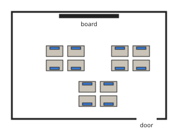
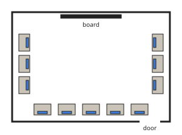

# Computer Science Form 1, Batch S1: authored answers for review

Every answer fixed by a person, not computed. Part 1: the tables, conventions and rules that computed answers come from.
Part 2: every authored question template, with all its data (keys, statements, pairs, choices and feedback) and sources.
Regenerate with `npm run review:computer-science`. Item IDs (TR-…) match `docs/teacher-review.md`.

## Part 1: rules, table and drawings the answers use (src/engine/lib/computerscience.js)

- **Patterns (TR-S01)**: number patterns add the same amount (3, 7, 11, 15 → 19) or double (3, 6, 12, 24 → 48); shape patterns repeat a group, and shape n is found from the remainder of n ÷ the group length.
- **Tracing (TR-S01)**: “start with x, add b, n times” gives x + b × n; “double n times” gives x × 2ⁿ; IF x > L THEN “big” ELSE “small” (equal counts as small).
- **History (TR-S02)**: ancient times: the abacus is used for counting; 1642: Blaise Pascal builds a mechanical adding machine (the Pascaline); 1837: Charles Babbage designs the Analytical Engine; 1843: Ada Lovelace writes the first computer program; 1946: ENIAC, an early electronic computer, is switched on; 1981: personal computers spread into offices and homes; 2007: smartphones with touch screens spread.
- **Generations (TR-S02)**: 1: vacuum tubes (about 1940 to 1956); 2: transistors (about 1956 to 1963); 3: integrated circuits (chips) (about 1964 to 1971); 4: microprocessors (from about 1971); 5: artificial intelligence (today and the future).
- **Drawings**: repeating shapes (circle, square, triangle, star) and three laboratory layouts (rows, U-shape (along the walls), clusters (groups)).

## Part 2: authored question templates

| # | Template | Lesson | Type, level | Sources |
|---|---|---|---|---|
| 1 | `cs1-ipo` | 1 | multiple choice, 1 | cs-intro |
| 2 | `cs1-what` | 1 | multiple choice, 1 | cs-intro |
| 3 | `cs1-sort` | 1 | matching, 2 | cs-intro |
| 4 | `cs1-spot` | 1 | spot the error, 3 | cs-intro |
| 5 | `csc1-1-check` (card csc1-1) | 1 | multiple choice, 1 | cs-intro |
| 6 | `cs2-who` | 2 | multiple choice, 1 | cs-history |
| 7 | `cs2-gen` | 2 | multiple choice, 1 | cs-history |
| 8 | `cs2-order` | 2 | ordering, 2 | cs-history |
| 9 | `cs2-genorder` | 2 | ordering, 2 | cs-history |
| 10 | `cs2-spot` | 2 | spot the error, 3 | cs-history |
| 11 | `csc2-3-check` (card csc2-3) | 2 | multiple choice, 1 | cs-history |
| 12 | `cs3-size` | 3 | multiple choice, 1 | cs-classes |
| 13 | `cs3-data` | 3 | multiple choice, 1 | cs-classes |
| 14 | `cs3-sort` | 3 | matching, 2 | cs-classes |
| 15 | `cs3-spot` | 3 | spot the error, 3 | cs-classes |
| 16 | `csc3-3-check` (card csc3-3) | 3 | multiple choice, 1 | cs-classes |
| 17 | `cs4-which` | 4 | multiple choice, 1 | ai |
| 18 | `cs4-learn` | 4 | multiple choice, 1 | ai |
| 19 | `cs4-sort` | 4 | matching, 2 | ai |
| 20 | `cs4-spot` | 4 | spot the error, 3 | ai |
| 21 | `csc4-3-check` (card csc4-3) | 4 | multiple choice, 1 | ai |
| 22 | `cs5-use` | 5 | multiple choice, 1 | ai-ethics |
| 23 | `cs5-right` | 5 | multiple choice, 1 | ai-ethics |
| 24 | `cs5-sort` | 5 | matching, 2 | ai-ethics |
| 25 | `cs5-spot` | 5 | spot the error, 3 | ai-ethics |
| 26 | `csc5-3-check` (card csc5-3) | 5 | multiple choice, 1 | ai-ethics |
| 27 | `cs6-what` | 6 | multiple choice, 1 | prompts |
| 28 | `cs6-best` | 6 | multiple choice, 1 | prompts |
| 29 | `cs6-missing` | 6 | multiple choice, 2 | prompts |
| 30 | `cs6-spot` | 6 | spot the error, 3 | prompts |
| 31 | `csc6-3-check` (card csc6-3) | 6 | multiple choice, 1 | prompts |
| 32 | `cs8-what` | 8 | multiple choice, 1 | comp-thinking |
| 33 | `cs8-order` | 8 | ordering, 1 | comp-thinking |
| 34 | `cs8-ct` | 8 | matching, 2 | comp-thinking |
| 35 | `cs8-spot` | 8 | spot the error, 3 | comp-thinking |
| 36 | `csc8-3-check` (card csc8-3) | 8 | multiple choice, 1 | comp-thinking |
| 37 | `cs10-keep` | 10 | multiple choice, 1 | comp-thinking |
| 38 | `cs10-which` | 10 | multiple choice, 1 | comp-thinking |
| 39 | `cs10-sort` | 10 | matching, 2 | comp-thinking |
| 40 | `cs10-spot` | 10 | spot the error, 3 | comp-thinking |
| 41 | `csc10-3-check` (card csc10-3) | 10 | multiple choice, 1 | comp-thinking |
| 42 | `cs11-what` | 11 | multiple choice, 1 | algorithms |
| 43 | `cs11-shape` | 11 | matching, 1 | algorithms |
| 44 | `cs13-sort` | 13 | matching, 1 | computing-environment |
| 45 | `cs13-soft` | 13 | multiple choice, 1 | computing-environment |
| 46 | `cs13-match` | 13 | matching, 1 | computing-environment |
| 47 | `cs13-need` | 13 | multiple choice, 2 | computing-environment |
| 48 | `cs13-spot` | 13 | spot the error, 3 | computing-environment |
| 49 | `cs14-who` | 14 | multiple choice, 1 | data-info |
| 50 | `cs14-sort` | 14 | matching, 1 | data-info |
| 51 | `cs14-turn` | 14 | multiple choice, 2 | data-info |
| 52 | `cs14-spot` | 14 | spot the error, 3 | data-info |
| 53 | `csc14-3-check` (card csc14-3) | 14 | multiple choice, 1 | data-info |
| 54 | `cs16-match` | 16 | matching, 1 | computer-lab |
| 55 | `cs16-which` | 16 | multiple choice, 1 | computer-lab |
| 56 | `cs16-power` | 16 | multiple choice, 2 | computer-lab |
| 57 | `cs16-spot` | 16 | spot the error, 3 | computer-lab |
| 58 | `csc16-3-check` (card csc16-3) | 16 | multiple choice, 1 | computer-lab |
| 59 | `cs17-name` | 17 | multiple choice, 1 | computer-lab |
| 60 | `cs17-adv` | 17 | multiple choice, 1 | computer-lab |
| 61 | `cs17-plan` | 17 | multiple choice, 2 | computer-lab |
| 62 | `cs17-spot` | 17 | spot the error, 3 | computer-lab |
| 63 | `csc17-3-check` (card csc17-3) | 17 | multiple choice, 1 | computer-lab |
| 64 | `cs18-sort` | 18 | matching, 1 | computer-lab |
| 65 | `cs18-fault` | 18 | multiple choice, 1 | computer-lab |
| 66 | `cs18-why` | 18 | multiple choice, 2 | computer-lab |
| 67 | `cs18-spot` | 18 | spot the error, 3 | computer-lab |
| 68 | `csc18-3-check` (card csc18-3) | 18 | multiple choice, 1 | computer-lab |

### `cs1-ipo` · Lesson 1 · multiple choice, level 1

Prompt: Which stage is this: {x.t}?

Table `x` (one row is picked each time):

| t | a | why |
|---|---|---|
| typing your name on the keyboard | input | Input: typing your name on the keyboard. |
| the computer adding up the marks | processing | Processing: the computer adding up the marks. |
| the printer printing the report card | output | Output: the printer printing the report card. |
| saving the marks on the hard disk | storage | Storage: saving the marks on the hard disk. |
| scanning a photo | input | Input: scanning a photo. |
| showing the result on the screen | output | Output: showing the result on the screen. |

Right answer: `{x.a}`; wrong choices: `input`, `processing`, `output`, `storage`

- Feedback `other`: “Not that stage. Data in, work on it, results out, keep it.”

Three generated variants:

> Which stage is this: the computer adding up the marks?

- ◻️ output  
  _↳ feedback if chosen: Not that stage. Data in, work on it, results out, keep it._
- ◻️ storage  
  _↳ feedback if chosen: Not that stage. Data in, work on it, results out, keep it._
- ✅ processing
- ◻️ input  
  _↳ feedback if chosen: Not that stage. Data in, work on it, results out, keep it._

Full working after a second miss:

> Processing: the computer adding up the marks.  
> Answer: processing.  

> Which stage is this: showing the result on the screen?

- ◻️ processing  
  _↳ feedback if chosen: Not that stage. Data in, work on it, results out, keep it._
- ✅ output
- ◻️ storage  
  _↳ feedback if chosen: Not that stage. Data in, work on it, results out, keep it._
- ◻️ input  
  _↳ feedback if chosen: Not that stage. Data in, work on it, results out, keep it._

Full working after a second miss:

> Output: showing the result on the screen.  
> Answer: output.  

> Which stage is this: saving the marks on the hard disk?

- ✅ storage
- ◻️ input  
  _↳ feedback if chosen: Not that stage. Data in, work on it, results out, keep it._
- ◻️ processing  
  _↳ feedback if chosen: Not that stage. Data in, work on it, results out, keep it._
- ◻️ output  
  _↳ feedback if chosen: Not that stage. Data in, work on it, results out, keep it._

Full working after a second miss:

> Storage: saving the marks on the hard disk.  
> Answer: storage.  

Sources: cs-intro (What computer science and computers are; input, processing, output, storage)

### `cs1-what` · Lesson 1 · multiple choice, level 1

Prompt: Which is part of computer science?

Shows 1 true and 3 false statement(s), drawn from:

- ✅ writing programs
- ✅ storing and using data
- ✅ solving problems with computers
- ✅ connecting computers in networks
- ❌ growing maize  
  _↳ That is agriculture._
- ❌ painting houses  
  _↳ That is not computer science._
- ❌ studying volcanoes  
  _↳ That is geography or geology._
- ❌ cooking rice  
  _↳ That is home economics._

Three generated variants:

> Which is part of computer science?

- ◻️ studying volcanoes  
  _↳ feedback if chosen: That is geography or geology._
- ✅ connecting computers in networks
- ◻️ growing maize  
  _↳ feedback if chosen: That is agriculture._
- ◻️ cooking rice  
  _↳ feedback if chosen: That is home economics._

Full working after a second miss:

> The true statement is “connecting computers in networks”.  
> “studying volcanoes” is false: That is geography or geology.  
> “growing maize” is false: That is agriculture.  
> “cooking rice” is false: That is home economics.  

> Which is part of computer science?

- ◻️ cooking rice  
  _↳ feedback if chosen: That is home economics._
- ◻️ painting houses  
  _↳ feedback if chosen: That is not computer science._
- ◻️ growing maize  
  _↳ feedback if chosen: That is agriculture._
- ✅ solving problems with computers

Full working after a second miss:

> The true statement is “solving problems with computers”.  
> “cooking rice” is false: That is home economics.  
> “painting houses” is false: That is not computer science.  
> “growing maize” is false: That is agriculture.  

> Which is part of computer science?

- ◻️ cooking rice  
  _↳ feedback if chosen: That is home economics._
- ✅ storing and using data
- ◻️ painting houses  
  _↳ feedback if chosen: That is not computer science._
- ◻️ growing maize  
  _↳ feedback if chosen: That is agriculture._

Full working after a second miss:

> The true statement is “storing and using data”.  
> “cooking rice” is false: That is home economics.  
> “painting houses” is false: That is not computer science.  
> “growing maize” is false: That is agriculture.  

Sources: cs-intro (What computer science and computers are; input, processing, output, storage)

### `cs1-sort` · Lesson 1 · matching, level 2

Prompt: Sort these devices: input or output?

Pairs (6 shown each time, sorted into groups):

- keyboard → **input**
- mouse → **input**
- microphone → **input**
- scanner → **input**
- camera → **input**
- screen → **output**
- printer → **output**
- speakers → **output**
- projector → **output**
- headphones → **output**

Three generated variants:

> Sort these devices: input or output?

Groups: input · output
- microphone → **input**
- headphones → **output**
- speakers → **output**
- scanner → **input**
- keyboard → **input**
- screen → **output**

Full working after a second miss:

> The right pairs are:  
> microphone → input  
> headphones → output  
> speakers → output  
> scanner → input  
> keyboard → input  
> screen → output  

> Sort these devices: input or output?

Groups: input · output
- speakers → **output**
- scanner → **input**
- mouse → **input**
- printer → **output**
- screen → **output**
- projector → **output**

Full working after a second miss:

> The right pairs are:  
> speakers → output  
> scanner → input  
> mouse → input  
> printer → output  
> screen → output  
> projector → output  

> Sort these devices: input or output?

Groups: input · output
- camera → **input**
- printer → **output**
- speakers → **output**
- projector → **output**
- headphones → **output**
- mouse → **input**

Full working after a second miss:

> The right pairs are:  
> camera → input  
> printer → output  
> speakers → output  
> projector → output  
> headphones → output  
> mouse → input  

Sources: cs-intro (What computer science and computers are; input, processing, output, storage)

### `cs1-spot` · Lesson 1 · spot the error, level 3

Prompt: One sentence is wrong. Which one?

Shows 3 correct and 1 wrong statement(s), drawn from:

- ✅ A keyboard is an input device.
- ✅ A printer is an output device.
- ✅ A computer follows instructions called a program.
- ✅ Data can be stored for later use.
- ❌ A screen is an input device.  
  _↳ A screen shows results: output._
- ❌ A computer can think and feel like a person.  
  _↳ A computer follows instructions; it has no feelings._
- ❌ Processing means printing the result.  
  _↳ Processing is working on the data; printing is output._

Three generated variants:

> One sentence is wrong. Which one?

- ◻️ A printer is an output device.
- ◻️ A computer follows instructions called a program.
- ◻️ Data can be stored for later use.
- ✅ A screen is an input device.  
  _↳ explanation: A screen shows results: output._

Full working after a second miss:

> The wrong statement is “A screen is an input device.”.  
> A screen shows results: output.  

> One sentence is wrong. Which one?

- ◻️ A printer is an output device.
- ✅ A screen is an input device.  
  _↳ explanation: A screen shows results: output._
- ◻️ A computer follows instructions called a program.
- ◻️ Data can be stored for later use.

Full working after a second miss:

> The wrong statement is “A screen is an input device.”.  
> A screen shows results: output.  

> One sentence is wrong. Which one?

- ◻️ A keyboard is an input device.
- ◻️ A printer is an output device.
- ◻️ Data can be stored for later use.
- ✅ A screen is an input device.  
  _↳ explanation: A screen shows results: output._

Full working after a second miss:

> The wrong statement is “A screen is an input device.”.  
> A screen shows results: output.  

Sources: cs-intro (What computer science and computers are; input, processing, output, storage)

### `csc1-1-check` · Lesson 1 · multiple choice, level 1

Prompt: What is a computer?

Shows 1 true and 3 false statement(s), drawn from:

- ✅ an electronic machine that accepts data, processes it, stores it and gives results
- ❌ any machine with a motor  
  _↳ A motor alone does not process data._
- ❌ a box that only plays music  
  _↳ A computer can do much more: it processes data._
- ❌ a kind of television  
  _↳ A television shows pictures; a computer processes data._
- ❌ a book of instructions  
  _↳ A program is instructions; a computer is the machine that follows them._

Three generated variants:

> What is a computer?

- ✅ an electronic machine that accepts data, processes it, stores it and gives results
- ◻️ any machine with a motor  
  _↳ feedback if chosen: A motor alone does not process data._
- ◻️ a book of instructions  
  _↳ feedback if chosen: A program is instructions; a computer is the machine that follows them._
- ◻️ a box that only plays music  
  _↳ feedback if chosen: A computer can do much more: it processes data._

Full working after a second miss:

> The true statement is “an electronic machine that accepts data, processes it, stores it and gives results”.  
> “any machine with a motor” is false: A motor alone does not process data.  
> “a book of instructions” is false: A program is instructions; a computer is the machine that follows them.  
> “a box that only plays music” is false: A computer can do much more: it processes data.  

> What is a computer?

- ◻️ a box that only plays music  
  _↳ feedback if chosen: A computer can do much more: it processes data._
- ◻️ any machine with a motor  
  _↳ feedback if chosen: A motor alone does not process data._
- ✅ an electronic machine that accepts data, processes it, stores it and gives results
- ◻️ a book of instructions  
  _↳ feedback if chosen: A program is instructions; a computer is the machine that follows them._

Full working after a second miss:

> The true statement is “an electronic machine that accepts data, processes it, stores it and gives results”.  
> “a box that only plays music” is false: A computer can do much more: it processes data.  
> “any machine with a motor” is false: A motor alone does not process data.  
> “a book of instructions” is false: A program is instructions; a computer is the machine that follows them.  

> What is a computer?

- ◻️ a book of instructions  
  _↳ feedback if chosen: A program is instructions; a computer is the machine that follows them._
- ◻️ any machine with a motor  
  _↳ feedback if chosen: A motor alone does not process data._
- ◻️ a box that only plays music  
  _↳ feedback if chosen: A computer can do much more: it processes data._
- ✅ an electronic machine that accepts data, processes it, stores it and gives results

Full working after a second miss:

> The true statement is “an electronic machine that accepts data, processes it, stores it and gives results”.  
> “a book of instructions” is false: A program is instructions; a computer is the machine that follows them.  
> “any machine with a motor” is false: A motor alone does not process data.  
> “a box that only plays music” is false: A computer can do much more: it processes data.  

Sources: cs-intro (What computer science and computers are; input, processing, output, storage)

### `cs2-who` · Lesson 2 · multiple choice, level 1

Prompt: Who {x.t}?

Table `x` (one row is picked each time):

| t | a | why |
|---|---|---|
| built a mechanical adding machine in 1642 | Blaise Pascal | Blaise Pascal: built a mechanical adding machine in 1642. |
| designed the Analytical Engine and is called the father of the computer | Charles Babbage | Charles Babbage: designed the Analytical Engine and is called the father of the computer. |
| wrote the first computer program | Ada Lovelace | Ada Lovelace: wrote the first computer program. |

Right answer: `{x.a}`; wrong choices: `Blaise Pascal`, `Charles Babbage`, `Ada Lovelace`

- Feedback `other`: “Not that person. Read the history again.”

Three generated variants:

> Who wrote the first computer program?

- ✅ Ada Lovelace
- ◻️ Blaise Pascal  
  _↳ feedback if chosen: Not that person. Read the history again._
- ◻️ Charles Babbage  
  _↳ feedback if chosen: Not that person. Read the history again._

Full working after a second miss:

> Ada Lovelace: wrote the first computer program.  
> Answer: Ada Lovelace.  

> Who built a mechanical adding machine in 1642?

- ◻️ Ada Lovelace  
  _↳ feedback if chosen: Not that person. Read the history again._
- ◻️ Charles Babbage  
  _↳ feedback if chosen: Not that person. Read the history again._
- ✅ Blaise Pascal

Full working after a second miss:

> Blaise Pascal: built a mechanical adding machine in 1642.  
> Answer: Blaise Pascal.  

> Who built a mechanical adding machine in 1642?

- ◻️ Charles Babbage  
  _↳ feedback if chosen: Not that person. Read the history again._
- ◻️ Ada Lovelace  
  _↳ feedback if chosen: Not that person. Read the history again._
- ✅ Blaise Pascal

Full working after a second miss:

> Blaise Pascal: built a mechanical adding machine in 1642.  
> Answer: Blaise Pascal.  

Sources: cs-history (History of computing (abacus, Pascal 1642, Babbage 1830s, Lovelace 1843, ENIAC 1946) and the five generations (textbook dates differ))

### `cs2-gen` · Lesson 2 · multiple choice, level 1

Prompt: Which technology belongs to the {ordinalWords(words(g))} generation of computers?

Right answer: `{generationTech(g)}`; wrong choices: `{generationTech(1)}`, `{generationTech(2)}`, `{generationTech(3)}`, `{generationTech(4)}`, `{generationTech(5)}`

- Feedback `other`: “In order: vacuum tubes, transistors, integrated circuits, microprocessors, artificial intelligence.”

Three generated variants:

> Which technology belongs to the second generation of computers?

- ✅ transistors
- ◻️ vacuum tubes  
  _↳ feedback if chosen: In order: vacuum tubes, transistors, integrated circuits, microprocessors, artificial intelligence._
- ◻️ artificial intelligence  
  _↳ feedback if chosen: In order: vacuum tubes, transistors, integrated circuits, microprocessors, artificial intelligence._
- ◻️ integrated circuits (chips)  
  _↳ feedback if chosen: In order: vacuum tubes, transistors, integrated circuits, microprocessors, artificial intelligence._

Full working after a second miss:

> The generations in order: vacuum tubes, transistors, integrated circuits, microprocessors, artificial intelligence.  
> Generation 2: transistors.  

> Which technology belongs to the third generation of computers?

- ◻️ transistors  
  _↳ feedback if chosen: In order: vacuum tubes, transistors, integrated circuits, microprocessors, artificial intelligence._
- ✅ integrated circuits (chips)
- ◻️ microprocessors  
  _↳ feedback if chosen: In order: vacuum tubes, transistors, integrated circuits, microprocessors, artificial intelligence._
- ◻️ artificial intelligence  
  _↳ feedback if chosen: In order: vacuum tubes, transistors, integrated circuits, microprocessors, artificial intelligence._

Full working after a second miss:

> The generations in order: vacuum tubes, transistors, integrated circuits, microprocessors, artificial intelligence.  
> Generation 3: integrated circuits (chips).  

> Which technology belongs to the second generation of computers?

- ◻️ artificial intelligence  
  _↳ feedback if chosen: In order: vacuum tubes, transistors, integrated circuits, microprocessors, artificial intelligence._
- ◻️ microprocessors  
  _↳ feedback if chosen: In order: vacuum tubes, transistors, integrated circuits, microprocessors, artificial intelligence._
- ✅ transistors
- ◻️ integrated circuits (chips)  
  _↳ feedback if chosen: In order: vacuum tubes, transistors, integrated circuits, microprocessors, artificial intelligence._

Full working after a second miss:

> The generations in order: vacuum tubes, transistors, integrated circuits, microprocessors, artificial intelligence.  
> Generation 2: transistors.  

Sources: cs-history (History of computing (abacus, Pascal 1642, Babbage 1830s, Lovelace 1843, ENIAC 1946) and the five generations (textbook dates differ))

### `cs2-order` · Lesson 2 · ordering, level 2

Prompt: Put these in order, earliest first.

Items in the right order:

1. {historyStep(s[0])}
2. {historyStep(s[1])}
3. {historyStep(s[2])}
4. {historyStep(s[3])}

Three generated variants:

> Put these in order, earliest first.

Shown as: personal computers spread into offices and homes · Charles Babbage designs the Analytical Engine · smartphones with touch screens spread · ENIAC, an early electronic computer, is switched on
Correct order: Charles Babbage designs the Analytical Engine → ENIAC, an early electronic computer, is switched on → personal computers spread into offices and homes → smartphones with touch screens spread

Full working after a second miss:

> The correct order is: Charles Babbage designs the Analytical Engine → ENIAC, an early electronic computer, is switched on → personal computers spread into offices and homes → smartphones with touch screens spread.  

> Put these in order, earliest first.

Shown as: Ada Lovelace writes the first computer program · smartphones with touch screens spread · ENIAC, an early electronic computer, is switched on · Blaise Pascal builds a mechanical adding machine (the Pascaline)
Correct order: Blaise Pascal builds a mechanical adding machine (the Pascaline) → Ada Lovelace writes the first computer program → ENIAC, an early electronic computer, is switched on → smartphones with touch screens spread

Full working after a second miss:

> The correct order is: Blaise Pascal builds a mechanical adding machine (the Pascaline) → Ada Lovelace writes the first computer program → ENIAC, an early electronic computer, is switched on → smartphones with touch screens spread.  

> Put these in order, earliest first.

Shown as: the abacus is used for counting · personal computers spread into offices and homes · Blaise Pascal builds a mechanical adding machine (the Pascaline) · ENIAC, an early electronic computer, is switched on
Correct order: the abacus is used for counting → Blaise Pascal builds a mechanical adding machine (the Pascaline) → ENIAC, an early electronic computer, is switched on → personal computers spread into offices and homes

Full working after a second miss:

> The correct order is: the abacus is used for counting → Blaise Pascal builds a mechanical adding machine (the Pascaline) → ENIAC, an early electronic computer, is switched on → personal computers spread into offices and homes.  

Sources: cs-history (History of computing (abacus, Pascal 1642, Babbage 1830s, Lovelace 1843, ENIAC 1946) and the five generations (textbook dates differ))

### `cs2-genorder` · Lesson 2 · ordering, level 2

Prompt: Put these computer technologies in order, oldest first.

Items in the right order:

1. {generationTech(s[0])}
2. {generationTech(s[1])}
3. {generationTech(s[2])}
4. {generationTech(s[3])}

Three generated variants:

> Put these computer technologies in order, oldest first.

Shown as: microprocessors · vacuum tubes · transistors · integrated circuits (chips)
Correct order: vacuum tubes → transistors → integrated circuits (chips) → microprocessors

Full working after a second miss:

> The correct order is: vacuum tubes → transistors → integrated circuits (chips) → microprocessors.  

> Put these computer technologies in order, oldest first.

Shown as: vacuum tubes · transistors · artificial intelligence · microprocessors
Correct order: vacuum tubes → transistors → microprocessors → artificial intelligence

Full working after a second miss:

> The correct order is: vacuum tubes → transistors → microprocessors → artificial intelligence.  

> Put these computer technologies in order, oldest first.

Shown as: microprocessors · integrated circuits (chips) · vacuum tubes · transistors
Correct order: vacuum tubes → transistors → integrated circuits (chips) → microprocessors

Full working after a second miss:

> The correct order is: vacuum tubes → transistors → integrated circuits (chips) → microprocessors.  

Sources: cs-history (History of computing (abacus, Pascal 1642, Babbage 1830s, Lovelace 1843, ENIAC 1946) and the five generations (textbook dates differ))

### `cs2-spot` · Lesson 2 · spot the error, level 3

Prompt: One sentence is wrong. Which one?

Shows 3 correct and 1 wrong statement(s), drawn from:

- ✅ The first generation used vacuum tubes.
- ✅ Ada Lovelace wrote the first computer program.
- ✅ Charles Babbage is called the father of the computer.
- ✅ Microprocessors belong to the fourth generation.
- ❌ ENIAC was smaller than a smartphone.  
  _↳ ENIAC filled a large room._
- ❌ The abacus is an electronic computer.  
  _↳ The abacus is a counting tool with beads._
- ❌ Each generation was bigger and slower.  
  _↳ Each was smaller and faster._

Three generated variants:

> One sentence is wrong. Which one?

- ◻️ Microprocessors belong to the fourth generation.
- ◻️ The first generation used vacuum tubes.
- ◻️ Charles Babbage is called the father of the computer.
- ✅ The abacus is an electronic computer.  
  _↳ explanation: The abacus is a counting tool with beads._

Full working after a second miss:

> The wrong statement is “The abacus is an electronic computer.”.  
> The abacus is a counting tool with beads.  

> One sentence is wrong. Which one?

- ◻️ Microprocessors belong to the fourth generation.
- ◻️ Charles Babbage is called the father of the computer.
- ✅ Each generation was bigger and slower.  
  _↳ explanation: Each was smaller and faster._
- ◻️ The first generation used vacuum tubes.

Full working after a second miss:

> The wrong statement is “Each generation was bigger and slower.”.  
> Each was smaller and faster.  

> One sentence is wrong. Which one?

- ◻️ Microprocessors belong to the fourth generation.
- ◻️ Ada Lovelace wrote the first computer program.
- ◻️ The first generation used vacuum tubes.
- ✅ The abacus is an electronic computer.  
  _↳ explanation: The abacus is a counting tool with beads._

Full working after a second miss:

> The wrong statement is “The abacus is an electronic computer.”.  
> The abacus is a counting tool with beads.  

Sources: cs-history (History of computing (abacus, Pascal 1642, Babbage 1830s, Lovelace 1843, ENIAC 1946) and the five generations (textbook dates differ))

### `csc2-3-check` · Lesson 2 · multiple choice, level 1

Prompt: How did computers change from one generation to the next?

Shows 1 true and 3 false statement(s), drawn from:

- ✅ They became smaller, faster and cheaper.
- ❌ They became bigger and slower.  
  _↳ The opposite: smaller and faster._
- ❌ They stopped using electricity.  
  _↳ All of them use electricity._
- ❌ They became more expensive every time.  
  _↳ They became cheaper._
- ❌ Nothing changed.  
  _↳ They changed a lot._

Three generated variants:

> How did computers change from one generation to the next?

- ✅ They became smaller, faster and cheaper.
- ◻️ They became more expensive every time.  
  _↳ feedback if chosen: They became cheaper._
- ◻️ They stopped using electricity.  
  _↳ feedback if chosen: All of them use electricity._
- ◻️ Nothing changed.  
  _↳ feedback if chosen: They changed a lot._

Full working after a second miss:

> The true statement is “They became smaller, faster and cheaper.”.  
> “They became more expensive every time.” is false: They became cheaper.  
> “They stopped using electricity.” is false: All of them use electricity.  
> “Nothing changed.” is false: They changed a lot.  

> How did computers change from one generation to the next?

- ◻️ Nothing changed.  
  _↳ feedback if chosen: They changed a lot._
- ◻️ They became bigger and slower.  
  _↳ feedback if chosen: The opposite: smaller and faster._
- ◻️ They became more expensive every time.  
  _↳ feedback if chosen: They became cheaper._
- ✅ They became smaller, faster and cheaper.

Full working after a second miss:

> The true statement is “They became smaller, faster and cheaper.”.  
> “Nothing changed.” is false: They changed a lot.  
> “They became bigger and slower.” is false: The opposite: smaller and faster.  
> “They became more expensive every time.” is false: They became cheaper.  

> How did computers change from one generation to the next?

- ✅ They became smaller, faster and cheaper.
- ◻️ They became more expensive every time.  
  _↳ feedback if chosen: They became cheaper._
- ◻️ They stopped using electricity.  
  _↳ feedback if chosen: All of them use electricity._
- ◻️ Nothing changed.  
  _↳ feedback if chosen: They changed a lot._

Full working after a second miss:

> The true statement is “They became smaller, faster and cheaper.”.  
> “They became more expensive every time.” is false: They became cheaper.  
> “They stopped using electricity.” is false: All of them use electricity.  
> “Nothing changed.” is false: They changed a lot.  

Sources: cs-history (History of computing (abacus, Pascal 1642, Babbage 1830s, Lovelace 1843, ENIAC 1946) and the five generations (textbook dates differ))

### `cs3-size` · Lesson 3 · multiple choice, level 1

Prompt: Which kind of computer is this: {x.t}?

Table `x` (one row is picked each time):

| t | a | why |
|---|---|---|
| the most powerful, used for weather forecasts | supercomputer | Supercomputer: the most powerful, used for weather forecasts. |
| serves thousands of bank customers at once | mainframe | Mainframe: serves thousands of bank customers at once. |
| a laptop, desktop, tablet or smartphone | microcomputer | Microcomputer: a laptop, desktop, tablet or smartphone. |
| serves a medium-sized company | minicomputer | Minicomputer: serves a medium-sized company. |

Right answer: `{x.a}`; wrong choices: `supercomputer`, `mainframe`, `minicomputer`, `microcomputer`

- Feedback `other`: “Not that kind. Think about size and power.”

Three generated variants:

> Which kind of computer is this: serves thousands of bank customers at once?

- ◻️ minicomputer  
  _↳ feedback if chosen: Not that kind. Think about size and power._
- ✅ mainframe
- ◻️ microcomputer  
  _↳ feedback if chosen: Not that kind. Think about size and power._
- ◻️ supercomputer  
  _↳ feedback if chosen: Not that kind. Think about size and power._

Full working after a second miss:

> Mainframe: serves thousands of bank customers at once.  
> Answer: mainframe.  

> Which kind of computer is this: serves a medium-sized company?

- ◻️ microcomputer  
  _↳ feedback if chosen: Not that kind. Think about size and power._
- ◻️ supercomputer  
  _↳ feedback if chosen: Not that kind. Think about size and power._
- ✅ minicomputer
- ◻️ mainframe  
  _↳ feedback if chosen: Not that kind. Think about size and power._

Full working after a second miss:

> Minicomputer: serves a medium-sized company.  
> Answer: minicomputer.  

> Which kind of computer is this: a laptop, desktop, tablet or smartphone?

- ✅ microcomputer
- ◻️ supercomputer  
  _↳ feedback if chosen: Not that kind. Think about size and power._
- ◻️ mainframe  
  _↳ feedback if chosen: Not that kind. Think about size and power._
- ◻️ minicomputer  
  _↳ feedback if chosen: Not that kind. Think about size and power._

Full working after a second miss:

> Microcomputer: a laptop, desktop, tablet or smartphone.  
> Answer: microcomputer.  

Sources: cs-classes (Classification of computers by size, type of data and purpose)

### `cs3-data` · Lesson 3 · multiple choice, level 1

Prompt: Which type of computer {x.t}?

Table `x` (one row is picked each time):

| t | a | why |
|---|---|---|
| works with numbers (digits) | digital | Digital: works with numbers (digits). |
| measures quantities that change smoothly, like an old needle speedometer | analog | Analog: measures quantities that change smoothly, like an old needle speedometer. |
| can work in both ways | hybrid | Hybrid: can work in both ways. |

Right answer: `{x.a}`; wrong choices: `digital`, `analog`, `hybrid`

- Feedback `other`: “Digital: numbers. Analog: smooth measurements. Hybrid: both.”

Three generated variants:

> Which type of computer can work in both ways?

- ✅ hybrid
- ◻️ digital  
  _↳ feedback if chosen: Digital: numbers. Analog: smooth measurements. Hybrid: both._
- ◻️ analog  
  _↳ feedback if chosen: Digital: numbers. Analog: smooth measurements. Hybrid: both._

Full working after a second miss:

> Hybrid: can work in both ways.  
> Answer: hybrid.  

> Which type of computer measures quantities that change smoothly, like an old needle speedometer?

- ✅ analog
- ◻️ digital  
  _↳ feedback if chosen: Digital: numbers. Analog: smooth measurements. Hybrid: both._
- ◻️ hybrid  
  _↳ feedback if chosen: Digital: numbers. Analog: smooth measurements. Hybrid: both._

Full working after a second miss:

> Analog: measures quantities that change smoothly, like an old needle speedometer.  
> Answer: analog.  

> Which type of computer measures quantities that change smoothly, like an old needle speedometer?

- ◻️ hybrid  
  _↳ feedback if chosen: Digital: numbers. Analog: smooth measurements. Hybrid: both._
- ◻️ digital  
  _↳ feedback if chosen: Digital: numbers. Analog: smooth measurements. Hybrid: both._
- ✅ analog

Full working after a second miss:

> Analog: measures quantities that change smoothly, like an old needle speedometer.  
> Answer: analog.  

Sources: cs-classes (Classification of computers by size, type of data and purpose)

### `cs3-sort` · Lesson 3 · matching, level 2

Prompt: Sort these: general-purpose or special-purpose?

Pairs (6 shown each time, sorted into groups):

- laptop → **general-purpose**
- desktop computer → **general-purpose**
- tablet → **general-purpose**
- smartphone → **general-purpose**
- ATM → **special-purpose**
- washing machine controller → **special-purpose**
- digital watch → **special-purpose**
- traffic-light controller → **special-purpose**

Three generated variants:

> Sort these: general-purpose or special-purpose?

Groups: general-purpose · special-purpose
- digital watch → **special-purpose**
- ATM → **special-purpose**
- desktop computer → **general-purpose**
- smartphone → **general-purpose**
- laptop → **general-purpose**
- washing machine controller → **special-purpose**

Full working after a second miss:

> The right pairs are:  
> digital watch → special-purpose  
> ATM → special-purpose  
> desktop computer → general-purpose  
> smartphone → general-purpose  
> laptop → general-purpose  
> washing machine controller → special-purpose  

> Sort these: general-purpose or special-purpose?

Groups: general-purpose · special-purpose
- laptop → **general-purpose**
- traffic-light controller → **special-purpose**
- washing machine controller → **special-purpose**
- desktop computer → **general-purpose**
- tablet → **general-purpose**
- ATM → **special-purpose**

Full working after a second miss:

> The right pairs are:  
> laptop → general-purpose  
> traffic-light controller → special-purpose  
> washing machine controller → special-purpose  
> desktop computer → general-purpose  
> tablet → general-purpose  
> ATM → special-purpose  

> Sort these: general-purpose or special-purpose?

Groups: general-purpose · special-purpose
- tablet → **general-purpose**
- desktop computer → **general-purpose**
- washing machine controller → **special-purpose**
- ATM → **special-purpose**
- smartphone → **general-purpose**
- traffic-light controller → **special-purpose**

Full working after a second miss:

> The right pairs are:  
> tablet → general-purpose  
> desktop computer → general-purpose  
> washing machine controller → special-purpose  
> ATM → special-purpose  
> smartphone → general-purpose  
> traffic-light controller → special-purpose  

Sources: cs-classes (Classification of computers by size, type of data and purpose)

### `cs3-spot` · Lesson 3 · spot the error, level 3

Prompt: One sentence is wrong. Which one?

Shows 3 correct and 1 wrong statement(s), drawn from:

- ✅ A laptop is a microcomputer.
- ✅ Most computers today are digital.
- ✅ An ATM is special-purpose.
- ✅ Supercomputers are the most powerful.
- ❌ A smartphone is a supercomputer.  
  _↳ A smartphone is a microcomputer._
- ❌ A mainframe can serve only one user.  
  _↳ A mainframe serves many users at once._
- ❌ A washing machine’s computer is general-purpose.  
  _↳ It does one job: special-purpose._

Three generated variants:

> One sentence is wrong. Which one?

- ✅ A smartphone is a supercomputer.  
  _↳ explanation: A smartphone is a microcomputer._
- ◻️ Most computers today are digital.
- ◻️ An ATM is special-purpose.
- ◻️ A laptop is a microcomputer.

Full working after a second miss:

> The wrong statement is “A smartphone is a supercomputer.”.  
> A smartphone is a microcomputer.  

> One sentence is wrong. Which one?

- ◻️ Supercomputers are the most powerful.
- ◻️ A laptop is a microcomputer.
- ✅ A smartphone is a supercomputer.  
  _↳ explanation: A smartphone is a microcomputer._
- ◻️ Most computers today are digital.

Full working after a second miss:

> The wrong statement is “A smartphone is a supercomputer.”.  
> A smartphone is a microcomputer.  

> One sentence is wrong. Which one?

- ◻️ An ATM is special-purpose.
- ◻️ Most computers today are digital.
- ✅ A washing machine’s computer is general-purpose.  
  _↳ explanation: It does one job: special-purpose._
- ◻️ Supercomputers are the most powerful.

Full working after a second miss:

> The wrong statement is “A washing machine’s computer is general-purpose.”.  
> It does one job: special-purpose.  

Sources: cs-classes (Classification of computers by size, type of data and purpose)

### `csc3-3-check` · Lesson 3 · multiple choice, level 1

Prompt: Which is a special-purpose computer?

Shows 1 true and 3 false statement(s), drawn from:

- ✅ the computer in a washing machine
- ✅ the computer in an ATM
- ✅ a digital watch
- ❌ a laptop  
  _↳ A laptop can do many jobs: general-purpose._
- ❌ a desktop computer  
  _↳ It can do many jobs._
- ❌ a tablet  
  _↳ It can do many jobs._
- ❌ a smartphone  
  _↳ It can do many jobs._

Three generated variants:

> Which is a special-purpose computer?

- ✅ the computer in an ATM
- ◻️ a smartphone  
  _↳ feedback if chosen: It can do many jobs._
- ◻️ a tablet  
  _↳ feedback if chosen: It can do many jobs._
- ◻️ a laptop  
  _↳ feedback if chosen: A laptop can do many jobs: general-purpose._

Full working after a second miss:

> The true statement is “the computer in an ATM”.  
> “a smartphone” is false: It can do many jobs.  
> “a tablet” is false: It can do many jobs.  
> “a laptop” is false: A laptop can do many jobs: general-purpose.  

> Which is a special-purpose computer?

- ◻️ a smartphone  
  _↳ feedback if chosen: It can do many jobs._
- ◻️ a tablet  
  _↳ feedback if chosen: It can do many jobs._
- ◻️ a laptop  
  _↳ feedback if chosen: A laptop can do many jobs: general-purpose._
- ✅ the computer in an ATM

Full working after a second miss:

> The true statement is “the computer in an ATM”.  
> “a smartphone” is false: It can do many jobs.  
> “a tablet” is false: It can do many jobs.  
> “a laptop” is false: A laptop can do many jobs: general-purpose.  

> Which is a special-purpose computer?

- ◻️ a desktop computer  
  _↳ feedback if chosen: It can do many jobs._
- ◻️ a tablet  
  _↳ feedback if chosen: It can do many jobs._
- ✅ the computer in a washing machine
- ◻️ a smartphone  
  _↳ feedback if chosen: It can do many jobs._

Full working after a second miss:

> The true statement is “the computer in a washing machine”.  
> “a desktop computer” is false: It can do many jobs.  
> “a tablet” is false: It can do many jobs.  
> “a smartphone” is false: It can do many jobs.  

Sources: cs-classes (Classification of computers by size, type of data and purpose)

### `cs4-which` · Lesson 4 · multiple choice, level 1

Prompt: Which of these uses artificial intelligence?

Shows 1 true and 3 false statement(s), drawn from:

- ✅ a phone that unlocks when it recognises your face
- ✅ a voice assistant that answers spoken questions
- ✅ a translation app
- ✅ a spam filter that learns which emails are junk
- ❌ a simple light switch  
  _↳ It only turns on and off._
- ❌ a wind-up clock  
  _↳ It does not learn or recognise anything._
- ❌ a pencil  
  _↳ It is not a computer system._
- ❌ a door key  
  _↳ It is not a computer system._

Three generated variants:

> Which of these uses artificial intelligence?

- ◻️ a wind-up clock  
  _↳ feedback if chosen: It does not learn or recognise anything._
- ◻️ a pencil  
  _↳ feedback if chosen: It is not a computer system._
- ◻️ a door key  
  _↳ feedback if chosen: It is not a computer system._
- ✅ a spam filter that learns which emails are junk

Full working after a second miss:

> The true statement is “a spam filter that learns which emails are junk”.  
> “a wind-up clock” is false: It does not learn or recognise anything.  
> “a pencil” is false: It is not a computer system.  
> “a door key” is false: It is not a computer system.  

> Which of these uses artificial intelligence?

- ◻️ a door key  
  _↳ feedback if chosen: It is not a computer system._
- ✅ a spam filter that learns which emails are junk
- ◻️ a pencil  
  _↳ feedback if chosen: It is not a computer system._
- ◻️ a simple light switch  
  _↳ feedback if chosen: It only turns on and off._

Full working after a second miss:

> The true statement is “a spam filter that learns which emails are junk”.  
> “a door key” is false: It is not a computer system.  
> “a pencil” is false: It is not a computer system.  
> “a simple light switch” is false: It only turns on and off.  

> Which of these uses artificial intelligence?

- ◻️ a pencil  
  _↳ feedback if chosen: It is not a computer system._
- ✅ a spam filter that learns which emails are junk
- ◻️ a wind-up clock  
  _↳ feedback if chosen: It does not learn or recognise anything._
- ◻️ a simple light switch  
  _↳ feedback if chosen: It only turns on and off._

Full working after a second miss:

> The true statement is “a spam filter that learns which emails are junk”.  
> “a pencil” is false: It is not a computer system.  
> “a wind-up clock” is false: It does not learn or recognise anything.  
> “a simple light switch” is false: It only turns on and off.  

Sources: ai (What artificial intelligence and machine learning are; examples and limits (no named products))

### `cs4-learn` · Lesson 4 · multiple choice, level 1

Prompt: How do many AI systems learn?

Shows 1 true and 3 false statement(s), drawn from:

- ✅ by finding patterns in large amounts of example data
- ❌ by going to school  
  _↳ They are trained on data, not taught in school._
- ❌ by eating  
  _↳ Computers do not eat._
- ❌ by guessing randomly forever  
  _↳ They learn patterns from data._
- ❌ they never learn  
  _↳ Machine learning means learning from data._

Three generated variants:

> How do many AI systems learn?

- ✅ by finding patterns in large amounts of example data
- ◻️ they never learn  
  _↳ feedback if chosen: Machine learning means learning from data._
- ◻️ by eating  
  _↳ feedback if chosen: Computers do not eat._
- ◻️ by going to school  
  _↳ feedback if chosen: They are trained on data, not taught in school._

Full working after a second miss:

> The true statement is “by finding patterns in large amounts of example data”.  
> “they never learn” is false: Machine learning means learning from data.  
> “by eating” is false: Computers do not eat.  
> “by going to school” is false: They are trained on data, not taught in school.  

> How do many AI systems learn?

- ◻️ by eating  
  _↳ feedback if chosen: Computers do not eat._
- ◻️ they never learn  
  _↳ feedback if chosen: Machine learning means learning from data._
- ◻️ by guessing randomly forever  
  _↳ feedback if chosen: They learn patterns from data._
- ✅ by finding patterns in large amounts of example data

Full working after a second miss:

> The true statement is “by finding patterns in large amounts of example data”.  
> “by eating” is false: Computers do not eat.  
> “they never learn” is false: Machine learning means learning from data.  
> “by guessing randomly forever” is false: They learn patterns from data.  

> How do many AI systems learn?

- ◻️ by going to school  
  _↳ feedback if chosen: They are trained on data, not taught in school._
- ◻️ by eating  
  _↳ feedback if chosen: Computers do not eat._
- ◻️ by guessing randomly forever  
  _↳ feedback if chosen: They learn patterns from data._
- ✅ by finding patterns in large amounts of example data

Full working after a second miss:

> The true statement is “by finding patterns in large amounts of example data”.  
> “by going to school” is false: They are trained on data, not taught in school.  
> “by eating” is false: Computers do not eat.  
> “by guessing randomly forever” is false: They learn patterns from data.  

Sources: ai (What artificial intelligence and machine learning are; examples and limits (no named products))

### `cs4-sort` · Lesson 4 · matching, level 2

Prompt: Sort these: an AI task, or not?

Pairs (6 shown each time, sorted into groups):

- recognising faces in photos → **AI task**
- translating a sentence → **AI task**
- answering spoken questions → **AI task**
- recommending videos you may like → **AI task**
- switching on a bulb → **not AI**
- a calculator adding two numbers → **not AI**
- a clock ticking → **not AI**
- a fan turning → **not AI**

Three generated variants:

> Sort these: an AI task, or not?

Groups: AI task · not AI
- recommending videos you may like → **AI task**
- answering spoken questions → **AI task**
- translating a sentence → **AI task**
- a fan turning → **not AI**
- a clock ticking → **not AI**
- switching on a bulb → **not AI**

Full working after a second miss:

> The right pairs are:  
> recommending videos you may like → AI task  
> answering spoken questions → AI task  
> translating a sentence → AI task  
> a fan turning → not AI  
> a clock ticking → not AI  
> switching on a bulb → not AI  

> Sort these: an AI task, or not?

Groups: AI task · not AI
- answering spoken questions → **AI task**
- translating a sentence → **AI task**
- recognising faces in photos → **AI task**
- switching on a bulb → **not AI**
- recommending videos you may like → **AI task**
- a calculator adding two numbers → **not AI**

Full working after a second miss:

> The right pairs are:  
> answering spoken questions → AI task  
> translating a sentence → AI task  
> recognising faces in photos → AI task  
> switching on a bulb → not AI  
> recommending videos you may like → AI task  
> a calculator adding two numbers → not AI  

> Sort these: an AI task, or not?

Groups: AI task · not AI
- recommending videos you may like → **AI task**
- recognising faces in photos → **AI task**
- answering spoken questions → **AI task**
- translating a sentence → **AI task**
- a fan turning → **not AI**
- a calculator adding two numbers → **not AI**

Full working after a second miss:

> The right pairs are:  
> recommending videos you may like → AI task  
> recognising faces in photos → AI task  
> answering spoken questions → AI task  
> translating a sentence → AI task  
> a fan turning → not AI  
> a calculator adding two numbers → not AI  

Sources: ai (What artificial intelligence and machine learning are; examples and limits (no named products))

### `cs4-spot` · Lesson 4 · spot the error, level 3

Prompt: One sentence is wrong. Which one?

Shows 3 correct and 1 wrong statement(s), drawn from:

- ✅ AI can recognise speech.
- ✅ Machine learning uses data.
- ✅ AI can make mistakes.
- ✅ A spam filter can use AI.
- ❌ AI is always right.  
  _↳ AI can be wrong; check its work._
- ❌ AI has feelings.  
  _↳ AI has no feelings._
- ❌ AI does not need any data.  
  _↳ Most AI learns from data._

Three generated variants:

> One sentence is wrong. Which one?

- ◻️ A spam filter can use AI.
- ◻️ AI can recognise speech.
- ✅ AI does not need any data.  
  _↳ explanation: Most AI learns from data._
- ◻️ AI can make mistakes.

Full working after a second miss:

> The wrong statement is “AI does not need any data.”.  
> Most AI learns from data.  

> One sentence is wrong. Which one?

- ◻️ Machine learning uses data.
- ◻️ AI can recognise speech.
- ✅ AI has feelings.  
  _↳ explanation: AI has no feelings._
- ◻️ AI can make mistakes.

Full working after a second miss:

> The wrong statement is “AI has feelings.”.  
> AI has no feelings.  

> One sentence is wrong. Which one?

- ◻️ Machine learning uses data.
- ◻️ A spam filter can use AI.
- ◻️ AI can make mistakes.
- ✅ AI is always right.  
  _↳ explanation: AI can be wrong; check its work._

Full working after a second miss:

> The wrong statement is “AI is always right.”.  
> AI can be wrong; check its work.  

Sources: ai (What artificial intelligence and machine learning are; examples and limits (no named products))

### `csc4-3-check` · Lesson 4 · multiple choice, level 1

Prompt: Which is true about AI?

Shows 1 true and 3 false statement(s), drawn from:

- ✅ It can make mistakes, so its answers must be checked.
- ❌ It is always right.  
  _↳ AI can be wrong, even when it sounds sure._
- ❌ It has feelings like a person.  
  _↳ AI has no feelings._
- ❌ It works without any data.  
  _↳ AI learns from data._
- ❌ It can never be unfair.  
  _↳ AI can be unfair if its data is unfair._

Three generated variants:

> Which is true about AI?

- ◻️ It is always right.  
  _↳ feedback if chosen: AI can be wrong, even when it sounds sure._
- ◻️ It has feelings like a person.  
  _↳ feedback if chosen: AI has no feelings._
- ✅ It can make mistakes, so its answers must be checked.
- ◻️ It works without any data.  
  _↳ feedback if chosen: AI learns from data._

Full working after a second miss:

> The true statement is “It can make mistakes, so its answers must be checked.”.  
> “It is always right.” is false: AI can be wrong, even when it sounds sure.  
> “It has feelings like a person.” is false: AI has no feelings.  
> “It works without any data.” is false: AI learns from data.  

> Which is true about AI?

- ✅ It can make mistakes, so its answers must be checked.
- ◻️ It works without any data.  
  _↳ feedback if chosen: AI learns from data._
- ◻️ It is always right.  
  _↳ feedback if chosen: AI can be wrong, even when it sounds sure._
- ◻️ It can never be unfair.  
  _↳ feedback if chosen: AI can be unfair if its data is unfair._

Full working after a second miss:

> The true statement is “It can make mistakes, so its answers must be checked.”.  
> “It works without any data.” is false: AI learns from data.  
> “It is always right.” is false: AI can be wrong, even when it sounds sure.  
> “It can never be unfair.” is false: AI can be unfair if its data is unfair.  

> Which is true about AI?

- ✅ It can make mistakes, so its answers must be checked.
- ◻️ It can never be unfair.  
  _↳ feedback if chosen: AI can be unfair if its data is unfair._
- ◻️ It is always right.  
  _↳ feedback if chosen: AI can be wrong, even when it sounds sure._
- ◻️ It has feelings like a person.  
  _↳ feedback if chosen: AI has no feelings._

Full working after a second miss:

> The true statement is “It can make mistakes, so its answers must be checked.”.  
> “It can never be unfair.” is false: AI can be unfair if its data is unfair.  
> “It is always right.” is false: AI can be wrong, even when it sounds sure.  
> “It has feelings like a person.” is false: AI has no feelings.  

Sources: ai (What artificial intelligence and machine learning are; examples and limits (no named products))

### `cs5-use` · Lesson 5 · multiple choice, level 1

Prompt: In which area is AI used for {x.t}?

Table `x` (one row is picked each time):

| t | a | why |
|---|---|---|
| helping doctors read X-rays | health | Health: helping doctors read X-rays. |
| spotting cassava disease from photos of leaves | farming | Farming: spotting cassava disease from photos of leaves. |
| finding the fastest road between two towns | transport | Transport: finding the fastest road between two towns. |
| spotting stolen bank cards being used | banking | Banking: spotting stolen bank cards being used. |
| turning speech into written words | languages | Languages: turning speech into written words. |

Right answer: `{x.a}`; wrong choices: `health`, `farming`, `transport`, `banking`, `languages`

- Feedback `other`: “Not that area.”

Three generated variants:

> In which area is AI used for turning speech into written words?

- ◻️ health  
  _↳ feedback if chosen: Not that area._
- ✅ languages
- ◻️ farming  
  _↳ feedback if chosen: Not that area._
- ◻️ transport  
  _↳ feedback if chosen: Not that area._

Full working after a second miss:

> Languages: turning speech into written words.  
> Answer: languages.  

> In which area is AI used for spotting stolen bank cards being used?

- ◻️ transport  
  _↳ feedback if chosen: Not that area._
- ✅ banking
- ◻️ farming  
  _↳ feedback if chosen: Not that area._
- ◻️ languages  
  _↳ feedback if chosen: Not that area._

Full working after a second miss:

> Banking: spotting stolen bank cards being used.  
> Answer: banking.  

> In which area is AI used for turning speech into written words?

- ◻️ banking  
  _↳ feedback if chosen: Not that area._
- ◻️ transport  
  _↳ feedback if chosen: Not that area._
- ◻️ health  
  _↳ feedback if chosen: Not that area._
- ✅ languages

Full working after a second miss:

> Languages: turning speech into written words.  
> Answer: languages.  

Sources: ai-ethics (Uses of AI; privacy, honesty, accuracy, fairness, deepfakes)

### `cs5-right` · Lesson 5 · multiple choice, level 1

Prompt: Which is the right way to use AI for homework?

Shows 1 true and 3 false statement(s), drawn from:

- ✅ use it to understand, then write your own answer and check the facts
- ❌ copy its answer and hand it in as your own  
  _↳ That is dishonest._
- ❌ believe everything it says  
  _↳ AI can be wrong._
- ❌ give it your full name and address  
  _↳ Protect your privacy._
- ❌ use it to write a fake message from a friend  
  _↳ That is dishonest and can hurt people._

Three generated variants:

> Which is the right way to use AI for homework?

- ◻️ use it to write a fake message from a friend  
  _↳ feedback if chosen: That is dishonest and can hurt people._
- ✅ use it to understand, then write your own answer and check the facts
- ◻️ give it your full name and address  
  _↳ feedback if chosen: Protect your privacy._
- ◻️ believe everything it says  
  _↳ feedback if chosen: AI can be wrong._

Full working after a second miss:

> The true statement is “use it to understand, then write your own answer and check the facts”.  
> “use it to write a fake message from a friend” is false: That is dishonest and can hurt people.  
> “give it your full name and address” is false: Protect your privacy.  
> “believe everything it says” is false: AI can be wrong.  

> Which is the right way to use AI for homework?

- ✅ use it to understand, then write your own answer and check the facts
- ◻️ copy its answer and hand it in as your own  
  _↳ feedback if chosen: That is dishonest._
- ◻️ use it to write a fake message from a friend  
  _↳ feedback if chosen: That is dishonest and can hurt people._
- ◻️ believe everything it says  
  _↳ feedback if chosen: AI can be wrong._

Full working after a second miss:

> The true statement is “use it to understand, then write your own answer and check the facts”.  
> “copy its answer and hand it in as your own” is false: That is dishonest.  
> “use it to write a fake message from a friend” is false: That is dishonest and can hurt people.  
> “believe everything it says” is false: AI can be wrong.  

> Which is the right way to use AI for homework?

- ◻️ believe everything it says  
  _↳ feedback if chosen: AI can be wrong._
- ✅ use it to understand, then write your own answer and check the facts
- ◻️ copy its answer and hand it in as your own  
  _↳ feedback if chosen: That is dishonest._
- ◻️ use it to write a fake message from a friend  
  _↳ feedback if chosen: That is dishonest and can hurt people._

Full working after a second miss:

> The true statement is “use it to understand, then write your own answer and check the facts”.  
> “believe everything it says” is false: AI can be wrong.  
> “copy its answer and hand it in as your own” is false: That is dishonest.  
> “use it to write a fake message from a friend” is false: That is dishonest and can hurt people.  

Sources: ai-ethics (Uses of AI; privacy, honesty, accuracy, fairness, deepfakes)

### `cs5-sort` · Lesson 5 · matching, level 2

Prompt: Sort these: responsible or irresponsible use of AI?

Pairs (6 shown each time, sorted into groups):

- checking AI facts in a textbook → **responsible**
- asking AI to explain a hard word → **responsible**
- saying when you used AI → **responsible**
- keeping personal details private → **responsible**
- sharing a password with a chatbot → **irresponsible**
- making a fake photo of a classmate → **irresponsible**
- handing in AI work as your own → **irresponsible**
- spreading an AI answer without checking it → **irresponsible**

Three generated variants:

> Sort these: responsible or irresponsible use of AI?

Groups: responsible · irresponsible
- making a fake photo of a classmate → **irresponsible**
- keeping personal details private → **responsible**
- saying when you used AI → **responsible**
- spreading an AI answer without checking it → **irresponsible**
- handing in AI work as your own → **irresponsible**
- asking AI to explain a hard word → **responsible**

Full working after a second miss:

> The right pairs are:  
> making a fake photo of a classmate → irresponsible  
> keeping personal details private → responsible  
> saying when you used AI → responsible  
> spreading an AI answer without checking it → irresponsible  
> handing in AI work as your own → irresponsible  
> asking AI to explain a hard word → responsible  

> Sort these: responsible or irresponsible use of AI?

Groups: responsible · irresponsible
- asking AI to explain a hard word → **responsible**
- checking AI facts in a textbook → **responsible**
- keeping personal details private → **responsible**
- sharing a password with a chatbot → **irresponsible**
- spreading an AI answer without checking it → **irresponsible**
- making a fake photo of a classmate → **irresponsible**

Full working after a second miss:

> The right pairs are:  
> asking AI to explain a hard word → responsible  
> checking AI facts in a textbook → responsible  
> keeping personal details private → responsible  
> sharing a password with a chatbot → irresponsible  
> spreading an AI answer without checking it → irresponsible  
> making a fake photo of a classmate → irresponsible  

> Sort these: responsible or irresponsible use of AI?

Groups: responsible · irresponsible
- asking AI to explain a hard word → **responsible**
- handing in AI work as your own → **irresponsible**
- making a fake photo of a classmate → **irresponsible**
- keeping personal details private → **responsible**
- saying when you used AI → **responsible**
- sharing a password with a chatbot → **irresponsible**

Full working after a second miss:

> The right pairs are:  
> asking AI to explain a hard word → responsible  
> handing in AI work as your own → irresponsible  
> making a fake photo of a classmate → irresponsible  
> keeping personal details private → responsible  
> saying when you used AI → responsible  
> sharing a password with a chatbot → irresponsible  

Sources: ai-ethics (Uses of AI; privacy, honesty, accuracy, fairness, deepfakes)

### `cs5-spot` · Lesson 5 · spot the error, level 3

Prompt: One sentence is wrong. Which one?

Shows 3 correct and 1 wrong statement(s), drawn from:

- ✅ AI can help doctors read X-rays.
- ✅ AI answers should be checked.
- ✅ Deepfakes can make fake pictures and voices.
- ✅ AI can be biased if its data is unfair.
- ❌ It is fine to hand in AI work as your own.  
  _↳ That is dishonest._
- ❌ Sharing your password with AI is safe.  
  _↳ Never share passwords._
- ❌ AI is always fair.  
  _↳ AI can be unfair if its data is unfair._

Three generated variants:

> One sentence is wrong. Which one?

- ◻️ AI can be biased if its data is unfair.
- ◻️ Deepfakes can make fake pictures and voices.
- ✅ It is fine to hand in AI work as your own.  
  _↳ explanation: That is dishonest._
- ◻️ AI can help doctors read X-rays.

Full working after a second miss:

> The wrong statement is “It is fine to hand in AI work as your own.”.  
> That is dishonest.  

> One sentence is wrong. Which one?

- ◻️ Deepfakes can make fake pictures and voices.
- ✅ It is fine to hand in AI work as your own.  
  _↳ explanation: That is dishonest._
- ◻️ AI can help doctors read X-rays.
- ◻️ AI answers should be checked.

Full working after a second miss:

> The wrong statement is “It is fine to hand in AI work as your own.”.  
> That is dishonest.  

> One sentence is wrong. Which one?

- ◻️ AI can help doctors read X-rays.
- ◻️ AI can be biased if its data is unfair.
- ✅ It is fine to hand in AI work as your own.  
  _↳ explanation: That is dishonest._
- ◻️ AI answers should be checked.

Full working after a second miss:

> The wrong statement is “It is fine to hand in AI work as your own.”.  
> That is dishonest.  

Sources: ai-ethics (Uses of AI; privacy, honesty, accuracy, fairness, deepfakes)

### `csc5-3-check` · Lesson 5 · multiple choice, level 1

Prompt: Which should you NOT share with an AI tool?

Shows 1 true and 3 false statement(s), drawn from:

- ✅ your password
- ❌ a question about photosynthesis  
  _↳ That is fine to ask._
- ❌ a request to explain fractions  
  _↳ That is fine to ask._
- ❌ the name of a planet  
  _↳ That is not personal._
- ❌ a maths problem  
  _↳ That is fine to ask._

Three generated variants:

> Which should you NOT share with an AI tool?

- ◻️ a request to explain fractions  
  _↳ feedback if chosen: That is fine to ask._
- ✅ your password
- ◻️ a maths problem  
  _↳ feedback if chosen: That is fine to ask._
- ◻️ a question about photosynthesis  
  _↳ feedback if chosen: That is fine to ask._

Full working after a second miss:

> The true statement is “your password”.  
> “a request to explain fractions” is false: That is fine to ask.  
> “a maths problem” is false: That is fine to ask.  
> “a question about photosynthesis” is false: That is fine to ask.  

> Which should you NOT share with an AI tool?

- ◻️ a request to explain fractions  
  _↳ feedback if chosen: That is fine to ask._
- ✅ your password
- ◻️ a maths problem  
  _↳ feedback if chosen: That is fine to ask._
- ◻️ the name of a planet  
  _↳ feedback if chosen: That is not personal._

Full working after a second miss:

> The true statement is “your password”.  
> “a request to explain fractions” is false: That is fine to ask.  
> “a maths problem” is false: That is fine to ask.  
> “the name of a planet” is false: That is not personal.  

> Which should you NOT share with an AI tool?

- ◻️ the name of a planet  
  _↳ feedback if chosen: That is not personal._
- ✅ your password
- ◻️ a maths problem  
  _↳ feedback if chosen: That is fine to ask._
- ◻️ a request to explain fractions  
  _↳ feedback if chosen: That is fine to ask._

Full working after a second miss:

> The true statement is “your password”.  
> “the name of a planet” is false: That is not personal.  
> “a maths problem” is false: That is fine to ask.  
> “a request to explain fractions” is false: That is fine to ask.  

Sources: ai-ethics (Uses of AI; privacy, honesty, accuracy, fairness, deepfakes)

### `cs6-what` · Lesson 6 · multiple choice, level 1

Prompt: What is a prompt?

Shows 1 true and 3 false statement(s), drawn from:

- ✅ the question or instruction you give to an AI tool
- ❌ the answer the AI gives  
  _↳ That is the response._
- ❌ a computer virus  
  _↳ A prompt is a question or instruction._
- ❌ the screen of a computer  
  _↳ A prompt is what you type or say._
- ❌ the password of the computer  
  _↳ A prompt is a question or instruction._

Three generated variants:

> What is a prompt?

- ◻️ the answer the AI gives  
  _↳ feedback if chosen: That is the response._
- ✅ the question or instruction you give to an AI tool
- ◻️ a computer virus  
  _↳ feedback if chosen: A prompt is a question or instruction._
- ◻️ the screen of a computer  
  _↳ feedback if chosen: A prompt is what you type or say._

Full working after a second miss:

> The true statement is “the question or instruction you give to an AI tool”.  
> “the answer the AI gives” is false: That is the response.  
> “a computer virus” is false: A prompt is a question or instruction.  
> “the screen of a computer” is false: A prompt is what you type or say.  

> What is a prompt?

- ◻️ the password of the computer  
  _↳ feedback if chosen: A prompt is a question or instruction._
- ✅ the question or instruction you give to an AI tool
- ◻️ the answer the AI gives  
  _↳ feedback if chosen: That is the response._
- ◻️ the screen of a computer  
  _↳ feedback if chosen: A prompt is what you type or say._

Full working after a second miss:

> The true statement is “the question or instruction you give to an AI tool”.  
> “the password of the computer” is false: A prompt is a question or instruction.  
> “the answer the AI gives” is false: That is the response.  
> “the screen of a computer” is false: A prompt is what you type or say.  

> What is a prompt?

- ◻️ the answer the AI gives  
  _↳ feedback if chosen: That is the response._
- ◻️ a computer virus  
  _↳ feedback if chosen: A prompt is a question or instruction._
- ✅ the question or instruction you give to an AI tool
- ◻️ the password of the computer  
  _↳ feedback if chosen: A prompt is a question or instruction._

Full working after a second miss:

> The true statement is “the question or instruction you give to an AI tool”.  
> “the answer the AI gives” is false: That is the response.  
> “a computer virus” is false: A prompt is a question or instruction.  
> “the password of the computer” is false: A prompt is a question or instruction.  

Sources: prompts (Writing clear, specific, safe prompts and checking AI answers)

### `cs6-best` · Lesson 6 · multiple choice, level 1

Prompt: Which prompt is the clearest?

Shows 1 true and 3 false statement(s), drawn from:

- ✅ Explain in five simple sentences, for a Form 1 pupil, how a plant makes its food.
- ✅ List three causes of soil erosion, with one example each.
- ❌ Plants.  
  _↳ Too vague: what about plants?_
- ❌ Tell me stuff.  
  _↳ Too vague: say exactly what you want._
- ❌ Write something.  
  _↳ Too vague: about what, for whom, how long?_
- ❌ Science?  
  _↳ Too vague._

Three generated variants:

> Which prompt is the clearest?

- ✅ List three causes of soil erosion, with one example each.
- ◻️ Write something.  
  _↳ feedback if chosen: Too vague: about what, for whom, how long?_
- ◻️ Tell me stuff.  
  _↳ feedback if chosen: Too vague: say exactly what you want._
- ◻️ Plants.  
  _↳ feedback if chosen: Too vague: what about plants?_

Full working after a second miss:

> The true statement is “List three causes of soil erosion, with one example each.”.  
> “Write something.” is false: Too vague: about what, for whom, how long?  
> “Tell me stuff.” is false: Too vague: say exactly what you want.  
> “Plants.” is false: Too vague: what about plants?  

> Which prompt is the clearest?

- ✅ List three causes of soil erosion, with one example each.
- ◻️ Tell me stuff.  
  _↳ feedback if chosen: Too vague: say exactly what you want._
- ◻️ Plants.  
  _↳ feedback if chosen: Too vague: what about plants?_
- ◻️ Write something.  
  _↳ feedback if chosen: Too vague: about what, for whom, how long?_

Full working after a second miss:

> The true statement is “List three causes of soil erosion, with one example each.”.  
> “Tell me stuff.” is false: Too vague: say exactly what you want.  
> “Plants.” is false: Too vague: what about plants?  
> “Write something.” is false: Too vague: about what, for whom, how long?  

> Which prompt is the clearest?

- ✅ Explain in five simple sentences, for a Form 1 pupil, how a plant makes its food.
- ◻️ Tell me stuff.  
  _↳ feedback if chosen: Too vague: say exactly what you want._
- ◻️ Science?  
  _↳ feedback if chosen: Too vague._
- ◻️ Plants.  
  _↳ feedback if chosen: Too vague: what about plants?_

Full working after a second miss:

> The true statement is “Explain in five simple sentences, for a Form 1 pupil, how a plant makes its food.”.  
> “Tell me stuff.” is false: Too vague: say exactly what you want.  
> “Science?” is false: Too vague.  
> “Plants.” is false: Too vague: what about plants?  

Sources: prompts (Writing clear, specific, safe prompts and checking AI answers)

### `cs6-missing` · Lesson 6 · multiple choice, level 2

Prompt: What is wrong with or missing from this prompt? / {x.t}

Table `x` (one row is picked each time):

| t | a | why |
|---|---|---|
| “Explain photosynthesis.” (The pupil wants a short, simple answer.) | the form and level of the answer | The form and level of the answer: “Explain photosynthesis.” (The pupil wants a short, simple answer.). |
| “Write about it.” | what the topic is | What the topic is: “Write about it.”. |
| “My name is Ewane Tabi, I live at … Help me with maths.” | nothing is missing, but personal details must be removed | Nothing is missing, but personal details must be removed: “My name is Ewane Tabi, I live at … Help me with maths.”. |
| “List rivers.” (The pupil wants rivers of Cameroon.) | the context: which country | The context: which country: “List rivers.” (The pupil wants rivers of Cameroon.). |

Right answer: `{x.a}`; wrong choices: `the form and level of the answer`, `what the topic is`, `nothing is missing, but personal details must be removed`, `the context: which country`

- Feedback `other`: “Look again: is it the topic, the context, the form, or something unsafe?”

Three generated variants:

> What is wrong with or missing from this prompt?
> “Explain photosynthesis.” (The pupil wants a short, simple answer.)

- ◻️ the context: which country  
  _↳ feedback if chosen: Look again: is it the topic, the context, the form, or something unsafe?_
- ✅ the form and level of the answer
- ◻️ what the topic is  
  _↳ feedback if chosen: Look again: is it the topic, the context, the form, or something unsafe?_
- ◻️ nothing is missing, but personal details must be removed  
  _↳ feedback if chosen: Look again: is it the topic, the context, the form, or something unsafe?_

Full working after a second miss:

> The form and level of the answer: “Explain photosynthesis.” (The pupil wants a short, simple answer.).  
> Answer: the form and level of the answer.  

> What is wrong with or missing from this prompt?
> “Explain photosynthesis.” (The pupil wants a short, simple answer.)

- ◻️ nothing is missing, but personal details must be removed  
  _↳ feedback if chosen: Look again: is it the topic, the context, the form, or something unsafe?_
- ◻️ what the topic is  
  _↳ feedback if chosen: Look again: is it the topic, the context, the form, or something unsafe?_
- ✅ the form and level of the answer
- ◻️ the context: which country  
  _↳ feedback if chosen: Look again: is it the topic, the context, the form, or something unsafe?_

Full working after a second miss:

> The form and level of the answer: “Explain photosynthesis.” (The pupil wants a short, simple answer.).  
> Answer: the form and level of the answer.  

> What is wrong with or missing from this prompt?
> “List rivers.” (The pupil wants rivers of Cameroon.)

- ◻️ the form and level of the answer  
  _↳ feedback if chosen: Look again: is it the topic, the context, the form, or something unsafe?_
- ✅ the context: which country
- ◻️ what the topic is  
  _↳ feedback if chosen: Look again: is it the topic, the context, the form, or something unsafe?_
- ◻️ nothing is missing, but personal details must be removed  
  _↳ feedback if chosen: Look again: is it the topic, the context, the form, or something unsafe?_

Full working after a second miss:

> The context: which country: “List rivers.” (The pupil wants rivers of Cameroon.).  
> Answer: the context: which country.  

Sources: prompts (Writing clear, specific, safe prompts and checking AI answers)

### `cs6-spot` · Lesson 6 · spot the error, level 3

Prompt: One sentence is wrong. Which one?

Shows 3 correct and 1 wrong statement(s), drawn from:

- ✅ A good prompt is specific.
- ✅ A prompt can say who the answer is for.
- ✅ You can ask a follow-up question.
- ✅ AI answers should be checked.
- ❌ A shorter, vaguer prompt always gives a better answer.  
  _↳ Clear, specific prompts give better answers._
- ❌ Putting your address in a prompt makes the answer better.  
  _↳ Never share personal details._
- ❌ You must never ask a follow-up question.  
  _↳ Follow-up questions help._

Three generated variants:

> One sentence is wrong. Which one?

- ✅ You must never ask a follow-up question.  
  _↳ explanation: Follow-up questions help._
- ◻️ AI answers should be checked.
- ◻️ A good prompt is specific.
- ◻️ A prompt can say who the answer is for.

Full working after a second miss:

> The wrong statement is “You must never ask a follow-up question.”.  
> Follow-up questions help.  

> One sentence is wrong. Which one?

- ✅ A shorter, vaguer prompt always gives a better answer.  
  _↳ explanation: Clear, specific prompts give better answers._
- ◻️ A prompt can say who the answer is for.
- ◻️ AI answers should be checked.
- ◻️ You can ask a follow-up question.

Full working after a second miss:

> The wrong statement is “A shorter, vaguer prompt always gives a better answer.”.  
> Clear, specific prompts give better answers.  

> One sentence is wrong. Which one?

- ◻️ You can ask a follow-up question.
- ◻️ A prompt can say who the answer is for.
- ✅ A shorter, vaguer prompt always gives a better answer.  
  _↳ explanation: Clear, specific prompts give better answers._
- ◻️ A good prompt is specific.

Full working after a second miss:

> The wrong statement is “A shorter, vaguer prompt always gives a better answer.”.  
> Clear, specific prompts give better answers.  

Sources: prompts (Writing clear, specific, safe prompts and checking AI answers)

### `csc6-3-check` · Lesson 6 · multiple choice, level 1

Prompt: What should you do after an AI tool answers?

Shows 1 true and 3 false statement(s), drawn from:

- ✅ check the facts in a book or with a teacher
- ❌ copy it straight into your exercise book  
  _↳ Check it first: it may be wrong._
- ❌ share it with everyone at once  
  _↳ Check it first._
- ❌ give the AI your phone number  
  _↳ Never share personal details._
- ❌ assume it is always right  
  _↳ AI can be wrong._

Three generated variants:

> What should you do after an AI tool answers?

- ◻️ give the AI your phone number  
  _↳ feedback if chosen: Never share personal details._
- ✅ check the facts in a book or with a teacher
- ◻️ share it with everyone at once  
  _↳ feedback if chosen: Check it first._
- ◻️ copy it straight into your exercise book  
  _↳ feedback if chosen: Check it first: it may be wrong._

Full working after a second miss:

> The true statement is “check the facts in a book or with a teacher”.  
> “give the AI your phone number” is false: Never share personal details.  
> “share it with everyone at once” is false: Check it first.  
> “copy it straight into your exercise book” is false: Check it first: it may be wrong.  

> What should you do after an AI tool answers?

- ✅ check the facts in a book or with a teacher
- ◻️ share it with everyone at once  
  _↳ feedback if chosen: Check it first._
- ◻️ copy it straight into your exercise book  
  _↳ feedback if chosen: Check it first: it may be wrong._
- ◻️ give the AI your phone number  
  _↳ feedback if chosen: Never share personal details._

Full working after a second miss:

> The true statement is “check the facts in a book or with a teacher”.  
> “share it with everyone at once” is false: Check it first.  
> “copy it straight into your exercise book” is false: Check it first: it may be wrong.  
> “give the AI your phone number” is false: Never share personal details.  

> What should you do after an AI tool answers?

- ◻️ assume it is always right  
  _↳ feedback if chosen: AI can be wrong._
- ◻️ give the AI your phone number  
  _↳ feedback if chosen: Never share personal details._
- ◻️ copy it straight into your exercise book  
  _↳ feedback if chosen: Check it first: it may be wrong._
- ✅ check the facts in a book or with a teacher

Full working after a second miss:

> The true statement is “check the facts in a book or with a teacher”.  
> “assume it is always right” is false: AI can be wrong.  
> “give the AI your phone number” is false: Never share personal details.  
> “copy it straight into your exercise book” is false: Check it first: it may be wrong.  

Sources: prompts (Writing clear, specific, safe prompts and checking AI answers)

### `cs8-what` · Lesson 8 · multiple choice, level 1

Prompt: What is decomposition?

Shows 1 true and 3 false statement(s), drawn from:

- ✅ breaking a big problem into smaller parts
- ❌ throwing a problem away  
  _↳ Decomposition breaks it into parts._
- ❌ finding what repeats  
  _↳ That is pattern recognition._
- ❌ ignoring details that do not matter  
  _↳ That is abstraction._
- ❌ writing steps in order  
  _↳ That is an algorithm._

Three generated variants:

> What is decomposition?

- ◻️ throwing a problem away  
  _↳ feedback if chosen: Decomposition breaks it into parts._
- ◻️ writing steps in order  
  _↳ feedback if chosen: That is an algorithm._
- ✅ breaking a big problem into smaller parts
- ◻️ ignoring details that do not matter  
  _↳ feedback if chosen: That is abstraction._

Full working after a second miss:

> The true statement is “breaking a big problem into smaller parts”.  
> “throwing a problem away” is false: Decomposition breaks it into parts.  
> “writing steps in order” is false: That is an algorithm.  
> “ignoring details that do not matter” is false: That is abstraction.  

> What is decomposition?

- ◻️ writing steps in order  
  _↳ feedback if chosen: That is an algorithm._
- ◻️ finding what repeats  
  _↳ feedback if chosen: That is pattern recognition._
- ◻️ throwing a problem away  
  _↳ feedback if chosen: Decomposition breaks it into parts._
- ✅ breaking a big problem into smaller parts

Full working after a second miss:

> The true statement is “breaking a big problem into smaller parts”.  
> “writing steps in order” is false: That is an algorithm.  
> “finding what repeats” is false: That is pattern recognition.  
> “throwing a problem away” is false: Decomposition breaks it into parts.  

> What is decomposition?

- ◻️ ignoring details that do not matter  
  _↳ feedback if chosen: That is abstraction._
- ◻️ throwing a problem away  
  _↳ feedback if chosen: Decomposition breaks it into parts._
- ✅ breaking a big problem into smaller parts
- ◻️ writing steps in order  
  _↳ feedback if chosen: That is an algorithm._

Full working after a second miss:

> The true statement is “breaking a big problem into smaller parts”.  
> “ignoring details that do not matter” is false: That is abstraction.  
> “throwing a problem away” is false: Decomposition breaks it into parts.  
> “writing steps in order” is false: That is an algorithm.  

Sources: comp-thinking (Computational thinking: decomposition, pattern recognition, abstraction, algorithms)

### `cs8-order` · Lesson 8 · ordering, level 1

Prompt: Organising a class party: put the parts in a sensible order.

Items in the right order:

1. decide the date and place
2. make a list of what is needed
3. collect money and buy the items
4. decorate the room and prepare food
5. hold the party
6. clean up

Three generated variants:

> Organising a class party: put the parts in a sensible order.

Shown as: collect money and buy the items · decorate the room and prepare food · decide the date and place · clean up · make a list of what is needed · hold the party
Correct order: decide the date and place → make a list of what is needed → collect money and buy the items → decorate the room and prepare food → hold the party → clean up

Full working after a second miss:

> The correct order is: decide the date and place → make a list of what is needed → collect money and buy the items → decorate the room and prepare food → hold the party → clean up.  

> Organising a class party: put the parts in a sensible order.

Shown as: decide the date and place · hold the party · decorate the room and prepare food · make a list of what is needed · clean up · collect money and buy the items
Correct order: decide the date and place → make a list of what is needed → collect money and buy the items → decorate the room and prepare food → hold the party → clean up

Full working after a second miss:

> The correct order is: decide the date and place → make a list of what is needed → collect money and buy the items → decorate the room and prepare food → hold the party → clean up.  

> Organising a class party: put the parts in a sensible order.

Shown as: decide the date and place · collect money and buy the items · clean up · make a list of what is needed · hold the party · decorate the room and prepare food
Correct order: decide the date and place → make a list of what is needed → collect money and buy the items → decorate the room and prepare food → hold the party → clean up

Full working after a second miss:

> The correct order is: decide the date and place → make a list of what is needed → collect money and buy the items → decorate the room and prepare food → hold the party → clean up.  

Sources: comp-thinking (Computational thinking: decomposition, pattern recognition, abstraction, algorithms)

### `cs8-ct` · Lesson 8 · matching, level 2

Prompt: Match each part of computational thinking with what it means.

Pairs (4 shown each time):

- decomposition → **breaking a problem into smaller parts**
- pattern recognition → **finding what is the same or repeats**
- abstraction → **keeping only the important details**
- algorithm → **a list of steps in order to solve a problem**

Three generated variants:

> Match each part of computational thinking with what it means.

Right-hand side (shuffled): keeping only the important details · a list of steps in order to solve a problem · breaking a problem into smaller parts · finding what is the same or repeats
- algorithm → **a list of steps in order to solve a problem**
- decomposition → **breaking a problem into smaller parts**
- pattern recognition → **finding what is the same or repeats**
- abstraction → **keeping only the important details**

Full working after a second miss:

> The right pairs are:  
> algorithm → a list of steps in order to solve a problem  
> decomposition → breaking a problem into smaller parts  
> pattern recognition → finding what is the same or repeats  
> abstraction → keeping only the important details  

> Match each part of computational thinking with what it means.

Right-hand side (shuffled): breaking a problem into smaller parts · a list of steps in order to solve a problem · finding what is the same or repeats · keeping only the important details
- decomposition → **breaking a problem into smaller parts**
- pattern recognition → **finding what is the same or repeats**
- abstraction → **keeping only the important details**
- algorithm → **a list of steps in order to solve a problem**

Full working after a second miss:

> The right pairs are:  
> decomposition → breaking a problem into smaller parts  
> pattern recognition → finding what is the same or repeats  
> abstraction → keeping only the important details  
> algorithm → a list of steps in order to solve a problem  

> Match each part of computational thinking with what it means.

Right-hand side (shuffled): finding what is the same or repeats · keeping only the important details · breaking a problem into smaller parts · a list of steps in order to solve a problem
- decomposition → **breaking a problem into smaller parts**
- abstraction → **keeping only the important details**
- pattern recognition → **finding what is the same or repeats**
- algorithm → **a list of steps in order to solve a problem**

Full working after a second miss:

> The right pairs are:  
> decomposition → breaking a problem into smaller parts  
> abstraction → keeping only the important details  
> pattern recognition → finding what is the same or repeats  
> algorithm → a list of steps in order to solve a problem  

Sources: comp-thinking (Computational thinking: decomposition, pattern recognition, abstraction, algorithms)

### `cs8-spot` · Lesson 8 · spot the error, level 3

Prompt: One sentence is wrong. Which one?

Shows 3 correct and 1 wrong statement(s), drawn from:

- ✅ Decomposition makes big problems easier.
- ✅ Different people can solve different parts.
- ✅ Decomposition is part of computational thinking.
- ❌ Decomposition means solving the whole problem in one step.  
  _↳ It means breaking it into smaller parts._
- ❌ Decomposition makes mistakes harder to find.  
  _↳ Smaller parts make mistakes easier to find._
- ❌ Decomposition only works for computers.  
  _↳ It works for any problem, like planning a party._

Three generated variants:

> One sentence is wrong. Which one?

- ◻️ Decomposition makes big problems easier.
- ◻️ Decomposition is part of computational thinking.
- ✅ Decomposition only works for computers.  
  _↳ explanation: It works for any problem, like planning a party._
- ◻️ Different people can solve different parts.

Full working after a second miss:

> The wrong statement is “Decomposition only works for computers.”.  
> It works for any problem, like planning a party.  

> One sentence is wrong. Which one?

- ◻️ Decomposition is part of computational thinking.
- ◻️ Different people can solve different parts.
- ✅ Decomposition only works for computers.  
  _↳ explanation: It works for any problem, like planning a party._
- ◻️ Decomposition makes big problems easier.

Full working after a second miss:

> The wrong statement is “Decomposition only works for computers.”.  
> It works for any problem, like planning a party.  

> One sentence is wrong. Which one?

- ✅ Decomposition only works for computers.  
  _↳ explanation: It works for any problem, like planning a party._
- ◻️ Decomposition makes big problems easier.
- ◻️ Decomposition is part of computational thinking.
- ◻️ Different people can solve different parts.

Full working after a second miss:

> The wrong statement is “Decomposition only works for computers.”.  
> It works for any problem, like planning a party.  

Sources: comp-thinking (Computational thinking: decomposition, pattern recognition, abstraction, algorithms)

### `csc8-3-check` · Lesson 8 · multiple choice, level 1

Prompt: Why is decomposition useful?

Shows 1 true and 3 false statement(s), drawn from:

- ✅ Each small part is easier to solve.
- ✅ Different people can work on different parts.
- ✅ Mistakes are easier to find.
- ❌ It makes the problem bigger.  
  _↳ It makes each part smaller._
- ❌ It means one person must do everything.  
  _↳ Work can be shared._
- ❌ It removes the need to think.  
  _↳ You still think about each part._
- ❌ It hides the mistakes.  
  _↳ It makes mistakes easier to find._

Three generated variants:

> Why is decomposition useful?

- ◻️ It hides the mistakes.  
  _↳ feedback if chosen: It makes mistakes easier to find._
- ✅ Each small part is easier to solve.
- ◻️ It means one person must do everything.  
  _↳ feedback if chosen: Work can be shared._
- ◻️ It removes the need to think.  
  _↳ feedback if chosen: You still think about each part._

Full working after a second miss:

> The true statement is “Each small part is easier to solve.”.  
> “It hides the mistakes.” is false: It makes mistakes easier to find.  
> “It means one person must do everything.” is false: Work can be shared.  
> “It removes the need to think.” is false: You still think about each part.  

> Why is decomposition useful?

- ◻️ It removes the need to think.  
  _↳ feedback if chosen: You still think about each part._
- ◻️ It makes the problem bigger.  
  _↳ feedback if chosen: It makes each part smaller._
- ✅ Different people can work on different parts.
- ◻️ It means one person must do everything.  
  _↳ feedback if chosen: Work can be shared._

Full working after a second miss:

> The true statement is “Different people can work on different parts.”.  
> “It removes the need to think.” is false: You still think about each part.  
> “It makes the problem bigger.” is false: It makes each part smaller.  
> “It means one person must do everything.” is false: Work can be shared.  

> Why is decomposition useful?

- ◻️ It means one person must do everything.  
  _↳ feedback if chosen: Work can be shared._
- ✅ Mistakes are easier to find.
- ◻️ It hides the mistakes.  
  _↳ feedback if chosen: It makes mistakes easier to find._
- ◻️ It removes the need to think.  
  _↳ feedback if chosen: You still think about each part._

Full working after a second miss:

> The true statement is “Mistakes are easier to find.”.  
> “It means one person must do everything.” is false: Work can be shared.  
> “It hides the mistakes.” is false: It makes mistakes easier to find.  
> “It removes the need to think.” is false: You still think about each part.  

Sources: comp-thinking (Computational thinking: decomposition, pattern recognition, abstraction, algorithms)

### `cs10-keep` · Lesson 10 · multiple choice, level 1

Prompt: A visitor needs a map to find the school. Which detail is important?

Shows 1 true and 3 false statement(s), drawn from:

- ✅ the roads and the turns
- ✅ landmarks such as the market
- ❌ the colour of every house  
  _↳ It does not help find the way._
- ❌ the number of chickens on the road  
  _↳ Not needed for finding the way._
- ❌ the names of all the shopkeepers  
  _↳ Not needed._
- ❌ the weather today  
  _↳ Not needed for the map._

Three generated variants:

> A visitor needs a map to find the school. Which detail is important?

- ◻️ the number of chickens on the road  
  _↳ feedback if chosen: Not needed for finding the way._
- ◻️ the weather today  
  _↳ feedback if chosen: Not needed for the map._
- ◻️ the colour of every house  
  _↳ feedback if chosen: It does not help find the way._
- ✅ the roads and the turns

Full working after a second miss:

> The true statement is “the roads and the turns”.  
> “the number of chickens on the road” is false: Not needed for finding the way.  
> “the weather today” is false: Not needed for the map.  
> “the colour of every house” is false: It does not help find the way.  

> A visitor needs a map to find the school. Which detail is important?

- ◻️ the weather today  
  _↳ feedback if chosen: Not needed for the map._
- ◻️ the names of all the shopkeepers  
  _↳ feedback if chosen: Not needed._
- ✅ landmarks such as the market
- ◻️ the colour of every house  
  _↳ feedback if chosen: It does not help find the way._

Full working after a second miss:

> The true statement is “landmarks such as the market”.  
> “the weather today” is false: Not needed for the map.  
> “the names of all the shopkeepers” is false: Not needed.  
> “the colour of every house” is false: It does not help find the way.  

> A visitor needs a map to find the school. Which detail is important?

- ◻️ the names of all the shopkeepers  
  _↳ feedback if chosen: Not needed._
- ✅ the roads and the turns
- ◻️ the weather today  
  _↳ feedback if chosen: Not needed for the map._
- ◻️ the colour of every house  
  _↳ feedback if chosen: It does not help find the way._

Full working after a second miss:

> The true statement is “the roads and the turns”.  
> “the names of all the shopkeepers” is false: Not needed.  
> “the weather today” is false: Not needed for the map.  
> “the colour of every house” is false: It does not help find the way.  

Sources: comp-thinking (Computational thinking: decomposition, pattern recognition, abstraction, algorithms)

### `cs10-which` · Lesson 10 · multiple choice, level 1

Prompt: Which detail matters most for {x.t}?

Table `x` (one row is picked each time):

| t | a | why |
|---|---|---|
| finding a classroom | the room number | The room number: finding a classroom. |
| catching the right bus | the bus number and its stops | The bus number and its stops: catching the right bus. |
| knowing which lesson is next | the time and the subject on the timetable | The time and the subject on the timetable: knowing which lesson is next. |
| buying the cheapest rice | the prices | The prices: buying the cheapest rice. |

Right answer: `{x.a}`; wrong choices: `the room number`, `the bus number and its stops`, `the time and the subject on the timetable`, `the prices`

- Feedback `other`: “That detail matters for a different task.”

Three generated variants:

> Which detail matters most for catching the right bus?

- ◻️ the prices  
  _↳ feedback if chosen: That detail matters for a different task._
- ◻️ the time and the subject on the timetable  
  _↳ feedback if chosen: That detail matters for a different task._
- ◻️ the room number  
  _↳ feedback if chosen: That detail matters for a different task._
- ✅ the bus number and its stops

Full working after a second miss:

> The bus number and its stops: catching the right bus.  
> Answer: the bus number and its stops.  

> Which detail matters most for buying the cheapest rice?

- ◻️ the time and the subject on the timetable  
  _↳ feedback if chosen: That detail matters for a different task._
- ◻️ the bus number and its stops  
  _↳ feedback if chosen: That detail matters for a different task._
- ✅ the prices
- ◻️ the room number  
  _↳ feedback if chosen: That detail matters for a different task._

Full working after a second miss:

> The prices: buying the cheapest rice.  
> Answer: the prices.  

> Which detail matters most for catching the right bus?

- ◻️ the prices  
  _↳ feedback if chosen: That detail matters for a different task._
- ◻️ the time and the subject on the timetable  
  _↳ feedback if chosen: That detail matters for a different task._
- ◻️ the room number  
  _↳ feedback if chosen: That detail matters for a different task._
- ✅ the bus number and its stops

Full working after a second miss:

> The bus number and its stops: catching the right bus.  
> Answer: the bus number and its stops.  

Sources: comp-thinking (Computational thinking: decomposition, pattern recognition, abstraction, algorithms)

### `cs10-sort` · Lesson 10 · matching, level 2

Prompt: A map for walking from school to the market: keep or leave out?

Pairs (6 shown each time, sorted into groups):

- the main road → **keep**
- where to turn left → **keep**
- the church on the corner → **keep**
- the market → **keep**
- the colour of the houses → **leave out**
- the clouds → **leave out**
- the names of all the people → **leave out**
- the dogs on the street → **leave out**

Three generated variants:

> A map for walking from school to the market: keep or leave out?

Groups: keep · leave out
- the clouds → **leave out**
- the church on the corner → **keep**
- the main road → **keep**
- the market → **keep**
- the dogs on the street → **leave out**
- the colour of the houses → **leave out**

Full working after a second miss:

> The right pairs are:  
> the clouds → leave out  
> the church on the corner → keep  
> the main road → keep  
> the market → keep  
> the dogs on the street → leave out  
> the colour of the houses → leave out  

> A map for walking from school to the market: keep or leave out?

Groups: keep · leave out
- the main road → **keep**
- the market → **keep**
- the dogs on the street → **leave out**
- where to turn left → **keep**
- the clouds → **leave out**
- the church on the corner → **keep**

Full working after a second miss:

> The right pairs are:  
> the main road → keep  
> the market → keep  
> the dogs on the street → leave out  
> where to turn left → keep  
> the clouds → leave out  
> the church on the corner → keep  

> A map for walking from school to the market: keep or leave out?

Groups: keep · leave out
- the names of all the people → **leave out**
- the market → **keep**
- the main road → **keep**
- the clouds → **leave out**
- the church on the corner → **keep**
- the dogs on the street → **leave out**

Full working after a second miss:

> The right pairs are:  
> the names of all the people → leave out  
> the market → keep  
> the main road → keep  
> the clouds → leave out  
> the church on the corner → keep  
> the dogs on the street → leave out  

Sources: comp-thinking (Computational thinking: decomposition, pattern recognition, abstraction, algorithms)

### `cs10-spot` · Lesson 10 · spot the error, level 3

Prompt: One sentence is wrong. Which one?

Shows 3 correct and 1 wrong statement(s), drawn from:

- ✅ Abstraction leaves out unneeded details.
- ✅ A map is an abstraction.
- ✅ Which details matter depends on the task.
- ❌ Abstraction means keeping every detail.  
  _↳ It keeps only what matters._
- ❌ A timetable must show what each teacher wears.  
  _↳ That detail does not matter._
- ❌ Abstraction makes things more complicated.  
  _↳ It makes them simpler._

Three generated variants:

> One sentence is wrong. Which one?

- ◻️ Abstraction leaves out unneeded details.
- ◻️ A map is an abstraction.
- ✅ Abstraction makes things more complicated.  
  _↳ explanation: It makes them simpler._
- ◻️ Which details matter depends on the task.

Full working after a second miss:

> The wrong statement is “Abstraction makes things more complicated.”.  
> It makes them simpler.  

> One sentence is wrong. Which one?

- ◻️ Abstraction leaves out unneeded details.
- ✅ Abstraction makes things more complicated.  
  _↳ explanation: It makes them simpler._
- ◻️ A map is an abstraction.
- ◻️ Which details matter depends on the task.

Full working after a second miss:

> The wrong statement is “Abstraction makes things more complicated.”.  
> It makes them simpler.  

> One sentence is wrong. Which one?

- ◻️ Abstraction leaves out unneeded details.
- ✅ Abstraction means keeping every detail.  
  _↳ explanation: It keeps only what matters._
- ◻️ A map is an abstraction.
- ◻️ Which details matter depends on the task.

Full working after a second miss:

> The wrong statement is “Abstraction means keeping every detail.”.  
> It keeps only what matters.  

Sources: comp-thinking (Computational thinking: decomposition, pattern recognition, abstraction, algorithms)

### `csc10-3-check` · Lesson 10 · multiple choice, level 1

Prompt: Which is an example of abstraction?

Shows 1 true and 3 false statement(s), drawn from:

- ✅ a simple map showing only roads and landmarks
- ✅ a timetable showing only day, time and subject
- ❌ a photo showing every detail  
  _↳ It keeps every detail; abstraction leaves some out._
- ❌ a list of every leaf on a tree  
  _↳ Too many details: nothing is left out._
- ❌ writing down everything you see  
  _↳ Abstraction keeps only what matters._
- ❌ a video of the whole day  
  _↳ Nothing is left out._

Three generated variants:

> Which is an example of abstraction?

- ◻️ a video of the whole day  
  _↳ feedback if chosen: Nothing is left out._
- ✅ a simple map showing only roads and landmarks
- ◻️ writing down everything you see  
  _↳ feedback if chosen: Abstraction keeps only what matters._
- ◻️ a list of every leaf on a tree  
  _↳ feedback if chosen: Too many details: nothing is left out._

Full working after a second miss:

> The true statement is “a simple map showing only roads and landmarks”.  
> “a video of the whole day” is false: Nothing is left out.  
> “writing down everything you see” is false: Abstraction keeps only what matters.  
> “a list of every leaf on a tree” is false: Too many details: nothing is left out.  

> Which is an example of abstraction?

- ◻️ writing down everything you see  
  _↳ feedback if chosen: Abstraction keeps only what matters._
- ◻️ a list of every leaf on a tree  
  _↳ feedback if chosen: Too many details: nothing is left out._
- ◻️ a video of the whole day  
  _↳ feedback if chosen: Nothing is left out._
- ✅ a simple map showing only roads and landmarks

Full working after a second miss:

> The true statement is “a simple map showing only roads and landmarks”.  
> “writing down everything you see” is false: Abstraction keeps only what matters.  
> “a list of every leaf on a tree” is false: Too many details: nothing is left out.  
> “a video of the whole day” is false: Nothing is left out.  

> Which is an example of abstraction?

- ◻️ a video of the whole day  
  _↳ feedback if chosen: Nothing is left out._
- ✅ a timetable showing only day, time and subject
- ◻️ writing down everything you see  
  _↳ feedback if chosen: Abstraction keeps only what matters._
- ◻️ a photo showing every detail  
  _↳ feedback if chosen: It keeps every detail; abstraction leaves some out._

Full working after a second miss:

> The true statement is “a timetable showing only day, time and subject”.  
> “a video of the whole day” is false: Nothing is left out.  
> “writing down everything you see” is false: Abstraction keeps only what matters.  
> “a photo showing every detail” is false: It keeps every detail; abstraction leaves some out.  

Sources: comp-thinking (Computational thinking: decomposition, pattern recognition, abstraction, algorithms)

### `cs11-what` · Lesson 11 · multiple choice, level 1

Prompt: What is an algorithm?

Shows 1 true and 3 false statement(s), drawn from:

- ✅ a list of clear steps, in order, that solves a problem
- ❌ a type of computer  
  _↳ An algorithm is a list of steps._
- ❌ a computer virus  
  _↳ An algorithm is a list of steps._
- ❌ a guess  
  _↳ An algorithm gives clear steps, not a guess._
- ❌ a picture on the screen  
  _↳ An algorithm is a list of steps._

Three generated variants:

> What is an algorithm?

- ◻️ a type of computer  
  _↳ feedback if chosen: An algorithm is a list of steps._
- ✅ a list of clear steps, in order, that solves a problem
- ◻️ a picture on the screen  
  _↳ feedback if chosen: An algorithm is a list of steps._
- ◻️ a guess  
  _↳ feedback if chosen: An algorithm gives clear steps, not a guess._

Full working after a second miss:

> The true statement is “a list of clear steps, in order, that solves a problem”.  
> “a type of computer” is false: An algorithm is a list of steps.  
> “a picture on the screen” is false: An algorithm is a list of steps.  
> “a guess” is false: An algorithm gives clear steps, not a guess.  

> What is an algorithm?

- ◻️ a type of computer  
  _↳ feedback if chosen: An algorithm is a list of steps._
- ◻️ a computer virus  
  _↳ feedback if chosen: An algorithm is a list of steps._
- ✅ a list of clear steps, in order, that solves a problem
- ◻️ a picture on the screen  
  _↳ feedback if chosen: An algorithm is a list of steps._

Full working after a second miss:

> The true statement is “a list of clear steps, in order, that solves a problem”.  
> “a type of computer” is false: An algorithm is a list of steps.  
> “a computer virus” is false: An algorithm is a list of steps.  
> “a picture on the screen” is false: An algorithm is a list of steps.  

> What is an algorithm?

- ◻️ a type of computer  
  _↳ feedback if chosen: An algorithm is a list of steps._
- ◻️ a picture on the screen  
  _↳ feedback if chosen: An algorithm is a list of steps._
- ◻️ a guess  
  _↳ feedback if chosen: An algorithm gives clear steps, not a guess._
- ✅ a list of clear steps, in order, that solves a problem

Full working after a second miss:

> The true statement is “a list of clear steps, in order, that solves a problem”.  
> “a type of computer” is false: An algorithm is a list of steps.  
> “a picture on the screen” is false: An algorithm is a list of steps.  
> “a guess” is false: An algorithm gives clear steps, not a guess.  

Sources: algorithms (Algorithms in words, flowcharts (oval, rectangle, diamond, parallelogram) and pseudocode; tracing (computed))

### `cs11-shape` · Lesson 11 · matching, level 1

Prompt: Match each flowchart shape with its meaning.

Pairs (4 shown each time):

- oval → **start or end**
- rectangle → **a process (doing something)**
- diamond → **a decision (a question with yes or no)**
- parallelogram → **input or output**

Three generated variants:

> Match each flowchart shape with its meaning.

Right-hand side (shuffled): start or end · a decision (a question with yes or no) · a process (doing something) · input or output
- parallelogram → **input or output**
- diamond → **a decision (a question with yes or no)**
- oval → **start or end**
- rectangle → **a process (doing something)**

Full working after a second miss:

> The right pairs are:  
> parallelogram → input or output  
> diamond → a decision (a question with yes or no)  
> oval → start or end  
> rectangle → a process (doing something)  

> Match each flowchart shape with its meaning.

Right-hand side (shuffled): start or end · input or output · a process (doing something) · a decision (a question with yes or no)
- parallelogram → **input or output**
- diamond → **a decision (a question with yes or no)**
- oval → **start or end**
- rectangle → **a process (doing something)**

Full working after a second miss:

> The right pairs are:  
> parallelogram → input or output  
> diamond → a decision (a question with yes or no)  
> oval → start or end  
> rectangle → a process (doing something)  

> Match each flowchart shape with its meaning.

Right-hand side (shuffled): input or output · a process (doing something) · start or end · a decision (a question with yes or no)
- diamond → **a decision (a question with yes or no)**
- parallelogram → **input or output**
- rectangle → **a process (doing something)**
- oval → **start or end**

Full working after a second miss:

> The right pairs are:  
> diamond → a decision (a question with yes or no)  
> parallelogram → input or output  
> rectangle → a process (doing something)  
> oval → start or end  

Sources: algorithms (Algorithms in words, flowcharts (oval, rectangle, diamond, parallelogram) and pseudocode; tracing (computed))

### `cs13-sort` · Lesson 13 · matching, level 1

Prompt: Sort these: hardware or software?

Pairs (6 shown each time, sorted into groups):

- keyboard → **hardware**
- mouse → **hardware**
- screen → **hardware**
- printer → **hardware**
- system unit → **hardware**
- operating system → **software**
- word processor → **software**
- web browser → **software**
- a game → **software**
- spreadsheet program → **software**

Three generated variants:

> Sort these: hardware or software?

Groups: hardware · software
- word processor → **software**
- keyboard → **hardware**
- printer → **hardware**
- operating system → **software**
- system unit → **hardware**
- a game → **software**

Full working after a second miss:

> The right pairs are:  
> word processor → software  
> keyboard → hardware  
> printer → hardware  
> operating system → software  
> system unit → hardware  
> a game → software  

> Sort these: hardware or software?

Groups: hardware · software
- printer → **hardware**
- system unit → **hardware**
- operating system → **software**
- mouse → **hardware**
- web browser → **software**
- screen → **hardware**

Full working after a second miss:

> The right pairs are:  
> printer → hardware  
> system unit → hardware  
> operating system → software  
> mouse → hardware  
> web browser → software  
> screen → hardware  

> Sort these: hardware or software?

Groups: hardware · software
- mouse → **hardware**
- spreadsheet program → **software**
- a game → **software**
- web browser → **software**
- system unit → **hardware**
- operating system → **software**

Full working after a second miss:

> The right pairs are:  
> mouse → hardware  
> spreadsheet program → software  
> a game → software  
> web browser → software  
> system unit → hardware  
> operating system → software  

Sources: computing-environment (Hardware, software (system and application), data, users, networks, procedures)

### `cs13-soft` · Lesson 13 · multiple choice, level 1

Prompt: What kind of software is {x.t}?

Table `x` (one row is picked each time):

| t | a | why |
|---|---|---|
| an operating system such as Windows, Linux or Android | system software | System software: an operating system such as Windows, Linux or Android. |
| a word processor | application software | Application software: a word processor. |
| a web browser | application software | Application software: a web browser. |
| a game | application software | Application software: a game. |
| the program that starts and runs the computer | system software | System software: the program that starts and runs the computer. |

Right answer: `{x.a}`; wrong choices: `system software`, `application software`

- Feedback `other`: “System software runs the computer; application software does a job for the user.”

Three generated variants:

> What kind of software is a game?

- ◻️ system software  
  _↳ feedback if chosen: System software runs the computer; application software does a job for the user._
- ✅ application software

Full working after a second miss:

> Application software: a game.  
> Answer: application software.  

> What kind of software is a game?

- ◻️ system software  
  _↳ feedback if chosen: System software runs the computer; application software does a job for the user._
- ✅ application software

Full working after a second miss:

> Application software: a game.  
> Answer: application software.  

> What kind of software is an operating system such as Windows, Linux or Android?

- ◻️ application software  
  _↳ feedback if chosen: System software runs the computer; application software does a job for the user._
- ✅ system software

Full working after a second miss:

> System software: an operating system such as Windows, Linux or Android.  
> Answer: system software.  

Sources: computing-environment (Hardware, software (system and application), data, users, networks, procedures)

### `cs13-match` · Lesson 13 · matching, level 1

Prompt: Match each component with its meaning.

Pairs (4 shown each time):

- hardware → **the physical parts you can touch: screen, keyboard, processor**
- software → **the programs that tell the computer what to do**
- data → **the facts and figures the computer works on**
- users (people) → **the people who use and look after computers**
- network → **the connections that let computers share data**
- procedures → **the rules and steps for using the system**

Three generated variants:

> Match each component with its meaning.

Right-hand side (shuffled): the facts and figures the computer works on · the programs that tell the computer what to do · the rules and steps for using the system · the people who use and look after computers
- software → **the programs that tell the computer what to do**
- procedures → **the rules and steps for using the system**
- data → **the facts and figures the computer works on**
- users (people) → **the people who use and look after computers**

Full working after a second miss:

> The right pairs are:  
> software → the programs that tell the computer what to do  
> procedures → the rules and steps for using the system  
> data → the facts and figures the computer works on  
> users (people) → the people who use and look after computers  

> Match each component with its meaning.

Right-hand side (shuffled): the physical parts you can touch: screen, keyboard, processor · the rules and steps for using the system · the facts and figures the computer works on · the connections that let computers share data
- network → **the connections that let computers share data**
- procedures → **the rules and steps for using the system**
- data → **the facts and figures the computer works on**
- hardware → **the physical parts you can touch: screen, keyboard, processor**

Full working after a second miss:

> The right pairs are:  
> network → the connections that let computers share data  
> procedures → the rules and steps for using the system  
> data → the facts and figures the computer works on  
> hardware → the physical parts you can touch: screen, keyboard, processor  

> Match each component with its meaning.

Right-hand side (shuffled): the rules and steps for using the system · the connections that let computers share data · the programs that tell the computer what to do · the people who use and look after computers
- users (people) → **the people who use and look after computers**
- software → **the programs that tell the computer what to do**
- network → **the connections that let computers share data**
- procedures → **the rules and steps for using the system**

Full working after a second miss:

> The right pairs are:  
> users (people) → the people who use and look after computers  
> software → the programs that tell the computer what to do  
> network → the connections that let computers share data  
> procedures → the rules and steps for using the system  

Sources: computing-environment (Hardware, software (system and application), data, users, networks, procedures)

### `cs13-need` · Lesson 13 · multiple choice, level 2

Prompt: Why does hardware need software?

Shows 1 true and 3 false statement(s), drawn from:

- ✅ Without programs, the hardware does not know what to do.
- ❌ Software keeps the hardware cool.  
  _↳ Software gives instructions; a fan keeps it cool._
- ❌ Software makes the screen bigger.  
  _↳ Software gives instructions._
- ❌ Hardware does not need software.  
  _↳ Without programs, hardware cannot do anything useful._
- ❌ Software is the plug.  
  _↳ Software is the programs._

Three generated variants:

> Why does hardware need software?

- ◻️ Hardware does not need software.  
  _↳ feedback if chosen: Without programs, hardware cannot do anything useful._
- ✅ Without programs, the hardware does not know what to do.
- ◻️ Software is the plug.  
  _↳ feedback if chosen: Software is the programs._
- ◻️ Software makes the screen bigger.  
  _↳ feedback if chosen: Software gives instructions._

Full working after a second miss:

> The true statement is “Without programs, the hardware does not know what to do.”.  
> “Hardware does not need software.” is false: Without programs, hardware cannot do anything useful.  
> “Software is the plug.” is false: Software is the programs.  
> “Software makes the screen bigger.” is false: Software gives instructions.  

> Why does hardware need software?

- ◻️ Hardware does not need software.  
  _↳ feedback if chosen: Without programs, hardware cannot do anything useful._
- ◻️ Software is the plug.  
  _↳ feedback if chosen: Software is the programs._
- ✅ Without programs, the hardware does not know what to do.
- ◻️ Software keeps the hardware cool.  
  _↳ feedback if chosen: Software gives instructions; a fan keeps it cool._

Full working after a second miss:

> The true statement is “Without programs, the hardware does not know what to do.”.  
> “Hardware does not need software.” is false: Without programs, hardware cannot do anything useful.  
> “Software is the plug.” is false: Software is the programs.  
> “Software keeps the hardware cool.” is false: Software gives instructions; a fan keeps it cool.  

> Why does hardware need software?

- ◻️ Software makes the screen bigger.  
  _↳ feedback if chosen: Software gives instructions._
- ◻️ Software keeps the hardware cool.  
  _↳ feedback if chosen: Software gives instructions; a fan keeps it cool._
- ✅ Without programs, the hardware does not know what to do.
- ◻️ Software is the plug.  
  _↳ feedback if chosen: Software is the programs._

Full working after a second miss:

> The true statement is “Without programs, the hardware does not know what to do.”.  
> “Software makes the screen bigger.” is false: Software gives instructions.  
> “Software keeps the hardware cool.” is false: Software gives instructions; a fan keeps it cool.  
> “Software is the plug.” is false: Software is the programs.  

Sources: computing-environment (Hardware, software (system and application), data, users, networks, procedures)

### `cs13-spot` · Lesson 13 · spot the error, level 3

Prompt: One sentence is wrong. Which one?

Shows 3 correct and 1 wrong statement(s), drawn from:

- ✅ A mouse is hardware.
- ✅ A web browser is application software.
- ✅ Users are part of the computing environment.
- ✅ A network lets computers share data.
- ❌ A keyboard is software.  
  _↳ A keyboard is hardware._
- ❌ An operating system is application software.  
  _↳ It is system software._
- ❌ Software can be touched with your hands.  
  _↳ Software is programs; you touch hardware._

Three generated variants:

> One sentence is wrong. Which one?

- ◻️ Users are part of the computing environment.
- ◻️ A mouse is hardware.
- ◻️ A network lets computers share data.
- ✅ An operating system is application software.  
  _↳ explanation: It is system software._

Full working after a second miss:

> The wrong statement is “An operating system is application software.”.  
> It is system software.  

> One sentence is wrong. Which one?

- ◻️ A mouse is hardware.
- ◻️ A web browser is application software.
- ✅ An operating system is application software.  
  _↳ explanation: It is system software._
- ◻️ Users are part of the computing environment.

Full working after a second miss:

> The wrong statement is “An operating system is application software.”.  
> It is system software.  

> One sentence is wrong. Which one?

- ◻️ A mouse is hardware.
- ✅ Software can be touched with your hands.  
  _↳ explanation: Software is programs; you touch hardware._
- ◻️ A network lets computers share data.
- ◻️ A web browser is application software.

Full working after a second miss:

> The wrong statement is “Software can be touched with your hands.”.  
> Software is programs; you touch hardware.  

Sources: computing-environment (Hardware, software (system and application), data, users, networks, procedures)

### `cs14-who` · Lesson 14 · multiple choice, level 1

Prompt: Who {x.t}?

Table `x` (one row is picked each time):

| t | a | why |
|---|---|---|
| writes computer programs | a programmer | A programmer: writes computer programs. |
| installs and repairs computers | a technician | A technician: installs and repairs computers. |
| uses a computer to do homework | an end user | An end user: uses a computer to do homework. |
| types data into the computer | a data entry clerk | A data entry clerk: types data into the computer. |

Right answer: `{x.a}`; wrong choices: `a programmer`, `a technician`, `an end user`, `a data entry clerk`

- Feedback `other`: “Not that user. Read what each one does.”

Three generated variants:

> Who uses a computer to do homework?

- ◻️ a technician  
  _↳ feedback if chosen: Not that user. Read what each one does._
- ◻️ a data entry clerk  
  _↳ feedback if chosen: Not that user. Read what each one does._
- ◻️ a programmer  
  _↳ feedback if chosen: Not that user. Read what each one does._
- ✅ an end user

Full working after a second miss:

> An end user: uses a computer to do homework.  
> Answer: an end user.  

> Who types data into the computer?

- ✅ a data entry clerk
- ◻️ an end user  
  _↳ feedback if chosen: Not that user. Read what each one does._
- ◻️ a programmer  
  _↳ feedback if chosen: Not that user. Read what each one does._
- ◻️ a technician  
  _↳ feedback if chosen: Not that user. Read what each one does._

Full working after a second miss:

> A data entry clerk: types data into the computer.  
> Answer: a data entry clerk.  

> Who writes computer programs?

- ◻️ a data entry clerk  
  _↳ feedback if chosen: Not that user. Read what each one does._
- ◻️ an end user  
  _↳ feedback if chosen: Not that user. Read what each one does._
- ◻️ a technician  
  _↳ feedback if chosen: Not that user. Read what each one does._
- ✅ a programmer

Full working after a second miss:

> A programmer: writes computer programs.  
> Answer: a programmer.  

Sources: data-info (Users of computers; data and information)

### `cs14-sort` · Lesson 14 · matching, level 1

Prompt: Sort these: data or information?

Pairs (6 shown each time, sorted into groups):

- 12, 15, 9, 14 → **data**
- Bih, Ewane, Ngozi → **data**
- 28, 30, 27 → **data**
- yes, no, yes, yes → **data**
- The class average is 12.5. → **information**
- Bih came first in the class. → **information**
- Tuesday was the hottest day. → **information**
- Three out of four pupils said yes. → **information**

Three generated variants:

> Sort these: data or information?

Groups: data · information
- The class average is 12.5. → **information**
- 12, 15, 9, 14 → **data**
- yes, no, yes, yes → **data**
- Bih came first in the class. → **information**
- 28, 30, 27 → **data**
- Three out of four pupils said yes. → **information**

Full working after a second miss:

> The right pairs are:  
> The class average is 12.5. → information  
> 12, 15, 9, 14 → data  
> yes, no, yes, yes → data  
> Bih came first in the class. → information  
> 28, 30, 27 → data  
> Three out of four pupils said yes. → information  

> Sort these: data or information?

Groups: data · information
- 28, 30, 27 → **data**
- Bih came first in the class. → **information**
- Three out of four pupils said yes. → **information**
- Bih, Ewane, Ngozi → **data**
- yes, no, yes, yes → **data**
- 12, 15, 9, 14 → **data**

Full working after a second miss:

> The right pairs are:  
> 28, 30, 27 → data  
> Bih came first in the class. → information  
> Three out of four pupils said yes. → information  
> Bih, Ewane, Ngozi → data  
> yes, no, yes, yes → data  
> 12, 15, 9, 14 → data  

> Sort these: data or information?

Groups: data · information
- yes, no, yes, yes → **data**
- The class average is 12.5. → **information**
- Three out of four pupils said yes. → **information**
- Bih came first in the class. → **information**
- 12, 15, 9, 14 → **data**
- Tuesday was the hottest day. → **information**

Full working after a second miss:

> The right pairs are:  
> yes, no, yes, yes → data  
> The class average is 12.5. → information  
> Three out of four pupils said yes. → information  
> Bih came first in the class. → information  
> 12, 15, 9, 14 → data  
> Tuesday was the hottest day. → information  

Sources: data-info (Users of computers; data and information)

### `cs14-turn` · Lesson 14 · multiple choice, level 2

Prompt: What does a computer do to turn data into information?

Shows 1 true and 3 false statement(s), drawn from:

- ✅ it processes the data, for example by sorting or calculating
- ❌ it deletes the data  
  _↳ Then nothing is left._
- ❌ it prints the data without changes  
  _↳ That is output, not processing._
- ❌ it switches off  
  _↳ Processing turns data into information._
- ❌ it hides the data  
  _↳ Processing gives it meaning._

Three generated variants:

> What does a computer do to turn data into information?

- ◻️ it hides the data  
  _↳ feedback if chosen: Processing gives it meaning._
- ✅ it processes the data, for example by sorting or calculating
- ◻️ it prints the data without changes  
  _↳ feedback if chosen: That is output, not processing._
- ◻️ it switches off  
  _↳ feedback if chosen: Processing turns data into information._

Full working after a second miss:

> The true statement is “it processes the data, for example by sorting or calculating”.  
> “it hides the data” is false: Processing gives it meaning.  
> “it prints the data without changes” is false: That is output, not processing.  
> “it switches off” is false: Processing turns data into information.  

> What does a computer do to turn data into information?

- ◻️ it prints the data without changes  
  _↳ feedback if chosen: That is output, not processing._
- ✅ it processes the data, for example by sorting or calculating
- ◻️ it hides the data  
  _↳ feedback if chosen: Processing gives it meaning._
- ◻️ it switches off  
  _↳ feedback if chosen: Processing turns data into information._

Full working after a second miss:

> The true statement is “it processes the data, for example by sorting or calculating”.  
> “it prints the data without changes” is false: That is output, not processing.  
> “it hides the data” is false: Processing gives it meaning.  
> “it switches off” is false: Processing turns data into information.  

> What does a computer do to turn data into information?

- ◻️ it switches off  
  _↳ feedback if chosen: Processing turns data into information._
- ◻️ it deletes the data  
  _↳ feedback if chosen: Then nothing is left._
- ◻️ it hides the data  
  _↳ feedback if chosen: Processing gives it meaning._
- ✅ it processes the data, for example by sorting or calculating

Full working after a second miss:

> The true statement is “it processes the data, for example by sorting or calculating”.  
> “it switches off” is false: Processing turns data into information.  
> “it deletes the data” is false: Then nothing is left.  
> “it hides the data” is false: Processing gives it meaning.  

Sources: data-info (Users of computers; data and information)

### `cs14-spot` · Lesson 14 · spot the error, level 3

Prompt: One sentence is wrong. Which one?

Shows 3 correct and 1 wrong statement(s), drawn from:

- ✅ Data are raw facts.
- ✅ Information has meaning.
- ✅ A programmer writes software.
- ✅ A technician repairs computers.
- ❌ “12, 15, 9” is information.  
  _↳ Numbers alone are data until they are processed._
- ❌ Information is never processed.  
  _↳ Information is processed data._
- ❌ End users write all the software.  
  _↳ Programmers write software; end users use it._

Three generated variants:

> One sentence is wrong. Which one?

- ◻️ Data are raw facts.
- ◻️ Information has meaning.
- ◻️ A programmer writes software.
- ✅ End users write all the software.  
  _↳ explanation: Programmers write software; end users use it._

Full working after a second miss:

> The wrong statement is “End users write all the software.”.  
> Programmers write software; end users use it.  

> One sentence is wrong. Which one?

- ◻️ A programmer writes software.
- ◻️ A technician repairs computers.
- ✅ “12, 15, 9” is information.  
  _↳ explanation: Numbers alone are data until they are processed._
- ◻️ Information has meaning.

Full working after a second miss:

> The wrong statement is ““12, 15, 9” is information.”.  
> Numbers alone are data until they are processed.  

> One sentence is wrong. Which one?

- ◻️ Information has meaning.
- ◻️ Data are raw facts.
- ✅ Information is never processed.  
  _↳ explanation: Information is processed data._
- ◻️ A programmer writes software.

Full working after a second miss:

> The wrong statement is “Information is never processed.”.  
> Information is processed data.  

Sources: data-info (Users of computers; data and information)

### `csc14-3-check` · Lesson 14 · multiple choice, level 1

Prompt: Which makes information good?

Shows 1 true and 3 false statement(s), drawn from:

- ✅ It is correct and up to date.
- ❌ It is very old.  
  _↳ Old information may be out of date._
- ❌ It is hard to understand.  
  _↳ Good information is clear._
- ❌ Some of it is missing.  
  _↳ Good information is complete._
- ❌ It is partly wrong.  
  _↳ Good information is correct._

Three generated variants:

> Which makes information good?

- ✅ It is correct and up to date.
- ◻️ It is hard to understand.  
  _↳ feedback if chosen: Good information is clear._
- ◻️ It is partly wrong.  
  _↳ feedback if chosen: Good information is correct._
- ◻️ Some of it is missing.  
  _↳ feedback if chosen: Good information is complete._

Full working after a second miss:

> The true statement is “It is correct and up to date.”.  
> “It is hard to understand.” is false: Good information is clear.  
> “It is partly wrong.” is false: Good information is correct.  
> “Some of it is missing.” is false: Good information is complete.  

> Which makes information good?

- ◻️ Some of it is missing.  
  _↳ feedback if chosen: Good information is complete._
- ◻️ It is hard to understand.  
  _↳ feedback if chosen: Good information is clear._
- ✅ It is correct and up to date.
- ◻️ It is very old.  
  _↳ feedback if chosen: Old information may be out of date._

Full working after a second miss:

> The true statement is “It is correct and up to date.”.  
> “Some of it is missing.” is false: Good information is complete.  
> “It is hard to understand.” is false: Good information is clear.  
> “It is very old.” is false: Old information may be out of date.  

> Which makes information good?

- ◻️ It is very old.  
  _↳ feedback if chosen: Old information may be out of date._
- ◻️ It is hard to understand.  
  _↳ feedback if chosen: Good information is clear._
- ✅ It is correct and up to date.
- ◻️ It is partly wrong.  
  _↳ feedback if chosen: Good information is correct._

Full working after a second miss:

> The true statement is “It is correct and up to date.”.  
> “It is very old.” is false: Old information may be out of date.  
> “It is hard to understand.” is false: Good information is clear.  
> “It is partly wrong.” is false: Good information is correct.  

Sources: data-info (Users of computers; data and information)

### `cs16-match` · Lesson 16 · matching, level 1

Prompt: Match each device with its use.

Pairs (4 shown each time):

- computer → **for pupils to work on**
- projector → **shows the teacher’s screen on the wall**
- printer → **prints documents on paper**
- scanner → **turns paper documents into pictures on the computer**
- UPS (uninterruptible power supply) → **keeps computers running for a short time when the power goes off**
- router or switch → **connects the computers into a network**
- fire extinguisher (CO₂) → **puts out electrical fires**
- air conditioner or fan → **keeps the room and the computers cool**

Three generated variants:

> Match each device with its use.

Right-hand side (shuffled): turns paper documents into pictures on the computer · prints documents on paper · puts out electrical fires · shows the teacher’s screen on the wall
- projector → **shows the teacher’s screen on the wall**
- printer → **prints documents on paper**
- fire extinguisher (CO₂) → **puts out electrical fires**
- scanner → **turns paper documents into pictures on the computer**

Full working after a second miss:

> The right pairs are:  
> projector → shows the teacher’s screen on the wall  
> printer → prints documents on paper  
> fire extinguisher (CO₂) → puts out electrical fires  
> scanner → turns paper documents into pictures on the computer  

> Match each device with its use.

Right-hand side (shuffled): keeps the room and the computers cool · keeps computers running for a short time when the power goes off · turns paper documents into pictures on the computer · puts out electrical fires
- fire extinguisher (CO₂) → **puts out electrical fires**
- scanner → **turns paper documents into pictures on the computer**
- air conditioner or fan → **keeps the room and the computers cool**
- UPS (uninterruptible power supply) → **keeps computers running for a short time when the power goes off**

Full working after a second miss:

> The right pairs are:  
> fire extinguisher (CO₂) → puts out electrical fires  
> scanner → turns paper documents into pictures on the computer  
> air conditioner or fan → keeps the room and the computers cool  
> UPS (uninterruptible power supply) → keeps computers running for a short time when the power goes off  

> Match each device with its use.

Right-hand side (shuffled): prints documents on paper · for pupils to work on · puts out electrical fires · keeps the room and the computers cool
- fire extinguisher (CO₂) → **puts out electrical fires**
- computer → **for pupils to work on**
- air conditioner or fan → **keeps the room and the computers cool**
- printer → **prints documents on paper**

Full working after a second miss:

> The right pairs are:  
> fire extinguisher (CO₂) → puts out electrical fires  
> computer → for pupils to work on  
> air conditioner or fan → keeps the room and the computers cool  
> printer → prints documents on paper  

Sources: computer-lab (Computer laboratory equipment, layouts and rules of behaviour (layouts drawn by code))

### `cs16-which` · Lesson 16 · multiple choice, level 1

Prompt: Which device {x.t}?

Table `x` (one row is picked each time):

| t | a | why |
|---|---|---|
| for pupils to work on | computer | Computer: for pupils to work on. |
| shows the teacher’s screen on the wall | projector | Projector: shows the teacher’s screen on the wall. |
| prints documents on paper | printer | Printer: prints documents on paper. |
| turns paper documents into pictures on the computer | scanner | Scanner: turns paper documents into pictures on the computer. |
| keeps computers running for a short time when the power goes off | UPS (uninterruptible power supply) | UPS (uninterruptible power supply): keeps computers running for a short time when the power goes off. |
| connects the computers into a network | router or switch | Router or switch: connects the computers into a network. |
| puts out electrical fires | fire extinguisher (CO₂) | Fire extinguisher (CO₂): puts out electrical fires. |
| keeps the room and the computers cool | air conditioner or fan | Air conditioner or fan: keeps the room and the computers cool. |

Right answer: `{x.a}`; wrong choices: `computer`, `projector`, `printer`, `scanner`, `UPS (uninterruptible power supply)`, `router or switch`, `fire extinguisher (CO₂)`, `air conditioner or fan`

- Feedback `other`: “That device has a different use.”

Three generated variants:

> Which device keeps the room and the computers cool?

- ◻️ fire extinguisher (CO₂)  
  _↳ feedback if chosen: That device has a different use._
- ◻️ projector  
  _↳ feedback if chosen: That device has a different use._
- ◻️ printer  
  _↳ feedback if chosen: That device has a different use._
- ✅ air conditioner or fan

Full working after a second miss:

> Air conditioner or fan: keeps the room and the computers cool.  
> Answer: air conditioner or fan.  

> Which device connects the computers into a network?

- ◻️ computer  
  _↳ feedback if chosen: That device has a different use._
- ✅ router or switch
- ◻️ printer  
  _↳ feedback if chosen: That device has a different use._
- ◻️ fire extinguisher (CO₂)  
  _↳ feedback if chosen: That device has a different use._

Full working after a second miss:

> Router or switch: connects the computers into a network.  
> Answer: router or switch.  

> Which device prints documents on paper?

- ◻️ projector  
  _↳ feedback if chosen: That device has a different use._
- ◻️ scanner  
  _↳ feedback if chosen: That device has a different use._
- ◻️ fire extinguisher (CO₂)  
  _↳ feedback if chosen: That device has a different use._
- ✅ printer

Full working after a second miss:

> Printer: prints documents on paper.  
> Answer: printer.  

Sources: computer-lab (Computer laboratory equipment, layouts and rules of behaviour (layouts drawn by code))

### `cs16-power` · Lesson 16 · multiple choice, level 2

Prompt: Why does a computer laboratory need a UPS?

Shows 1 true and 3 false statement(s), drawn from:

- ✅ to keep computers running for a short time when the power fails, so work can be saved
- ❌ to make the Internet faster  
  _↳ A router connects to the Internet; a UPS gives power._
- ❌ to print documents  
  _↳ A printer prints._
- ❌ to cool the room  
  _↳ A fan or air conditioner cools._
- ❌ to show the screen on the wall  
  _↳ A projector does that._

Three generated variants:

> Why does a computer laboratory need a UPS?

- ◻️ to print documents  
  _↳ feedback if chosen: A printer prints._
- ✅ to keep computers running for a short time when the power fails, so work can be saved
- ◻️ to make the Internet faster  
  _↳ feedback if chosen: A router connects to the Internet; a UPS gives power._
- ◻️ to cool the room  
  _↳ feedback if chosen: A fan or air conditioner cools._

Full working after a second miss:

> The true statement is “to keep computers running for a short time when the power fails, so work can be saved”.  
> “to print documents” is false: A printer prints.  
> “to make the Internet faster” is false: A router connects to the Internet; a UPS gives power.  
> “to cool the room” is false: A fan or air conditioner cools.  

> Why does a computer laboratory need a UPS?

- ◻️ to make the Internet faster  
  _↳ feedback if chosen: A router connects to the Internet; a UPS gives power._
- ◻️ to print documents  
  _↳ feedback if chosen: A printer prints._
- ◻️ to cool the room  
  _↳ feedback if chosen: A fan or air conditioner cools._
- ✅ to keep computers running for a short time when the power fails, so work can be saved

Full working after a second miss:

> The true statement is “to keep computers running for a short time when the power fails, so work can be saved”.  
> “to make the Internet faster” is false: A router connects to the Internet; a UPS gives power.  
> “to print documents” is false: A printer prints.  
> “to cool the room” is false: A fan or air conditioner cools.  

> Why does a computer laboratory need a UPS?

- ◻️ to make the Internet faster  
  _↳ feedback if chosen: A router connects to the Internet; a UPS gives power._
- ◻️ to cool the room  
  _↳ feedback if chosen: A fan or air conditioner cools._
- ◻️ to print documents  
  _↳ feedback if chosen: A printer prints._
- ✅ to keep computers running for a short time when the power fails, so work can be saved

Full working after a second miss:

> The true statement is “to keep computers running for a short time when the power fails, so work can be saved”.  
> “to make the Internet faster” is false: A router connects to the Internet; a UPS gives power.  
> “to cool the room” is false: A fan or air conditioner cools.  
> “to print documents” is false: A printer prints.  

Sources: computer-lab (Computer laboratory equipment, layouts and rules of behaviour (layouts drawn by code))

### `cs16-spot` · Lesson 16 · spot the error, level 3

Prompt: One sentence is wrong. Which one?

Shows 3 correct and 1 wrong statement(s), drawn from:

- ✅ A projector shows the teacher’s screen on the wall.
- ✅ A router connects computers into a network.
- ✅ A CO₂ extinguisher is used on electrical fires.
- ✅ Fans help keep computers cool.
- ❌ Water is the best way to put out an electrical fire.  
  _↳ Water conducts electricity: use CO₂._
- ❌ A scanner prints documents.  
  _↳ A printer prints; a scanner copies paper into the computer._
- ❌ A UPS makes the computers faster.  
  _↳ A UPS keeps them running during a power cut._

Three generated variants:

> One sentence is wrong. Which one?

- ◻️ A projector shows the teacher’s screen on the wall.
- ✅ Water is the best way to put out an electrical fire.  
  _↳ explanation: Water conducts electricity: use CO₂._
- ◻️ A router connects computers into a network.
- ◻️ Fans help keep computers cool.

Full working after a second miss:

> The wrong statement is “Water is the best way to put out an electrical fire.”.  
> Water conducts electricity: use CO₂.  

> One sentence is wrong. Which one?

- ◻️ A router connects computers into a network.
- ◻️ A CO₂ extinguisher is used on electrical fires.
- ✅ Water is the best way to put out an electrical fire.  
  _↳ explanation: Water conducts electricity: use CO₂._
- ◻️ Fans help keep computers cool.

Full working after a second miss:

> The wrong statement is “Water is the best way to put out an electrical fire.”.  
> Water conducts electricity: use CO₂.  

> One sentence is wrong. Which one?

- ✅ A scanner prints documents.  
  _↳ explanation: A printer prints; a scanner copies paper into the computer._
- ◻️ Fans help keep computers cool.
- ◻️ A CO₂ extinguisher is used on electrical fires.
- ◻️ A projector shows the teacher’s screen on the wall.

Full working after a second miss:

> The wrong statement is “A scanner prints documents.”.  
> A printer prints; a scanner copies paper into the computer.  

Sources: computer-lab (Computer laboratory equipment, layouts and rules of behaviour (layouts drawn by code))

### `csc16-3-check` · Lesson 16 · multiple choice, level 1

Prompt: Which fire extinguisher is used on an electrical fire in the computer laboratory?

Shows 1 true and 3 false statement(s), drawn from:

- ✅ a CO₂ (carbon dioxide) extinguisher
- ❌ a bucket of water  
  _↳ Water conducts electricity: never use it on an electrical fire._
- ❌ a wet cloth thrown on the computer  
  _↳ Water and electricity are dangerous together._
- ❌ a fan  
  _↳ A fan feeds the fire with air._
- ❌ sand from the garden poured into the computer  
  _↳ Use the CO₂ extinguisher and call an adult._

Three generated variants:

> Which fire extinguisher is used on an electrical fire in the computer laboratory?

- ◻️ a wet cloth thrown on the computer  
  _↳ feedback if chosen: Water and electricity are dangerous together._
- ✅ a CO₂ (carbon dioxide) extinguisher
- ◻️ a fan  
  _↳ feedback if chosen: A fan feeds the fire with air._
- ◻️ a bucket of water  
  _↳ feedback if chosen: Water conducts electricity: never use it on an electrical fire._

Full working after a second miss:

> The true statement is “a CO₂ (carbon dioxide) extinguisher”.  
> “a wet cloth thrown on the computer” is false: Water and electricity are dangerous together.  
> “a fan” is false: A fan feeds the fire with air.  
> “a bucket of water” is false: Water conducts electricity: never use it on an electrical fire.  

> Which fire extinguisher is used on an electrical fire in the computer laboratory?

- ◻️ a wet cloth thrown on the computer  
  _↳ feedback if chosen: Water and electricity are dangerous together._
- ◻️ a bucket of water  
  _↳ feedback if chosen: Water conducts electricity: never use it on an electrical fire._
- ◻️ a fan  
  _↳ feedback if chosen: A fan feeds the fire with air._
- ✅ a CO₂ (carbon dioxide) extinguisher

Full working after a second miss:

> The true statement is “a CO₂ (carbon dioxide) extinguisher”.  
> “a wet cloth thrown on the computer” is false: Water and electricity are dangerous together.  
> “a bucket of water” is false: Water conducts electricity: never use it on an electrical fire.  
> “a fan” is false: A fan feeds the fire with air.  

> Which fire extinguisher is used on an electrical fire in the computer laboratory?

- ✅ a CO₂ (carbon dioxide) extinguisher
- ◻️ a bucket of water  
  _↳ feedback if chosen: Water conducts electricity: never use it on an electrical fire._
- ◻️ a wet cloth thrown on the computer  
  _↳ feedback if chosen: Water and electricity are dangerous together._
- ◻️ a fan  
  _↳ feedback if chosen: A fan feeds the fire with air._

Full working after a second miss:

> The true statement is “a CO₂ (carbon dioxide) extinguisher”.  
> “a bucket of water” is false: Water conducts electricity: never use it on an electrical fire.  
> “a wet cloth thrown on the computer” is false: Water and electricity are dangerous together.  
> “a fan” is false: A fan feeds the fire with air.  

Sources: computer-lab (Computer laboratory equipment, layouts and rules of behaviour (layouts drawn by code))

### `cs17-name` · Lesson 17 · multiple choice, level 1

Prompt: Which computer laboratory layout is this?

Table `x` (one row is picked each time):

| i | why |
|---|---|
| 0 | Desks in rows all face the board, like a normal classroom. |
| 1 | Desks along the walls form a U, so the teacher in the middle can see every screen. |
| 2 | Desks in small groups help pupils work together. |

Right answer: `{layoutName(x.i)}`; wrong choices: `rows`, `U-shape (along the walls)`, `clusters (groups)`

- Feedback `look`: “Look at where the desks are: in rows, along the walls, or in small groups.”

Three generated variants:

> Which computer laboratory layout is this?

- ✅ U-shape (along the walls)
- ◻️ rows  
  _↳ feedback if chosen: Look at where the desks are: in rows, along the walls, or in small groups._
- ◻️ clusters (groups)  
  _↳ feedback if chosen: Look at where the desks are: in rows, along the walls, or in small groups._

Full working after a second miss:

> Desks along the walls form a U, so the teacher in the middle can see every screen.  
> So it is U-shape (along the walls).  

> Which computer laboratory layout is this?

- ✅ clusters (groups)
- ◻️ U-shape (along the walls)  
  _↳ feedback if chosen: Look at where the desks are: in rows, along the walls, or in small groups._
- ◻️ rows  
  _↳ feedback if chosen: Look at where the desks are: in rows, along the walls, or in small groups._

Full working after a second miss:

> Desks in small groups help pupils work together.  
> So it is clusters (groups).  

> Which computer laboratory layout is this?

- ✅ U-shape (along the walls)
- ◻️ rows  
  _↳ feedback if chosen: Look at where the desks are: in rows, along the walls, or in small groups._
- ◻️ clusters (groups)  
  _↳ feedback if chosen: Look at where the desks are: in rows, along the walls, or in small groups._

Full working after a second miss:

> Desks along the walls form a U, so the teacher in the middle can see every screen.  
> So it is U-shape (along the walls).  

Sources: computer-lab (Computer laboratory equipment, layouts and rules of behaviour (layouts drawn by code))

### `cs17-adv` · Lesson 17 · multiple choice, level 1

Prompt: Which layout has this advantage: {x.t}?

Table `x` (one row is picked each time):

| t | a | why |
|---|---|---|
| the teacher can see every screen from the middle | U-shape (along the walls) | U-shape (along the walls): the teacher can see every screen from the middle. |
| everyone faces the board | rows | Rows: everyone faces the board. |
| pupils can easily work together | clusters (groups) | Clusters (groups): pupils can easily work together. |

Right answer: `{x.a}`; wrong choices: `rows`, `U-shape (along the walls)`, `clusters (groups)`

- Feedback `other`: “Think about where the desks face.”

Three generated variants:

> Which layout has this advantage: everyone faces the board?

- ✅ rows
- ◻️ clusters (groups)  
  _↳ feedback if chosen: Think about where the desks face._
- ◻️ U-shape (along the walls)  
  _↳ feedback if chosen: Think about where the desks face._

Full working after a second miss:

> Rows: everyone faces the board.  
> Answer: rows.  

> Which layout has this advantage: the teacher can see every screen from the middle?

- ◻️ rows  
  _↳ feedback if chosen: Think about where the desks face._
- ◻️ clusters (groups)  
  _↳ feedback if chosen: Think about where the desks face._
- ✅ U-shape (along the walls)

Full working after a second miss:

> U-shape (along the walls): the teacher can see every screen from the middle.  
> Answer: U-shape (along the walls).  

> Which layout has this advantage: the teacher can see every screen from the middle?

- ◻️ clusters (groups)  
  _↳ feedback if chosen: Think about where the desks face._
- ◻️ rows  
  _↳ feedback if chosen: Think about where the desks face._
- ✅ U-shape (along the walls)

Full working after a second miss:

> U-shape (along the walls): the teacher can see every screen from the middle.  
> Answer: U-shape (along the walls).  

Sources: computer-lab (Computer laboratory equipment, layouts and rules of behaviour (layouts drawn by code))

### `cs17-plan` · Lesson 17 · multiple choice, level 2

Prompt: Which is important when planning a computer laboratory?

Shows 1 true and 3 false statement(s), drawn from:

- ✅ space to walk safely
- ✅ cables kept away from walkways
- ✅ a clear way to the door
- ✅ light without glare on the screens
- ❌ as many desks as possible, even blocking the door  
  _↳ The way out must stay clear._
- ❌ cables across the floor  
  _↳ People can trip over them._
- ❌ no windows or fans  
  _↳ Computers need cool air._
- ❌ sockets next to the water tap  
  _↳ Water and electricity are dangerous together._

Three generated variants:

> Which is important when planning a computer laboratory?

- ◻️ as many desks as possible, even blocking the door  
  _↳ feedback if chosen: The way out must stay clear._
- ✅ space to walk safely
- ◻️ cables across the floor  
  _↳ feedback if chosen: People can trip over them._
- ◻️ sockets next to the water tap  
  _↳ feedback if chosen: Water and electricity are dangerous together._

Full working after a second miss:

> The true statement is “space to walk safely”.  
> “as many desks as possible, even blocking the door” is false: The way out must stay clear.  
> “cables across the floor” is false: People can trip over them.  
> “sockets next to the water tap” is false: Water and electricity are dangerous together.  

> Which is important when planning a computer laboratory?

- ✅ a clear way to the door
- ◻️ as many desks as possible, even blocking the door  
  _↳ feedback if chosen: The way out must stay clear._
- ◻️ sockets next to the water tap  
  _↳ feedback if chosen: Water and electricity are dangerous together._
- ◻️ cables across the floor  
  _↳ feedback if chosen: People can trip over them._

Full working after a second miss:

> The true statement is “a clear way to the door”.  
> “as many desks as possible, even blocking the door” is false: The way out must stay clear.  
> “sockets next to the water tap” is false: Water and electricity are dangerous together.  
> “cables across the floor” is false: People can trip over them.  

> Which is important when planning a computer laboratory?

- ◻️ as many desks as possible, even blocking the door  
  _↳ feedback if chosen: The way out must stay clear._
- ◻️ cables across the floor  
  _↳ feedback if chosen: People can trip over them._
- ✅ space to walk safely
- ◻️ sockets next to the water tap  
  _↳ feedback if chosen: Water and electricity are dangerous together._

Full working after a second miss:

> The true statement is “space to walk safely”.  
> “as many desks as possible, even blocking the door” is false: The way out must stay clear.  
> “cables across the floor” is false: People can trip over them.  
> “sockets next to the water tap” is false: Water and electricity are dangerous together.  

Sources: computer-lab (Computer laboratory equipment, layouts and rules of behaviour (layouts drawn by code))

### `cs17-spot` · Lesson 17 · spot the error, level 3

Prompt: One sentence is wrong. Which one?

Shows 3 correct and 1 wrong statement(s), drawn from:

- ✅ In a U-shape the teacher can see every screen.
- ✅ Clusters are good for group work.
- ✅ In rows everyone faces the board.
- ❌ Cables should run across the walkways.  
  _↳ Cables across walkways make people trip._
- ❌ The way to the door can be blocked by desks.  
  _↳ The way out must always be clear._
- ❌ In rows the teacher can see every screen easily.  
  _↳ That is the advantage of the U-shape._

Three generated variants:

> One sentence is wrong. Which one?

- ✅ Cables should run across the walkways.  
  _↳ explanation: Cables across walkways make people trip._
- ◻️ In rows everyone faces the board.
- ◻️ Clusters are good for group work.
- ◻️ In a U-shape the teacher can see every screen.

Full working after a second miss:

> The wrong statement is “Cables should run across the walkways.”.  
> Cables across walkways make people trip.  

> One sentence is wrong. Which one?

- ◻️ In a U-shape the teacher can see every screen.
- ✅ The way to the door can be blocked by desks.  
  _↳ explanation: The way out must always be clear._
- ◻️ In rows everyone faces the board.
- ◻️ Clusters are good for group work.

Full working after a second miss:

> The wrong statement is “The way to the door can be blocked by desks.”.  
> The way out must always be clear.  

> One sentence is wrong. Which one?

- ◻️ In a U-shape the teacher can see every screen.
- ◻️ In rows everyone faces the board.
- ◻️ Clusters are good for group work.
- ✅ Cables should run across the walkways.  
  _↳ explanation: Cables across walkways make people trip._

Full working after a second miss:

> The wrong statement is “Cables should run across the walkways.”.  
> Cables across walkways make people trip.  

Sources: computer-lab (Computer laboratory equipment, layouts and rules of behaviour (layouts drawn by code))

### `csc17-3-check` · Lesson 17 · multiple choice, level 1

Prompt: Which layout is best for group work?

Shows 1 true and 3 false statement(s), drawn from:

- ✅ clusters (groups)
- ❌ rows  
  _↳ Rows face the board, not each other._
- ❌ one long line facing the wall  
  _↳ Pupils cannot talk together easily._
- ❌ desks scattered randomly  
  _↳ That is unsafe and untidy._

Three generated variants:

> Which layout is best for group work?

- ◻️ rows  
  _↳ feedback if chosen: Rows face the board, not each other._
- ✅ clusters (groups)
- ◻️ one long line facing the wall  
  _↳ feedback if chosen: Pupils cannot talk together easily._
- ◻️ desks scattered randomly  
  _↳ feedback if chosen: That is unsafe and untidy._

Full working after a second miss:

> The true statement is “clusters (groups)”.  
> “rows” is false: Rows face the board, not each other.  
> “one long line facing the wall” is false: Pupils cannot talk together easily.  
> “desks scattered randomly” is false: That is unsafe and untidy.  

> Which layout is best for group work?

- ◻️ desks scattered randomly  
  _↳ feedback if chosen: That is unsafe and untidy._
- ✅ clusters (groups)
- ◻️ one long line facing the wall  
  _↳ feedback if chosen: Pupils cannot talk together easily._
- ◻️ rows  
  _↳ feedback if chosen: Rows face the board, not each other._

Full working after a second miss:

> The true statement is “clusters (groups)”.  
> “desks scattered randomly” is false: That is unsafe and untidy.  
> “one long line facing the wall” is false: Pupils cannot talk together easily.  
> “rows” is false: Rows face the board, not each other.  

> Which layout is best for group work?

- ◻️ one long line facing the wall  
  _↳ feedback if chosen: Pupils cannot talk together easily._
- ◻️ rows  
  _↳ feedback if chosen: Rows face the board, not each other._
- ✅ clusters (groups)
- ◻️ desks scattered randomly  
  _↳ feedback if chosen: That is unsafe and untidy._

Full working after a second miss:

> The true statement is “clusters (groups)”.  
> “one long line facing the wall” is false: Pupils cannot talk together easily.  
> “rows” is false: Rows face the board, not each other.  
> “desks scattered randomly” is false: That is unsafe and untidy.  

Sources: computer-lab (Computer laboratory equipment, layouts and rules of behaviour (layouts drawn by code))

### `cs18-sort` · Lesson 18 · matching, level 1

Prompt: Sort these: good or bad behaviour in the computer laboratory?

Pairs (6 shown each time, sorted into groups):

- saving work often → **good**
- logging out at the end → **good**
- pushing the chair in → **good**
- reporting a broken mouse → **good**
- sitting up straight → **good**
- eating at the computer → **bad**
- running in the lab → **bad**
- sharing your password → **bad**
- installing games without permission → **bad**
- touching the back of the socket → **bad**

Three generated variants:

> Sort these: good or bad behaviour in the computer laboratory?

Groups: good · bad
- saving work often → **good**
- sharing your password → **bad**
- logging out at the end → **good**
- eating at the computer → **bad**
- reporting a broken mouse → **good**
- installing games without permission → **bad**

Full working after a second miss:

> The right pairs are:  
> saving work often → good  
> sharing your password → bad  
> logging out at the end → good  
> eating at the computer → bad  
> reporting a broken mouse → good  
> installing games without permission → bad  

> Sort these: good or bad behaviour in the computer laboratory?

Groups: good · bad
- sitting up straight → **good**
- installing games without permission → **bad**
- sharing your password → **bad**
- pushing the chair in → **good**
- eating at the computer → **bad**
- reporting a broken mouse → **good**

Full working after a second miss:

> The right pairs are:  
> sitting up straight → good  
> installing games without permission → bad  
> sharing your password → bad  
> pushing the chair in → good  
> eating at the computer → bad  
> reporting a broken mouse → good  

> Sort these: good or bad behaviour in the computer laboratory?

Groups: good · bad
- reporting a broken mouse → **good**
- saving work often → **good**
- logging out at the end → **good**
- sharing your password → **bad**
- touching the back of the socket → **bad**
- eating at the computer → **bad**

Full working after a second miss:

> The right pairs are:  
> reporting a broken mouse → good  
> saving work often → good  
> logging out at the end → good  
> sharing your password → bad  
> touching the back of the socket → bad  
> eating at the computer → bad  

Sources: computer-lab (Computer laboratory equipment, layouts and rules of behaviour (layouts drawn by code))

### `cs18-fault` · Lesson 18 · multiple choice, level 1

Prompt: A computer screen starts to smoke. What should you do?

Shows 1 true and 3 false statement(s), drawn from:

- ✅ move away and tell the teacher at once
- ❌ pour water on it  
  _↳ Never put water on electrical equipment._
- ❌ open it to look inside  
  _↳ Do not touch it: tell the teacher._
- ❌ keep working  
  _↳ It could be a fire: tell the teacher._
- ❌ unplug it with wet hands  
  _↳ Do not touch it, especially with wet hands._

Three generated variants:

> A computer screen starts to smoke. What should you do?

- ◻️ pour water on it  
  _↳ feedback if chosen: Never put water on electrical equipment._
- ◻️ unplug it with wet hands  
  _↳ feedback if chosen: Do not touch it, especially with wet hands._
- ✅ move away and tell the teacher at once
- ◻️ open it to look inside  
  _↳ feedback if chosen: Do not touch it: tell the teacher._

Full working after a second miss:

> The true statement is “move away and tell the teacher at once”.  
> “pour water on it” is false: Never put water on electrical equipment.  
> “unplug it with wet hands” is false: Do not touch it, especially with wet hands.  
> “open it to look inside” is false: Do not touch it: tell the teacher.  

> A computer screen starts to smoke. What should you do?

- ◻️ keep working  
  _↳ feedback if chosen: It could be a fire: tell the teacher._
- ✅ move away and tell the teacher at once
- ◻️ unplug it with wet hands  
  _↳ feedback if chosen: Do not touch it, especially with wet hands._
- ◻️ open it to look inside  
  _↳ feedback if chosen: Do not touch it: tell the teacher._

Full working after a second miss:

> The true statement is “move away and tell the teacher at once”.  
> “keep working” is false: It could be a fire: tell the teacher.  
> “unplug it with wet hands” is false: Do not touch it, especially with wet hands.  
> “open it to look inside” is false: Do not touch it: tell the teacher.  

> A computer screen starts to smoke. What should you do?

- ✅ move away and tell the teacher at once
- ◻️ pour water on it  
  _↳ feedback if chosen: Never put water on electrical equipment._
- ◻️ unplug it with wet hands  
  _↳ feedback if chosen: Do not touch it, especially with wet hands._
- ◻️ open it to look inside  
  _↳ feedback if chosen: Do not touch it: tell the teacher._

Full working after a second miss:

> The true statement is “move away and tell the teacher at once”.  
> “pour water on it” is false: Never put water on electrical equipment.  
> “unplug it with wet hands” is false: Do not touch it, especially with wet hands.  
> “open it to look inside” is false: Do not touch it: tell the teacher.  

Sources: computer-lab (Computer laboratory equipment, layouts and rules of behaviour (layouts drawn by code))

### `cs18-why` · Lesson 18 · multiple choice, level 2

Prompt: Why is this a rule: {x.t}?

Table `x` (one row is picked each time):

| t | a | why |
|---|---|---|
| no food or drinks near the computers | a spill can damage the equipment | No food or drinks near the computers: a spill can damage the equipment. |
| never share your password | someone else could use or change your work | Never share your password: someone else could use or change your work. |
| save your work often | work is not lost if the power goes off | Save your work often: work is not lost if the power goes off. |
| do not run in the laboratory | you could trip over cables and hurt yourself or the equipment | Do not run in the laboratory: you could trip over cables and hurt yourself or the equipment. |

Right answer: `{x.a}`; wrong choices: `a spill can damage the equipment`, `someone else could use or change your work`, `work is not lost if the power goes off`, `you could trip over cables and hurt yourself or the equipment`

- Feedback `other`: “That is the reason for a different rule.”

Three generated variants:

> Why is this a rule: do not run in the laboratory?

- ◻️ work is not lost if the power goes off  
  _↳ feedback if chosen: That is the reason for a different rule._
- ◻️ someone else could use or change your work  
  _↳ feedback if chosen: That is the reason for a different rule._
- ✅ you could trip over cables and hurt yourself or the equipment
- ◻️ a spill can damage the equipment  
  _↳ feedback if chosen: That is the reason for a different rule._

Full working after a second miss:

> Do not run in the laboratory: you could trip over cables and hurt yourself or the equipment.  
> Answer: you could trip over cables and hurt yourself or the equipment.  

> Why is this a rule: do not run in the laboratory?

- ◻️ work is not lost if the power goes off  
  _↳ feedback if chosen: That is the reason for a different rule._
- ✅ you could trip over cables and hurt yourself or the equipment
- ◻️ someone else could use or change your work  
  _↳ feedback if chosen: That is the reason for a different rule._
- ◻️ a spill can damage the equipment  
  _↳ feedback if chosen: That is the reason for a different rule._

Full working after a second miss:

> Do not run in the laboratory: you could trip over cables and hurt yourself or the equipment.  
> Answer: you could trip over cables and hurt yourself or the equipment.  

> Why is this a rule: do not run in the laboratory?

- ◻️ work is not lost if the power goes off  
  _↳ feedback if chosen: That is the reason for a different rule._
- ✅ you could trip over cables and hurt yourself or the equipment
- ◻️ someone else could use or change your work  
  _↳ feedback if chosen: That is the reason for a different rule._
- ◻️ a spill can damage the equipment  
  _↳ feedback if chosen: That is the reason for a different rule._

Full working after a second miss:

> Do not run in the laboratory: you could trip over cables and hurt yourself or the equipment.  
> Answer: you could trip over cables and hurt yourself or the equipment.  

Sources: computer-lab (Computer laboratory equipment, layouts and rules of behaviour (layouts drawn by code))

### `cs18-spot` · Lesson 18 · spot the error, level 3

Prompt: One sentence is wrong. Which one?

Shows 3 correct and 1 wrong statement(s), drawn from:

- ✅ Food and drinks are not allowed near computers.
- ✅ Faults should be reported to the teacher.
- ✅ You should log out at the end of the lesson.
- ✅ Save your work often.
- ❌ It is fine to share your password with friends.  
  _↳ Never share your password._
- ❌ You may install any game you like.  
  _↳ Install nothing without permission._
- ❌ Running in the laboratory is allowed if you are late.  
  _↳ Never run in the laboratory._

Three generated variants:

> One sentence is wrong. Which one?

- ◻️ You should log out at the end of the lesson.
- ◻️ Food and drinks are not allowed near computers.
- ✅ You may install any game you like.  
  _↳ explanation: Install nothing without permission._
- ◻️ Save your work often.

Full working after a second miss:

> The wrong statement is “You may install any game you like.”.  
> Install nothing without permission.  

> One sentence is wrong. Which one?

- ◻️ You should log out at the end of the lesson.
- ◻️ Save your work often.
- ◻️ Food and drinks are not allowed near computers.
- ✅ Running in the laboratory is allowed if you are late.  
  _↳ explanation: Never run in the laboratory._

Full working after a second miss:

> The wrong statement is “Running in the laboratory is allowed if you are late.”.  
> Never run in the laboratory.  

> One sentence is wrong. Which one?

- ✅ You may install any game you like.  
  _↳ explanation: Install nothing without permission._
- ◻️ Food and drinks are not allowed near computers.
- ◻️ Save your work often.
- ◻️ Faults should be reported to the teacher.

Full working after a second miss:

> The wrong statement is “You may install any game you like.”.  
> Install nothing without permission.  

Sources: computer-lab (Computer laboratory equipment, layouts and rules of behaviour (layouts drawn by code))

### `csc18-3-check` · Lesson 18 · multiple choice, level 1

Prompt: What should you do at the end of a lesson in the computer laboratory?

Shows 1 true and 3 false statement(s), drawn from:

- ✅ save your work and log out or shut down properly
- ❌ pull out the plug while the computer is on  
  _↳ That can damage the computer and lose work._
- ❌ leave your account open  
  _↳ Others could use it._
- ❌ write your password on the desk  
  _↳ Never share your password._
- ❌ leave your chair in the walkway  
  _↳ Push chairs in._

Three generated variants:

> What should you do at the end of a lesson in the computer laboratory?

- ◻️ leave your account open  
  _↳ feedback if chosen: Others could use it._
- ◻️ write your password on the desk  
  _↳ feedback if chosen: Never share your password._
- ✅ save your work and log out or shut down properly
- ◻️ pull out the plug while the computer is on  
  _↳ feedback if chosen: That can damage the computer and lose work._

Full working after a second miss:

> The true statement is “save your work and log out or shut down properly”.  
> “leave your account open” is false: Others could use it.  
> “write your password on the desk” is false: Never share your password.  
> “pull out the plug while the computer is on” is false: That can damage the computer and lose work.  

> What should you do at the end of a lesson in the computer laboratory?

- ◻️ leave your account open  
  _↳ feedback if chosen: Others could use it._
- ✅ save your work and log out or shut down properly
- ◻️ write your password on the desk  
  _↳ feedback if chosen: Never share your password._
- ◻️ pull out the plug while the computer is on  
  _↳ feedback if chosen: That can damage the computer and lose work._

Full working after a second miss:

> The true statement is “save your work and log out or shut down properly”.  
> “leave your account open” is false: Others could use it.  
> “write your password on the desk” is false: Never share your password.  
> “pull out the plug while the computer is on” is false: That can damage the computer and lose work.  

> What should you do at the end of a lesson in the computer laboratory?

- ◻️ leave your account open  
  _↳ feedback if chosen: Others could use it._
- ✅ save your work and log out or shut down properly
- ◻️ write your password on the desk  
  _↳ feedback if chosen: Never share your password._
- ◻️ pull out the plug while the computer is on  
  _↳ feedback if chosen: That can damage the computer and lose work._

Full working after a second miss:

> The true statement is “save your work and log out or shut down properly”.  
> “leave your account open” is false: Others could use it.  
> “write your password on the desk” is false: Never share your password.  
> “pull out the plug while the computer is on” is false: That can damage the computer and lose work.  

Sources: computer-lab (Computer laboratory equipment, layouts and rules of behaviour (layouts drawn by code))

