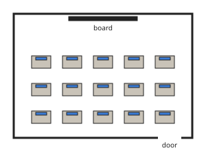

# Computer Science Form 1, Batch S1: drafts for review (Lessons 1–6, 8–11, 13–14, 16–18)

Generated by `npm run review:computer-science` from `content/computer-science/*.json`. Every question and drawing below was built by the engine.
All notes, teach cards, worked examples and paper tasks are **status: draft**. “Authored key” means a person fixed the
right answer (see `AUTHORED.md`); “computed by rule” means code worked it out (a formula, a conversion, a spelling rule).

Teach mode: cards (idea + example + 1 level-1 check) → worked example → practice (levels 1–3) → the note as a summary.

## Sample rendered lesson: Lesson 11 in teach mode

### Lesson 11: Introduction to algorithms

**Card csc11-1** (draft)

> An algorithm is a list of clear steps, in order, that solves a problem.
>
> _A recipe for puff-puff is an algorithm._  

Check question: `cs11-what` · multiple choice, level 1 · **authored key**, reused from practice

> What is an algorithm?

- ◻️ a picture on the screen  
  _↳ feedback if chosen: An algorithm is a list of steps._
- ◻️ a computer virus  
  _↳ feedback if chosen: An algorithm is a list of steps._
- ◻️ a guess  
  _↳ feedback if chosen: An algorithm gives clear steps, not a guess._
- ✅ a list of clear steps, in order, that solves a problem

Full working after a second miss:

> The true statement is “a list of clear steps, in order, that solves a problem”.  
> “a picture on the screen” is false: An algorithm is a list of steps.  
> “a computer virus” is false: An algorithm is a list of steps.  
> “a guess” is false: An algorithm gives clear steps, not a guess.  

**Card csc11-2** (draft)

> Flowchart shapes: oval = start or end; rectangle = process; diamond = decision; parallelogram = input or output.
>
> _“Is it raining?” goes in a diamond._  

Check question: `cs11-shape` · matching, level 1 · **authored key**, reused from practice

> Match each flowchart shape with its meaning.

Right-hand side (shuffled): input or output · a decision (a question with yes or no) · start or end · a process (doing something)
- rectangle → **a process (doing something)**
- parallelogram → **input or output**
- diamond → **a decision (a question with yes or no)**
- oval → **start or end**

Full working after a second miss:

> The right pairs are:  
> rectangle → a process (doing something)  
> parallelogram → input or output  
> diamond → a decision (a question with yes or no)  
> oval → start or end  

**Card csc11-3** (draft)

> Tracing means following the steps one by one and writing down the value each time.
>
> _Start 2, add 5 twice: 7, then 12._  

Check question: `cs11-trace` · number, level 1 · computed by rule, reused from practice

> Trace this algorithm.
> 1. Start with x = 15.
> 2. Add 2 to x.
> 3. Repeat step 2 until it has been done 3 times.
> 4. Output x.

Answer: **21**
- Typed **17** (once) → “Step 2 is done 3 times, not once.”
- Typed **90** (times) → “Add 2 each time; do not multiply.”

Full working after a second miss:

> x starts at 15 and grows by 2 each time, 3 times.  
> 15 + 2 × 3 = 21.  

**Worked example** (draft)

> Trace this algorithm.
> Start with x = 4.
> Add 3 to x, and do this 3 times in all.
> Output x.

1. Start: x = 4.
2. After each addition: 7, 10, 13.
3. Output: 13.

**Answer:** 13

**Practice** (one generated question per template, easiest first)

Practice 1: `cs11-what` · multiple choice, level 1 · **authored key**

> What is an algorithm?

- ◻️ a computer virus  
  _↳ feedback if chosen: An algorithm is a list of steps._
- ◻️ a type of computer  
  _↳ feedback if chosen: An algorithm is a list of steps._
- ◻️ a guess  
  _↳ feedback if chosen: An algorithm gives clear steps, not a guess._
- ✅ a list of clear steps, in order, that solves a problem

Full working after a second miss:

> The true statement is “a list of clear steps, in order, that solves a problem”.  
> “a computer virus” is false: An algorithm is a list of steps.  
> “a type of computer” is false: An algorithm is a list of steps.  
> “a guess” is false: An algorithm gives clear steps, not a guess.  

Practice 2: `cs11-shape` · matching, level 1 · **authored key**

> Match each flowchart shape with its meaning.

Right-hand side (shuffled): a process (doing something) · input or output · start or end · a decision (a question with yes or no)
- parallelogram → **input or output**
- diamond → **a decision (a question with yes or no)**
- rectangle → **a process (doing something)**
- oval → **start or end**

Full working after a second miss:

> The right pairs are:  
> parallelogram → input or output  
> diamond → a decision (a question with yes or no)  
> rectangle → a process (doing something)  
> oval → start or end  

Practice 3: `cs11-trace` · number, level 1 · computed by rule

> Trace this algorithm.
> 1. Start with x = 1.
> 2. Add 3 to x.
> 3. Repeat step 2 until it has been done 3 times.
> 4. Output x.

Answer: **10**
- Typed **4** (once) → “Step 2 is done 3 times, not once.”
- Typed **9** (times) → “Add 3 each time; do not multiply.”

Full working after a second miss:

> x starts at 1 and grows by 3 each time, 3 times.  
> 1 + 3 × 3 = 10.  

Practice 4: `cs11-double` · number, level 2 · computed by rule

> Trace this algorithm.
> 1. Start with x = 2.
> 2. Double x.
> 3. Repeat step 2 until it has been done 4 times.
> 4. Output x.

Answer: **32**
- Typed **10** (add) → “Doubling means multiplying by 2 each time, not adding 2.”

Full working after a second miss:

> x doubles 4 times, starting from 2.  
> 2 × 16 = 32.  

Practice 5: `cs11-if` · multiple choice, level 3 · computed by rule

> 1. Input a number x.
> 2. IF x > 18 THEN output “big” ELSE output “small”.
> The input is 29. What is the output?

- ✅ big
- ◻️ small  
  _↳ feedback if chosen: Check the decision: is 29 greater than 18?_

Full working after a second miss:

> Is 29 > 18? Yes.  
> So the output is “big”.  

**Summary (the note)**

> An algorithm is a list of clear steps, in order, that solves a problem. A recipe and directions to a friend’s house are algorithms.
> A good algorithm: has a start and an end; each step is clear; the steps are in the right order; it gives the right result.
> Algorithms can be written:
> • in words (numbered steps);
> • as a flowchart, with shapes: oval for start or end, rectangle for a process, diamond for a decision (yes or no), parallelogram for input or output;
> • in pseudocode, a simple, structured way of writing steps.
> Tracing an algorithm means following it step by step, writing down the value after each step, to find the result.

## All drafts

| Lesson | Title (sheet) | Status | Cards | Practice | Paper task |
|---|---|---|---|---|---|
| 1 | Introduction to Computer Science | draft | 3 | 4 | — |
| 2 | History of computers | draft | 3 | 5 | — |
| 3 | Classification of Computers | draft | 3 | 4 | — |
| 4 | Introduction to Artificial Intelligence | draft | 3 | 4 | — |
| 5 | Applications and Ethics of Artificial Intelligence | draft | 3 | 4 | — |
| 6 | The use of appropriate Prompts to generate AI responses | draft | 3 | 4 | — |
| 8 | Decomposition | draft | 3 | 4 | — |
| 9 | Pattern recognition | draft | 3 | 5 | — |
| 10 | Abstraction | draft | 3 | 4 | — |
| 11 | Introduction to algorithms | draft | 3 | 5 | — |
| 13 | Components of the computing environment and role | draft | 3 | 5 | — |
| 14 | Users of the computing environment and notions on data and information | draft | 3 | 4 | — |
| 16 | Computer laboratory equipment and devices | draft | 3 | 4 | — |
| 17 | Computer laboratory designs | draft | 3 | 4 | — |
| 18 | Behaviours to adopt in a computer laboratory | draft | 3 | 4 | — |

## Lesson 1: Introduction to Computer Science

Prerequisites: none · Skill: cs1 (What computer science is; input, process, output)

**Note** (draft)

> Computer Science is the study of computers and of how information is processed: how to solve problems with computers, write programs, store data and connect computers together.
> A computer is an electronic machine that accepts data (input), processes it following instructions (a program), stores it, and gives out results (output).
> The information processing cycle:
> • input: data goes in (keyboard, mouse, microphone, scanner, camera);
> • processing: the computer works on the data;
> • output: results come out (screen, printer, speakers);
> • storage: data and results are kept for later (hard disk, flash drive).
> Computers are used in schools, hospitals, banks, farms, offices and homes.

**Card csc1-1** (draft)

> A computer is an electronic machine that accepts data, processes it, stores it and gives results.
>
> _A calculator, a phone and a laptop are all computers of a kind._  

Check question: `csc1-1-check` · multiple choice, level 1 · **authored key**

> What is a computer?

- ◻️ a kind of television  
  _↳ feedback if chosen: A television shows pictures; a computer processes data._
- ◻️ any machine with a motor  
  _↳ feedback if chosen: A motor alone does not process data._
- ◻️ a box that only plays music  
  _↳ feedback if chosen: A computer can do much more: it processes data._
- ✅ an electronic machine that accepts data, processes it, stores it and gives results

Full working after a second miss:

> The true statement is “an electronic machine that accepts data, processes it, stores it and gives results”.  
> “a kind of television” is false: A television shows pictures; a computer processes data.  
> “any machine with a motor” is false: A motor alone does not process data.  
> “a box that only plays music” is false: A computer can do much more: it processes data.  

**Card csc1-2** (draft)

> Input, processing, output and storage make the information processing cycle.
>
> _Keyboard: input. Screen: output._  

Check question: `cs1-ipo` · multiple choice, level 1 · **authored key**, reused from practice

> Which stage is this: the computer adding up the marks?

- ✅ processing
- ◻️ storage  
  _↳ feedback if chosen: Not that stage. Data in, work on it, results out, keep it._
- ◻️ output  
  _↳ feedback if chosen: Not that stage. Data in, work on it, results out, keep it._
- ◻️ input  
  _↳ feedback if chosen: Not that stage. Data in, work on it, results out, keep it._

Full working after a second miss:

> Processing: the computer adding up the marks.  
> Answer: processing.  

**Card csc1-3** (draft)

> Computer Science studies how to solve problems with computers, write programs and use data.
>
> _Writing an app to record class marks is computer science._  

Check question: `cs1-what` · multiple choice, level 1 · **authored key**, reused from practice

> Which is part of computer science?

- ◻️ studying volcanoes  
  _↳ feedback if chosen: That is geography or geology._
- ◻️ cooking rice  
  _↳ feedback if chosen: That is home economics._
- ✅ solving problems with computers
- ◻️ growing maize  
  _↳ feedback if chosen: That is agriculture._

Full working after a second miss:

> The true statement is “solving problems with computers”.  
> “studying volcanoes” is false: That is geography or geology.  
> “cooking rice” is false: That is home economics.  
> “growing maize” is false: That is agriculture.  

**Worked example** (draft)

> A cashier scans the price of rice, the till adds up the total, the total appears on the screen and is saved for the day’s sales. Name the four stages.

1. Scanning the price: input.
2. Adding up the total: processing.
3. Showing the total on the screen: output.
4. Saving it for the day’s sales: storage.

**Answer:** Input, processing, output, storage.

**Practice** `cs1-ipo` · multiple choice, level 1 · **authored key**

> Which stage is this: saving the marks on the hard disk?

- ✅ storage
- ◻️ input  
  _↳ feedback if chosen: Not that stage. Data in, work on it, results out, keep it._
- ◻️ processing  
  _↳ feedback if chosen: Not that stage. Data in, work on it, results out, keep it._
- ◻️ output  
  _↳ feedback if chosen: Not that stage. Data in, work on it, results out, keep it._

Full working after a second miss:

> Storage: saving the marks on the hard disk.  
> Answer: storage.  

> Which stage is this: showing the result on the screen?

- ✅ output
- ◻️ storage  
  _↳ feedback if chosen: Not that stage. Data in, work on it, results out, keep it._
- ◻️ input  
  _↳ feedback if chosen: Not that stage. Data in, work on it, results out, keep it._
- ◻️ processing  
  _↳ feedback if chosen: Not that stage. Data in, work on it, results out, keep it._

Full working after a second miss:

> Output: showing the result on the screen.  
> Answer: output.  

**Practice** `cs1-what` · multiple choice, level 1 · **authored key**

> Which is part of computer science?

- ◻️ cooking rice  
  _↳ feedback if chosen: That is home economics._
- ✅ storing and using data
- ◻️ painting houses  
  _↳ feedback if chosen: That is not computer science._
- ◻️ growing maize  
  _↳ feedback if chosen: That is agriculture._

Full working after a second miss:

> The true statement is “storing and using data”.  
> “cooking rice” is false: That is home economics.  
> “painting houses” is false: That is not computer science.  
> “growing maize” is false: That is agriculture.  

> Which is part of computer science?

- ✅ storing and using data
- ◻️ painting houses  
  _↳ feedback if chosen: That is not computer science._
- ◻️ studying volcanoes  
  _↳ feedback if chosen: That is geography or geology._
- ◻️ cooking rice  
  _↳ feedback if chosen: That is home economics._

Full working after a second miss:

> The true statement is “storing and using data”.  
> “painting houses” is false: That is not computer science.  
> “studying volcanoes” is false: That is geography or geology.  
> “cooking rice” is false: That is home economics.  

**Practice** `cs1-sort` · matching, level 2 · **authored key**

> Sort these devices: input or output?

Groups: input · output
- camera → **input**
- printer → **output**
- speakers → **output**
- projector → **output**
- headphones → **output**
- mouse → **input**

Full working after a second miss:

> The right pairs are:  
> camera → input  
> printer → output  
> speakers → output  
> projector → output  
> headphones → output  
> mouse → input  

> Sort these devices: input or output?

Groups: input · output
- camera → **input**
- printer → **output**
- speakers → **output**
- keyboard → **input**
- screen → **output**
- headphones → **output**

Full working after a second miss:

> The right pairs are:  
> camera → input  
> printer → output  
> speakers → output  
> keyboard → input  
> screen → output  
> headphones → output  

**Practice** `cs1-spot` · spot the error, level 3 · **authored key**

> One sentence is wrong. Which one?

- ◻️ A keyboard is an input device.
- ◻️ A printer is an output device.
- ◻️ Data can be stored for later use.
- ✅ A screen is an input device.  
  _↳ explanation: A screen shows results: output._

Full working after a second miss:

> The wrong statement is “A screen is an input device.”.  
> A screen shows results: output.  

> One sentence is wrong. Which one?

- ✅ Processing means printing the result.  
  _↳ explanation: Processing is working on the data; printing is output._
- ◻️ A printer is an output device.
- ◻️ Data can be stored for later use.
- ◻️ A computer follows instructions called a program.

Full working after a second miss:

> The wrong statement is “Processing means printing the result.”.  
> Processing is working on the data; printing is output.  

## Lesson 2: History of computers

Prerequisites: 1 · Skill: cs2 (History and generations of computers)

**Note** (draft)

> From counting tools to smartphones (dates are approximate):
> • the abacus, used for counting for thousands of years;
> • 1642: Blaise Pascal’s mechanical adding machine (the Pascaline);
> • 1830s: Charles Babbage designs the Analytical Engine; he is called the father of the computer;
> • 1843: Ada Lovelace writes the first computer program;
> • 1946: ENIAC, an early electronic computer, filling a large room;
> • 1980s: personal computers in offices and homes;
> • 2000s: laptops, the Internet everywhere, smartphones.
> Generations of computers (textbooks give slightly different dates):
> 1st vacuum tubes; 2nd transistors; 3rd integrated circuits (chips); 4th microprocessors; 5th artificial intelligence.
> Each generation became smaller, faster, cheaper and more reliable.

**Card csc2-1** (draft)

> Before electronic computers, people used counting tools and machines: the abacus, Pascal’s adding machine, Babbage’s engine.
>
> _Charles Babbage is called the father of the computer._  

Check question: `cs2-who` · multiple choice, level 1 · **authored key**, reused from practice

> Who designed the Analytical Engine and is called the father of the computer?

- ✅ Charles Babbage
- ◻️ Ada Lovelace  
  _↳ feedback if chosen: Not that person. Read the history again._
- ◻️ Blaise Pascal  
  _↳ feedback if chosen: Not that person. Read the history again._

Full working after a second miss:

> Charles Babbage: designed the Analytical Engine and is called the father of the computer.  
> Answer: Charles Babbage.  

**Card csc2-2** (draft)

> There are five generations of computers: vacuum tubes, transistors, integrated circuits, microprocessors, artificial intelligence.
>
> _Your phone has a microprocessor: fourth-generation technology._  

Check question: `cs2-gen` · multiple choice, level 1 · **authored key**, reused from practice

> Which technology belongs to the first generation of computers?

- ◻️ microprocessors  
  _↳ feedback if chosen: In order: vacuum tubes, transistors, integrated circuits, microprocessors, artificial intelligence._
- ✅ vacuum tubes
- ◻️ artificial intelligence  
  _↳ feedback if chosen: In order: vacuum tubes, transistors, integrated circuits, microprocessors, artificial intelligence._
- ◻️ integrated circuits (chips)  
  _↳ feedback if chosen: In order: vacuum tubes, transistors, integrated circuits, microprocessors, artificial intelligence._

Full working after a second miss:

> The generations in order: vacuum tubes, transistors, integrated circuits, microprocessors, artificial intelligence.  
> Generation 1: vacuum tubes.  

**Card csc2-3** (draft)

> Each generation was smaller, faster, cheaper and more reliable.
>
> _ENIAC filled a room; a phone today is far more powerful._  

Check question: `csc2-3-check` · multiple choice, level 1 · **authored key**

> How did computers change from one generation to the next?

- ✅ They became smaller, faster and cheaper.
- ◻️ Nothing changed.  
  _↳ feedback if chosen: They changed a lot._
- ◻️ They became more expensive every time.  
  _↳ feedback if chosen: They became cheaper._
- ◻️ They became bigger and slower.  
  _↳ feedback if chosen: The opposite: smaller and faster._

Full working after a second miss:

> The true statement is “They became smaller, faster and cheaper.”.  
> “Nothing changed.” is false: They changed a lot.  
> “They became more expensive every time.” is false: They became cheaper.  
> “They became bigger and slower.” is false: The opposite: smaller and faster.  

**Worked example** (draft)

> Why did computers become smaller and cheaper from the first to the fourth generation?

1. Vacuum tubes were big, hot and broke often.
2. Transistors, then chips, then microprocessors put more and more parts into a smaller space.
3. So computers became smaller, faster and cheaper.

**Answer:** New technology (transistors, chips, microprocessors) packed more into less space.

**Practice** `cs2-who` · multiple choice, level 1 · **authored key**

> Who built a mechanical adding machine in 1642?

- ◻️ Charles Babbage  
  _↳ feedback if chosen: Not that person. Read the history again._
- ◻️ Ada Lovelace  
  _↳ feedback if chosen: Not that person. Read the history again._
- ✅ Blaise Pascal

Full working after a second miss:

> Blaise Pascal: built a mechanical adding machine in 1642.  
> Answer: Blaise Pascal.  

> Who wrote the first computer program?

- ✅ Ada Lovelace
- ◻️ Charles Babbage  
  _↳ feedback if chosen: Not that person. Read the history again._
- ◻️ Blaise Pascal  
  _↳ feedback if chosen: Not that person. Read the history again._

Full working after a second miss:

> Ada Lovelace: wrote the first computer program.  
> Answer: Ada Lovelace.  

**Practice** `cs2-gen` · multiple choice, level 1 · **authored key**

> Which technology belongs to the second generation of computers?

- ◻️ artificial intelligence  
  _↳ feedback if chosen: In order: vacuum tubes, transistors, integrated circuits, microprocessors, artificial intelligence._
- ◻️ microprocessors  
  _↳ feedback if chosen: In order: vacuum tubes, transistors, integrated circuits, microprocessors, artificial intelligence._
- ✅ transistors
- ◻️ integrated circuits (chips)  
  _↳ feedback if chosen: In order: vacuum tubes, transistors, integrated circuits, microprocessors, artificial intelligence._

Full working after a second miss:

> The generations in order: vacuum tubes, transistors, integrated circuits, microprocessors, artificial intelligence.  
> Generation 2: transistors.  

> Which technology belongs to the fifth generation of computers?

- ◻️ transistors  
  _↳ feedback if chosen: In order: vacuum tubes, transistors, integrated circuits, microprocessors, artificial intelligence._
- ◻️ vacuum tubes  
  _↳ feedback if chosen: In order: vacuum tubes, transistors, integrated circuits, microprocessors, artificial intelligence._
- ✅ artificial intelligence
- ◻️ microprocessors  
  _↳ feedback if chosen: In order: vacuum tubes, transistors, integrated circuits, microprocessors, artificial intelligence._

Full working after a second miss:

> The generations in order: vacuum tubes, transistors, integrated circuits, microprocessors, artificial intelligence.  
> Generation 5: artificial intelligence.  

**Practice** `cs2-order` · ordering, level 2 · **authored key**

> Put these in order, earliest first.

Shown as: the abacus is used for counting · personal computers spread into offices and homes · Blaise Pascal builds a mechanical adding machine (the Pascaline) · ENIAC, an early electronic computer, is switched on
Correct order: the abacus is used for counting → Blaise Pascal builds a mechanical adding machine (the Pascaline) → ENIAC, an early electronic computer, is switched on → personal computers spread into offices and homes

Full working after a second miss:

> The correct order is: the abacus is used for counting → Blaise Pascal builds a mechanical adding machine (the Pascaline) → ENIAC, an early electronic computer, is switched on → personal computers spread into offices and homes.  

> Put these in order, earliest first.

Shown as: ENIAC, an early electronic computer, is switched on · Ada Lovelace writes the first computer program · personal computers spread into offices and homes · smartphones with touch screens spread
Correct order: Ada Lovelace writes the first computer program → ENIAC, an early electronic computer, is switched on → personal computers spread into offices and homes → smartphones with touch screens spread

Full working after a second miss:

> The correct order is: Ada Lovelace writes the first computer program → ENIAC, an early electronic computer, is switched on → personal computers spread into offices and homes → smartphones with touch screens spread.  

**Practice** `cs2-genorder` · ordering, level 2 · **authored key**

> Put these computer technologies in order, oldest first.

Shown as: microprocessors · integrated circuits (chips) · vacuum tubes · transistors
Correct order: vacuum tubes → transistors → integrated circuits (chips) → microprocessors

Full working after a second miss:

> The correct order is: vacuum tubes → transistors → integrated circuits (chips) → microprocessors.  

> Put these computer technologies in order, oldest first.

Shown as: transistors · microprocessors · integrated circuits (chips) · artificial intelligence
Correct order: transistors → integrated circuits (chips) → microprocessors → artificial intelligence

Full working after a second miss:

> The correct order is: transistors → integrated circuits (chips) → microprocessors → artificial intelligence.  

**Practice** `cs2-spot` · spot the error, level 3 · **authored key**

> One sentence is wrong. Which one?

- ◻️ Microprocessors belong to the fourth generation.
- ◻️ Ada Lovelace wrote the first computer program.
- ◻️ The first generation used vacuum tubes.
- ✅ The abacus is an electronic computer.  
  _↳ explanation: The abacus is a counting tool with beads._

Full working after a second miss:

> The wrong statement is “The abacus is an electronic computer.”.  
> The abacus is a counting tool with beads.  

> One sentence is wrong. Which one?

- ◻️ Charles Babbage is called the father of the computer.
- ◻️ The first generation used vacuum tubes.
- ◻️ Microprocessors belong to the fourth generation.
- ✅ The abacus is an electronic computer.  
  _↳ explanation: The abacus is a counting tool with beads._

Full working after a second miss:

> The wrong statement is “The abacus is an electronic computer.”.  
> The abacus is a counting tool with beads.  

## Lesson 3: Classification of Computers

Prerequisites: 2 · Skill: cs3 (Classification of computers)

**Note** (draft)

> Computers can be classified in three ways.
> By size and power:
> • supercomputers: the most powerful, for weather forecasts and big research;
> • mainframes: large computers serving many users at once, for banks and governments;
> • minicomputers (mid-range): for a medium-sized company;
> • microcomputers: personal computers (desktops, laptops, tablets, smartphones).
> By type of data:
> • analog: measure continuously changing quantities (an old speedometer);
> • digital: work with numbers (digits), like most computers today;
> • hybrid: both (some hospital machines).
> By purpose:
> • general-purpose: can do many jobs (a laptop);
> • special-purpose: built for one job (the computer in a washing machine or an ATM).

**Card csc3-1** (draft)

> By size: supercomputers, mainframes, minicomputers, microcomputers (personal computers).
>
> _Your phone is a microcomputer; a weather service may use a supercomputer._  

Check question: `cs3-size` · multiple choice, level 1 · **authored key**, reused from practice

> Which kind of computer is this: a laptop, desktop, tablet or smartphone?

- ◻️ supercomputer  
  _↳ feedback if chosen: Not that kind. Think about size and power._
- ◻️ minicomputer  
  _↳ feedback if chosen: Not that kind. Think about size and power._
- ✅ microcomputer
- ◻️ mainframe  
  _↳ feedback if chosen: Not that kind. Think about size and power._

Full working after a second miss:

> Microcomputer: a laptop, desktop, tablet or smartphone.  
> Answer: microcomputer.  

**Card csc3-2** (draft)

> By data: analog, digital or hybrid. Most computers today are digital.
>
> _A digital computer works with numbers._  

Check question: `cs3-data` · multiple choice, level 1 · **authored key**, reused from practice

> Which type of computer can work in both ways?

- ◻️ analog  
  _↳ feedback if chosen: Digital: numbers. Analog: smooth measurements. Hybrid: both._
- ✅ hybrid
- ◻️ digital  
  _↳ feedback if chosen: Digital: numbers. Analog: smooth measurements. Hybrid: both._

Full working after a second miss:

> Hybrid: can work in both ways.  
> Answer: hybrid.  

**Card csc3-3** (draft)

> By purpose: general-purpose (many jobs) or special-purpose (one job).
>
> _A laptop is general-purpose; a washing machine’s computer is special-purpose._  

Check question: `csc3-3-check` · multiple choice, level 1 · **authored key**

> Which is a special-purpose computer?

- ◻️ a smartphone  
  _↳ feedback if chosen: It can do many jobs._
- ✅ the computer in an ATM
- ◻️ a desktop computer  
  _↳ feedback if chosen: It can do many jobs._
- ◻️ a tablet  
  _↳ feedback if chosen: It can do many jobs._

Full working after a second miss:

> The true statement is “the computer in an ATM”.  
> “a smartphone” is false: It can do many jobs.  
> “a desktop computer” is false: It can do many jobs.  
> “a tablet” is false: It can do many jobs.  

**Worked example** (draft)

> The computer inside a cash machine (ATM) only lets people take out money and check their balance. How is it classified by purpose?

1. It does only one kind of job.
2. A computer built for one job is special-purpose.

**Answer:** Special-purpose.

**Practice** `cs3-size` · multiple choice, level 1 · **authored key**

> Which kind of computer is this: a laptop, desktop, tablet or smartphone?

- ✅ microcomputer
- ◻️ supercomputer  
  _↳ feedback if chosen: Not that kind. Think about size and power._
- ◻️ mainframe  
  _↳ feedback if chosen: Not that kind. Think about size and power._
- ◻️ minicomputer  
  _↳ feedback if chosen: Not that kind. Think about size and power._

Full working after a second miss:

> Microcomputer: a laptop, desktop, tablet or smartphone.  
> Answer: microcomputer.  

> Which kind of computer is this: serves a medium-sized company?

- ✅ minicomputer
- ◻️ supercomputer  
  _↳ feedback if chosen: Not that kind. Think about size and power._
- ◻️ microcomputer  
  _↳ feedback if chosen: Not that kind. Think about size and power._
- ◻️ mainframe  
  _↳ feedback if chosen: Not that kind. Think about size and power._

Full working after a second miss:

> Minicomputer: serves a medium-sized company.  
> Answer: minicomputer.  

**Practice** `cs3-data` · multiple choice, level 1 · **authored key**

> Which type of computer measures quantities that change smoothly, like an old needle speedometer?

- ◻️ hybrid  
  _↳ feedback if chosen: Digital: numbers. Analog: smooth measurements. Hybrid: both._
- ◻️ digital  
  _↳ feedback if chosen: Digital: numbers. Analog: smooth measurements. Hybrid: both._
- ✅ analog

Full working after a second miss:

> Analog: measures quantities that change smoothly, like an old needle speedometer.  
> Answer: analog.  

> Which type of computer works with numbers (digits)?

- ✅ digital
- ◻️ analog  
  _↳ feedback if chosen: Digital: numbers. Analog: smooth measurements. Hybrid: both._
- ◻️ hybrid  
  _↳ feedback if chosen: Digital: numbers. Analog: smooth measurements. Hybrid: both._

Full working after a second miss:

> Digital: works with numbers (digits).  
> Answer: digital.  

**Practice** `cs3-sort` · matching, level 2 · **authored key**

> Sort these: general-purpose or special-purpose?

Groups: general-purpose · special-purpose
- tablet → **general-purpose**
- desktop computer → **general-purpose**
- washing machine controller → **special-purpose**
- ATM → **special-purpose**
- smartphone → **general-purpose**
- traffic-light controller → **special-purpose**

Full working after a second miss:

> The right pairs are:  
> tablet → general-purpose  
> desktop computer → general-purpose  
> washing machine controller → special-purpose  
> ATM → special-purpose  
> smartphone → general-purpose  
> traffic-light controller → special-purpose  

> Sort these: general-purpose or special-purpose?

Groups: general-purpose · special-purpose
- laptop → **general-purpose**
- smartphone → **general-purpose**
- washing machine controller → **special-purpose**
- tablet → **general-purpose**
- desktop computer → **general-purpose**
- digital watch → **special-purpose**

Full working after a second miss:

> The right pairs are:  
> laptop → general-purpose  
> smartphone → general-purpose  
> washing machine controller → special-purpose  
> tablet → general-purpose  
> desktop computer → general-purpose  
> digital watch → special-purpose  

**Practice** `cs3-spot` · spot the error, level 3 · **authored key**

> One sentence is wrong. Which one?

- ◻️ An ATM is special-purpose.
- ◻️ Most computers today are digital.
- ✅ A washing machine’s computer is general-purpose.  
  _↳ explanation: It does one job: special-purpose._
- ◻️ Supercomputers are the most powerful.

Full working after a second miss:

> The wrong statement is “A washing machine’s computer is general-purpose.”.  
> It does one job: special-purpose.  

> One sentence is wrong. Which one?

- ◻️ Most computers today are digital.
- ◻️ Supercomputers are the most powerful.
- ✅ A washing machine’s computer is general-purpose.  
  _↳ explanation: It does one job: special-purpose._
- ◻️ A laptop is a microcomputer.

Full working after a second miss:

> The wrong statement is “A washing machine’s computer is general-purpose.”.  
> It does one job: special-purpose.  

## Lesson 4: Introduction to Artificial Intelligence

Prerequisites: 1 · Skill: cs4 (What artificial intelligence is)

**Note** (draft)

> Artificial intelligence (AI) is the ability of computer systems to do tasks that usually need human intelligence: recognising speech and pictures, translating languages, answering questions, recommending things and playing games.
> Many AI systems learn from examples: they are shown very large amounts of data and find patterns in it. This is called machine learning.
> Examples: a phone that unlocks when it sees your face; a voice assistant; a translation app; an email filter that removes spam; a chatbot that answers questions.
> Limits: AI can make mistakes, sometimes with great confidence; it has no feelings; it only knows what its data and design allow; it can be unfair if its data is unfair. People must check its work.

**Card csc4-1** (draft)

> AI is the ability of computers to do tasks that usually need human intelligence.
>
> _Recognising a face in a photo is an AI task._  

Check question: `cs4-which` · multiple choice, level 1 · **authored key**, reused from practice

> Which of these uses artificial intelligence?

- ◻️ a door key  
  _↳ feedback if chosen: It is not a computer system._
- ✅ a phone that unlocks when it recognises your face
- ◻️ a simple light switch  
  _↳ feedback if chosen: It only turns on and off._
- ◻️ a pencil  
  _↳ feedback if chosen: It is not a computer system._

Full working after a second miss:

> The true statement is “a phone that unlocks when it recognises your face”.  
> “a door key” is false: It is not a computer system.  
> “a simple light switch” is false: It only turns on and off.  
> “a pencil” is false: It is not a computer system.  

**Card csc4-2** (draft)

> Many AI systems learn patterns from large amounts of data: machine learning.
>
> _A spam filter learns from many emails marked as spam._  

Check question: `cs4-learn` · multiple choice, level 1 · **authored key**, reused from practice

> How do many AI systems learn?

- ◻️ by eating  
  _↳ feedback if chosen: Computers do not eat._
- ◻️ by going to school  
  _↳ feedback if chosen: They are trained on data, not taught in school._
- ✅ by finding patterns in large amounts of example data
- ◻️ by guessing randomly forever  
  _↳ feedback if chosen: They learn patterns from data._

Full working after a second miss:

> The true statement is “by finding patterns in large amounts of example data”.  
> “by eating” is false: Computers do not eat.  
> “by going to school” is false: They are trained on data, not taught in school.  
> “by guessing randomly forever” is false: They learn patterns from data.  

**Card csc4-3** (draft)

> AI can make mistakes and has no feelings; people must check its work.
>
> _A chatbot can give a wrong date and sound sure._  

Check question: `csc4-3-check` · multiple choice, level 1 · **authored key**

> Which is true about AI?

- ◻️ It works without any data.  
  _↳ feedback if chosen: AI learns from data._
- ◻️ It has feelings like a person.  
  _↳ feedback if chosen: AI has no feelings._
- ◻️ It is always right.  
  _↳ feedback if chosen: AI can be wrong, even when it sounds sure._
- ✅ It can make mistakes, so its answers must be checked.

Full working after a second miss:

> The true statement is “It can make mistakes, so its answers must be checked.”.  
> “It works without any data.” is false: AI learns from data.  
> “It has feelings like a person.” is false: AI has no feelings.  
> “It is always right.” is false: AI can be wrong, even when it sounds sure.  

**Worked example** (draft)

> A translation app turns an English sentence into French. Is this AI? How did it learn?

1. Translating a language usually needs human intelligence, so the app uses AI.
2. It learnt from very many examples of sentences in both languages (machine learning).

**Answer:** Yes; it learnt from many example translations.

**Practice** `cs4-which` · multiple choice, level 1 · **authored key**

> Which of these uses artificial intelligence?

- ◻️ a pencil  
  _↳ feedback if chosen: It is not a computer system._
- ✅ a spam filter that learns which emails are junk
- ◻️ a wind-up clock  
  _↳ feedback if chosen: It does not learn or recognise anything._
- ◻️ a simple light switch  
  _↳ feedback if chosen: It only turns on and off._

Full working after a second miss:

> The true statement is “a spam filter that learns which emails are junk”.  
> “a pencil” is false: It is not a computer system.  
> “a wind-up clock” is false: It does not learn or recognise anything.  
> “a simple light switch” is false: It only turns on and off.  

> Which of these uses artificial intelligence?

- ✅ a phone that unlocks when it recognises your face
- ◻️ a pencil  
  _↳ feedback if chosen: It is not a computer system._
- ◻️ a simple light switch  
  _↳ feedback if chosen: It only turns on and off._
- ◻️ a wind-up clock  
  _↳ feedback if chosen: It does not learn or recognise anything._

Full working after a second miss:

> The true statement is “a phone that unlocks when it recognises your face”.  
> “a pencil” is false: It is not a computer system.  
> “a simple light switch” is false: It only turns on and off.  
> “a wind-up clock” is false: It does not learn or recognise anything.  

**Practice** `cs4-learn` · multiple choice, level 1 · **authored key**

> How do many AI systems learn?

- ◻️ by going to school  
  _↳ feedback if chosen: They are trained on data, not taught in school._
- ◻️ by eating  
  _↳ feedback if chosen: Computers do not eat._
- ◻️ by guessing randomly forever  
  _↳ feedback if chosen: They learn patterns from data._
- ✅ by finding patterns in large amounts of example data

Full working after a second miss:

> The true statement is “by finding patterns in large amounts of example data”.  
> “by going to school” is false: They are trained on data, not taught in school.  
> “by eating” is false: Computers do not eat.  
> “by guessing randomly forever” is false: They learn patterns from data.  

> How do many AI systems learn?

- ◻️ by guessing randomly forever  
  _↳ feedback if chosen: They learn patterns from data._
- ✅ by finding patterns in large amounts of example data
- ◻️ by eating  
  _↳ feedback if chosen: Computers do not eat._
- ◻️ they never learn  
  _↳ feedback if chosen: Machine learning means learning from data._

Full working after a second miss:

> The true statement is “by finding patterns in large amounts of example data”.  
> “by guessing randomly forever” is false: They learn patterns from data.  
> “by eating” is false: Computers do not eat.  
> “they never learn” is false: Machine learning means learning from data.  

**Practice** `cs4-sort` · matching, level 2 · **authored key**

> Sort these: an AI task, or not?

Groups: AI task · not AI
- recommending videos you may like → **AI task**
- recognising faces in photos → **AI task**
- answering spoken questions → **AI task**
- translating a sentence → **AI task**
- a fan turning → **not AI**
- a calculator adding two numbers → **not AI**

Full working after a second miss:

> The right pairs are:  
> recommending videos you may like → AI task  
> recognising faces in photos → AI task  
> answering spoken questions → AI task  
> translating a sentence → AI task  
> a fan turning → not AI  
> a calculator adding two numbers → not AI  

> Sort these: an AI task, or not?

Groups: AI task · not AI
- a calculator adding two numbers → **not AI**
- a clock ticking → **not AI**
- recommending videos you may like → **AI task**
- a fan turning → **not AI**
- recognising faces in photos → **AI task**
- switching on a bulb → **not AI**

Full working after a second miss:

> The right pairs are:  
> a calculator adding two numbers → not AI  
> a clock ticking → not AI  
> recommending videos you may like → AI task  
> a fan turning → not AI  
> recognising faces in photos → AI task  
> switching on a bulb → not AI  

**Practice** `cs4-spot` · spot the error, level 3 · **authored key**

> One sentence is wrong. Which one?

- ◻️ Machine learning uses data.
- ◻️ A spam filter can use AI.
- ◻️ AI can make mistakes.
- ✅ AI is always right.  
  _↳ explanation: AI can be wrong; check its work._

Full working after a second miss:

> The wrong statement is “AI is always right.”.  
> AI can be wrong; check its work.  

> One sentence is wrong. Which one?

- ✅ AI does not need any data.  
  _↳ explanation: Most AI learns from data._
- ◻️ A spam filter can use AI.
- ◻️ AI can recognise speech.
- ◻️ AI can make mistakes.

Full working after a second miss:

> The wrong statement is “AI does not need any data.”.  
> Most AI learns from data.  

## Lesson 5: Applications and Ethics of Artificial Intelligence

Prerequisites: 4 · Skill: cs5 (Uses and ethics of AI)

**Note** (draft)

> Uses of AI:
> • health: helping doctors read X-rays and scans;
> • farming: spotting crop diseases from photos of leaves;
> • transport: maps that find the fastest route;
> • education: practice apps that adapt to the learner;
> • banking: spotting fraud;
> • languages: translation and speech-to-text.
> Ethics (doing what is right) with AI:
> • privacy: do not share personal information (full name, address, photos, passwords) with AI tools;
> • honesty: do not hand in AI work as your own;
> • accuracy: check facts, because AI can be wrong;
> • fairness: AI can be biased if its data is unfair;
> • safety: fake pictures and voices (deepfakes) can be made with AI, so be careful what you believe and share.

**Card csc5-1** (draft)

> AI is used in health, farming, transport, education, banking and translation.
>
> _An app can spot cassava disease from a photo of a leaf._  

Check question: `cs5-use` · multiple choice, level 1 · **authored key**, reused from practice

> In which area is AI used for spotting stolen bank cards being used?

- ✅ banking
- ◻️ health  
  _↳ feedback if chosen: Not that area._
- ◻️ languages  
  _↳ feedback if chosen: Not that area._
- ◻️ farming  
  _↳ feedback if chosen: Not that area._

Full working after a second miss:

> Banking: spotting stolen bank cards being used.  
> Answer: banking.  

**Card csc5-2** (draft)

> Be honest: do not hand in AI work as your own; check its facts.
>
> _Use AI to help you understand, then write your own answer._  

Check question: `cs5-right` · multiple choice, level 1 · **authored key**, reused from practice

> Which is the right way to use AI for homework?

- ◻️ give it your full name and address  
  _↳ feedback if chosen: Protect your privacy._
- ◻️ copy its answer and hand it in as your own  
  _↳ feedback if chosen: That is dishonest._
- ◻️ use it to write a fake message from a friend  
  _↳ feedback if chosen: That is dishonest and can hurt people._
- ✅ use it to understand, then write your own answer and check the facts

Full working after a second miss:

> The true statement is “use it to understand, then write your own answer and check the facts”.  
> “give it your full name and address” is false: Protect your privacy.  
> “copy its answer and hand it in as your own” is false: That is dishonest.  
> “use it to write a fake message from a friend” is false: That is dishonest and can hurt people.  

**Card csc5-3** (draft)

> Protect privacy: never share your full name, address, photos or passwords with AI tools.
>
> _Keep personal details out of your questions._  

Check question: `csc5-3-check` · multiple choice, level 1 · **authored key**

> Which should you NOT share with an AI tool?

- ✅ your password
- ◻️ a maths problem  
  _↳ feedback if chosen: That is fine to ask._
- ◻️ the name of a planet  
  _↳ feedback if chosen: That is not personal._
- ◻️ a request to explain fractions  
  _↳ feedback if chosen: That is fine to ask._

Full working after a second miss:

> The true statement is “your password”.  
> “a maths problem” is false: That is fine to ask.  
> “the name of a planet” is false: That is not personal.  
> “a request to explain fractions” is false: That is fine to ask.  

**Worked example** (draft)

> Ngozi asks an AI tool to write her History homework and hands it in as her own. What is wrong?

1. The work was not written by Ngozi.
2. Handing it in as her own is dishonest.
3. She also has not checked whether the facts are right.

**Answer:** It is dishonest, and the facts may be wrong.

**Practice** `cs5-use` · multiple choice, level 1 · **authored key**

> In which area is AI used for turning speech into written words?

- ◻️ banking  
  _↳ feedback if chosen: Not that area._
- ◻️ transport  
  _↳ feedback if chosen: Not that area._
- ◻️ health  
  _↳ feedback if chosen: Not that area._
- ✅ languages

Full working after a second miss:

> Languages: turning speech into written words.  
> Answer: languages.  

> In which area is AI used for finding the fastest road between two towns?

- ◻️ health  
  _↳ feedback if chosen: Not that area._
- ◻️ languages  
  _↳ feedback if chosen: Not that area._
- ◻️ banking  
  _↳ feedback if chosen: Not that area._
- ✅ transport

Full working after a second miss:

> Transport: finding the fastest road between two towns.  
> Answer: transport.  

**Practice** `cs5-right` · multiple choice, level 1 · **authored key**

> Which is the right way to use AI for homework?

- ◻️ believe everything it says  
  _↳ feedback if chosen: AI can be wrong._
- ✅ use it to understand, then write your own answer and check the facts
- ◻️ copy its answer and hand it in as your own  
  _↳ feedback if chosen: That is dishonest._
- ◻️ use it to write a fake message from a friend  
  _↳ feedback if chosen: That is dishonest and can hurt people._

Full working after a second miss:

> The true statement is “use it to understand, then write your own answer and check the facts”.  
> “believe everything it says” is false: AI can be wrong.  
> “copy its answer and hand it in as your own” is false: That is dishonest.  
> “use it to write a fake message from a friend” is false: That is dishonest and can hurt people.  

> Which is the right way to use AI for homework?

- ◻️ use it to write a fake message from a friend  
  _↳ feedback if chosen: That is dishonest and can hurt people._
- ✅ use it to understand, then write your own answer and check the facts
- ◻️ give it your full name and address  
  _↳ feedback if chosen: Protect your privacy._
- ◻️ believe everything it says  
  _↳ feedback if chosen: AI can be wrong._

Full working after a second miss:

> The true statement is “use it to understand, then write your own answer and check the facts”.  
> “use it to write a fake message from a friend” is false: That is dishonest and can hurt people.  
> “give it your full name and address” is false: Protect your privacy.  
> “believe everything it says” is false: AI can be wrong.  

**Practice** `cs5-sort` · matching, level 2 · **authored key**

> Sort these: responsible or irresponsible use of AI?

Groups: responsible · irresponsible
- asking AI to explain a hard word → **responsible**
- handing in AI work as your own → **irresponsible**
- making a fake photo of a classmate → **irresponsible**
- keeping personal details private → **responsible**
- saying when you used AI → **responsible**
- sharing a password with a chatbot → **irresponsible**

Full working after a second miss:

> The right pairs are:  
> asking AI to explain a hard word → responsible  
> handing in AI work as your own → irresponsible  
> making a fake photo of a classmate → irresponsible  
> keeping personal details private → responsible  
> saying when you used AI → responsible  
> sharing a password with a chatbot → irresponsible  

> Sort these: responsible or irresponsible use of AI?

Groups: responsible · irresponsible
- keeping personal details private → **responsible**
- checking AI facts in a textbook → **responsible**
- making a fake photo of a classmate → **irresponsible**
- spreading an AI answer without checking it → **irresponsible**
- handing in AI work as your own → **irresponsible**
- asking AI to explain a hard word → **responsible**

Full working after a second miss:

> The right pairs are:  
> keeping personal details private → responsible  
> checking AI facts in a textbook → responsible  
> making a fake photo of a classmate → irresponsible  
> spreading an AI answer without checking it → irresponsible  
> handing in AI work as your own → irresponsible  
> asking AI to explain a hard word → responsible  

**Practice** `cs5-spot` · spot the error, level 3 · **authored key**

> One sentence is wrong. Which one?

- ◻️ AI can help doctors read X-rays.
- ◻️ AI can be biased if its data is unfair.
- ✅ It is fine to hand in AI work as your own.  
  _↳ explanation: That is dishonest._
- ◻️ AI answers should be checked.

Full working after a second miss:

> The wrong statement is “It is fine to hand in AI work as your own.”.  
> That is dishonest.  

> One sentence is wrong. Which one?

- ◻️ AI answers should be checked.
- ◻️ AI can be biased if its data is unfair.
- ◻️ Deepfakes can make fake pictures and voices.
- ✅ AI is always fair.  
  _↳ explanation: AI can be unfair if its data is unfair._

Full working after a second miss:

> The wrong statement is “AI is always fair.”.  
> AI can be unfair if its data is unfair.  

## Lesson 6: The use of appropriate Prompts to generate AI responses

Prerequisites: 5 · Skill: cs6 (Writing clear prompts for AI)

**Note** (draft)

> A prompt is the question or instruction you give to an AI tool.
> A good prompt is:
> • clear and specific: say exactly what you want;
> • gives context: who it is for and what you already know;
> • says the form of the answer: a list, a short paragraph, three examples, simple English;
> • safe: it contains no personal information.
> Compare: “Tell me about plants.” (vague) with “Explain in five simple sentences, for a Form 1 pupil, how a plant makes its food.” (clear).
> After the answer: read it carefully, check the facts in a book or with a teacher, and ask a follow-up question if something is unclear.

**Card csc6-1** (draft)

> A prompt is the question or instruction you give to an AI tool.
>
> _“Explain fractions with two examples” is a prompt._  

Check question: `cs6-what` · multiple choice, level 1 · **authored key**, reused from practice

> What is a prompt?

- ✅ the question or instruction you give to an AI tool
- ◻️ the password of the computer  
  _↳ feedback if chosen: A prompt is a question or instruction._
- ◻️ a computer virus  
  _↳ feedback if chosen: A prompt is a question or instruction._
- ◻️ the screen of a computer  
  _↳ feedback if chosen: A prompt is what you type or say._

Full working after a second miss:

> The true statement is “the question or instruction you give to an AI tool”.  
> “the password of the computer” is false: A prompt is a question or instruction.  
> “a computer virus” is false: A prompt is a question or instruction.  
> “the screen of a computer” is false: A prompt is what you type or say.  

**Card csc6-2** (draft)

> A good prompt is clear and specific, gives context and says the form of the answer.
>
> _“In three simple sentences, for a Form 1 pupil, explain what a cell is.”_  

Check question: `cs6-best` · multiple choice, level 1 · **authored key**, reused from practice

> Which prompt is the clearest?

- ◻️ Tell me stuff.  
  _↳ feedback if chosen: Too vague: say exactly what you want._
- ◻️ Science?  
  _↳ feedback if chosen: Too vague._
- ◻️ Write something.  
  _↳ feedback if chosen: Too vague: about what, for whom, how long?_
- ✅ List three causes of soil erosion, with one example each.

Full working after a second miss:

> The true statement is “List three causes of soil erosion, with one example each.”.  
> “Tell me stuff.” is false: Too vague: say exactly what you want.  
> “Science?” is false: Too vague.  
> “Write something.” is false: Too vague: about what, for whom, how long?  

**Card csc6-3** (draft)

> After the answer: read carefully, check facts, and ask a follow-up if needed. Never put personal details in a prompt.
>
> _“Can you give one more example?” is a follow-up._  

Check question: `csc6-3-check` · multiple choice, level 1 · **authored key**

> What should you do after an AI tool answers?

- ◻️ give the AI your phone number  
  _↳ feedback if chosen: Never share personal details._
- ◻️ assume it is always right  
  _↳ feedback if chosen: AI can be wrong._
- ✅ check the facts in a book or with a teacher
- ◻️ share it with everyone at once  
  _↳ feedback if chosen: Check it first._

Full working after a second miss:

> The true statement is “check the facts in a book or with a teacher”.  
> “give the AI your phone number” is false: Never share personal details.  
> “assume it is always right” is false: AI can be wrong.  
> “share it with everyone at once” is false: Check it first.  

**Worked example** (draft)

> Improve this prompt: “Write about Cameroon.”

1. It is too vague: about what? for whom? how long?
2. Add the topic, the reader and the form.
3. For example: “List five main rivers of Cameroon, with one sentence about each, for a Form 1 pupil.”

**Answer:** Make it specific: topic, reader and form of the answer.

**Practice** `cs6-what` · multiple choice, level 1 · **authored key**

> What is a prompt?

- ◻️ the answer the AI gives  
  _↳ feedback if chosen: That is the response._
- ◻️ a computer virus  
  _↳ feedback if chosen: A prompt is a question or instruction._
- ✅ the question or instruction you give to an AI tool
- ◻️ the password of the computer  
  _↳ feedback if chosen: A prompt is a question or instruction._

Full working after a second miss:

> The true statement is “the question or instruction you give to an AI tool”.  
> “the answer the AI gives” is false: That is the response.  
> “a computer virus” is false: A prompt is a question or instruction.  
> “the password of the computer” is false: A prompt is a question or instruction.  

> What is a prompt?

- ◻️ the answer the AI gives  
  _↳ feedback if chosen: That is the response._
- ✅ the question or instruction you give to an AI tool
- ◻️ a computer virus  
  _↳ feedback if chosen: A prompt is a question or instruction._
- ◻️ the screen of a computer  
  _↳ feedback if chosen: A prompt is what you type or say._

Full working after a second miss:

> The true statement is “the question or instruction you give to an AI tool”.  
> “the answer the AI gives” is false: That is the response.  
> “a computer virus” is false: A prompt is a question or instruction.  
> “the screen of a computer” is false: A prompt is what you type or say.  

**Practice** `cs6-best` · multiple choice, level 1 · **authored key**

> Which prompt is the clearest?

- ✅ Explain in five simple sentences, for a Form 1 pupil, how a plant makes its food.
- ◻️ Tell me stuff.  
  _↳ feedback if chosen: Too vague: say exactly what you want._
- ◻️ Science?  
  _↳ feedback if chosen: Too vague._
- ◻️ Plants.  
  _↳ feedback if chosen: Too vague: what about plants?_

Full working after a second miss:

> The true statement is “Explain in five simple sentences, for a Form 1 pupil, how a plant makes its food.”.  
> “Tell me stuff.” is false: Too vague: say exactly what you want.  
> “Science?” is false: Too vague.  
> “Plants.” is false: Too vague: what about plants?  

> Which prompt is the clearest?

- ✅ Explain in five simple sentences, for a Form 1 pupil, how a plant makes its food.
- ◻️ Plants.  
  _↳ feedback if chosen: Too vague: what about plants?_
- ◻️ Science?  
  _↳ feedback if chosen: Too vague._
- ◻️ Tell me stuff.  
  _↳ feedback if chosen: Too vague: say exactly what you want._

Full working after a second miss:

> The true statement is “Explain in five simple sentences, for a Form 1 pupil, how a plant makes its food.”.  
> “Plants.” is false: Too vague: what about plants?  
> “Science?” is false: Too vague.  
> “Tell me stuff.” is false: Too vague: say exactly what you want.  

**Practice** `cs6-missing` · multiple choice, level 2 · **authored key**

> What is wrong with or missing from this prompt?
> “List rivers.” (The pupil wants rivers of Cameroon.)

- ◻️ the form and level of the answer  
  _↳ feedback if chosen: Look again: is it the topic, the context, the form, or something unsafe?_
- ✅ the context: which country
- ◻️ what the topic is  
  _↳ feedback if chosen: Look again: is it the topic, the context, the form, or something unsafe?_
- ◻️ nothing is missing, but personal details must be removed  
  _↳ feedback if chosen: Look again: is it the topic, the context, the form, or something unsafe?_

Full working after a second miss:

> The context: which country: “List rivers.” (The pupil wants rivers of Cameroon.).  
> Answer: the context: which country.  

> What is wrong with or missing from this prompt?
> “List rivers.” (The pupil wants rivers of Cameroon.)

- ✅ the context: which country
- ◻️ the form and level of the answer  
  _↳ feedback if chosen: Look again: is it the topic, the context, the form, or something unsafe?_
- ◻️ what the topic is  
  _↳ feedback if chosen: Look again: is it the topic, the context, the form, or something unsafe?_
- ◻️ nothing is missing, but personal details must be removed  
  _↳ feedback if chosen: Look again: is it the topic, the context, the form, or something unsafe?_

Full working after a second miss:

> The context: which country: “List rivers.” (The pupil wants rivers of Cameroon.).  
> Answer: the context: which country.  

**Practice** `cs6-spot` · spot the error, level 3 · **authored key**

> One sentence is wrong. Which one?

- ◻️ You can ask a follow-up question.
- ◻️ A prompt can say who the answer is for.
- ✅ A shorter, vaguer prompt always gives a better answer.  
  _↳ explanation: Clear, specific prompts give better answers._
- ◻️ A good prompt is specific.

Full working after a second miss:

> The wrong statement is “A shorter, vaguer prompt always gives a better answer.”.  
> Clear, specific prompts give better answers.  

> One sentence is wrong. Which one?

- ◻️ A prompt can say who the answer is for.
- ✅ A shorter, vaguer prompt always gives a better answer.  
  _↳ explanation: Clear, specific prompts give better answers._
- ◻️ AI answers should be checked.
- ◻️ A good prompt is specific.

Full working after a second miss:

> The wrong statement is “A shorter, vaguer prompt always gives a better answer.”.  
> Clear, specific prompts give better answers.  

## Lesson 8: Decomposition

Prerequisites: 1 · Skill: cs8 (Decomposition)

**Note** (draft)

> Computational thinking is a way of solving problems that computer scientists use. It has four parts: decomposition, pattern recognition, abstraction and algorithms.
> Decomposition means breaking a big problem into smaller parts that are easier to solve, one at a time.
> Example: organising a class party breaks into: decide the date and place; list what is needed; collect money and buy; decorate and prepare food; hold the party; clean up.
> Advantages: each part is easier; different people can work on different parts; it is easier to find and fix mistakes.

**Card csc8-1** (draft)

> Decomposition is breaking a big problem into smaller parts that are easier to solve.
>
> _Writing a story: plan, write the beginning, the middle, the end, then check._  

Check question: `cs8-what` · multiple choice, level 1 · **authored key**, reused from practice

> What is decomposition?

- ◻️ writing steps in order  
  _↳ feedback if chosen: That is an algorithm._
- ◻️ ignoring details that do not matter  
  _↳ feedback if chosen: That is abstraction._
- ✅ breaking a big problem into smaller parts
- ◻️ finding what repeats  
  _↳ feedback if chosen: That is pattern recognition._

Full working after a second miss:

> The true statement is “breaking a big problem into smaller parts”.  
> “writing steps in order” is false: That is an algorithm.  
> “ignoring details that do not matter” is false: That is abstraction.  
> “finding what repeats” is false: That is pattern recognition.  

**Card csc8-2** (draft)

> The small parts are solved one at a time, often in a sensible order.
>
> _You cannot clean up before the party._  

Check question: `cs8-order` · ordering, level 1 · **authored key**, reused from practice

> Organising a class party: put the parts in a sensible order.

Shown as: decorate the room and prepare food · make a list of what is needed · collect money and buy the items · decide the date and place · hold the party · clean up
Correct order: decide the date and place → make a list of what is needed → collect money and buy the items → decorate the room and prepare food → hold the party → clean up

Full working after a second miss:

> The correct order is: decide the date and place → make a list of what is needed → collect money and buy the items → decorate the room and prepare food → hold the party → clean up.  

**Card csc8-3** (draft)

> Decomposition lets people share the work and makes mistakes easier to find.
>
> _One group decorates while another buys drinks._  

Check question: `csc8-3-check` · multiple choice, level 1 · **authored key**

> Why is decomposition useful?

- ◻️ It means one person must do everything.  
  _↳ feedback if chosen: Work can be shared._
- ✅ Different people can work on different parts.
- ◻️ It removes the need to think.  
  _↳ feedback if chosen: You still think about each part._
- ◻️ It makes the problem bigger.  
  _↳ feedback if chosen: It makes each part smaller._

Full working after a second miss:

> The true statement is “Different people can work on different parts.”.  
> “It means one person must do everything.” is false: Work can be shared.  
> “It removes the need to think.” is false: You still think about each part.  
> “It makes the problem bigger.” is false: It makes each part smaller.  

**Worked example** (draft)

> Break the task “cook rice and stew for lunch” into smaller parts.

1. Get the ingredients (rice, tomatoes, onions, oil, meat or fish).
2. Prepare them: wash the rice, cut the vegetables.
3. Cook the rice; cook the stew.
4. Serve, then wash up.

**Answer:** Get ingredients → prepare → cook → serve and wash up.

**Practice** `cs8-what` · multiple choice, level 1 · **authored key**

> What is decomposition?

- ◻️ ignoring details that do not matter  
  _↳ feedback if chosen: That is abstraction._
- ◻️ throwing a problem away  
  _↳ feedback if chosen: Decomposition breaks it into parts._
- ✅ breaking a big problem into smaller parts
- ◻️ writing steps in order  
  _↳ feedback if chosen: That is an algorithm._

Full working after a second miss:

> The true statement is “breaking a big problem into smaller parts”.  
> “ignoring details that do not matter” is false: That is abstraction.  
> “throwing a problem away” is false: Decomposition breaks it into parts.  
> “writing steps in order” is false: That is an algorithm.  

> What is decomposition?

- ◻️ finding what repeats  
  _↳ feedback if chosen: That is pattern recognition._
- ◻️ throwing a problem away  
  _↳ feedback if chosen: Decomposition breaks it into parts._
- ✅ breaking a big problem into smaller parts
- ◻️ ignoring details that do not matter  
  _↳ feedback if chosen: That is abstraction._

Full working after a second miss:

> The true statement is “breaking a big problem into smaller parts”.  
> “finding what repeats” is false: That is pattern recognition.  
> “throwing a problem away” is false: Decomposition breaks it into parts.  
> “ignoring details that do not matter” is false: That is abstraction.  

**Practice** `cs8-order` · ordering, level 1 · **authored key**

> Organising a class party: put the parts in a sensible order.

Shown as: decide the date and place · collect money and buy the items · clean up · make a list of what is needed · hold the party · decorate the room and prepare food
Correct order: decide the date and place → make a list of what is needed → collect money and buy the items → decorate the room and prepare food → hold the party → clean up

Full working after a second miss:

> The correct order is: decide the date and place → make a list of what is needed → collect money and buy the items → decorate the room and prepare food → hold the party → clean up.  

> Organising a class party: put the parts in a sensible order.

Shown as: decorate the room and prepare food · hold the party · make a list of what is needed · clean up · decide the date and place · collect money and buy the items
Correct order: decide the date and place → make a list of what is needed → collect money and buy the items → decorate the room and prepare food → hold the party → clean up

Full working after a second miss:

> The correct order is: decide the date and place → make a list of what is needed → collect money and buy the items → decorate the room and prepare food → hold the party → clean up.  

**Practice** `cs8-ct` · matching, level 2 · **authored key**

> Match each part of computational thinking with what it means.

Right-hand side (shuffled): finding what is the same or repeats · keeping only the important details · breaking a problem into smaller parts · a list of steps in order to solve a problem
- decomposition → **breaking a problem into smaller parts**
- abstraction → **keeping only the important details**
- pattern recognition → **finding what is the same or repeats**
- algorithm → **a list of steps in order to solve a problem**

Full working after a second miss:

> The right pairs are:  
> decomposition → breaking a problem into smaller parts  
> abstraction → keeping only the important details  
> pattern recognition → finding what is the same or repeats  
> algorithm → a list of steps in order to solve a problem  

> Match each part of computational thinking with what it means.

Right-hand side (shuffled): a list of steps in order to solve a problem · finding what is the same or repeats · keeping only the important details · breaking a problem into smaller parts
- algorithm → **a list of steps in order to solve a problem**
- abstraction → **keeping only the important details**
- pattern recognition → **finding what is the same or repeats**
- decomposition → **breaking a problem into smaller parts**

Full working after a second miss:

> The right pairs are:  
> algorithm → a list of steps in order to solve a problem  
> abstraction → keeping only the important details  
> pattern recognition → finding what is the same or repeats  
> decomposition → breaking a problem into smaller parts  

**Practice** `cs8-spot` · spot the error, level 3 · **authored key**

> One sentence is wrong. Which one?

- ✅ Decomposition only works for computers.  
  _↳ explanation: It works for any problem, like planning a party._
- ◻️ Decomposition makes big problems easier.
- ◻️ Decomposition is part of computational thinking.
- ◻️ Different people can solve different parts.

Full working after a second miss:

> The wrong statement is “Decomposition only works for computers.”.  
> It works for any problem, like planning a party.  

> One sentence is wrong. Which one?

- ◻️ Different people can solve different parts.
- ◻️ Decomposition makes big problems easier.
- ◻️ Decomposition is part of computational thinking.
- ✅ Decomposition makes mistakes harder to find.  
  _↳ explanation: Smaller parts make mistakes easier to find._

Full working after a second miss:

> The wrong statement is “Decomposition makes mistakes harder to find.”.  
> Smaller parts make mistakes easier to find.  

## Lesson 9: Pattern recognition

Prerequisites: 8 · Skill: cs9 (Pattern recognition)

**Note** (draft)

> Pattern recognition means finding what is the same, or what repeats, in problems and data. Once we see a pattern we can predict what comes next and reuse a solution.
> Number patterns: 3, 7, 11, 15, … adds 4 each time, so the next number is 19. 2, 4, 8, 16, … doubles each time.
> Shape patterns: circle, square, triangle, circle, square, triangle, … repeats every three shapes.
> To find a far-away shape in a repeating pattern, divide its position by the length of the pattern and look at the remainder.
> Patterns are everywhere: the days of the week, school timetables, the seasons, the numbers on a calendar.

**Card csc9-1** (draft)

> Pattern recognition is finding what is the same or what repeats.
>
> _Monday follows Sunday every week._  

Check question: `cs9-shape` · multiple choice, level 1 · computed by rule, reused from practice

> What shape comes next?

- ◻️ circle  
  _↳ feedback if chosen: Find the group of shapes that repeats, then continue it._
- ◻️ triangle  
  _↳ feedback if chosen: Find the group of shapes that repeats, then continue it._
- ✅ square
- ◻️ star  
  _↳ feedback if chosen: Find the group of shapes that repeats, then continue it._

Full working after a second miss:

> The group that repeats has 3 shapes.  
> Shape number 9 is a square.  

**Card csc9-2** (draft)

> In a number pattern, look at how each number changes: add the same amount, or double.
>
> _5, 8, 11, 14: add 3 each time._  

Check question: `cs9-next` · number, level 1 · computed by rule, reused from practice

> What is the next number? 23, 25, 27, 29, …

Answer: **31**
- Typed **30** (one) → “Find how much is added each time: 2.”

Full working after a second miss:

> Each number is 2 more than the one before.  
> 29 + 2 = 31.  

**Card csc9-3** (draft)

> A repeating pattern repeats a group of shapes; find the group, then continue it.
>
> _Circle, square, circle, square: the group is “circle, square”._  

Check question: `csc9-3-check` · multiple choice, level 1 · computed by rule

> What shape comes next?

- ◻️ triangle  
  _↳ feedback if chosen: Find the group of shapes that repeats, then continue it._
- ◻️ circle  
  _↳ feedback if chosen: Find the group of shapes that repeats, then continue it._
- ✅ square
- ◻️ star  
  _↳ feedback if chosen: Find the group of shapes that repeats, then continue it._

Full working after a second miss:

> The group that repeats has 3 shapes.  
> Shape number 5 is a square.  

**Worked example** (draft)

> What are the next two numbers in the pattern 3, 7, 11, 15, …?

1. Find the difference between neighbours: 7 − 3 = 4.
2. The pattern adds 4 each time.
3. 15 + 4 = 19, then 19 + 4 = 23.

**Answer:** 19 and 23.

**Practice** `cs9-next` · number, level 1 · computed by rule

> What is the next number? 17, 19, 21, 23, …

Answer: **25**
- Typed **24** (one) → “Find how much is added each time: 2.”

Full working after a second miss:

> Each number is 2 more than the one before.  
> 23 + 2 = 25.  

> What is the next number? 26, 29, 32, 35, …

Answer: **38**
- Typed **36** (one) → “Find how much is added each time: 3.”

Full working after a second miss:

> Each number is 3 more than the one before.  
> 35 + 3 = 38.  

**Practice** `cs9-shape` · multiple choice, level 1 · computed by rule

> What shape comes next?

- ◻️ star  
  _↳ feedback if chosen: Find the group of shapes that repeats, then continue it._
- ◻️ triangle  
  _↳ feedback if chosen: Find the group of shapes that repeats, then continue it._
- ✅ square
- ◻️ circle  
  _↳ feedback if chosen: Find the group of shapes that repeats, then continue it._

Full working after a second miss:

> The group that repeats has 3 shapes.  
> Shape number 6 is a square.  

> What shape comes next?

- ◻️ square  
  _↳ feedback if chosen: Find the group of shapes that repeats, then continue it._
- ◻️ star  
  _↳ feedback if chosen: Find the group of shapes that repeats, then continue it._
- ✅ circle
- ◻️ triangle  
  _↳ feedback if chosen: Find the group of shapes that repeats, then continue it._

Full working after a second miss:

> The group that repeats has 3 shapes.  
> Shape number 7 is a circle.  

**Practice** `cs9-double` · number, level 2 · computed by rule

> What is the next number? 1, 2, 4, 8, …

Answer: **16**
- Typed **12** (add) → “The numbers do not go up by the same amount: each one is double the one before.”

Full working after a second miss:

> Each number is double the one before.  
> 8 × 2 = 16.  

> What is the next number? 3, 6, 12, 24, …

Answer: **48**
- Typed **36** (add) → “The numbers do not go up by the same amount: each one is double the one before.”

Full working after a second miss:

> Each number is double the one before.  
> 24 × 2 = 48.  

**Practice** `cs9-far` · multiple choice, level 3 · computed by rule

> This pattern keeps repeating. What is shape number 37?

- ◻️ square  
  _↳ feedback if chosen: Divide the position by the length of the group and use the remainder._
- ✅ circle
- ◻️ triangle  
  _↳ feedback if chosen: Divide the position by the length of the group and use the remainder._
- ◻️ star  
  _↳ feedback if chosen: Divide the position by the length of the group and use the remainder._

Full working after a second miss:

> The group has 3 shapes. 37 ÷ 3 = 12 remainder 1.  
> Remainder 1 means shape number 1 of the group: circle.  

> This pattern keeps repeating. What is shape number 20?

- ◻️ triangle  
  _↳ feedback if chosen: Divide the position by the length of the group and use the remainder._
- ◻️ square  
  _↳ feedback if chosen: Divide the position by the length of the group and use the remainder._
- ◻️ star  
  _↳ feedback if chosen: Divide the position by the length of the group and use the remainder._
- ✅ circle

Full working after a second miss:

> The group has 3 shapes. 20 ÷ 3 = 6 remainder 2.  
> Remainder 2 means shape number 2 of the group: circle.  

**Practice** `cs9-nth` · number, level 3 · computed by rule

> The pattern 4, 9, 14, 19, … continues. What is number 11 in the pattern?

Answer: **54**
- Typed **59** (off) → “The first number has no 5 added yet: add 5 only 10 times.”

Full working after a second miss:

> The first number is 4; each one adds 5.  
> Number 11: 4 + 5 × 10 = 54.  

> The pattern 20, 29, 38, 47, … continues. What is number 14 in the pattern?

Answer: **137**
- Typed **146** (off) → “The first number has no 9 added yet: add 9 only 13 times.”

Full working after a second miss:

> The first number is 20; each one adds 9.  
> Number 14: 20 + 9 × 13 = 137.  

## Lesson 10: Abstraction

Prerequisites: 8 · Skill: cs10 (Abstraction)

**Note** (draft)

> Abstraction means keeping only the details that matter for a task and leaving out the rest.
> Examples:
> • a map of bus stops shows the stops and the order, not the colour of the houses;
> • a school timetable shows the day, time and subject, not what the teacher is wearing;
> • the symbol of a person on a toilet door is simple but clear.
> Which details matter depends on the task: to find the way to the market, the roads matter; to buy fruit, the prices matter.
> Abstraction helps us make models, maps, diagrams and programs that are simple and useful.

**Card csc10-1** (draft)

> Abstraction keeps only the details that matter for the task.
>
> _A bus map shows stops, not trees._  

Check question: `cs10-keep` · multiple choice, level 1 · **authored key**, reused from practice

> A visitor needs a map to find the school. Which detail is important?

- ◻️ the number of chickens on the road  
  _↳ feedback if chosen: Not needed for finding the way._
- ◻️ the weather today  
  _↳ feedback if chosen: Not needed for the map._
- ◻️ the colour of every house  
  _↳ feedback if chosen: It does not help find the way._
- ✅ the roads and the turns

Full working after a second miss:

> The true statement is “the roads and the turns”.  
> “the number of chickens on the road” is false: Not needed for finding the way.  
> “the weather today” is false: Not needed for the map.  
> “the colour of every house” is false: It does not help find the way.  

**Card csc10-2** (draft)

> Which details matter depends on the task.
>
> _To find a classroom, the room number matters; the paint colour does not._  

Check question: `cs10-which` · multiple choice, level 1 · **authored key**, reused from practice

> Which detail matters most for buying the cheapest rice?

- ✅ the prices
- ◻️ the bus number and its stops  
  _↳ feedback if chosen: That detail matters for a different task._
- ◻️ the time and the subject on the timetable  
  _↳ feedback if chosen: That detail matters for a different task._
- ◻️ the room number  
  _↳ feedback if chosen: That detail matters for a different task._

Full working after a second miss:

> The prices: buying the cheapest rice.  
> Answer: the prices.  

**Card csc10-3** (draft)

> Maps, timetables, symbols and diagrams are abstractions.
>
> _A timetable shows the day, time and subject._  

Check question: `csc10-3-check` · multiple choice, level 1 · **authored key**

> Which is an example of abstraction?

- ◻️ a photo showing every detail  
  _↳ feedback if chosen: It keeps every detail; abstraction leaves some out._
- ◻️ writing down everything you see  
  _↳ feedback if chosen: Abstraction keeps only what matters._
- ◻️ a list of every leaf on a tree  
  _↳ feedback if chosen: Too many details: nothing is left out._
- ✅ a timetable showing only day, time and subject

Full working after a second miss:

> The true statement is “a timetable showing only day, time and subject”.  
> “a photo showing every detail” is false: It keeps every detail; abstraction leaves some out.  
> “writing down everything you see” is false: Abstraction keeps only what matters.  
> “a list of every leaf on a tree” is false: Too many details: nothing is left out.  

**Worked example** (draft)

> Mbah draws a map to show a visitor the way from the junction to his house. Which details should he keep?

1. The visitor needs the roads, the turns and some landmarks (the church, the market).
2. Details like the colour of every house or the number of trees do not help.

**Answer:** Roads, turns and a few landmarks; leave out the rest.

**Practice** `cs10-keep` · multiple choice, level 1 · **authored key**

> A visitor needs a map to find the school. Which detail is important?

- ◻️ the names of all the shopkeepers  
  _↳ feedback if chosen: Not needed._
- ✅ the roads and the turns
- ◻️ the weather today  
  _↳ feedback if chosen: Not needed for the map._
- ◻️ the colour of every house  
  _↳ feedback if chosen: It does not help find the way._

Full working after a second miss:

> The true statement is “the roads and the turns”.  
> “the names of all the shopkeepers” is false: Not needed.  
> “the weather today” is false: Not needed for the map.  
> “the colour of every house” is false: It does not help find the way.  

> A visitor needs a map to find the school. Which detail is important?

- ✅ landmarks such as the market
- ◻️ the weather today  
  _↳ feedback if chosen: Not needed for the map._
- ◻️ the names of all the shopkeepers  
  _↳ feedback if chosen: Not needed._
- ◻️ the number of chickens on the road  
  _↳ feedback if chosen: Not needed for finding the way._

Full working after a second miss:

> The true statement is “landmarks such as the market”.  
> “the weather today” is false: Not needed for the map.  
> “the names of all the shopkeepers” is false: Not needed.  
> “the number of chickens on the road” is false: Not needed for finding the way.  

**Practice** `cs10-which` · multiple choice, level 1 · **authored key**

> Which detail matters most for catching the right bus?

- ◻️ the prices  
  _↳ feedback if chosen: That detail matters for a different task._
- ◻️ the time and the subject on the timetable  
  _↳ feedback if chosen: That detail matters for a different task._
- ◻️ the room number  
  _↳ feedback if chosen: That detail matters for a different task._
- ✅ the bus number and its stops

Full working after a second miss:

> The bus number and its stops: catching the right bus.  
> Answer: the bus number and its stops.  

> Which detail matters most for finding a classroom?

- ◻️ the time and the subject on the timetable  
  _↳ feedback if chosen: That detail matters for a different task._
- ◻️ the bus number and its stops  
  _↳ feedback if chosen: That detail matters for a different task._
- ✅ the room number
- ◻️ the prices  
  _↳ feedback if chosen: That detail matters for a different task._

Full working after a second miss:

> The room number: finding a classroom.  
> Answer: the room number.  

**Practice** `cs10-sort` · matching, level 2 · **authored key**

> A map for walking from school to the market: keep or leave out?

Groups: keep · leave out
- the names of all the people → **leave out**
- the market → **keep**
- the main road → **keep**
- the clouds → **leave out**
- the church on the corner → **keep**
- the dogs on the street → **leave out**

Full working after a second miss:

> The right pairs are:  
> the names of all the people → leave out  
> the market → keep  
> the main road → keep  
> the clouds → leave out  
> the church on the corner → keep  
> the dogs on the street → leave out  

> A map for walking from school to the market: keep or leave out?

Groups: keep · leave out
- the main road → **keep**
- the church on the corner → **keep**
- the dogs on the street → **leave out**
- where to turn left → **keep**
- the market → **keep**
- the colour of the houses → **leave out**

Full working after a second miss:

> The right pairs are:  
> the main road → keep  
> the church on the corner → keep  
> the dogs on the street → leave out  
> where to turn left → keep  
> the market → keep  
> the colour of the houses → leave out  

**Practice** `cs10-spot` · spot the error, level 3 · **authored key**

> One sentence is wrong. Which one?

- ◻️ Abstraction leaves out unneeded details.
- ✅ Abstraction means keeping every detail.  
  _↳ explanation: It keeps only what matters._
- ◻️ A map is an abstraction.
- ◻️ Which details matter depends on the task.

Full working after a second miss:

> The wrong statement is “Abstraction means keeping every detail.”.  
> It keeps only what matters.  

> One sentence is wrong. Which one?

- ◻️ Which details matter depends on the task.
- ◻️ Abstraction leaves out unneeded details.
- ✅ Abstraction makes things more complicated.  
  _↳ explanation: It makes them simpler._
- ◻️ A map is an abstraction.

Full working after a second miss:

> The wrong statement is “Abstraction makes things more complicated.”.  
> It makes them simpler.  

## Lesson 11: Introduction to algorithms

Prerequisites: 8 · Skill: cs11 (Algorithms)

**Note** (draft)

> An algorithm is a list of clear steps, in order, that solves a problem. A recipe and directions to a friend’s house are algorithms.
> A good algorithm: has a start and an end; each step is clear; the steps are in the right order; it gives the right result.
> Algorithms can be written:
> • in words (numbered steps);
> • as a flowchart, with shapes: oval for start or end, rectangle for a process, diamond for a decision (yes or no), parallelogram for input or output;
> • in pseudocode, a simple, structured way of writing steps.
> Tracing an algorithm means following it step by step, writing down the value after each step, to find the result.

**Card csc11-1** (draft)

> An algorithm is a list of clear steps, in order, that solves a problem.
>
> _A recipe for puff-puff is an algorithm._  

Check question: `cs11-what` · multiple choice, level 1 · **authored key**, reused from practice

> What is an algorithm?

- ✅ a list of clear steps, in order, that solves a problem
- ◻️ a picture on the screen  
  _↳ feedback if chosen: An algorithm is a list of steps._
- ◻️ a type of computer  
  _↳ feedback if chosen: An algorithm is a list of steps._
- ◻️ a computer virus  
  _↳ feedback if chosen: An algorithm is a list of steps._

Full working after a second miss:

> The true statement is “a list of clear steps, in order, that solves a problem”.  
> “a picture on the screen” is false: An algorithm is a list of steps.  
> “a type of computer” is false: An algorithm is a list of steps.  
> “a computer virus” is false: An algorithm is a list of steps.  

**Card csc11-2** (draft)

> Flowchart shapes: oval = start or end; rectangle = process; diamond = decision; parallelogram = input or output.
>
> _“Is it raining?” goes in a diamond._  

Check question: `cs11-shape` · matching, level 1 · **authored key**, reused from practice

> Match each flowchart shape with its meaning.

Right-hand side (shuffled): a process (doing something) · start or end · a decision (a question with yes or no) · input or output
- rectangle → **a process (doing something)**
- diamond → **a decision (a question with yes or no)**
- oval → **start or end**
- parallelogram → **input or output**

Full working after a second miss:

> The right pairs are:  
> rectangle → a process (doing something)  
> diamond → a decision (a question with yes or no)  
> oval → start or end  
> parallelogram → input or output  

**Card csc11-3** (draft)

> Tracing means following the steps one by one and writing down the value each time.
>
> _Start 2, add 5 twice: 7, then 12._  

Check question: `cs11-trace` · number, level 1 · computed by rule, reused from practice

> Trace this algorithm.
> 1. Start with x = 16.
> 2. Add 4 to x.
> 3. Repeat step 2 until it has been done 4 times.
> 4. Output x.

Answer: **32**
- Typed **20** (once) → “Step 2 is done 4 times, not once.”
- Typed **256** (times) → “Add 4 each time; do not multiply.”

Full working after a second miss:

> x starts at 16 and grows by 4 each time, 4 times.  
> 16 + 4 × 4 = 32.  

**Worked example** (draft)

> Trace this algorithm.
> Start with x = 4.
> Add 3 to x, and do this 3 times in all.
> Output x.

1. Start: x = 4.
2. After each addition: 7, 10, 13.
3. Output: 13.

**Answer:** 13

**Practice** `cs11-what` · multiple choice, level 1 · **authored key**

> What is an algorithm?

- ◻️ a type of computer  
  _↳ feedback if chosen: An algorithm is a list of steps._
- ◻️ a picture on the screen  
  _↳ feedback if chosen: An algorithm is a list of steps._
- ◻️ a guess  
  _↳ feedback if chosen: An algorithm gives clear steps, not a guess._
- ✅ a list of clear steps, in order, that solves a problem

Full working after a second miss:

> The true statement is “a list of clear steps, in order, that solves a problem”.  
> “a type of computer” is false: An algorithm is a list of steps.  
> “a picture on the screen” is false: An algorithm is a list of steps.  
> “a guess” is false: An algorithm gives clear steps, not a guess.  

> What is an algorithm?

- ✅ a list of clear steps, in order, that solves a problem
- ◻️ a picture on the screen  
  _↳ feedback if chosen: An algorithm is a list of steps._
- ◻️ a guess  
  _↳ feedback if chosen: An algorithm gives clear steps, not a guess._
- ◻️ a computer virus  
  _↳ feedback if chosen: An algorithm is a list of steps._

Full working after a second miss:

> The true statement is “a list of clear steps, in order, that solves a problem”.  
> “a picture on the screen” is false: An algorithm is a list of steps.  
> “a guess” is false: An algorithm gives clear steps, not a guess.  
> “a computer virus” is false: An algorithm is a list of steps.  

**Practice** `cs11-shape` · matching, level 1 · **authored key**

> Match each flowchart shape with its meaning.

Right-hand side (shuffled): input or output · a process (doing something) · start or end · a decision (a question with yes or no)
- diamond → **a decision (a question with yes or no)**
- parallelogram → **input or output**
- rectangle → **a process (doing something)**
- oval → **start or end**

Full working after a second miss:

> The right pairs are:  
> diamond → a decision (a question with yes or no)  
> parallelogram → input or output  
> rectangle → a process (doing something)  
> oval → start or end  

> Match each flowchart shape with its meaning.

Right-hand side (shuffled): a process (doing something) · a decision (a question with yes or no) · input or output · start or end
- rectangle → **a process (doing something)**
- diamond → **a decision (a question with yes or no)**
- oval → **start or end**
- parallelogram → **input or output**

Full working after a second miss:

> The right pairs are:  
> rectangle → a process (doing something)  
> diamond → a decision (a question with yes or no)  
> oval → start or end  
> parallelogram → input or output  

**Practice** `cs11-trace` · number, level 1 · computed by rule

> Trace this algorithm.
> 1. Start with x = 7.
> 2. Add 2 to x.
> 3. Repeat step 2 until it has been done 3 times.
> 4. Output x.

Answer: **13**
- Typed **9** (once) → “Step 2 is done 3 times, not once.”
- Typed **42** (times) → “Add 2 each time; do not multiply.”

Full working after a second miss:

> x starts at 7 and grows by 2 each time, 3 times.  
> 7 + 2 × 3 = 13.  

> Trace this algorithm.
> 1. Start with x = 5.
> 2. Add 9 to x.
> 3. Repeat step 2 until it has been done 2 times.
> 4. Output x.

Answer: **23**
- Typed **14** (once) → “Step 2 is done 2 times, not once.”
- Typed **90** (times) → “Add 9 each time; do not multiply.”

Full working after a second miss:

> x starts at 5 and grows by 9 each time, 2 times.  
> 5 + 9 × 2 = 23.  

**Practice** `cs11-double` · number, level 2 · computed by rule

> Trace this algorithm.
> 1. Start with x = 2.
> 2. Double x.
> 3. Repeat step 2 until it has been done 3 times.
> 4. Output x.

Answer: **16**
- Typed **8** (add) → “Doubling means multiplying by 2 each time, not adding 2.”

Full working after a second miss:

> x doubles 3 times, starting from 2.  
> 2 × 8 = 16.  

> Trace this algorithm.
> 1. Start with x = 3.
> 2. Double x.
> 3. Repeat step 2 until it has been done 3 times.
> 4. Output x.

Answer: **24**
- Typed **9** (add) → “Doubling means multiplying by 2 each time, not adding 2.”

Full working after a second miss:

> x doubles 3 times, starting from 3.  
> 3 × 8 = 24.  

**Practice** `cs11-if` · multiple choice, level 3 · computed by rule

> 1. Input a number x.
> 2. IF x > 5 THEN output “big” ELSE output “small”.
> The input is 7. What is the output?

- ✅ big
- ◻️ small  
  _↳ feedback if chosen: Check the decision: is 7 greater than 5?_

Full working after a second miss:

> Is 7 > 5? Yes.  
> So the output is “big”.  

> 1. Input a number x.
> 2. IF x > 21 THEN output “big” ELSE output “small”.
> The input is 8. What is the output?

- ✅ small
- ◻️ big  
  _↳ feedback if chosen: Check the decision: is 8 greater than 21?_

Full working after a second miss:

> Is 8 > 21? No.  
> So the output is “small”.  

## Lesson 13: Components of the computing environment and role

Prerequisites: 1 · Skill: cs13 (Components of the computing environment)

**Note** (draft)

> A computing environment has several components that work together:
> • hardware: the physical parts (screen, keyboard, mouse, system unit, printer);
> • software: the programs. System software runs the computer (the operating system, such as Windows, Linux or Android). Application software does jobs for the user (word processor, spreadsheet, browser, games);
> • data: the facts and figures the computer works on;
> • users (people): the people who use and look after the system;
> • network: the connections (cables, Wi-Fi, the Internet) that let computers share data;
> • procedures: the rules and steps for using the system safely and well.
> Hardware without software cannot do anything; software needs hardware to run on.

**Card csc13-1** (draft)

> Hardware is the physical parts you can touch; software is the programs.
>
> _The keyboard is hardware; a game is software._  

Check question: `cs13-sort` · matching, level 1 · **authored key**, reused from practice

> Sort these: hardware or software?

Groups: hardware · software
- operating system → **software**
- a game → **software**
- printer → **hardware**
- mouse → **hardware**
- keyboard → **hardware**
- web browser → **software**

Full working after a second miss:

> The right pairs are:  
> operating system → software  
> a game → software  
> printer → hardware  
> mouse → hardware  
> keyboard → hardware  
> web browser → software  

**Card csc13-2** (draft)

> System software runs the computer; application software does jobs for the user.
>
> _The operating system is system software; a word processor is application software._  

Check question: `cs13-soft` · multiple choice, level 1 · **authored key**, reused from practice

> What kind of software is a word processor?

- ◻️ system software  
  _↳ feedback if chosen: System software runs the computer; application software does a job for the user._
- ✅ application software

Full working after a second miss:

> Application software: a word processor.  
> Answer: application software.  

**Card csc13-3** (draft)

> Data, users, networks and procedures complete the computing environment.
>
> _The school’s Wi-Fi is part of the network._  

Check question: `cs13-match` · matching, level 1 · **authored key**, reused from practice

> Match each component with its meaning.

Right-hand side (shuffled): the rules and steps for using the system · the physical parts you can touch: screen, keyboard, processor · the people who use and look after computers · the connections that let computers share data
- network → **the connections that let computers share data**
- hardware → **the physical parts you can touch: screen, keyboard, processor**
- procedures → **the rules and steps for using the system**
- users (people) → **the people who use and look after computers**

Full working after a second miss:

> The right pairs are:  
> network → the connections that let computers share data  
> hardware → the physical parts you can touch: screen, keyboard, processor  
> procedures → the rules and steps for using the system  
> users (people) → the people who use and look after computers  

**Worked example** (draft)

> In the school office, a secretary types report cards in a word processor on a desktop computer, which prints them on a shared printer. Name the hardware, software, data and user.

1. Hardware: the desktop computer and the printer.
2. Software: the word processor (and the operating system).
3. Data: the pupils’ marks and names.
4. User: the secretary.

**Answer:** Hardware: computer, printer. Software: word processor. Data: marks. User: secretary.

**Practice** `cs13-sort` · matching, level 1 · **authored key**

> Sort these: hardware or software?

Groups: hardware · software
- mouse → **hardware**
- spreadsheet program → **software**
- a game → **software**
- web browser → **software**
- system unit → **hardware**
- operating system → **software**

Full working after a second miss:

> The right pairs are:  
> mouse → hardware  
> spreadsheet program → software  
> a game → software  
> web browser → software  
> system unit → hardware  
> operating system → software  

> Sort these: hardware or software?

Groups: hardware · software
- web browser → **software**
- screen → **hardware**
- operating system → **software**
- a game → **software**
- spreadsheet program → **software**
- system unit → **hardware**

Full working after a second miss:

> The right pairs are:  
> web browser → software  
> screen → hardware  
> operating system → software  
> a game → software  
> spreadsheet program → software  
> system unit → hardware  

**Practice** `cs13-soft` · multiple choice, level 1 · **authored key**

> What kind of software is an operating system such as Windows, Linux or Android?

- ◻️ application software  
  _↳ feedback if chosen: System software runs the computer; application software does a job for the user._
- ✅ system software

Full working after a second miss:

> System software: an operating system such as Windows, Linux or Android.  
> Answer: system software.  

> What kind of software is a web browser?

- ✅ application software
- ◻️ system software  
  _↳ feedback if chosen: System software runs the computer; application software does a job for the user._

Full working after a second miss:

> Application software: a web browser.  
> Answer: application software.  

**Practice** `cs13-match` · matching, level 1 · **authored key**

> Match each component with its meaning.

Right-hand side (shuffled): the rules and steps for using the system · the connections that let computers share data · the programs that tell the computer what to do · the people who use and look after computers
- users (people) → **the people who use and look after computers**
- software → **the programs that tell the computer what to do**
- network → **the connections that let computers share data**
- procedures → **the rules and steps for using the system**

Full working after a second miss:

> The right pairs are:  
> users (people) → the people who use and look after computers  
> software → the programs that tell the computer what to do  
> network → the connections that let computers share data  
> procedures → the rules and steps for using the system  

> Match each component with its meaning.

Right-hand side (shuffled): the programs that tell the computer what to do · the people who use and look after computers · the connections that let computers share data · the rules and steps for using the system
- procedures → **the rules and steps for using the system**
- users (people) → **the people who use and look after computers**
- software → **the programs that tell the computer what to do**
- network → **the connections that let computers share data**

Full working after a second miss:

> The right pairs are:  
> procedures → the rules and steps for using the system  
> users (people) → the people who use and look after computers  
> software → the programs that tell the computer what to do  
> network → the connections that let computers share data  

**Practice** `cs13-need` · multiple choice, level 2 · **authored key**

> Why does hardware need software?

- ◻️ Software makes the screen bigger.  
  _↳ feedback if chosen: Software gives instructions._
- ◻️ Software keeps the hardware cool.  
  _↳ feedback if chosen: Software gives instructions; a fan keeps it cool._
- ✅ Without programs, the hardware does not know what to do.
- ◻️ Software is the plug.  
  _↳ feedback if chosen: Software is the programs._

Full working after a second miss:

> The true statement is “Without programs, the hardware does not know what to do.”.  
> “Software makes the screen bigger.” is false: Software gives instructions.  
> “Software keeps the hardware cool.” is false: Software gives instructions; a fan keeps it cool.  
> “Software is the plug.” is false: Software is the programs.  

> Why does hardware need software?

- ✅ Without programs, the hardware does not know what to do.
- ◻️ Software is the plug.  
  _↳ feedback if chosen: Software is the programs._
- ◻️ Software keeps the hardware cool.  
  _↳ feedback if chosen: Software gives instructions; a fan keeps it cool._
- ◻️ Software makes the screen bigger.  
  _↳ feedback if chosen: Software gives instructions._

Full working after a second miss:

> The true statement is “Without programs, the hardware does not know what to do.”.  
> “Software is the plug.” is false: Software is the programs.  
> “Software keeps the hardware cool.” is false: Software gives instructions; a fan keeps it cool.  
> “Software makes the screen bigger.” is false: Software gives instructions.  

**Practice** `cs13-spot` · spot the error, level 3 · **authored key**

> One sentence is wrong. Which one?

- ◻️ A mouse is hardware.
- ✅ Software can be touched with your hands.  
  _↳ explanation: Software is programs; you touch hardware._
- ◻️ A network lets computers share data.
- ◻️ A web browser is application software.

Full working after a second miss:

> The wrong statement is “Software can be touched with your hands.”.  
> Software is programs; you touch hardware.  

> One sentence is wrong. Which one?

- ◻️ A mouse is hardware.
- ✅ Software can be touched with your hands.  
  _↳ explanation: Software is programs; you touch hardware._
- ◻️ A web browser is application software.
- ◻️ A network lets computers share data.

Full working after a second miss:

> The wrong statement is “Software can be touched with your hands.”.  
> Software is programs; you touch hardware.  

## Lesson 14: Users of the computing environment and notions on data and information

Prerequisites: 13 · Skill: cs14 (Users; data and information)

**Note** (draft)

> Users of the computing environment:
> • end users: people who use computers for their work or studies (pupils, secretaries, cashiers);
> • programmers: people who write software;
> • technicians and system administrators: people who install, repair and look after computers and networks;
> • data entry clerks: people who type data into the computer.
> Data and information:
> • data are raw facts with no meaning yet: “12, 15, 9, 14”;
> • information is data that has been processed so it has meaning: “The average mark is 12.5 out of 20.”
> Computers turn data into information. Good information must be correct, complete, up to date and clear.

**Card csc14-1** (draft)

> Users include end users, programmers, technicians and data entry clerks.
>
> _A programmer writes apps; a technician repairs computers._  

Check question: `cs14-who` · multiple choice, level 1 · **authored key**, reused from practice

> Who writes computer programs?

- ◻️ an end user  
  _↳ feedback if chosen: Not that user. Read what each one does._
- ◻️ a data entry clerk  
  _↳ feedback if chosen: Not that user. Read what each one does._
- ◻️ a technician  
  _↳ feedback if chosen: Not that user. Read what each one does._
- ✅ a programmer

Full working after a second miss:

> A programmer: writes computer programs.  
> Answer: a programmer.  

**Card csc14-2** (draft)

> Data are raw facts; information is processed data that has meaning.
>
> _“25, 30, 28” is data; “The hottest day was 30 °C” is information._  

Check question: `cs14-sort` · matching, level 1 · **authored key**, reused from practice

> Sort these: data or information?

Groups: data · information
- Three out of four pupils said yes. → **information**
- Tuesday was the hottest day. → **information**
- yes, no, yes, yes → **data**
- Bih, Ewane, Ngozi → **data**
- The class average is 12.5. → **information**
- Bih came first in the class. → **information**

Full working after a second miss:

> The right pairs are:  
> Three out of four pupils said yes. → information  
> Tuesday was the hottest day. → information  
> yes, no, yes, yes → data  
> Bih, Ewane, Ngozi → data  
> The class average is 12.5. → information  
> Bih came first in the class. → information  

**Card csc14-3** (draft)

> Good information is correct, complete, up to date and clear.
>
> _Last year’s timetable is not up to date._  

Check question: `csc14-3-check` · multiple choice, level 1 · **authored key**

> Which makes information good?

- ◻️ It is hard to understand.  
  _↳ feedback if chosen: Good information is clear._
- ◻️ Some of it is missing.  
  _↳ feedback if chosen: Good information is complete._
- ◻️ It is partly wrong.  
  _↳ feedback if chosen: Good information is correct._
- ✅ It is correct and up to date.

Full working after a second miss:

> The true statement is “It is correct and up to date.”.  
> “It is hard to understand.” is false: Good information is clear.  
> “Some of it is missing.” is false: Good information is complete.  
> “It is partly wrong.” is false: Good information is correct.  

**Worked example** (draft)

> A teacher types the marks 12, 15 and 9 into a spreadsheet, which shows “Class average: 12”. Which is data and which is information?

1. The marks on their own are raw facts: data.
2. “Class average: 12” has been processed and has meaning: information.

**Answer:** The marks are data; the average is information.

**Practice** `cs14-who` · multiple choice, level 1 · **authored key**

> Who writes computer programs?

- ◻️ a data entry clerk  
  _↳ feedback if chosen: Not that user. Read what each one does._
- ◻️ an end user  
  _↳ feedback if chosen: Not that user. Read what each one does._
- ◻️ a technician  
  _↳ feedback if chosen: Not that user. Read what each one does._
- ✅ a programmer

Full working after a second miss:

> A programmer: writes computer programs.  
> Answer: a programmer.  

> Who uses a computer to do homework?

- ◻️ a programmer  
  _↳ feedback if chosen: Not that user. Read what each one does._
- ✅ an end user
- ◻️ a data entry clerk  
  _↳ feedback if chosen: Not that user. Read what each one does._
- ◻️ a technician  
  _↳ feedback if chosen: Not that user. Read what each one does._

Full working after a second miss:

> An end user: uses a computer to do homework.  
> Answer: an end user.  

**Practice** `cs14-sort` · matching, level 1 · **authored key**

> Sort these: data or information?

Groups: data · information
- yes, no, yes, yes → **data**
- The class average is 12.5. → **information**
- Three out of four pupils said yes. → **information**
- Bih came first in the class. → **information**
- 12, 15, 9, 14 → **data**
- Tuesday was the hottest day. → **information**

Full working after a second miss:

> The right pairs are:  
> yes, no, yes, yes → data  
> The class average is 12.5. → information  
> Three out of four pupils said yes. → information  
> Bih came first in the class. → information  
> 12, 15, 9, 14 → data  
> Tuesday was the hottest day. → information  

> Sort these: data or information?

Groups: data · information
- Bih came first in the class. → **information**
- 28, 30, 27 → **data**
- Three out of four pupils said yes. → **information**
- Bih, Ewane, Ngozi → **data**
- The class average is 12.5. → **information**
- 12, 15, 9, 14 → **data**

Full working after a second miss:

> The right pairs are:  
> Bih came first in the class. → information  
> 28, 30, 27 → data  
> Three out of four pupils said yes. → information  
> Bih, Ewane, Ngozi → data  
> The class average is 12.5. → information  
> 12, 15, 9, 14 → data  

**Practice** `cs14-turn` · multiple choice, level 2 · **authored key**

> What does a computer do to turn data into information?

- ◻️ it switches off  
  _↳ feedback if chosen: Processing turns data into information._
- ◻️ it deletes the data  
  _↳ feedback if chosen: Then nothing is left._
- ◻️ it hides the data  
  _↳ feedback if chosen: Processing gives it meaning._
- ✅ it processes the data, for example by sorting or calculating

Full working after a second miss:

> The true statement is “it processes the data, for example by sorting or calculating”.  
> “it switches off” is false: Processing turns data into information.  
> “it deletes the data” is false: Then nothing is left.  
> “it hides the data” is false: Processing gives it meaning.  

> What does a computer do to turn data into information?

- ◻️ it deletes the data  
  _↳ feedback if chosen: Then nothing is left._
- ✅ it processes the data, for example by sorting or calculating
- ◻️ it prints the data without changes  
  _↳ feedback if chosen: That is output, not processing._
- ◻️ it hides the data  
  _↳ feedback if chosen: Processing gives it meaning._

Full working after a second miss:

> The true statement is “it processes the data, for example by sorting or calculating”.  
> “it deletes the data” is false: Then nothing is left.  
> “it prints the data without changes” is false: That is output, not processing.  
> “it hides the data” is false: Processing gives it meaning.  

**Practice** `cs14-spot` · spot the error, level 3 · **authored key**

> One sentence is wrong. Which one?

- ◻️ Information has meaning.
- ◻️ Data are raw facts.
- ✅ Information is never processed.  
  _↳ explanation: Information is processed data._
- ◻️ A programmer writes software.

Full working after a second miss:

> The wrong statement is “Information is never processed.”.  
> Information is processed data.  

> One sentence is wrong. Which one?

- ◻️ A programmer writes software.
- ✅ End users write all the software.  
  _↳ explanation: Programmers write software; end users use it._
- ◻️ Information has meaning.
- ◻️ Data are raw facts.

Full working after a second miss:

> The wrong statement is “End users write all the software.”.  
> Programmers write software; end users use it.  

## Lesson 16: Computer laboratory equipment and devices

Prerequisites: 13 · Skill: cs16 (Computer laboratory equipment)

**Note** (draft)

> A school computer laboratory usually has:
> • computers (desktops or laptops) for the pupils and one for the teacher;
> • a projector or interactive whiteboard to show the teacher’s screen;
> • printers and scanners;
> • a UPS (uninterruptible power supply) and voltage stabilisers, which protect the computers when the power goes off or changes;
> • a router or switch and cables, which connect the computers into a network and to the Internet;
> • air conditioners or fans to keep the room cool;
> • safety equipment: a CO₂ (carbon dioxide) fire extinguisher for electrical fires, a first-aid box;
> • good sockets and wiring, with cables kept away from walkways.

**Card csc16-1** (draft)

> A computer laboratory has computers, a projector, printers and scanners.
>
> _The projector shows the teacher’s screen on the wall._  

Check question: `cs16-match` · matching, level 1 · **authored key**, reused from practice

> Match each device with its use.

Right-hand side (shuffled): keeps computers running for a short time when the power goes off · prints documents on paper · puts out electrical fires · keeps the room and the computers cool
- UPS (uninterruptible power supply) → **keeps computers running for a short time when the power goes off**
- air conditioner or fan → **keeps the room and the computers cool**
- printer → **prints documents on paper**
- fire extinguisher (CO₂) → **puts out electrical fires**

Full working after a second miss:

> The right pairs are:  
> UPS (uninterruptible power supply) → keeps computers running for a short time when the power goes off  
> air conditioner or fan → keeps the room and the computers cool  
> printer → prints documents on paper  
> fire extinguisher (CO₂) → puts out electrical fires  

**Card csc16-2** (draft)

> A UPS and stabilisers protect computers from power cuts and changes.
>
> _A UPS gives time to save your work._  

Check question: `cs16-which` · multiple choice, level 1 · **authored key**, reused from practice

> Which device keeps the room and the computers cool?

- ◻️ scanner  
  _↳ feedback if chosen: That device has a different use._
- ✅ air conditioner or fan
- ◻️ computer  
  _↳ feedback if chosen: That device has a different use._
- ◻️ UPS (uninterruptible power supply)  
  _↳ feedback if chosen: That device has a different use._

Full working after a second miss:

> Air conditioner or fan: keeps the room and the computers cool.  
> Answer: air conditioner or fan.  

**Card csc16-3** (draft)

> Safety equipment includes a CO₂ fire extinguisher for electrical fires and a first-aid box.
>
> _Never use water on an electrical fire._  

Check question: `csc16-3-check` · multiple choice, level 1 · **authored key**

> Which fire extinguisher is used on an electrical fire in the computer laboratory?

- ◻️ a wet cloth thrown on the computer  
  _↳ feedback if chosen: Water and electricity are dangerous together._
- ✅ a CO₂ (carbon dioxide) extinguisher
- ◻️ a bucket of water  
  _↳ feedback if chosen: Water conducts electricity: never use it on an electrical fire._
- ◻️ sand from the garden poured into the computer  
  _↳ feedback if chosen: Use the CO₂ extinguisher and call an adult._

Full working after a second miss:

> The true statement is “a CO₂ (carbon dioxide) extinguisher”.  
> “a wet cloth thrown on the computer” is false: Water and electricity are dangerous together.  
> “a bucket of water” is false: Water conducts electricity: never use it on an electrical fire.  
> “sand from the garden poured into the computer” is false: Use the CO₂ extinguisher and call an adult.  

**Worked example** (draft)

> During a lesson the electricity goes off, but the computers stay on for a few minutes so pupils can save their work. Which device made this possible?

1. A device that keeps computers running for a short time when power fails is a UPS.
2. It gives time to save work and shut down safely.

**Answer:** The UPS (uninterruptible power supply).

**Practice** `cs16-match` · matching, level 1 · **authored key**

> Match each device with its use.

Right-hand side (shuffled): prints documents on paper · for pupils to work on · puts out electrical fires · keeps the room and the computers cool
- fire extinguisher (CO₂) → **puts out electrical fires**
- computer → **for pupils to work on**
- air conditioner or fan → **keeps the room and the computers cool**
- printer → **prints documents on paper**

Full working after a second miss:

> The right pairs are:  
> fire extinguisher (CO₂) → puts out electrical fires  
> computer → for pupils to work on  
> air conditioner or fan → keeps the room and the computers cool  
> printer → prints documents on paper  

> Match each device with its use.

Right-hand side (shuffled): for pupils to work on · keeps computers running for a short time when the power goes off · shows the teacher’s screen on the wall · puts out electrical fires
- UPS (uninterruptible power supply) → **keeps computers running for a short time when the power goes off**
- computer → **for pupils to work on**
- projector → **shows the teacher’s screen on the wall**
- fire extinguisher (CO₂) → **puts out electrical fires**

Full working after a second miss:

> The right pairs are:  
> UPS (uninterruptible power supply) → keeps computers running for a short time when the power goes off  
> computer → for pupils to work on  
> projector → shows the teacher’s screen on the wall  
> fire extinguisher (CO₂) → puts out electrical fires  

**Practice** `cs16-which` · multiple choice, level 1 · **authored key**

> Which device prints documents on paper?

- ◻️ projector  
  _↳ feedback if chosen: That device has a different use._
- ◻️ scanner  
  _↳ feedback if chosen: That device has a different use._
- ◻️ fire extinguisher (CO₂)  
  _↳ feedback if chosen: That device has a different use._
- ✅ printer

Full working after a second miss:

> Printer: prints documents on paper.  
> Answer: printer.  

> Which device prints documents on paper?

- ✅ printer
- ◻️ computer  
  _↳ feedback if chosen: That device has a different use._
- ◻️ projector  
  _↳ feedback if chosen: That device has a different use._
- ◻️ UPS (uninterruptible power supply)  
  _↳ feedback if chosen: That device has a different use._

Full working after a second miss:

> Printer: prints documents on paper.  
> Answer: printer.  

**Practice** `cs16-power` · multiple choice, level 2 · **authored key**

> Why does a computer laboratory need a UPS?

- ◻️ to make the Internet faster  
  _↳ feedback if chosen: A router connects to the Internet; a UPS gives power._
- ◻️ to cool the room  
  _↳ feedback if chosen: A fan or air conditioner cools._
- ◻️ to print documents  
  _↳ feedback if chosen: A printer prints._
- ✅ to keep computers running for a short time when the power fails, so work can be saved

Full working after a second miss:

> The true statement is “to keep computers running for a short time when the power fails, so work can be saved”.  
> “to make the Internet faster” is false: A router connects to the Internet; a UPS gives power.  
> “to cool the room” is false: A fan or air conditioner cools.  
> “to print documents” is false: A printer prints.  

> Why does a computer laboratory need a UPS?

- ✅ to keep computers running for a short time when the power fails, so work can be saved
- ◻️ to make the Internet faster  
  _↳ feedback if chosen: A router connects to the Internet; a UPS gives power._
- ◻️ to cool the room  
  _↳ feedback if chosen: A fan or air conditioner cools._
- ◻️ to print documents  
  _↳ feedback if chosen: A printer prints._

Full working after a second miss:

> The true statement is “to keep computers running for a short time when the power fails, so work can be saved”.  
> “to make the Internet faster” is false: A router connects to the Internet; a UPS gives power.  
> “to cool the room” is false: A fan or air conditioner cools.  
> “to print documents” is false: A printer prints.  

**Practice** `cs16-spot` · spot the error, level 3 · **authored key**

> One sentence is wrong. Which one?

- ✅ A scanner prints documents.  
  _↳ explanation: A printer prints; a scanner copies paper into the computer._
- ◻️ Fans help keep computers cool.
- ◻️ A CO₂ extinguisher is used on electrical fires.
- ◻️ A projector shows the teacher’s screen on the wall.

Full working after a second miss:

> The wrong statement is “A scanner prints documents.”.  
> A printer prints; a scanner copies paper into the computer.  

> One sentence is wrong. Which one?

- ◻️ Fans help keep computers cool.
- ◻️ A projector shows the teacher’s screen on the wall.
- ✅ A UPS makes the computers faster.  
  _↳ explanation: A UPS keeps them running during a power cut._
- ◻️ A router connects computers into a network.

Full working after a second miss:

> The wrong statement is “A UPS makes the computers faster.”.  
> A UPS keeps them running during a power cut.  

## Lesson 17: Computer laboratory designs

Prerequisites: 16 · Skill: cs17 (Computer laboratory layouts)

**Note** (draft)

> Common computer laboratory designs (layouts):
> • rows: desks in rows facing the board. Everyone can see the board, but the teacher cannot easily see all the screens.
> • U-shape (along the walls): desks along three walls. The teacher can see every screen from the middle, and cables run along the walls; but pupils must turn to see the board.
> • clusters (groups): desks in small groups. Good for group work and sharing; some pupils sit with their backs to the board.
> When planning a laboratory, think about: space to walk, safe cables and sockets, good light without glare on the screens, air and cooling, a clear way to the door, and where the teacher stands.

**Card csc17-1** (draft)

> Rows: all pupils face the board.
>
> _Like a normal classroom._  

Check question: `cs17-name` · multiple choice, level 1 · **authored key**, reused from practice

> Which computer laboratory layout is this?

- ◻️ rows  
  _↳ feedback if chosen: Look at where the desks are: in rows, along the walls, or in small groups._
- ◻️ clusters (groups)  
  _↳ feedback if chosen: Look at where the desks are: in rows, along the walls, or in small groups._
- ✅ U-shape (along the walls)

Full working after a second miss:

> Desks along the walls form a U, so the teacher in the middle can see every screen.  
> So it is U-shape (along the walls).  

**Card csc17-2** (draft)

> U-shape: desks along the walls; the teacher can see every screen.
>
> _Cables run safely along the walls._  

Check question: `cs17-adv` · multiple choice, level 1 · **authored key**, reused from practice

> Which layout has this advantage: everyone faces the board?

- ◻️ clusters (groups)  
  _↳ feedback if chosen: Think about where the desks face._
- ◻️ U-shape (along the walls)  
  _↳ feedback if chosen: Think about where the desks face._
- ✅ rows

Full working after a second miss:

> Rows: everyone faces the board.  
> Answer: rows.  

**Card csc17-3** (draft)

> Clusters: desks in small groups, good for group work.
>
> _Four pupils share ideas around one group of desks._  

Check question: `csc17-3-check` · multiple choice, level 1 · **authored key**

> Which layout is best for group work?

- ◻️ desks scattered randomly  
  _↳ feedback if chosen: That is unsafe and untidy._
- ◻️ rows  
  _↳ feedback if chosen: Rows face the board, not each other._
- ✅ clusters (groups)
- ◻️ one long line facing the wall  
  _↳ feedback if chosen: Pupils cannot talk together easily._

Full working after a second miss:

> The true statement is “clusters (groups)”.  
> “desks scattered randomly” is false: That is unsafe and untidy.  
> “rows” is false: Rows face the board, not each other.  
> “one long line facing the wall” is false: Pupils cannot talk together easily.  

**Worked example** (draft)

> Which layout is shown, and what is its main advantage?

1. The desks run along the walls, making a U.
2. From the middle of the room the teacher can see every screen.

**Answer:** U-shape: the teacher can see all the screens.

**Practice** `cs17-name` · multiple choice, level 1 · **authored key**

> Which computer laboratory layout is this?

- ✅ U-shape (along the walls)
- ◻️ rows  
  _↳ feedback if chosen: Look at where the desks are: in rows, along the walls, or in small groups._
- ◻️ clusters (groups)  
  _↳ feedback if chosen: Look at where the desks are: in rows, along the walls, or in small groups._

Full working after a second miss:

> Desks along the walls form a U, so the teacher in the middle can see every screen.  
> So it is U-shape (along the walls).  

> Which computer laboratory layout is this?

- ◻️ U-shape (along the walls)  
  _↳ feedback if chosen: Look at where the desks are: in rows, along the walls, or in small groups._
- ◻️ clusters (groups)  
  _↳ feedback if chosen: Look at where the desks are: in rows, along the walls, or in small groups._
- ✅ rows

Full working after a second miss:

> Desks in rows all face the board, like a normal classroom.  
> So it is rows.  

**Practice** `cs17-adv` · multiple choice, level 1 · **authored key**

> Which layout has this advantage: the teacher can see every screen from the middle?

- ◻️ clusters (groups)  
  _↳ feedback if chosen: Think about where the desks face._
- ◻️ rows  
  _↳ feedback if chosen: Think about where the desks face._
- ✅ U-shape (along the walls)

Full working after a second miss:

> U-shape (along the walls): the teacher can see every screen from the middle.  
> Answer: U-shape (along the walls).  

> Which layout has this advantage: the teacher can see every screen from the middle?

- ✅ U-shape (along the walls)
- ◻️ rows  
  _↳ feedback if chosen: Think about where the desks face._
- ◻️ clusters (groups)  
  _↳ feedback if chosen: Think about where the desks face._

Full working after a second miss:

> U-shape (along the walls): the teacher can see every screen from the middle.  
> Answer: U-shape (along the walls).  

**Practice** `cs17-plan` · multiple choice, level 2 · **authored key**

> Which is important when planning a computer laboratory?

- ◻️ as many desks as possible, even blocking the door  
  _↳ feedback if chosen: The way out must stay clear._
- ◻️ cables across the floor  
  _↳ feedback if chosen: People can trip over them._
- ✅ space to walk safely
- ◻️ sockets next to the water tap  
  _↳ feedback if chosen: Water and electricity are dangerous together._

Full working after a second miss:

> The true statement is “space to walk safely”.  
> “as many desks as possible, even blocking the door” is false: The way out must stay clear.  
> “cables across the floor” is false: People can trip over them.  
> “sockets next to the water tap” is false: Water and electricity are dangerous together.  

> Which is important when planning a computer laboratory?

- ◻️ sockets next to the water tap  
  _↳ feedback if chosen: Water and electricity are dangerous together._
- ✅ cables kept away from walkways
- ◻️ as many desks as possible, even blocking the door  
  _↳ feedback if chosen: The way out must stay clear._
- ◻️ cables across the floor  
  _↳ feedback if chosen: People can trip over them._

Full working after a second miss:

> The true statement is “cables kept away from walkways”.  
> “sockets next to the water tap” is false: Water and electricity are dangerous together.  
> “as many desks as possible, even blocking the door” is false: The way out must stay clear.  
> “cables across the floor” is false: People can trip over them.  

**Practice** `cs17-spot` · spot the error, level 3 · **authored key**

> One sentence is wrong. Which one?

- ◻️ In a U-shape the teacher can see every screen.
- ◻️ In rows everyone faces the board.
- ◻️ Clusters are good for group work.
- ✅ Cables should run across the walkways.  
  _↳ explanation: Cables across walkways make people trip._

Full working after a second miss:

> The wrong statement is “Cables should run across the walkways.”.  
> Cables across walkways make people trip.  

> One sentence is wrong. Which one?

- ✅ The way to the door can be blocked by desks.  
  _↳ explanation: The way out must always be clear._
- ◻️ In rows everyone faces the board.
- ◻️ Clusters are good for group work.
- ◻️ In a U-shape the teacher can see every screen.

Full working after a second miss:

> The wrong statement is “The way to the door can be blocked by desks.”.  
> The way out must always be clear.  

## Lesson 18: Behaviours to adopt in a computer laboratory

Prerequisites: 16 · Skill: cs18 (Behaviour in the computer laboratory)

**Note** (draft)

> Rules for the computer laboratory:
> • enter only with a teacher; walk, do not run;
> • no food or drinks near the computers;
> • come with clean, dry hands;
> • do not touch cables, sockets or the inside of a computer; report any fault or burning smell at once;
> • do not install, delete or change software or settings without permission;
> • use only your own account; never share your password;
> • save your work often, and shut down or log out properly;
> • sit up straight, with the screen at eye level, and rest your eyes from time to time;
> • keep the room tidy: push chairs in and leave the desk clean.

**Card csc18-1** (draft)

> No food or drinks near computers; come with clean, dry hands.
>
> _A spilt drink can destroy a keyboard._  

Check question: `cs18-sort` · matching, level 1 · **authored key**, reused from practice

> Sort these: good or bad behaviour in the computer laboratory?

Groups: good · bad
- installing games without permission → **bad**
- logging out at the end → **good**
- touching the back of the socket → **bad**
- running in the lab → **bad**
- eating at the computer → **bad**
- reporting a broken mouse → **good**

Full working after a second miss:

> The right pairs are:  
> installing games without permission → bad  
> logging out at the end → good  
> touching the back of the socket → bad  
> running in the lab → bad  
> eating at the computer → bad  
> reporting a broken mouse → good  

**Card csc18-2** (draft)

> Do not touch cables or sockets; report faults and burning smells at once.
>
> _Tell the teacher; do not try to repair it._  

Check question: `cs18-fault` · multiple choice, level 1 · **authored key**, reused from practice

> A computer screen starts to smoke. What should you do?

- ◻️ open it to look inside  
  _↳ feedback if chosen: Do not touch it: tell the teacher._
- ◻️ pour water on it  
  _↳ feedback if chosen: Never put water on electrical equipment._
- ✅ move away and tell the teacher at once
- ◻️ keep working  
  _↳ feedback if chosen: It could be a fire: tell the teacher._

Full working after a second miss:

> The true statement is “move away and tell the teacher at once”.  
> “open it to look inside” is false: Do not touch it: tell the teacher.  
> “pour water on it” is false: Never put water on electrical equipment.  
> “keep working” is false: It could be a fire: tell the teacher.  

**Card csc18-3** (draft)

> Save often, log out properly, and never share your password.
>
> _Logging out stops others using your account._  

Check question: `csc18-3-check` · multiple choice, level 1 · **authored key**

> What should you do at the end of a lesson in the computer laboratory?

- ◻️ leave your account open  
  _↳ feedback if chosen: Others could use it._
- ✅ save your work and log out or shut down properly
- ◻️ pull out the plug while the computer is on  
  _↳ feedback if chosen: That can damage the computer and lose work._
- ◻️ leave your chair in the walkway  
  _↳ feedback if chosen: Push chairs in._

Full working after a second miss:

> The true statement is “save your work and log out or shut down properly”.  
> “leave your account open” is false: Others could use it.  
> “pull out the plug while the computer is on” is false: That can damage the computer and lose work.  
> “leave your chair in the walkway” is false: Push chairs in.  

**Worked example** (draft)

> Tanyi notices a burning smell coming from a computer. What should he do?

1. A burning smell can mean an electrical fault or the start of a fire.
2. He should not touch the computer or the cables.
3. He should tell the teacher at once.

**Answer:** Do not touch it; tell the teacher at once.

**Practice** `cs18-sort` · matching, level 1 · **authored key**

> Sort these: good or bad behaviour in the computer laboratory?

Groups: good · bad
- reporting a broken mouse → **good**
- saving work often → **good**
- logging out at the end → **good**
- sharing your password → **bad**
- touching the back of the socket → **bad**
- eating at the computer → **bad**

Full working after a second miss:

> The right pairs are:  
> reporting a broken mouse → good  
> saving work often → good  
> logging out at the end → good  
> sharing your password → bad  
> touching the back of the socket → bad  
> eating at the computer → bad  

> Sort these: good or bad behaviour in the computer laboratory?

Groups: good · bad
- saving work often → **good**
- running in the lab → **bad**
- eating at the computer → **bad**
- installing games without permission → **bad**
- logging out at the end → **good**
- touching the back of the socket → **bad**

Full working after a second miss:

> The right pairs are:  
> saving work often → good  
> running in the lab → bad  
> eating at the computer → bad  
> installing games without permission → bad  
> logging out at the end → good  
> touching the back of the socket → bad  

**Practice** `cs18-fault` · multiple choice, level 1 · **authored key**

> A computer screen starts to smoke. What should you do?

- ✅ move away and tell the teacher at once
- ◻️ pour water on it  
  _↳ feedback if chosen: Never put water on electrical equipment._
- ◻️ unplug it with wet hands  
  _↳ feedback if chosen: Do not touch it, especially with wet hands._
- ◻️ open it to look inside  
  _↳ feedback if chosen: Do not touch it: tell the teacher._

Full working after a second miss:

> The true statement is “move away and tell the teacher at once”.  
> “pour water on it” is false: Never put water on electrical equipment.  
> “unplug it with wet hands” is false: Do not touch it, especially with wet hands.  
> “open it to look inside” is false: Do not touch it: tell the teacher.  

> A computer screen starts to smoke. What should you do?

- ◻️ pour water on it  
  _↳ feedback if chosen: Never put water on electrical equipment._
- ◻️ open it to look inside  
  _↳ feedback if chosen: Do not touch it: tell the teacher._
- ◻️ unplug it with wet hands  
  _↳ feedback if chosen: Do not touch it, especially with wet hands._
- ✅ move away and tell the teacher at once

Full working after a second miss:

> The true statement is “move away and tell the teacher at once”.  
> “pour water on it” is false: Never put water on electrical equipment.  
> “open it to look inside” is false: Do not touch it: tell the teacher.  
> “unplug it with wet hands” is false: Do not touch it, especially with wet hands.  

**Practice** `cs18-why` · multiple choice, level 2 · **authored key**

> Why is this a rule: do not run in the laboratory?

- ◻️ work is not lost if the power goes off  
  _↳ feedback if chosen: That is the reason for a different rule._
- ✅ you could trip over cables and hurt yourself or the equipment
- ◻️ someone else could use or change your work  
  _↳ feedback if chosen: That is the reason for a different rule._
- ◻️ a spill can damage the equipment  
  _↳ feedback if chosen: That is the reason for a different rule._

Full working after a second miss:

> Do not run in the laboratory: you could trip over cables and hurt yourself or the equipment.  
> Answer: you could trip over cables and hurt yourself or the equipment.  

> Why is this a rule: no food or drinks near the computers?

- ✅ a spill can damage the equipment
- ◻️ work is not lost if the power goes off  
  _↳ feedback if chosen: That is the reason for a different rule._
- ◻️ someone else could use or change your work  
  _↳ feedback if chosen: That is the reason for a different rule._
- ◻️ you could trip over cables and hurt yourself or the equipment  
  _↳ feedback if chosen: That is the reason for a different rule._

Full working after a second miss:

> No food or drinks near the computers: a spill can damage the equipment.  
> Answer: a spill can damage the equipment.  

**Practice** `cs18-spot` · spot the error, level 3 · **authored key**

> One sentence is wrong. Which one?

- ✅ You may install any game you like.  
  _↳ explanation: Install nothing without permission._
- ◻️ Food and drinks are not allowed near computers.
- ◻️ Save your work often.
- ◻️ Faults should be reported to the teacher.

Full working after a second miss:

> The wrong statement is “You may install any game you like.”.  
> Install nothing without permission.  

> One sentence is wrong. Which one?

- ◻️ You should log out at the end of the lesson.
- ✅ It is fine to share your password with friends.  
  _↳ explanation: Never share your password._
- ◻️ Faults should be reported to the teacher.
- ◻️ Save your work often.

Full working after a second miss:

> The wrong statement is “It is fine to share your password with friends.”.  
> Never share your password.  

