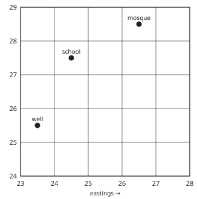
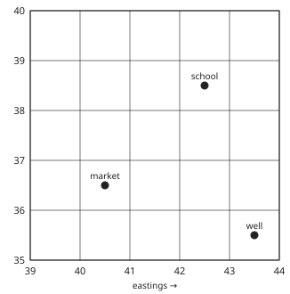

# Geography Form 1, Batch G1: authored answers for review

Every answer fixed by a person, not computed. Part 1: the tables, conventions and rules that computed answers come from.
Part 2: every authored question template, with all its data (keys, statements, pairs, choices and feedback) and sources.
Regenerate with `npm run review:geography`. Item IDs (TR-…) match `docs/teacher-review.md`.

## Part 1: tables and rules the computed answers use (src/engine/lib/geography.js)

- **Local time (TR-G01)**: 360° in 24 hours, so 15° = 1 hour and 1° = 4 minutes; east of a place is ahead (add), west is behind (subtract). Difference in longitude: same side of 0°, subtract; opposite sides, add. Questions stay within one day (no midnight crossed).
- **Clock style (TR-G01)**: 12-hour times: 12:00 midnight, 12:30 a.m., 9:05 a.m., 12:00 noon, 2:20 p.m..
- **Time zones (TR-G08)**: standard meridians are multiples of 15°: 30°W → GMT−2, 15°W → GMT−1, 0° → GMT, 15°E → GMT+1, 45°E → GMT+3. Cameroon uses GMT+1 (West Africa Time).
- **Main parallels (TR-G02)**: Arctic Circle 66½°N, Tropic of Cancer 23½°N, Equator 0°, Tropic of Capricorn 23½°S, Antarctic Circle 66½°S.
- **Positions (TR-G05)**: latitude first, then longitude, each with N/S or E/W (4°N, 12°E); 0° has no letter.
- **Grid references (TR-G06)**: a 4-figure reference names the square by the easting on its left and the northing below it, easting first; a 6-figure reference adds tenths across and up (253347).
- **Map scale (TR-G07)**: real km = map cm × scale number ÷ 100 000; map cm = km × 100 000 ÷ scale number. Scales used: 1 : 25 000, 50 000, 100 000, 200 000, 250 000, 500 000.
- **Leap years (TR-G09)**: the Form 1 rule, divisible by 4; only years 2001–2099 are used, where it agrees with the full calendar rule.

**Planets (TR-G03)**, in order from the Sun, average distance in millions of km:

| # | Planet | Distance |
|---|---|---|
| 1 | Mercury | 58 |
| 2 | Venus | 108 |
| 3 | Earth | 150 |
| 4 | Mars | 228 |
| 5 | Jupiter | 778 |
| 6 | Saturn | 1430 |
| 7 | Uranus | 2870 |
| 8 | Neptune | 4500 |

**Continents and oceans (TR-G04)**, largest first, area in millions of km² (rounded; only the order is used in questions):

| Continent | Area | | Ocean | Area |
|---|---|---|---|---|
| Asia | 44.6 | | Pacific Ocean | 165.2 |
| Africa | 30.4 | | Atlantic Ocean | 106.5 |
| North America | 24.7 | | Indian Ocean | 73.4 |
| South America | 17.8 | | Southern Ocean | 20.3 |
| Antarctica | 14.2 | | Arctic Ocean | 14.1 |
| Europe | 10.2 | |  |  |
| Australia | 8.6 | |  |  |

## Part 2: authored question templates

| # | Template | Lesson | Type, level | Sources |
|---|---|---|---|---|
| 1 | `g1-which` | 1 | multiple choice, 1 | geography |
| 2 | `g1-sub` | 1 | matching, 1 | geography |
| 3 | `g1-sort` | 1 | matching, 2 | geography |
| 4 | `g1-method` | 1 | multiple choice, 2 | geography-methods |
| 5 | `g1-why` | 1 | multiple choice, 2 | geography |
| 6 | `g1-spot` | 1 | spot the error, 3 | geography |
| 7 | `gc1-1-check` (card gc1-1) | 1 | multiple choice, 1 | geography |
| 8 | `g2-inner` | 2 | matching, 1 | solar-system |
| 9 | `g2-fact` | 2 | multiple choice, 1 | solar-system |
| 10 | `g2-spot` | 2 | spot the error, 3 | solar-system |
| 11 | `gc2-1-check` (card gc2-1) | 2 | multiple choice, 1 | solar-system |
| 12 | `gc2-4-check` (card gc2-4) | 2 | multiple choice, 1 | solar-system |
| 13 | `g3-line` | 3 | multiple choice, 1 | latlon |
| 14 | `g3-latof` | 3 | multiple choice, 1 | latlon |
| 15 | `g3-proof` | 3 | multiple choice, 2 | earth-shape |
| 16 | `g3-lines` | 3 | matching, 2 | latlon |
| 17 | `g3-continents` | 3 | ordering, 2 | land-water |
| 18 | `g3-oceans` | 3 | ordering, 3 | land-water |
| 19 | `g3-spot` | 3 | spot the error, 3 | earth-shape, latlon, land-water |
| 20 | `gc3-1-check` (card gc3-1) | 3 | multiple choice, 1 | earth-shape |
| 21 | `gc3-3-check` (card gc3-3) | 3 | multiple choice, 1 | latlon |
| 22 | `gc3-4-check` (card gc3-4) | 3 | multiple choice, 1 | land-water |
| 23 | `g4-use` | 4 | multiple choice, 1 | maps |
| 24 | `g4-type` | 4 | multiple choice, 2 | map-scale |
| 25 | `gc4-1-check` (card gc4-1) | 4 | multiple choice, 1 | maps |
| 26 | `g5-rule` | 5 | multiple choice, 2 | grid-ref |
| 27 | `g5-mistake` | 5 | multiple choice, 3 | grid-ref |
| 28 | `gc5-1-check` (card gc5-1) | 5 | multiple choice, 1 | grid-ref |
| 29 | `g7-sort` | 7 | matching, 1 | earth-movements |
| 30 | `g7-spot` | 7 | spot the error, 3 | earth-movements |
| 31 | `gc7-3-check` (card gc7-3) | 7 | multiple choice, 1 | earth-movements |
| 32 | `gc7-4-check` (card gc7-4) | 7 | multiple choice, 1 | earth-movements |
| 33 | `g9-facts` | 9 | multiple choice, 2 | time-zones |
| 34 | `gc9-1-check` (card gc9-1) | 9 | multiple choice, 1 | time-zones |
| 35 | `g10-sort` | 10 | matching, 1 | environment |
| 36 | `g10-sphere` | 10 | matching, 1 | environment |
| 37 | `g10-producer` | 10 | multiple choice, 1 | environment |
| 38 | `g10-chain` | 10 | ordering, 2 | environment |
| 39 | `g10-natural` | 10 | matching, 2 | environment |
| 40 | `g10-eco` | 10 | multiple choice, 2 | environment |
| 41 | `g10-spot` | 10 | spot the error, 3 | environment |
| 42 | `gc10-1-check` (card gc10-1) | 10 | multiple choice, 1 | environment |

### `g1-which` · Lesson 1 · multiple choice, level 1

Prompt: Which branch of geography studies {x.t}?

Table `x` (one row is picked each time):

| t | a | why |
|---|---|---|
| landforms such as hills and valleys | Physical geography | Physical geography studies landforms such as hills and valleys. |
| rivers and lakes | Physical geography | Physical geography studies rivers and lakes. |
| climate and weather | Physical geography | Physical geography studies climate and weather. |
| soils and vegetation | Physical geography | Physical geography studies soils and vegetation. |
| population and where people live | Human geography | Human geography studies population and where people live. |
| towns and villages | Human geography | Human geography studies towns and villages. |
| farming, industry and trade | Human geography | Human geography studies farming, industry and trade. |
| roads, railways and ports | Human geography | Human geography studies roads, railways and ports. |
| reading and drawing maps | Practical geography | Practical geography studies reading and drawing maps. |
| fieldwork and collecting data | Practical geography | Practical geography studies fieldwork and collecting data. |
| graphs and statistics | Practical geography | Practical geography studies graphs and statistics. |

Right answer: `{x.a}`; wrong choices: `Physical geography`, `Human geography`, `Practical geography`

- Feedback `other`: “Not this branch. Physical is the natural world, human is people and what they do, practical is maps and fieldwork.”

Three generated variants:

> Which branch of geography studies climate and weather?

- ✅ Physical geography
- ◻️ Human geography  
  _↳ feedback if chosen: Not this branch. Physical is the natural world, human is people and what they do, practical is maps and fieldwork._
- ◻️ Practical geography  
  _↳ feedback if chosen: Not this branch. Physical is the natural world, human is people and what they do, practical is maps and fieldwork._

Full working after a second miss:

> Physical geography studies climate and weather.  
> Answer: Physical geography.  

> Which branch of geography studies roads, railways and ports?

- ✅ Human geography
- ◻️ Practical geography  
  _↳ feedback if chosen: Not this branch. Physical is the natural world, human is people and what they do, practical is maps and fieldwork._
- ◻️ Physical geography  
  _↳ feedback if chosen: Not this branch. Physical is the natural world, human is people and what they do, practical is maps and fieldwork._

Full working after a second miss:

> Human geography studies roads, railways and ports.  
> Answer: Human geography.  

> Which branch of geography studies population and where people live?

- ◻️ Practical geography  
  _↳ feedback if chosen: Not this branch. Physical is the natural world, human is people and what they do, practical is maps and fieldwork._
- ◻️ Physical geography  
  _↳ feedback if chosen: Not this branch. Physical is the natural world, human is people and what they do, practical is maps and fieldwork._
- ✅ Human geography

Full working after a second miss:

> Human geography studies population and where people live.  
> Answer: Human geography.  

Sources: geography (What geography is; branches and sub-branches; why we study it)

### `g1-sub` · Lesson 1 · matching, level 1

Prompt: Match each sub-branch with what it studies.

Pairs (4 shown each time):

- climatology → **climate: the usual weather of a place over many years**
- geomorphology → **landforms such as hills, valleys and plateaus**
- hydrology → **water: rivers, lakes and seas**
- pedology → **soils**
- biogeography → **where plants and animals live**
- population geography → **how many people live in a place, and where**
- settlement geography → **villages, towns and cities**
- economic geography → **farming, industry and trade**
- transport geography → **roads, railways, ports and airports**
- cartography → **making maps**

Three generated variants:

> Match each sub-branch with what it studies.

Right-hand side (shuffled): where plants and animals live · villages, towns and cities · climate: the usual weather of a place over many years · roads, railways, ports and airports
- settlement geography → **villages, towns and cities**
- transport geography → **roads, railways, ports and airports**
- climatology → **climate: the usual weather of a place over many years**
- biogeography → **where plants and animals live**

Full working after a second miss:

> The right pairs are:  
> settlement geography → villages, towns and cities  
> transport geography → roads, railways, ports and airports  
> climatology → climate: the usual weather of a place over many years  
> biogeography → where plants and animals live  

> Match each sub-branch with what it studies.

Right-hand side (shuffled): where plants and animals live · water: rivers, lakes and seas · how many people live in a place, and where · roads, railways, ports and airports
- hydrology → **water: rivers, lakes and seas**
- transport geography → **roads, railways, ports and airports**
- population geography → **how many people live in a place, and where**
- biogeography → **where plants and animals live**

Full working after a second miss:

> The right pairs are:  
> hydrology → water: rivers, lakes and seas  
> transport geography → roads, railways, ports and airports  
> population geography → how many people live in a place, and where  
> biogeography → where plants and animals live  

> Match each sub-branch with what it studies.

Right-hand side (shuffled): farming, industry and trade · water: rivers, lakes and seas · soils · how many people live in a place, and where
- pedology → **soils**
- hydrology → **water: rivers, lakes and seas**
- population geography → **how many people live in a place, and where**
- economic geography → **farming, industry and trade**

Full working after a second miss:

> The right pairs are:  
> pedology → soils  
> hydrology → water: rivers, lakes and seas  
> population geography → how many people live in a place, and where  
> economic geography → farming, industry and trade  

Sources: geography (What geography is; branches and sub-branches; why we study it)

### `g1-sort` · Lesson 1 · matching, level 2

Prompt: Sort these topics: physical or human geography?

Pairs (6 shown each time, sorted into groups):

- landforms such as hills and valleys → **Physical geography**
- rivers and lakes → **Physical geography**
- climate and weather → **Physical geography**
- soils and vegetation → **Physical geography**
- population and where people live → **Human geography**
- towns and villages → **Human geography**
- farming, industry and trade → **Human geography**
- roads, railways and ports → **Human geography**

Three generated variants:

> Sort these topics: physical or human geography?

Groups: Physical geography · Human geography
- towns and villages → **Human geography**
- soils and vegetation → **Physical geography**
- farming, industry and trade → **Human geography**
- population and where people live → **Human geography**
- rivers and lakes → **Physical geography**
- climate and weather → **Physical geography**

Full working after a second miss:

> The right pairs are:  
> towns and villages → Human geography  
> soils and vegetation → Physical geography  
> farming, industry and trade → Human geography  
> population and where people live → Human geography  
> rivers and lakes → Physical geography  
> climate and weather → Physical geography  

> Sort these topics: physical or human geography?

Groups: Physical geography · Human geography
- roads, railways and ports → **Human geography**
- farming, industry and trade → **Human geography**
- climate and weather → **Physical geography**
- population and where people live → **Human geography**
- soils and vegetation → **Physical geography**
- rivers and lakes → **Physical geography**

Full working after a second miss:

> The right pairs are:  
> roads, railways and ports → Human geography  
> farming, industry and trade → Human geography  
> climate and weather → Physical geography  
> population and where people live → Human geography  
> soils and vegetation → Physical geography  
> rivers and lakes → Physical geography  

> Sort these topics: physical or human geography?

Groups: Physical geography · Human geography
- landforms such as hills and valleys → **Physical geography**
- roads, railways and ports → **Human geography**
- towns and villages → **Human geography**
- climate and weather → **Physical geography**
- population and where people live → **Human geography**
- soils and vegetation → **Physical geography**

Full working after a second miss:

> The right pairs are:  
> landforms such as hills and valleys → Physical geography  
> roads, railways and ports → Human geography  
> towns and villages → Human geography  
> climate and weather → Physical geography  
> population and where people live → Human geography  
> soils and vegetation → Physical geography  

Sources: geography (What geography is; branches and sub-branches; why we study it)

### `g1-method` · Lesson 1 · multiple choice, level 2

Prompt: Which method is this? / {x.t}

Table `x` (one row is picked each time):

| t | a | why |
|---|---|---|
| The class watches the types of houses along the road and writes notes. | observation | This is observation. |
| Ngwa asks farmers questions face to face and writes down their answers. | interview | This is interview. |
| The class gives printed questions to families, who write their answers and return them. | questionnaire | This is questionnaire. |
| The class reads the rain gauge every morning and records the rainfall. | measurement | This is measurement. |
| Tabe studies a map of Buea to find the roads and rivers. | map reading | This is map reading. |

Right answer: `{x.a}`; wrong choices: `observation`, `interview`, `questionnaire`, `measurement`, `map reading`

- Feedback `other`: “Not this method. Observation is watching, an interview is asking face to face, a questionnaire is written questions.”

Three generated variants:

> Which method is this?
> Ngwa asks farmers questions face to face and writes down their answers.

- ◻️ measurement  
  _↳ feedback if chosen: Not this method. Observation is watching, an interview is asking face to face, a questionnaire is written questions._
- ✅ interview
- ◻️ map reading  
  _↳ feedback if chosen: Not this method. Observation is watching, an interview is asking face to face, a questionnaire is written questions._
- ◻️ observation  
  _↳ feedback if chosen: Not this method. Observation is watching, an interview is asking face to face, a questionnaire is written questions._

Full working after a second miss:

> This is interview.  
> Answer: interview.  

> Which method is this?
> The class gives printed questions to families, who write their answers and return them.

- ◻️ map reading  
  _↳ feedback if chosen: Not this method. Observation is watching, an interview is asking face to face, a questionnaire is written questions._
- ◻️ observation  
  _↳ feedback if chosen: Not this method. Observation is watching, an interview is asking face to face, a questionnaire is written questions._
- ◻️ measurement  
  _↳ feedback if chosen: Not this method. Observation is watching, an interview is asking face to face, a questionnaire is written questions._
- ✅ questionnaire

Full working after a second miss:

> This is questionnaire.  
> Answer: questionnaire.  

> Which method is this?
> Ngwa asks farmers questions face to face and writes down their answers.

- ◻️ questionnaire  
  _↳ feedback if chosen: Not this method. Observation is watching, an interview is asking face to face, a questionnaire is written questions._
- ◻️ map reading  
  _↳ feedback if chosen: Not this method. Observation is watching, an interview is asking face to face, a questionnaire is written questions._
- ✅ interview
- ◻️ observation  
  _↳ feedback if chosen: Not this method. Observation is watching, an interview is asking face to face, a questionnaire is written questions._

Full working after a second miss:

> This is interview.  
> Answer: interview.  

Sources: geography-methods (Methods of geography: observation, interview, questionnaire, measurement, maps and photographs)

### `g1-why` · Lesson 1 · multiple choice, level 2

Prompt: Which is a good reason to study geography?

Shows 1 true and 3 false statement(s), drawn from:

- ✅ It helps us understand and protect our environment.
- ✅ It helps farmers plan their work with the seasons.
- ✅ It helps us read maps and find our way.
- ✅ It helps planners decide where to build roads and schools.
- ❌ It teaches doctors how to cure diseases.  
  _↳ That is medicine._
- ❌ It is only about learning the names of capital cities.  
  _↳ Geography studies the land, the weather and people, not just names._
- ❌ It tells us exactly what will happen in the future.  
  _↳ Geography helps us plan, but it cannot tell the future exactly._
- ❌ It is only useful for pilots.  
  _↳ Everyone uses geography: farmers, traders, travellers, planners._

Three generated variants:

> Which is a good reason to study geography?

- ◻️ It teaches doctors how to cure diseases.  
  _↳ feedback if chosen: That is medicine._
- ◻️ It tells us exactly what will happen in the future.  
  _↳ feedback if chosen: Geography helps us plan, but it cannot tell the future exactly._
- ✅ It helps us read maps and find our way.
- ◻️ It is only about learning the names of capital cities.  
  _↳ feedback if chosen: Geography studies the land, the weather and people, not just names._

Full working after a second miss:

> The true statement is “It helps us read maps and find our way.”.  
> “It teaches doctors how to cure diseases.” is false: That is medicine.  
> “It tells us exactly what will happen in the future.” is false: Geography helps us plan, but it cannot tell the future exactly.  
> “It is only about learning the names of capital cities.” is false: Geography studies the land, the weather and people, not just names.  

> Which is a good reason to study geography?

- ◻️ It is only about learning the names of capital cities.  
  _↳ feedback if chosen: Geography studies the land, the weather and people, not just names._
- ✅ It helps us understand and protect our environment.
- ◻️ It teaches doctors how to cure diseases.  
  _↳ feedback if chosen: That is medicine._
- ◻️ It tells us exactly what will happen in the future.  
  _↳ feedback if chosen: Geography helps us plan, but it cannot tell the future exactly._

Full working after a second miss:

> The true statement is “It helps us understand and protect our environment.”.  
> “It is only about learning the names of capital cities.” is false: Geography studies the land, the weather and people, not just names.  
> “It teaches doctors how to cure diseases.” is false: That is medicine.  
> “It tells us exactly what will happen in the future.” is false: Geography helps us plan, but it cannot tell the future exactly.  

> Which is a good reason to study geography?

- ◻️ It is only about learning the names of capital cities.  
  _↳ feedback if chosen: Geography studies the land, the weather and people, not just names._
- ◻️ It is only useful for pilots.  
  _↳ feedback if chosen: Everyone uses geography: farmers, traders, travellers, planners._
- ✅ It helps us understand and protect our environment.
- ◻️ It teaches doctors how to cure diseases.  
  _↳ feedback if chosen: That is medicine._

Full working after a second miss:

> The true statement is “It helps us understand and protect our environment.”.  
> “It is only about learning the names of capital cities.” is false: Geography studies the land, the weather and people, not just names.  
> “It is only useful for pilots.” is false: Everyone uses geography: farmers, traders, travellers, planners.  
> “It teaches doctors how to cure diseases.” is false: That is medicine.  

Sources: geography (What geography is; branches and sub-branches; why we study it)

### `g1-spot` · Lesson 1 · spot the error, level 3

Prompt: One sentence is wrong. Which one?

Shows 3 correct and 1 wrong statement(s), drawn from:

- ✅ Hydrology is the study of water.
- ✅ Pedology is the study of soils.
- ✅ Cartography is the making of maps.
- ✅ Human geography studies people and their activities.
- ✅ Climatology is the study of climate.
- ❌ Geomorphology is the study of population.  
  _↳ Geomorphology studies landforms; population is studied in population geography._
- ❌ Physical geography studies towns and markets.  
  _↳ Towns and markets are human geography._
- ❌ A questionnaire is watching people without asking them anything.  
  _↳ That is observation; a questionnaire is a list of written questions._

Three generated variants:

> One sentence is wrong. Which one?

- ◻️ Human geography studies people and their activities.
- ✅ Physical geography studies towns and markets.  
  _↳ explanation: Towns and markets are human geography._
- ◻️ Hydrology is the study of water.
- ◻️ Pedology is the study of soils.

Full working after a second miss:

> The wrong statement is “Physical geography studies towns and markets.”.  
> Towns and markets are human geography.  

> One sentence is wrong. Which one?

- ◻️ Cartography is the making of maps.
- ◻️ Human geography studies people and their activities.
- ◻️ Climatology is the study of climate.
- ✅ Physical geography studies towns and markets.  
  _↳ explanation: Towns and markets are human geography._

Full working after a second miss:

> The wrong statement is “Physical geography studies towns and markets.”.  
> Towns and markets are human geography.  

> One sentence is wrong. Which one?

- ✅ Physical geography studies towns and markets.  
  _↳ explanation: Towns and markets are human geography._
- ◻️ Pedology is the study of soils.
- ◻️ Cartography is the making of maps.
- ◻️ Climatology is the study of climate.

Full working after a second miss:

> The wrong statement is “Physical geography studies towns and markets.”.  
> Towns and markets are human geography.  

Sources: geography (What geography is; branches and sub-branches; why we study it)

### `gc1-1-check` · Lesson 1 · multiple choice, level 1

Prompt: Which question is a geography question?

Shows 1 true and 3 false statement(s), drawn from:

- ✅ Why do many people live near the coast?
- ✅ Why does the north of Cameroon get less rain than the south?
- ✅ Where are the main roads in Cameroon?
- ❌ How do you add fractions?  
  _↳ That is Mathematics._
- ❌ What is the past tense of “go”?  
  _↳ That is English._
- ❌ How does the heart pump blood?  
  _↳ That is Biology._
- ❌ Who was the first president of Cameroon?  
  _↳ That is History._

Three generated variants:

> Which question is a geography question?

- ◻️ What is the past tense of “go”?  
  _↳ feedback if chosen: That is English._
- ✅ Why do many people live near the coast?
- ◻️ Who was the first president of Cameroon?  
  _↳ feedback if chosen: That is History._
- ◻️ How do you add fractions?  
  _↳ feedback if chosen: That is Mathematics._

Full working after a second miss:

> The true statement is “Why do many people live near the coast?”.  
> “What is the past tense of “go”?” is false: That is English.  
> “Who was the first president of Cameroon?” is false: That is History.  
> “How do you add fractions?” is false: That is Mathematics.  

> Which question is a geography question?

- ◻️ Who was the first president of Cameroon?  
  _↳ feedback if chosen: That is History._
- ◻️ How does the heart pump blood?  
  _↳ feedback if chosen: That is Biology._
- ✅ Why do many people live near the coast?
- ◻️ What is the past tense of “go”?  
  _↳ feedback if chosen: That is English._

Full working after a second miss:

> The true statement is “Why do many people live near the coast?”.  
> “Who was the first president of Cameroon?” is false: That is History.  
> “How does the heart pump blood?” is false: That is Biology.  
> “What is the past tense of “go”?” is false: That is English.  

> Which question is a geography question?

- ◻️ How does the heart pump blood?  
  _↳ feedback if chosen: That is Biology._
- ◻️ How do you add fractions?  
  _↳ feedback if chosen: That is Mathematics._
- ✅ Where are the main roads in Cameroon?
- ◻️ What is the past tense of “go”?  
  _↳ feedback if chosen: That is English._

Full working after a second miss:

> The true statement is “Where are the main roads in Cameroon?”.  
> “How does the heart pump blood?” is false: That is Biology.  
> “How do you add fractions?” is false: That is Mathematics.  
> “What is the past tense of “go”?” is false: That is English.  

Sources: geography (What geography is; branches and sub-branches; why we study it)

### `g2-inner` · Lesson 2 · matching, level 1

Prompt: Sort the planets: inner rocky planet or outer giant planet?

Pairs (6 shown each time, sorted into groups):

- Mercury → **inner, rocky planet**
- Venus → **inner, rocky planet**
- Earth → **inner, rocky planet**
- Mars → **inner, rocky planet**
- Jupiter → **outer, giant planet**
- Saturn → **outer, giant planet**
- Uranus → **outer, giant planet**
- Neptune → **outer, giant planet**

Three generated variants:

> Sort the planets: inner rocky planet or outer giant planet?

Groups: inner, rocky planet · outer, giant planet
- Neptune → **outer, giant planet**
- Mars → **inner, rocky planet**
- Earth → **inner, rocky planet**
- Saturn → **outer, giant planet**
- Uranus → **outer, giant planet**
- Mercury → **inner, rocky planet**

Full working after a second miss:

> The right pairs are:  
> Neptune → outer, giant planet  
> Mars → inner, rocky planet  
> Earth → inner, rocky planet  
> Saturn → outer, giant planet  
> Uranus → outer, giant planet  
> Mercury → inner, rocky planet  

> Sort the planets: inner rocky planet or outer giant planet?

Groups: inner, rocky planet · outer, giant planet
- Jupiter → **outer, giant planet**
- Saturn → **outer, giant planet**
- Uranus → **outer, giant planet**
- Mercury → **inner, rocky planet**
- Mars → **inner, rocky planet**
- Earth → **inner, rocky planet**

Full working after a second miss:

> The right pairs are:  
> Jupiter → outer, giant planet  
> Saturn → outer, giant planet  
> Uranus → outer, giant planet  
> Mercury → inner, rocky planet  
> Mars → inner, rocky planet  
> Earth → inner, rocky planet  

> Sort the planets: inner rocky planet or outer giant planet?

Groups: inner, rocky planet · outer, giant planet
- Uranus → **outer, giant planet**
- Earth → **inner, rocky planet**
- Jupiter → **outer, giant planet**
- Mercury → **inner, rocky planet**
- Neptune → **outer, giant planet**
- Saturn → **outer, giant planet**

Full working after a second miss:

> The right pairs are:  
> Uranus → outer, giant planet  
> Earth → inner, rocky planet  
> Jupiter → outer, giant planet  
> Mercury → inner, rocky planet  
> Neptune → outer, giant planet  
> Saturn → outer, giant planet  

Sources: solar-system (The solar system: the Sun, the eight planets in order (IAU 2006: Pluto a dwarf planet), average distances from the Sun)

### `g2-fact` · Lesson 2 · multiple choice, level 1

Prompt: Which planet is {x.t}?

Table `x` (one row is picked each time):

| t | a | why |
|---|---|---|
| the largest planet | Jupiter | Jupiter is the largest planet. |
| the smallest planet | Mercury | Mercury is the smallest planet. |
| the hottest planet | Venus | Venus is the hottest planet. |
| called the red planet | Mars | Mars is called the red planet. |
| famous for its bright rings | Saturn | Saturn is famous for its bright rings. |
| the planet we live on | Earth | Earth is the planet we live on. |
| the farthest planet from the Sun | Neptune | Neptune is the farthest planet from the Sun. |
| the planet nearest the Sun | Mercury | Mercury is the planet nearest the Sun. |

Right answer: `{x.a}`; wrong choices: `Mercury`, `Venus`, `Earth`, `Mars`, `Jupiter`, `Saturn`, `Uranus`, `Neptune`

- Feedback `other`: “Not that one. Read the facts about each planet again.”

Three generated variants:

> Which planet is called the red planet?

- ✅ Mars
- ◻️ Neptune  
  _↳ feedback if chosen: Not that one. Read the facts about each planet again._
- ◻️ Jupiter  
  _↳ feedback if chosen: Not that one. Read the facts about each planet again._
- ◻️ Saturn  
  _↳ feedback if chosen: Not that one. Read the facts about each planet again._

Full working after a second miss:

> Mars is called the red planet.  
> Answer: Mars.  

> Which planet is the planet we live on?

- ◻️ Uranus  
  _↳ feedback if chosen: Not that one. Read the facts about each planet again._
- ✅ Earth
- ◻️ Mercury  
  _↳ feedback if chosen: Not that one. Read the facts about each planet again._
- ◻️ Jupiter  
  _↳ feedback if chosen: Not that one. Read the facts about each planet again._

Full working after a second miss:

> Earth is the planet we live on.  
> Answer: Earth.  

> Which planet is famous for its bright rings?

- ◻️ Venus  
  _↳ feedback if chosen: Not that one. Read the facts about each planet again._
- ✅ Saturn
- ◻️ Mercury  
  _↳ feedback if chosen: Not that one. Read the facts about each planet again._
- ◻️ Jupiter  
  _↳ feedback if chosen: Not that one. Read the facts about each planet again._

Full working after a second miss:

> Saturn is famous for its bright rings.  
> Answer: Saturn.  

Sources: solar-system (The solar system: the Sun, the eight planets in order (IAU 2006: Pluto a dwarf planet), average distances from the Sun)

### `g2-spot` · Lesson 2 · spot the error, level 3

Prompt: One sentence is wrong. Which one?

Shows 3 correct and 1 wrong statement(s), drawn from:

- ✅ The Sun is a star.
- ✅ The Earth is the third planet from the Sun.
- ✅ Jupiter is the largest planet.
- ✅ The Moon is a natural satellite of the Earth.
- ✅ Mars is a rocky planet.
- ✅ Pluto is a dwarf planet.
- ❌ The Moon gives out its own light.  
  _↳ The Moon only reflects light from the Sun._
- ❌ Saturn is the planet nearest to the Sun.  
  _↳ Mercury is nearest; Saturn is the sixth planet._
- ❌ Jupiter is a small rocky planet.  
  _↳ Jupiter is a giant planet made mostly of gas._
- ❌ The Earth is a star.  
  _↳ The Earth is a planet; the Sun is the star._

Three generated variants:

> One sentence is wrong. Which one?

- ◻️ Jupiter is the largest planet.
- ◻️ The Earth is the third planet from the Sun.
- ◻️ Pluto is a dwarf planet.
- ✅ The Moon gives out its own light.  
  _↳ explanation: The Moon only reflects light from the Sun._

Full working after a second miss:

> The wrong statement is “The Moon gives out its own light.”.  
> The Moon only reflects light from the Sun.  

> One sentence is wrong. Which one?

- ◻️ The Earth is the third planet from the Sun.
- ◻️ The Sun is a star.
- ✅ The Moon gives out its own light.  
  _↳ explanation: The Moon only reflects light from the Sun._
- ◻️ Mars is a rocky planet.

Full working after a second miss:

> The wrong statement is “The Moon gives out its own light.”.  
> The Moon only reflects light from the Sun.  

> One sentence is wrong. Which one?

- ✅ The Earth is a star.  
  _↳ explanation: The Earth is a planet; the Sun is the star._
- ◻️ The Moon is a natural satellite of the Earth.
- ◻️ Mars is a rocky planet.
- ◻️ Jupiter is the largest planet.

Full working after a second miss:

> The wrong statement is “The Earth is a star.”.  
> The Earth is a planet; the Sun is the star.  

Sources: solar-system (The solar system: the Sun, the eight planets in order (IAU 2006: Pluto a dwarf planet), average distances from the Sun)

### `gc2-1-check` · Lesson 2 · multiple choice, level 1

Prompt: Which of these is a star?

Shows 1 true and 3 false statement(s), drawn from:

- ✅ the Sun
- ❌ the Moon  
  _↳ The Moon is a natural satellite of the Earth. It does not make its own light._
- ❌ the Earth  
  _↳ The Earth is a planet._
- ❌ Jupiter  
  _↳ Jupiter is a planet._
- ❌ a comet  
  _↳ A comet is a ball of ice and dust that moves round the Sun._
- ❌ Mars  
  _↳ Mars is a planet._

Three generated variants:

> Which of these is a star?

- ◻️ a comet  
  _↳ feedback if chosen: A comet is a ball of ice and dust that moves round the Sun._
- ✅ the Sun
- ◻️ Jupiter  
  _↳ feedback if chosen: Jupiter is a planet._
- ◻️ the Moon  
  _↳ feedback if chosen: The Moon is a natural satellite of the Earth. It does not make its own light._

Full working after a second miss:

> The true statement is “the Sun”.  
> “a comet” is false: A comet is a ball of ice and dust that moves round the Sun.  
> “Jupiter” is false: Jupiter is a planet.  
> “the Moon” is false: The Moon is a natural satellite of the Earth. It does not make its own light.  

> Which of these is a star?

- ◻️ a comet  
  _↳ feedback if chosen: A comet is a ball of ice and dust that moves round the Sun._
- ✅ the Sun
- ◻️ Jupiter  
  _↳ feedback if chosen: Jupiter is a planet._
- ◻️ the Earth  
  _↳ feedback if chosen: The Earth is a planet._

Full working after a second miss:

> The true statement is “the Sun”.  
> “a comet” is false: A comet is a ball of ice and dust that moves round the Sun.  
> “Jupiter” is false: Jupiter is a planet.  
> “the Earth” is false: The Earth is a planet.  

> Which of these is a star?

- ✅ the Sun
- ◻️ Mars  
  _↳ feedback if chosen: Mars is a planet._
- ◻️ Jupiter  
  _↳ feedback if chosen: Jupiter is a planet._
- ◻️ a comet  
  _↳ feedback if chosen: A comet is a ball of ice and dust that moves round the Sun._

Full working after a second miss:

> The true statement is “the Sun”.  
> “Mars” is false: Mars is a planet.  
> “Jupiter” is false: Jupiter is a planet.  
> “a comet” is false: A comet is a ball of ice and dust that moves round the Sun.  

Sources: solar-system (The solar system: the Sun, the eight planets in order (IAU 2006: Pluto a dwarf planet), average distances from the Sun)

### `gc2-4-check` · Lesson 2 · multiple choice, level 1

Prompt: Why can living things live on the Earth?

Shows 1 true and 3 false statement(s), drawn from:

- ✅ It has liquid water, air and the right temperature.
- ❌ It is the largest planet.  
  _↳ Jupiter is the largest; the Earth is quite small._
- ❌ It is the nearest planet to the Sun.  
  _↳ Mercury is nearest. The Earth is the third planet._
- ❌ It has bright rings.  
  _↳ Saturn has bright rings; the Earth has none._
- ❌ It is a star.  
  _↳ The Earth is a planet, not a star._

Three generated variants:

> Why can living things live on the Earth?

- ✅ It has liquid water, air and the right temperature.
- ◻️ It is a star.  
  _↳ feedback if chosen: The Earth is a planet, not a star._
- ◻️ It is the nearest planet to the Sun.  
  _↳ feedback if chosen: Mercury is nearest. The Earth is the third planet._
- ◻️ It is the largest planet.  
  _↳ feedback if chosen: Jupiter is the largest; the Earth is quite small._

Full working after a second miss:

> The true statement is “It has liquid water, air and the right temperature.”.  
> “It is a star.” is false: The Earth is a planet, not a star.  
> “It is the nearest planet to the Sun.” is false: Mercury is nearest. The Earth is the third planet.  
> “It is the largest planet.” is false: Jupiter is the largest; the Earth is quite small.  

> Why can living things live on the Earth?

- ◻️ It is a star.  
  _↳ feedback if chosen: The Earth is a planet, not a star._
- ◻️ It is the largest planet.  
  _↳ feedback if chosen: Jupiter is the largest; the Earth is quite small._
- ◻️ It has bright rings.  
  _↳ feedback if chosen: Saturn has bright rings; the Earth has none._
- ✅ It has liquid water, air and the right temperature.

Full working after a second miss:

> The true statement is “It has liquid water, air and the right temperature.”.  
> “It is a star.” is false: The Earth is a planet, not a star.  
> “It is the largest planet.” is false: Jupiter is the largest; the Earth is quite small.  
> “It has bright rings.” is false: Saturn has bright rings; the Earth has none.  

> Why can living things live on the Earth?

- ◻️ It has bright rings.  
  _↳ feedback if chosen: Saturn has bright rings; the Earth has none._
- ✅ It has liquid water, air and the right temperature.
- ◻️ It is the nearest planet to the Sun.  
  _↳ feedback if chosen: Mercury is nearest. The Earth is the third planet._
- ◻️ It is the largest planet.  
  _↳ feedback if chosen: Jupiter is the largest; the Earth is quite small._

Full working after a second miss:

> The true statement is “It has liquid water, air and the right temperature.”.  
> “It has bright rings.” is false: Saturn has bright rings; the Earth has none.  
> “It is the nearest planet to the Sun.” is false: Mercury is nearest. The Earth is the third planet.  
> “It is the largest planet.” is false: Jupiter is the largest; the Earth is quite small.  

Sources: solar-system (The solar system: the Sun, the eight planets in order (IAU 2006: Pluto a dwarf planet), average distances from the Sun)

### `g3-line` · Lesson 3 · multiple choice, level 1

Prompt: On the globe, which line is {x.l}?

Table `x` (one row is picked each time):

| l | i |
|---|---|
| A | 0 |
| B | 1 |
| C | 2 |
| D | 3 |
| E | 4 |

Right answer: `{parallelName(x.i)}`; wrong choices: `Arctic Circle`, `Tropic of Cancer`, `Equator`, `Tropic of Capricorn`, `Antarctic Circle`

- Feedback `other`: “Count the lines from the top: Arctic Circle, Tropic of Cancer, Equator, Tropic of Capricorn, Antarctic Circle.”

Three generated variants:

> On the globe, which line is A?

- ◻️ Antarctic Circle  
  _↳ feedback if chosen: Count the lines from the top: Arctic Circle, Tropic of Cancer, Equator, Tropic of Capricorn, Antarctic Circle._
- ◻️ Tropic of Capricorn  
  _↳ feedback if chosen: Count the lines from the top: Arctic Circle, Tropic of Cancer, Equator, Tropic of Capricorn, Antarctic Circle._
- ◻️ Equator  
  _↳ feedback if chosen: Count the lines from the top: Arctic Circle, Tropic of Cancer, Equator, Tropic of Capricorn, Antarctic Circle._
- ✅ Arctic Circle

Full working after a second miss:

> From the top: Arctic Circle, Tropic of Cancer, Equator, Tropic of Capricorn, Antarctic Circle.  
> Line A is at 66½°N: the Arctic Circle.  

> On the globe, which line is E?

- ✅ Antarctic Circle
- ◻️ Arctic Circle  
  _↳ feedback if chosen: Count the lines from the top: Arctic Circle, Tropic of Cancer, Equator, Tropic of Capricorn, Antarctic Circle._
- ◻️ Tropic of Capricorn  
  _↳ feedback if chosen: Count the lines from the top: Arctic Circle, Tropic of Cancer, Equator, Tropic of Capricorn, Antarctic Circle._
- ◻️ Tropic of Cancer  
  _↳ feedback if chosen: Count the lines from the top: Arctic Circle, Tropic of Cancer, Equator, Tropic of Capricorn, Antarctic Circle._

Full working after a second miss:

> From the top: Arctic Circle, Tropic of Cancer, Equator, Tropic of Capricorn, Antarctic Circle.  
> Line E is at 66½°S: the Antarctic Circle.  

> On the globe, which line is A?

- ◻️ Tropic of Cancer  
  _↳ feedback if chosen: Count the lines from the top: Arctic Circle, Tropic of Cancer, Equator, Tropic of Capricorn, Antarctic Circle._
- ◻️ Equator  
  _↳ feedback if chosen: Count the lines from the top: Arctic Circle, Tropic of Cancer, Equator, Tropic of Capricorn, Antarctic Circle._
- ◻️ Tropic of Capricorn  
  _↳ feedback if chosen: Count the lines from the top: Arctic Circle, Tropic of Cancer, Equator, Tropic of Capricorn, Antarctic Circle._
- ✅ Arctic Circle

Full working after a second miss:

> From the top: Arctic Circle, Tropic of Cancer, Equator, Tropic of Capricorn, Antarctic Circle.  
> Line A is at 66½°N: the Arctic Circle.  

Sources: latlon (Latitude and longitude; the main parallels (23½°, 66½°); hemispheres; reading positions (graticule drawn by code))

### `g3-latof` · Lesson 3 · multiple choice, level 1

Prompt: What is the latitude of the {parallelName(i)}?

Right answer: `{halfLat(parallelLat(i))}`; wrong choices: `{halfLat(parallelLat(0))}`, `{halfLat(parallelLat(1))}`, `{halfLat(parallelLat(2))}`, `{halfLat(parallelLat(3))}`, `{halfLat(parallelLat(4))}`

- Feedback `other`: “Learn the five main parallels: Arctic Circle 66½°N, Tropic of Cancer 23½°N, Equator 0°, Tropic of Capricorn 23½°S, Antarctic Circle 66½°S.”

Three generated variants:

> What is the latitude of the Arctic Circle?

- ◻️ 23½°S  
  _↳ feedback if chosen: Learn the five main parallels: Arctic Circle 66½°N, Tropic of Cancer 23½°N, Equator 0°, Tropic of Capricorn 23½°S, Antarctic Circle 66½°S._
- ◻️ 66½°S  
  _↳ feedback if chosen: Learn the five main parallels: Arctic Circle 66½°N, Tropic of Cancer 23½°N, Equator 0°, Tropic of Capricorn 23½°S, Antarctic Circle 66½°S._
- ◻️ 23½°N  
  _↳ feedback if chosen: Learn the five main parallels: Arctic Circle 66½°N, Tropic of Cancer 23½°N, Equator 0°, Tropic of Capricorn 23½°S, Antarctic Circle 66½°S._
- ✅ 66½°N

Full working after a second miss:

> The Arctic Circle is at 66½°N.  

> What is the latitude of the Antarctic Circle?

- ✅ 66½°S
- ◻️ 23½°N  
  _↳ feedback if chosen: Learn the five main parallels: Arctic Circle 66½°N, Tropic of Cancer 23½°N, Equator 0°, Tropic of Capricorn 23½°S, Antarctic Circle 66½°S._
- ◻️ 23½°S  
  _↳ feedback if chosen: Learn the five main parallels: Arctic Circle 66½°N, Tropic of Cancer 23½°N, Equator 0°, Tropic of Capricorn 23½°S, Antarctic Circle 66½°S._
- ◻️ 0°  
  _↳ feedback if chosen: Learn the five main parallels: Arctic Circle 66½°N, Tropic of Cancer 23½°N, Equator 0°, Tropic of Capricorn 23½°S, Antarctic Circle 66½°S._

Full working after a second miss:

> The Antarctic Circle is at 66½°S.  

> What is the latitude of the Antarctic Circle?

- ◻️ 23½°N  
  _↳ feedback if chosen: Learn the five main parallels: Arctic Circle 66½°N, Tropic of Cancer 23½°N, Equator 0°, Tropic of Capricorn 23½°S, Antarctic Circle 66½°S._
- ◻️ 66½°N  
  _↳ feedback if chosen: Learn the five main parallels: Arctic Circle 66½°N, Tropic of Cancer 23½°N, Equator 0°, Tropic of Capricorn 23½°S, Antarctic Circle 66½°S._
- ✅ 66½°S
- ◻️ 23½°S  
  _↳ feedback if chosen: Learn the five main parallels: Arctic Circle 66½°N, Tropic of Cancer 23½°N, Equator 0°, Tropic of Capricorn 23½°S, Antarctic Circle 66½°S._

Full working after a second miss:

> The Antarctic Circle is at 66½°S.  

Sources: latlon (Latitude and longitude; the main parallels (23½°, 66½°); hemispheres; reading positions (graticule drawn by code))

### `g3-proof` · Lesson 3 · multiple choice, level 2

Prompt: Which of these shows that the Earth is round?

Shows 1 true and 3 false statement(s), drawn from:

- ✅ A ship sailing away disappears body first, mast last.
- ✅ The Earth’s shadow on the Moon during an eclipse is round.
- ✅ Photographs taken from space show a round Earth.
- ✅ People have travelled all the way round the Earth.
- ❌ The Sun is very hot.  
  _↳ That tells us about the Sun, not the shape of the Earth._
- ❌ Rivers flow downhill.  
  _↳ That is about slopes on the land, not the shape of the whole Earth._
- ❌ The Earth has high mountains.  
  _↳ Mountains are tiny compared with the whole Earth; they do not show its shape._
- ❌ The sky is blue.  
  _↳ The colour of the sky does not show the shape of the Earth._

Three generated variants:

> Which of these shows that the Earth is round?

- ◻️ The Sun is very hot.  
  _↳ feedback if chosen: That tells us about the Sun, not the shape of the Earth._
- ✅ Photographs taken from space show a round Earth.
- ◻️ The Earth has high mountains.  
  _↳ feedback if chosen: Mountains are tiny compared with the whole Earth; they do not show its shape._
- ◻️ The sky is blue.  
  _↳ feedback if chosen: The colour of the sky does not show the shape of the Earth._

Full working after a second miss:

> The true statement is “Photographs taken from space show a round Earth.”.  
> “The Sun is very hot.” is false: That tells us about the Sun, not the shape of the Earth.  
> “The Earth has high mountains.” is false: Mountains are tiny compared with the whole Earth; they do not show its shape.  
> “The sky is blue.” is false: The colour of the sky does not show the shape of the Earth.  

> Which of these shows that the Earth is round?

- ✅ The Earth’s shadow on the Moon during an eclipse is round.
- ◻️ Rivers flow downhill.  
  _↳ feedback if chosen: That is about slopes on the land, not the shape of the whole Earth._
- ◻️ The Earth has high mountains.  
  _↳ feedback if chosen: Mountains are tiny compared with the whole Earth; they do not show its shape._
- ◻️ The Sun is very hot.  
  _↳ feedback if chosen: That tells us about the Sun, not the shape of the Earth._

Full working after a second miss:

> The true statement is “The Earth’s shadow on the Moon during an eclipse is round.”.  
> “Rivers flow downhill.” is false: That is about slopes on the land, not the shape of the whole Earth.  
> “The Earth has high mountains.” is false: Mountains are tiny compared with the whole Earth; they do not show its shape.  
> “The Sun is very hot.” is false: That tells us about the Sun, not the shape of the Earth.  

> Which of these shows that the Earth is round?

- ◻️ The sky is blue.  
  _↳ feedback if chosen: The colour of the sky does not show the shape of the Earth._
- ✅ Photographs taken from space show a round Earth.
- ◻️ The Earth has high mountains.  
  _↳ feedback if chosen: Mountains are tiny compared with the whole Earth; they do not show its shape._
- ◻️ Rivers flow downhill.  
  _↳ feedback if chosen: That is about slopes on the land, not the shape of the whole Earth._

Full working after a second miss:

> The true statement is “Photographs taken from space show a round Earth.”.  
> “The sky is blue.” is false: The colour of the sky does not show the shape of the Earth.  
> “The Earth has high mountains.” is false: Mountains are tiny compared with the whole Earth; they do not show its shape.  
> “Rivers flow downhill.” is false: That is about slopes on the land, not the shape of the whole Earth.  

Sources: earth-shape (Shape and size of the Earth (geoid); proofs of its roundness)

### `g3-lines` · Lesson 3 · matching, level 2

Prompt: Sort these: do they describe lines of latitude or lines of longitude?

Pairs (6 shown each time, sorted into groups):

- run east–west → **latitude**
- also called parallels → **latitude**
- measured north or south of the Equator → **latitude**
- the Equator is the 0° line → **latitude**
- run from pole to pole → **longitude**
- also called meridians → **longitude**
- measured east or west of Greenwich → **longitude**
- the Prime Meridian is the 0° line → **longitude**

Three generated variants:

> Sort these: do they describe lines of latitude or lines of longitude?

Groups: latitude · longitude
- measured east or west of Greenwich → **longitude**
- also called parallels → **latitude**
- run east–west → **latitude**
- the Equator is the 0° line → **latitude**
- the Prime Meridian is the 0° line → **longitude**
- run from pole to pole → **longitude**

Full working after a second miss:

> The right pairs are:  
> measured east or west of Greenwich → longitude  
> also called parallels → latitude  
> run east–west → latitude  
> the Equator is the 0° line → latitude  
> the Prime Meridian is the 0° line → longitude  
> run from pole to pole → longitude  

> Sort these: do they describe lines of latitude or lines of longitude?

Groups: latitude · longitude
- run from pole to pole → **longitude**
- the Prime Meridian is the 0° line → **longitude**
- measured east or west of Greenwich → **longitude**
- also called parallels → **latitude**
- measured north or south of the Equator → **latitude**
- run east–west → **latitude**

Full working after a second miss:

> The right pairs are:  
> run from pole to pole → longitude  
> the Prime Meridian is the 0° line → longitude  
> measured east or west of Greenwich → longitude  
> also called parallels → latitude  
> measured north or south of the Equator → latitude  
> run east–west → latitude  

> Sort these: do they describe lines of latitude or lines of longitude?

Groups: latitude · longitude
- run east–west → **latitude**
- the Equator is the 0° line → **latitude**
- measured north or south of the Equator → **latitude**
- run from pole to pole → **longitude**
- the Prime Meridian is the 0° line → **longitude**
- also called meridians → **longitude**

Full working after a second miss:

> The right pairs are:  
> run east–west → latitude  
> the Equator is the 0° line → latitude  
> measured north or south of the Equator → latitude  
> run from pole to pole → longitude  
> the Prime Meridian is the 0° line → longitude  
> also called meridians → longitude  

Sources: latlon (Latitude and longitude; the main parallels (23½°, 66½°); hemispheres; reading positions (graticule drawn by code))

### `g3-continents` · Lesson 3 · ordering, level 2

Prompt: Put these continents in order of size, largest first.

Items in the right order:

1. {continentName(s[0])}
2. {continentName(s[1])}
3. {continentName(s[2])}
4. {continentName(s[3])}

Three generated variants:

> Put these continents in order of size, largest first.

Shown as: North America · Europe · Antarctica · Australia
Correct order: North America → Antarctica → Europe → Australia

Full working after a second miss:

> The correct order is: North America → Antarctica → Europe → Australia.  

> Put these continents in order of size, largest first.

Shown as: Africa · North America · Antarctica · Asia
Correct order: Asia → Africa → North America → Antarctica

Full working after a second miss:

> The correct order is: Asia → Africa → North America → Antarctica.  

> Put these continents in order of size, largest first.

Shown as: Australia · Antarctica · Asia · North America
Correct order: Asia → North America → Antarctica → Australia

Full working after a second miss:

> The correct order is: Asia → North America → Antarctica → Australia.  

Sources: land-water (Distribution of land and water; continents and oceans by area (rounded, millions of km²))

### `g3-oceans` · Lesson 3 · ordering, level 3

Prompt: Put these oceans in order of size, largest first.

Items in the right order:

1. {oceanName(s[0])}
2. {oceanName(s[1])}
3. {oceanName(s[2])}
4. {oceanName(s[3])}

Three generated variants:

> Put these oceans in order of size, largest first.

Shown as: Atlantic Ocean · Pacific Ocean · Southern Ocean · Arctic Ocean
Correct order: Pacific Ocean → Atlantic Ocean → Southern Ocean → Arctic Ocean

Full working after a second miss:

> The correct order is: Pacific Ocean → Atlantic Ocean → Southern Ocean → Arctic Ocean.  

> Put these oceans in order of size, largest first.

Shown as: Indian Ocean · Arctic Ocean · Pacific Ocean · Southern Ocean
Correct order: Pacific Ocean → Indian Ocean → Southern Ocean → Arctic Ocean

Full working after a second miss:

> The correct order is: Pacific Ocean → Indian Ocean → Southern Ocean → Arctic Ocean.  

> Put these oceans in order of size, largest first.

Shown as: Indian Ocean · Arctic Ocean · Southern Ocean · Pacific Ocean
Correct order: Pacific Ocean → Indian Ocean → Southern Ocean → Arctic Ocean

Full working after a second miss:

> The correct order is: Pacific Ocean → Indian Ocean → Southern Ocean → Arctic Ocean.  

Sources: land-water (Distribution of land and water; continents and oceans by area (rounded, millions of km²))

### `g3-spot` · Lesson 3 · spot the error, level 3

Prompt: One sentence is wrong. Which one?

Shows 3 correct and 1 wrong statement(s), drawn from:

- ✅ Most of the Earth’s surface is covered by water.
- ✅ The Equator divides the Earth into the Northern and Southern Hemispheres.
- ✅ Lines of latitude are also called parallels.
- ✅ The North Pole is at 90°N.
- ✅ Africa is the second largest continent.
- ❌ The Earth is a perfect sphere.  
  _↳ It is a little flattened at the poles and bulges at the Equator._
- ❌ Lines of longitude run east–west.  
  _↳ Lines of longitude run from pole to pole; lines of latitude run east–west._
- ❌ The Equator is at 90°.  
  _↳ The Equator is 0°; the poles are at 90°._
- ❌ Most of the Earth’s surface is land.  
  _↳ About 71 % is water._

Three generated variants:

> One sentence is wrong. Which one?

- ◻️ Most of the Earth’s surface is covered by water.
- ◻️ The Equator divides the Earth into the Northern and Southern Hemispheres.
- ✅ Most of the Earth’s surface is land.  
  _↳ explanation: About 71 % is water._
- ◻️ The North Pole is at 90°N.

Full working after a second miss:

> The wrong statement is “Most of the Earth’s surface is land.”.  
> About 71 % is water.  

> One sentence is wrong. Which one?

- ✅ Most of the Earth’s surface is land.  
  _↳ explanation: About 71 % is water._
- ◻️ Most of the Earth’s surface is covered by water.
- ◻️ The North Pole is at 90°N.
- ◻️ Africa is the second largest continent.

Full working after a second miss:

> The wrong statement is “Most of the Earth’s surface is land.”.  
> About 71 % is water.  

> One sentence is wrong. Which one?

- ◻️ Most of the Earth’s surface is covered by water.
- ✅ The Earth is a perfect sphere.  
  _↳ explanation: It is a little flattened at the poles and bulges at the Equator._
- ◻️ The Equator divides the Earth into the Northern and Southern Hemispheres.
- ◻️ Lines of latitude are also called parallels.

Full working after a second miss:

> The wrong statement is “The Earth is a perfect sphere.”.  
> It is a little flattened at the poles and bulges at the Equator.  

Sources: earth-shape (Shape and size of the Earth (geoid); proofs of its roundness); latlon (Latitude and longitude; the main parallels (23½°, 66½°); hemispheres; reading positions (graticule drawn by code)); land-water (Distribution of land and water; continents and oceans by area (rounded, millions of km²))

### `gc3-1-check` · Lesson 3 · multiple choice, level 1

Prompt: Which best describes the shape of the Earth?

Shows 1 true and 3 false statement(s), drawn from:

- ✅ nearly a sphere, a little flattened at the poles
- ❌ flat like a plate  
  _↳ Photographs from space and ships at sea show that the Earth is round._
- ❌ a perfect cube  
  _↳ The Earth has no corners: it is nearly a sphere._
- ❌ a perfect sphere  
  _↳ It is nearly a sphere, but a little flattened at the poles._
- ❌ shaped like a long egg, pointed at the poles  
  _↳ It is flattened at the poles, not pointed._

Three generated variants:

> Which best describes the shape of the Earth?

- ✅ nearly a sphere, a little flattened at the poles
- ◻️ a perfect sphere  
  _↳ feedback if chosen: It is nearly a sphere, but a little flattened at the poles._
- ◻️ a perfect cube  
  _↳ feedback if chosen: The Earth has no corners: it is nearly a sphere._
- ◻️ flat like a plate  
  _↳ feedback if chosen: Photographs from space and ships at sea show that the Earth is round._

Full working after a second miss:

> The true statement is “nearly a sphere, a little flattened at the poles”.  
> “a perfect sphere” is false: It is nearly a sphere, but a little flattened at the poles.  
> “a perfect cube” is false: The Earth has no corners: it is nearly a sphere.  
> “flat like a plate” is false: Photographs from space and ships at sea show that the Earth is round.  

> Which best describes the shape of the Earth?

- ◻️ shaped like a long egg, pointed at the poles  
  _↳ feedback if chosen: It is flattened at the poles, not pointed._
- ◻️ flat like a plate  
  _↳ feedback if chosen: Photographs from space and ships at sea show that the Earth is round._
- ✅ nearly a sphere, a little flattened at the poles
- ◻️ a perfect cube  
  _↳ feedback if chosen: The Earth has no corners: it is nearly a sphere._

Full working after a second miss:

> The true statement is “nearly a sphere, a little flattened at the poles”.  
> “shaped like a long egg, pointed at the poles” is false: It is flattened at the poles, not pointed.  
> “flat like a plate” is false: Photographs from space and ships at sea show that the Earth is round.  
> “a perfect cube” is false: The Earth has no corners: it is nearly a sphere.  

> Which best describes the shape of the Earth?

- ◻️ flat like a plate  
  _↳ feedback if chosen: Photographs from space and ships at sea show that the Earth is round._
- ◻️ a perfect cube  
  _↳ feedback if chosen: The Earth has no corners: it is nearly a sphere._
- ✅ nearly a sphere, a little flattened at the poles
- ◻️ a perfect sphere  
  _↳ feedback if chosen: It is nearly a sphere, but a little flattened at the poles._

Full working after a second miss:

> The true statement is “nearly a sphere, a little flattened at the poles”.  
> “flat like a plate” is false: Photographs from space and ships at sea show that the Earth is round.  
> “a perfect cube” is false: The Earth has no corners: it is nearly a sphere.  
> “a perfect sphere” is false: It is nearly a sphere, but a little flattened at the poles.  

Sources: earth-shape (Shape and size of the Earth (geoid); proofs of its roundness)

### `gc3-3-check` · Lesson 3 · multiple choice, level 1

Prompt: Which sentence about lines of longitude is true?

Shows 1 true and 3 false statement(s), drawn from:

- ✅ They run from the North Pole to the South Pole.
- ✅ They are also called meridians.
- ✅ The Prime Meridian at Greenwich is 0° longitude.
- ❌ They run east–west around the Earth.  
  _↳ Lines of latitude run east–west; lines of longitude run from pole to pole._
- ❌ They are also called parallels.  
  _↳ Parallels are lines of latitude; lines of longitude are meridians._
- ❌ The Equator is 0° longitude.  
  _↳ The Equator is 0° latitude. 0° longitude is the Prime Meridian._

Three generated variants:

> Which sentence about lines of longitude is true?

- ◻️ They run east–west around the Earth.  
  _↳ feedback if chosen: Lines of latitude run east–west; lines of longitude run from pole to pole._
- ◻️ The Equator is 0° longitude.  
  _↳ feedback if chosen: The Equator is 0° latitude. 0° longitude is the Prime Meridian._
- ◻️ They are also called parallels.  
  _↳ feedback if chosen: Parallels are lines of latitude; lines of longitude are meridians._
- ✅ The Prime Meridian at Greenwich is 0° longitude.

Full working after a second miss:

> The true statement is “The Prime Meridian at Greenwich is 0° longitude.”.  
> “They run east–west around the Earth.” is false: Lines of latitude run east–west; lines of longitude run from pole to pole.  
> “The Equator is 0° longitude.” is false: The Equator is 0° latitude. 0° longitude is the Prime Meridian.  
> “They are also called parallels.” is false: Parallels are lines of latitude; lines of longitude are meridians.  

> Which sentence about lines of longitude is true?

- ◻️ The Equator is 0° longitude.  
  _↳ feedback if chosen: The Equator is 0° latitude. 0° longitude is the Prime Meridian._
- ◻️ They run east–west around the Earth.  
  _↳ feedback if chosen: Lines of latitude run east–west; lines of longitude run from pole to pole._
- ◻️ They are also called parallels.  
  _↳ feedback if chosen: Parallels are lines of latitude; lines of longitude are meridians._
- ✅ They run from the North Pole to the South Pole.

Full working after a second miss:

> The true statement is “They run from the North Pole to the South Pole.”.  
> “The Equator is 0° longitude.” is false: The Equator is 0° latitude. 0° longitude is the Prime Meridian.  
> “They run east–west around the Earth.” is false: Lines of latitude run east–west; lines of longitude run from pole to pole.  
> “They are also called parallels.” is false: Parallels are lines of latitude; lines of longitude are meridians.  

> Which sentence about lines of longitude is true?

- ◻️ They are also called parallels.  
  _↳ feedback if chosen: Parallels are lines of latitude; lines of longitude are meridians._
- ✅ They run from the North Pole to the South Pole.
- ◻️ They run east–west around the Earth.  
  _↳ feedback if chosen: Lines of latitude run east–west; lines of longitude run from pole to pole._
- ◻️ The Equator is 0° longitude.  
  _↳ feedback if chosen: The Equator is 0° latitude. 0° longitude is the Prime Meridian._

Full working after a second miss:

> The true statement is “They run from the North Pole to the South Pole.”.  
> “They are also called parallels.” is false: Parallels are lines of latitude; lines of longitude are meridians.  
> “They run east–west around the Earth.” is false: Lines of latitude run east–west; lines of longitude run from pole to pole.  
> “The Equator is 0° longitude.” is false: The Equator is 0° latitude. 0° longitude is the Prime Meridian.  

Sources: latlon (Latitude and longitude; the main parallels (23½°, 66½°); hemispheres; reading positions (graticule drawn by code))

### `gc3-4-check` · Lesson 3 · multiple choice, level 1

Prompt: Which of these is a continent?

Shows 1 true and 3 false statement(s), drawn from:

- ✅ Africa
- ✅ Asia
- ✅ Europe
- ✅ South America
- ✅ Australia
- ❌ the Pacific  
  _↳ The Pacific is an ocean._
- ❌ the Atlantic  
  _↳ The Atlantic is an ocean._
- ❌ the Indian Ocean  
  _↳ That is an ocean._
- ❌ the Arctic Ocean  
  _↳ That is an ocean._

Three generated variants:

> Which of these is a continent?

- ✅ Europe
- ◻️ the Atlantic  
  _↳ feedback if chosen: The Atlantic is an ocean._
- ◻️ the Indian Ocean  
  _↳ feedback if chosen: That is an ocean._
- ◻️ the Pacific  
  _↳ feedback if chosen: The Pacific is an ocean._

Full working after a second miss:

> The true statement is “Europe”.  
> “the Atlantic” is false: The Atlantic is an ocean.  
> “the Indian Ocean” is false: That is an ocean.  
> “the Pacific” is false: The Pacific is an ocean.  

> Which of these is a continent?

- ◻️ the Arctic Ocean  
  _↳ feedback if chosen: That is an ocean._
- ◻️ the Indian Ocean  
  _↳ feedback if chosen: That is an ocean._
- ◻️ the Atlantic  
  _↳ feedback if chosen: The Atlantic is an ocean._
- ✅ Australia

Full working after a second miss:

> The true statement is “Australia”.  
> “the Arctic Ocean” is false: That is an ocean.  
> “the Indian Ocean” is false: That is an ocean.  
> “the Atlantic” is false: The Atlantic is an ocean.  

> Which of these is a continent?

- ✅ Asia
- ◻️ the Indian Ocean  
  _↳ feedback if chosen: That is an ocean._
- ◻️ the Pacific  
  _↳ feedback if chosen: The Pacific is an ocean._
- ◻️ the Atlantic  
  _↳ feedback if chosen: The Atlantic is an ocean._

Full working after a second miss:

> The true statement is “Asia”.  
> “the Indian Ocean” is false: That is an ocean.  
> “the Pacific” is false: The Pacific is an ocean.  
> “the Atlantic” is false: The Atlantic is an ocean.  

Sources: land-water (Distribution of land and water; continents and oceans by area (rounded, millions of km²))

### `g4-use` · Lesson 4 · multiple choice, level 1

Prompt: Which part of a map tells you {x.t}?

Table `x` (one row is picked each time):

| t | a | why |
|---|---|---|
| what place the map shows | title | The title tells you what place the map shows. |
| what each symbol on the map means | key | The key tells you what each symbol on the map means. |
| how far apart places really are | scale | The scale tells you how far apart places really are. |
| which direction is north | north arrow | The north arrow tells you which direction is north. |
| the numbers of the lines used to find a place | grid numbers | The grid numbers tells you the numbers of the lines used to find a place. |

Right answer: `{x.a}`; wrong choices: `title`, `key`, `scale`, `north arrow`, `grid numbers`

- Feedback `other`: “Not that part. Read what each part of the marginal information does.”

Three generated variants:

> Which part of a map tells you what place the map shows?

- ✅ title
- ◻️ key  
  _↳ feedback if chosen: Not that part. Read what each part of the marginal information does._
- ◻️ north arrow  
  _↳ feedback if chosen: Not that part. Read what each part of the marginal information does._
- ◻️ grid numbers  
  _↳ feedback if chosen: Not that part. Read what each part of the marginal information does._

Full working after a second miss:

> The title tells you what place the map shows.  
> Answer: title.  

> Which part of a map tells you how far apart places really are?

- ✅ scale
- ◻️ title  
  _↳ feedback if chosen: Not that part. Read what each part of the marginal information does._
- ◻️ grid numbers  
  _↳ feedback if chosen: Not that part. Read what each part of the marginal information does._
- ◻️ north arrow  
  _↳ feedback if chosen: Not that part. Read what each part of the marginal information does._

Full working after a second miss:

> The scale tells you how far apart places really are.  
> Answer: scale.  

> Which part of a map tells you how far apart places really are?

- ◻️ grid numbers  
  _↳ feedback if chosen: Not that part. Read what each part of the marginal information does._
- ◻️ title  
  _↳ feedback if chosen: Not that part. Read what each part of the marginal information does._
- ✅ scale
- ◻️ north arrow  
  _↳ feedback if chosen: Not that part. Read what each part of the marginal information does._

Full working after a second miss:

> The scale tells you how far apart places really are.  
> Answer: scale.  

Sources: maps (Globes and maps; marginal information (title, key, scale, north arrow, grid numbers))

### `g4-type` · Lesson 4 · multiple choice, level 2

Prompt: Which kind of scale is {x.t}?

Table `x` (one row is picked each time):

| t | a | why |
|---|---|---|
| “1 cm represents 2 km” | a statement scale | “1 cm represents 2 km” is a statement scale. |
| “1 : 50 000” | a representative fraction (ratio) | “1 : 50 000” is a representative fraction (ratio). |
| “1/100 000” | a representative fraction (ratio) | “1/100 000” is a representative fraction (ratio). |
| a line divided into kilometres | a linear scale | a line divided into kilometres is a linear scale. |
| “one centimetre to half a kilometre” | a statement scale | “one centimetre to half a kilometre” is a statement scale. |

Right answer: `{x.a}`; wrong choices: `a statement scale`, `a representative fraction (ratio)`, `a linear scale`

- Feedback `other`: “Not this kind. Words: statement. Numbers 1 : n: ratio. A line marked in km: linear scale.”

Three generated variants:

> Which kind of scale is “1 : 50 000”?

- ◻️ a linear scale  
  _↳ feedback if chosen: Not this kind. Words: statement. Numbers 1 : n: ratio. A line marked in km: linear scale._
- ◻️ a statement scale  
  _↳ feedback if chosen: Not this kind. Words: statement. Numbers 1 : n: ratio. A line marked in km: linear scale._
- ✅ a representative fraction (ratio)

Full working after a second miss:

> “1 : 50 000” is a representative fraction (ratio).  
> Answer: a representative fraction (ratio).  

> Which kind of scale is “1 cm represents 2 km”?

- ◻️ a linear scale  
  _↳ feedback if chosen: Not this kind. Words: statement. Numbers 1 : n: ratio. A line marked in km: linear scale._
- ✅ a statement scale
- ◻️ a representative fraction (ratio)  
  _↳ feedback if chosen: Not this kind. Words: statement. Numbers 1 : n: ratio. A line marked in km: linear scale._

Full working after a second miss:

> “1 cm represents 2 km” is a statement scale.  
> Answer: a statement scale.  

> Which kind of scale is “1 : 50 000”?

- ◻️ a linear scale  
  _↳ feedback if chosen: Not this kind. Words: statement. Numbers 1 : n: ratio. A line marked in km: linear scale._
- ✅ a representative fraction (ratio)
- ◻️ a statement scale  
  _↳ feedback if chosen: Not this kind. Words: statement. Numbers 1 : n: ratio. A line marked in km: linear scale._

Full working after a second miss:

> “1 : 50 000” is a representative fraction (ratio).  
> Answer: a representative fraction (ratio).  

Sources: map-scale (Map scale: statement, representative fraction, linear scale; real distance = map distance × scale (computed))

### `gc4-1-check` · Lesson 4 · multiple choice, level 1

Prompt: Which is true about globes and maps?

Shows 1 true and 3 false statement(s), drawn from:

- ✅ A globe shows the true shape of the Earth.
- ✅ A map can show a small area, such as a town, in detail.
- ✅ A map is easy to fold and carry.
- ❌ A globe is easier to carry than a map.  
  _↳ A globe is round and bulky; a map can be folded._
- ❌ A map is a model in the shape of a ball.  
  _↳ That is a globe; a map is flat._
- ❌ A globe can show every street of a town.  
  _↳ A globe is too small for that; a large-scale map can show streets._

Three generated variants:

> Which is true about globes and maps?

- ◻️ A globe can show every street of a town.  
  _↳ feedback if chosen: A globe is too small for that; a large-scale map can show streets._
- ✅ A globe shows the true shape of the Earth.
- ◻️ A map is a model in the shape of a ball.  
  _↳ feedback if chosen: That is a globe; a map is flat._
- ◻️ A globe is easier to carry than a map.  
  _↳ feedback if chosen: A globe is round and bulky; a map can be folded._

Full working after a second miss:

> The true statement is “A globe shows the true shape of the Earth.”.  
> “A globe can show every street of a town.” is false: A globe is too small for that; a large-scale map can show streets.  
> “A map is a model in the shape of a ball.” is false: That is a globe; a map is flat.  
> “A globe is easier to carry than a map.” is false: A globe is round and bulky; a map can be folded.  

> Which is true about globes and maps?

- ◻️ A globe is easier to carry than a map.  
  _↳ feedback if chosen: A globe is round and bulky; a map can be folded._
- ✅ A globe shows the true shape of the Earth.
- ◻️ A globe can show every street of a town.  
  _↳ feedback if chosen: A globe is too small for that; a large-scale map can show streets._
- ◻️ A map is a model in the shape of a ball.  
  _↳ feedback if chosen: That is a globe; a map is flat._

Full working after a second miss:

> The true statement is “A globe shows the true shape of the Earth.”.  
> “A globe is easier to carry than a map.” is false: A globe is round and bulky; a map can be folded.  
> “A globe can show every street of a town.” is false: A globe is too small for that; a large-scale map can show streets.  
> “A map is a model in the shape of a ball.” is false: That is a globe; a map is flat.  

> Which is true about globes and maps?

- ◻️ A map is a model in the shape of a ball.  
  _↳ feedback if chosen: That is a globe; a map is flat._
- ◻️ A globe can show every street of a town.  
  _↳ feedback if chosen: A globe is too small for that; a large-scale map can show streets._
- ◻️ A globe is easier to carry than a map.  
  _↳ feedback if chosen: A globe is round and bulky; a map can be folded._
- ✅ A globe shows the true shape of the Earth.

Full working after a second miss:

> The true statement is “A globe shows the true shape of the Earth.”.  
> “A map is a model in the shape of a ball.” is false: That is a globe; a map is flat.  
> “A globe can show every street of a town.” is false: A globe is too small for that; a large-scale map can show streets.  
> “A globe is easier to carry than a map.” is false: A globe is round and bulky; a map can be folded.  

Sources: maps (Globes and maps; marginal information (title, key, scale, north arrow, grid numbers))

### `g5-rule` · Lesson 5 · multiple choice, level 2

Prompt: Which is the right way to give a 4-figure grid reference?

Shows 1 true and 3 false statement(s), drawn from:

- ✅ The easting on the left of the square, then the northing below it.
- ❌ The northing below the square, then the easting on its left.  
  _↳ Easting first: along the corridor, then up the stairs._
- ❌ The easting on the right of the square, then the northing above it.  
  _↳ Use the lines on the left and below the square._
- ❌ The number of the square counted from the top of the map.  
  _↳ A grid reference uses the easting and northing numbers._
- ❌ Any two numbers you can see near the place.  
  _↳ Use the easting on the left of the square, then the northing below it._

Three generated variants:

> Which is the right way to give a 4-figure grid reference?

- ◻️ Any two numbers you can see near the place.  
  _↳ feedback if chosen: Use the easting on the left of the square, then the northing below it._
- ◻️ The number of the square counted from the top of the map.  
  _↳ feedback if chosen: A grid reference uses the easting and northing numbers._
- ✅ The easting on the left of the square, then the northing below it.
- ◻️ The northing below the square, then the easting on its left.  
  _↳ feedback if chosen: Easting first: along the corridor, then up the stairs._

Full working after a second miss:

> The true statement is “The easting on the left of the square, then the northing below it.”.  
> “Any two numbers you can see near the place.” is false: Use the easting on the left of the square, then the northing below it.  
> “The number of the square counted from the top of the map.” is false: A grid reference uses the easting and northing numbers.  
> “The northing below the square, then the easting on its left.” is false: Easting first: along the corridor, then up the stairs.  

> Which is the right way to give a 4-figure grid reference?

- ◻️ The number of the square counted from the top of the map.  
  _↳ feedback if chosen: A grid reference uses the easting and northing numbers._
- ◻️ The easting on the right of the square, then the northing above it.  
  _↳ feedback if chosen: Use the lines on the left and below the square._
- ✅ The easting on the left of the square, then the northing below it.
- ◻️ Any two numbers you can see near the place.  
  _↳ feedback if chosen: Use the easting on the left of the square, then the northing below it._

Full working after a second miss:

> The true statement is “The easting on the left of the square, then the northing below it.”.  
> “The number of the square counted from the top of the map.” is false: A grid reference uses the easting and northing numbers.  
> “The easting on the right of the square, then the northing above it.” is false: Use the lines on the left and below the square.  
> “Any two numbers you can see near the place.” is false: Use the easting on the left of the square, then the northing below it.  

> Which is the right way to give a 4-figure grid reference?

- ◻️ Any two numbers you can see near the place.  
  _↳ feedback if chosen: Use the easting on the left of the square, then the northing below it._
- ◻️ The easting on the right of the square, then the northing above it.  
  _↳ feedback if chosen: Use the lines on the left and below the square._
- ✅ The easting on the left of the square, then the northing below it.
- ◻️ The northing below the square, then the easting on its left.  
  _↳ feedback if chosen: Easting first: along the corridor, then up the stairs._

Full working after a second miss:

> The true statement is “The easting on the left of the square, then the northing below it.”.  
> “Any two numbers you can see near the place.” is false: Use the easting on the left of the square, then the northing below it.  
> “The easting on the right of the square, then the northing above it.” is false: Use the lines on the left and below the square.  
> “The northing below the square, then the easting on its left.” is false: Easting first: along the corridor, then up the stairs.  

Sources: grid-ref (Four- and six-figure grid references, eastings first (grid map drawn by code))

### `g5-mistake` · Lesson 5 · multiple choice, level 3

Prompt: A pupil says the {ps[0]} is in square {grid4(n0 + dn, e0 + de)}. What mistake was made?

Right answer: `The northing was given before the easting.`; wrong choices: `The easting on the right of the square was used.`, `The northing above the square was used.`, `There is no mistake: the answer is right.`

- Feedback `other`: “Look again: the right answer is {grid4(e0 + de, n0 + dn)}. The same two numbers were used, in the wrong order.”
- Feedback `none`: “The right answer is {grid4(e0 + de, n0 + dn)}: easting first, then northing.”

Three generated variants:

> A pupil says the school is in square 2724. What mistake was made?

- ✅ The northing was given before the easting.
- ◻️ There is no mistake: the answer is right.  
  _↳ feedback if chosen: The right answer is 2427: easting first, then northing._
- ◻️ The northing above the square was used.  
  _↳ feedback if chosen: Look again: the right answer is 2427. The same two numbers were used, in the wrong order._
- ◻️ The easting on the right of the square was used.  
  _↳ feedback if chosen: Look again: the right answer is 2427. The same two numbers were used, in the wrong order._

Full working after a second miss:

> The school’s square has easting 24 and northing 27: 2427.  
> The same numbers were written the other way round. So: The northing was given before the easting.  

> A pupil says the well is in square 3543. What mistake was made?

- ◻️ There is no mistake: the answer is right.  
  _↳ feedback if chosen: The right answer is 4335: easting first, then northing._
- ◻️ The easting on the right of the square was used.  
  _↳ feedback if chosen: Look again: the right answer is 4335. The same two numbers were used, in the wrong order._
- ✅ The northing was given before the easting.
- ◻️ The northing above the square was used.  
  _↳ feedback if chosen: Look again: the right answer is 4335. The same two numbers were used, in the wrong order._

Full working after a second miss:

> The well’s square has easting 43 and northing 35: 4335.  
> The same numbers were written the other way round. So: The northing was given before the easting.  

> A pupil says the bridge is in square 2737. What mistake was made?

- ◻️ The northing above the square was used.  
  _↳ feedback if chosen: Look again: the right answer is 3727. The same two numbers were used, in the wrong order._
- ◻️ The easting on the right of the square was used.  
  _↳ feedback if chosen: Look again: the right answer is 3727. The same two numbers were used, in the wrong order._
- ◻️ There is no mistake: the answer is right.  
  _↳ feedback if chosen: The right answer is 3727: easting first, then northing._
- ✅ The northing was given before the easting.

Full working after a second miss:

> The bridge’s square has easting 37 and northing 27: 3727.  
> The same numbers were written the other way round. So: The northing was given before the easting.  

Sources: grid-ref (Four- and six-figure grid references, eastings first (grid map drawn by code))

### `gc5-1-check` · Lesson 5 · multiple choice, level 1

Prompt: Which sentence is true?

Shows 1 true and 3 false statement(s), drawn from:

- ✅ Eastings are the lines going up and down the map.
- ✅ Northings are the lines going across the map.
- ✅ The easting numbers are written along the bottom of the map.
- ❌ Eastings are the lines going across the map.  
  _↳ Lines going across are northings. Eastings go up and down._
- ❌ Northing numbers get bigger towards the south.  
  _↳ Northing numbers get bigger towards the north._
- ❌ Easting numbers get bigger towards the west.  
  _↳ Easting numbers get bigger towards the east._

Three generated variants:

> Which sentence is true?

- ◻️ Easting numbers get bigger towards the west.  
  _↳ feedback if chosen: Easting numbers get bigger towards the east._
- ✅ Eastings are the lines going up and down the map.
- ◻️ Eastings are the lines going across the map.  
  _↳ feedback if chosen: Lines going across are northings. Eastings go up and down._
- ◻️ Northing numbers get bigger towards the south.  
  _↳ feedback if chosen: Northing numbers get bigger towards the north._

Full working after a second miss:

> The true statement is “Eastings are the lines going up and down the map.”.  
> “Easting numbers get bigger towards the west.” is false: Easting numbers get bigger towards the east.  
> “Eastings are the lines going across the map.” is false: Lines going across are northings. Eastings go up and down.  
> “Northing numbers get bigger towards the south.” is false: Northing numbers get bigger towards the north.  

> Which sentence is true?

- ◻️ Easting numbers get bigger towards the west.  
  _↳ feedback if chosen: Easting numbers get bigger towards the east._
- ✅ The easting numbers are written along the bottom of the map.
- ◻️ Northing numbers get bigger towards the south.  
  _↳ feedback if chosen: Northing numbers get bigger towards the north._
- ◻️ Eastings are the lines going across the map.  
  _↳ feedback if chosen: Lines going across are northings. Eastings go up and down._

Full working after a second miss:

> The true statement is “The easting numbers are written along the bottom of the map.”.  
> “Easting numbers get bigger towards the west.” is false: Easting numbers get bigger towards the east.  
> “Northing numbers get bigger towards the south.” is false: Northing numbers get bigger towards the north.  
> “Eastings are the lines going across the map.” is false: Lines going across are northings. Eastings go up and down.  

> Which sentence is true?

- ◻️ Eastings are the lines going across the map.  
  _↳ feedback if chosen: Lines going across are northings. Eastings go up and down._
- ◻️ Easting numbers get bigger towards the west.  
  _↳ feedback if chosen: Easting numbers get bigger towards the east._
- ◻️ Northing numbers get bigger towards the south.  
  _↳ feedback if chosen: Northing numbers get bigger towards the north._
- ✅ Northings are the lines going across the map.

Full working after a second miss:

> The true statement is “Northings are the lines going across the map.”.  
> “Eastings are the lines going across the map.” is false: Lines going across are northings. Eastings go up and down.  
> “Easting numbers get bigger towards the west.” is false: Easting numbers get bigger towards the east.  
> “Northing numbers get bigger towards the south.” is false: Northing numbers get bigger towards the north.  

Sources: grid-ref (Four- and six-figure grid references, eastings first (grid map drawn by code))

### `g7-sort` · Lesson 7 · matching, level 1

Prompt: Sort these: are they about rotation or revolution?

Pairs (6 shown each time, sorted into groups):

- day and night → **rotation**
- takes about 24 hours → **rotation**
- the Sun seems to rise in the east → **rotation**
- different times in different places → **rotation**
- takes about 365¼ days → **revolution**
- the seasons → **revolution**
- leap years → **revolution**
- days longer in some months than others → **revolution**

Three generated variants:

> Sort these: are they about rotation or revolution?

Groups: rotation · revolution
- takes about 24 hours → **rotation**
- different times in different places → **rotation**
- day and night → **rotation**
- days longer in some months than others → **revolution**
- leap years → **revolution**
- takes about 365¼ days → **revolution**

Full working after a second miss:

> The right pairs are:  
> takes about 24 hours → rotation  
> different times in different places → rotation  
> day and night → rotation  
> days longer in some months than others → revolution  
> leap years → revolution  
> takes about 365¼ days → revolution  

> Sort these: are they about rotation or revolution?

Groups: rotation · revolution
- takes about 24 hours → **rotation**
- takes about 365¼ days → **revolution**
- the seasons → **revolution**
- days longer in some months than others → **revolution**
- day and night → **rotation**
- leap years → **revolution**

Full working after a second miss:

> The right pairs are:  
> takes about 24 hours → rotation  
> takes about 365¼ days → revolution  
> the seasons → revolution  
> days longer in some months than others → revolution  
> day and night → rotation  
> leap years → revolution  

> Sort these: are they about rotation or revolution?

Groups: rotation · revolution
- takes about 365¼ days → **revolution**
- day and night → **rotation**
- takes about 24 hours → **rotation**
- the seasons → **revolution**
- days longer in some months than others → **revolution**
- leap years → **revolution**

Full working after a second miss:

> The right pairs are:  
> takes about 365¼ days → revolution  
> day and night → rotation  
> takes about 24 hours → rotation  
> the seasons → revolution  
> days longer in some months than others → revolution  
> leap years → revolution  

Sources: earth-movements (Rotation and revolution of the Earth and their effects; leap years; equinoxes and solstices)

### `g7-spot` · Lesson 7 · spot the error, level 3

Prompt: One sentence is wrong. Which one?

Shows 3 correct and 1 wrong statement(s), drawn from:

- ✅ The Earth rotates from west to east.
- ✅ One rotation takes about 24 hours.
- ✅ Revolution and the tilted axis cause the seasons.
- ✅ At the equinoxes, day and night are equal.
- ✅ A leap year has 366 days.
- ❌ The Earth rotates from east to west.  
  _↳ It rotates from west to east; that is why the Sun seems to rise in the east._
- ❌ The Sun moves round the Earth once a day.  
  _↳ The Sun only seems to move: the Earth is rotating._
- ❌ Rotation causes the seasons.  
  _↳ Rotation causes day and night; revolution with the tilted axis causes the seasons._
- ❌ One revolution takes about 24 hours.  
  _↳ One revolution takes about 365¼ days; one rotation takes about 24 hours._

Three generated variants:

> One sentence is wrong. Which one?

- ◻️ At the equinoxes, day and night are equal.
- ✅ The Sun moves round the Earth once a day.  
  _↳ explanation: The Sun only seems to move: the Earth is rotating._
- ◻️ A leap year has 366 days.
- ◻️ Revolution and the tilted axis cause the seasons.

Full working after a second miss:

> The wrong statement is “The Sun moves round the Earth once a day.”.  
> The Sun only seems to move: the Earth is rotating.  

> One sentence is wrong. Which one?

- ◻️ One rotation takes about 24 hours.
- ◻️ Revolution and the tilted axis cause the seasons.
- ◻️ A leap year has 366 days.
- ✅ The Earth rotates from east to west.  
  _↳ explanation: It rotates from west to east; that is why the Sun seems to rise in the east._

Full working after a second miss:

> The wrong statement is “The Earth rotates from east to west.”.  
> It rotates from west to east; that is why the Sun seems to rise in the east.  

> One sentence is wrong. Which one?

- ✅ The Earth rotates from east to west.  
  _↳ explanation: It rotates from west to east; that is why the Sun seems to rise in the east._
- ◻️ One rotation takes about 24 hours.
- ◻️ At the equinoxes, day and night are equal.
- ◻️ A leap year has 366 days.

Full working after a second miss:

> The wrong statement is “The Earth rotates from east to west.”.  
> It rotates from west to east; that is why the Sun seems to rise in the east.  

Sources: earth-movements (Rotation and revolution of the Earth and their effects; leap years; equinoxes and solstices)

### `gc7-3-check` · Lesson 7 · multiple choice, level 1

Prompt: Which takes about one year?

Shows 1 true and 3 false statement(s), drawn from:

- ✅ one revolution of the Earth round the Sun
- ❌ one rotation of the Earth on its axis  
  _↳ One rotation takes about one day._
- ❌ one spin of the Earth  
  _↳ A spin (rotation) takes about one day._
- ❌ the time from sunrise to sunset  
  _↳ That is part of one day._
- ❌ the Moon going round the Earth  
  _↳ That takes about a month._

Three generated variants:

> Which takes about one year?

- ✅ one revolution of the Earth round the Sun
- ◻️ the Moon going round the Earth  
  _↳ feedback if chosen: That takes about a month._
- ◻️ one rotation of the Earth on its axis  
  _↳ feedback if chosen: One rotation takes about one day._
- ◻️ one spin of the Earth  
  _↳ feedback if chosen: A spin (rotation) takes about one day._

Full working after a second miss:

> The true statement is “one revolution of the Earth round the Sun”.  
> “the Moon going round the Earth” is false: That takes about a month.  
> “one rotation of the Earth on its axis” is false: One rotation takes about one day.  
> “one spin of the Earth” is false: A spin (rotation) takes about one day.  

> Which takes about one year?

- ◻️ one rotation of the Earth on its axis  
  _↳ feedback if chosen: One rotation takes about one day._
- ◻️ one spin of the Earth  
  _↳ feedback if chosen: A spin (rotation) takes about one day._
- ◻️ the time from sunrise to sunset  
  _↳ feedback if chosen: That is part of one day._
- ✅ one revolution of the Earth round the Sun

Full working after a second miss:

> The true statement is “one revolution of the Earth round the Sun”.  
> “one rotation of the Earth on its axis” is false: One rotation takes about one day.  
> “one spin of the Earth” is false: A spin (rotation) takes about one day.  
> “the time from sunrise to sunset” is false: That is part of one day.  

> Which takes about one year?

- ✅ one revolution of the Earth round the Sun
- ◻️ one spin of the Earth  
  _↳ feedback if chosen: A spin (rotation) takes about one day._
- ◻️ one rotation of the Earth on its axis  
  _↳ feedback if chosen: One rotation takes about one day._
- ◻️ the Moon going round the Earth  
  _↳ feedback if chosen: That takes about a month._

Full working after a second miss:

> The true statement is “one revolution of the Earth round the Sun”.  
> “one spin of the Earth” is false: A spin (rotation) takes about one day.  
> “one rotation of the Earth on its axis” is false: One rotation takes about one day.  
> “the Moon going round the Earth” is false: That takes about a month.  

Sources: earth-movements (Rotation and revolution of the Earth and their effects; leap years; equinoxes and solstices)

### `gc7-4-check` · Lesson 7 · multiple choice, level 1

Prompt: What causes the seasons?

Shows 1 true and 3 false statement(s), drawn from:

- ✅ the revolution of the Earth with its tilted axis
- ❌ the rotation of the Earth  
  _↳ Rotation gives day and night, not seasons._
- ❌ the Moon  
  _↳ The Moon causes tides, not seasons._
- ❌ clouds covering the Sun  
  _↳ Clouds change the weather, not the seasons of the year._
- ❌ the Sun moving round the Earth  
  _↳ The Earth moves round the Sun._

Three generated variants:

> What causes the seasons?

- ◻️ the Sun moving round the Earth  
  _↳ feedback if chosen: The Earth moves round the Sun._
- ◻️ the Moon  
  _↳ feedback if chosen: The Moon causes tides, not seasons._
- ◻️ the rotation of the Earth  
  _↳ feedback if chosen: Rotation gives day and night, not seasons._
- ✅ the revolution of the Earth with its tilted axis

Full working after a second miss:

> The true statement is “the revolution of the Earth with its tilted axis”.  
> “the Sun moving round the Earth” is false: The Earth moves round the Sun.  
> “the Moon” is false: The Moon causes tides, not seasons.  
> “the rotation of the Earth” is false: Rotation gives day and night, not seasons.  

> What causes the seasons?

- ◻️ clouds covering the Sun  
  _↳ feedback if chosen: Clouds change the weather, not the seasons of the year._
- ✅ the revolution of the Earth with its tilted axis
- ◻️ the Sun moving round the Earth  
  _↳ feedback if chosen: The Earth moves round the Sun._
- ◻️ the Moon  
  _↳ feedback if chosen: The Moon causes tides, not seasons._

Full working after a second miss:

> The true statement is “the revolution of the Earth with its tilted axis”.  
> “clouds covering the Sun” is false: Clouds change the weather, not the seasons of the year.  
> “the Sun moving round the Earth” is false: The Earth moves round the Sun.  
> “the Moon” is false: The Moon causes tides, not seasons.  

> What causes the seasons?

- ✅ the revolution of the Earth with its tilted axis
- ◻️ clouds covering the Sun  
  _↳ feedback if chosen: Clouds change the weather, not the seasons of the year._
- ◻️ the Moon  
  _↳ feedback if chosen: The Moon causes tides, not seasons._
- ◻️ the Sun moving round the Earth  
  _↳ feedback if chosen: The Earth moves round the Sun._

Full working after a second miss:

> The true statement is “the revolution of the Earth with its tilted axis”.  
> “clouds covering the Sun” is false: Clouds change the weather, not the seasons of the year.  
> “the Moon” is false: The Moon causes tides, not seasons.  
> “the Sun moving round the Earth” is false: The Earth moves round the Sun.  

Sources: earth-movements (Rotation and revolution of the Earth and their effects; leap years; equinoxes and solstices)

### `g9-facts` · Lesson 9 · multiple choice, level 2

Prompt: Which sentence about time zones is true?

Shows 1 true and 3 false statement(s), drawn from:

- ✅ Each time zone is about 15° of longitude wide.
- ✅ There are 24 time zones, one for each hour of the day.
- ✅ Cameroon uses GMT+1.
- ✅ Crossing the International Date Line changes the date.
- ❌ Each time zone is 4° wide.  
  _↳ 4 is the number of minutes for one degree. A time zone is about 15° wide._
- ❌ Every country has its own time zone, different from all its neighbours.  
  _↳ Cameroon, Nigeria, Gabon and Chad all use GMT+1._
- ❌ The International Date Line is at 0°.  
  _↳ 0° is the Prime Meridian. The Date Line is near 180°._
- ❌ Places west of Greenwich are ahead of GMT.  
  _↳ Places west of Greenwich are behind GMT._

Three generated variants:

> Which sentence about time zones is true?

- ◻️ Every country has its own time zone, different from all its neighbours.  
  _↳ feedback if chosen: Cameroon, Nigeria, Gabon and Chad all use GMT+1._
- ✅ Crossing the International Date Line changes the date.
- ◻️ The International Date Line is at 0°.  
  _↳ feedback if chosen: 0° is the Prime Meridian. The Date Line is near 180°._
- ◻️ Places west of Greenwich are ahead of GMT.  
  _↳ feedback if chosen: Places west of Greenwich are behind GMT._

Full working after a second miss:

> The true statement is “Crossing the International Date Line changes the date.”.  
> “Every country has its own time zone, different from all its neighbours.” is false: Cameroon, Nigeria, Gabon and Chad all use GMT+1.  
> “The International Date Line is at 0°.” is false: 0° is the Prime Meridian. The Date Line is near 180°.  
> “Places west of Greenwich are ahead of GMT.” is false: Places west of Greenwich are behind GMT.  

> Which sentence about time zones is true?

- ✅ Cameroon uses GMT+1.
- ◻️ Every country has its own time zone, different from all its neighbours.  
  _↳ feedback if chosen: Cameroon, Nigeria, Gabon and Chad all use GMT+1._
- ◻️ The International Date Line is at 0°.  
  _↳ feedback if chosen: 0° is the Prime Meridian. The Date Line is near 180°._
- ◻️ Places west of Greenwich are ahead of GMT.  
  _↳ feedback if chosen: Places west of Greenwich are behind GMT._

Full working after a second miss:

> The true statement is “Cameroon uses GMT+1.”.  
> “Every country has its own time zone, different from all its neighbours.” is false: Cameroon, Nigeria, Gabon and Chad all use GMT+1.  
> “The International Date Line is at 0°.” is false: 0° is the Prime Meridian. The Date Line is near 180°.  
> “Places west of Greenwich are ahead of GMT.” is false: Places west of Greenwich are behind GMT.  

> Which sentence about time zones is true?

- ◻️ Each time zone is 4° wide.  
  _↳ feedback if chosen: 4 is the number of minutes for one degree. A time zone is about 15° wide._
- ✅ Crossing the International Date Line changes the date.
- ◻️ Every country has its own time zone, different from all its neighbours.  
  _↳ feedback if chosen: Cameroon, Nigeria, Gabon and Chad all use GMT+1._
- ◻️ Places west of Greenwich are ahead of GMT.  
  _↳ feedback if chosen: Places west of Greenwich are behind GMT._

Full working after a second miss:

> The true statement is “Crossing the International Date Line changes the date.”.  
> “Each time zone is 4° wide.” is false: 4 is the number of minutes for one degree. A time zone is about 15° wide.  
> “Every country has its own time zone, different from all its neighbours.” is false: Cameroon, Nigeria, Gabon and Chad all use GMT+1.  
> “Places west of Greenwich are ahead of GMT.” is false: Places west of Greenwich are behind GMT.  

Sources: time-zones (GMT, standard time and time zones; Cameroon on West Africa Time (GMT+1); the International Date Line)

### `gc9-1-check` · Lesson 9 · multiple choice, level 1

Prompt: Where is GMT, Greenwich Mean Time, measured?

Shows 1 true and 3 false statement(s), drawn from:

- ✅ on the Prime Meridian (0°), at Greenwich
- ❌ on the Equator  
  _↳ The Equator is a line of latitude; time is measured from the Prime Meridian._
- ❌ in Yaoundé  
  _↳ Yaoundé uses GMT+1, one hour ahead of Greenwich._
- ❌ on the International Date Line  
  _↳ The Date Line is near 180°, on the other side of the Earth from Greenwich._
- ❌ at the North Pole  
  _↳ GMT is the time on the Prime Meridian at Greenwich._

Three generated variants:

> Where is GMT, Greenwich Mean Time, measured?

- ◻️ in Yaoundé  
  _↳ feedback if chosen: Yaoundé uses GMT+1, one hour ahead of Greenwich._
- ◻️ on the International Date Line  
  _↳ feedback if chosen: The Date Line is near 180°, on the other side of the Earth from Greenwich._
- ◻️ on the Equator  
  _↳ feedback if chosen: The Equator is a line of latitude; time is measured from the Prime Meridian._
- ✅ on the Prime Meridian (0°), at Greenwich

Full working after a second miss:

> The true statement is “on the Prime Meridian (0°), at Greenwich”.  
> “in Yaoundé” is false: Yaoundé uses GMT+1, one hour ahead of Greenwich.  
> “on the International Date Line” is false: The Date Line is near 180°, on the other side of the Earth from Greenwich.  
> “on the Equator” is false: The Equator is a line of latitude; time is measured from the Prime Meridian.  

> Where is GMT, Greenwich Mean Time, measured?

- ◻️ in Yaoundé  
  _↳ feedback if chosen: Yaoundé uses GMT+1, one hour ahead of Greenwich._
- ◻️ on the International Date Line  
  _↳ feedback if chosen: The Date Line is near 180°, on the other side of the Earth from Greenwich._
- ◻️ on the Equator  
  _↳ feedback if chosen: The Equator is a line of latitude; time is measured from the Prime Meridian._
- ✅ on the Prime Meridian (0°), at Greenwich

Full working after a second miss:

> The true statement is “on the Prime Meridian (0°), at Greenwich”.  
> “in Yaoundé” is false: Yaoundé uses GMT+1, one hour ahead of Greenwich.  
> “on the International Date Line” is false: The Date Line is near 180°, on the other side of the Earth from Greenwich.  
> “on the Equator” is false: The Equator is a line of latitude; time is measured from the Prime Meridian.  

> Where is GMT, Greenwich Mean Time, measured?

- ◻️ in Yaoundé  
  _↳ feedback if chosen: Yaoundé uses GMT+1, one hour ahead of Greenwich._
- ◻️ on the Equator  
  _↳ feedback if chosen: The Equator is a line of latitude; time is measured from the Prime Meridian._
- ◻️ on the International Date Line  
  _↳ feedback if chosen: The Date Line is near 180°, on the other side of the Earth from Greenwich._
- ✅ on the Prime Meridian (0°), at Greenwich

Full working after a second miss:

> The true statement is “on the Prime Meridian (0°), at Greenwich”.  
> “in Yaoundé” is false: Yaoundé uses GMT+1, one hour ahead of Greenwich.  
> “on the Equator” is false: The Equator is a line of latitude; time is measured from the Prime Meridian.  
> “on the International Date Line” is false: The Date Line is near 180°, on the other side of the Earth from Greenwich.  

Sources: time-zones (GMT, standard time and time zones; Cameroon on West Africa Time (GMT+1); the International Date Line)

### `g10-sort` · Lesson 10 · matching, level 1

Prompt: Sort these: living or non-living components of the environment?

Pairs (6 shown each time, sorted into groups):

- trees → **living (biotic)**
- grass → **living (biotic)**
- goats → **living (biotic)**
- fish → **living (biotic)**
- bacteria → **living (biotic)**
- mushrooms → **living (biotic)**
- people → **living (biotic)**
- birds → **living (biotic)**
- air → **non-living (abiotic)**
- water → **non-living (abiotic)**
- soil → **non-living (abiotic)**
- rocks → **non-living (abiotic)**
- sunlight → **non-living (abiotic)**
- rain → **non-living (abiotic)**
- temperature → **non-living (abiotic)**
- wind → **non-living (abiotic)**

Three generated variants:

> Sort these: living or non-living components of the environment?

Groups: living (biotic) · non-living (abiotic)
- wind → **non-living (abiotic)**
- rocks → **non-living (abiotic)**
- grass → **living (biotic)**
- bacteria → **living (biotic)**
- soil → **non-living (abiotic)**
- air → **non-living (abiotic)**

Full working after a second miss:

> The right pairs are:  
> wind → non-living (abiotic)  
> rocks → non-living (abiotic)  
> grass → living (biotic)  
> bacteria → living (biotic)  
> soil → non-living (abiotic)  
> air → non-living (abiotic)  

> Sort these: living or non-living components of the environment?

Groups: living (biotic) · non-living (abiotic)
- goats → **living (biotic)**
- sunlight → **non-living (abiotic)**
- rocks → **non-living (abiotic)**
- people → **living (biotic)**
- air → **non-living (abiotic)**
- trees → **living (biotic)**

Full working after a second miss:

> The right pairs are:  
> goats → living (biotic)  
> sunlight → non-living (abiotic)  
> rocks → non-living (abiotic)  
> people → living (biotic)  
> air → non-living (abiotic)  
> trees → living (biotic)  

> Sort these: living or non-living components of the environment?

Groups: living (biotic) · non-living (abiotic)
- birds → **living (biotic)**
- rocks → **non-living (abiotic)**
- soil → **non-living (abiotic)**
- bacteria → **living (biotic)**
- wind → **non-living (abiotic)**
- temperature → **non-living (abiotic)**

Full working after a second miss:

> The right pairs are:  
> birds → living (biotic)  
> rocks → non-living (abiotic)  
> soil → non-living (abiotic)  
> bacteria → living (biotic)  
> wind → non-living (abiotic)  
> temperature → non-living (abiotic)  

Sources: environment (The natural environment: biotic and abiotic components, the four spheres, ecosystems and food chains)

### `g10-sphere` · Lesson 10 · matching, level 1

Prompt: Match each sphere with what it is made of.

Pairs (4 shown each time):

- lithosphere → **rocks and soil**
- hydrosphere → **water: seas, rivers and lakes**
- atmosphere → **the air around the Earth**
- biosphere → **all living things**

Three generated variants:

> Match each sphere with what it is made of.

Right-hand side (shuffled): the air around the Earth · all living things · water: seas, rivers and lakes · rocks and soil
- hydrosphere → **water: seas, rivers and lakes**
- biosphere → **all living things**
- atmosphere → **the air around the Earth**
- lithosphere → **rocks and soil**

Full working after a second miss:

> The right pairs are:  
> hydrosphere → water: seas, rivers and lakes  
> biosphere → all living things  
> atmosphere → the air around the Earth  
> lithosphere → rocks and soil  

> Match each sphere with what it is made of.

Right-hand side (shuffled): water: seas, rivers and lakes · rocks and soil · all living things · the air around the Earth
- hydrosphere → **water: seas, rivers and lakes**
- atmosphere → **the air around the Earth**
- biosphere → **all living things**
- lithosphere → **rocks and soil**

Full working after a second miss:

> The right pairs are:  
> hydrosphere → water: seas, rivers and lakes  
> atmosphere → the air around the Earth  
> biosphere → all living things  
> lithosphere → rocks and soil  

> Match each sphere with what it is made of.

Right-hand side (shuffled): all living things · the air around the Earth · water: seas, rivers and lakes · rocks and soil
- hydrosphere → **water: seas, rivers and lakes**
- lithosphere → **rocks and soil**
- atmosphere → **the air around the Earth**
- biosphere → **all living things**

Full working after a second miss:

> The right pairs are:  
> hydrosphere → water: seas, rivers and lakes  
> lithosphere → rocks and soil  
> atmosphere → the air around the Earth  
> biosphere → all living things  

Sources: environment (The natural environment: biotic and abiotic components, the four spheres, ecosystems and food chains)

### `g10-producer` · Lesson 10 · multiple choice, level 1

Prompt: In the food chain {c.a} → {c.b} → {c.c} → {c.d}, which is the producer?

Table `c` (one row is picked each time):

| a | b | c | d |
|---|---|---|---|
| grass | grasshopper | frog | snake |
| maize | rat | snake | eagle |
| leaves | caterpillar | bird | cat |
| water plants | small fish | big fish | heron |
| grass | grasshopper | lizard | hawk |

Right answer: `{c.a}`; wrong choices: `{c.b}`, `{c.c}`, `{c.d}`

- Feedback `consumer`: “That is an animal: a consumer. The producer is the green plant at the start of the chain.”

Three generated variants:

> In the food chain maize → rat → snake → eagle, which is the producer?

- ◻️ eagle  
  _↳ feedback if chosen: That is an animal: a consumer. The producer is the green plant at the start of the chain._
- ◻️ rat  
  _↳ feedback if chosen: That is an animal: a consumer. The producer is the green plant at the start of the chain._
- ◻️ snake  
  _↳ feedback if chosen: That is an animal: a consumer. The producer is the green plant at the start of the chain._
- ✅ maize

Full working after a second miss:

> The producer makes its own food using sunlight: the green plant.  
> It comes first in the chain: maize.  

> In the food chain grass → grasshopper → frog → snake, which is the producer?

- ◻️ grasshopper  
  _↳ feedback if chosen: That is an animal: a consumer. The producer is the green plant at the start of the chain._
- ◻️ snake  
  _↳ feedback if chosen: That is an animal: a consumer. The producer is the green plant at the start of the chain._
- ◻️ frog  
  _↳ feedback if chosen: That is an animal: a consumer. The producer is the green plant at the start of the chain._
- ✅ grass

Full working after a second miss:

> The producer makes its own food using sunlight: the green plant.  
> It comes first in the chain: grass.  

> In the food chain grass → grasshopper → frog → snake, which is the producer?

- ◻️ grasshopper  
  _↳ feedback if chosen: That is an animal: a consumer. The producer is the green plant at the start of the chain._
- ✅ grass
- ◻️ snake  
  _↳ feedback if chosen: That is an animal: a consumer. The producer is the green plant at the start of the chain._
- ◻️ frog  
  _↳ feedback if chosen: That is an animal: a consumer. The producer is the green plant at the start of the chain._

Full working after a second miss:

> The producer makes its own food using sunlight: the green plant.  
> It comes first in the chain: grass.  

Sources: environment (The natural environment: biotic and abiotic components, the four spheres, ecosystems and food chains)

### `g10-chain` · Lesson 10 · ordering, level 2

Prompt: Put this food chain in order, starting with the producer.

Table `c` (one row is picked each time):

| a | b | c | d |
|---|---|---|---|
| grass | grasshopper | frog | snake |
| maize | rat | snake | eagle |
| leaves | caterpillar | bird | cat |
| water plants | small fish | big fish | heron |
| grass | grasshopper | lizard | hawk |

Items in the right order:

1. {c.a}
2. {c.b}
3. {c.c}
4. {c.d}

Three generated variants:

> Put this food chain in order, starting with the producer.

Shown as: hawk · grass · grasshopper · lizard
Correct order: grass → grasshopper → lizard → hawk

Full working after a second miss:

> The correct order is: grass → grasshopper → lizard → hawk.  

> Put this food chain in order, starting with the producer.

Shown as: maize · eagle · snake · rat
Correct order: maize → rat → snake → eagle

Full working after a second miss:

> The correct order is: maize → rat → snake → eagle.  

> Put this food chain in order, starting with the producer.

Shown as: water plants · heron · big fish · small fish
Correct order: water plants → small fish → big fish → heron

Full working after a second miss:

> The correct order is: water plants → small fish → big fish → heron.  

Sources: environment (The natural environment: biotic and abiotic components, the four spheres, ecosystems and food chains)

### `g10-natural` · Lesson 10 · matching, level 2

Prompt: Sort these: natural environment or built by people?

Pairs (6 shown each time, sorted into groups):

- the Sanaga River → **natural**
- a forest → **natural**
- Mount Cameroon → **natural**
- the rain → **natural**
- a waterfall → **natural**
- a tarred road → **built by people**
- a bridge → **built by people**
- a football stadium → **built by people**
- a dam → **built by people**
- a market → **built by people**

Three generated variants:

> Sort these: natural environment or built by people?

Groups: natural · built by people
- a forest → **natural**
- the Sanaga River → **natural**
- a waterfall → **natural**
- a bridge → **built by people**
- the rain → **natural**
- a dam → **built by people**

Full working after a second miss:

> The right pairs are:  
> a forest → natural  
> the Sanaga River → natural  
> a waterfall → natural  
> a bridge → built by people  
> the rain → natural  
> a dam → built by people  

> Sort these: natural environment or built by people?

Groups: natural · built by people
- a waterfall → **natural**
- Mount Cameroon → **natural**
- a market → **built by people**
- a football stadium → **built by people**
- a tarred road → **built by people**
- the rain → **natural**

Full working after a second miss:

> The right pairs are:  
> a waterfall → natural  
> Mount Cameroon → natural  
> a market → built by people  
> a football stadium → built by people  
> a tarred road → built by people  
> the rain → natural  

> Sort these: natural environment or built by people?

Groups: natural · built by people
- a dam → **built by people**
- a forest → **natural**
- a football stadium → **built by people**
- a tarred road → **built by people**
- Mount Cameroon → **natural**
- a bridge → **built by people**

Full working after a second miss:

> The right pairs are:  
> a dam → built by people  
> a forest → natural  
> a football stadium → built by people  
> a tarred road → built by people  
> Mount Cameroon → natural  
> a bridge → built by people  

Sources: environment (The natural environment: biotic and abiotic components, the four spheres, ecosystems and food chains)

### `g10-eco` · Lesson 10 · multiple choice, level 2

Prompt: Which of these is an ecosystem?

Shows 1 true and 3 false statement(s), drawn from:

- ✅ a pond with its plants, fish and frogs
- ✅ a forest with its trees, animals and soil
- ✅ a savanna with its grass, animals and rain
- ❌ a single goat  
  _↳ One animal alone is not an ecosystem: an ecosystem is many living things with their surroundings._
- ❌ a bag of rice  
  _↳ That is a food, not a community of living things with their surroundings._
- ❌ a rock  
  _↳ A rock alone is a non-living thing, not an ecosystem._
- ❌ a car  
  _↳ A car is made by people and is not living._

Three generated variants:

> Which of these is an ecosystem?

- ✅ a pond with its plants, fish and frogs
- ◻️ a rock  
  _↳ feedback if chosen: A rock alone is a non-living thing, not an ecosystem._
- ◻️ a single goat  
  _↳ feedback if chosen: One animal alone is not an ecosystem: an ecosystem is many living things with their surroundings._
- ◻️ a car  
  _↳ feedback if chosen: A car is made by people and is not living._

Full working after a second miss:

> The true statement is “a pond with its plants, fish and frogs”.  
> “a rock” is false: A rock alone is a non-living thing, not an ecosystem.  
> “a single goat” is false: One animal alone is not an ecosystem: an ecosystem is many living things with their surroundings.  
> “a car” is false: A car is made by people and is not living.  

> Which of these is an ecosystem?

- ✅ a forest with its trees, animals and soil
- ◻️ a single goat  
  _↳ feedback if chosen: One animal alone is not an ecosystem: an ecosystem is many living things with their surroundings._
- ◻️ a bag of rice  
  _↳ feedback if chosen: That is a food, not a community of living things with their surroundings._
- ◻️ a car  
  _↳ feedback if chosen: A car is made by people and is not living._

Full working after a second miss:

> The true statement is “a forest with its trees, animals and soil”.  
> “a single goat” is false: One animal alone is not an ecosystem: an ecosystem is many living things with their surroundings.  
> “a bag of rice” is false: That is a food, not a community of living things with their surroundings.  
> “a car” is false: A car is made by people and is not living.  

> Which of these is an ecosystem?

- ◻️ a bag of rice  
  _↳ feedback if chosen: That is a food, not a community of living things with their surroundings._
- ◻️ a car  
  _↳ feedback if chosen: A car is made by people and is not living._
- ✅ a pond with its plants, fish and frogs
- ◻️ a rock  
  _↳ feedback if chosen: A rock alone is a non-living thing, not an ecosystem._

Full working after a second miss:

> The true statement is “a pond with its plants, fish and frogs”.  
> “a bag of rice” is false: That is a food, not a community of living things with their surroundings.  
> “a car” is false: A car is made by people and is not living.  
> “a rock” is false: A rock alone is a non-living thing, not an ecosystem.  

Sources: environment (The natural environment: biotic and abiotic components, the four spheres, ecosystems and food chains)

### `g10-spot` · Lesson 10 · spot the error, level 3

Prompt: One sentence is wrong. Which one?

Shows 3 correct and 1 wrong statement(s), drawn from:

- ✅ Soil and water are non-living components of the environment.
- ✅ The hydrosphere is all the water on the Earth.
- ✅ Green plants are producers.
- ✅ An ecosystem includes living and non-living things.
- ✅ Bacteria are living things.
- ❌ The atmosphere is made of rocks and soil.  
  _↳ Rocks and soil are the lithosphere; the atmosphere is the air._
- ❌ Animals are producers in a food chain.  
  _↳ Animals are consumers; green plants are producers._
- ❌ Roads are part of the natural environment.  
  _↳ Roads are built by people._
- ❌ Sunlight is a living component.  
  _↳ Sunlight is non-living._

Three generated variants:

> One sentence is wrong. Which one?

- ◻️ Green plants are producers.
- ◻️ Soil and water are non-living components of the environment.
- ✅ Sunlight is a living component.  
  _↳ explanation: Sunlight is non-living._
- ◻️ An ecosystem includes living and non-living things.

Full working after a second miss:

> The wrong statement is “Sunlight is a living component.”.  
> Sunlight is non-living.  

> One sentence is wrong. Which one?

- ◻️ An ecosystem includes living and non-living things.
- ✅ Animals are producers in a food chain.  
  _↳ explanation: Animals are consumers; green plants are producers._
- ◻️ The hydrosphere is all the water on the Earth.
- ◻️ Bacteria are living things.

Full working after a second miss:

> The wrong statement is “Animals are producers in a food chain.”.  
> Animals are consumers; green plants are producers.  

> One sentence is wrong. Which one?

- ◻️ The hydrosphere is all the water on the Earth.
- ✅ The atmosphere is made of rocks and soil.  
  _↳ explanation: Rocks and soil are the lithosphere; the atmosphere is the air._
- ◻️ An ecosystem includes living and non-living things.
- ◻️ Soil and water are non-living components of the environment.

Full working after a second miss:

> The wrong statement is “The atmosphere is made of rocks and soil.”.  
> Rocks and soil are the lithosphere; the atmosphere is the air.  

Sources: environment (The natural environment: biotic and abiotic components, the four spheres, ecosystems and food chains)

### `gc10-1-check` · Lesson 10 · multiple choice, level 1

Prompt: Which of these is part of the natural environment?

Shows 1 true and 3 false statement(s), drawn from:

- ✅ a river
- ✅ a forest
- ✅ a mountain
- ✅ the air
- ✅ the soil
- ❌ a road  
  _↳ Roads are built by people._
- ❌ a bridge  
  _↳ Bridges are built by people._
- ❌ a school building  
  _↳ Buildings are made by people._
- ❌ a market stall  
  _↳ Market stalls are made by people._

Three generated variants:

> Which of these is part of the natural environment?

- ✅ the air
- ◻️ a bridge  
  _↳ feedback if chosen: Bridges are built by people._
- ◻️ a road  
  _↳ feedback if chosen: Roads are built by people._
- ◻️ a school building  
  _↳ feedback if chosen: Buildings are made by people._

Full working after a second miss:

> The true statement is “the air”.  
> “a bridge” is false: Bridges are built by people.  
> “a road” is false: Roads are built by people.  
> “a school building” is false: Buildings are made by people.  

> Which of these is part of the natural environment?

- ✅ a forest
- ◻️ a road  
  _↳ feedback if chosen: Roads are built by people._
- ◻️ a bridge  
  _↳ feedback if chosen: Bridges are built by people._
- ◻️ a school building  
  _↳ feedback if chosen: Buildings are made by people._

Full working after a second miss:

> The true statement is “a forest”.  
> “a road” is false: Roads are built by people.  
> “a bridge” is false: Bridges are built by people.  
> “a school building” is false: Buildings are made by people.  

> Which of these is part of the natural environment?

- ✅ a mountain
- ◻️ a market stall  
  _↳ feedback if chosen: Market stalls are made by people._
- ◻️ a road  
  _↳ feedback if chosen: Roads are built by people._
- ◻️ a bridge  
  _↳ feedback if chosen: Bridges are built by people._

Full working after a second miss:

> The true statement is “a mountain”.  
> “a market stall” is false: Market stalls are made by people.  
> “a road” is false: Roads are built by people.  
> “a bridge” is false: Bridges are built by people.  

Sources: environment (The natural environment: biotic and abiotic components, the four spheres, ecosystems and food chains)

