# Geography Form 1, Batch G1: drafts for review (Lessons 1–10)

Generated by `npm run review:geography` from `content/geography/*.json`. Every question and drawing below was built by the engine.
All notes, teach cards, worked examples and paper tasks are **status: draft**. “Authored key” means a person fixed the
right answer (see `AUTHORED.md`); “computed by rule” means code worked it out (a formula, a conversion, a spelling rule).

Teach mode: cards (idea + example + 1 level-1 check) → worked example → practice (levels 1–3) → the note as a summary.

## Sample rendered lesson: Lesson 8 in teach mode

### Lesson 8: (Part 2): The earth: A planet moving in space (Local & standard time)

**Card gc8-1** (draft)

> The Earth turns through 360° in 24 hours, so it turns 15° in 1 hour.
>
> _Two places 30° apart have a time difference of 2 hours._  

Check question: `g8-hours` · number, level 1 · computed by rule, reused from practice

> Two places are 120° of longitude apart. What is the difference in their local times, in hours?

Answer: **8 hours**
- Typed **480** (min) → “That is the difference in minutes. Divide by 60, or divide the degrees by 15.”
- Typed **1800** (times) → “Divide by 15, do not multiply: 15° is 1 hour.”

Full working after a second miss:

> 15° = 1 hour.  
> 120 ÷ 15 = 8 hours.  

**Card gc8-2** (draft)

> Each degree of longitude makes a difference of 4 minutes in time.
>
> _10° apart: 10 × 4 = 40 minutes._  

Check question: `g8-mins` · number, level 1 · computed by rule, reused from practice

> Two places are 22° of longitude apart. What is the difference in their local times, in minutes?

Answer: **88 minutes**
- Typed **330** (fifteen) → “15 is degrees per hour. For minutes, each degree is 4 minutes.”
- Typed **22** (same) → “Each degree is 4 minutes, not 1 minute: multiply by 4.”

Full working after a second miss:

> Each degree = 4 minutes.  
> 22 × 4 = 88 minutes.  

**Card gc8-3** (draft)

> Places to the east see the Sun first, so their local time is ahead. Places to the west are behind.
>
> _When the local time is noon in Limbe, it is already after noon in Bertoua, further east._  

Check question: `g8-east` · multiple choice, level 1 · computed by rule, reused from practice

> Town A is at 50°W and town B is at 5°W. Which town’s local time is ahead?

- ◻️ Town A  
  _↳ feedback if chosen: That town is further west. The town further east sees the Sun first, so its time is ahead._
- ◻️ They have the same time.  
  _↳ feedback if chosen: They are on different meridians, so their local times are different._
- ✅ Town B

Full working after a second miss:

> Town B is further east.  
> Places further east are ahead: Town B.  

**Card gc8-4** (draft)

> Standard time is one time used by a whole country. Cameroon uses West Africa Time: GMT+1.
>
> _When it is 9:00 a.m. at Greenwich, it is 10:00 a.m. in Yaoundé and in Garoua._  

Check question: `gc8-4-check` · multiple choice, level 1 · computed by rule

> Cameroon uses GMT+1. When it is 12:30 p.m. at Greenwich (GMT), what time is it in Cameroon?

- ✅ 1:30 p.m.
- ◻️ 11:30 a.m.  
  _↳ feedback if chosen: GMT+1 is ahead of Greenwich: add one hour._
- ◻️ 12:30 p.m.  
  _↳ feedback if chosen: Cameroon is not on Greenwich time: it is one hour ahead._

Full working after a second miss:

> GMT+1 is one hour ahead of Greenwich.  
> 12:30 p.m. + 1 hour = 1:30 p.m.  

**Worked example** (draft)

> When it is 10:00 a.m. at Greenwich (0°), what is the local time at a town on 45°E?

1. Difference in longitude: 45°.
2. Time difference: 45 × 4 = 180 minutes = 3 hours.
3. The town is east of Greenwich, so its time is ahead: add.

**Answer:** 1:00 p.m.

**Practice** (one generated question per template, easiest first)

Practice 1: `g8-hours` · number, level 1 · computed by rule

> Two places are 90° of longitude apart. What is the difference in their local times, in hours?

Answer: **6 hours**
- Typed **360** (min) → “That is the difference in minutes. Divide by 60, or divide the degrees by 15.”
- Typed **1350** (times) → “Divide by 15, do not multiply: 15° is 1 hour.”

Full working after a second miss:

> 15° = 1 hour.  
> 90 ÷ 15 = 6 hours.  

Practice 2: `g8-mins` · number, level 1 · computed by rule

> Two places are 40° of longitude apart. What is the difference in their local times, in minutes?

Answer: **160 minutes**
- Typed **600** (fifteen) → “15 is degrees per hour. For minutes, each degree is 4 minutes.”
- Typed **40** (same) → “Each degree is 4 minutes, not 1 minute: multiply by 4.”

Full working after a second miss:

> Each degree = 4 minutes.  
> 40 × 4 = 160 minutes.  

Practice 3: `g8-east` · multiple choice, level 1 · computed by rule

> Town A is at 55°E and town B is at 25°W. Which town’s local time is ahead?

- ◻️ They have the same time.  
  _↳ feedback if chosen: They are on different meridians, so their local times are different._
- ✅ Town A
- ◻️ Town B  
  _↳ feedback if chosen: That town is further west. The town further east sees the Sun first, so its time is ahead._

Full working after a second miss:

> Town A is further east.  
> Places further east are ahead: Town A.  

Practice 4: `g8-diff` · number, level 2 · computed by rule

> What is the difference in longitude between 20°W and 10°E?

Answer: **30 °**
- Typed **10** (sub) → “One place is east of Greenwich and one is west: add the two longitudes.”

Full working after a second miss:

> Opposite sides of Greenwich: add.  
> 20 + 10 = 30°.  

Practice 5: `g8-local` · multiple choice, level 2 · computed by rule

> It is 9:30 a.m. at Greenwich (0°). What is the local time at a place on 65°E?

- ◻️ 10:35 a.m.  
  _↳ feedback if chosen: Each degree is 4 minutes, not 1 minute._
- ◻️ 5:10 a.m.  
  _↳ feedback if chosen: Check the direction: east is ahead (add), west is behind (subtract)._
- ◻️ 1:45 a.m.  
  _↳ feedback if chosen: Each degree is 4 minutes. 15 is the number of degrees in one hour._
- ✅ 1:50 p.m.

Full working after a second miss:

> Difference in longitude: 65°. Time: 65 × 4 = 4 hours 20 minutes.  
> East of Greenwich: add. 9:30 a.m. + 4 hours 20 minutes = 1:50 p.m.  

Practice 6: `g8-ab` · multiple choice, level 3 · computed by rule

> It is 5:30 p.m. at town A (20°W). What is the local time at town B (25°W)?

- ◻️ 5:50 p.m.  
  _↳ feedback if chosen: Check the direction: if B is east of A, B is ahead (add); if west, B is behind (subtract)._
- ◻️ 5:25 p.m.  
  _↳ feedback if chosen: Each degree is 4 minutes, not 1 minute._
- ✅ 5:10 p.m.

Full working after a second miss:

> Difference in longitude: 5°. Time: 5 × 4 = 20 minutes.  
> B is west of A: subtract. 5:30 p.m. − 20 minutes = 5:10 p.m.  

**Summary (the note)**

> The Earth turns through 360° in 24 hours, so it turns 15° in 1 hour and 1° in 4 minutes.
> Local time: it is 12 noon at a place when the Sun is highest in its sky. Places on the same meridian have the same local time.
> The Earth turns from west to east, so places to the east see the Sun first: their time is ahead. Places to the west are behind.
> To find the local time of a place:
> 1. Find the difference in longitude (same side of 0°: subtract; opposite sides: add).
> 2. Multiply by 4 minutes.
> 3. East: add the time. West: subtract it.
> Standard time: a country uses one time for all its places, the time of one chosen meridian. Cameroon uses West Africa Time, one hour ahead of Greenwich (GMT+1), the time of 15°E.

## All drafts

| Lesson | Title (sheet) | Status | Cards | Practice | Paper task |
|---|---|---|---|---|---|
| 1 | Geography: Definition, branches and sub branches, methods and importance | draft | 3 | 6 | — |
| 2 | (Part 1): Our Planet The earth: (The solar system) | draft | 4 | 6 | — |
| 3 | (Part 2): Our Planet The earth: (Shape & dimensions,Locational references of the earth) Distribution of Landmasses and water bodies | draft | 4 | 7 | — |
| 4 | PW1: Representation of the earth’s shape and size (identification of marginal information on maps) | draft | 4 | 6 | — |
| 5 | Practical Work 2 (Part 1): Locate a place on a map | draft | 4 | 5 | — |
| 6 | PW 2 (Part 2): Locate a place on a map (Read geographical coordinates of a place on a map) | draft | 3 | 5 | — |
| 7 | (Part 1): The earth: A planet moving in space (Rotation & effects; Revolution & effects,) | draft | 4 | 6 | — |
| 8 | (Part 2): The earth: A planet moving in space (Local & standard time) | draft | 4 | 6 | — |
| 9 | PW3: Calculation of local time (calculation of local time of a place from GMT; Basis of carving out time zones) | draft | 3 | 6 | — |
| 10 | The notion of the environment (Definition of natural environment; Components; Ecosystem) | draft | 4 | 7 | — |

## Lesson 1: Geography: Definition, branches and sub branches, methods and importance

Prerequisites: none · Skill: g1 (What geography is)

**Note** (draft)

> Geography is the study of the Earth’s surface: its land, water, air, plants and animals, the people who live on it, and how people and their surroundings affect each other.
> Branches:
> • Physical geography: landforms, rivers, climate, soils, vegetation.
> • Human geography: population, settlements, farming, industry, trade, transport.
> • Practical geography: map reading, fieldwork, graphs and statistics.
> Sub-branches include climatology (climate), geomorphology (landforms), hydrology (water), pedology (soils), biogeography, population, settlement, economic and transport geography, and cartography (making maps).
> Methods: observation, interviews, questionnaires, measurement, maps and photographs.
> Why study it? To understand and protect our environment, to plan farms and towns, to read maps and find our way, and for jobs such as surveyor, weather forecaster and town planner.

**Card gc1-1** (draft)

> Geography studies the Earth’s surface and the people on it, and how people and their surroundings affect each other.
>
> _Why does Buea get more rain than Maroua? Why do people build towns beside rivers? These are geography questions._  

Check question: `gc1-1-check` · multiple choice, level 1 · **authored key**

> Which question is a geography question?

- ◻️ Who was the first president of Cameroon?  
  _↳ feedback if chosen: That is History._
- ✅ Where are the main roads in Cameroon?
- ◻️ How do you add fractions?  
  _↳ feedback if chosen: That is Mathematics._
- ◻️ How does the heart pump blood?  
  _↳ feedback if chosen: That is Biology._

Full working after a second miss:

> The true statement is “Where are the main roads in Cameroon?”.  
> “Who was the first president of Cameroon?” is false: That is History.  
> “How do you add fractions?” is false: That is Mathematics.  
> “How does the heart pump blood?” is false: That is Biology.  

**Card gc1-2** (draft)

> Geography has three branches: physical geography (the natural world), human geography (people and what they do) and practical geography (maps and fieldwork).
>
> _Hills and rivers: physical. Markets and roads: human. Drawing a map of the school: practical._  

Check question: `g1-which` · multiple choice, level 1 · **authored key**, reused from practice

> Which branch of geography studies soils and vegetation?

- ◻️ Practical geography  
  _↳ feedback if chosen: Not this branch. Physical is the natural world, human is people and what they do, practical is maps and fieldwork._
- ◻️ Human geography  
  _↳ feedback if chosen: Not this branch. Physical is the natural world, human is people and what they do, practical is maps and fieldwork._
- ✅ Physical geography

Full working after a second miss:

> Physical geography studies soils and vegetation.  
> Answer: Physical geography.  

**Card gc1-3** (draft)

> Each branch has sub-branches: climatology studies climate, pedology studies soils, cartography is making maps.
>
> _A weather forecaster uses climatology. A map maker uses cartography._  

Check question: `g1-sub` · matching, level 1 · **authored key**, reused from practice

> Match each sub-branch with what it studies.

Right-hand side (shuffled): climate: the usual weather of a place over many years · making maps · soils · where plants and animals live
- cartography → **making maps**
- pedology → **soils**
- biogeography → **where plants and animals live**
- climatology → **climate: the usual weather of a place over many years**

Full working after a second miss:

> The right pairs are:  
> cartography → making maps  
> pedology → soils  
> biogeography → where plants and animals live  
> climatology → climate: the usual weather of a place over many years  

**Worked example** (draft)

> A class visits the Wouri River in Douala. They measure how fast the water flows, and they ask fishermen how much fish they catch. Which branches of geography are they using?

1. How fast a river flows is about water: physical geography (hydrology).
2. Fishing as a way of earning a living is human geography (economic geography).
3. Measuring and asking questions outside the classroom is fieldwork: practical geography.

**Answer:** Physical, human and practical geography together.

**Practice** `g1-which` · multiple choice, level 1 · **authored key**

> Which branch of geography studies population and where people live?

- ◻️ Practical geography  
  _↳ feedback if chosen: Not this branch. Physical is the natural world, human is people and what they do, practical is maps and fieldwork._
- ◻️ Physical geography  
  _↳ feedback if chosen: Not this branch. Physical is the natural world, human is people and what they do, practical is maps and fieldwork._
- ✅ Human geography

Full working after a second miss:

> Human geography studies population and where people live.  
> Answer: Human geography.  

> Which branch of geography studies rivers and lakes?

- ◻️ Human geography  
  _↳ feedback if chosen: Not this branch. Physical is the natural world, human is people and what they do, practical is maps and fieldwork._
- ◻️ Practical geography  
  _↳ feedback if chosen: Not this branch. Physical is the natural world, human is people and what they do, practical is maps and fieldwork._
- ✅ Physical geography

Full working after a second miss:

> Physical geography studies rivers and lakes.  
> Answer: Physical geography.  

**Practice** `g1-sub` · matching, level 1 · **authored key**

> Match each sub-branch with what it studies.

Right-hand side (shuffled): farming, industry and trade · water: rivers, lakes and seas · soils · how many people live in a place, and where
- pedology → **soils**
- hydrology → **water: rivers, lakes and seas**
- population geography → **how many people live in a place, and where**
- economic geography → **farming, industry and trade**

Full working after a second miss:

> The right pairs are:  
> pedology → soils  
> hydrology → water: rivers, lakes and seas  
> population geography → how many people live in a place, and where  
> economic geography → farming, industry and trade  

> Match each sub-branch with what it studies.

Right-hand side (shuffled): landforms such as hills, valleys and plateaus · farming, industry and trade · soils · how many people live in a place, and where
- geomorphology → **landforms such as hills, valleys and plateaus**
- pedology → **soils**
- economic geography → **farming, industry and trade**
- population geography → **how many people live in a place, and where**

Full working after a second miss:

> The right pairs are:  
> geomorphology → landforms such as hills, valleys and plateaus  
> pedology → soils  
> economic geography → farming, industry and trade  
> population geography → how many people live in a place, and where  

**Practice** `g1-sort` · matching, level 2 · **authored key**

> Sort these topics: physical or human geography?

Groups: Physical geography · Human geography
- landforms such as hills and valleys → **Physical geography**
- roads, railways and ports → **Human geography**
- towns and villages → **Human geography**
- climate and weather → **Physical geography**
- population and where people live → **Human geography**
- soils and vegetation → **Physical geography**

Full working after a second miss:

> The right pairs are:  
> landforms such as hills and valleys → Physical geography  
> roads, railways and ports → Human geography  
> towns and villages → Human geography  
> climate and weather → Physical geography  
> population and where people live → Human geography  
> soils and vegetation → Physical geography  

> Sort these topics: physical or human geography?

Groups: Physical geography · Human geography
- soils and vegetation → **Physical geography**
- farming, industry and trade → **Human geography**
- population and where people live → **Human geography**
- rivers and lakes → **Physical geography**
- climate and weather → **Physical geography**
- roads, railways and ports → **Human geography**

Full working after a second miss:

> The right pairs are:  
> soils and vegetation → Physical geography  
> farming, industry and trade → Human geography  
> population and where people live → Human geography  
> rivers and lakes → Physical geography  
> climate and weather → Physical geography  
> roads, railways and ports → Human geography  

**Practice** `g1-method` · multiple choice, level 2 · **authored key**

> Which method is this?
> Ngwa asks farmers questions face to face and writes down their answers.

- ◻️ questionnaire  
  _↳ feedback if chosen: Not this method. Observation is watching, an interview is asking face to face, a questionnaire is written questions._
- ◻️ map reading  
  _↳ feedback if chosen: Not this method. Observation is watching, an interview is asking face to face, a questionnaire is written questions._
- ✅ interview
- ◻️ observation  
  _↳ feedback if chosen: Not this method. Observation is watching, an interview is asking face to face, a questionnaire is written questions._

Full working after a second miss:

> This is interview.  
> Answer: interview.  

> Which method is this?
> The class reads the rain gauge every morning and records the rainfall.

- ◻️ interview  
  _↳ feedback if chosen: Not this method. Observation is watching, an interview is asking face to face, a questionnaire is written questions._
- ◻️ map reading  
  _↳ feedback if chosen: Not this method. Observation is watching, an interview is asking face to face, a questionnaire is written questions._
- ✅ measurement
- ◻️ questionnaire  
  _↳ feedback if chosen: Not this method. Observation is watching, an interview is asking face to face, a questionnaire is written questions._

Full working after a second miss:

> This is measurement.  
> Answer: measurement.  

**Practice** `g1-why` · multiple choice, level 2 · **authored key**

> Which is a good reason to study geography?

- ◻️ It is only about learning the names of capital cities.  
  _↳ feedback if chosen: Geography studies the land, the weather and people, not just names._
- ◻️ It is only useful for pilots.  
  _↳ feedback if chosen: Everyone uses geography: farmers, traders, travellers, planners._
- ✅ It helps us understand and protect our environment.
- ◻️ It teaches doctors how to cure diseases.  
  _↳ feedback if chosen: That is medicine._

Full working after a second miss:

> The true statement is “It helps us understand and protect our environment.”.  
> “It is only about learning the names of capital cities.” is false: Geography studies the land, the weather and people, not just names.  
> “It is only useful for pilots.” is false: Everyone uses geography: farmers, traders, travellers, planners.  
> “It teaches doctors how to cure diseases.” is false: That is medicine.  

> Which is a good reason to study geography?

- ✅ It helps us read maps and find our way.
- ◻️ It is only about learning the names of capital cities.  
  _↳ feedback if chosen: Geography studies the land, the weather and people, not just names._
- ◻️ It teaches doctors how to cure diseases.  
  _↳ feedback if chosen: That is medicine._
- ◻️ It tells us exactly what will happen in the future.  
  _↳ feedback if chosen: Geography helps us plan, but it cannot tell the future exactly._

Full working after a second miss:

> The true statement is “It helps us read maps and find our way.”.  
> “It is only about learning the names of capital cities.” is false: Geography studies the land, the weather and people, not just names.  
> “It teaches doctors how to cure diseases.” is false: That is medicine.  
> “It tells us exactly what will happen in the future.” is false: Geography helps us plan, but it cannot tell the future exactly.  

**Practice** `g1-spot` · spot the error, level 3 · **authored key**

> One sentence is wrong. Which one?

- ✅ Physical geography studies towns and markets.  
  _↳ explanation: Towns and markets are human geography._
- ◻️ Pedology is the study of soils.
- ◻️ Cartography is the making of maps.
- ◻️ Climatology is the study of climate.

Full working after a second miss:

> The wrong statement is “Physical geography studies towns and markets.”.  
> Towns and markets are human geography.  

> One sentence is wrong. Which one?

- ◻️ Pedology is the study of soils.
- ◻️ Cartography is the making of maps.
- ◻️ Climatology is the study of climate.
- ✅ Geomorphology is the study of population.  
  _↳ explanation: Geomorphology studies landforms; population is studied in population geography._

Full working after a second miss:

> The wrong statement is “Geomorphology is the study of population.”.  
> Geomorphology studies landforms; population is studied in population geography.  

## Lesson 2: (Part 1): Our Planet The earth: (The solar system)

Prerequisites: 1 · Skill: g2 (The solar system)

**Note** (draft)

> The solar system is the Sun and everything that moves around it: planets, their moons, asteroids and comets.
> The Sun is a star: a huge ball of hot gas that gives light and heat.
> There are eight planets. In order from the Sun: Mercury, Venus, Earth, Mars, Jupiter, Saturn, Uranus, Neptune (“My Very Easy Method Just Speeds Up Naming”).
> • Inner planets (Mercury to Mars): small and rocky.
> • Outer planets (Jupiter to Neptune): giants, made mostly of gas and ice.
> Pluto is a dwarf planet. Asteroids are rocks, most of them between Mars and Jupiter.
> A moon is a natural satellite. The Earth has one Moon.
> The Earth is the third planet. It is the only planet known to have life: it has liquid water, air and the right temperature.

**Card gc2-1** (draft)

> The solar system is the Sun and everything that moves around it. The Sun is a star: it makes its own light and heat.
>
> _The Moon shines only because sunlight falls on it. The Sun makes its own light._  

Check question: `gc2-1-check` · multiple choice, level 1 · **authored key**

> Which of these is a star?

- ◻️ the Earth  
  _↳ feedback if chosen: The Earth is a planet._
- ◻️ Mars  
  _↳ feedback if chosen: Mars is a planet._
- ◻️ Jupiter  
  _↳ feedback if chosen: Jupiter is a planet._
- ✅ the Sun

Full working after a second miss:

> The true statement is “the Sun”.  
> “the Earth” is false: The Earth is a planet.  
> “Mars” is false: Mars is a planet.  
> “Jupiter” is false: Jupiter is a planet.  

**Card gc2-2** (draft)

> There are eight planets. From the Sun: Mercury, Venus, Earth, Mars, Jupiter, Saturn, Uranus, Neptune.
>
> _Remember: My Very Easy Method Just Speeds Up Naming._  

Check question: `g2-nth` · multiple choice, level 1 · computed by rule, reused from practice

> Which planet is eighth from the Sun?

- ◻️ Mars  
  _↳ feedback if chosen: Count again from the Sun: Mercury, Venus, Earth, Mars, Jupiter, Saturn, Uranus, Neptune._
- ◻️ Uranus  
  _↳ feedback if chosen: Count again from the Sun: Mercury, Venus, Earth, Mars, Jupiter, Saturn, Uranus, Neptune._
- ◻️ Venus  
  _↳ feedback if chosen: Count again from the Sun: Mercury, Venus, Earth, Mars, Jupiter, Saturn, Uranus, Neptune._
- ✅ Neptune

Full working after a second miss:

> From the Sun: Mercury, Venus, Earth, Mars, Jupiter, Saturn, Uranus, Neptune.  
> Number 8 is Neptune.  

**Card gc2-3** (draft)

> The four inner planets are small and rocky. The four outer planets are giants made mostly of gas and ice.
>
> _Mars is rocky. Jupiter is a gas giant._  

Check question: `g2-inner` · matching, level 1 · **authored key**, reused from practice

> Sort the planets: inner rocky planet or outer giant planet?

Groups: inner, rocky planet · outer, giant planet
- Earth → **inner, rocky planet**
- Venus → **inner, rocky planet**
- Saturn → **outer, giant planet**
- Jupiter → **outer, giant planet**
- Neptune → **outer, giant planet**
- Mercury → **inner, rocky planet**

Full working after a second miss:

> The right pairs are:  
> Earth → inner, rocky planet  
> Venus → inner, rocky planet  
> Saturn → outer, giant planet  
> Jupiter → outer, giant planet  
> Neptune → outer, giant planet  
> Mercury → inner, rocky planet  

**Card gc2-4** (draft)

> The Earth is the only planet known to have life: it has liquid water, air to breathe and the right temperature.
>
> _Venus is far too hot for life; Neptune is far too cold._  

Check question: `gc2-4-check` · multiple choice, level 1 · **authored key**

> Why can living things live on the Earth?

- ◻️ It is a star.  
  _↳ feedback if chosen: The Earth is a planet, not a star._
- ◻️ It is the largest planet.  
  _↳ feedback if chosen: Jupiter is the largest; the Earth is quite small._
- ◻️ It has bright rings.  
  _↳ feedback if chosen: Saturn has bright rings; the Earth has none._
- ✅ It has liquid water, air and the right temperature.

Full working after a second miss:

> The true statement is “It has liquid water, air and the right temperature.”.  
> “It is a star.” is false: The Earth is a planet, not a star.  
> “It is the largest planet.” is false: Jupiter is the largest; the Earth is quite small.  
> “It has bright rings.” is false: Saturn has bright rings; the Earth has none.  

**Worked example** (draft)

> Put these planets in order from the Sun: Saturn, Earth, Jupiter, Venus.

1. Say the order: My Very Easy Method Just Speeds Up Naming (Mercury, Venus, Earth, Mars, Jupiter, Saturn, Uranus, Neptune).
2. Venus comes first, then Earth, then Jupiter, then Saturn.

**Answer:** Venus → Earth → Jupiter → Saturn.

**Practice** `g2-nth` · multiple choice, level 1 · computed by rule

> Which planet is eighth from the Sun?

- ✅ Neptune
- ◻️ Mercury  
  _↳ feedback if chosen: Count again from the Sun: Mercury, Venus, Earth, Mars, Jupiter, Saturn, Uranus, Neptune._
- ◻️ Mars  
  _↳ feedback if chosen: Count again from the Sun: Mercury, Venus, Earth, Mars, Jupiter, Saturn, Uranus, Neptune._
- ◻️ Venus  
  _↳ feedback if chosen: Count again from the Sun: Mercury, Venus, Earth, Mars, Jupiter, Saturn, Uranus, Neptune._

Full working after a second miss:

> From the Sun: Mercury, Venus, Earth, Mars, Jupiter, Saturn, Uranus, Neptune.  
> Number 8 is Neptune.  

> Which planet is seventh from the Sun?

- ◻️ Saturn  
  _↳ feedback if chosen: Count again from the Sun: Mercury, Venus, Earth, Mars, Jupiter, Saturn, Uranus, Neptune._
- ◻️ Mercury  
  _↳ feedback if chosen: Count again from the Sun: Mercury, Venus, Earth, Mars, Jupiter, Saturn, Uranus, Neptune._
- ◻️ Earth  
  _↳ feedback if chosen: Count again from the Sun: Mercury, Venus, Earth, Mars, Jupiter, Saturn, Uranus, Neptune._
- ✅ Uranus

Full working after a second miss:

> From the Sun: Mercury, Venus, Earth, Mars, Jupiter, Saturn, Uranus, Neptune.  
> Number 7 is Uranus.  

**Practice** `g2-inner` · matching, level 1 · **authored key**

> Sort the planets: inner rocky planet or outer giant planet?

Groups: inner, rocky planet · outer, giant planet
- Uranus → **outer, giant planet**
- Earth → **inner, rocky planet**
- Jupiter → **outer, giant planet**
- Mercury → **inner, rocky planet**
- Neptune → **outer, giant planet**
- Saturn → **outer, giant planet**

Full working after a second miss:

> The right pairs are:  
> Uranus → outer, giant planet  
> Earth → inner, rocky planet  
> Jupiter → outer, giant planet  
> Mercury → inner, rocky planet  
> Neptune → outer, giant planet  
> Saturn → outer, giant planet  

> Sort the planets: inner rocky planet or outer giant planet?

Groups: inner, rocky planet · outer, giant planet
- Neptune → **outer, giant planet**
- Mars → **inner, rocky planet**
- Earth → **inner, rocky planet**
- Saturn → **outer, giant planet**
- Uranus → **outer, giant planet**
- Jupiter → **outer, giant planet**

Full working after a second miss:

> The right pairs are:  
> Neptune → outer, giant planet  
> Mars → inner, rocky planet  
> Earth → inner, rocky planet  
> Saturn → outer, giant planet  
> Uranus → outer, giant planet  
> Jupiter → outer, giant planet  

**Practice** `g2-fact` · multiple choice, level 1 · **authored key**

> Which planet is famous for its bright rings?

- ◻️ Venus  
  _↳ feedback if chosen: Not that one. Read the facts about each planet again._
- ✅ Saturn
- ◻️ Mercury  
  _↳ feedback if chosen: Not that one. Read the facts about each planet again._
- ◻️ Jupiter  
  _↳ feedback if chosen: Not that one. Read the facts about each planet again._

Full working after a second miss:

> Saturn is famous for its bright rings.  
> Answer: Saturn.  

> Which planet is the hottest planet?

- ◻️ Jupiter  
  _↳ feedback if chosen: Not that one. Read the facts about each planet again._
- ◻️ Saturn  
  _↳ feedback if chosen: Not that one. Read the facts about each planet again._
- ✅ Venus
- ◻️ Uranus  
  _↳ feedback if chosen: Not that one. Read the facts about each planet again._

Full working after a second miss:

> Venus is the hottest planet.  
> Answer: Venus.  

**Practice** `g2-order` · ordering, level 2 · computed by rule

> Put these planets in order, nearest the Sun first.

Shown as: Venus · Saturn · Earth · Jupiter
Correct order: Venus → Earth → Jupiter → Saturn

Full working after a second miss:

> The correct order is: Venus → Earth → Jupiter → Saturn.  

> Put these planets in order, nearest the Sun first.

Shown as: Mercury · Neptune · Earth · Uranus
Correct order: Mercury → Earth → Uranus → Neptune

Full working after a second miss:

> The correct order is: Mercury → Earth → Uranus → Neptune.  

**Practice** `g2-closer` · multiple choice, level 2 · computed by rule

> Which planet is nearer to the Sun: Neptune or Mercury?

- ◻️ Neptune  
  _↳ feedback if chosen: That one is farther away. Say the order from the Sun: Mercury, Venus, Earth, Mars, Jupiter, Saturn, Uranus, Neptune._
- ✅ Mercury

Full working after a second miss:

> Mercury is number 1 from the Sun; Neptune is number 8.  
> Nearer: Mercury.  

> Which planet is nearer to the Sun: Mars or Mercury?

- ✅ Mercury
- ◻️ Mars  
  _↳ feedback if chosen: That one is farther away. Say the order from the Sun: Mercury, Venus, Earth, Mars, Jupiter, Saturn, Uranus, Neptune._

Full working after a second miss:

> Mercury is number 1 from the Sun; Mars is number 4.  
> Nearer: Mercury.  

**Practice** `g2-spot` · spot the error, level 3 · **authored key**

> One sentence is wrong. Which one?

- ✅ The Earth is a star.  
  _↳ explanation: The Earth is a planet; the Sun is the star._
- ◻️ The Moon is a natural satellite of the Earth.
- ◻️ Mars is a rocky planet.
- ◻️ Jupiter is the largest planet.

Full working after a second miss:

> The wrong statement is “The Earth is a star.”.  
> The Earth is a planet; the Sun is the star.  

> One sentence is wrong. Which one?

- ◻️ Pluto is a dwarf planet.
- ◻️ The Moon is a natural satellite of the Earth.
- ◻️ The Sun is a star.
- ✅ Saturn is the planet nearest to the Sun.  
  _↳ explanation: Mercury is nearest; Saturn is the sixth planet._

Full working after a second miss:

> The wrong statement is “Saturn is the planet nearest to the Sun.”.  
> Mercury is nearest; Saturn is the sixth planet.  

## Lesson 3: (Part 2): Our Planet The earth: (Shape & dimensions,Locational references of the earth) Distribution of Landmasses and water bodies

Prerequisites: 2 · Skill: g3 (Shape of the Earth, latitude and longitude, land and water)

**Note** (draft)

> The Earth is nearly a sphere: a little flattened at the poles and bulging at the Equator (a geoid).
> Proofs: photographs from space; a ship’s body disappears over the horizon before its mast; the Earth’s shadow on the Moon in an eclipse is round; people have travelled all the way round it.
> Size: about 40 000 km round the Equator; about 12 750 km across.
> Lines of latitude (parallels) run east–west. They measure how far north or south of the Equator (0°) a place is, up to 90° at the poles. Main parallels: Arctic Circle 66½°N, Tropic of Cancer 23½°N, Equator 0°, Tropic of Capricorn 23½°S, Antarctic Circle 66½°S.
> Lines of longitude (meridians) run from pole to pole. They measure east or west of the Prime Meridian (0°) at Greenwich, up to 180°.
> About 71 % of the surface is water and 29 % land: seven continents and five oceans.

**Card gc3-1** (draft)

> The Earth is nearly a sphere: it is a little flattened at the poles and bulges at the Equator.
>
> _Photographs taken from space show a round Earth._  

Check question: `gc3-1-check` · multiple choice, level 1 · **authored key**

> Which best describes the shape of the Earth?

- ◻️ a perfect cube  
  _↳ feedback if chosen: The Earth has no corners: it is nearly a sphere._
- ◻️ a perfect sphere  
  _↳ feedback if chosen: It is nearly a sphere, but a little flattened at the poles._
- ✅ nearly a sphere, a little flattened at the poles
- ◻️ shaped like a long egg, pointed at the poles  
  _↳ feedback if chosen: It is flattened at the poles, not pointed._

Full working after a second miss:

> The true statement is “nearly a sphere, a little flattened at the poles”.  
> “a perfect cube” is false: The Earth has no corners: it is nearly a sphere.  
> “a perfect sphere” is false: It is nearly a sphere, but a little flattened at the poles.  
> “shaped like a long egg, pointed at the poles” is false: It is flattened at the poles, not pointed.  

**Card gc3-2** (draft)

> Lines of latitude (parallels) run east–west. They tell how far north or south of the Equator a place is.
>
> _The Equator is 0°. The Tropic of Cancer is 23½°N._  

Check question: `g3-latof` · multiple choice, level 1 · **authored key**, reused from practice

> What is the latitude of the Antarctic Circle?

- ◻️ 66½°N  
  _↳ feedback if chosen: Learn the five main parallels: Arctic Circle 66½°N, Tropic of Cancer 23½°N, Equator 0°, Tropic of Capricorn 23½°S, Antarctic Circle 66½°S._
- ◻️ 23½°N  
  _↳ feedback if chosen: Learn the five main parallels: Arctic Circle 66½°N, Tropic of Cancer 23½°N, Equator 0°, Tropic of Capricorn 23½°S, Antarctic Circle 66½°S._
- ◻️ 23½°S  
  _↳ feedback if chosen: Learn the five main parallels: Arctic Circle 66½°N, Tropic of Cancer 23½°N, Equator 0°, Tropic of Capricorn 23½°S, Antarctic Circle 66½°S._
- ✅ 66½°S

Full working after a second miss:

> The Antarctic Circle is at 66½°S.  

**Card gc3-3** (draft)

> Lines of longitude (meridians) run from the North Pole to the South Pole. They tell how far east or west of Greenwich a place is.
>
> _The Prime Meridian through Greenwich is 0° longitude._  

Check question: `gc3-3-check` · multiple choice, level 1 · **authored key**

> Which sentence about lines of longitude is true?

- ◻️ They run east–west around the Earth.  
  _↳ feedback if chosen: Lines of latitude run east–west; lines of longitude run from pole to pole._
- ◻️ The Equator is 0° longitude.  
  _↳ feedback if chosen: The Equator is 0° latitude. 0° longitude is the Prime Meridian._
- ✅ The Prime Meridian at Greenwich is 0° longitude.
- ◻️ They are also called parallels.  
  _↳ feedback if chosen: Parallels are lines of latitude; lines of longitude are meridians._

Full working after a second miss:

> The true statement is “The Prime Meridian at Greenwich is 0° longitude.”.  
> “They run east–west around the Earth.” is false: Lines of latitude run east–west; lines of longitude run from pole to pole.  
> “The Equator is 0° longitude.” is false: The Equator is 0° latitude. 0° longitude is the Prime Meridian.  
> “They are also called parallels.” is false: Parallels are lines of latitude; lines of longitude are meridians.  

**Card gc3-4** (draft)

> Most of the Earth’s surface is water. The land is in seven continents; the water is mainly in five oceans.
>
> _About 71 % of the surface is water and 29 % is land._  

Check question: `gc3-4-check` · multiple choice, level 1 · **authored key**

> Which of these is a continent?

- ◻️ the Arctic Ocean  
  _↳ feedback if chosen: That is an ocean._
- ◻️ the Pacific  
  _↳ feedback if chosen: The Pacific is an ocean._
- ✅ Asia
- ◻️ the Indian Ocean  
  _↳ feedback if chosen: That is an ocean._

Full working after a second miss:

> The true statement is “Asia”.  
> “the Arctic Ocean” is false: That is an ocean.  
> “the Pacific” is false: The Pacific is an ocean.  
> “the Indian Ocean” is false: That is an ocean.  

**Worked example** (draft)

> From the beach at Limbe, Mbah watches a ship sailing away. Which part of the ship disappears first, and what does this show?

1. The sea’s surface curves downwards away from us.
2. So the body of the ship goes behind the curve first; the top of the mast is seen last.
3. This only happens if the surface of the Earth is curved.

**Answer:** The body of the ship disappears first, then the mast: the Earth is round.

**Practice** `g3-line` · multiple choice, level 1 · **authored key**

> On the globe, which line is A?

- ◻️ Tropic of Cancer  
  _↳ feedback if chosen: Count the lines from the top: Arctic Circle, Tropic of Cancer, Equator, Tropic of Capricorn, Antarctic Circle._
- ◻️ Equator  
  _↳ feedback if chosen: Count the lines from the top: Arctic Circle, Tropic of Cancer, Equator, Tropic of Capricorn, Antarctic Circle._
- ◻️ Tropic of Capricorn  
  _↳ feedback if chosen: Count the lines from the top: Arctic Circle, Tropic of Cancer, Equator, Tropic of Capricorn, Antarctic Circle._
- ✅ Arctic Circle

Full working after a second miss:

> From the top: Arctic Circle, Tropic of Cancer, Equator, Tropic of Capricorn, Antarctic Circle.  
> Line A is at 66½°N: the Arctic Circle.  

> On the globe, which line is D?

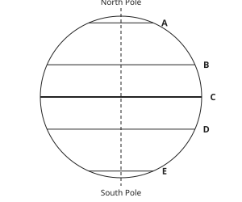

- ◻️ Tropic of Cancer  
  _↳ feedback if chosen: Count the lines from the top: Arctic Circle, Tropic of Cancer, Equator, Tropic of Capricorn, Antarctic Circle._
- ✅ Tropic of Capricorn
- ◻️ Arctic Circle  
  _↳ feedback if chosen: Count the lines from the top: Arctic Circle, Tropic of Cancer, Equator, Tropic of Capricorn, Antarctic Circle._
- ◻️ Equator  
  _↳ feedback if chosen: Count the lines from the top: Arctic Circle, Tropic of Cancer, Equator, Tropic of Capricorn, Antarctic Circle._

Full working after a second miss:

> From the top: Arctic Circle, Tropic of Cancer, Equator, Tropic of Capricorn, Antarctic Circle.  
> Line D is at 23½°S: the Tropic of Capricorn.  

**Practice** `g3-latof` · multiple choice, level 1 · **authored key**

> What is the latitude of the Antarctic Circle?

- ◻️ 23½°N  
  _↳ feedback if chosen: Learn the five main parallels: Arctic Circle 66½°N, Tropic of Cancer 23½°N, Equator 0°, Tropic of Capricorn 23½°S, Antarctic Circle 66½°S._
- ◻️ 66½°N  
  _↳ feedback if chosen: Learn the five main parallels: Arctic Circle 66½°N, Tropic of Cancer 23½°N, Equator 0°, Tropic of Capricorn 23½°S, Antarctic Circle 66½°S._
- ✅ 66½°S
- ◻️ 23½°S  
  _↳ feedback if chosen: Learn the five main parallels: Arctic Circle 66½°N, Tropic of Cancer 23½°N, Equator 0°, Tropic of Capricorn 23½°S, Antarctic Circle 66½°S._

Full working after a second miss:

> The Antarctic Circle is at 66½°S.  

> What is the latitude of the Tropic of Cancer?

- ◻️ 0°  
  _↳ feedback if chosen: Learn the five main parallels: Arctic Circle 66½°N, Tropic of Cancer 23½°N, Equator 0°, Tropic of Capricorn 23½°S, Antarctic Circle 66½°S._
- ✅ 23½°N
- ◻️ 23½°S  
  _↳ feedback if chosen: Learn the five main parallels: Arctic Circle 66½°N, Tropic of Cancer 23½°N, Equator 0°, Tropic of Capricorn 23½°S, Antarctic Circle 66½°S._
- ◻️ 66½°S  
  _↳ feedback if chosen: Learn the five main parallels: Arctic Circle 66½°N, Tropic of Cancer 23½°N, Equator 0°, Tropic of Capricorn 23½°S, Antarctic Circle 66½°S._

Full working after a second miss:

> The Tropic of Cancer is at 23½°N.  

**Practice** `g3-proof` · multiple choice, level 2 · **authored key**

> Which of these shows that the Earth is round?

- ◻️ The sky is blue.  
  _↳ feedback if chosen: The colour of the sky does not show the shape of the Earth._
- ✅ Photographs taken from space show a round Earth.
- ◻️ The Earth has high mountains.  
  _↳ feedback if chosen: Mountains are tiny compared with the whole Earth; they do not show its shape._
- ◻️ Rivers flow downhill.  
  _↳ feedback if chosen: That is about slopes on the land, not the shape of the whole Earth._

Full working after a second miss:

> The true statement is “Photographs taken from space show a round Earth.”.  
> “The sky is blue.” is false: The colour of the sky does not show the shape of the Earth.  
> “The Earth has high mountains.” is false: Mountains are tiny compared with the whole Earth; they do not show its shape.  
> “Rivers flow downhill.” is false: That is about slopes on the land, not the shape of the whole Earth.  

> Which of these shows that the Earth is round?

- ◻️ The sky is blue.  
  _↳ feedback if chosen: The colour of the sky does not show the shape of the Earth._
- ✅ A ship sailing away disappears body first, mast last.
- ◻️ The Sun is very hot.  
  _↳ feedback if chosen: That tells us about the Sun, not the shape of the Earth._
- ◻️ The Earth has high mountains.  
  _↳ feedback if chosen: Mountains are tiny compared with the whole Earth; they do not show its shape._

Full working after a second miss:

> The true statement is “A ship sailing away disappears body first, mast last.”.  
> “The sky is blue.” is false: The colour of the sky does not show the shape of the Earth.  
> “The Sun is very hot.” is false: That tells us about the Sun, not the shape of the Earth.  
> “The Earth has high mountains.” is false: Mountains are tiny compared with the whole Earth; they do not show its shape.  

**Practice** `g3-lines` · matching, level 2 · **authored key**

> Sort these: do they describe lines of latitude or lines of longitude?

Groups: latitude · longitude
- run east–west → **latitude**
- the Equator is the 0° line → **latitude**
- measured north or south of the Equator → **latitude**
- run from pole to pole → **longitude**
- the Prime Meridian is the 0° line → **longitude**
- also called meridians → **longitude**

Full working after a second miss:

> The right pairs are:  
> run east–west → latitude  
> the Equator is the 0° line → latitude  
> measured north or south of the Equator → latitude  
> run from pole to pole → longitude  
> the Prime Meridian is the 0° line → longitude  
> also called meridians → longitude  

> Sort these: do they describe lines of latitude or lines of longitude?

Groups: latitude · longitude
- measured north or south of the Equator → **latitude**
- measured east or west of Greenwich → **longitude**
- run from pole to pole → **longitude**
- the Prime Meridian is the 0° line → **longitude**
- the Equator is the 0° line → **latitude**
- also called meridians → **longitude**

Full working after a second miss:

> The right pairs are:  
> measured north or south of the Equator → latitude  
> measured east or west of Greenwich → longitude  
> run from pole to pole → longitude  
> the Prime Meridian is the 0° line → longitude  
> the Equator is the 0° line → latitude  
> also called meridians → longitude  

**Practice** `g3-continents` · ordering, level 2 · **authored key**

> Put these continents in order of size, largest first.

Shown as: Australia · Antarctica · Asia · North America
Correct order: Asia → North America → Antarctica → Australia

Full working after a second miss:

> The correct order is: Asia → North America → Antarctica → Australia.  

> Put these continents in order of size, largest first.

Shown as: South America · Antarctica · Europe · North America
Correct order: North America → South America → Antarctica → Europe

Full working after a second miss:

> The correct order is: North America → South America → Antarctica → Europe.  

**Practice** `g3-oceans` · ordering, level 3 · **authored key**

> Put these oceans in order of size, largest first.

Shown as: Indian Ocean · Arctic Ocean · Southern Ocean · Pacific Ocean
Correct order: Pacific Ocean → Indian Ocean → Southern Ocean → Arctic Ocean

Full working after a second miss:

> The correct order is: Pacific Ocean → Indian Ocean → Southern Ocean → Arctic Ocean.  

> Put these oceans in order of size, largest first.

Shown as: Arctic Ocean · Indian Ocean · Pacific Ocean · Southern Ocean
Correct order: Pacific Ocean → Indian Ocean → Southern Ocean → Arctic Ocean

Full working after a second miss:

> The correct order is: Pacific Ocean → Indian Ocean → Southern Ocean → Arctic Ocean.  

**Practice** `g3-spot` · spot the error, level 3 · **authored key**

> One sentence is wrong. Which one?

- ◻️ Most of the Earth’s surface is covered by water.
- ✅ The Earth is a perfect sphere.  
  _↳ explanation: It is a little flattened at the poles and bulges at the Equator._
- ◻️ The Equator divides the Earth into the Northern and Southern Hemispheres.
- ◻️ Lines of latitude are also called parallels.

Full working after a second miss:

> The wrong statement is “The Earth is a perfect sphere.”.  
> It is a little flattened at the poles and bulges at the Equator.  

> One sentence is wrong. Which one?

- ◻️ Most of the Earth’s surface is covered by water.
- ✅ The Earth is a perfect sphere.  
  _↳ explanation: It is a little flattened at the poles and bulges at the Equator._
- ◻️ Africa is the second largest continent.
- ◻️ Lines of latitude are also called parallels.

Full working after a second miss:

> The wrong statement is “The Earth is a perfect sphere.”.  
> It is a little flattened at the poles and bulges at the Equator.  

## Lesson 4: PW1: Representation of the earth’s shape and size (identification of marginal information on maps)

Prerequisites: 3 · Skill: g4 (Maps: marginal information and scale)

**Note** (draft)

> A globe is a model of the Earth. It has the right shape, but it is small and hard to carry.
> A map is a flat drawing of the Earth, or of part of it, drawn to scale.
> Marginal information is written around the map, outside its frame:
> • title: what place the map shows;
> • key (legend): what the symbols and colours mean;
> • scale: how map distances compare with real distances;
> • north arrow: which way is north;
> • grid numbers: the numbers of the grid lines.
> Three ways to show a scale:
> • statement: “1 cm represents 1 km”;
> • representative fraction (ratio): 1 : 100 000;
> • linear scale: a line marked in kilometres.
> Real distance: measure on the map in cm, multiply by the scale number, then change cm to km (100 000 cm = 1 km).

**Card gc4-1** (draft)

> A globe has the true shape of the Earth but is small and hard to carry. A map is flat: it can show a small place in detail and fit in a bag.
>
> _To walk around Bamenda, take a map. To see the whole Earth’s shape, look at a globe._  

Check question: `gc4-1-check` · multiple choice, level 1 · **authored key**

> Which is true about globes and maps?

- ✅ A globe shows the true shape of the Earth.
- ◻️ A globe can show every street of a town.  
  _↳ feedback if chosen: A globe is too small for that; a large-scale map can show streets._
- ◻️ A globe is easier to carry than a map.  
  _↳ feedback if chosen: A globe is round and bulky; a map can be folded._
- ◻️ A map is a model in the shape of a ball.  
  _↳ feedback if chosen: That is a globe; a map is flat._

Full working after a second miss:

> The true statement is “A globe shows the true shape of the Earth.”.  
> “A globe can show every street of a town.” is false: A globe is too small for that; a large-scale map can show streets.  
> “A globe is easier to carry than a map.” is false: A globe is round and bulky; a map can be folded.  
> “A map is a model in the shape of a ball.” is false: That is a globe; a map is flat.  

**Card gc4-2** (draft)

> The marginal information around a map helps you read it: title, key, scale, north arrow and grid numbers.
>
> _The key tells you that a blue line is a river and a dashed line is a road._  

Check question: `g4-letter` · multiple choice, level 1 · computed by rule, reused from practice

> What does letter D point to?

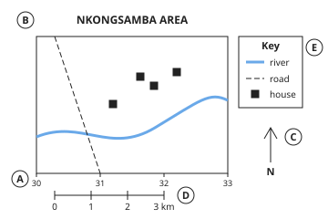

- ◻️ grid numbers  
  _↳ feedback if chosen: Look at what is next to the letter: words at the top, a box of symbols, a line marked in km, an arrow with N, or numbers along the frame._
- ✅ scale
- ◻️ north arrow  
  _↳ feedback if chosen: Look at what is next to the letter: words at the top, a box of symbols, a line marked in km, an arrow with N, or numbers along the frame._
- ◻️ key  
  _↳ feedback if chosen: Look at what is next to the letter: words at the top, a box of symbols, a line marked in km, an arrow with N, or numbers along the frame._

Full working after a second miss:

> Letter D points to the scale.  
> The scale tells you how a distance on the map compares with the real distance.  

**Card gc4-3** (draft)

> A scale can be written in words (“1 cm represents 1 km”), as a ratio (1 : 50 000), or drawn as a line marked in kilometres.
>
> _1 : 50 000 means 1 cm on the map is 50 000 cm on the ground._  

Check question: `g4-use` · multiple choice, level 1 · **authored key**, reused from practice

> Which part of a map tells you what place the map shows?

- ◻️ grid numbers  
  _↳ feedback if chosen: Not that part. Read what each part of the marginal information does._
- ◻️ north arrow  
  _↳ feedback if chosen: Not that part. Read what each part of the marginal information does._
- ◻️ scale  
  _↳ feedback if chosen: Not that part. Read what each part of the marginal information does._
- ✅ title

Full working after a second miss:

> The title tells you what place the map shows.  
> Answer: title.  

**Card gc4-4** (draft)

> To find a real distance: measure in cm on the map, multiply by the scale number, and change cm to km.
>
> _3 cm on a 1 : 50 000 map: 3 × 50 000 = 150 000 cm = 1.5 km._  

Check question: `gc4-4-check` · number, level 1 · computed by rule

> On a map with scale 1 : 100 000, 1 cm represents 1 km. Two villages are 3 cm apart on the map. How far apart are they on the ground?

Answer: **3 km**
- Typed **300 000** (cm) → “That is in centimetres. Change it to kilometres.”

Full working after a second miss:

> Each cm on this map is 1 km on the ground.  
> 3 cm on the map = 3 km.  

**Worked example** (draft)

> On a map with scale 1 : 50 000, the road from the school to the market measures 6 cm. How long is the real road?

1. 1 cm on the map is 50 000 cm on the ground.
2. 6 cm on the map is 6 × 50 000 = 300 000 cm on the ground.
3. There are 100 000 cm in 1 km, so 300 000 cm = 3 km.

**Answer:** 3 km.

**Practice** `g4-letter` · multiple choice, level 1 · computed by rule

> What does letter D point to?

- ◻️ scale  
  _↳ feedback if chosen: Look at what is next to the letter: words at the top, a box of symbols, a line marked in km, an arrow with N, or numbers along the frame._
- ◻️ north arrow  
  _↳ feedback if chosen: Look at what is next to the letter: words at the top, a box of symbols, a line marked in km, an arrow with N, or numbers along the frame._
- ◻️ title  
  _↳ feedback if chosen: Look at what is next to the letter: words at the top, a box of symbols, a line marked in km, an arrow with N, or numbers along the frame._
- ✅ grid numbers

Full working after a second miss:

> Letter D points to the grid numbers.  
> The grid numbers name the grid lines, to help you find places.  

> What does letter E point to?

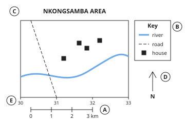

- ◻️ scale  
  _↳ feedback if chosen: Look at what is next to the letter: words at the top, a box of symbols, a line marked in km, an arrow with N, or numbers along the frame._
- ◻️ north arrow  
  _↳ feedback if chosen: Look at what is next to the letter: words at the top, a box of symbols, a line marked in km, an arrow with N, or numbers along the frame._
- ✅ grid numbers
- ◻️ key  
  _↳ feedback if chosen: Look at what is next to the letter: words at the top, a box of symbols, a line marked in km, an arrow with N, or numbers along the frame._

Full working after a second miss:

> Letter E points to the grid numbers.  
> The grid numbers name the grid lines, to help you find places.  

**Practice** `g4-use` · multiple choice, level 1 · **authored key**

> Which part of a map tells you how far apart places really are?

- ◻️ grid numbers  
  _↳ feedback if chosen: Not that part. Read what each part of the marginal information does._
- ◻️ title  
  _↳ feedback if chosen: Not that part. Read what each part of the marginal information does._
- ✅ scale
- ◻️ north arrow  
  _↳ feedback if chosen: Not that part. Read what each part of the marginal information does._

Full working after a second miss:

> The scale tells you how far apart places really are.  
> Answer: scale.  

> Which part of a map tells you the numbers of the lines used to find a place?

- ✅ grid numbers
- ◻️ north arrow  
  _↳ feedback if chosen: Not that part. Read what each part of the marginal information does._
- ◻️ scale  
  _↳ feedback if chosen: Not that part. Read what each part of the marginal information does._
- ◻️ key  
  _↳ feedback if chosen: Not that part. Read what each part of the marginal information does._

Full working after a second miss:

> The grid numbers tells you the numbers of the lines used to find a place.  
> Answer: grid numbers.  

**Practice** `g4-real` · number, level 2 · computed by rule

> A map has the scale 1 : 25 000. Two villages are 9 cm apart on the map. How far apart are they on the ground?

Answer: **2.25 km**
- Typed **2250** (m) → “That is in metres. There are 100 000 cm in a kilometre, not 100.”
- Typed **225 000** (nocv) → “That is in centimetres. Divide by 100 000 to get kilometres.”

Full working after a second miss:

> 1 cm on the map = 25 000 cm on the ground.  
> 9 × 25 000 = 225 000 cm.  
> 225 000 cm ÷ 100 000 = 2.25 km.  

> A map has the scale 1 : 25 000. Two villages are 4 cm apart on the map. How far apart are they on the ground?

Answer: **1 km**
- Typed **1000** (m) → “That is in metres. There are 100 000 cm in a kilometre, not 100.”
- Typed **100 000** (nocv) → “That is in centimetres. Divide by 100 000 to get kilometres.”

Full working after a second miss:

> 1 cm on the map = 25 000 cm on the ground.  
> 4 × 25 000 = 100 000 cm.  
> 100 000 cm ÷ 100 000 = 1 km.  

**Practice** `g4-rf` · multiple choice, level 2 · computed by rule

> On a map, 1 cm represents 10 km. Write this scale as a ratio.

- ◻️ 1 : 100 000  
  _↳ feedback if chosen: Count the zeros: 1 km = 100 000 cm._
- ✅ 1 : 1 000 000
- ◻️ 1 : 10 000  
  _↳ feedback if chosen: 1 km is 1000 metres, but the ratio must use the same unit on both sides: centimetres. 1 km = 100 000 cm._
- ◻️ 1 : 1000  
  _↳ feedback if chosen: 1 km = 100 000 cm, not 100 cm._

Full working after a second miss:

> Both sides must be in cm: 10 km = 10 × 100 000 = 1 000 000 cm.  
> So the scale is 1 : 1 000 000.  

> On a map, 1 cm represents 5 km. Write this scale as a ratio.

- ◻️ 1 : 50 000  
  _↳ feedback if chosen: Count the zeros: 1 km = 100 000 cm._
- ◻️ 1 : 5000  
  _↳ feedback if chosen: 1 km is 1000 metres, but the ratio must use the same unit on both sides: centimetres. 1 km = 100 000 cm._
- ◻️ 1 : 500  
  _↳ feedback if chosen: 1 km = 100 000 cm, not 100 cm._
- ✅ 1 : 500 000

Full working after a second miss:

> Both sides must be in cm: 5 km = 5 × 100 000 = 500 000 cm.  
> So the scale is 1 : 500 000.  

**Practice** `g4-type` · multiple choice, level 2 · **authored key**

> Which kind of scale is “1 : 50 000”?

- ◻️ a linear scale  
  _↳ feedback if chosen: Not this kind. Words: statement. Numbers 1 : n: ratio. A line marked in km: linear scale._
- ✅ a representative fraction (ratio)
- ◻️ a statement scale  
  _↳ feedback if chosen: Not this kind. Words: statement. Numbers 1 : n: ratio. A line marked in km: linear scale._

Full working after a second miss:

> “1 : 50 000” is a representative fraction (ratio).  
> Answer: a representative fraction (ratio).  

> Which kind of scale is “1 : 50 000”?

- ◻️ a statement scale  
  _↳ feedback if chosen: Not this kind. Words: statement. Numbers 1 : n: ratio. A line marked in km: linear scale._
- ◻️ a linear scale  
  _↳ feedback if chosen: Not this kind. Words: statement. Numbers 1 : n: ratio. A line marked in km: linear scale._
- ✅ a representative fraction (ratio)

Full working after a second miss:

> “1 : 50 000” is a representative fraction (ratio).  
> Answer: a representative fraction (ratio).  

**Practice** `g4-map` · number, level 3 · computed by rule

> A road is 3 km long. How long is it on a map with the scale 1 : 50 000?

Answer: **6 cm**
- Typed **1.5** (times) → “You multiplied by the scale. Going from the ground to the map, the distance gets smaller: divide.”
- Typed **300 000** (km) → “That is the real distance in cm. Now divide by the scale number to get the map distance.”

Full working after a second miss:

> 3 km = 3 × 100 000 = 300 000 cm on the ground.  
> On the map: 300 000 ÷ 50 000 = 6 cm.  

> A road is 12 km long. How long is it on a map with the scale 1 : 200 000?

Answer: **6 cm**
- Typed **24** (times) → “You multiplied by the scale. Going from the ground to the map, the distance gets smaller: divide.”
- Typed **1 200 000** (km) → “That is the real distance in cm. Now divide by the scale number to get the map distance.”

Full working after a second miss:

> 12 km = 12 × 100 000 = 1 200 000 cm on the ground.  
> On the map: 1 200 000 ÷ 200 000 = 6 cm.  

## Lesson 5: Practical Work 2 (Part 1): Locate a place on a map

Prerequisites: 4 · Skill: g5 (Grid references)

**Note** (draft)

> Grid lines are numbered lines drawn on a map to help us find places.
> • Eastings are the lines going up and down. Their numbers are along the bottom and grow towards the east.
> • Northings are the lines going across. Their numbers are up the side and grow towards the north.
> A 4-figure grid reference names a square: first the easting of the line on the left of the square, then the northing of the line below it. Remember: “along the corridor, then up the stairs”.
> A 6-figure grid reference names a point: imagine each side of the square cut into ten. Write the easting and the tenths across, then the northing and the tenths up. 253347 means easting 25 and 3 tenths, northing 34 and 7 tenths.

**Card gc5-1** (draft)

> Eastings are the grid lines going up and down; their numbers are along the bottom. Northings go across; their numbers are up the side.
>
> _Eastings grow as you go east (to the right). Northings grow as you go north (up)._  

Check question: `gc5-1-check` · multiple choice, level 1 · **authored key**

> Which sentence is true?

- ◻️ Eastings are the lines going across the map.  
  _↳ feedback if chosen: Lines going across are northings. Eastings go up and down._
- ◻️ Northing numbers get bigger towards the south.  
  _↳ feedback if chosen: Northing numbers get bigger towards the north._
- ✅ Northings are the lines going across the map.
- ◻️ Easting numbers get bigger towards the west.  
  _↳ feedback if chosen: Easting numbers get bigger towards the east._

Full working after a second miss:

> The true statement is “Northings are the lines going across the map.”.  
> “Eastings are the lines going across the map.” is false: Lines going across are northings. Eastings go up and down.  
> “Northing numbers get bigger towards the south.” is false: Northing numbers get bigger towards the north.  
> “Easting numbers get bigger towards the west.” is false: Easting numbers get bigger towards the east.  

**Card gc5-2** (draft)

> A four-figure grid reference names a square: the easting of the line on its left, then the northing of the line below it.
>
> _“Along the corridor, then up the stairs”: easting first, northing second._  

Check question: `g5-four` · number, level 1 · computed by rule, reused from practice

> Give the 4-figure grid reference of the market.

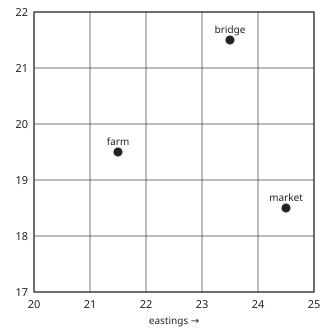

Answer: **2418**
- Typed **1824** (swap) → “You gave the northing first. Easting first: along the corridor, then up the stairs.”
- Typed **2518** (right) → “Use the easting on the LEFT of the square, not the right.”
- Typed **2419** (top) → “Use the northing BELOW the square, not above it.”

Full working after a second miss:

> Along the corridor: the line on the left of the market’s square is easting 24.  
> Up the stairs: the line below it is northing 18.  
> Grid reference: 2418.  

**Card gc5-3** (draft)

> To find a square from its grid reference, go along to the easting, then up to the northing: the square is to the right of and above that corner.
>
> _Square 2534: along to easting 25, up to northing 34._  

Check question: `g5-which` · multiple choice, level 1 · computed by rule, reused from practice

> Which place is in grid square 3534?

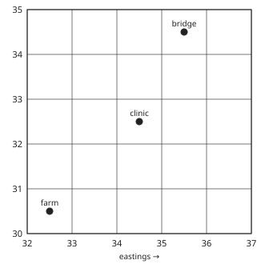

- ◻️ farm  
  _↳ feedback if chosen: Go along to easting 35 first, then up to northing 34. The square is to the right of and above that corner._
- ✅ bridge
- ◻️ clinic  
  _↳ feedback if chosen: Go along to easting 35 first, then up to northing 34. The square is to the right of and above that corner._

Full working after a second miss:

> Along to easting 35, up to northing 34.  
> The square to the right of and above that corner holds the bridge.  

**Card gc5-4** (draft)

> A six-figure grid reference names a point: easting and tenths across, then northing and tenths up.
>
> _253347: easting 25 and 3 tenths, northing 34 and 7 tenths._  

Check question: `gc5-4-check` · multiple choice, level 1 · computed by rule

> In the grid reference 389249, which part gives the easting and its tenths?

- ◻️ 924  
  _↳ feedback if chosen: Split the six figures into two groups of three: easting first, northing second._
- ◻️ 38  
  _↳ feedback if chosen: In a six-figure reference the easting has its tenths: three figures._
- ◻️ 249  
  _↳ feedback if chosen: That is the northing. The easting always comes first._
- ✅ 389

Full working after a second miss:

> Split 389249 into two groups of three figures.  
> The first group is the easting with its tenths: 389.  

**Worked example** (draft)

> What is the four-figure grid reference of the clinic?

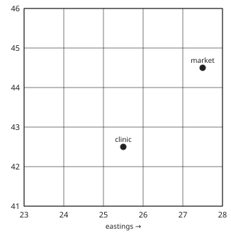

1. Along the corridor: the line on the left of the clinic’s square is easting 25.
2. Up the stairs: the line below the square is northing 42.
3. Easting first, then northing.

**Answer:** 2542

**Practice** `g5-four` · number, level 1 · computed by rule

> Give the 4-figure grid reference of the farm.

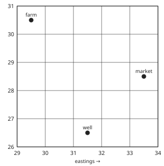

Answer: **2930**
- Typed **3029** (swap) → “You gave the northing first. Easting first: along the corridor, then up the stairs.”
- Typed **3030** (right) → “Use the easting on the LEFT of the square, not the right.”
- Typed **2931** (top) → “Use the northing BELOW the square, not above it.”

Full working after a second miss:

> Along the corridor: the line on the left of the farm’s square is easting 29.  
> Up the stairs: the line below it is northing 30.  
> Grid reference: 2930.  

> Give the 4-figure grid reference of the bridge.

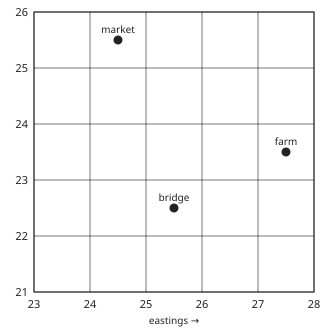

Answer: **2522**
- Typed **2225** (swap) → “You gave the northing first. Easting first: along the corridor, then up the stairs.”
- Typed **2622** (right) → “Use the easting on the LEFT of the square, not the right.”
- Typed **2523** (top) → “Use the northing BELOW the square, not above it.”

Full working after a second miss:

> Along the corridor: the line on the left of the bridge’s square is easting 25.  
> Up the stairs: the line below it is northing 22.  
> Grid reference: 2522.  

**Practice** `g5-which` · multiple choice, level 1 · computed by rule

> Which place is in grid square 3317?

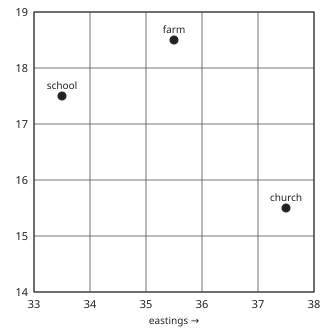

- ✅ school
- ◻️ church  
  _↳ feedback if chosen: Go along to easting 33 first, then up to northing 17. The square is to the right of and above that corner._
- ◻️ farm  
  _↳ feedback if chosen: Go along to easting 33 first, then up to northing 17. The square is to the right of and above that corner._

Full working after a second miss:

> Along to easting 33, up to northing 17.  
> The square to the right of and above that corner holds the school.  

> Which place is in grid square 3823?

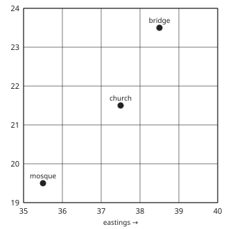

- ◻️ mosque  
  _↳ feedback if chosen: Go along to easting 38 first, then up to northing 23. The square is to the right of and above that corner._
- ◻️ church  
  _↳ feedback if chosen: Go along to easting 38 first, then up to northing 23. The square is to the right of and above that corner._
- ✅ bridge

Full working after a second miss:

> Along to easting 38, up to northing 23.  
> The square to the right of and above that corner holds the bridge.  

**Practice** `g5-rule` · multiple choice, level 2 · **authored key**

> Which is the right way to give a 4-figure grid reference?

- ◻️ Any two numbers you can see near the place.  
  _↳ feedback if chosen: Use the easting on the left of the square, then the northing below it._
- ◻️ The easting on the right of the square, then the northing above it.  
  _↳ feedback if chosen: Use the lines on the left and below the square._
- ✅ The easting on the left of the square, then the northing below it.
- ◻️ The northing below the square, then the easting on its left.  
  _↳ feedback if chosen: Easting first: along the corridor, then up the stairs._

Full working after a second miss:

> The true statement is “The easting on the left of the square, then the northing below it.”.  
> “Any two numbers you can see near the place.” is false: Use the easting on the left of the square, then the northing below it.  
> “The easting on the right of the square, then the northing above it.” is false: Use the lines on the left and below the square.  
> “The northing below the square, then the easting on its left.” is false: Easting first: along the corridor, then up the stairs.  

> Which is the right way to give a 4-figure grid reference?

- ◻️ Any two numbers you can see near the place.  
  _↳ feedback if chosen: Use the easting on the left of the square, then the northing below it._
- ◻️ The northing below the square, then the easting on its left.  
  _↳ feedback if chosen: Easting first: along the corridor, then up the stairs._
- ◻️ The number of the square counted from the top of the map.  
  _↳ feedback if chosen: A grid reference uses the easting and northing numbers._
- ✅ The easting on the left of the square, then the northing below it.

Full working after a second miss:

> The true statement is “The easting on the left of the square, then the northing below it.”.  
> “Any two numbers you can see near the place.” is false: Use the easting on the left of the square, then the northing below it.  
> “The northing below the square, then the easting on its left.” is false: Easting first: along the corridor, then up the stairs.  
> “The number of the square counted from the top of the map.” is false: A grid reference uses the easting and northing numbers.  

**Practice** `g5-six` · multiple choice, level 2 · computed by rule

> Give the 6-figure grid reference of the church.

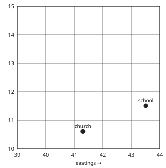

- ◻️ 106413  
  _↳ feedback if chosen: That gives the northing first. Easting and its tenths first, then northing and its tenths._
- ◻️ 416103  
  _↳ feedback if chosen: The tenths are mixed up: the first tenths are across (east), the second tenths are up (north)._
- ◻️ 423106  
  _↳ feedback if chosen: Start from the easting on the left of the square, then add the tenths across._
- ✅ 413106

Full working after a second miss:

> The church is right of easting 41 by 3 tenths of the square: 413.  
> It is above northing 10 by 6 tenths: 106.  
> Grid reference: 413106.  

> Give the 6-figure grid reference of the bridge.

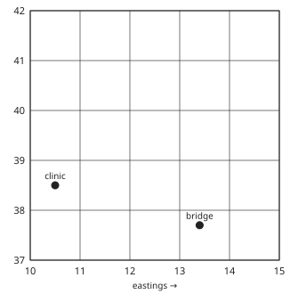

- ✅ 134377
- ◻️ 137374  
  _↳ feedback if chosen: The tenths are mixed up: the first tenths are across (east), the second tenths are up (north)._
- ◻️ 377134  
  _↳ feedback if chosen: That gives the northing first. Easting and its tenths first, then northing and its tenths._
- ◻️ 144377  
  _↳ feedback if chosen: Start from the easting on the left of the square, then add the tenths across._

Full working after a second miss:

> The bridge is right of easting 13 by 4 tenths of the square: 134.  
> It is above northing 37 by 7 tenths: 377.  
> Grid reference: 134377.  

**Practice** `g5-mistake` · multiple choice, level 3 · **authored key**

> A pupil says the bridge is in square 2737. What mistake was made?

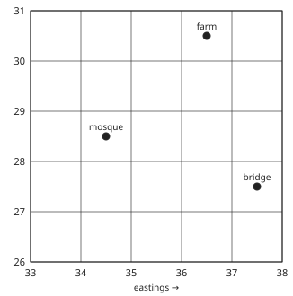

- ◻️ The northing above the square was used.  
  _↳ feedback if chosen: Look again: the right answer is 3727. The same two numbers were used, in the wrong order._
- ◻️ The easting on the right of the square was used.  
  _↳ feedback if chosen: Look again: the right answer is 3727. The same two numbers were used, in the wrong order._
- ◻️ There is no mistake: the answer is right.  
  _↳ feedback if chosen: The right answer is 3727: easting first, then northing._
- ✅ The northing was given before the easting.

Full working after a second miss:

> The bridge’s square has easting 37 and northing 27: 3727.  
> The same numbers were written the other way round. So: The northing was given before the easting.  

> A pupil says the mosque is in square 3441. What mistake was made?

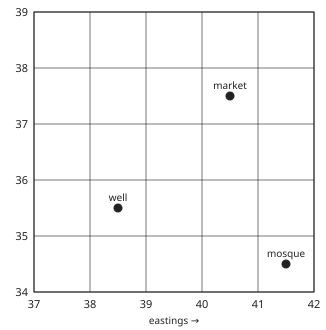

- ◻️ The northing above the square was used.  
  _↳ feedback if chosen: Look again: the right answer is 4134. The same two numbers were used, in the wrong order._
- ◻️ There is no mistake: the answer is right.  
  _↳ feedback if chosen: The right answer is 4134: easting first, then northing._
- ✅ The northing was given before the easting.
- ◻️ The easting on the right of the square was used.  
  _↳ feedback if chosen: Look again: the right answer is 4134. The same two numbers were used, in the wrong order._

Full working after a second miss:

> The mosque’s square has easting 41 and northing 34: 4134.  
> The same numbers were written the other way round. So: The northing was given before the easting.  

## Lesson 6: PW 2 (Part 2): Locate a place on a map (Read geographical coordinates of a place on a map)

Prerequisites: 5 · Skill: g6 (Reading latitude and longitude)

**Note** (draft)

> The position of a place is given by its latitude and its longitude, latitude first: 4°N, 10°E.
> To read a position on a map:
> 1. Find the line of latitude through the place. Is it north (N) or south (S) of the Equator?
> 2. Find the line of longitude through the place. Is it east (E) or west (W) of the Prime Meridian?
> 3. Write the latitude, then the longitude.
> If the place is halfway between two lines, its value is halfway between theirs: halfway between 4°N and 6°N is 5°N.
> The Equator divides the Earth into the Northern and Southern Hemispheres; the Prime Meridian divides it into the Eastern and Western Hemispheres.
> Cameroon is in the Northern and Eastern Hemispheres: roughly between 2°N and 13°N, and between 8°E and 16°E.

**Card gc6-1** (draft)

> A position is written latitude first, then longitude, each with its letter: N or S, then E or W.
>
> _4°N, 10°E means 4°N latitude and 10°E longitude._  

Check question: `g6-read` · multiple choice, level 1 · computed by rule, reused from practice

> What is the position of place P?

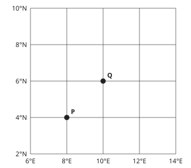

- ◻️ 8°N, 4°E  
  _↳ feedback if chosen: Latitude first: read the line going across through P, then the line going up and down._
- ◻️ 4°N, 8°W  
  _↳ feedback if chosen: Check E or W: is P to the right (east) of the Prime Meridian or to the left?_
- ✅ 4°N, 8°E
- ◻️ 4°S, 8°E  
  _↳ feedback if chosen: Check N or S: is P above (north of) the Equator or below it?_

Full working after a second miss:

> The line of latitude through P is 4°N.  
> The line of longitude through P is 8°E.  
> Position: 4°N, 8°E.  

**Card gc6-2** (draft)

> North or south of the Equator gives N or S. East or west of the Prime Meridian gives E or W.
>
> _Below the Equator the latitude is S: 6°S. Left of the Prime Meridian the longitude is W: 6°W._  

Check question: `g6-lat` · multiple choice, level 1 · computed by rule, reused from practice

> What is the latitude of place P?

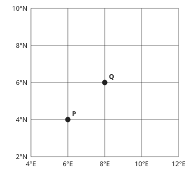

- ✅ 4°N
- ◻️ 6°E  
  _↳ feedback if chosen: That is the longitude. Latitude is read on the lines going across._
- ◻️ 4°S  
  _↳ feedback if chosen: Check N or S: is P north of the Equator or south of it?_
- ◻️ 6°N  
  _↳ feedback if chosen: That is the next line up. Read the line that passes through P._

Full working after a second miss:

> The line going across through P is 4°N.  
> Latitude: 4°N.  

**Card gc6-3** (draft)

> A place halfway between two lines has the value halfway between them.
>
> _Halfway between 4°N and 6°N is 5°N._  

Check question: `gc6-3-check` · multiple choice, level 1 · computed by rule

> A place is halfway between the lines 6°N and 8°N. What is its latitude?

- ◻️ 8°N  
  _↳ feedback if chosen: The place is between the lines, not on one: take the middle value._
- ◻️ 7°S  
  _↳ feedback if chosen: Both lines are north of the Equator, so the place is too: N._
- ◻️ 6°N  
  _↳ feedback if chosen: The place is between the lines, not on one: take the middle value._
- ✅ 7°N

Full working after a second miss:

> The middle of 6 and 8 is 7.  
> Both lines are north of the Equator: 7°N.  

**Worked example** (draft)

> What is the position of place Y?

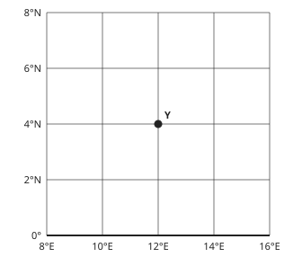

1. The line of latitude through Y is 4°N: north of the Equator.
2. The line of longitude through Y is 12°E: east of the Prime Meridian.
3. Latitude first, then longitude.

**Answer:** 4°N, 12°E

**Practice** `g6-read` · multiple choice, level 1 · computed by rule

> What is the position of place P?

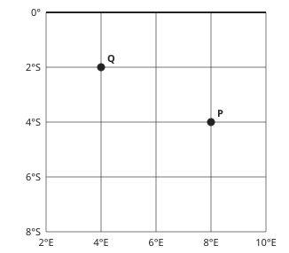

- ◻️ 8°N, 4°W  
  _↳ feedback if chosen: Latitude first: read the line going across through P, then the line going up and down._
- ◻️ 4°N, 8°E  
  _↳ feedback if chosen: Check N or S: is P above (north of) the Equator or below it?_
- ✅ 4°S, 8°E
- ◻️ 4°S, 8°W  
  _↳ feedback if chosen: Check E or W: is P to the right (east) of the Prime Meridian or to the left?_

Full working after a second miss:

> The line of latitude through P is 4°S.  
> The line of longitude through P is 8°E.  
> Position: 4°S, 8°E.  

> What is the position of place P?

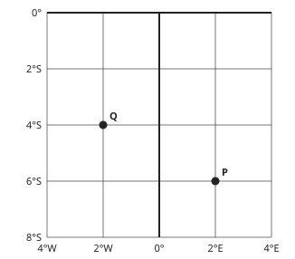

- ◻️ 2°N, 6°W  
  _↳ feedback if chosen: Latitude first: read the line going across through P, then the line going up and down._
- ◻️ 6°N, 2°E  
  _↳ feedback if chosen: Check N or S: is P above (north of) the Equator or below it?_
- ✅ 6°S, 2°E
- ◻️ 6°S, 2°W  
  _↳ feedback if chosen: Check E or W: is P to the right (east) of the Prime Meridian or to the left?_

Full working after a second miss:

> The line of latitude through P is 6°S.  
> The line of longitude through P is 2°E.  
> Position: 6°S, 2°E.  

**Practice** `g6-lat` · multiple choice, level 1 · computed by rule

> What is the latitude of place P?

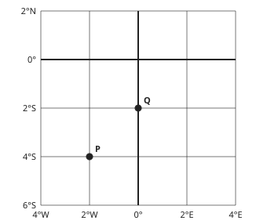

- ◻️ 2°W  
  _↳ feedback if chosen: That is the longitude. Latitude is read on the lines going across._
- ◻️ 2°S  
  _↳ feedback if chosen: That is the next line up. Read the line that passes through P._
- ✅ 4°S
- ◻️ 4°N  
  _↳ feedback if chosen: Check N or S: is P north of the Equator or south of it?_

Full working after a second miss:

> The line going across through P is 4°S.  
> Latitude: 4°S.  

> What is the latitude of place P?

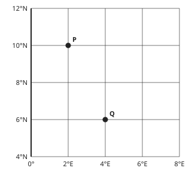

- ◻️ 12°N  
  _↳ feedback if chosen: That is the next line up. Read the line that passes through P._
- ◻️ 10°S  
  _↳ feedback if chosen: Check N or S: is P north of the Equator or south of it?_
- ✅ 10°N
- ◻️ 2°E  
  _↳ feedback if chosen: That is the longitude. Latitude is read on the lines going across._

Full working after a second miss:

> The line going across through P is 10°N.  
> Latitude: 10°N.  

**Practice** `g6-half` · multiple choice, level 2 · computed by rule

> Place R is halfway between grid lines. What is its position?

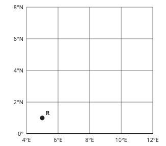

- ◻️ 2°N, 6°E  
  _↳ feedback if chosen: That is the nearest crossing of lines. R is halfway between lines: take the middle values._
- ◻️ 1°N, 5°W  
  _↳ feedback if chosen: Check E or W against the Prime Meridian._
- ✅ 1°N, 5°E
- ◻️ 1°S, 5°E  
  _↳ feedback if chosen: Check N or S against the Equator._

Full working after a second miss:

> R is halfway between latitudes 0° and 2°N: 1°N.  
> R is halfway between longitudes 4°E and 6°E: 5°E.  
> Position: 1°N, 5°E.  

> Place R is halfway between grid lines. What is its position?

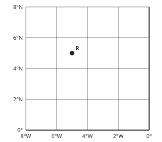

- ◻️ 5°N, 5°E  
  _↳ feedback if chosen: Check E or W against the Prime Meridian._
- ✅ 5°N, 5°W
- ◻️ 6°N, 4°W  
  _↳ feedback if chosen: That is the nearest crossing of lines. R is halfway between lines: take the middle values._
- ◻️ 5°S, 5°W  
  _↳ feedback if chosen: Check N or S against the Equator._

Full working after a second miss:

> R is halfway between latitudes 4°N and 6°N: 5°N.  
> R is halfway between longitudes 6°W and 4°W: 5°W.  
> Position: 5°N, 5°W.  

**Practice** `g6-hemi` · multiple choice, level 2 · computed by rule

> A place is at 26°S, 133°E. Which hemispheres is it in?

- ◻️ Southern and Western  
  _↳ feedback if chosen: N is the Northern Hemisphere and S the Southern; E is the Eastern Hemisphere and W the Western._
- ◻️ Northern and Western  
  _↳ feedback if chosen: N is the Northern Hemisphere and S the Southern; E is the Eastern Hemisphere and W the Western._
- ◻️ Northern and Eastern  
  _↳ feedback if chosen: N is the Northern Hemisphere and S the Southern; E is the Eastern Hemisphere and W the Western._
- ✅ Southern and Eastern

Full working after a second miss:

> 26°S: S, south of the Equator. 133°E: E, east of the Prime Meridian.  
> So: Southern and Eastern.  

> A place is at 17°N, 40°E. Which hemispheres is it in?

- ◻️ Southern and Western  
  _↳ feedback if chosen: N is the Northern Hemisphere and S the Southern; E is the Eastern Hemisphere and W the Western._
- ◻️ Northern and Western  
  _↳ feedback if chosen: N is the Northern Hemisphere and S the Southern; E is the Eastern Hemisphere and W the Western._
- ◻️ Southern and Eastern  
  _↳ feedback if chosen: N is the Northern Hemisphere and S the Southern; E is the Eastern Hemisphere and W the Western._
- ✅ Northern and Eastern

Full working after a second miss:

> 17°N: N, north of the Equator. 40°E: E, east of the Prime Meridian.  
> So: Northern and Eastern.  

**Practice** `g6-apart` · number, level 3 · computed by rule

> Town A is at latitude 28°N and town B at 14°S. How many degrees of latitude apart are they?

Answer: **42 °**
- Typed **14** (sub) → “The towns are on opposite sides of the Equator: add the two latitudes.”

Full working after a second miss:

> One town is north of the Equator and the other south: add.  
> 28 + 14 = 42°.  

> Town A is at latitude 28°N and town B at 18°S. How many degrees of latitude apart are they?

Answer: **46 °**
- Typed **10** (sub) → “The towns are on opposite sides of the Equator: add the two latitudes.”

Full working after a second miss:

> One town is north of the Equator and the other south: add.  
> 28 + 18 = 46°.  

## Lesson 7: (Part 1): The earth: A planet moving in space (Rotation & effects; Revolution & effects,)

Prerequisites: 3 · Skill: g7 (Rotation and revolution of the Earth)

**Note** (draft)

> The Earth makes two movements.
> Rotation: the Earth spins on its axis (an imaginary line through the poles) from west to east, once in about 24 hours: one day.
> Effects of rotation:
> • day and night (the half facing the Sun has day);
> • the Sun seems to rise in the east and set in the west;
> • places on different meridians have different times.
> Revolution: the Earth travels round the Sun in an orbit, once in about 365¼ days: one year. Every four years the extra quarters make a leap year of 366 days, with 29 February.
> Effects of revolution, because the axis is tilted (about 23½°):
> • the seasons;
> • days and nights of different lengths during the year.
> At the equinoxes (about 21 March and 23 September) day and night are equal everywhere. The solstices are about 21 June and 22 December.

**Card gc7-1** (draft)

> The Earth rotates (spins on its axis) from west to east, once in about 24 hours. This gives day and night.
>
> _The half of the Earth facing the Sun has day; the other half has night._  

Check question: `g7-dn` · multiple choice, level 1 · computed by rule, reused from practice

> The Sun’s rays come from the left. Is it day or night at town T?

- ✅ day
- ◻️ night  
  _↳ feedback if chosen: The half of the Earth facing the Sun (the left half here) has day; the other half has night._

Full working after a second miss:

> The left half faces the Sun and has day.  
> T is on the left half: day.  

**Card gc7-2** (draft)

> Because the Earth turns from west to east, the Sun seems to rise in the east and set in the west.
>
> _In Bertoua the Sun rises before it rises in Buea, because Bertoua is further east._  

Check question: `g7-sort` · matching, level 1 · **authored key**, reused from practice

> Sort these: are they about rotation or revolution?

Groups: rotation · revolution
- takes about 24 hours → **rotation**
- days longer in some months than others → **revolution**
- the seasons → **revolution**
- the Sun seems to rise in the east → **rotation**
- leap years → **revolution**
- day and night → **rotation**

Full working after a second miss:

> The right pairs are:  
> takes about 24 hours → rotation  
> days longer in some months than others → revolution  
> the seasons → revolution  
> the Sun seems to rise in the east → rotation  
> leap years → revolution  
> day and night → rotation  

**Card gc7-3** (draft)

> The Earth revolves (travels) round the Sun once in about 365¼ days: one year. Every fourth year is a leap year of 366 days.
>
> _In a leap year February has 29 days._  

Check question: `gc7-3-check` · multiple choice, level 1 · **authored key**

> Which takes about one year?

- ✅ one revolution of the Earth round the Sun
- ◻️ one spin of the Earth  
  _↳ feedback if chosen: A spin (rotation) takes about one day._
- ◻️ the Moon going round the Earth  
  _↳ feedback if chosen: That takes about a month._
- ◻️ one rotation of the Earth on its axis  
  _↳ feedback if chosen: One rotation takes about one day._

Full working after a second miss:

> The true statement is “one revolution of the Earth round the Sun”.  
> “one spin of the Earth” is false: A spin (rotation) takes about one day.  
> “the Moon going round the Earth” is false: That takes about a month.  
> “one rotation of the Earth on its axis” is false: One rotation takes about one day.  

**Card gc7-4** (draft)

> The Earth’s axis is tilted. As the Earth revolves, this tilt gives the seasons and days and nights of different lengths.
>
> _At the equinoxes, day and night are equal everywhere._  

Check question: `gc7-4-check` · multiple choice, level 1 · **authored key**

> What causes the seasons?

- ✅ the revolution of the Earth with its tilted axis
- ◻️ the rotation of the Earth  
  _↳ feedback if chosen: Rotation gives day and night, not seasons._
- ◻️ the Moon  
  _↳ feedback if chosen: The Moon causes tides, not seasons._
- ◻️ clouds covering the Sun  
  _↳ feedback if chosen: Clouds change the weather, not the seasons of the year._

Full working after a second miss:

> The true statement is “the revolution of the Earth with its tilted axis”.  
> “the rotation of the Earth” is false: Rotation gives day and night, not seasons.  
> “the Moon” is false: The Moon causes tides, not seasons.  
> “clouds covering the Sun” is false: Clouds change the weather, not the seasons of the year.  

**Worked example** (draft)

> In the drawing, is it day or night at town T?

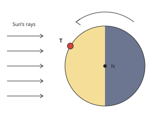

1. The Sun’s rays come from the left, so the left half of the Earth, facing the Sun, has day.
2. The right half faces away from the Sun and has night.
3. T is on the left half.

**Answer:** It is day at T.

**Practice** `g7-dn` · multiple choice, level 1 · computed by rule

> The Sun’s rays come from the left. Is it day or night at town T?

- ◻️ day  
  _↳ feedback if chosen: The half of the Earth facing the Sun (the left half here) has day; the other half has night._
- ✅ night

Full working after a second miss:

> The left half faces the Sun and has day.  
> T is on the right half: night.  

> The Sun’s rays come from the left. Is it day or night at town T?

- ✅ day
- ◻️ night  
  _↳ feedback if chosen: The half of the Earth facing the Sun (the left half here) has day; the other half has night._

Full working after a second miss:

> The left half faces the Sun and has day.  
> T is on the left half: day.  

**Practice** `g7-sort` · matching, level 1 · **authored key**

> Sort these: are they about rotation or revolution?

Groups: rotation · revolution
- takes about 365¼ days → **revolution**
- day and night → **rotation**
- takes about 24 hours → **rotation**
- the seasons → **revolution**
- days longer in some months than others → **revolution**
- leap years → **revolution**

Full working after a second miss:

> The right pairs are:  
> takes about 365¼ days → revolution  
> day and night → rotation  
> takes about 24 hours → rotation  
> the seasons → revolution  
> days longer in some months than others → revolution  
> leap years → revolution  

> Sort these: are they about rotation or revolution?

Groups: rotation · revolution
- different times in different places → **rotation**
- takes about 365¼ days → **revolution**
- day and night → **rotation**
- days longer in some months than others → **revolution**
- the Sun seems to rise in the east → **rotation**
- takes about 24 hours → **rotation**

Full working after a second miss:

> The right pairs are:  
> different times in different places → rotation  
> takes about 365¼ days → revolution  
> day and night → rotation  
> days longer in some months than others → revolution  
> the Sun seems to rise in the east → rotation  
> takes about 24 hours → rotation  

**Practice** `g7-days` · number, level 2 · computed by rule

> How many days are there in the year 2029?

Answer: **365 days**
- Typed **366** (leap) → “A leap year comes every four years: the year can be divided exactly by 4. Check 2029.”

Full working after a second miss:

> 2029 ÷ 4 = 507.25: it does not divide exactly, so it is not a leap year.  
> 2029 has 365 days.  

> How many days are there in the year 2034?

Answer: **365 days**
- Typed **366** (leap) → “A leap year comes every four years: the year can be divided exactly by 4. Check 2034.”

Full working after a second miss:

> 2034 ÷ 4 = 508.5: it does not divide exactly, so it is not a leap year.  
> 2034 has 365 days.  

**Practice** `g7-rs` · multiple choice, level 2 · computed by rule

> The Earth turns in the direction of the arrow. Will town T soon have sunrise or sunset?

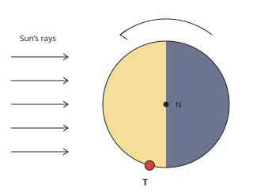

- ◻️ sunrise  
  _↳ feedback if chosen: Follow the arrow: is T being carried from night into day (sunrise) or from day into night (sunset)?_
- ✅ sunset

Full working after a second miss:

> T is near the line between day and night.  
> Following the arrow, T moves from day into night: sunset.  

> The Earth turns in the direction of the arrow. Will town T soon have sunrise or sunset?

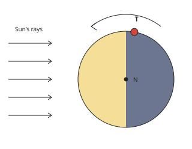

- ✅ sunrise
- ◻️ sunset  
  _↳ feedback if chosen: Follow the arrow: is T being carried from night into day (sunrise) or from day into night (sunset)?_

Full working after a second miss:

> T is near the line between day and night.  
> Following the arrow, T moves from night into day: sunrise.  

**Practice** `g7-leap` · multiple choice, level 3 · computed by rule

> Which of these years is a leap year?

- ✅ 2040
- ◻️ 2043  
  _↳ feedback if chosen: A leap year can be divided exactly by 4. This year cannot._
- ◻️ 2042  
  _↳ feedback if chosen: A leap year can be divided exactly by 4. This year cannot._
- ◻️ 2041  
  _↳ feedback if chosen: A leap year can be divided exactly by 4. This year cannot._

Full working after a second miss:

> A leap year can be divided exactly by 4.  
> 2040 ÷ 4 = 510 exactly, so 2040 is a leap year.  

> Which of these years is a leap year?

- ◻️ 2021  
  _↳ feedback if chosen: A leap year can be divided exactly by 4. This year cannot._
- ✅ 2020
- ◻️ 2022  
  _↳ feedback if chosen: A leap year can be divided exactly by 4. This year cannot._
- ◻️ 2019  
  _↳ feedback if chosen: A leap year can be divided exactly by 4. This year cannot._

Full working after a second miss:

> A leap year can be divided exactly by 4.  
> 2020 ÷ 4 = 505 exactly, so 2020 is a leap year.  

**Practice** `g7-spot` · spot the error, level 3 · **authored key**

> One sentence is wrong. Which one?

- ✅ The Earth rotates from east to west.  
  _↳ explanation: It rotates from west to east; that is why the Sun seems to rise in the east._
- ◻️ One rotation takes about 24 hours.
- ◻️ At the equinoxes, day and night are equal.
- ◻️ A leap year has 366 days.

Full working after a second miss:

> The wrong statement is “The Earth rotates from east to west.”.  
> It rotates from west to east; that is why the Sun seems to rise in the east.  

> One sentence is wrong. Which one?

- ◻️ One rotation takes about 24 hours.
- ◻️ A leap year has 366 days.
- ✅ Rotation causes the seasons.  
  _↳ explanation: Rotation causes day and night; revolution with the tilted axis causes the seasons._
- ◻️ The Earth rotates from west to east.

Full working after a second miss:

> The wrong statement is “Rotation causes the seasons.”.  
> Rotation causes day and night; revolution with the tilted axis causes the seasons.  

## Lesson 8: (Part 2): The earth: A planet moving in space (Local & standard time)

Prerequisites: 6, 7 · Skill: g8 (Local time and standard time)

**Note** (draft)

> The Earth turns through 360° in 24 hours, so it turns 15° in 1 hour and 1° in 4 minutes.
> Local time: it is 12 noon at a place when the Sun is highest in its sky. Places on the same meridian have the same local time.
> The Earth turns from west to east, so places to the east see the Sun first: their time is ahead. Places to the west are behind.
> To find the local time of a place:
> 1. Find the difference in longitude (same side of 0°: subtract; opposite sides: add).
> 2. Multiply by 4 minutes.
> 3. East: add the time. West: subtract it.
> Standard time: a country uses one time for all its places, the time of one chosen meridian. Cameroon uses West Africa Time, one hour ahead of Greenwich (GMT+1), the time of 15°E.

**Card gc8-1** (draft)

> The Earth turns through 360° in 24 hours, so it turns 15° in 1 hour.
>
> _Two places 30° apart have a time difference of 2 hours._  

Check question: `g8-hours` · number, level 1 · computed by rule, reused from practice

> Two places are 30° of longitude apart. What is the difference in their local times, in hours?

Answer: **2 hours**
- Typed **120** (min) → “That is the difference in minutes. Divide by 60, or divide the degrees by 15.”
- Typed **450** (times) → “Divide by 15, do not multiply: 15° is 1 hour.”

Full working after a second miss:

> 15° = 1 hour.  
> 30 ÷ 15 = 2 hours.  

**Card gc8-2** (draft)

> Each degree of longitude makes a difference of 4 minutes in time.
>
> _10° apart: 10 × 4 = 40 minutes._  

Check question: `g8-mins` · number, level 1 · computed by rule, reused from practice

> Two places are 26° of longitude apart. What is the difference in their local times, in minutes?

Answer: **104 minutes**
- Typed **390** (fifteen) → “15 is degrees per hour. For minutes, each degree is 4 minutes.”
- Typed **26** (same) → “Each degree is 4 minutes, not 1 minute: multiply by 4.”

Full working after a second miss:

> Each degree = 4 minutes.  
> 26 × 4 = 104 minutes.  

**Card gc8-3** (draft)

> Places to the east see the Sun first, so their local time is ahead. Places to the west are behind.
>
> _When the local time is noon in Limbe, it is already after noon in Bertoua, further east._  

Check question: `g8-east` · multiple choice, level 1 · computed by rule, reused from practice

> Town A is at 10°W and town B is at 20°W. Which town’s local time is ahead?

- ✅ Town A
- ◻️ They have the same time.  
  _↳ feedback if chosen: They are on different meridians, so their local times are different._
- ◻️ Town B  
  _↳ feedback if chosen: That town is further west. The town further east sees the Sun first, so its time is ahead._

Full working after a second miss:

> Town A is further east.  
> Places further east are ahead: Town A.  

**Card gc8-4** (draft)

> Standard time is one time used by a whole country. Cameroon uses West Africa Time: GMT+1.
>
> _When it is 9:00 a.m. at Greenwich, it is 10:00 a.m. in Yaoundé and in Garoua._  

Check question: `gc8-4-check` · multiple choice, level 1 · computed by rule

> Cameroon uses GMT+1. When it is 3:00 p.m. at Greenwich (GMT), what time is it in Cameroon?

- ◻️ 2:00 p.m.  
  _↳ feedback if chosen: GMT+1 is ahead of Greenwich: add one hour._
- ◻️ 3:00 p.m.  
  _↳ feedback if chosen: Cameroon is not on Greenwich time: it is one hour ahead._
- ✅ 4:00 p.m.

Full working after a second miss:

> GMT+1 is one hour ahead of Greenwich.  
> 3:00 p.m. + 1 hour = 4:00 p.m.  

**Worked example** (draft)

> When it is 10:00 a.m. at Greenwich (0°), what is the local time at a town on 45°E?

1. Difference in longitude: 45°.
2. Time difference: 45 × 4 = 180 minutes = 3 hours.
3. The town is east of Greenwich, so its time is ahead: add.

**Answer:** 1:00 p.m.

**Practice** `g8-hours` · number, level 1 · computed by rule

> Two places are 120° of longitude apart. What is the difference in their local times, in hours?

Answer: **8 hours**
- Typed **480** (min) → “That is the difference in minutes. Divide by 60, or divide the degrees by 15.”
- Typed **1800** (times) → “Divide by 15, do not multiply: 15° is 1 hour.”

Full working after a second miss:

> 15° = 1 hour.  
> 120 ÷ 15 = 8 hours.  

> Two places are 105° of longitude apart. What is the difference in their local times, in hours?

Answer: **7 hours**
- Typed **420** (min) → “That is the difference in minutes. Divide by 60, or divide the degrees by 15.”
- Typed **1575** (times) → “Divide by 15, do not multiply: 15° is 1 hour.”

Full working after a second miss:

> 15° = 1 hour.  
> 105 ÷ 15 = 7 hours.  

**Practice** `g8-mins` · number, level 1 · computed by rule

> Two places are 13° of longitude apart. What is the difference in their local times, in minutes?

Answer: **52 minutes**
- Typed **195** (fifteen) → “15 is degrees per hour. For minutes, each degree is 4 minutes.”
- Typed **13** (same) → “Each degree is 4 minutes, not 1 minute: multiply by 4.”

Full working after a second miss:

> Each degree = 4 minutes.  
> 13 × 4 = 52 minutes.  

> Two places are 27° of longitude apart. What is the difference in their local times, in minutes?

Answer: **108 minutes**
- Typed **405** (fifteen) → “15 is degrees per hour. For minutes, each degree is 4 minutes.”
- Typed **27** (same) → “Each degree is 4 minutes, not 1 minute: multiply by 4.”

Full working after a second miss:

> Each degree = 4 minutes.  
> 27 × 4 = 108 minutes.  

**Practice** `g8-east` · multiple choice, level 1 · computed by rule

> Town A is at 50°W and town B is at 65°E. Which town’s local time is ahead?

- ◻️ They have the same time.  
  _↳ feedback if chosen: They are on different meridians, so their local times are different._
- ◻️ Town A  
  _↳ feedback if chosen: That town is further west. The town further east sees the Sun first, so its time is ahead._
- ✅ Town B

Full working after a second miss:

> Town B is further east.  
> Places further east are ahead: Town B.  

> Town A is at 10°E and town B is at 50°E. Which town’s local time is ahead?

- ✅ Town B
- ◻️ They have the same time.  
  _↳ feedback if chosen: They are on different meridians, so their local times are different._
- ◻️ Town A  
  _↳ feedback if chosen: That town is further west. The town further east sees the Sun first, so its time is ahead._

Full working after a second miss:

> Town B is further east.  
> Places further east are ahead: Town B.  

**Practice** `g8-diff` · number, level 2 · computed by rule

> What is the difference in longitude between 70°W and 90°W?

Answer: **20 °**
- Typed **160** (add) → “Both places are on the same side of Greenwich: subtract the smaller longitude from the larger.”

Full working after a second miss:

> Same side of Greenwich: subtract.  
> 90 − 70 = 20°.  

> What is the difference in longitude between 35°E and 45°W?

Answer: **80 °**
- Typed **10** (sub) → “One place is east of Greenwich and one is west: add the two longitudes.”

Full working after a second miss:

> Opposite sides of Greenwich: add.  
> 35 + 45 = 80°.  

**Practice** `g8-local` · multiple choice, level 2 · computed by rule

> It is 10:30 a.m. at Greenwich (0°). What is the local time at a place on 45°W?

- ◻️ 9:45 a.m.  
  _↳ feedback if chosen: Each degree is 4 minutes, not 1 minute._
- ◻️ 11:15 p.m.  
  _↳ feedback if chosen: Each degree is 4 minutes. 15 is the number of degrees in one hour._
- ◻️ 1:30 p.m.  
  _↳ feedback if chosen: Check the direction: east is ahead (add), west is behind (subtract)._
- ✅ 7:30 a.m.

Full working after a second miss:

> Difference in longitude: 45°. Time: 45 × 4 = 3 hours.  
> West of Greenwich: subtract. 10:30 a.m. − 3 hours = 7:30 a.m.  

> It is 12:00 noon at Greenwich (0°). What is the local time at a place on 40°W?

- ✅ 9:20 a.m.
- ◻️ 2:40 p.m.  
  _↳ feedback if chosen: Check the direction: east is ahead (add), west is behind (subtract)._
- ◻️ 2:00 a.m.  
  _↳ feedback if chosen: Each degree is 4 minutes. 15 is the number of degrees in one hour._
- ◻️ 11:20 a.m.  
  _↳ feedback if chosen: Each degree is 4 minutes, not 1 minute._

Full working after a second miss:

> Difference in longitude: 40°. Time: 40 × 4 = 2 hours 40 minutes.  
> West of Greenwich: subtract. 12:00 noon − 2 hours 40 minutes = 9:20 a.m.  

**Practice** `g8-ab` · multiple choice, level 3 · computed by rule

> It is 6:00 p.m. at town A (60°W). What is the local time at town B (15°E)?

- ◻️ 9:00 p.m.  
  _↳ feedback if chosen: A and B are on opposite sides of Greenwich: add their longitudes to find the difference._
- ◻️ 1:00 p.m.  
  _↳ feedback if chosen: Check the direction: if B is east of A, B is ahead (add); if west, B is behind (subtract)._
- ◻️ 7:15 p.m.  
  _↳ feedback if chosen: Each degree is 4 minutes, not 1 minute._
- ✅ 11:00 p.m.

Full working after a second miss:

> Difference in longitude: 75°. Time: 75 × 4 = 5 hours.  
> B is east of A: add. 6:00 p.m. + 5 hours = 11:00 p.m.  

> It is 1:15 p.m. at town A (45°W). What is the local time at town B (10°E)?

- ◻️ 3:35 p.m.  
  _↳ feedback if chosen: A and B are on opposite sides of Greenwich: add their longitudes to find the difference._
- ◻️ 2:10 p.m.  
  _↳ feedback if chosen: Each degree is 4 minutes, not 1 minute._
- ✅ 4:55 p.m.
- ◻️ 9:35 a.m.  
  _↳ feedback if chosen: Check the direction: if B is east of A, B is ahead (add); if west, B is behind (subtract)._

Full working after a second miss:

> Difference in longitude: 55°. Time: 55 × 4 = 3 hours 40 minutes.  
> B is east of A: add. 1:15 p.m. + 3 hours 40 minutes = 4:55 p.m.  

## Lesson 9: PW3: Calculation of local time (calculation of local time of a place from GMT; Basis of carving out time zones)

Prerequisites: 8 · Skill: g9 (Time from GMT and time zones)

**Note** (draft)

> GMT (Greenwich Mean Time) is the time on the Prime Meridian (0°), which passes through Greenwich in London.
> Local time from GMT: find the longitude of the place, multiply by 4 minutes, then add for east or subtract for west.
> Time zones: 360° ÷ 24 hours gives 24 zones, each about 15° wide. Each zone uses the time of its standard meridian, a multiple of 15°:
> • 15°E: GMT+1, 30°E: GMT+2, 45°E: GMT+3 …
> • 15°W: GMT−1, 30°W: GMT−2 …
> Zone borders often follow country borders, so that a country keeps one time. Very wide countries have several zones.
> The International Date Line is near 180°. Crossing it, travellers change the date by one day.
> Cameroon, Nigeria, Gabon and Chad use GMT+1.

**Card gc9-1** (draft)

> GMT is the time on the Prime Meridian (0°) at Greenwich. Times around the world are compared with GMT.
>
> _GMT+1 means one hour ahead of GMT._  

Check question: `gc9-1-check` · multiple choice, level 1 · **authored key**

> Where is GMT, Greenwich Mean Time, measured?

- ◻️ at the North Pole  
  _↳ feedback if chosen: GMT is the time on the Prime Meridian at Greenwich._
- ◻️ on the Equator  
  _↳ feedback if chosen: The Equator is a line of latitude; time is measured from the Prime Meridian._
- ◻️ in Yaoundé  
  _↳ feedback if chosen: Yaoundé uses GMT+1, one hour ahead of Greenwich._
- ✅ on the Prime Meridian (0°), at Greenwich

Full working after a second miss:

> The true statement is “on the Prime Meridian (0°), at Greenwich”.  
> “at the North Pole” is false: GMT is the time on the Prime Meridian at Greenwich.  
> “on the Equator” is false: The Equator is a line of latitude; time is measured from the Prime Meridian.  
> “in Yaoundé” is false: Yaoundé uses GMT+1, one hour ahead of Greenwich.  

**Card gc9-2** (draft)

> The world has 24 time zones of about 15° each. Each zone uses the time of a standard meridian that is a multiple of 15°.
>
> _The zone of 45°E is GMT+3._  

Check question: `g9-zone` · multiple choice, level 1 · computed by rule, reused from practice

> A country uses the standard meridian 120°E. What is its time zone?

- ◻️ GMT+9  
  _↳ feedback if chosen: Divide the longitude by 15 to find the number of hours._
- ◻️ GMT+7  
  _↳ feedback if chosen: Divide the longitude by 15 to find the number of hours._
- ✅ GMT+8
- ◻️ GMT−8  
  _↳ feedback if chosen: East of Greenwich is ahead (+); west is behind (−)._

Full working after a second miss:

> 120 ÷ 15 = 8 hours, east: ahead.  
> Time zone: GMT+8.  

**Card gc9-3** (draft)

> Each 15° east of Greenwich is one hour ahead of GMT; each 15° west is one hour behind.
>
> _30°E: GMT+2. 30°W: GMT−2._  

Check question: `g9-ahead` · number, level 1 · computed by rule, reused from practice

> A place uses the time of the meridian 30°E. How many hours ahead of GMT is it?

Answer: **2 hours**
- Typed **120** (min) → “That is the difference in minutes. Divide the longitude by 15 for hours.”

Full working after a second miss:

> 15° = 1 hour.  
> 30 ÷ 15 = 2 hours ahead.  

**Worked example** (draft)

> It is 2:00 p.m. GMT. What is the local time at a place on 37°W?

1. The place is 37° west of Greenwich.
2. 37 × 4 = 148 minutes = 2 hours 28 minutes.
3. West is behind: subtract. 2:00 p.m. − 2 hours 28 minutes.

**Answer:** 11:32 a.m.

**Practice** `g9-zone` · multiple choice, level 1 · computed by rule

> A country uses the standard meridian 75°E. What is its time zone?

- ◻️ GMT+4  
  _↳ feedback if chosen: Divide the longitude by 15 to find the number of hours._
- ✅ GMT+5
- ◻️ GMT−5  
  _↳ feedback if chosen: East of Greenwich is ahead (+); west is behind (−)._
- ◻️ GMT+6  
  _↳ feedback if chosen: Divide the longitude by 15 to find the number of hours._

Full working after a second miss:

> 75 ÷ 15 = 5 hours, east: ahead.  
> Time zone: GMT+5.  

> A country uses the standard meridian 135°E. What is its time zone?

- ◻️ GMT−9  
  _↳ feedback if chosen: East of Greenwich is ahead (+); west is behind (−)._
- ✅ GMT+9
- ◻️ GMT+8  
  _↳ feedback if chosen: Divide the longitude by 15 to find the number of hours._
- ◻️ GMT+10  
  _↳ feedback if chosen: Divide the longitude by 15 to find the number of hours._

Full working after a second miss:

> 135 ÷ 15 = 9 hours, east: ahead.  
> Time zone: GMT+9.  

**Practice** `g9-ahead` · number, level 1 · computed by rule

> A place uses the time of the meridian 15°E. How many hours ahead of GMT is it?

Answer: **1 hours**
- Typed **60** (min) → “That is the difference in minutes. Divide the longitude by 15 for hours.”

Full working after a second miss:

> 15° = 1 hour.  
> 15 ÷ 15 = 1 hours ahead.  

> A place uses the time of the meridian 60°E. How many hours ahead of GMT is it?

Answer: **4 hours**
- Typed **240** (min) → “That is the difference in minutes. Divide the longitude by 15 for hours.”

Full working after a second miss:

> 15° = 1 hour.  
> 60 ÷ 15 = 4 hours ahead.  

**Practice** `g9-std` · multiple choice, level 2 · computed by rule

> It is 5:00 p.m. GMT. What is the time in a country that uses GMT−5?

- ◻️ 11:00 a.m.  
  _↳ feedback if chosen: Add or subtract exactly the number of hours in the zone name._
- ◻️ 5:00 p.m.  
  _↳ feedback if chosen: Only places on GMT have the same time as Greenwich._
- ◻️ 10:00 p.m.  
  _↳ feedback if chosen: + means ahead of GMT (add); − means behind (subtract)._
- ✅ 12:00 noon

Full working after a second miss:

> GMT−5: 5 hours behind GMT.  
> 5:00 p.m. − 5 hours = 12:00 noon  

> It is 7:30 a.m. GMT. What is the time in a country that uses GMT+2?

- ◻️ 10:30 a.m.  
  _↳ feedback if chosen: Add or subtract exactly the number of hours in the zone name._
- ✅ 9:30 a.m.
- ◻️ 5:30 a.m.  
  _↳ feedback if chosen: + means ahead of GMT (add); − means behind (subtract)._
- ◻️ 7:30 a.m.  
  _↳ feedback if chosen: Only places on GMT have the same time as Greenwich._

Full working after a second miss:

> GMT+2: 2 hours ahead of GMT.  
> 7:30 a.m. + 2 hours = 9:30 a.m.  

**Practice** `g9-local` · multiple choice, level 2 · computed by rule

> It is 8:30 a.m. GMT. What is the local time at a place on 67°E?

- ◻️ 4:02 a.m.  
  _↳ feedback if chosen: East of Greenwich is ahead (add); west is behind (subtract)._
- ✅ 12:58 p.m.
- ◻️ 12:30 p.m.  
  _↳ feedback if chosen: That is the standard time of the nearest zone. Local time uses the exact longitude: 4 minutes for each degree._
- ◻️ 9:37 a.m.  
  _↳ feedback if chosen: Each degree is 4 minutes, not 1 minute._

Full working after a second miss:

> 67 × 4 = 268 minutes = 4 hours 28 minutes.  
> East: add. 8:30 a.m. + 4 hours 28 minutes = 12:58 p.m.  

> It is 11:00 a.m. GMT. What is the local time at a place on 29°E?

- ◻️ 9:04 a.m.  
  _↳ feedback if chosen: East of Greenwich is ahead (add); west is behind (subtract)._
- ◻️ 1:00 p.m.  
  _↳ feedback if chosen: That is the standard time of the nearest zone. Local time uses the exact longitude: 4 minutes for each degree._
- ◻️ 11:29 a.m.  
  _↳ feedback if chosen: Each degree is 4 minutes, not 1 minute._
- ✅ 12:56 p.m.

Full working after a second miss:

> 29 × 4 = 116 minutes = 1 hour 56 minutes.  
> East: add. 11:00 a.m. + 1 hour 56 minutes = 12:56 p.m.  

**Practice** `g9-facts` · multiple choice, level 2 · **authored key**

> Which sentence about time zones is true?

- ◻️ Each time zone is 4° wide.  
  _↳ feedback if chosen: 4 is the number of minutes for one degree. A time zone is about 15° wide._
- ✅ Crossing the International Date Line changes the date.
- ◻️ Every country has its own time zone, different from all its neighbours.  
  _↳ feedback if chosen: Cameroon, Nigeria, Gabon and Chad all use GMT+1._
- ◻️ Places west of Greenwich are ahead of GMT.  
  _↳ feedback if chosen: Places west of Greenwich are behind GMT._

Full working after a second miss:

> The true statement is “Crossing the International Date Line changes the date.”.  
> “Each time zone is 4° wide.” is false: 4 is the number of minutes for one degree. A time zone is about 15° wide.  
> “Every country has its own time zone, different from all its neighbours.” is false: Cameroon, Nigeria, Gabon and Chad all use GMT+1.  
> “Places west of Greenwich are ahead of GMT.” is false: Places west of Greenwich are behind GMT.  

> Which sentence about time zones is true?

- ◻️ Places west of Greenwich are ahead of GMT.  
  _↳ feedback if chosen: Places west of Greenwich are behind GMT._
- ◻️ Each time zone is 4° wide.  
  _↳ feedback if chosen: 4 is the number of minutes for one degree. A time zone is about 15° wide._
- ◻️ The International Date Line is at 0°.  
  _↳ feedback if chosen: 0° is the Prime Meridian. The Date Line is near 180°._
- ✅ Each time zone is about 15° of longitude wide.

Full working after a second miss:

> The true statement is “Each time zone is about 15° of longitude wide.”.  
> “Places west of Greenwich are ahead of GMT.” is false: Places west of Greenwich are behind GMT.  
> “Each time zone is 4° wide.” is false: 4 is the number of minutes for one degree. A time zone is about 15° wide.  
> “The International Date Line is at 0°.” is false: 0° is the Prime Meridian. The Date Line is near 180°.  

**Practice** `g9-gmt` · multiple choice, level 3 · computed by rule

> When the local time at a place on 3°E is 4:30 p.m., what time is it at Greenwich (GMT)?

- ◻️ 4:30 p.m.  
  _↳ feedback if chosen: The place is not on 0°, so its time is different from GMT._
- ◻️ 4:27 p.m.  
  _↳ feedback if chosen: Each degree is 4 minutes, not 1 minute._
- ◻️ 4:42 p.m.  
  _↳ feedback if chosen: Going from the place back to Greenwich, the direction is reversed: from an eastern place subtract, from a western place add._
- ✅ 4:18 p.m.

Full working after a second miss:

> 3 × 4 = 12 minutes.  
> The place is east of Greenwich, so Greenwich is behind: subtract. 4:30 p.m. − 12 minutes = 4:18 p.m.  

> When the local time at a place on 13°E is 3:30 p.m., what time is it at Greenwich (GMT)?

- ◻️ 3:17 p.m.  
  _↳ feedback if chosen: Each degree is 4 minutes, not 1 minute._
- ◻️ 4:22 p.m.  
  _↳ feedback if chosen: Going from the place back to Greenwich, the direction is reversed: from an eastern place subtract, from a western place add._
- ◻️ 3:30 p.m.  
  _↳ feedback if chosen: The place is not on 0°, so its time is different from GMT._
- ✅ 2:38 p.m.

Full working after a second miss:

> 13 × 4 = 52 minutes.  
> The place is east of Greenwich, so Greenwich is behind: subtract. 3:30 p.m. − 52 minutes = 2:38 p.m.  

## Lesson 10: The notion of the environment (Definition of natural environment; Components; Ecosystem)

Prerequisites: 1 · Skill: g10 (The natural environment and ecosystems)

**Note** (draft)

> The environment is everything around us. The natural environment is the part not made by people: land, water, air, plants and animals. Houses, roads and bridges are the built (human-made) environment.
> Components of the natural environment:
> • living (biotic): plants, animals, people, micro-organisms such as bacteria and fungi;
> • non-living (abiotic): air, water, soil, rocks, sunlight, rain, temperature.
> The four spheres:
> • lithosphere: rocks and soil;
> • hydrosphere: water (seas, rivers, lakes);
> • atmosphere: the air;
> • biosphere: all living things.
> An ecosystem is a group of living things and their non-living surroundings in one place, all depending on each other: a forest, a pond, a savanna.
> In a food chain, green plants (producers) make food using sunlight; animals (consumers) eat plants or other animals.

**Card gc10-1** (draft)

> The natural environment is everything around us that is not made by people: land, water, air, plants and animals.
>
> _A river is natural. A bridge over it is built by people._  

Check question: `gc10-1-check` · multiple choice, level 1 · **authored key**

> Which of these is part of the natural environment?

- ◻️ a market stall  
  _↳ feedback if chosen: Market stalls are made by people._
- ◻️ a school building  
  _↳ feedback if chosen: Buildings are made by people._
- ◻️ a road  
  _↳ feedback if chosen: Roads are built by people._
- ✅ a river

Full working after a second miss:

> The true statement is “a river”.  
> “a market stall” is false: Market stalls are made by people.  
> “a school building” is false: Buildings are made by people.  
> “a road” is false: Roads are built by people.  

**Card gc10-2** (draft)

> The environment has living (biotic) components, such as plants and animals, and non-living (abiotic) ones, such as air, water and soil.
>
> _A goat is living; the grass it eats is living; the rain that falls on the grass is non-living._  

Check question: `g10-sort` · matching, level 1 · **authored key**, reused from practice

> Sort these: living or non-living components of the environment?

Groups: living (biotic) · non-living (abiotic)
- wind → **non-living (abiotic)**
- bacteria → **living (biotic)**
- temperature → **non-living (abiotic)**
- soil → **non-living (abiotic)**
- mushrooms → **living (biotic)**
- trees → **living (biotic)**

Full working after a second miss:

> The right pairs are:  
> wind → non-living (abiotic)  
> bacteria → living (biotic)  
> temperature → non-living (abiotic)  
> soil → non-living (abiotic)  
> mushrooms → living (biotic)  
> trees → living (biotic)  

**Card gc10-3** (draft)

> The Earth has four spheres: lithosphere (rocks and soil), hydrosphere (water), atmosphere (air) and biosphere (living things).
>
> _Lake Chad is part of the hydrosphere; Mount Cameroon is part of the lithosphere._  

Check question: `g10-sphere` · matching, level 1 · **authored key**, reused from practice

> Match each sphere with what it is made of.

Right-hand side (shuffled): rocks and soil · all living things · water: seas, rivers and lakes · the air around the Earth
- biosphere → **all living things**
- atmosphere → **the air around the Earth**
- hydrosphere → **water: seas, rivers and lakes**
- lithosphere → **rocks and soil**

Full working after a second miss:

> The right pairs are:  
> biosphere → all living things  
> atmosphere → the air around the Earth  
> hydrosphere → water: seas, rivers and lakes  
> lithosphere → rocks and soil  

**Card gc10-4** (draft)

> An ecosystem is living things and their surroundings in one place, depending on each other. In a food chain, energy passes from plants to animals.
>
> _Grass → grasshopper → frog → snake. Grass is the producer._  

Check question: `g10-producer` · multiple choice, level 1 · **authored key**, reused from practice

> In the food chain grass → grasshopper → lizard → hawk, which is the producer?

- ◻️ hawk  
  _↳ feedback if chosen: That is an animal: a consumer. The producer is the green plant at the start of the chain._
- ✅ grass
- ◻️ lizard  
  _↳ feedback if chosen: That is an animal: a consumer. The producer is the green plant at the start of the chain._
- ◻️ grasshopper  
  _↳ feedback if chosen: That is an animal: a consumer. The producer is the green plant at the start of the chain._

Full working after a second miss:

> The producer makes its own food using sunlight: the green plant.  
> It comes first in the chain: grass.  

**Worked example** (draft)

> A fish pond near Bafoussam has water, mud, sunlight, water plants, frogs and small fish. Sort these into living and non-living components.

1. Living things grow, feed and reproduce: water plants, frogs and small fish.
2. Non-living components: water, mud (soil) and sunlight.
3. Together they form an ecosystem: the fish need the plants, and the plants need sunlight and water.

**Answer:** Living: water plants, frogs, small fish. Non-living: water, mud, sunlight.

**Practice** `g10-sort` · matching, level 1 · **authored key**

> Sort these: living or non-living components of the environment?

Groups: living (biotic) · non-living (abiotic)
- birds → **living (biotic)**
- rocks → **non-living (abiotic)**
- soil → **non-living (abiotic)**
- bacteria → **living (biotic)**
- wind → **non-living (abiotic)**
- temperature → **non-living (abiotic)**

Full working after a second miss:

> The right pairs are:  
> birds → living (biotic)  
> rocks → non-living (abiotic)  
> soil → non-living (abiotic)  
> bacteria → living (biotic)  
> wind → non-living (abiotic)  
> temperature → non-living (abiotic)  

> Sort these: living or non-living components of the environment?

Groups: living (biotic) · non-living (abiotic)
- bacteria → **living (biotic)**
- birds → **living (biotic)**
- rain → **non-living (abiotic)**
- grass → **living (biotic)**
- fish → **living (biotic)**
- goats → **living (biotic)**

Full working after a second miss:

> The right pairs are:  
> bacteria → living (biotic)  
> birds → living (biotic)  
> rain → non-living (abiotic)  
> grass → living (biotic)  
> fish → living (biotic)  
> goats → living (biotic)  

**Practice** `g10-sphere` · matching, level 1 · **authored key**

> Match each sphere with what it is made of.

Right-hand side (shuffled): all living things · the air around the Earth · water: seas, rivers and lakes · rocks and soil
- hydrosphere → **water: seas, rivers and lakes**
- lithosphere → **rocks and soil**
- atmosphere → **the air around the Earth**
- biosphere → **all living things**

Full working after a second miss:

> The right pairs are:  
> hydrosphere → water: seas, rivers and lakes  
> lithosphere → rocks and soil  
> atmosphere → the air around the Earth  
> biosphere → all living things  

> Match each sphere with what it is made of.

Right-hand side (shuffled): all living things · water: seas, rivers and lakes · the air around the Earth · rocks and soil
- hydrosphere → **water: seas, rivers and lakes**
- atmosphere → **the air around the Earth**
- biosphere → **all living things**
- lithosphere → **rocks and soil**

Full working after a second miss:

> The right pairs are:  
> hydrosphere → water: seas, rivers and lakes  
> atmosphere → the air around the Earth  
> biosphere → all living things  
> lithosphere → rocks and soil  

**Practice** `g10-producer` · multiple choice, level 1 · **authored key**

> In the food chain grass → grasshopper → frog → snake, which is the producer?

- ◻️ grasshopper  
  _↳ feedback if chosen: That is an animal: a consumer. The producer is the green plant at the start of the chain._
- ✅ grass
- ◻️ snake  
  _↳ feedback if chosen: That is an animal: a consumer. The producer is the green plant at the start of the chain._
- ◻️ frog  
  _↳ feedback if chosen: That is an animal: a consumer. The producer is the green plant at the start of the chain._

Full working after a second miss:

> The producer makes its own food using sunlight: the green plant.  
> It comes first in the chain: grass.  

> In the food chain maize → rat → snake → eagle, which is the producer?

- ◻️ rat  
  _↳ feedback if chosen: That is an animal: a consumer. The producer is the green plant at the start of the chain._
- ◻️ snake  
  _↳ feedback if chosen: That is an animal: a consumer. The producer is the green plant at the start of the chain._
- ✅ maize
- ◻️ eagle  
  _↳ feedback if chosen: That is an animal: a consumer. The producer is the green plant at the start of the chain._

Full working after a second miss:

> The producer makes its own food using sunlight: the green plant.  
> It comes first in the chain: maize.  

**Practice** `g10-chain` · ordering, level 2 · **authored key**

> Put this food chain in order, starting with the producer.

Shown as: water plants · heron · big fish · small fish
Correct order: water plants → small fish → big fish → heron

Full working after a second miss:

> The correct order is: water plants → small fish → big fish → heron.  

> Put this food chain in order, starting with the producer.

Shown as: grasshopper · snake · grass · frog
Correct order: grass → grasshopper → frog → snake

Full working after a second miss:

> The correct order is: grass → grasshopper → frog → snake.  

**Practice** `g10-natural` · matching, level 2 · **authored key**

> Sort these: natural environment or built by people?

Groups: natural · built by people
- a dam → **built by people**
- a forest → **natural**
- a football stadium → **built by people**
- a tarred road → **built by people**
- Mount Cameroon → **natural**
- a bridge → **built by people**

Full working after a second miss:

> The right pairs are:  
> a dam → built by people  
> a forest → natural  
> a football stadium → built by people  
> a tarred road → built by people  
> Mount Cameroon → natural  
> a bridge → built by people  

> Sort these: natural environment or built by people?

Groups: natural · built by people
- the Sanaga River → **natural**
- a football stadium → **built by people**
- a forest → **natural**
- the rain → **natural**
- a waterfall → **natural**
- a tarred road → **built by people**

Full working after a second miss:

> The right pairs are:  
> the Sanaga River → natural  
> a football stadium → built by people  
> a forest → natural  
> the rain → natural  
> a waterfall → natural  
> a tarred road → built by people  

**Practice** `g10-eco` · multiple choice, level 2 · **authored key**

> Which of these is an ecosystem?

- ◻️ a bag of rice  
  _↳ feedback if chosen: That is a food, not a community of living things with their surroundings._
- ◻️ a car  
  _↳ feedback if chosen: A car is made by people and is not living._
- ✅ a pond with its plants, fish and frogs
- ◻️ a rock  
  _↳ feedback if chosen: A rock alone is a non-living thing, not an ecosystem._

Full working after a second miss:

> The true statement is “a pond with its plants, fish and frogs”.  
> “a bag of rice” is false: That is a food, not a community of living things with their surroundings.  
> “a car” is false: A car is made by people and is not living.  
> “a rock” is false: A rock alone is a non-living thing, not an ecosystem.  

> Which of these is an ecosystem?

- ◻️ a bag of rice  
  _↳ feedback if chosen: That is a food, not a community of living things with their surroundings._
- ◻️ a rock  
  _↳ feedback if chosen: A rock alone is a non-living thing, not an ecosystem._
- ◻️ a single goat  
  _↳ feedback if chosen: One animal alone is not an ecosystem: an ecosystem is many living things with their surroundings._
- ✅ a pond with its plants, fish and frogs

Full working after a second miss:

> The true statement is “a pond with its plants, fish and frogs”.  
> “a bag of rice” is false: That is a food, not a community of living things with their surroundings.  
> “a rock” is false: A rock alone is a non-living thing, not an ecosystem.  
> “a single goat” is false: One animal alone is not an ecosystem: an ecosystem is many living things with their surroundings.  

**Practice** `g10-spot` · spot the error, level 3 · **authored key**

> One sentence is wrong. Which one?

- ◻️ The hydrosphere is all the water on the Earth.
- ✅ The atmosphere is made of rocks and soil.  
  _↳ explanation: Rocks and soil are the lithosphere; the atmosphere is the air._
- ◻️ An ecosystem includes living and non-living things.
- ◻️ Soil and water are non-living components of the environment.

Full working after a second miss:

> The wrong statement is “The atmosphere is made of rocks and soil.”.  
> Rocks and soil are the lithosphere; the atmosphere is the air.  

> One sentence is wrong. Which one?

- ◻️ An ecosystem includes living and non-living things.
- ◻️ Green plants are producers.
- ✅ Sunlight is a living component.  
  _↳ explanation: Sunlight is non-living._
- ◻️ Bacteria are living things.

Full working after a second miss:

> The wrong statement is “Sunlight is a living component.”.  
> Sunlight is non-living.  

