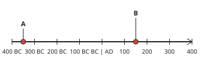
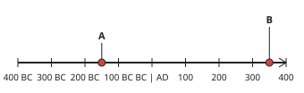
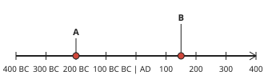

# History Form 1, Batch Y1: drafts for review (Lessons 1–10)

Generated by `npm run review:history` from `content/history/*.json`. Every question and drawing below was built by the engine.
All notes, teach cards, worked examples and paper tasks are **status: draft**. “Authored key” means a person fixed the
right answer (see `AUTHORED.md`); “computed by rule” means code worked it out (a formula, a conversion, a spelling rule).

Teach mode: cards (idea + example + 1 level-1 check) → worked example → practice (levels 1–3) → the note as a summary.

## Sample rendered lesson: Lesson 3 in teach mode

### Lesson 3: Guided work 1: Enquiry on the system of periodization (counting dates in your region)

**Card hic3-1** (draft)

> BC years count backwards: the bigger the number, the earlier the year.
>
> _500 BC is earlier than 200 BC._  

Check question: `hic3-1-check` · multiple choice, level 1 · computed by rule

> Which year is earlier: 2400 BC or 1000 BC?

- ✅ 2400 BC
- ◻️ 1000 BC  
  _↳ feedback if chosen: BC years count backwards: the bigger number is further back in time._

Full working after a second miss:

> BC years count backwards.  
> The bigger number is earlier: 2400 BC.  

**Card hic3-2** (draft)

> Between two AD dates, or two BC dates, subtract to find the years between them.
>
> _AD 1884 to AD 1961: 1961 − 1884 = 77 years._  

Check question: `hi3-ad` · number, level 1 · computed by rule, reused from practice

> How many years are there from AD 1688 to AD 1762?

Answer: **74 years**
- Typed **3450** (add) → “Both dates are AD: subtract the earlier from the later.”

Full working after a second miss:

> Both dates are AD: subtract.  
> 1762 − 1688 = 74 years.  

**Card hic3-3** (draft)

> There is no year zero. From a BC date to an AD date: add the two numbers, then take away one.
>
> _30 BC to AD 20: 30 + 20 − 1 = 49 years._  

Check question: `hic3-3-check` · multiple choice, level 1 · computed by rule

> Which year comes straight after 1 BC?

- ◻️ the year 0  
  _↳ feedback if chosen: There is no year 0: 1 BC is followed by AD 1._
- ✅ AD 1
- ◻️ 2 BC  
  _↳ feedback if chosen: That is the year before 1 BC, not after._

Full working after a second miss:

> There is no year zero.  
> 1 BC is followed by AD 1.  

**Card hic3-4** (draft)

> A century is a hundred years. A year is in the century one more than its hundreds: AD 1884 is in the 19th century AD.
>
> _AD 1961: 20th century AD._  

Check question: `hi3-century` · multiple choice, level 1 · computed by rule, reused from practice

> In which century is AD 1733?

- ✅ 18th century AD
- ◻️ 19th century AD  
  _↳ feedback if chosen: Add only one to the hundreds._
- ◻️ 17th century AD  
  _↳ feedback if chosen: The century is one more than the hundreds: 1884 is in the 19th century._
- ◻️ 18th century BC  
  _↳ feedback if chosen: This is an AD year, so the century is AD._

Full working after a second miss:

> AD 1733 has 17 full hundreds and some more years.  
> So it is in the next century: 18th century AD.  

**Worked example** (draft)

> How many years are there from 50 BC to AD 50?

1. One date is BC and the other AD: add them.
2. 50 + 50 = 100.
3. There is no year zero, so take away one: 100 − 1 = 99.

**Answer:** 99 years.

**Practice** (one generated question per template, easiest first)

Practice 1: `hi3-ad` · number, level 1 · computed by rule

> How many years are there from AD 1614 to AD 1633?

Answer: **19 years**
- Typed **3247** (add) → “Both dates are AD: subtract the earlier from the later.”

Full working after a second miss:

> Both dates are AD: subtract.  
> 1633 − 1614 = 19 years.  

Practice 2: `hi3-century` · multiple choice, level 1 · computed by rule

> In which century is AD 1442?

- ✅ 15th century AD
- ◻️ 14th century AD  
  _↳ feedback if chosen: The century is one more than the hundreds: 1884 is in the 19th century._
- ◻️ 16th century AD  
  _↳ feedback if chosen: Add only one to the hundreds._
- ◻️ 15th century BC  
  _↳ feedback if chosen: This is an AD year, so the century is AD._

Full working after a second miss:

> AD 1442 has 14 full hundreds and some more years.  
> So it is in the next century: 15th century AD.  

Practice 3: `hi3-earlier` · multiple choice, level 2 · computed by rule

> Which date is earlier: 1344 BC or AD 1273?

- ✅ 1344 BC
- ◻️ AD 1273  
  _↳ feedback if chosen: BC dates come before all AD dates, and among BC dates the bigger number is earlier._

Full working after a second miss:

> A BC date is earlier than any AD date.  
> Earlier: 1344 BC.  

Practice 4: `hi3-bc` · number, level 2 · computed by rule

> How many years are there from 1096 BC to 935 BC?

Answer: **161 years**
- Typed **2031** (add) → “Both dates are BC: subtract the smaller number from the bigger.”

Full working after a second miss:

> Both dates are BC: subtract.  
> 1096 − 935 = 161 years.  

Practice 5: `hi3-across` · number, level 3 · computed by rule

> How many years are there from 200 BC to AD 367?

Answer: **566 years**
- Typed **567** (zero) → “There is no year 0: add the two numbers, then take away 1.”
- Typed **167** (sub) → “One date is BC and one is AD: add the two numbers (then take away 1).”

Full working after a second miss:

> One date is BC and one is AD: add. 200 + 367 = 567.  
> No year zero: 567 − 1 = 566 years.  

Practice 6: `hi3-timeline` · number, level 3 · computed by rule

> On the timeline, how many years are there from event A to event B?

Answer: **499 years**
- Typed **500** (zero) → “Count across BC and AD: add, then take away 1, because there is no year 0.”

Full working after a second miss:

> A is at 350 BC and B is at AD 150.  
> 350 + 150 − 1 = 499 years.  

**Summary (the note)**

> We count years from the year given as the birth of Jesus Christ.
> • Years before it are BC (Before Christ). They count backwards: 500 BC is earlier than 200 BC.
> • Years after it are AD (Anno Domini, “in the year of the Lord”): AD 476, AD 2026.
> • There is no year 0: 1 BC is followed by AD 1.
> Years between two dates: if both are AD or both BC, subtract. If one is BC and one is AD, add them and take away 1 (no year 0).
> Centuries: a century is 100 years. AD 1 to AD 100 is the 1st century; 1801 to 1900 is the 19th century; we live in the 21st century. So 1884 is in the 19th century, one more than its first two figures.
> Some books write BCE and CE instead of BC and AD.

## All drafts

| Lesson | Title (sheet) | Status | Cards | Practice | Paper task |
|---|---|---|---|---|---|
| 1 | Introduction to the study of history | draft | 3 | 5 | — |
| 2 | Further study 1: Collection and classification of Historical Relics | draft | 3 | 5 | — |
| 3 | Guided work 1: Enquiry on the system of periodization (counting dates in your region) | draft | 4 | 6 | — |
| 4 | The Early Man and his area and of settlements | draft | 3 | 5 | — |
| 5 | continues: The way of life of the early man and its implications | draft | 3 | 5 | — |
| 6 | Guided Work 2: The myth of creation | draft | 3 | 5 | — |
| 7 | Neolithic (New Stone Age Civilization) | draft | 3 | 5 | — |
| 8 | Further study 2: Humanization | draft | 3 | 5 | — |
| 9 | Further study 3: Cameroon Civilization in the Neolithic | draft | 3 | 5 | — |
| 10 | Guided work 3: The pygmies in Cameroon | draft | 3 | 5 | — |

## Lesson 1: Introduction to the study of history

Prerequisites: none · Skill: hi1 (What history is; historical sources)

**Note** (draft)

> History is the study of the past: what people did, how they lived and why things changed. Historians work from evidence called sources.
> Kinds of sources:
> • oral sources: stories, songs, proverbs and memories passed on by word of mouth, for example by elders and griots;
> • written sources: books, letters, newspapers, records and inscriptions;
> • material (archaeological) sources: objects and remains from the past, such as tools, pottery, bones, coins and buildings.
> The time before writing is called prehistory; we learn about it mainly from material sources found by archaeologists.
> Why study history? To understand how our communities and country came to be, to learn from the past, to respect other peoples, and to keep our heritage alive.

**Card hic1-1** (draft)

> History is the study of the past, based on evidence called sources.
>
> _A historian asks: what happened, when, where, why, and how do we know?_  

Check question: `hic1-1-check` · multiple choice, level 1 · **authored key**

> What is history?

- ✅ the study of the past, based on evidence
- ◻️ the study of numbers  
  _↳ feedback if chosen: That is Mathematics._
- ◻️ the study of plants  
  _↳ feedback if chosen: That is botany, part of Biology._
- ◻️ the study of the stars  
  _↳ feedback if chosen: That is astronomy._

Full working after a second miss:

> The true statement is “the study of the past, based on evidence”.  
> “the study of numbers” is false: That is Mathematics.  
> “the study of plants” is false: That is botany, part of Biology.  
> “the study of the stars” is false: That is astronomy.  

**Card hic1-2** (draft)

> Sources can be oral (spoken), written, or material (objects and remains).
>
> _A griot’s song is oral; a diary is written; a clay pot is material._  

Check question: `hi1-source` · multiple choice, level 1 · **authored key**, reused from practice

> What kind of source is this: a story about the founding of the village, told by an elder?

- ◻️ a written source  
  _↳ feedback if chosen: Not that kind. Is it spoken, written, or an object?_
- ◻️ a material source  
  _↳ feedback if chosen: Not that kind. Is it spoken, written, or an object?_
- ✅ an oral source

Full working after a second miss:

> An oral source: a story about the founding of the village, told by an elder.  
> Answer: an oral source.  

**Card hic1-3** (draft)

> Studying history helps us understand our community, learn from the past and keep our heritage.
>
> _Knowing how a festival began helps us understand why it matters._  

Check question: `hi1-why` · multiple choice, level 1 · **authored key**, reused from practice

> Which is a good reason to study history?

- ◻️ to learn how to repair cars  
  _↳ feedback if chosen: That is mechanics._
- ✅ to respect other peoples
- ◻️ only to pass examinations  
  _↳ feedback if chosen: History is useful in life, not only for examinations._
- ◻️ to forget the past  
  _↳ feedback if chosen: History helps us remember the past._

Full working after a second miss:

> The true statement is “to respect other peoples”.  
> “to learn how to repair cars” is false: That is mechanics.  
> “only to pass examinations” is false: History is useful in life, not only for examinations.  
> “to forget the past” is false: History helps us remember the past.  

**Worked example** (draft)

> To learn how her village began, Asong listens to her grandfather’s story, reads an old letter at the mission, and looks at an old iron hoe kept by the chief. Which kind of source is each one?

1. The grandfather’s story is passed on by word of mouth: an oral source.
2. The letter is written: a written source.
3. The iron hoe is an object from the past: a material source.

**Answer:** Story: oral. Letter: written. Hoe: material.

**Practice** `hi1-source` · multiple choice, level 1 · **authored key**

> What kind of source is this: a story about the founding of the village, told by an elder?

- ✅ an oral source
- ◻️ a written source  
  _↳ feedback if chosen: Not that kind. Is it spoken, written, or an object?_
- ◻️ a material source  
  _↳ feedback if chosen: Not that kind. Is it spoken, written, or an object?_

Full working after a second miss:

> An oral source: a story about the founding of the village, told by an elder.  
> Answer: an oral source.  

> What kind of source is this: an old stone axe?

- ◻️ an oral source  
  _↳ feedback if chosen: Not that kind. Is it spoken, written, or an object?_
- ✅ a material source
- ◻️ a written source  
  _↳ feedback if chosen: Not that kind. Is it spoken, written, or an object?_

Full working after a second miss:

> A material source: an old stone axe.  
> Answer: a material source.  

**Practice** `hi1-why` · multiple choice, level 1 · **authored key**

> Which is a good reason to study history?

- ✅ to respect other peoples
- ◻️ to know exactly what will happen tomorrow  
  _↳ feedback if chosen: History studies the past; it cannot tell the future exactly._
- ◻️ to learn how to repair cars  
  _↳ feedback if chosen: That is mechanics._
- ◻️ to forget the past  
  _↳ feedback if chosen: History helps us remember the past._

Full working after a second miss:

> The true statement is “to respect other peoples”.  
> “to know exactly what will happen tomorrow” is false: History studies the past; it cannot tell the future exactly.  
> “to learn how to repair cars” is false: That is mechanics.  
> “to forget the past” is false: History helps us remember the past.  

> Which is a good reason to study history?

- ◻️ to forget the past  
  _↳ feedback if chosen: History helps us remember the past._
- ◻️ to know exactly what will happen tomorrow  
  _↳ feedback if chosen: History studies the past; it cannot tell the future exactly._
- ◻️ to learn how to repair cars  
  _↳ feedback if chosen: That is mechanics._
- ✅ to respect other peoples

Full working after a second miss:

> The true statement is “to respect other peoples”.  
> “to forget the past” is false: History helps us remember the past.  
> “to know exactly what will happen tomorrow” is false: History studies the past; it cannot tell the future exactly.  
> “to learn how to repair cars” is false: That is mechanics.  

**Practice** `hi1-sort` · matching, level 2 · **authored key**

> Sort these sources: oral, written or material?

Groups: oral · written · material
- a proverb → **oral**
- a stone axe → **material**
- a clay pot → **material**
- a stone inscription with writing → **written**
- an old letter → **written**
- a story told by an elder → **oral**

Full working after a second miss:

> The right pairs are:  
> a proverb → oral  
> a stone axe → material  
> a clay pot → material  
> a stone inscription with writing → written  
> an old letter → written  
> a story told by an elder → oral  

> Sort these sources: oral, written or material?

Groups: oral · written · material
- an old letter → **written**
- old coins → **material**
- a newspaper → **written**
- a clay pot → **material**
- a griot’s song → **oral**
- a proverb → **oral**

Full working after a second miss:

> The right pairs are:  
> an old letter → written  
> old coins → material  
> a newspaper → written  
> a clay pot → material  
> a griot’s song → oral  
> a proverb → oral  

**Practice** `hi1-prehistory` · multiple choice, level 2 · **authored key**

> Why do we learn about prehistory mainly from material sources?

- ◻️ Nobody lived in prehistoric times.  
  _↳ feedback if chosen: People lived then; they simply did not write._
- ◻️ Material sources are the easiest to read.  
  _↳ feedback if chosen: The reason is that there was no writing._
- ◻️ Oral sources are always false.  
  _↳ feedback if chosen: Oral sources are useful, but memories do not reach back that far._
- ✅ People had not yet invented writing.

Full working after a second miss:

> The true statement is “People had not yet invented writing.”.  
> “Nobody lived in prehistoric times.” is false: People lived then; they simply did not write.  
> “Material sources are the easiest to read.” is false: The reason is that there was no writing.  
> “Oral sources are always false.” is false: Oral sources are useful, but memories do not reach back that far.  

> Why do we learn about prehistory mainly from material sources?

- ✅ People had not yet invented writing.
- ◻️ Historians do not like books.  
  _↳ feedback if chosen: Books did not exist then: there was no writing._
- ◻️ Nobody lived in prehistoric times.  
  _↳ feedback if chosen: People lived then; they simply did not write._
- ◻️ Material sources are the easiest to read.  
  _↳ feedback if chosen: The reason is that there was no writing._

Full working after a second miss:

> The true statement is “People had not yet invented writing.”.  
> “Historians do not like books.” is false: Books did not exist then: there was no writing.  
> “Nobody lived in prehistoric times.” is false: People lived then; they simply did not write.  
> “Material sources are the easiest to read.” is false: The reason is that there was no writing.  

**Practice** `hi1-spot` · spot the error, level 3 · **authored key**

> One sentence is wrong. Which one?

- ✅ History is the study of the future.  
  _↳ explanation: History is the study of the past._
- ◻️ A griot’s song is an oral source.
- ◻️ Archaeologists dig up material sources.
- ◻️ Prehistory is the time before writing.

Full working after a second miss:

> The wrong statement is “History is the study of the future.”.  
> History is the study of the past.  

> One sentence is wrong. Which one?

- ◻️ A griot’s song is an oral source.
- ◻️ Archaeologists dig up material sources.
- ◻️ History studies the past using evidence.
- ✅ Oral sources are written down in books.  
  _↳ explanation: Oral sources are passed on by word of mouth._

Full working after a second miss:

> The wrong statement is “Oral sources are written down in books.”.  
> Oral sources are passed on by word of mouth.  

## Lesson 2: Further study 1: Collection and classification of Historical Relics

Prerequisites: 1 · Skill: hi2 (Historical relics)

**Note** (draft)

> A relic is an object that has survived from the past: a tool, a pot, a coin, a weapon, a piece of jewellery, a photograph, a document or a building.
> Relics help us learn how people lived. When you find or collect one:
> • ask where it was found, who used it, and how old it is;
> • handle it carefully and do not clean or break it;
> • write a label: what it is, where and when it was found, and who gave it.
> Relics can be classified:
> • by material: stone, clay, metal, wood, cloth, paper;
> • by use: farming, cooking, hunting or war, dress and decoration, money and trade, religion.
> Many relics are kept in museums, palaces and family houses. Taking them without permission or selling them harms our heritage.

**Card hic2-1** (draft)

> A relic is an object that has survived from the past, such as a tool, a pot or a coin.
>
> _An old grinding stone in a grandmother’s kitchen is a relic._  

Check question: `hi2-which` · multiple choice, level 1 · **authored key**, reused from practice

> Which of these is a historical relic?

- ◻️ a song on the radio today  
  _↳ feedback if chosen: A relic is an object from the past._
- ✅ a stone axe
- ◻️ this morning’s bread  
  _↳ feedback if chosen: A relic is an object that has survived from the past._
- ◻️ a mobile phone bought this year  
  _↳ feedback if chosen: It is new._

Full working after a second miss:

> The true statement is “a stone axe”.  
> “a song on the radio today” is false: A relic is an object from the past.  
> “this morning’s bread” is false: A relic is an object that has survived from the past.  
> “a mobile phone bought this year” is false: It is new.  

**Card hic2-2** (draft)

> Relics can be classified by material (stone, clay, metal …) or by use (farming, cooking, war …).
>
> _A spearhead is metal; it was used for hunting or war._  

Check question: `hi2-use` · matching, level 1 · **authored key**, reused from practice

> Classify these relics by their use.

Groups: farming · cooking · hunting or war
- an iron hoe → **farming**
- a spear → **hunting or war**
- a clay cooking pot → **cooking**
- a shield → **hunting or war**
- a bow and arrows → **hunting or war**
- a grinding stone → **cooking**

Full working after a second miss:

> The right pairs are:  
> an iron hoe → farming  
> a spear → hunting or war  
> a clay cooking pot → cooking  
> a shield → hunting or war  
> a bow and arrows → hunting or war  
> a grinding stone → cooking  

**Card hic2-3** (draft)

> Handle relics carefully and label them: what, where and when found, and who gave it.
>
> _A label tells the next person where the relic came from._  

Check question: `hic2-3-check` · multiple choice, level 1 · **authored key**

> What should a relic’s label say?

- ◻️ the name of the person who will buy it  
  _↳ feedback if chosen: Relics should not be sold._
- ◻️ only its price  
  _↳ feedback if chosen: A relic’s value is its history, not only its price._
- ◻️ nothing: labels are not needed  
  _↳ feedback if chosen: Without a label, its story is lost._
- ✅ what it is, where and when it was found, and who gave it

Full working after a second miss:

> The true statement is “what it is, where and when it was found, and who gave it”.  
> “the name of the person who will buy it” is false: Relics should not be sold.  
> “only its price” is false: A relic’s value is its history, not only its price.  
> “nothing: labels are not needed” is false: Without a label, its story is lost.  

**Worked example** (draft)

> Ndi’s class brings an iron hoe, a clay cooking pot and a cowrie-shell necklace. Classify each relic by its use.

1. An iron hoe was used to dig the soil: farming.
2. A clay cooking pot: cooking (the home).
3. Cowrie shells were used as money and for decoration: money and trade, or dress and decoration.

**Answer:** Hoe: farming. Pot: cooking. Necklace: money or decoration.

**Practice** `hi2-which` · multiple choice, level 1 · **authored key**

> Which of these is a historical relic?

- ◻️ a song on the radio today  
  _↳ feedback if chosen: A relic is an object from the past._
- ◻️ a mobile phone bought this year  
  _↳ feedback if chosen: It is new._
- ✅ an old iron hoe
- ◻️ a new plastic bucket  
  _↳ feedback if chosen: It is new: it does not come from the past._

Full working after a second miss:

> The true statement is “an old iron hoe”.  
> “a song on the radio today” is false: A relic is an object from the past.  
> “a mobile phone bought this year” is false: It is new.  
> “a new plastic bucket” is false: It is new: it does not come from the past.  

> Which of these is a historical relic?

- ◻️ a song on the radio today  
  _↳ feedback if chosen: A relic is an object from the past._
- ✅ an old cowrie-shell necklace
- ◻️ this morning’s bread  
  _↳ feedback if chosen: A relic is an object that has survived from the past._
- ◻️ a mobile phone bought this year  
  _↳ feedback if chosen: It is new._

Full working after a second miss:

> The true statement is “an old cowrie-shell necklace”.  
> “a song on the radio today” is false: A relic is an object from the past.  
> “this morning’s bread” is false: A relic is an object that has survived from the past.  
> “a mobile phone bought this year” is false: It is new.  

**Practice** `hi2-use` · matching, level 1 · **authored key**

> Classify these relics by their use.

Groups: farming · cooking · hunting or war
- an iron hoe → **farming**
- a grinding stone → **cooking**
- a wooden mortar → **cooking**
- a spear → **hunting or war**
- a cutlass → **farming**
- a shield → **hunting or war**

Full working after a second miss:

> The right pairs are:  
> an iron hoe → farming  
> a grinding stone → cooking  
> a wooden mortar → cooking  
> a spear → hunting or war  
> a cutlass → farming  
> a shield → hunting or war  

> Classify these relics by their use.

Groups: farming · cooking · hunting or war
- an iron hoe → **farming**
- a bow and arrows → **hunting or war**
- a spear → **hunting or war**
- a cutlass → **farming**
- a wooden mortar → **cooking**
- a clay cooking pot → **cooking**

Full working after a second miss:

> The right pairs are:  
> an iron hoe → farming  
> a bow and arrows → hunting or war  
> a spear → hunting or war  
> a cutlass → farming  
> a wooden mortar → cooking  
> a clay cooking pot → cooking  

**Practice** `hi2-material` · matching, level 2 · **authored key**

> Classify these relics by material.

Groups: stone · clay · metal
- a bronze bell → **metal**
- a clay pot → **clay**
- an iron hoe → **metal**
- a stone axe → **stone**
- a grinding stone → **stone**

Full working after a second miss:

> The right pairs are:  
> a bronze bell → metal  
> a clay pot → clay  
> an iron hoe → metal  
> a stone axe → stone  
> a grinding stone → stone  

> Classify these relics by material.

Groups: stone · clay · metal
- a bronze bell → **metal**
- an iron hoe → **metal**
- a stone axe → **stone**
- a clay pot → **clay**
- a grinding stone → **stone**

Full working after a second miss:

> The right pairs are:  
> a bronze bell → metal  
> an iron hoe → metal  
> a stone axe → stone  
> a clay pot → clay  
> a grinding stone → stone  

**Practice** `hi2-care` · multiple choice, level 2 · **authored key**

> How should you look after a relic?

- ◻️ Sell it to a visitor.  
  _↳ feedback if chosen: Selling relics loses our heritage._
- ◻️ Scrub it hard to make it look new.  
  _↳ feedback if chosen: Scrubbing can damage it._
- ◻️ Break it to see what is inside.  
  _↳ feedback if chosen: Breaking it destroys the evidence._
- ✅ Handle it carefully and keep it in a safe place.

Full working after a second miss:

> The true statement is “Handle it carefully and keep it in a safe place.”.  
> “Sell it to a visitor.” is false: Selling relics loses our heritage.  
> “Scrub it hard to make it look new.” is false: Scrubbing can damage it.  
> “Break it to see what is inside.” is false: Breaking it destroys the evidence.  

> How should you look after a relic?

- ◻️ Break it to see what is inside.  
  _↳ feedback if chosen: Breaking it destroys the evidence._
- ✅ Handle it carefully and keep it in a safe place.
- ◻️ Paint it a bright colour.  
  _↳ feedback if chosen: Paint hides the original surface._
- ◻️ Scrub it hard to make it look new.  
  _↳ feedback if chosen: Scrubbing can damage it._

Full working after a second miss:

> The true statement is “Handle it carefully and keep it in a safe place.”.  
> “Break it to see what is inside.” is false: Breaking it destroys the evidence.  
> “Paint it a bright colour.” is false: Paint hides the original surface.  
> “Scrub it hard to make it look new.” is false: Scrubbing can damage it.  

**Practice** `hi2-spot` · spot the error, level 3 · **authored key**

> One sentence is wrong. Which one?

- ◻️ Museums keep relics safe.
- ◻️ A relic is an object that has survived from the past.
- ✅ Selling relics protects our heritage.  
  _↳ explanation: Selling relics loses them from our heritage._
- ◻️ A label tells where a relic was found.

Full working after a second miss:

> The wrong statement is “Selling relics protects our heritage.”.  
> Selling relics loses them from our heritage.  

> One sentence is wrong. Which one?

- ◻️ A relic is an object that has survived from the past.
- ◻️ Museums keep relics safe.
- ◻️ Relics can be classified by their use.
- ✅ A new plastic chair is a historical relic.  
  _↳ explanation: It is new: a relic comes from the past._

Full working after a second miss:

> The wrong statement is “A new plastic chair is a historical relic.”.  
> It is new: a relic comes from the past.  

## Lesson 3: Guided work 1: Enquiry on the system of periodization (counting dates in your region)

Prerequisites: 1 · Skill: hi3 (Dates BC and AD; centuries)

**Note** (draft)

> We count years from the year given as the birth of Jesus Christ.
> • Years before it are BC (Before Christ). They count backwards: 500 BC is earlier than 200 BC.
> • Years after it are AD (Anno Domini, “in the year of the Lord”): AD 476, AD 2026.
> • There is no year 0: 1 BC is followed by AD 1.
> Years between two dates: if both are AD or both BC, subtract. If one is BC and one is AD, add them and take away 1 (no year 0).
> Centuries: a century is 100 years. AD 1 to AD 100 is the 1st century; 1801 to 1900 is the 19th century; we live in the 21st century. So 1884 is in the 19th century, one more than its first two figures.
> Some books write BCE and CE instead of BC and AD.

**Card hic3-1** (draft)

> BC years count backwards: the bigger the number, the earlier the year.
>
> _500 BC is earlier than 200 BC._  

Check question: `hic3-1-check` · multiple choice, level 1 · computed by rule

> Which year is earlier: 1700 BC or 200 BC?

- ◻️ 200 BC  
  _↳ feedback if chosen: BC years count backwards: the bigger number is further back in time._
- ✅ 1700 BC

Full working after a second miss:

> BC years count backwards.  
> The bigger number is earlier: 1700 BC.  

**Card hic3-2** (draft)

> Between two AD dates, or two BC dates, subtract to find the years between them.
>
> _AD 1884 to AD 1961: 1961 − 1884 = 77 years._  

Check question: `hi3-ad` · number, level 1 · computed by rule, reused from practice

> How many years are there from AD 1929 to AD 1937?

Answer: **8 years**
- Typed **3866** (add) → “Both dates are AD: subtract the earlier from the later.”

Full working after a second miss:

> Both dates are AD: subtract.  
> 1937 − 1929 = 8 years.  

**Card hic3-3** (draft)

> There is no year zero. From a BC date to an AD date: add the two numbers, then take away one.
>
> _30 BC to AD 20: 30 + 20 − 1 = 49 years._  

Check question: `hic3-3-check` · multiple choice, level 1 · computed by rule

> Which year comes straight after 1 BC?

- ◻️ 2 BC  
  _↳ feedback if chosen: That is the year before 1 BC, not after._
- ◻️ the year 0  
  _↳ feedback if chosen: There is no year 0: 1 BC is followed by AD 1._
- ✅ AD 1

Full working after a second miss:

> There is no year zero.  
> 1 BC is followed by AD 1.  

**Card hic3-4** (draft)

> A century is a hundred years. A year is in the century one more than its hundreds: AD 1884 is in the 19th century AD.
>
> _AD 1961: 20th century AD._  

Check question: `hi3-century` · multiple choice, level 1 · computed by rule, reused from practice

> In which century is AD 1293?

- ◻️ 14th century AD  
  _↳ feedback if chosen: Add only one to the hundreds._
- ✅ 13th century AD
- ◻️ 12th century AD  
  _↳ feedback if chosen: The century is one more than the hundreds: 1884 is in the 19th century._
- ◻️ 13th century BC  
  _↳ feedback if chosen: This is an AD year, so the century is AD._

Full working after a second miss:

> AD 1293 has 12 full hundreds and some more years.  
> So it is in the next century: 13th century AD.  

**Worked example** (draft)

> How many years are there from 50 BC to AD 50?

1. One date is BC and the other AD: add them.
2. 50 + 50 = 100.
3. There is no year zero, so take away one: 100 − 1 = 99.

**Answer:** 99 years.

**Practice** `hi3-ad` · number, level 1 · computed by rule

> How many years are there from AD 1511 to AD 1584?

Answer: **73 years**
- Typed **3095** (add) → “Both dates are AD: subtract the earlier from the later.”

Full working after a second miss:

> Both dates are AD: subtract.  
> 1584 − 1511 = 73 years.  

> How many years are there from AD 1595 to AD 1619?

Answer: **24 years**
- Typed **3214** (add) → “Both dates are AD: subtract the earlier from the later.”

Full working after a second miss:

> Both dates are AD: subtract.  
> 1619 − 1595 = 24 years.  

**Practice** `hi3-century` · multiple choice, level 1 · computed by rule

> In which century is AD 103?

- ◻️ 2nd century BC  
  _↳ feedback if chosen: This is an AD year, so the century is AD._
- ◻️ 3rd century AD  
  _↳ feedback if chosen: Add only one to the hundreds._
- ✅ 2nd century AD

Full working after a second miss:

> AD 103 has 1 full hundred and some more years.  
> So it is in the next century: 2nd century AD.  

> In which century is AD 1345?

- ◻️ 14th century BC  
  _↳ feedback if chosen: This is an AD year, so the century is AD._
- ✅ 14th century AD
- ◻️ 13th century AD  
  _↳ feedback if chosen: The century is one more than the hundreds: 1884 is in the 19th century._
- ◻️ 15th century AD  
  _↳ feedback if chosen: Add only one to the hundreds._

Full working after a second miss:

> AD 1345 has 13 full hundreds and some more years.  
> So it is in the next century: 14th century AD.  

**Practice** `hi3-earlier` · multiple choice, level 2 · computed by rule

> Which date is earlier: AD 1041 or 1005 BC?

- ◻️ AD 1041  
  _↳ feedback if chosen: BC dates come before all AD dates, and among BC dates the bigger number is earlier._
- ✅ 1005 BC

Full working after a second miss:

> A BC date is earlier than any AD date.  
> Earlier: 1005 BC.  

> Which date is earlier: AD 1665 or 2028 BC?

- ✅ 2028 BC
- ◻️ AD 1665  
  _↳ feedback if chosen: BC dates come before all AD dates, and among BC dates the bigger number is earlier._

Full working after a second miss:

> A BC date is earlier than any AD date.  
> Earlier: 2028 BC.  

**Practice** `hi3-bc` · number, level 2 · computed by rule

> How many years are there from 1140 BC to 1065 BC?

Answer: **75 years**
- Typed **2205** (add) → “Both dates are BC: subtract the smaller number from the bigger.”

Full working after a second miss:

> Both dates are BC: subtract.  
> 1140 − 1065 = 75 years.  

> How many years are there from 778 BC to 647 BC?

Answer: **131 years**
- Typed **1425** (add) → “Both dates are BC: subtract the smaller number from the bigger.”

Full working after a second miss:

> Both dates are BC: subtract.  
> 778 − 647 = 131 years.  

**Practice** `hi3-across` · number, level 3 · computed by rule

> How many years are there from 327 BC to AD 179?

Answer: **505 years**
- Typed **506** (zero) → “There is no year 0: add the two numbers, then take away 1.”
- Typed **148** (sub) → “One date is BC and one is AD: add the two numbers (then take away 1).”

Full working after a second miss:

> One date is BC and one is AD: add. 327 + 179 = 506.  
> No year zero: 506 − 1 = 505 years.  

> How many years are there from 154 BC to AD 57?

Answer: **210 years**
- Typed **211** (zero) → “There is no year 0: add the two numbers, then take away 1.”
- Typed **97** (sub) → “One date is BC and one is AD: add the two numbers (then take away 1).”

Full working after a second miss:

> One date is BC and one is AD: add. 154 + 57 = 211.  
> No year zero: 211 − 1 = 210 years.  

**Practice** `hi3-timeline` · number, level 3 · computed by rule

> On the timeline, how many years are there from event A to event B?

Answer: **499 years**
- Typed **500** (zero) → “Count across BC and AD: add, then take away 1, because there is no year 0.”

Full working after a second miss:

> A is at 150 BC and B is at AD 350.  
> 150 + 350 − 1 = 499 years.  

> On the timeline, how many years are there from event A to event B?

Answer: **349 years**
- Typed **350** (zero) → “Count across BC and AD: add, then take away 1, because there is no year 0.”

Full working after a second miss:

> A is at 200 BC and B is at AD 150.  
> 200 + 150 − 1 = 349 years.  

## Lesson 4: The Early Man and his area and of settlements

Prerequisites: 1 · Skill: hi4 (Early humans and Africa, the cradle of humankind)

**Note** (draft)

> Africa is called the cradle of humankind: the oldest fossils of human ancestors have been found there.
> Important finds (dates are estimates and differ between books):
> • Chad: Toumaï (Sahelanthropus), about 7 million years old;
> • Ethiopia: “Lucy” (Australopithecus), about 3.2 million years old;
> • Tanzania (Olduvai Gorge): Homo habilis and early stone tools;
> • Kenya: Homo erectus (the “Turkana Boy”);
> • South Africa: many fossils in caves such as Sterkfontein;
> • Morocco and Ethiopia: early Homo sapiens, about 300 000 years ago.
> Early humans lived where there was water, food and shelter: near rivers and lakes, in the savanna, and in caves and rock shelters. From Africa, humans later spread to the rest of the world.

**Card hic4-1** (draft)

> Africa is the cradle of humankind: the oldest human ancestors were found there.
>
> _“Lucy” was found in Ethiopia; Toumaï was found in Chad, Cameroon’s neighbour._  

Check question: `hi4-place` · multiple choice, level 1 · **authored key**, reused from practice

> In which country: Toumaï (Sahelanthropus) was found here?

- ◻️ Ethiopia  
  _↳ feedback if chosen: Not that country. Read the list of finds again._
- ✅ Chad
- ◻️ Kenya  
  _↳ feedback if chosen: Not that country. Read the list of finds again._
- ◻️ Tanzania  
  _↳ feedback if chosen: Not that country. Read the list of finds again._

Full working after a second miss:

> Chad: Toumaï (Sahelanthropus) was found here.  
> Answer: Chad.  

**Card hic4-2** (draft)

> Fossils are the remains of very old bones turned to stone. Their dates are estimates, so we say “about”.
>
> _Lucy lived about 3.2 million years ago._  

Check question: `hi4-fossil` · multiple choice, level 1 · **authored key**, reused from practice

> What is a fossil?

- ◻️ a story about the first people  
  _↳ feedback if chosen: That is a myth or oral tradition._
- ✅ the remains of a very old living thing, often turned to stone
- ◻️ a new kind of stone tool  
  _↳ feedback if chosen: A tool is made by people; a fossil is a remain of a living thing._
- ◻️ a kind of cave painting  
  _↳ feedback if chosen: A painting is made by people; a fossil is a remain._

Full working after a second miss:

> The true statement is “the remains of a very old living thing, often turned to stone”.  
> “a story about the first people” is false: That is a myth or oral tradition.  
> “a new kind of stone tool” is false: A tool is made by people; a fossil is a remain of a living thing.  
> “a kind of cave painting” is false: A painting is made by people; a fossil is a remain.  

**Card hic4-3** (draft)

> Early humans lived near water, in the savanna, and in caves and rock shelters.
>
> _A cave gave shelter from rain and wild animals._  

Check question: `hic4-3-check` · multiple choice, level 1 · **authored key**

> Where did early humans often live?

- ◻️ in houses of cement  
  _↳ feedback if chosen: Cement was not known._
- ◻️ on the tops of high, bare mountains  
  _↳ feedback if chosen: They needed water and food nearby._
- ◻️ in big cities  
  _↳ feedback if chosen: Cities came much later._
- ✅ near rivers and lakes

Full working after a second miss:

> The true statement is “near rivers and lakes”.  
> “in houses of cement” is false: Cement was not known.  
> “on the tops of high, bare mountains” is false: They needed water and food nearby.  
> “in big cities” is false: Cities came much later.  

**Worked example** (draft)

> Why did early humans often live near rivers and lakes?

1. People and animals need water every day.
2. Animals came to drink, so hunting was easier, and plants grew well near water.
3. So rivers and lakes gave water and food.

**Answer:** For water and food (animals to hunt and plants to gather).

**Practice** `hi4-place` · multiple choice, level 1 · **authored key**

> In which country: “Lucy” (Australopithecus) was found here?

- ✅ Ethiopia
- ◻️ Chad  
  _↳ feedback if chosen: Not that country. Read the list of finds again._
- ◻️ South Africa  
  _↳ feedback if chosen: Not that country. Read the list of finds again._
- ◻️ Tanzania  
  _↳ feedback if chosen: Not that country. Read the list of finds again._

Full working after a second miss:

> Ethiopia: “Lucy” (Australopithecus) was found here.  
> Answer: Ethiopia.  

> In which country: Olduvai Gorge, famous for Homo habilis, is here?

- ◻️ Chad  
  _↳ feedback if chosen: Not that country. Read the list of finds again._
- ◻️ Ethiopia  
  _↳ feedback if chosen: Not that country. Read the list of finds again._
- ✅ Tanzania
- ◻️ Kenya  
  _↳ feedback if chosen: Not that country. Read the list of finds again._

Full working after a second miss:

> Tanzania: Olduvai Gorge, famous for Homo habilis, is here.  
> Answer: Tanzania.  

**Practice** `hi4-fossil` · multiple choice, level 1 · **authored key**

> What is a fossil?

- ◻️ a new kind of stone tool  
  _↳ feedback if chosen: A tool is made by people; a fossil is a remain of a living thing._
- ◻️ a kind of cave painting  
  _↳ feedback if chosen: A painting is made by people; a fossil is a remain._
- ◻️ a modern skeleton in a hospital  
  _↳ feedback if chosen: Fossils are very, very old._
- ✅ the remains of a very old living thing, often turned to stone

Full working after a second miss:

> The true statement is “the remains of a very old living thing, often turned to stone”.  
> “a new kind of stone tool” is false: A tool is made by people; a fossil is a remain of a living thing.  
> “a kind of cave painting” is false: A painting is made by people; a fossil is a remain.  
> “a modern skeleton in a hospital” is false: Fossils are very, very old.  

> What is a fossil?

- ◻️ a new kind of stone tool  
  _↳ feedback if chosen: A tool is made by people; a fossil is a remain of a living thing._
- ◻️ a story about the first people  
  _↳ feedback if chosen: That is a myth or oral tradition._
- ✅ the remains of a very old living thing, often turned to stone
- ◻️ a kind of cave painting  
  _↳ feedback if chosen: A painting is made by people; a fossil is a remain._

Full working after a second miss:

> The true statement is “the remains of a very old living thing, often turned to stone”.  
> “a new kind of stone tool” is false: A tool is made by people; a fossil is a remain of a living thing.  
> “a story about the first people” is false: That is a myth or oral tradition.  
> “a kind of cave painting” is false: A painting is made by people; a fossil is a remain.  

**Practice** `hi4-cradle` · multiple choice, level 2 · **authored key**

> Why is Africa called the cradle of humankind?

- ◻️ It is the hottest continent.  
  _↳ feedback if chosen: The reason is the oldest fossils of human ancestors._
- ✅ The oldest fossils of human ancestors have been found there.
- ◻️ It is the largest continent.  
  _↳ feedback if chosen: Asia is larger. The reason is the oldest fossils._
- ◻️ All animals came from Africa.  
  _↳ feedback if chosen: The phrase is about human ancestors._

Full working after a second miss:

> The true statement is “The oldest fossils of human ancestors have been found there.”.  
> “It is the hottest continent.” is false: The reason is the oldest fossils of human ancestors.  
> “It is the largest continent.” is false: Asia is larger. The reason is the oldest fossils.  
> “All animals came from Africa.” is false: The phrase is about human ancestors.  

> Why is Africa called the cradle of humankind?

- ✅ The oldest fossils of human ancestors have been found there.
- ◻️ It is the largest continent.  
  _↳ feedback if chosen: Asia is larger. The reason is the oldest fossils._
- ◻️ It is the hottest continent.  
  _↳ feedback if chosen: The reason is the oldest fossils of human ancestors._
- ◻️ It has the most people today.  
  _↳ feedback if chosen: Asia has the most people. The reason is the oldest fossils._

Full working after a second miss:

> The true statement is “The oldest fossils of human ancestors have been found there.”.  
> “It is the largest continent.” is false: Asia is larger. The reason is the oldest fossils.  
> “It is the hottest continent.” is false: The reason is the oldest fossils of human ancestors.  
> “It has the most people today.” is false: Asia has the most people. The reason is the oldest fossils.  

**Practice** `hi4-water` · multiple choice, level 2 · **authored key**

> Why did early humans settle near rivers and lakes?

- ✅ for drinking water and food from animals and plants
- ◻️ because rivers were warm in winter  
  _↳ feedback if chosen: The reasons were water and food._
- ◻️ to build bridges  
  _↳ feedback if chosen: Bridges came much later._
- ◻️ to travel by motor boat  
  _↳ feedback if chosen: Motor boats did not exist._

Full working after a second miss:

> The true statement is “for drinking water and food from animals and plants”.  
> “because rivers were warm in winter” is false: The reasons were water and food.  
> “to build bridges” is false: Bridges came much later.  
> “to travel by motor boat” is false: Motor boats did not exist.  

> Why did early humans settle near rivers and lakes?

- ◻️ because rivers were warm in winter  
  _↳ feedback if chosen: The reasons were water and food._
- ◻️ to swim for fun  
  _↳ feedback if chosen: They needed water and food to survive._
- ✅ for drinking water and food from animals and plants
- ◻️ to travel by motor boat  
  _↳ feedback if chosen: Motor boats did not exist._

Full working after a second miss:

> The true statement is “for drinking water and food from animals and plants”.  
> “because rivers were warm in winter” is false: The reasons were water and food.  
> “to swim for fun” is false: They needed water and food to survive.  
> “to travel by motor boat” is false: Motor boats did not exist.  

**Practice** `hi4-spot` · spot the error, level 3 · **authored key**

> One sentence is wrong. Which one?

- ◻️ Fossil dates are estimates.
- ◻️ Toumaï was found in Chad.
- ◻️ “Lucy” was found in Ethiopia.
- ✅ Early humans lived far from water.  
  _↳ explanation: They lived near water._

Full working after a second miss:

> The wrong statement is “Early humans lived far from water.”.  
> They lived near water.  

> One sentence is wrong. Which one?

- ◻️ Toumaï was found in Chad.
- ◻️ Fossil dates are estimates.
- ✅ The oldest human fossils were found in Europe.  
  _↳ explanation: They were found in Africa._
- ◻️ Early humans used caves for shelter.

Full working after a second miss:

> The wrong statement is “The oldest human fossils were found in Europe.”.  
> They were found in Africa.  

## Lesson 5: continues: The way of life of the early man and its implications

Prerequisites: 4 · Skill: hi5 (The way of life of early humans)

**Note** (draft)

> Early humans (in the Old Stone Age, or Palaeolithic) lived by hunting animals, fishing and gathering wild fruits, roots, nuts and honey. They were nomads: they moved from place to place following animals and the seasons.
> They made tools from stone, bone and wood: hand axes, scrapers, spears.
> The discovery of fire was very important. Fire gave warmth and light, cooked food, kept wild animals away and helped make better tools.
> They wore animal skins, lived in small groups (bands), shared food, developed language, and painted on rock walls.
> Implications: better tools and fire gave more food and safety; working together helped groups survive; slowly people learnt more about plants and animals, which later led to farming.

**Card hic5-1** (draft)

> Early humans were hunters and gatherers, and nomads who moved with the animals and the seasons.
>
> _They gathered fruits, roots and honey, and hunted antelopes._  

Check question: `hi5-life` · multiple choice, level 1 · **authored key**, reused from practice

> How did early humans get their food?

- ◻️ by farming large fields of maize  
  _↳ feedback if chosen: Farming came later, in the New Stone Age._
- ◻️ by keeping cattle in big ranches  
  _↳ feedback if chosen: Herding came later._
- ✅ by hunting, fishing and gathering wild plants
- ◻️ by buying food in markets  
  _↳ feedback if chosen: There were no markets or money._

Full working after a second miss:

> The true statement is “by hunting, fishing and gathering wild plants”.  
> “by farming large fields of maize” is false: Farming came later, in the New Stone Age.  
> “by keeping cattle in big ranches” is false: Herding came later.  
> “by buying food in markets” is false: There were no markets or money.  

**Card hic5-2** (draft)

> They made tools of stone, bone and wood, such as hand axes and spears.
>
> _A hand axe was a stone shaped by striking it with another stone._  

Check question: `hi5-tool` · multiple choice, level 1 · **authored key**, reused from practice

> What were early humans’ tools made of?

- ◻️ iron and steel  
  _↳ feedback if chosen: Iron came much later._
- ◻️ plastic  
  _↳ feedback if chosen: Plastic is a modern material._
- ✅ stone, bone and wood
- ◻️ gold and silver  
  _↳ feedback if chosen: They used stone, bone and wood._

Full working after a second miss:

> The true statement is “stone, bone and wood”.  
> “iron and steel” is false: Iron came much later.  
> “plastic” is false: Plastic is a modern material.  
> “gold and silver” is false: They used stone, bone and wood.  

**Card hic5-3** (draft)

> Fire gave warmth, light, cooked food and protection from wild animals.
>
> _Cooked meat is softer and safer to eat._  

Check question: `hi5-fire` · multiple choice, level 1 · **authored key**, reused from practice

> Which was a use of fire for early humans?

- ◻️ charging phones  
  _↳ feedback if chosen: There was no electricity._
- ◻️ boiling water in kettles  
  _↳ feedback if chosen: There were no metal kettles._
- ✅ cooking food
- ◻️ driving machines  
  _↳ feedback if chosen: There were no machines._

Full working after a second miss:

> The true statement is “cooking food”.  
> “charging phones” is false: There was no electricity.  
> “boiling water in kettles” is false: There were no metal kettles.  
> “driving machines” is false: There were no machines.  

**Worked example** (draft)

> Give three ways in which fire changed the life of early humans.

1. Fire cooked food, making it softer, safer and easier to digest.
2. Fire gave warmth and light at night.
3. Fire kept wild animals away from the camp.

**Answer:** Cooking, warmth and light, protection from animals.

**Practice** `hi5-life` · multiple choice, level 1 · **authored key**

> How did early humans get their food?

- ◻️ by buying food in markets  
  _↳ feedback if chosen: There were no markets or money._
- ◻️ from shops in towns  
  _↳ feedback if chosen: There were no towns or shops._
- ◻️ by keeping cattle in big ranches  
  _↳ feedback if chosen: Herding came later._
- ✅ by hunting, fishing and gathering wild plants

Full working after a second miss:

> The true statement is “by hunting, fishing and gathering wild plants”.  
> “by buying food in markets” is false: There were no markets or money.  
> “from shops in towns” is false: There were no towns or shops.  
> “by keeping cattle in big ranches” is false: Herding came later.  

> How did early humans get their food?

- ◻️ from shops in towns  
  _↳ feedback if chosen: There were no towns or shops._
- ◻️ by farming large fields of maize  
  _↳ feedback if chosen: Farming came later, in the New Stone Age._
- ◻️ by keeping cattle in big ranches  
  _↳ feedback if chosen: Herding came later._
- ✅ by hunting, fishing and gathering wild plants

Full working after a second miss:

> The true statement is “by hunting, fishing and gathering wild plants”.  
> “from shops in towns” is false: There were no towns or shops.  
> “by farming large fields of maize” is false: Farming came later, in the New Stone Age.  
> “by keeping cattle in big ranches” is false: Herding came later.  

**Practice** `hi5-tool` · multiple choice, level 1 · **authored key**

> What were early humans’ tools made of?

- ◻️ iron and steel  
  _↳ feedback if chosen: Iron came much later._
- ◻️ gold and silver  
  _↳ feedback if chosen: They used stone, bone and wood._
- ◻️ glass  
  _↳ feedback if chosen: They used stone, bone and wood._
- ✅ stone, bone and wood

Full working after a second miss:

> The true statement is “stone, bone and wood”.  
> “iron and steel” is false: Iron came much later.  
> “gold and silver” is false: They used stone, bone and wood.  
> “glass” is false: They used stone, bone and wood.  

> What were early humans’ tools made of?

- ◻️ gold and silver  
  _↳ feedback if chosen: They used stone, bone and wood._
- ◻️ glass  
  _↳ feedback if chosen: They used stone, bone and wood._
- ◻️ plastic  
  _↳ feedback if chosen: Plastic is a modern material._
- ✅ stone, bone and wood

Full working after a second miss:

> The true statement is “stone, bone and wood”.  
> “gold and silver” is false: They used stone, bone and wood.  
> “glass” is false: They used stone, bone and wood.  
> “plastic” is false: Plastic is a modern material.  

**Practice** `hi5-fire` · multiple choice, level 1 · **authored key**

> Which was a use of fire for early humans?

- ◻️ boiling water in kettles  
  _↳ feedback if chosen: There were no metal kettles._
- ◻️ melting iron in factories  
  _↳ feedback if chosen: That came much later._
- ◻️ charging phones  
  _↳ feedback if chosen: There was no electricity._
- ✅ cooking food

Full working after a second miss:

> The true statement is “cooking food”.  
> “boiling water in kettles” is false: There were no metal kettles.  
> “melting iron in factories” is false: That came much later.  
> “charging phones” is false: There was no electricity.  

> Which was a use of fire for early humans?

- ✅ keeping wild animals away
- ◻️ boiling water in kettles  
  _↳ feedback if chosen: There were no metal kettles._
- ◻️ charging phones  
  _↳ feedback if chosen: There was no electricity._
- ◻️ driving machines  
  _↳ feedback if chosen: There were no machines._

Full working after a second miss:

> The true statement is “keeping wild animals away”.  
> “boiling water in kettles” is false: There were no metal kettles.  
> “charging phones” is false: There was no electricity.  
> “driving machines” is false: There were no machines.  

**Practice** `hi5-sort` · matching, level 2 · **authored key**

> Sort these: true of early humans (Old Stone Age), or only later?

Groups: early humans · only later
- stone hand axes → **early humans**
- iron tools → **only later**
- living in permanent villages → **only later**
- keeping goats and cattle → **only later**
- using fire → **early humans**
- making pottery → **only later**

Full working after a second miss:

> The right pairs are:  
> stone hand axes → early humans  
> iron tools → only later  
> living in permanent villages → only later  
> keeping goats and cattle → only later  
> using fire → early humans  
> making pottery → only later  

> Sort these: true of early humans (Old Stone Age), or only later?

Groups: early humans · only later
- iron tools → **only later**
- hunting and gathering → **early humans**
- using fire → **early humans**
- living in permanent villages → **only later**
- farming crops → **only later**
- wearing animal skins → **early humans**

Full working after a second miss:

> The right pairs are:  
> iron tools → only later  
> hunting and gathering → early humans  
> using fire → early humans  
> living in permanent villages → only later  
> farming crops → only later  
> wearing animal skins → early humans  

**Practice** `hi5-spot` · spot the error, level 3 · **authored key**

> One sentence is wrong. Which one?

- ◻️ Early humans were nomads.
- ◻️ Early humans painted on rock walls.
- ✅ Early humans lived in large towns.  
  _↳ explanation: They lived in small, moving groups._
- ◻️ Fire helped early humans cook their food.

Full working after a second miss:

> The wrong statement is “Early humans lived in large towns.”.  
> They lived in small, moving groups.  

> One sentence is wrong. Which one?

- ◻️ Fire helped early humans cook their food.
- ◻️ Early humans lived in small groups.
- ◻️ Early humans painted on rock walls.
- ✅ Early humans used iron tools.  
  _↳ explanation: They used stone, bone and wood._

Full working after a second miss:

> The wrong statement is “Early humans used iron tools.”.  
> They used stone, bone and wood.  

## Lesson 6: Guided Work 2: The myth of creation

Prerequisites: 4 · Skill: hi6 (Myths of creation as historical sources)

**Note** (draft)

> A myth is a traditional story that a people tells to explain how something began: the world, the first people, a clan, a river or a custom.
> Almost every people in the world has creation stories. They are usually passed on orally, by elders, storytellers and griots, at gatherings, ceremonies and around the fire. Religions also teach about creation: for example, the Bible and the Qur’an say that God created the world and the first humans.
> Historians study myths as sources: they show what a people believed, what they valued and how they saw their past.
> Archaeologists and scientists study human origins with other evidence: fossils, tools and remains.
> In class we respect everyone’s beliefs, and we can learn the stories of other peoples.

**Card hic6-1** (draft)

> A myth is a traditional story that explains how something began: the world, the first people, a clan or a custom.
>
> _A story about how the first ancestor came down from the sky is a creation myth._  

Check question: `hi6-what` · multiple choice, level 1 · **authored key**, reused from practice

> What is a creation myth?

- ◻️ a modern science experiment  
  _↳ feedback if chosen: A myth is a traditional story._
- ◻️ a newspaper report  
  _↳ feedback if chosen: That is a written source about recent events._
- ◻️ a map of a village  
  _↳ feedback if chosen: A myth is a story._
- ✅ a traditional story that explains how the world or the first people began

Full working after a second miss:

> The true statement is “a traditional story that explains how the world or the first people began”.  
> “a modern science experiment” is false: A myth is a traditional story.  
> “a newspaper report” is false: That is a written source about recent events.  
> “a map of a village” is false: A myth is a story.  

**Card hic6-2** (draft)

> Creation stories are usually passed on orally, by elders, storytellers and griots.
>
> _Children learn the story from their grandparents, who learnt it from theirs._  

Check question: `hi6-passed` · multiple choice, level 1 · **authored key**, reused from practice

> How are most creation myths passed on?

- ✅ orally: told by elders, storytellers and griots
- ◻️ by text message  
  _↳ feedback if chosen: They are very old: they are passed on by word of mouth._
- ◻️ by carving them on stone only  
  _↳ feedback if chosen: Most are told by word of mouth._
- ◻️ only in school textbooks  
  _↳ feedback if chosen: Most are told by word of mouth._

Full working after a second miss:

> The true statement is “orally: told by elders, storytellers and griots”.  
> “by text message” is false: They are very old: they are passed on by word of mouth.  
> “by carving them on stone only” is false: Most are told by word of mouth.  
> “only in school textbooks” is false: Most are told by word of mouth.  

**Card hic6-3** (draft)

> Historians study myths to learn what a people believed and valued. We respect everyone’s beliefs.
>
> _A myth about a sacred lake shows that the lake is important to that people._  

Check question: `hic6-3-check` · multiple choice, level 1 · **authored key**

> Why do historians study creation myths?

- ✅ to learn what a people believed and valued
- ◻️ to make fun of other people’s beliefs  
  _↳ feedback if chosen: We respect everyone’s beliefs._
- ◻️ because myths are written in old books only  
  _↳ feedback if chosen: Most myths are passed on orally._
- ◻️ to find the exact date the world began  
  _↳ feedback if chosen: Myths tell beliefs, not exact dates._

Full working after a second miss:

> The true statement is “to learn what a people believed and valued”.  
> “to make fun of other people’s beliefs” is false: We respect everyone’s beliefs.  
> “because myths are written in old books only” is false: Most myths are passed on orally.  
> “to find the exact date the world began” is false: Myths tell beliefs, not exact dates.  

**Worked example** (draft)

> An elder tells how the founder of the clan came out of a great river. What kind of source is this story, and what can a historian learn from it?

1. It is a traditional story told by word of mouth: a myth, which is an oral source.
2. It shows what the clan believes about its beginning and how important the river is to them.

**Answer:** An oral source (a myth); it shows the clan’s beliefs and values.

**Practice** `hi6-what` · multiple choice, level 1 · **authored key**

> What is a creation myth?

- ◻️ a map of a village  
  _↳ feedback if chosen: A myth is a story._
- ◻️ a fossil  
  _↳ feedback if chosen: A fossil is a remain of a living thing._
- ◻️ a newspaper report  
  _↳ feedback if chosen: That is a written source about recent events._
- ✅ a traditional story that explains how the world or the first people began

Full working after a second miss:

> The true statement is “a traditional story that explains how the world or the first people began”.  
> “a map of a village” is false: A myth is a story.  
> “a fossil” is false: A fossil is a remain of a living thing.  
> “a newspaper report” is false: That is a written source about recent events.  

> What is a creation myth?

- ◻️ a map of a village  
  _↳ feedback if chosen: A myth is a story._
- ◻️ a newspaper report  
  _↳ feedback if chosen: That is a written source about recent events._
- ◻️ a fossil  
  _↳ feedback if chosen: A fossil is a remain of a living thing._
- ✅ a traditional story that explains how the world or the first people began

Full working after a second miss:

> The true statement is “a traditional story that explains how the world or the first people began”.  
> “a map of a village” is false: A myth is a story.  
> “a newspaper report” is false: That is a written source about recent events.  
> “a fossil” is false: A fossil is a remain of a living thing.  

**Practice** `hi6-passed` · multiple choice, level 1 · **authored key**

> How are most creation myths passed on?

- ◻️ only in school textbooks  
  _↳ feedback if chosen: Most are told by word of mouth._
- ◻️ by carving them on stone only  
  _↳ feedback if chosen: Most are told by word of mouth._
- ◻️ on radio only  
  _↳ feedback if chosen: They are much older than radio._
- ✅ orally: told by elders, storytellers and griots

Full working after a second miss:

> The true statement is “orally: told by elders, storytellers and griots”.  
> “only in school textbooks” is false: Most are told by word of mouth.  
> “by carving them on stone only” is false: Most are told by word of mouth.  
> “on radio only” is false: They are much older than radio.  

> How are most creation myths passed on?

- ✅ orally: told by elders, storytellers and griots
- ◻️ on radio only  
  _↳ feedback if chosen: They are much older than radio._
- ◻️ only in school textbooks  
  _↳ feedback if chosen: Most are told by word of mouth._
- ◻️ by text message  
  _↳ feedback if chosen: They are very old: they are passed on by word of mouth._

Full working after a second miss:

> The true statement is “orally: told by elders, storytellers and griots”.  
> “on radio only” is false: They are much older than radio.  
> “only in school textbooks” is false: Most are told by word of mouth.  
> “by text message” is false: They are very old: they are passed on by word of mouth.  

**Practice** `hi6-sort` · matching, level 2 · **authored key**

> Sort these sources: a story passed on by people, or material evidence?

Groups: story passed on by people · material evidence
- a griot’s tale about the founding of the clan → **story passed on by people**
- a song about how the river was made → **story passed on by people**
- a fossil bone → **material evidence**
- the remains of an old fireplace → **material evidence**
- an elder’s story about the first ancestor → **story passed on by people**
- a stone tool dug up from the ground → **material evidence**

Full working after a second miss:

> The right pairs are:  
> a griot’s tale about the founding of the clan → story passed on by people  
> a song about how the river was made → story passed on by people  
> a fossil bone → material evidence  
> the remains of an old fireplace → material evidence  
> an elder’s story about the first ancestor → story passed on by people  
> a stone tool dug up from the ground → material evidence  

> Sort these sources: a story passed on by people, or material evidence?

Groups: story passed on by people · material evidence
- an elder’s story about the first ancestor → **story passed on by people**
- a song about how the river was made → **story passed on by people**
- the remains of an old fireplace → **material evidence**
- a fossil bone → **material evidence**
- a griot’s tale about the founding of the clan → **story passed on by people**
- a stone tool dug up from the ground → **material evidence**

Full working after a second miss:

> The right pairs are:  
> an elder’s story about the first ancestor → story passed on by people  
> a song about how the river was made → story passed on by people  
> the remains of an old fireplace → material evidence  
> a fossil bone → material evidence  
> a griot’s tale about the founding of the clan → story passed on by people  
> a stone tool dug up from the ground → material evidence  

**Practice** `hi6-respect` · multiple choice, level 2 · **authored key**

> Your friend’s family tells a creation story different from yours. What is the best thing to do?

- ◻️ tell your friend the story is stupid  
  _↳ feedback if chosen: We respect other people’s beliefs._
- ◻️ tell the teacher your friend is wrong  
  _↳ feedback if chosen: Myths tell beliefs; we listen with respect._
- ✅ listen with respect and learn about it
- ◻️ refuse to talk to your friend  
  _↳ feedback if chosen: Different beliefs are not a reason to reject a friend._

Full working after a second miss:

> The true statement is “listen with respect and learn about it”.  
> “tell your friend the story is stupid” is false: We respect other people’s beliefs.  
> “tell the teacher your friend is wrong” is false: Myths tell beliefs; we listen with respect.  
> “refuse to talk to your friend” is false: Different beliefs are not a reason to reject a friend.  

> Your friend’s family tells a creation story different from yours. What is the best thing to do?

- ◻️ laugh at the story  
  _↳ feedback if chosen: We respect other people’s beliefs._
- ◻️ refuse to talk to your friend  
  _↳ feedback if chosen: Different beliefs are not a reason to reject a friend._
- ◻️ tell the teacher your friend is wrong  
  _↳ feedback if chosen: Myths tell beliefs; we listen with respect._
- ✅ listen with respect and learn about it

Full working after a second miss:

> The true statement is “listen with respect and learn about it”.  
> “laugh at the story” is false: We respect other people’s beliefs.  
> “refuse to talk to your friend” is false: Different beliefs are not a reason to reject a friend.  
> “tell the teacher your friend is wrong” is false: Myths tell beliefs; we listen with respect.  

**Practice** `hi6-spot` · spot the error, level 3 · **authored key**

> One sentence is wrong. Which one?

- ◻️ Historians study myths to learn about beliefs.
- ✅ Historians study fossils by listening to songs.  
  _↳ explanation: Fossils are material evidence; songs are oral sources._
- ◻️ Many myths are passed on orally.
- ◻️ Almost every people has creation stories.

Full working after a second miss:

> The wrong statement is “Historians study fossils by listening to songs.”.  
> Fossils are material evidence; songs are oral sources.  

> One sentence is wrong. Which one?

- ◻️ Almost every people has creation stories.
- ◻️ Historians study myths to learn about beliefs.
- ◻️ A myth explains how something began.
- ✅ Myths are always written in newspapers.  
  _↳ explanation: Myths are usually passed on orally._

Full working after a second miss:

> The wrong statement is “Myths are always written in newspapers.”.  
> Myths are usually passed on orally.  

## Lesson 7: Neolithic (New Stone Age Civilization)

Prerequisites: 5 · Skill: hi7 (The Neolithic (New Stone Age))

**Note** (draft)

> The Neolithic, or New Stone Age, began about 10 000 years ago in the Middle East, and later in other places including Africa (the Nile valley and the Sahara, which was then greener).
> What changed (the Neolithic revolution):
> • farming: people grew crops (wheat, barley, millet, sorghum, later yams and oil palm in West and Central Africa);
> • domestication of animals: goats, sheep, cattle and dogs;
> • people settled in permanent villages;
> • polished stone tools (axes, hoes), pottery for cooking and storing, and weaving of cloth and baskets.
> Results: more food, more people, trade between villages, people with special skills (potters, weavers), and leaders and rules for villages.
> Old Stone Age: hunting, gathering, moving about, chipped stone tools. New Stone Age: farming, herding, villages, polished tools, pottery.

**Card hic7-1** (draft)

> In the New Stone Age, people began to farm crops and keep animals.
>
> _Goats, sheep and cattle were domesticated; millet and sorghum were grown._  

Check question: `hi7-sort` · matching, level 1 · **authored key**, reused from practice

> Sort these: Old Stone Age or New Stone Age?

Groups: Old Stone Age · New Stone Age
- moving from place to place → **Old Stone Age**
- living in caves and camps → **Old Stone Age**
- polished stone tools → **New Stone Age**
- hunting and gathering → **Old Stone Age**
- permanent villages → **New Stone Age**
- keeping goats and cattle → **New Stone Age**

Full working after a second miss:

> The right pairs are:  
> moving from place to place → Old Stone Age  
> living in caves and camps → Old Stone Age  
> polished stone tools → New Stone Age  
> hunting and gathering → Old Stone Age  
> permanent villages → New Stone Age  
> keeping goats and cattle → New Stone Age  

**Card hic7-2** (draft)

> Farming let people live in permanent villages, with polished stone tools and pottery.
>
> _Clay pots stored grain and water._  

Check question: `hi7-new` · multiple choice, level 1 · **authored key**, reused from practice

> Which was new in the Neolithic (New Stone Age)?

- ◻️ gathering wild fruits  
  _↳ feedback if chosen: That is older._
- ◻️ using fire  
  _↳ feedback if chosen: Fire was used long before, in the Old Stone Age._
- ◻️ hunting  
  _↳ feedback if chosen: People hunted long before._
- ✅ pottery

Full working after a second miss:

> The true statement is “pottery”.  
> “gathering wild fruits” is false: That is older.  
> “using fire” is false: Fire was used long before, in the Old Stone Age.  
> “hunting” is false: People hunted long before.  

**Card hic7-3** (draft)

> More food meant more people, trade and people with special skills such as potters and weavers.
>
> _A village with extra grain could trade it for salt or tools._  

Check question: `hic7-3-check` · multiple choice, level 1 · **authored key**

> What was a result of farming in the New Stone Age?

- ◻️ people stopped cooking  
  _↳ feedback if chosen: Pottery made cooking and storage easier._
- ◻️ everyone moved from place to place  
  _↳ feedback if chosen: Farmers stayed in one place._
- ◻️ fewer people  
  _↳ feedback if chosen: More food meant more people._
- ✅ permanent villages

Full working after a second miss:

> The true statement is “permanent villages”.  
> “people stopped cooking” is false: Pottery made cooking and storage easier.  
> “everyone moved from place to place” is false: Farmers stayed in one place.  
> “fewer people” is false: More food meant more people.  

**Worked example** (draft)

> Why could Neolithic people stay in one place, when earlier people kept moving?

1. Earlier people followed wild animals and plants, so they had to move.
2. Neolithic people grew crops and kept animals, so food was near them all year.
3. So they could build permanent villages.

**Answer:** Because farming and herding gave them food in one place.

**Practice** `hi7-sort` · matching, level 1 · **authored key**

> Sort these: Old Stone Age or New Stone Age?

Groups: Old Stone Age · New Stone Age
- polished stone tools → **New Stone Age**
- pottery → **New Stone Age**
- living in caves and camps → **Old Stone Age**
- permanent villages → **New Stone Age**
- hunting and gathering → **Old Stone Age**
- chipped stone tools → **Old Stone Age**

Full working after a second miss:

> The right pairs are:  
> polished stone tools → New Stone Age  
> pottery → New Stone Age  
> living in caves and camps → Old Stone Age  
> permanent villages → New Stone Age  
> hunting and gathering → Old Stone Age  
> chipped stone tools → Old Stone Age  

> Sort these: Old Stone Age or New Stone Age?

Groups: Old Stone Age · New Stone Age
- pottery → **New Stone Age**
- hunting and gathering → **Old Stone Age**
- farming crops → **New Stone Age**
- moving from place to place → **Old Stone Age**
- permanent villages → **New Stone Age**
- polished stone tools → **New Stone Age**

Full working after a second miss:

> The right pairs are:  
> pottery → New Stone Age  
> hunting and gathering → Old Stone Age  
> farming crops → New Stone Age  
> moving from place to place → Old Stone Age  
> permanent villages → New Stone Age  
> polished stone tools → New Stone Age  

**Practice** `hi7-new` · multiple choice, level 1 · **authored key**

> Which was new in the Neolithic (New Stone Age)?

- ◻️ hunting  
  _↳ feedback if chosen: People hunted long before._
- ◻️ gathering wild fruits  
  _↳ feedback if chosen: That is older._
- ◻️ using fire  
  _↳ feedback if chosen: Fire was used long before, in the Old Stone Age._
- ✅ pottery

Full working after a second miss:

> The true statement is “pottery”.  
> “hunting” is false: People hunted long before.  
> “gathering wild fruits” is false: That is older.  
> “using fire” is false: Fire was used long before, in the Old Stone Age.  

> Which was new in the Neolithic (New Stone Age)?

- ◻️ hunting  
  _↳ feedback if chosen: People hunted long before._
- ◻️ using fire  
  _↳ feedback if chosen: Fire was used long before, in the Old Stone Age._
- ◻️ iron tools  
  _↳ feedback if chosen: Iron came later, in the Iron Age._
- ✅ keeping animals

Full working after a second miss:

> The true statement is “keeping animals”.  
> “hunting” is false: People hunted long before.  
> “using fire” is false: Fire was used long before, in the Old Stone Age.  
> “iron tools” is false: Iron came later, in the Iron Age.  

**Practice** `hi7-why` · multiple choice, level 2 · **authored key**

> Why could Neolithic people live in permanent villages?

- ✅ Farming and herding gave them food in one place.
- ◻️ They stopped eating.  
  _↳ feedback if chosen: They grew their food._
- ◻️ Wild animals came to their houses every day.  
  _↳ feedback if chosen: They grew crops and kept animals._
- ◻️ They bought food from shops.  
  _↳ feedback if chosen: There were no shops._

Full working after a second miss:

> The true statement is “Farming and herding gave them food in one place.”.  
> “They stopped eating.” is false: They grew their food.  
> “Wild animals came to their houses every day.” is false: They grew crops and kept animals.  
> “They bought food from shops.” is false: There were no shops.  

> Why could Neolithic people live in permanent villages?

- ✅ Farming and herding gave them food in one place.
- ◻️ They had cars to fetch food.  
  _↳ feedback if chosen: There were no cars._
- ◻️ Wild animals came to their houses every day.  
  _↳ feedback if chosen: They grew crops and kept animals._
- ◻️ They bought food from shops.  
  _↳ feedback if chosen: There were no shops._

Full working after a second miss:

> The true statement is “Farming and herding gave them food in one place.”.  
> “They had cars to fetch food.” is false: There were no cars.  
> “Wild animals came to their houses every day.” is false: They grew crops and kept animals.  
> “They bought food from shops.” is false: There were no shops.  

**Practice** `hi7-when` · multiple choice, level 2 · **authored key**

> When did this begin: the first use of fire?

- ◻️ the New Stone Age (Neolithic)  
  _↳ feedback if chosen: Think: hunting and moving (Old), or farming and villages (New)?_
- ✅ the Old Stone Age (Palaeolithic)

Full working after a second miss:

> The Old Stone Age (Palaeolithic): the first use of fire.  
> Answer: the Old Stone Age (Palaeolithic).  

> When did this begin: the first permanent farming villages?

- ✅ the New Stone Age (Neolithic)
- ◻️ the Old Stone Age (Palaeolithic)  
  _↳ feedback if chosen: Think: hunting and moving (Old), or farming and villages (New)?_

Full working after a second miss:

> The New Stone Age (Neolithic): the first permanent farming villages.  
> Answer: the New Stone Age (Neolithic).  

**Practice** `hi7-spot` · spot the error, level 3 · **authored key**

> One sentence is wrong. Which one?

- ◻️ The Neolithic began about 10 000 years ago.
- ✅ Neolithic people only hunted and never farmed.  
  _↳ explanation: Farming is what makes the Neolithic new._
- ◻️ Neolithic people made pottery.
- ◻️ Neolithic people kept goats and cattle.

Full working after a second miss:

> The wrong statement is “Neolithic people only hunted and never farmed.”.  
> Farming is what makes the Neolithic new.  

> One sentence is wrong. Which one?

- ◻️ The Neolithic began about 10 000 years ago.
- ◻️ Neolithic people kept goats and cattle.
- ✅ Neolithic people only hunted and never farmed.  
  _↳ explanation: Farming is what makes the Neolithic new._
- ◻️ Farming led to permanent villages.

Full working after a second miss:

> The wrong statement is “Neolithic people only hunted and never farmed.”.  
> Farming is what makes the Neolithic new.  

## Lesson 8: Further study 2: Humanization

Prerequisites: 4 · Skill: hi8 (Humanisation: from early ancestors to modern humans)

**Note** (draft)

> Humanisation (hominisation) is the long process by which humans developed, over millions of years. Dates are estimates:
> • Sahelanthropus (Toumaï, Chad): about 7 million years ago;
> • Australopithecus (“Lucy”, Ethiopia): about 3.2 million years ago; walked upright, small brain;
> • Homo habilis (“handy man”): about 2.4 million years ago; made the first simple stone tools;
> • Homo erectus (“upright man”): about 1.9 million years ago; used fire, travelled out of Africa;
> • Homo sapiens (“wise man”): about 300 000 years ago; modern humans.
> Main changes: walking upright on two legs, freeing the hands; a bigger brain; making better tools; using fire; language; living in organised groups.

**Card hic8-1** (draft)

> Humanisation is the long change, over millions of years, from early ancestors to modern humans.
>
> _Australopithecus walked upright; Homo sapiens is us._  

Check question: `hi8-order` · ordering, level 1 · **authored key**, reused from practice

> Put these in order, oldest first.

Shown as: Homo erectus · Sahelanthropus tchadensis (Toumaï) · Homo habilis
Correct order: Sahelanthropus tchadensis (Toumaï) → Homo habilis → Homo erectus

Full working after a second miss:

> The correct order is: Sahelanthropus tchadensis (Toumaï) → Homo habilis → Homo erectus.  

**Card hic8-2** (draft)

> Homo habilis means “handy man” (first stone tools); Homo erectus “upright man” (fire); Homo sapiens “wise man”.
>
> _Homo erectus used fire about 1.9 million years ago or later._  

Check question: `hi8-name` · multiple choice, level 1 · **authored key**, reused from practice

> Which is “upright man”, who used fire?

- ◻️ Homo habilis  
  _↳ feedback if chosen: Not that one. Read what each name means._
- ✅ Homo erectus
- ◻️ Australopithecus (“Lucy”)  
  _↳ feedback if chosen: Not that one. Read what each name means._

Full working after a second miss:

> Homo erectus: “upright man”, who used fire.  
> Answer: Homo erectus.  

**Card hic8-3** (draft)

> Main changes: walking on two legs, a bigger brain, better tools, fire, language.
>
> _Walking on two legs freed the hands to carry and make tools._  

Check question: `hic8-3-check` · multiple choice, level 1 · **authored key**

> Which change happened during humanisation?

- ✅ making better tools
- ◻️ the brain becoming smaller  
  _↳ feedback if chosen: The brain became bigger._
- ◻️ losing the hands  
  _↳ feedback if chosen: The hands became more useful._
- ◻️ learning to drive  
  _↳ feedback if chosen: Cars came only recently._

Full working after a second miss:

> The true statement is “making better tools”.  
> “the brain becoming smaller” is false: The brain became bigger.  
> “losing the hands” is false: The hands became more useful.  
> “learning to drive” is false: Cars came only recently.  

**Worked example** (draft)

> Put these in order, oldest first: Homo erectus, Australopithecus, Homo sapiens.

1. Australopithecus: about 3.2 million years ago.
2. Homo erectus: about 1.9 million years ago.
3. Homo sapiens: about 300 000 years ago.

**Answer:** Australopithecus → Homo erectus → Homo sapiens.

**Practice** `hi8-order` · ordering, level 1 · **authored key**

> Put these in order, oldest first.

Shown as: Sahelanthropus tchadensis (Toumaï) · Homo erectus · Australopithecus (“Lucy”)
Correct order: Sahelanthropus tchadensis (Toumaï) → Australopithecus (“Lucy”) → Homo erectus

Full working after a second miss:

> The correct order is: Sahelanthropus tchadensis (Toumaï) → Australopithecus (“Lucy”) → Homo erectus.  

> Put these in order, oldest first.

Shown as: Australopithecus (“Lucy”) · Homo erectus · Sahelanthropus tchadensis (Toumaï)
Correct order: Sahelanthropus tchadensis (Toumaï) → Australopithecus (“Lucy”) → Homo erectus

Full working after a second miss:

> The correct order is: Sahelanthropus tchadensis (Toumaï) → Australopithecus (“Lucy”) → Homo erectus.  

**Practice** `hi8-name` · multiple choice, level 1 · **authored key**

> Which is “handy man”, the first maker of simple stone tools?

- ◻️ Australopithecus (“Lucy”)  
  _↳ feedback if chosen: Not that one. Read what each name means._
- ✅ Homo habilis
- ◻️ Homo sapiens  
  _↳ feedback if chosen: Not that one. Read what each name means._

Full working after a second miss:

> Homo habilis: “handy man”, the first maker of simple stone tools.  
> Answer: Homo habilis.  

> Which is “wise man”: modern humans?

- ◻️ Homo erectus  
  _↳ feedback if chosen: Not that one. Read what each name means._
- ◻️ Australopithecus (“Lucy”)  
  _↳ feedback if chosen: Not that one. Read what each name means._
- ✅ Homo sapiens

Full working after a second miss:

> Homo sapiens: “wise man”: modern humans.  
> Answer: Homo sapiens.  

**Practice** `hi8-older` · multiple choice, level 2 · **authored key**

> Which appeared earlier: Australopithecus (“Lucy”) or Homo erectus?

- ✅ Australopithecus (“Lucy”)
- ◻️ Homo erectus  
  _↳ feedback if chosen: That one appeared later. Compare how many years ago each lived._

Full working after a second miss:

> Australopithecus (“Lucy”): about 3.2 million years ago. Homo erectus: about 1.9 million years ago.  
> Earlier: Australopithecus (“Lucy”).  

> Which appeared earlier: Homo habilis or Sahelanthropus tchadensis (Toumaï)?

- ✅ Sahelanthropus tchadensis (Toumaï)
- ◻️ Homo habilis  
  _↳ feedback if chosen: That one appeared later. Compare how many years ago each lived._

Full working after a second miss:

> Sahelanthropus tchadensis (Toumaï): about 7 million years ago. Homo habilis: about 2.4 million years ago.  
> Earlier: Sahelanthropus tchadensis (Toumaï).  

**Practice** `hi8-when` · multiple choice, level 2 · **authored key**

> About when did Homo habilis first appear?

- ◻️ about 1.9 million years ago  
  _↳ feedback if chosen: That date belongs to a different ancestor. Oldest first: Toumaï, Lucy, Homo habilis, Homo erectus, Homo sapiens._
- ◻️ about 3.2 million years ago  
  _↳ feedback if chosen: That date belongs to a different ancestor. Oldest first: Toumaï, Lucy, Homo habilis, Homo erectus, Homo sapiens._
- ✅ about 2.4 million years ago
- ◻️ about 7 million years ago  
  _↳ feedback if chosen: That date belongs to a different ancestor. Oldest first: Toumaï, Lucy, Homo habilis, Homo erectus, Homo sapiens._

Full working after a second miss:

> Homo habilis: about 2.4 million years ago.  

> About when did Homo sapiens first appear?

- ✅ about 300 000 years ago
- ◻️ about 2.4 million years ago  
  _↳ feedback if chosen: That date belongs to a different ancestor. Oldest first: Toumaï, Lucy, Homo habilis, Homo erectus, Homo sapiens._
- ◻️ about 3.2 million years ago  
  _↳ feedback if chosen: That date belongs to a different ancestor. Oldest first: Toumaï, Lucy, Homo habilis, Homo erectus, Homo sapiens._
- ◻️ about 7 million years ago  
  _↳ feedback if chosen: That date belongs to a different ancestor. Oldest first: Toumaï, Lucy, Homo habilis, Homo erectus, Homo sapiens._

Full working after a second miss:

> Homo sapiens: about 300 000 years ago.  

**Practice** `hi8-spot` · spot the error, level 3 · **authored key**

> One sentence is wrong. Which one?

- ◻️ Homo erectus used fire.
- ◻️ Homo habilis made simple stone tools.
- ◻️ Australopithecus walked upright.
- ✅ Homo sapiens lived before Australopithecus.  
  _↳ explanation: Australopithecus is much older._

Full working after a second miss:

> The wrong statement is “Homo sapiens lived before Australopithecus.”.  
> Australopithecus is much older.  

> One sentence is wrong. Which one?

- ◻️ Homo erectus used fire.
- ◻️ Australopithecus walked upright.
- ✅ The human brain became smaller during humanisation.  
  _↳ explanation: It became bigger._
- ◻️ Homo habilis made simple stone tools.

Full working after a second miss:

> The wrong statement is “The human brain became smaller during humanisation.”.  
> It became bigger.  

## Lesson 9: Further study 3: Cameroon Civilization in the Neolithic

Prerequisites: 7 · Skill: hi9 (Cameroon in the Neolithic)

**Note** (draft)

> Archaeologists have found that people lived in what is now Cameroon for many thousands of years.
> • Shum Laka, a rock shelter near Bamenda in the North-West region, was used by people for many thousands of years. Stone tools, pottery and burials were found there.
> • Obobogo, near Yaoundé, is a village site from about 3000 years ago, with pottery, polished stone axes and the remains of oil-palm nuts.
> • Polished stone axes and hoes and pieces of old pottery have been found in many parts of the country.
> These finds show that Neolithic people in Cameroon made pottery, used polished stone tools, cleared the forest edge and grew or used crops such as oil palm and yams. Archaeologists still study these sites; their dates are estimates.

**Card hic9-1** (draft)

> Shum Laka is a rock shelter near Bamenda where people lived for many thousands of years.
>
> _Stone tools, pottery and burials were found there._  

Check question: `hi9-where` · multiple choice, level 1 · **authored key**, reused from practice

> Which site is an old village site near Yaoundé with pottery and oil-palm nuts?

- ✅ Obobogo
- ◻️ Shum Laka  
  _↳ feedback if chosen: Shum Laka is near Bamenda; Obobogo is near Yaoundé._

Full working after a second miss:

> Obobogo: an old village site near Yaoundé with pottery and oil-palm nuts.  
> Answer: Obobogo.  

**Card hic9-2** (draft)

> Obobogo, near Yaoundé, is an old village site with pottery, polished stone axes and oil-palm nuts.
>
> _It shows village life in the Neolithic._  

Check question: `hi9-find` · multiple choice, level 1 · **authored key**, reused from practice

> Which of these was found at Neolithic sites in Cameroon?

- ◻️ printed books  
  _↳ feedback if chosen: Printing is modern._
- ✅ oil-palm nuts
- ◻️ iron trains  
  _↳ feedback if chosen: Trains are modern._
- ◻️ coins of the Central African franc  
  _↳ feedback if chosen: That money is modern._

Full working after a second miss:

> The true statement is “oil-palm nuts”.  
> “printed books” is false: Printing is modern.  
> “iron trains” is false: Trains are modern.  
> “coins of the Central African franc” is false: That money is modern.  

**Card hic9-3** (draft)

> These finds show Neolithic life in Cameroon: pottery, polished stone tools and the use of crops such as oil palm.
>
> _Pieces of old pottery are clues for archaeologists._  

Check question: `hic9-3-check` · multiple choice, level 1 · **authored key**

> Who studies old sites such as Shum Laka by digging carefully?

- ✅ archaeologists
- ◻️ tailors  
  _↳ feedback if chosen: Tailors make clothes._
- ◻️ farmers  
  _↳ feedback if chosen: Farmers grow crops; archaeologists study old sites._
- ◻️ doctors  
  _↳ feedback if chosen: Doctors treat patients._

Full working after a second miss:

> The true statement is “archaeologists”.  
> “tailors” is false: Tailors make clothes.  
> “farmers” is false: Farmers grow crops; archaeologists study old sites.  
> “doctors” is false: Doctors treat patients.  

**Worked example** (draft)

> At Obobogo, archaeologists found pottery, polished stone axes and oil-palm nuts. What do these tell us about the people who lived there?

1. Pottery shows they cooked and stored food in clay pots.
2. Polished stone axes show Neolithic tools, used to clear land and cut wood.
3. Oil-palm nuts show they used, and probably grew, oil palms.

**Answer:** They were Neolithic villagers who made pottery, used polished axes and used oil palm.

**Practice** `hi9-where` · multiple choice, level 1 · **authored key**

> Which site is an old village site near Yaoundé with pottery and oil-palm nuts?

- ✅ Obobogo
- ◻️ Shum Laka  
  _↳ feedback if chosen: Shum Laka is near Bamenda; Obobogo is near Yaoundé._

Full working after a second miss:

> Obobogo: an old village site near Yaoundé with pottery and oil-palm nuts.  
> Answer: Obobogo.  

> Which site is a rock shelter near Bamenda, used by people for many thousands of years?

- ◻️ Obobogo  
  _↳ feedback if chosen: Shum Laka is near Bamenda; Obobogo is near Yaoundé._
- ✅ Shum Laka

Full working after a second miss:

> Shum Laka: a rock shelter near Bamenda, used by people for many thousands of years.  
> Answer: Shum Laka.  

**Practice** `hi9-find` · multiple choice, level 1 · **authored key**

> Which of these was found at Neolithic sites in Cameroon?

- ✅ pottery
- ◻️ plastic bottles  
  _↳ feedback if chosen: Plastic is modern._
- ◻️ coins of the Central African franc  
  _↳ feedback if chosen: That money is modern._
- ◻️ iron trains  
  _↳ feedback if chosen: Trains are modern._

Full working after a second miss:

> The true statement is “pottery”.  
> “plastic bottles” is false: Plastic is modern.  
> “coins of the Central African franc” is false: That money is modern.  
> “iron trains” is false: Trains are modern.  

> Which of these was found at Neolithic sites in Cameroon?

- ◻️ printed books  
  _↳ feedback if chosen: Printing is modern._
- ◻️ iron trains  
  _↳ feedback if chosen: Trains are modern._
- ◻️ coins of the Central African franc  
  _↳ feedback if chosen: That money is modern._
- ✅ pottery

Full working after a second miss:

> The true statement is “pottery”.  
> “printed books” is false: Printing is modern.  
> “iron trains” is false: Trains are modern.  
> “coins of the Central African franc” is false: That money is modern.  

**Practice** `hi9-show` · multiple choice, level 2 · **authored key**

> What do the pots and polished axes found in Cameroon show?

- ◻️ that the people had cars  
  _↳ feedback if chosen: There were no cars._
- ◻️ that people bought pots in shops  
  _↳ feedback if chosen: They made the pots themselves._
- ◻️ that nobody lived in Cameroon long ago  
  _↳ feedback if chosen: The finds show that people lived there._
- ✅ that Neolithic people lived there, cooking and storing food in pots and clearing land with axes

Full working after a second miss:

> The true statement is “that Neolithic people lived there, cooking and storing food in pots and clearing land with axes”.  
> “that the people had cars” is false: There were no cars.  
> “that people bought pots in shops” is false: They made the pots themselves.  
> “that nobody lived in Cameroon long ago” is false: The finds show that people lived there.  

> What do the pots and polished axes found in Cameroon show?

- ◻️ that people bought pots in shops  
  _↳ feedback if chosen: They made the pots themselves._
- ◻️ that people used electricity  
  _↳ feedback if chosen: There was no electricity._
- ◻️ that nobody lived in Cameroon long ago  
  _↳ feedback if chosen: The finds show that people lived there._
- ✅ that Neolithic people lived there, cooking and storing food in pots and clearing land with axes

Full working after a second miss:

> The true statement is “that Neolithic people lived there, cooking and storing food in pots and clearing land with axes”.  
> “that people bought pots in shops” is false: They made the pots themselves.  
> “that people used electricity” is false: There was no electricity.  
> “that nobody lived in Cameroon long ago” is false: The finds show that people lived there.  

**Practice** `hi9-sort` · matching, level 2 · **authored key**

> Sort these: evidence of Neolithic life, or modern objects?

Groups: Neolithic evidence · modern
- a metal cooking pot from the market → **modern**
- a radio → **modern**
- a plastic bucket → **modern**
- a bicycle → **modern**
- polished stone axes → **Neolithic evidence**
- stone hoes → **Neolithic evidence**

Full working after a second miss:

> The right pairs are:  
> a metal cooking pot from the market → modern  
> a radio → modern  
> a plastic bucket → modern  
> a bicycle → modern  
> polished stone axes → Neolithic evidence  
> stone hoes → Neolithic evidence  

> Sort these: evidence of Neolithic life, or modern objects?

Groups: Neolithic evidence · modern
- broken clay pots → **Neolithic evidence**
- polished stone axes → **Neolithic evidence**
- a radio → **modern**
- stone hoes → **Neolithic evidence**
- a metal cooking pot from the market → **modern**
- a plastic bucket → **modern**

Full working after a second miss:

> The right pairs are:  
> broken clay pots → Neolithic evidence  
> polished stone axes → Neolithic evidence  
> a radio → modern  
> stone hoes → Neolithic evidence  
> a metal cooking pot from the market → modern  
> a plastic bucket → modern  

**Practice** `hi9-spot` · spot the error, level 3 · **authored key**

> One sentence is wrong. Which one?

- ◻️ Pottery has been found at Neolithic sites in Cameroon.
- ✅ Obobogo is famous for its iron railway.  
  _↳ explanation: Obobogo is an old village site with pottery and stone axes._
- ◻️ Shum Laka is near Bamenda.
- ◻️ Dates of old sites are estimates.

Full working after a second miss:

> The wrong statement is “Obobogo is famous for its iron railway.”.  
> Obobogo is an old village site with pottery and stone axes.  

> One sentence is wrong. Which one?

- ◻️ Dates of old sites are estimates.
- ◻️ Shum Laka is near Bamenda.
- ✅ Shum Laka is near Maroua.  
  _↳ explanation: Shum Laka is in the North-West region, near Bamenda._
- ◻️ Pottery has been found at Neolithic sites in Cameroon.

Full working after a second miss:

> The wrong statement is “Shum Laka is near Maroua.”.  
> Shum Laka is in the North-West region, near Bamenda.  

## Lesson 10: Guided work 3: The pygmies in Cameroon

Prerequisites: 5 · Skill: hi10 (The forest peoples of Cameroon)

**Note** (draft)

> Cameroon’s forest peoples have lived in the rainforest of the south and east for a very long time. They are often called “pygmies”; many prefer to be called by their own names:
> • the Baka, in the East and South regions (the largest group);
> • the Bagyeli (also called Bakola), in the South region, near the coast;
> • the Bedzang, in the Centre region.
> Traditional way of life: hunting, fishing and gathering wild yams, fruits, nuts, mushrooms and honey; moving between forest camps of small leaf-covered huts; deep knowledge of forest plants and medicines; music, songs and dances.
> Today many live in villages beside roads, farm and trade with neighbours, and send children to school.
> Challenges: loss of forest, rights over land, and access to schools and health care. Respect for all peoples is part of being a good citizen.

**Card hic10-1** (draft)

> Cameroon’s forest peoples include the Baka, the Bagyeli (Bakola) and the Bedzang.
>
> _The Baka live in the East and South regions._  

Check question: `hi10-where` · multiple choice, level 1 · **authored key**, reused from practice

> Which forest people is this: the largest group, living in the East and South regions?

- ✅ the Baka
- ◻️ the Bedzang  
  _↳ feedback if chosen: Not that people. Read where each group lives._
- ◻️ the Bagyeli  
  _↳ feedback if chosen: Not that people. Read where each group lives._

Full working after a second miss:

> The Baka: the largest group, living in the East and South regions.  
> Answer: the Baka.  

**Card hic10-2** (draft)

> Their traditional life: hunting, fishing, gathering, forest camps, and deep knowledge of forest plants.
>
> _Honey and wild yams are gathered in the forest._  

Check question: `hi10-life` · multiple choice, level 1 · **authored key**, reused from practice

> Which is part of the traditional way of life of the forest peoples?

- ◻️ working in factories  
  _↳ feedback if chosen: Their traditional life was in the forest._
- ✅ living in forest camps of leaf-covered huts
- ◻️ fishing at sea in big ships  
  _↳ feedback if chosen: They lived in the forest._
- ◻️ herding camels  
  _↳ feedback if chosen: Camels live in deserts, not rainforests._

Full working after a second miss:

> The true statement is “living in forest camps of leaf-covered huts”.  
> “working in factories” is false: Their traditional life was in the forest.  
> “fishing at sea in big ships” is false: They lived in the forest.  
> “herding camels” is false: Camels live in deserts, not rainforests.  

**Card hic10-3** (draft)

> Today they face loss of forest, problems over land rights, and access to schools and health care.
>
> _When forests are cut down, forest peoples lose their food and medicine._  

Check question: `hic10-3-check` · multiple choice, level 1 · **authored key**

> Which is a challenge facing forest peoples today?

- ✅ rights over their land
- ◻️ too much snow  
  _↳ feedback if chosen: Cameroon’s rainforest has no snow._
- ◻️ living in the desert  
  _↳ feedback if chosen: They live in the rainforest._
- ◻️ too many trains in the forest  
  _↳ feedback if chosen: That is not a challenge they face._

Full working after a second miss:

> The true statement is “rights over their land”.  
> “too much snow” is false: Cameroon’s rainforest has no snow.  
> “living in the desert” is false: They live in the rainforest.  
> “too many trains in the forest” is false: That is not a challenge they face.  

**Worked example** (draft)

> Why do the forest peoples know so much about plants and medicines?

1. They have lived in and from the rainforest for a very long time.
2. Their food, shelter and medicine come from forest plants and animals.
3. This knowledge is passed from parents to children.

**Answer:** Because they have lived from the forest for generations and pass the knowledge on.

**Practice** `hi10-where` · multiple choice, level 1 · **authored key**

> Which forest people is this: the largest group, living in the East and South regions?

- ◻️ the Bagyeli  
  _↳ feedback if chosen: Not that people. Read where each group lives._
- ◻️ the Bedzang  
  _↳ feedback if chosen: Not that people. Read where each group lives._
- ✅ the Baka

Full working after a second miss:

> The Baka: the largest group, living in the East and South regions.  
> Answer: the Baka.  

> Which forest people is this: living in the South region, near the coast (also called Bakola)?

- ✅ the Bagyeli
- ◻️ the Baka  
  _↳ feedback if chosen: Not that people. Read where each group lives._
- ◻️ the Bedzang  
  _↳ feedback if chosen: Not that people. Read where each group lives._

Full working after a second miss:

> The Bagyeli: living in the South region, near the coast (also called Bakola).  
> Answer: the Bagyeli.  

**Practice** `hi10-life` · multiple choice, level 1 · **authored key**

> Which is part of the traditional way of life of the forest peoples?

- ✅ gathering honey and wild yams
- ◻️ growing wheat on large farms  
  _↳ feedback if chosen: Wheat is not a rainforest crop._
- ◻️ herding camels  
  _↳ feedback if chosen: Camels live in deserts, not rainforests._
- ◻️ working in factories  
  _↳ feedback if chosen: Their traditional life was in the forest._

Full working after a second miss:

> The true statement is “gathering honey and wild yams”.  
> “growing wheat on large farms” is false: Wheat is not a rainforest crop.  
> “herding camels” is false: Camels live in deserts, not rainforests.  
> “working in factories” is false: Their traditional life was in the forest.  

> Which is part of the traditional way of life of the forest peoples?

- ◻️ fishing at sea in big ships  
  _↳ feedback if chosen: They lived in the forest._
- ◻️ herding camels  
  _↳ feedback if chosen: Camels live in deserts, not rainforests._
- ◻️ working in factories  
  _↳ feedback if chosen: Their traditional life was in the forest._
- ✅ gathering honey and wild yams

Full working after a second miss:

> The true statement is “gathering honey and wild yams”.  
> “fishing at sea in big ships” is false: They lived in the forest.  
> “herding camels” is false: Camels live in deserts, not rainforests.  
> “working in factories” is false: Their traditional life was in the forest.  

**Practice** `hi10-name` · multiple choice, level 2 · **authored key**

> What is the most respectful way to speak about the forest peoples?

- ◻️ call them all by one word they may not like  
  _↳ feedback if chosen: Many prefer their own names._
- ◻️ make jokes about their height  
  _↳ feedback if chosen: Jokes about people’s bodies are disrespectful._
- ✅ call each people by its own name, such as Baka or Bagyeli
- ◻️ say they have no history  
  _↳ feedback if chosen: They have a long history in the forest._

Full working after a second miss:

> The true statement is “call each people by its own name, such as Baka or Bagyeli”.  
> “call them all by one word they may not like” is false: Many prefer their own names.  
> “make jokes about their height” is false: Jokes about people’s bodies are disrespectful.  
> “say they have no history” is false: They have a long history in the forest.  

> What is the most respectful way to speak about the forest peoples?

- ◻️ call them all by one word they may not like  
  _↳ feedback if chosen: Many prefer their own names._
- ◻️ avoid learning about them  
  _↳ feedback if chosen: Learning about other peoples builds respect._
- ✅ call each people by its own name, such as Baka or Bagyeli
- ◻️ say they have no history  
  _↳ feedback if chosen: They have a long history in the forest._

Full working after a second miss:

> The true statement is “call each people by its own name, such as Baka or Bagyeli”.  
> “call them all by one word they may not like” is false: Many prefer their own names.  
> “avoid learning about them” is false: Learning about other peoples builds respect.  
> “say they have no history” is false: They have a long history in the forest.  

**Practice** `hi10-sort` · matching, level 2 · **authored key**

> Sort these: traditional forest life, or a change of today?

Groups: traditional · change of today
- moving between forest camps → **traditional**
- loss of forest from logging → **change of today**
- gathering honey → **traditional**
- farming and trading with neighbours → **change of today**
- hunting with nets → **traditional**
- using forest medicines → **traditional**

Full working after a second miss:

> The right pairs are:  
> moving between forest camps → traditional  
> loss of forest from logging → change of today  
> gathering honey → traditional  
> farming and trading with neighbours → change of today  
> hunting with nets → traditional  
> using forest medicines → traditional  

> Sort these: traditional forest life, or a change of today?

Groups: traditional · change of today
- children going to school → **change of today**
- moving between forest camps → **traditional**
- hunting with nets → **traditional**
- farming and trading with neighbours → **change of today**
- living in villages beside roads → **change of today**
- using forest medicines → **traditional**

Full working after a second miss:

> The right pairs are:  
> children going to school → change of today  
> moving between forest camps → traditional  
> hunting with nets → traditional  
> farming and trading with neighbours → change of today  
> living in villages beside roads → change of today  
> using forest medicines → traditional  

**Practice** `hi10-spot` · spot the error, level 3 · **authored key**

> One sentence is wrong. Which one?

- ✅ The forest peoples have no history.  
  _↳ explanation: They have lived in the forest for a very long time._
- ◻️ Loss of forest is a problem for the forest peoples.
- ◻️ The Baka live in the East and South regions.
- ◻️ The Bagyeli are also called Bakola.

Full working after a second miss:

> The wrong statement is “The forest peoples have no history.”.  
> They have lived in the forest for a very long time.  

> One sentence is wrong. Which one?

- ◻️ The forest peoples know many forest medicines.
- ✅ The Baka live mainly in the Far North desert.  
  _↳ explanation: They live in the rainforest of the East and South._
- ◻️ The Baka live in the East and South regions.
- ◻️ The Bagyeli are also called Bakola.

Full working after a second miss:

> The wrong statement is “The Baka live mainly in the Far North desert.”.  
> They live in the rainforest of the East and South.  

