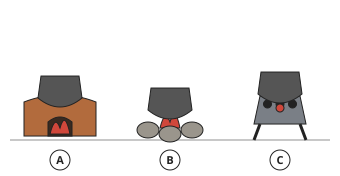
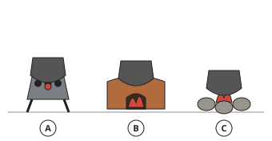
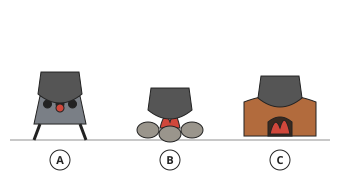
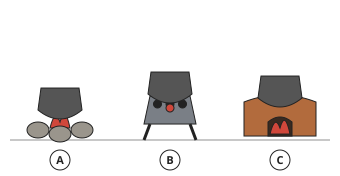
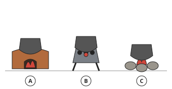
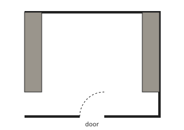
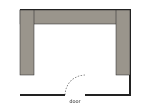
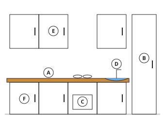
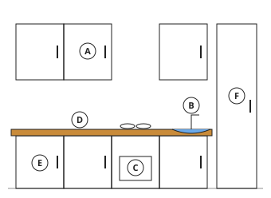
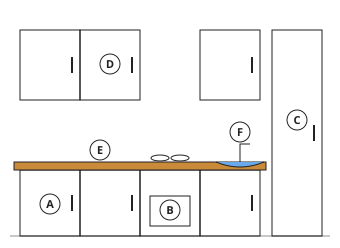

# Home Economics Form 1, Batch H1: authored answers for review

Every answer fixed by a person, not computed. Part 1: the tables, conventions and rules that computed answers come from.
Part 2: every authored question template, with all its data (keys, statements, pairs, choices and feedback) and sources.
Regenerate with `npm run review:home-economics`. Item IDs (TR-…) match `docs/teacher-review.md`.

## Part 1: the rule and drawings the answers use (src/engine/lib/homeeconomics.js)

- **Work triangle (TR-H01)**: the path sink → cooker → fridge → sink. Total = the three sides added. Well planned when every side is 1.2 m to 2.7 m and the total is 4 m to 7.9 m. The reason shown: 1.8, 2.1, 2.4 m → “it is well planned”; 3.2, 2, 2 m → “a side is too long: too much walking”; 0.9, 2, 2 m → “a side is too short: the work centres are crowded”; 2.6, 2.7, 2.7 m → “the total is too long: too much walking”; 1.2, 1.3, 1.4 m → “the total is too short: the work centres are crowded”. Practice sides run from 0.9 m to 3.2 m.
- **Drawings with lettered parts (TR-H02)**: traditional kitchen (three-stone fireplace, smoke rack, firewood store, water pot, shelf for utensils, mortar and pestle); fireplaces (three-stone fireplace, improved (mud) stove, charcoal stove); kitchen front (wall unit, base unit, tall unit, worktop, sink, cooker); kitchen shapes seen from above (one-wall (single-line), galley (corridor), L-shaped, U-shaped, island). The letters are shuffled by the question's numbers; the code that draws a letter also gives the answer.

## Part 2: authored question templates

| # | Template | Lesson | Type, level | Sources |
|---|---|---|---|---|
| 1 | `he1-match` | 1 | matching, 1 | nutrition-terms |
| 2 | `he1-which` | 1 | multiple choice, 1 | nutrition-terms |
| 3 | `he1-sort` | 1 | matching, 2 | nutrition-terms |
| 4 | `he1-hidden` | 1 | multiple choice, 2 | nutrition-terms |
| 5 | `he1-spot` | 1 | spot the error, 3 | nutrition-terms |
| 6 | `hec1-2-check` (card hec1-2) | 1 | multiple choice, 1 | nutrition-terms |
| 7 | `he2-factor` | 2 | multiple choice, 1 | health |
| 8 | `he2-sort` | 2 | matching, 1 | health |
| 9 | `he2-exercise` | 2 | multiple choice, 2 | health |
| 10 | `he2-recreation` | 2 | multiple choice, 2 | health |
| 11 | `he2-spot` | 2 | spot the error, 3 | health |
| 12 | `hec2-1-check` (card hec2-1) | 2 | multiple choice, 1 | health |
| 13 | `he3-nutrient` | 3 | matching, 1 | food-groups |
| 14 | `he3-group` | 3 | matching, 1 | food-groups |
| 15 | `he3-which` | 3 | multiple choice, 2 | food-groups |
| 16 | `he3-job` | 3 | multiple choice, 2 | food-groups |
| 17 | `he3-spot` | 3 | spot the error, 3 | food-groups |
| 18 | `hec3-3-check` (card hec3-3) | 3 | multiple choice, 1 | food-groups |
| 19 | `he4-func` | 4 | matching, 1 | food-functions |
| 20 | `he4-guide` | 4 | multiple choice, 1 | dietary-guidelines |
| 21 | `he4-advice` | 4 | multiple choice, 2 | dietary-guidelines |
| 22 | `he4-link` | 4 | matching, 2 | food-functions |
| 23 | `he4-spot` | 4 | spot the error, 3 | food-functions, dietary-guidelines |
| 24 | `hec4-3-check` (card hec4-3) | 4 | multiple choice, 1 | food-functions |
| 25 | `he5-match` | 5 | matching, 1 | careers |
| 26 | `he5-which` | 5 | multiple choice, 1 | careers |
| 27 | `he5-need` | 5 | multiple choice, 2 | careers |
| 28 | `he5-spot` | 5 | spot the error, 3 | careers |
| 29 | `hec5-3-check` (card hec5-3) | 5 | multiple choice, 1 | careers |
| 30 | `he6-part` | 6 | multiple choice, 1 | traditional-kitchen |
| 31 | `he6-letter` | 6 | multiple choice, 1 | traditional-kitchen |
| 32 | `he6-use` | 6 | multiple choice, 2 | traditional-kitchen |
| 33 | `he6-spot` | 6 | spot the error, 3 | traditional-kitchen |
| 34 | `hec6-3-check` (card hec6-3) | 6 | multiple choice, 1 | traditional-kitchen |
| 35 | `he7-match` | 7 | matching, 1 | fireplaces |
| 36 | `he7-which` | 7 | multiple choice, 1 | fireplaces |
| 37 | `he7-sort` | 7 | matching, 2 | fireplaces |
| 38 | `he7-spot` | 7 | spot the error, 3 | fireplaces |
| 39 | `hec7-3-check` (card hec7-3) | 7 | multiple choice, 1 | fireplaces |
| 40 | `he10-name` | 10 | multiple choice, 1 | fireplaces |
| 41 | `he10-find` | 10 | multiple choice, 1 | fireplaces |
| 42 | `he10-which` | 10 | multiple choice, 2 | fireplaces |
| 43 | `he10-spot` | 10 | spot the error, 3 | fireplaces |
| 44 | `hec10-3-check` (card hec10-3) | 10 | multiple choice, 1 | fireplaces |
| 45 | `he11-sort` | 11 | matching, 1 | traditional-kitchen |
| 46 | `he11-adv` | 11 | multiple choice, 2 | traditional-kitchen |
| 47 | `he11-dis` | 11 | multiple choice, 1 | traditional-kitchen |
| 48 | `he11-spot` | 11 | spot the error, 3 | traditional-kitchen |
| 49 | `hec11-3-check` (card hec11-3) | 11 | multiple choice, 1 | traditional-kitchen |
| 50 | `he12-sort` | 12 | matching, 1 | kitchen-care |
| 51 | `he12-why` | 12 | multiple choice, 2 | kitchen-care |
| 52 | `he12-best` | 12 | multiple choice, 1 | kitchen-care |
| 53 | `he12-spot` | 12 | spot the error, 3 | kitchen-care |
| 54 | `hec12-3-check` (card hec12-3) | 12 | multiple choice, 1 | kitchen-care |
| 55 | `he13-centre` | 13 | multiple choice, 1 | kitchen-planning |
| 56 | `he13-manage` | 13 | multiple choice, 2 | kitchen-planning |
| 57 | `he13-spot` | 13 | spot the error, 3 | kitchen-planning, work-triangle |
| 58 | `hec13-3-check` (card hec13-3) | 13 | multiple choice, 1 | kitchen-planning |
| 59 | `he14-shape` | 14 | multiple choice, 1 | kitchen-shapes |
| 60 | `he14-desc` | 14 | multiple choice, 1 | kitchen-shapes |
| 61 | `he14-best` | 14 | multiple choice, 2 | kitchen-shapes |
| 62 | `he14-spot` | 14 | spot the error, 3 | kitchen-shapes |
| 63 | `hec14-3-check` (card hec14-3) | 14 | multiple choice, 1 | kitchen-shapes |
| 64 | `he15-part` | 15 | multiple choice, 1 | kitchen-units |
| 65 | `he15-letter` | 15 | multiple choice, 1 | kitchen-units |
| 66 | `he15-use` | 15 | multiple choice, 2 | kitchen-units |
| 67 | `he15-spot` | 15 | spot the error, 3 | kitchen-units |
| 68 | `hec15-3-check` (card hec15-3) | 15 | multiple choice, 1 | kitchen-units |
| 69 | `he16-sort` | 16 | matching, 1 | kitchen-units |
| 70 | `he16-which` | 16 | multiple choice, 1 | kitchen-units |
| 71 | `he16-why` | 16 | multiple choice, 2 | kitchen-units |
| 72 | `he16-spot` | 16 | spot the error, 3 | kitchen-units |
| 73 | `hec16-3-check` (card hec16-3) | 16 | multiple choice, 1 | kitchen-units |
| 74 | `he17-point` | 17 | multiple choice, 1 | kitchen-planning |
| 75 | `he17-sort` | 17 | matching, 2 | kitchen-planning |
| 76 | `he17-vent` | 17 | multiple choice, 1 | kitchen-planning |
| 77 | `he17-spot` | 17 | spot the error, 3 | kitchen-planning |
| 78 | `hec17-3-check` (card hec17-3) | 17 | multiple choice, 1 | kitchen-planning |
| 79 | `he20-adv` | 20 | multiple choice, 1 | time-management |
| 80 | `he20-how` | 20 | multiple choice, 1 | time-management |
| 81 | `he20-order` | 20 | ordering, 2 | time-management |
| 82 | `he20-spot` | 20 | spot the error, 3 | time-management |
| 83 | `hec20-3-check` (card hec20-3) | 20 | multiple choice, 1 | time-management |
| 84 | `he21-sort` | 21 | matching, 1 | kitchen-care |
| 85 | `he21-why` | 21 | multiple choice, 1 | kitchen-care |
| 86 | `he21-fridge` | 21 | multiple choice, 2 | kitchen-care |
| 87 | `he21-spot` | 21 | spot the error, 3 | kitchen-care |
| 88 | `hec21-3-check` (card hec21-3) | 21 | multiple choice, 1 | kitchen-care |

### `he1-match` · Lesson 1 · matching, level 1

Prompt: Match each word with its meaning.

Pairs (4 shown each time):

- nutrition → **the way the body takes in food and uses it**
- nutrient → **a substance in food that the body needs, such as protein or a vitamin**
- diet → **the food a person usually eats**
- balanced diet → **a diet with all the nutrients in the right amounts**
- malnutrition → **bad nutrition: too little food, too much food or the wrong kinds of food**
- under-nutrition → **not getting enough food or nutrients**
- over-nutrition → **eating more food than the body needs for a long time**
- hidden hunger → **a lack of vitamins and minerals even when the stomach is full**
- metabolism → **all the chemical processes in the body that turn food into energy and body tissue**
- obesity → **being very overweight because of too much body fat**

Three generated variants:

> Match each word with its meaning.

Right-hand side (shuffled): a lack of vitamins and minerals even when the stomach is full · not getting enough food or nutrients · bad nutrition: too little food, too much food or the wrong kinds of food · a substance in food that the body needs, such as protein or a vitamin
- hidden hunger → **a lack of vitamins and minerals even when the stomach is full**
- nutrient → **a substance in food that the body needs, such as protein or a vitamin**
- under-nutrition → **not getting enough food or nutrients**
- malnutrition → **bad nutrition: too little food, too much food or the wrong kinds of food**

Full working after a second miss:

> The right pairs are:  
> hidden hunger → a lack of vitamins and minerals even when the stomach is full  
> nutrient → a substance in food that the body needs, such as protein or a vitamin  
> under-nutrition → not getting enough food or nutrients  
> malnutrition → bad nutrition: too little food, too much food or the wrong kinds of food  

> Match each word with its meaning.

Right-hand side (shuffled): a lack of vitamins and minerals even when the stomach is full · a diet with all the nutrients in the right amounts · the food a person usually eats · not getting enough food or nutrients
- diet → **the food a person usually eats**
- hidden hunger → **a lack of vitamins and minerals even when the stomach is full**
- balanced diet → **a diet with all the nutrients in the right amounts**
- under-nutrition → **not getting enough food or nutrients**

Full working after a second miss:

> The right pairs are:  
> diet → the food a person usually eats  
> hidden hunger → a lack of vitamins and minerals even when the stomach is full  
> balanced diet → a diet with all the nutrients in the right amounts  
> under-nutrition → not getting enough food or nutrients  

> Match each word with its meaning.

Right-hand side (shuffled): not getting enough food or nutrients · being very overweight because of too much body fat · all the chemical processes in the body that turn food into energy and body tissue · the way the body takes in food and uses it
- metabolism → **all the chemical processes in the body that turn food into energy and body tissue**
- obesity → **being very overweight because of too much body fat**
- under-nutrition → **not getting enough food or nutrients**
- nutrition → **the way the body takes in food and uses it**

Full working after a second miss:

> The right pairs are:  
> metabolism → all the chemical processes in the body that turn food into energy and body tissue  
> obesity → being very overweight because of too much body fat  
> under-nutrition → not getting enough food or nutrients  
> nutrition → the way the body takes in food and uses it  

Sources: nutrition-terms (Basic nutrition terms: nutrition, nutrient, diet, balanced diet, malnutrition (under- and over-nutrition, hidden hunger), metabolism, obesity, kwashiorkor, marasmus)

### `he1-which` · Lesson 1 · multiple choice, level 1

Prompt: Which word means: {x.t}?

Table `x` (one row is picked each time):

| t | a | why |
|---|---|---|
| the way the body takes in food and uses it | nutrition | Nutrition: the way the body takes in food and uses it. |
| a substance in food that the body needs, such as protein or a vitamin | nutrient | Nutrient: a substance in food that the body needs, such as protein or a vitamin. |
| the food a person usually eats | diet | Diet: the food a person usually eats. |
| a diet with all the nutrients in the right amounts | balanced diet | Balanced diet: a diet with all the nutrients in the right amounts. |
| bad nutrition: too little food, too much food or the wrong kinds of food | malnutrition | Malnutrition: bad nutrition: too little food, too much food or the wrong kinds of food. |
| not getting enough food or nutrients | under-nutrition | Under-nutrition: not getting enough food or nutrients. |
| eating more food than the body needs for a long time | over-nutrition | Over-nutrition: eating more food than the body needs for a long time. |
| a lack of vitamins and minerals even when the stomach is full | hidden hunger | Hidden hunger: a lack of vitamins and minerals even when the stomach is full. |
| all the chemical processes in the body that turn food into energy and body tissue | metabolism | Metabolism: all the chemical processes in the body that turn food into energy and body tissue. |
| being very overweight because of too much body fat | obesity | Obesity: being very overweight because of too much body fat. |

Right answer: `{x.a}`; wrong choices: `nutrition`, `nutrient`, `diet`, `balanced diet`, `malnutrition`, `under-nutrition`, `over-nutrition`, `hidden hunger`, `metabolism`, `obesity`

- Feedback `other`: “Not this word. Read the meanings again.”

Three generated variants:

> Which word means: a diet with all the nutrients in the right amounts?

- ◻️ metabolism  
  _↳ feedback if chosen: Not this word. Read the meanings again._
- ◻️ nutrition  
  _↳ feedback if chosen: Not this word. Read the meanings again._
- ✅ balanced diet
- ◻️ over-nutrition  
  _↳ feedback if chosen: Not this word. Read the meanings again._

Full working after a second miss:

> Balanced diet: a diet with all the nutrients in the right amounts.  
> Answer: balanced diet.  

> Which word means: bad nutrition: too little food, too much food or the wrong kinds of food?

- ◻️ metabolism  
  _↳ feedback if chosen: Not this word. Read the meanings again._
- ◻️ under-nutrition  
  _↳ feedback if chosen: Not this word. Read the meanings again._
- ◻️ obesity  
  _↳ feedback if chosen: Not this word. Read the meanings again._
- ✅ malnutrition

Full working after a second miss:

> Malnutrition: bad nutrition: too little food, too much food or the wrong kinds of food.  
> Answer: malnutrition.  

> Which word means: a lack of vitamins and minerals even when the stomach is full?

- ◻️ over-nutrition  
  _↳ feedback if chosen: Not this word. Read the meanings again._
- ◻️ nutrition  
  _↳ feedback if chosen: Not this word. Read the meanings again._
- ◻️ metabolism  
  _↳ feedback if chosen: Not this word. Read the meanings again._
- ✅ hidden hunger

Full working after a second miss:

> Hidden hunger: a lack of vitamins and minerals even when the stomach is full.  
> Answer: hidden hunger.  

Sources: nutrition-terms (Basic nutrition terms: nutrition, nutrient, diet, balanced diet, malnutrition (under- and over-nutrition, hidden hunger), metabolism, obesity, kwashiorkor, marasmus)

### `he1-sort` · Lesson 1 · matching, level 2

Prompt: Sort these: under-nutrition or over-nutrition?

Pairs (6 shown each time, sorted into groups):

- a very thin child who does not get enough food → **under-nutrition**
- kwashiorkor: a swollen belly from too little protein → **under-nutrition**
- marasmus: very thin from too little food → **under-nutrition**
- only one small meal a day for a long time → **under-nutrition**
- obesity → **over-nutrition**
- eating fried food and sweets every day → **over-nutrition**
- putting on too much weight → **over-nutrition**
- eating much more than the body needs → **over-nutrition**

Three generated variants:

> Sort these: under-nutrition or over-nutrition?

Groups: under-nutrition · over-nutrition
- a very thin child who does not get enough food → **under-nutrition**
- obesity → **over-nutrition**
- putting on too much weight → **over-nutrition**
- kwashiorkor: a swollen belly from too little protein → **under-nutrition**
- eating much more than the body needs → **over-nutrition**
- marasmus: very thin from too little food → **under-nutrition**

Full working after a second miss:

> The right pairs are:  
> a very thin child who does not get enough food → under-nutrition  
> obesity → over-nutrition  
> putting on too much weight → over-nutrition  
> kwashiorkor: a swollen belly from too little protein → under-nutrition  
> eating much more than the body needs → over-nutrition  
> marasmus: very thin from too little food → under-nutrition  

> Sort these: under-nutrition or over-nutrition?

Groups: under-nutrition · over-nutrition
- marasmus: very thin from too little food → **under-nutrition**
- obesity → **over-nutrition**
- putting on too much weight → **over-nutrition**
- only one small meal a day for a long time → **under-nutrition**
- eating fried food and sweets every day → **over-nutrition**
- kwashiorkor: a swollen belly from too little protein → **under-nutrition**

Full working after a second miss:

> The right pairs are:  
> marasmus: very thin from too little food → under-nutrition  
> obesity → over-nutrition  
> putting on too much weight → over-nutrition  
> only one small meal a day for a long time → under-nutrition  
> eating fried food and sweets every day → over-nutrition  
> kwashiorkor: a swollen belly from too little protein → under-nutrition  

> Sort these: under-nutrition or over-nutrition?

Groups: under-nutrition · over-nutrition
- kwashiorkor: a swollen belly from too little protein → **under-nutrition**
- eating much more than the body needs → **over-nutrition**
- only one small meal a day for a long time → **under-nutrition**
- marasmus: very thin from too little food → **under-nutrition**
- a very thin child who does not get enough food → **under-nutrition**
- putting on too much weight → **over-nutrition**

Full working after a second miss:

> The right pairs are:  
> kwashiorkor: a swollen belly from too little protein → under-nutrition  
> eating much more than the body needs → over-nutrition  
> only one small meal a day for a long time → under-nutrition  
> marasmus: very thin from too little food → under-nutrition  
> a very thin child who does not get enough food → under-nutrition  
> putting on too much weight → over-nutrition  

Sources: nutrition-terms (Basic nutrition terms: nutrition, nutrient, diet, balanced diet, malnutrition (under- and over-nutrition, hidden hunger), metabolism, obesity, kwashiorkor, marasmus)

### `he1-hidden` · Lesson 1 · multiple choice, level 2

Prompt: Which is an example of hidden hunger?

Shows 1 true and 3 false statement(s), drawn from:

- ✅ A child eats enough garri every day but no fruit or vegetables, and lacks vitamins.
- ❌ A child has nothing to eat for two days.  
  _↳ That is under-nutrition: there is too little food._
- ❌ A man eats so much that he becomes obese.  
  _↳ That is over-nutrition._
- ❌ A girl eats a balanced diet.  
  _↳ A balanced diet gives all the nutrients: no hunger._
- ❌ A boy is hungry just before lunch.  
  _↳ Feeling hungry before a meal is normal._

Three generated variants:

> Which is an example of hidden hunger?

- ◻️ A man eats so much that he becomes obese.  
  _↳ feedback if chosen: That is over-nutrition._
- ✅ A child eats enough garri every day but no fruit or vegetables, and lacks vitamins.
- ◻️ A boy is hungry just before lunch.  
  _↳ feedback if chosen: Feeling hungry before a meal is normal._
- ◻️ A girl eats a balanced diet.  
  _↳ feedback if chosen: A balanced diet gives all the nutrients: no hunger._

Full working after a second miss:

> The true statement is “A child eats enough garri every day but no fruit or vegetables, and lacks vitamins.”.  
> “A man eats so much that he becomes obese.” is false: That is over-nutrition.  
> “A boy is hungry just before lunch.” is false: Feeling hungry before a meal is normal.  
> “A girl eats a balanced diet.” is false: A balanced diet gives all the nutrients: no hunger.  

> Which is an example of hidden hunger?

- ✅ A child eats enough garri every day but no fruit or vegetables, and lacks vitamins.
- ◻️ A man eats so much that he becomes obese.  
  _↳ feedback if chosen: That is over-nutrition._
- ◻️ A boy is hungry just before lunch.  
  _↳ feedback if chosen: Feeling hungry before a meal is normal._
- ◻️ A girl eats a balanced diet.  
  _↳ feedback if chosen: A balanced diet gives all the nutrients: no hunger._

Full working after a second miss:

> The true statement is “A child eats enough garri every day but no fruit or vegetables, and lacks vitamins.”.  
> “A man eats so much that he becomes obese.” is false: That is over-nutrition.  
> “A boy is hungry just before lunch.” is false: Feeling hungry before a meal is normal.  
> “A girl eats a balanced diet.” is false: A balanced diet gives all the nutrients: no hunger.  

> Which is an example of hidden hunger?

- ◻️ A girl eats a balanced diet.  
  _↳ feedback if chosen: A balanced diet gives all the nutrients: no hunger._
- ◻️ A man eats so much that he becomes obese.  
  _↳ feedback if chosen: That is over-nutrition._
- ◻️ A child has nothing to eat for two days.  
  _↳ feedback if chosen: That is under-nutrition: there is too little food._
- ✅ A child eats enough garri every day but no fruit or vegetables, and lacks vitamins.

Full working after a second miss:

> The true statement is “A child eats enough garri every day but no fruit or vegetables, and lacks vitamins.”.  
> “A girl eats a balanced diet.” is false: A balanced diet gives all the nutrients: no hunger.  
> “A man eats so much that he becomes obese.” is false: That is over-nutrition.  
> “A child has nothing to eat for two days.” is false: That is under-nutrition: there is too little food.  

Sources: nutrition-terms (Basic nutrition terms: nutrition, nutrient, diet, balanced diet, malnutrition (under- and over-nutrition, hidden hunger), metabolism, obesity, kwashiorkor, marasmus)

### `he1-spot` · Lesson 1 · spot the error, level 3

Prompt: One sentence is wrong. Which one?

Shows 3 correct and 1 wrong statement(s), drawn from:

- ✅ A balanced diet has all the nutrients in the right amounts.
- ✅ Obesity can come from over-nutrition.
- ✅ Kwashiorkor is caused by too little protein.
- ✅ Nutrients are substances in food that the body needs.
- ✅ Hidden hunger is a lack of vitamins and minerals.
- ❌ Malnutrition only means having too little food.  
  _↳ Malnutrition also includes over-nutrition and hidden hunger._
- ❌ Metabolism is the name of a food.  
  _↳ Metabolism is the chemical processes that use food in the body._
- ❌ A person with hidden hunger always feels hungry.  
  _↳ With hidden hunger the stomach can be full; vitamins and minerals are missing._

Three generated variants:

> One sentence is wrong. Which one?

- ◻️ A balanced diet has all the nutrients in the right amounts.
- ◻️ Nutrients are substances in food that the body needs.
- ◻️ Hidden hunger is a lack of vitamins and minerals.
- ✅ A person with hidden hunger always feels hungry.  
  _↳ explanation: With hidden hunger the stomach can be full; vitamins and minerals are missing._

Full working after a second miss:

> The wrong statement is “A person with hidden hunger always feels hungry.”.  
> With hidden hunger the stomach can be full; vitamins and minerals are missing.  

> One sentence is wrong. Which one?

- ✅ Metabolism is the name of a food.  
  _↳ explanation: Metabolism is the chemical processes that use food in the body._
- ◻️ Nutrients are substances in food that the body needs.
- ◻️ Obesity can come from over-nutrition.
- ◻️ Kwashiorkor is caused by too little protein.

Full working after a second miss:

> The wrong statement is “Metabolism is the name of a food.”.  
> Metabolism is the chemical processes that use food in the body.  

> One sentence is wrong. Which one?

- ✅ A person with hidden hunger always feels hungry.  
  _↳ explanation: With hidden hunger the stomach can be full; vitamins and minerals are missing._
- ◻️ A balanced diet has all the nutrients in the right amounts.
- ◻️ Obesity can come from over-nutrition.
- ◻️ Nutrients are substances in food that the body needs.

Full working after a second miss:

> The wrong statement is “A person with hidden hunger always feels hungry.”.  
> With hidden hunger the stomach can be full; vitamins and minerals are missing.  

Sources: nutrition-terms (Basic nutrition terms: nutrition, nutrient, diet, balanced diet, malnutrition (under- and over-nutrition, hidden hunger), metabolism, obesity, kwashiorkor, marasmus)

### `hec1-2-check` · Lesson 1 · multiple choice, level 1

Prompt: Which is an example of malnutrition?

Shows 1 true and 3 false statement(s), drawn from:

- ✅ a child who is very thin because there is too little food
- ✅ a person who becomes obese from eating too much
- ✅ a child who eats enough maize but lacks vitamins
- ❌ a child who eats a balanced diet  
  _↳ A balanced diet has all the nutrients in the right amounts: that is good nutrition._
- ❌ a girl who eats fruit every day  
  _↳ Fruit gives vitamins: that is good._
- ❌ a boy who drinks clean water  
  _↳ Clean water is good for health._
- ❌ a family that eats beans, vegetables and rice  
  _↳ That is a varied, healthy meal._

Three generated variants:

> Which is an example of malnutrition?

- ◻️ a family that eats beans, vegetables and rice  
  _↳ feedback if chosen: That is a varied, healthy meal._
- ✅ a person who becomes obese from eating too much
- ◻️ a girl who eats fruit every day  
  _↳ feedback if chosen: Fruit gives vitamins: that is good._
- ◻️ a boy who drinks clean water  
  _↳ feedback if chosen: Clean water is good for health._

Full working after a second miss:

> The true statement is “a person who becomes obese from eating too much”.  
> “a family that eats beans, vegetables and rice” is false: That is a varied, healthy meal.  
> “a girl who eats fruit every day” is false: Fruit gives vitamins: that is good.  
> “a boy who drinks clean water” is false: Clean water is good for health.  

> Which is an example of malnutrition?

- ✅ a person who becomes obese from eating too much
- ◻️ a girl who eats fruit every day  
  _↳ feedback if chosen: Fruit gives vitamins: that is good._
- ◻️ a boy who drinks clean water  
  _↳ feedback if chosen: Clean water is good for health._
- ◻️ a family that eats beans, vegetables and rice  
  _↳ feedback if chosen: That is a varied, healthy meal._

Full working after a second miss:

> The true statement is “a person who becomes obese from eating too much”.  
> “a girl who eats fruit every day” is false: Fruit gives vitamins: that is good.  
> “a boy who drinks clean water” is false: Clean water is good for health.  
> “a family that eats beans, vegetables and rice” is false: That is a varied, healthy meal.  

> Which is an example of malnutrition?

- ✅ a person who becomes obese from eating too much
- ◻️ a girl who eats fruit every day  
  _↳ feedback if chosen: Fruit gives vitamins: that is good._
- ◻️ a child who eats a balanced diet  
  _↳ feedback if chosen: A balanced diet has all the nutrients in the right amounts: that is good nutrition._
- ◻️ a boy who drinks clean water  
  _↳ feedback if chosen: Clean water is good for health._

Full working after a second miss:

> The true statement is “a person who becomes obese from eating too much”.  
> “a girl who eats fruit every day” is false: Fruit gives vitamins: that is good.  
> “a child who eats a balanced diet” is false: A balanced diet has all the nutrients in the right amounts: that is good nutrition.  
> “a boy who drinks clean water” is false: Clean water is good for health.  

Sources: nutrition-terms (Basic nutrition terms: nutrition, nutrient, diet, balanced diet, malnutrition (under- and over-nutrition, hidden hunger), metabolism, obesity, kwashiorkor, marasmus)

### `he2-factor` · Lesson 2 · multiple choice, level 1

Prompt: Which health factor is this? / {x.t}

Table `x` (one row is picked each time):

| t | a | why |
|---|---|---|
| Ngozi plays football after school. | exercise | Exercise: Ngozi plays football after school. |
| Ewane goes to bed early and sleeps well. | rest and sleep | Rest and sleep: Ewane goes to bed early and sleeps well. |
| The family eats rice, beans, vegetables and fruit. | a good diet | A good diet: The family eats rice, beans, vegetables and fruit. |
| Bih sings in the choir and plays draughts at the weekend. | recreation | Recreation: Bih sings in the choir and plays draughts at the weekend. |
| Tanyi washes his hands with soap before eating. | personal hygiene | Personal hygiene: Tanyi washes his hands with soap before eating. |
| The class clears the rubbish and stagnant water around the school. | a clean environment | A clean environment: The class clears the rubbish and stagnant water around the school. |

Right answer: `{x.a}`; wrong choices: `exercise`, `rest and sleep`, `a good diet`, `recreation`, `personal hygiene`, `a clean environment`

- Feedback `other`: “Not this one. Read the situation again.”

Three generated variants:

> Which health factor is this?
> The class clears the rubbish and stagnant water around the school.

- ◻️ a good diet  
  _↳ feedback if chosen: Not this one. Read the situation again._
- ◻️ personal hygiene  
  _↳ feedback if chosen: Not this one. Read the situation again._
- ◻️ rest and sleep  
  _↳ feedback if chosen: Not this one. Read the situation again._
- ✅ a clean environment

Full working after a second miss:

> A clean environment: The class clears the rubbish and stagnant water around the school.  
> Answer: a clean environment.  

> Which health factor is this?
> Ngozi plays football after school.

- ◻️ personal hygiene  
  _↳ feedback if chosen: Not this one. Read the situation again._
- ◻️ rest and sleep  
  _↳ feedback if chosen: Not this one. Read the situation again._
- ◻️ a good diet  
  _↳ feedback if chosen: Not this one. Read the situation again._
- ✅ exercise

Full working after a second miss:

> Exercise: Ngozi plays football after school.  
> Answer: exercise.  

> Which health factor is this?
> Ewane goes to bed early and sleeps well.

- ✅ rest and sleep
- ◻️ personal hygiene  
  _↳ feedback if chosen: Not this one. Read the situation again._
- ◻️ a clean environment  
  _↳ feedback if chosen: Not this one. Read the situation again._
- ◻️ a good diet  
  _↳ feedback if chosen: Not this one. Read the situation again._

Full working after a second miss:

> Rest and sleep: Ewane goes to bed early and sleeps well.  
> Answer: rest and sleep.  

Sources: health (Health (WHO idea: physical, mental and social well-being) and the factors that support it)

### `he2-sort` · Lesson 2 · matching, level 1

Prompt: Sort these habits: good or bad for health?

Pairs (6 shown each time, sorted into groups):

- sleeping enough every night → **good for health**
- playing games with friends → **good for health**
- washing hands before eating → **good for health**
- drinking clean water → **good for health**
- walking or running often → **good for health**
- eating fruit and vegetables → **good for health**
- smoking → **bad for health**
- drinking alcohol → **bad for health**
- eating sweets all day → **bad for health**
- sleeping very late every night → **bad for health**
- leaving rubbish near the house → **bad for health**
- never doing any exercise → **bad for health**

Three generated variants:

> Sort these habits: good or bad for health?

Groups: good for health · bad for health
- washing hands before eating → **good for health**
- never doing any exercise → **bad for health**
- eating fruit and vegetables → **good for health**
- sleeping very late every night → **bad for health**
- sleeping enough every night → **good for health**
- smoking → **bad for health**

Full working after a second miss:

> The right pairs are:  
> washing hands before eating → good for health  
> never doing any exercise → bad for health  
> eating fruit and vegetables → good for health  
> sleeping very late every night → bad for health  
> sleeping enough every night → good for health  
> smoking → bad for health  

> Sort these habits: good or bad for health?

Groups: good for health · bad for health
- washing hands before eating → **good for health**
- sleeping enough every night → **good for health**
- eating sweets all day → **bad for health**
- smoking → **bad for health**
- playing games with friends → **good for health**
- drinking alcohol → **bad for health**

Full working after a second miss:

> The right pairs are:  
> washing hands before eating → good for health  
> sleeping enough every night → good for health  
> eating sweets all day → bad for health  
> smoking → bad for health  
> playing games with friends → good for health  
> drinking alcohol → bad for health  

> Sort these habits: good or bad for health?

Groups: good for health · bad for health
- leaving rubbish near the house → **bad for health**
- smoking → **bad for health**
- playing games with friends → **good for health**
- drinking clean water → **good for health**
- sleeping very late every night → **bad for health**
- sleeping enough every night → **good for health**

Full working after a second miss:

> The right pairs are:  
> leaving rubbish near the house → bad for health  
> smoking → bad for health  
> playing games with friends → good for health  
> drinking clean water → good for health  
> sleeping very late every night → bad for health  
> sleeping enough every night → good for health  

Sources: health (Health (WHO idea: physical, mental and social well-being) and the factors that support it)

### `he2-exercise` · Lesson 2 · multiple choice, level 2

Prompt: Which is a benefit of regular exercise?

Shows 1 true and 3 false statement(s), drawn from:

- ✅ It makes the heart, lungs and muscles strong.
- ✅ It helps keep a healthy weight.
- ✅ It helps you sleep well.
- ❌ It means you never need to eat.  
  _↳ Exercise uses energy: you still need good food._
- ❌ It cures all diseases.  
  _↳ Exercise helps health but does not cure every disease._
- ❌ It is only useful for footballers.  
  _↳ Everyone benefits from exercise._
- ❌ It makes you need no sleep.  
  _↳ You still need rest and sleep after exercise._

Three generated variants:

> Which is a benefit of regular exercise?

- ✅ It makes the heart, lungs and muscles strong.
- ◻️ It means you never need to eat.  
  _↳ feedback if chosen: Exercise uses energy: you still need good food._
- ◻️ It makes you need no sleep.  
  _↳ feedback if chosen: You still need rest and sleep after exercise._
- ◻️ It cures all diseases.  
  _↳ feedback if chosen: Exercise helps health but does not cure every disease._

Full working after a second miss:

> The true statement is “It makes the heart, lungs and muscles strong.”.  
> “It means you never need to eat.” is false: Exercise uses energy: you still need good food.  
> “It makes you need no sleep.” is false: You still need rest and sleep after exercise.  
> “It cures all diseases.” is false: Exercise helps health but does not cure every disease.  

> Which is a benefit of regular exercise?

- ◻️ It cures all diseases.  
  _↳ feedback if chosen: Exercise helps health but does not cure every disease._
- ◻️ It means you never need to eat.  
  _↳ feedback if chosen: Exercise uses energy: you still need good food._
- ✅ It helps keep a healthy weight.
- ◻️ It makes you need no sleep.  
  _↳ feedback if chosen: You still need rest and sleep after exercise._

Full working after a second miss:

> The true statement is “It helps keep a healthy weight.”.  
> “It cures all diseases.” is false: Exercise helps health but does not cure every disease.  
> “It means you never need to eat.” is false: Exercise uses energy: you still need good food.  
> “It makes you need no sleep.” is false: You still need rest and sleep after exercise.  

> Which is a benefit of regular exercise?

- ◻️ It cures all diseases.  
  _↳ feedback if chosen: Exercise helps health but does not cure every disease._
- ◻️ It is only useful for footballers.  
  _↳ feedback if chosen: Everyone benefits from exercise._
- ✅ It makes the heart, lungs and muscles strong.
- ◻️ It makes you need no sleep.  
  _↳ feedback if chosen: You still need rest and sleep after exercise._

Full working after a second miss:

> The true statement is “It makes the heart, lungs and muscles strong.”.  
> “It cures all diseases.” is false: Exercise helps health but does not cure every disease.  
> “It is only useful for footballers.” is false: Everyone benefits from exercise.  
> “It makes you need no sleep.” is false: You still need rest and sleep after exercise.  

Sources: health (Health (WHO idea: physical, mental and social well-being) and the factors that support it)

### `he2-recreation` · Lesson 2 · multiple choice, level 2

Prompt: Which is recreation?

Shows 1 true and 3 false statement(s), drawn from:

- ✅ playing draughts with friends
- ✅ singing in a choir
- ✅ dancing at a school party
- ✅ reading a story book for fun
- ❌ sleeping at night  
  _↳ That is rest and sleep._
- ❌ washing your clothes  
  _↳ That is personal hygiene._
- ❌ eating lunch  
  _↳ That is diet._
- ❌ taking medicine  
  _↳ That is treatment when ill._

Three generated variants:

> Which is recreation?

- ◻️ taking medicine  
  _↳ feedback if chosen: That is treatment when ill._
- ◻️ eating lunch  
  _↳ feedback if chosen: That is diet._
- ✅ playing draughts with friends
- ◻️ washing your clothes  
  _↳ feedback if chosen: That is personal hygiene._

Full working after a second miss:

> The true statement is “playing draughts with friends”.  
> “taking medicine” is false: That is treatment when ill.  
> “eating lunch” is false: That is diet.  
> “washing your clothes” is false: That is personal hygiene.  

> Which is recreation?

- ◻️ taking medicine  
  _↳ feedback if chosen: That is treatment when ill._
- ◻️ eating lunch  
  _↳ feedback if chosen: That is diet._
- ✅ reading a story book for fun
- ◻️ sleeping at night  
  _↳ feedback if chosen: That is rest and sleep._

Full working after a second miss:

> The true statement is “reading a story book for fun”.  
> “taking medicine” is false: That is treatment when ill.  
> “eating lunch” is false: That is diet.  
> “sleeping at night” is false: That is rest and sleep.  

> Which is recreation?

- ✅ playing draughts with friends
- ◻️ washing your clothes  
  _↳ feedback if chosen: That is personal hygiene._
- ◻️ taking medicine  
  _↳ feedback if chosen: That is treatment when ill._
- ◻️ eating lunch  
  _↳ feedback if chosen: That is diet._

Full working after a second miss:

> The true statement is “playing draughts with friends”.  
> “washing your clothes” is false: That is personal hygiene.  
> “taking medicine” is false: That is treatment when ill.  
> “eating lunch” is false: That is diet.  

Sources: health (Health (WHO idea: physical, mental and social well-being) and the factors that support it)

### `he2-spot` · Lesson 2 · spot the error, level 3

Prompt: One sentence is wrong. Which one?

Shows 3 correct and 1 wrong statement(s), drawn from:

- ✅ Sleep helps the body to repair itself.
- ✅ Recreation helps to reduce stress.
- ✅ Personal hygiene helps to prevent disease.
- ✅ Stagnant water near the house can breed mosquitoes.
- ✅ Exercise makes the heart stronger.
- ❌ A person who is not sick is always healthy.  
  _↳ Health also includes the mind and life with other people._
- ❌ Smoking is good for the lungs.  
  _↳ Smoking damages the lungs._
- ❌ Exercise is only for adults.  
  _↳ Children need exercise too._

Three generated variants:

> One sentence is wrong. Which one?

- ✅ Smoking is good for the lungs.  
  _↳ explanation: Smoking damages the lungs._
- ◻️ Stagnant water near the house can breed mosquitoes.
- ◻️ Sleep helps the body to repair itself.
- ◻️ Recreation helps to reduce stress.

Full working after a second miss:

> The wrong statement is “Smoking is good for the lungs.”.  
> Smoking damages the lungs.  

> One sentence is wrong. Which one?

- ◻️ Exercise makes the heart stronger.
- ✅ Smoking is good for the lungs.  
  _↳ explanation: Smoking damages the lungs._
- ◻️ Recreation helps to reduce stress.
- ◻️ Stagnant water near the house can breed mosquitoes.

Full working after a second miss:

> The wrong statement is “Smoking is good for the lungs.”.  
> Smoking damages the lungs.  

> One sentence is wrong. Which one?

- ◻️ Personal hygiene helps to prevent disease.
- ◻️ Stagnant water near the house can breed mosquitoes.
- ✅ Smoking is good for the lungs.  
  _↳ explanation: Smoking damages the lungs._
- ◻️ Exercise makes the heart stronger.

Full working after a second miss:

> The wrong statement is “Smoking is good for the lungs.”.  
> Smoking damages the lungs.  

Sources: health (Health (WHO idea: physical, mental and social well-being) and the factors that support it)

### `hec2-1-check` · Lesson 2 · multiple choice, level 1

Prompt: What does “health” mean?

Shows 1 true and 3 false statement(s), drawn from:

- ✅ being well in body, mind and life with others, not only free from disease
- ❌ never going to the hospital  
  _↳ Health is more than that: it includes the mind and life with others._
- ❌ being very strong  
  _↳ Strength is only one part of health._
- ❌ eating a lot of food  
  _↳ Too much food can cause obesity._
- ❌ being rich  
  _↳ Money does not make a person healthy._

Three generated variants:

> What does “health” mean?

- ◻️ being very strong  
  _↳ feedback if chosen: Strength is only one part of health._
- ✅ being well in body, mind and life with others, not only free from disease
- ◻️ never going to the hospital  
  _↳ feedback if chosen: Health is more than that: it includes the mind and life with others._
- ◻️ being rich  
  _↳ feedback if chosen: Money does not make a person healthy._

Full working after a second miss:

> The true statement is “being well in body, mind and life with others, not only free from disease”.  
> “being very strong” is false: Strength is only one part of health.  
> “never going to the hospital” is false: Health is more than that: it includes the mind and life with others.  
> “being rich” is false: Money does not make a person healthy.  

> What does “health” mean?

- ◻️ being rich  
  _↳ feedback if chosen: Money does not make a person healthy._
- ◻️ never going to the hospital  
  _↳ feedback if chosen: Health is more than that: it includes the mind and life with others._
- ◻️ eating a lot of food  
  _↳ feedback if chosen: Too much food can cause obesity._
- ✅ being well in body, mind and life with others, not only free from disease

Full working after a second miss:

> The true statement is “being well in body, mind and life with others, not only free from disease”.  
> “being rich” is false: Money does not make a person healthy.  
> “never going to the hospital” is false: Health is more than that: it includes the mind and life with others.  
> “eating a lot of food” is false: Too much food can cause obesity.  

> What does “health” mean?

- ◻️ eating a lot of food  
  _↳ feedback if chosen: Too much food can cause obesity._
- ◻️ being rich  
  _↳ feedback if chosen: Money does not make a person healthy._
- ◻️ never going to the hospital  
  _↳ feedback if chosen: Health is more than that: it includes the mind and life with others._
- ✅ being well in body, mind and life with others, not only free from disease

Full working after a second miss:

> The true statement is “being well in body, mind and life with others, not only free from disease”.  
> “eating a lot of food” is false: Too much food can cause obesity.  
> “being rich” is false: Money does not make a person healthy.  
> “never going to the hospital” is false: Health is more than that: it includes the mind and life with others.  

Sources: health (Health (WHO idea: physical, mental and social well-being) and the factors that support it)

### `he3-nutrient` · Lesson 3 · matching, level 1

Prompt: Match each food with the main nutrient it gives.

Pairs (3 shown each time):

- rice → **carbohydrates**
- maize → **carbohydrates**
- cassava → **carbohydrates**
- yams → **carbohydrates**
- plantains → **carbohydrates**
- bread → **carbohydrates**
- beans → **proteins**
- eggs → **proteins**
- fish → **proteins**
- meat → **proteins**
- groundnuts → **proteins**
- palm oil → **fats and oils**
- groundnut oil → **fats and oils**
- butter → **fats and oils**
- oranges → **vitamins**
- mangoes → **vitamins**
- pawpaw → **vitamins**
- carrots → **vitamins**
- huckleberry (njama njama) → **vitamins**

Three generated variants:

> Match each food with the main nutrient it gives.

Right-hand side (shuffled): carbohydrates · vitamins · proteins
- meat → **proteins**
- carrots → **vitamins**
- maize → **carbohydrates**

Full working after a second miss:

> The right pairs are:  
> meat → proteins  
> carrots → vitamins  
> maize → carbohydrates  

> Match each food with the main nutrient it gives.

Right-hand side (shuffled): proteins · vitamins · carbohydrates
- eggs → **proteins**
- bread → **carbohydrates**
- mangoes → **vitamins**

Full working after a second miss:

> The right pairs are:  
> eggs → proteins  
> bread → carbohydrates  
> mangoes → vitamins  

> Match each food with the main nutrient it gives.

Right-hand side (shuffled): proteins · fats and oils · vitamins
- mangoes → **vitamins**
- groundnuts → **proteins**
- palm oil → **fats and oils**

Full working after a second miss:

> The right pairs are:  
> mangoes → vitamins  
> groundnuts → proteins  
> palm oil → fats and oils  

Sources: food-groups (Nutrients and the three food groups (energy-giving, body-building, protective); water and fibre)

### `he3-group` · Lesson 3 · matching, level 1

Prompt: Sort these foods into food groups.

Pairs (6 shown each time, sorted into groups):

- rice → **energy-giving**
- maize → **energy-giving**
- cassava → **energy-giving**
- yams → **energy-giving**
- plantains → **energy-giving**
- bread → **energy-giving**
- palm oil → **energy-giving**
- groundnut oil → **energy-giving**
- butter → **energy-giving**
- beans → **body-building**
- eggs → **body-building**
- fish → **body-building**
- meat → **body-building**
- groundnuts → **body-building**
- oranges → **protective**
- mangoes → **protective**
- pawpaw → **protective**
- carrots → **protective**
- huckleberry (njama njama) → **protective**

Three generated variants:

> Sort these foods into food groups.

Groups: energy-giving · body-building
- bread → **energy-giving**
- yams → **energy-giving**
- beans → **body-building**
- cassava → **energy-giving**
- palm oil → **energy-giving**
- maize → **energy-giving**

Full working after a second miss:

> The right pairs are:  
> bread → energy-giving  
> yams → energy-giving  
> beans → body-building  
> cassava → energy-giving  
> palm oil → energy-giving  
> maize → energy-giving  

> Sort these foods into food groups.

Groups: energy-giving · body-building · protective
- yams → **energy-giving**
- beans → **body-building**
- bread → **energy-giving**
- mangoes → **protective**
- cassava → **energy-giving**
- fish → **body-building**

Full working after a second miss:

> The right pairs are:  
> yams → energy-giving  
> beans → body-building  
> bread → energy-giving  
> mangoes → protective  
> cassava → energy-giving  
> fish → body-building  

> Sort these foods into food groups.

Groups: energy-giving · body-building
- cassava → **energy-giving**
- maize → **energy-giving**
- yams → **energy-giving**
- rice → **energy-giving**
- plantains → **energy-giving**
- fish → **body-building**

Full working after a second miss:

> The right pairs are:  
> cassava → energy-giving  
> maize → energy-giving  
> yams → energy-giving  
> rice → energy-giving  
> plantains → energy-giving  
> fish → body-building  

Sources: food-groups (Nutrients and the three food groups (energy-giving, body-building, protective); water and fibre)

### `he3-which` · Lesson 3 · multiple choice, level 2

Prompt: Which nutrient is {x.t} rich in?

Table `x` (one row is picked each time):

| t | a | why |
|---|---|---|
| rice | carbohydrates | Rice is rich in carbohydrates. |
| maize | carbohydrates | Maize is rich in carbohydrates. |
| cassava | carbohydrates | Cassava is rich in carbohydrates. |
| yams | carbohydrates | Yams is rich in carbohydrates. |
| plantains | carbohydrates | Plantains is rich in carbohydrates. |
| bread | carbohydrates | Bread is rich in carbohydrates. |
| beans | proteins | Beans is rich in proteins. |
| eggs | proteins | Eggs is rich in proteins. |
| fish | proteins | Fish is rich in proteins. |
| meat | proteins | Meat is rich in proteins. |
| groundnuts | proteins | Groundnuts is rich in proteins. |
| palm oil | fats and oils | Palm oil is rich in fats and oils. |
| groundnut oil | fats and oils | Groundnut oil is rich in fats and oils. |
| butter | fats and oils | Butter is rich in fats and oils. |
| oranges | vitamins | Oranges is rich in vitamins. |
| mangoes | vitamins | Mangoes is rich in vitamins. |
| pawpaw | vitamins | Pawpaw is rich in vitamins. |
| carrots | vitamins | Carrots is rich in vitamins. |
| huckleberry (njama njama) | vitamins | Huckleberry (njama njama) is rich in vitamins. |

Right answer: `{x.a}`; wrong choices: `carbohydrates`, `proteins`, `fats and oils`, `vitamins`

- Feedback `other`: “Not the main one. Think: does this food give energy, build the body, or protect it?”

Three generated variants:

> Which nutrient is pawpaw rich in?

- ◻️ proteins  
  _↳ feedback if chosen: Not the main one. Think: does this food give energy, build the body, or protect it?_
- ◻️ fats and oils  
  _↳ feedback if chosen: Not the main one. Think: does this food give energy, build the body, or protect it?_
- ✅ vitamins
- ◻️ carbohydrates  
  _↳ feedback if chosen: Not the main one. Think: does this food give energy, build the body, or protect it?_

Full working after a second miss:

> Pawpaw is rich in vitamins.  
> Answer: vitamins.  

> Which nutrient is bread rich in?

- ◻️ fats and oils  
  _↳ feedback if chosen: Not the main one. Think: does this food give energy, build the body, or protect it?_
- ✅ carbohydrates
- ◻️ vitamins  
  _↳ feedback if chosen: Not the main one. Think: does this food give energy, build the body, or protect it?_
- ◻️ proteins  
  _↳ feedback if chosen: Not the main one. Think: does this food give energy, build the body, or protect it?_

Full working after a second miss:

> Bread is rich in carbohydrates.  
> Answer: carbohydrates.  

> Which nutrient is groundnuts rich in?

- ✅ proteins
- ◻️ fats and oils  
  _↳ feedback if chosen: Not the main one. Think: does this food give energy, build the body, or protect it?_
- ◻️ vitamins  
  _↳ feedback if chosen: Not the main one. Think: does this food give energy, build the body, or protect it?_
- ◻️ carbohydrates  
  _↳ feedback if chosen: Not the main one. Think: does this food give energy, build the body, or protect it?_

Full working after a second miss:

> Groundnuts is rich in proteins.  
> Answer: proteins.  

Sources: food-groups (Nutrients and the three food groups (energy-giving, body-building, protective); water and fibre)

### `he3-job` · Lesson 3 · multiple choice, level 2

Prompt: Which nutrient helps to {x.t}?

Table `x` (one row is picked each time):

| t | a | why |
|---|---|---|
| give the body energy | carbohydrates | Carbohydrates: give the body energy. |
| build and repair the body | proteins | Proteins: build and repair the body. |
| give energy and keep the body warm | fats and oils | Fats and oils: give energy and keep the body warm. |
| protect the body against disease | vitamins | Vitamins: protect the body against disease. |
| build strong bones and teeth, and make blood | minerals | Minerals: build strong bones and teeth, and make blood. |
| help food move through the gut | fibre (roughage) | Fibre (roughage): help food move through the gut. |
| carry nutrients round the body and cool it | water | Water: carry nutrients round the body and cool it. |

Right answer: `{x.a}`; wrong choices: `carbohydrates`, `proteins`, `fats and oils`, `vitamins`, `minerals`, `fibre (roughage)`, `water`

- Feedback `other`: “That nutrient has a different job.”

Three generated variants:

> Which nutrient helps to build strong bones and teeth, and make blood?

- ◻️ vitamins  
  _↳ feedback if chosen: That nutrient has a different job._
- ◻️ proteins  
  _↳ feedback if chosen: That nutrient has a different job._
- ✅ minerals
- ◻️ carbohydrates  
  _↳ feedback if chosen: That nutrient has a different job._

Full working after a second miss:

> Minerals: build strong bones and teeth, and make blood.  
> Answer: minerals.  

> Which nutrient helps to protect the body against disease?

- ◻️ fats and oils  
  _↳ feedback if chosen: That nutrient has a different job._
- ◻️ minerals  
  _↳ feedback if chosen: That nutrient has a different job._
- ✅ vitamins
- ◻️ carbohydrates  
  _↳ feedback if chosen: That nutrient has a different job._

Full working after a second miss:

> Vitamins: protect the body against disease.  
> Answer: vitamins.  

> Which nutrient helps to build and repair the body?

- ◻️ carbohydrates  
  _↳ feedback if chosen: That nutrient has a different job._
- ✅ proteins
- ◻️ water  
  _↳ feedback if chosen: That nutrient has a different job._
- ◻️ fats and oils  
  _↳ feedback if chosen: That nutrient has a different job._

Full working after a second miss:

> Proteins: build and repair the body.  
> Answer: proteins.  

Sources: food-groups (Nutrients and the three food groups (energy-giving, body-building, protective); water and fibre)

### `he3-spot` · Lesson 3 · spot the error, level 3

Prompt: One sentence is wrong. Which one?

Shows 3 correct and 1 wrong statement(s), drawn from:

- ✅ Beans are a body-building food.
- ✅ Oranges are a protective food.
- ✅ Palm oil is an energy-giving food.
- ✅ Rice is rich in carbohydrates.
- ✅ Fish is rich in proteins.
- ❌ Cassava is a body-building food.  
  _↳ Cassava is mostly carbohydrate: an energy-giving food._
- ❌ Mangoes are rich in proteins.  
  _↳ Mangoes are rich in vitamins: a protective food._
- ❌ Vitamins give us most of our energy.  
  _↳ Carbohydrates, fats and oils give energy; vitamins protect the body._

Three generated variants:

> One sentence is wrong. Which one?

- ✅ Vitamins give us most of our energy.  
  _↳ explanation: Carbohydrates, fats and oils give energy; vitamins protect the body._
- ◻️ Oranges are a protective food.
- ◻️ Palm oil is an energy-giving food.
- ◻️ Fish is rich in proteins.

Full working after a second miss:

> The wrong statement is “Vitamins give us most of our energy.”.  
> Carbohydrates, fats and oils give energy; vitamins protect the body.  

> One sentence is wrong. Which one?

- ◻️ Oranges are a protective food.
- ◻️ Fish is rich in proteins.
- ✅ Mangoes are rich in proteins.  
  _↳ explanation: Mangoes are rich in vitamins: a protective food._
- ◻️ Palm oil is an energy-giving food.

Full working after a second miss:

> The wrong statement is “Mangoes are rich in proteins.”.  
> Mangoes are rich in vitamins: a protective food.  

> One sentence is wrong. Which one?

- ◻️ Oranges are a protective food.
- ◻️ Rice is rich in carbohydrates.
- ✅ Vitamins give us most of our energy.  
  _↳ explanation: Carbohydrates, fats and oils give energy; vitamins protect the body._
- ◻️ Fish is rich in proteins.

Full working after a second miss:

> The wrong statement is “Vitamins give us most of our energy.”.  
> Carbohydrates, fats and oils give energy; vitamins protect the body.  

Sources: food-groups (Nutrients and the three food groups (energy-giving, body-building, protective); water and fibre)

### `hec3-3-check` · Lesson 3 · multiple choice, level 1

Prompt: Why does the body need fibre (roughage)?

Shows 1 true and 3 false statement(s), drawn from:

- ✅ It helps food move through the gut.
- ❌ It builds muscles.  
  _↳ Proteins build and repair the body._
- ❌ It gives most of our energy.  
  _↳ Carbohydrates, fats and oils give energy._
- ❌ It makes blood.  
  _↳ Minerals such as iron help make blood._
- ❌ It keeps the body warm.  
  _↳ Fats and oils help keep the body warm._

Three generated variants:

> Why does the body need fibre (roughage)?

- ◻️ It makes blood.  
  _↳ feedback if chosen: Minerals such as iron help make blood._
- ◻️ It keeps the body warm.  
  _↳ feedback if chosen: Fats and oils help keep the body warm._
- ◻️ It builds muscles.  
  _↳ feedback if chosen: Proteins build and repair the body._
- ✅ It helps food move through the gut.

Full working after a second miss:

> The true statement is “It helps food move through the gut.”.  
> “It makes blood.” is false: Minerals such as iron help make blood.  
> “It keeps the body warm.” is false: Fats and oils help keep the body warm.  
> “It builds muscles.” is false: Proteins build and repair the body.  

> Why does the body need fibre (roughage)?

- ◻️ It keeps the body warm.  
  _↳ feedback if chosen: Fats and oils help keep the body warm._
- ✅ It helps food move through the gut.
- ◻️ It makes blood.  
  _↳ feedback if chosen: Minerals such as iron help make blood._
- ◻️ It gives most of our energy.  
  _↳ feedback if chosen: Carbohydrates, fats and oils give energy._

Full working after a second miss:

> The true statement is “It helps food move through the gut.”.  
> “It keeps the body warm.” is false: Fats and oils help keep the body warm.  
> “It makes blood.” is false: Minerals such as iron help make blood.  
> “It gives most of our energy.” is false: Carbohydrates, fats and oils give energy.  

> Why does the body need fibre (roughage)?

- ◻️ It builds muscles.  
  _↳ feedback if chosen: Proteins build and repair the body._
- ✅ It helps food move through the gut.
- ◻️ It gives most of our energy.  
  _↳ feedback if chosen: Carbohydrates, fats and oils give energy._
- ◻️ It keeps the body warm.  
  _↳ feedback if chosen: Fats and oils help keep the body warm._

Full working after a second miss:

> The true statement is “It helps food move through the gut.”.  
> “It builds muscles.” is false: Proteins build and repair the body.  
> “It gives most of our energy.” is false: Carbohydrates, fats and oils give energy.  
> “It keeps the body warm.” is false: Fats and oils help keep the body warm.  

Sources: food-groups (Nutrients and the three food groups (energy-giving, body-building, protective); water and fibre)

### `he4-func` · Lesson 4 · matching, level 1

Prompt: Sort these: a function of food in the body, or a social use of food?

Pairs (6 shown each time, sorted into groups):

- gives energy to work and play → **in the body**
- builds and repairs the body → **in the body**
- protects against disease → **in the body**
- keeps the body warm → **in the body**
- sharing a meal with friends → **social use**
- welcoming visitors with food → **social use**
- a feast at a wedding → **social use**
- a family eating together → **social use**

Three generated variants:

> Sort these: a function of food in the body, or a social use of food?

Groups: in the body · social use
- welcoming visitors with food → **social use**
- protects against disease → **in the body**
- keeps the body warm → **in the body**
- a feast at a wedding → **social use**
- a family eating together → **social use**
- sharing a meal with friends → **social use**

Full working after a second miss:

> The right pairs are:  
> welcoming visitors with food → social use  
> protects against disease → in the body  
> keeps the body warm → in the body  
> a feast at a wedding → social use  
> a family eating together → social use  
> sharing a meal with friends → social use  

> Sort these: a function of food in the body, or a social use of food?

Groups: in the body · social use
- protects against disease → **in the body**
- gives energy to work and play → **in the body**
- a feast at a wedding → **social use**
- a family eating together → **social use**
- sharing a meal with friends → **social use**
- builds and repairs the body → **in the body**

Full working after a second miss:

> The right pairs are:  
> protects against disease → in the body  
> gives energy to work and play → in the body  
> a feast at a wedding → social use  
> a family eating together → social use  
> sharing a meal with friends → social use  
> builds and repairs the body → in the body  

> Sort these: a function of food in the body, or a social use of food?

Groups: in the body · social use
- a family eating together → **social use**
- welcoming visitors with food → **social use**
- protects against disease → **in the body**
- gives energy to work and play → **in the body**
- sharing a meal with friends → **social use**
- builds and repairs the body → **in the body**

Full working after a second miss:

> The right pairs are:  
> a family eating together → social use  
> welcoming visitors with food → social use  
> protects against disease → in the body  
> gives energy to work and play → in the body  
> sharing a meal with friends → social use  
> builds and repairs the body → in the body  

Sources: food-functions (Functions of food (physiological and social); subjects related to food and nutrition)

### `he4-guide` · Lesson 4 · multiple choice, level 1

Prompt: Which is good advice for healthy eating?

Shows 1 true and 3 false statement(s), drawn from:

- ✅ Eat a variety of foods.
- ✅ Eat plenty of fruit and vegetables.
- ✅ Use less salt.
- ✅ Drink clean, safe water.
- ✅ Eat breakfast every day.
- ❌ Eat as much sugar as you like.  
  _↳ Too much sugar harms the teeth and can lead to obesity._
- ❌ Skip meals to save time.  
  _↳ Regular meals keep your energy steady._
- ❌ Eat only one kind of food.  
  _↳ One food cannot give all the nutrients._
- ❌ Add plenty of salt to every meal.  
  _↳ Too much salt is bad for the heart._
- ❌ Fried food is best every day.  
  _↳ Too much fat is unhealthy._

Three generated variants:

> Which is good advice for healthy eating?

- ✅ Drink clean, safe water.
- ◻️ Eat only one kind of food.  
  _↳ feedback if chosen: One food cannot give all the nutrients._
- ◻️ Eat as much sugar as you like.  
  _↳ feedback if chosen: Too much sugar harms the teeth and can lead to obesity._
- ◻️ Fried food is best every day.  
  _↳ feedback if chosen: Too much fat is unhealthy._

Full working after a second miss:

> The true statement is “Drink clean, safe water.”.  
> “Eat only one kind of food.” is false: One food cannot give all the nutrients.  
> “Eat as much sugar as you like.” is false: Too much sugar harms the teeth and can lead to obesity.  
> “Fried food is best every day.” is false: Too much fat is unhealthy.  

> Which is good advice for healthy eating?

- ◻️ Eat as much sugar as you like.  
  _↳ feedback if chosen: Too much sugar harms the teeth and can lead to obesity._
- ◻️ Fried food is best every day.  
  _↳ feedback if chosen: Too much fat is unhealthy._
- ◻️ Add plenty of salt to every meal.  
  _↳ feedback if chosen: Too much salt is bad for the heart._
- ✅ Eat plenty of fruit and vegetables.

Full working after a second miss:

> The true statement is “Eat plenty of fruit and vegetables.”.  
> “Eat as much sugar as you like.” is false: Too much sugar harms the teeth and can lead to obesity.  
> “Fried food is best every day.” is false: Too much fat is unhealthy.  
> “Add plenty of salt to every meal.” is false: Too much salt is bad for the heart.  

> Which is good advice for healthy eating?

- ◻️ Eat only one kind of food.  
  _↳ feedback if chosen: One food cannot give all the nutrients._
- ◻️ Fried food is best every day.  
  _↳ feedback if chosen: Too much fat is unhealthy._
- ✅ Eat breakfast every day.
- ◻️ Skip meals to save time.  
  _↳ feedback if chosen: Regular meals keep your energy steady._

Full working after a second miss:

> The true statement is “Eat breakfast every day.”.  
> “Eat only one kind of food.” is false: One food cannot give all the nutrients.  
> “Fried food is best every day.” is false: Too much fat is unhealthy.  
> “Skip meals to save time.” is false: Regular meals keep your energy steady.  

Sources: dietary-guidelines (Healthy-eating guidelines: variety, fruit and vegetables, less salt, sugar and fat, safe water, regular meals)

### `he4-advice` · Lesson 4 · multiple choice, level 2

Prompt: Which advice fits best? / {x.t}

Table `x` (one row is picked each time):

| t | a | why |
|---|---|---|
| Mbi eats only rice, every meal, every day. | eat a variety of foods | Eat a variety of foods: Mbi eats only rice, every meal, every day. |
| Ako adds a lot of salt to every meal. | use less salt | Use less salt: Ako adds a lot of salt to every meal. |
| Nfor never eats breakfast. | eat regular meals, including breakfast | Eat regular meals, including breakfast: Nfor never eats breakfast. |
| Ayuk drinks sweet soft drinks every day. | eat and drink less sugar | Eat and drink less sugar: Ayuk drinks sweet soft drinks every day. |
| Ebai drinks water from an open stream. | drink clean, safe water | Drink clean, safe water: Ebai drinks water from an open stream. |
| Sama never eats fruit or vegetables. | eat plenty of fruit and vegetables | Eat plenty of fruit and vegetables: Sama never eats fruit or vegetables. |

Right answer: `{x.a}`; wrong choices: `eat a variety of foods`, `use less salt`, `eat regular meals, including breakfast`, `eat and drink less sugar`, `drink clean, safe water`, `eat plenty of fruit and vegetables`

- Feedback `other`: “That advice is good, but it does not fit this problem.”

Three generated variants:

> Which advice fits best?
> Mbi eats only rice, every meal, every day.

- ◻️ eat and drink less sugar  
  _↳ feedback if chosen: That advice is good, but it does not fit this problem._
- ◻️ use less salt  
  _↳ feedback if chosen: That advice is good, but it does not fit this problem._
- ✅ eat a variety of foods
- ◻️ drink clean, safe water  
  _↳ feedback if chosen: That advice is good, but it does not fit this problem._

Full working after a second miss:

> Eat a variety of foods: Mbi eats only rice, every meal, every day.  
> Answer: eat a variety of foods.  

> Which advice fits best?
> Ayuk drinks sweet soft drinks every day.

- ✅ eat and drink less sugar
- ◻️ use less salt  
  _↳ feedback if chosen: That advice is good, but it does not fit this problem._
- ◻️ eat a variety of foods  
  _↳ feedback if chosen: That advice is good, but it does not fit this problem._
- ◻️ drink clean, safe water  
  _↳ feedback if chosen: That advice is good, but it does not fit this problem._

Full working after a second miss:

> Eat and drink less sugar: Ayuk drinks sweet soft drinks every day.  
> Answer: eat and drink less sugar.  

> Which advice fits best?
> Nfor never eats breakfast.

- ◻️ eat and drink less sugar  
  _↳ feedback if chosen: That advice is good, but it does not fit this problem._
- ✅ eat regular meals, including breakfast
- ◻️ eat a variety of foods  
  _↳ feedback if chosen: That advice is good, but it does not fit this problem._
- ◻️ drink clean, safe water  
  _↳ feedback if chosen: That advice is good, but it does not fit this problem._

Full working after a second miss:

> Eat regular meals, including breakfast: Nfor never eats breakfast.  
> Answer: eat regular meals, including breakfast.  

Sources: dietary-guidelines (Healthy-eating guidelines: variety, fruit and vegetables, less salt, sugar and fat, safe water, regular meals)

### `he4-link` · Lesson 4 · matching, level 2

Prompt: Match each subject with what it teaches about food.

Pairs (4 shown each time):

- Biology → **how the body digests and uses food**
- Chemistry → **what nutrients are made of**
- Agriculture → **how food is grown**
- Physics → **how heat cooks food**
- Health education → **how food keeps us healthy**

Three generated variants:

> Match each subject with what it teaches about food.

Right-hand side (shuffled): how the body digests and uses food · how food keeps us healthy · how food is grown · what nutrients are made of
- Chemistry → **what nutrients are made of**
- Biology → **how the body digests and uses food**
- Agriculture → **how food is grown**
- Health education → **how food keeps us healthy**

Full working after a second miss:

> The right pairs are:  
> Chemistry → what nutrients are made of  
> Biology → how the body digests and uses food  
> Agriculture → how food is grown  
> Health education → how food keeps us healthy  

> Match each subject with what it teaches about food.

Right-hand side (shuffled): how food is grown · how food keeps us healthy · how the body digests and uses food · how heat cooks food
- Agriculture → **how food is grown**
- Biology → **how the body digests and uses food**
- Health education → **how food keeps us healthy**
- Physics → **how heat cooks food**

Full working after a second miss:

> The right pairs are:  
> Agriculture → how food is grown  
> Biology → how the body digests and uses food  
> Health education → how food keeps us healthy  
> Physics → how heat cooks food  

> Match each subject with what it teaches about food.

Right-hand side (shuffled): how heat cooks food · how food keeps us healthy · what nutrients are made of · how food is grown
- Health education → **how food keeps us healthy**
- Chemistry → **what nutrients are made of**
- Physics → **how heat cooks food**
- Agriculture → **how food is grown**

Full working after a second miss:

> The right pairs are:  
> Health education → how food keeps us healthy  
> Chemistry → what nutrients are made of  
> Physics → how heat cooks food  
> Agriculture → how food is grown  

Sources: food-functions (Functions of food (physiological and social); subjects related to food and nutrition)

### `he4-spot` · Lesson 4 · spot the error, level 3

Prompt: One sentence is wrong. Which one?

Shows 3 correct and 1 wrong statement(s), drawn from:

- ✅ Food builds and repairs the body.
- ✅ Sharing a meal is a social use of food.
- ✅ Eating breakfast gives energy for the morning.
- ✅ Too much salt is bad for health.
- ❌ Food has no use except to fill the stomach.  
  _↳ Food gives energy, builds the body, protects it and brings people together._
- ❌ Healthy eating means eating one kind of food.  
  _↳ Healthy eating means a variety of foods._
- ❌ Sugary drinks are better than clean water.  
  _↳ Clean water is the best drink; sugary drinks harm teeth and weight._

Three generated variants:

> One sentence is wrong. Which one?

- ◻️ Too much salt is bad for health.
- ◻️ Eating breakfast gives energy for the morning.
- ◻️ Sharing a meal is a social use of food.
- ✅ Food has no use except to fill the stomach.  
  _↳ explanation: Food gives energy, builds the body, protects it and brings people together._

Full working after a second miss:

> The wrong statement is “Food has no use except to fill the stomach.”.  
> Food gives energy, builds the body, protects it and brings people together.  

> One sentence is wrong. Which one?

- ◻️ Food builds and repairs the body.
- ◻️ Eating breakfast gives energy for the morning.
- ◻️ Too much salt is bad for health.
- ✅ Food has no use except to fill the stomach.  
  _↳ explanation: Food gives energy, builds the body, protects it and brings people together._

Full working after a second miss:

> The wrong statement is “Food has no use except to fill the stomach.”.  
> Food gives energy, builds the body, protects it and brings people together.  

> One sentence is wrong. Which one?

- ◻️ Too much salt is bad for health.
- ◻️ Food builds and repairs the body.
- ◻️ Sharing a meal is a social use of food.
- ✅ Food has no use except to fill the stomach.  
  _↳ explanation: Food gives energy, builds the body, protects it and brings people together._

Full working after a second miss:

> The wrong statement is “Food has no use except to fill the stomach.”.  
> Food gives energy, builds the body, protects it and brings people together.  

Sources: food-functions (Functions of food (physiological and social); subjects related to food and nutrition); dietary-guidelines (Healthy-eating guidelines: variety, fruit and vegetables, less salt, sugar and fat, safe water, regular meals)

### `hec4-3-check` · Lesson 4 · multiple choice, level 1

Prompt: Which subject teaches how crops are grown for food?

Shows 1 true and 3 false statement(s), drawn from:

- ✅ Agriculture
- ❌ History  
  _↳ History studies the past._
- ❌ French  
  _↳ French is a language._
- ❌ Geography only  
  _↳ Geography studies the land; Agriculture teaches how crops are grown._
- ❌ Computer Science  
  _↳ Computer Science studies computers._

Three generated variants:

> Which subject teaches how crops are grown for food?

- ✅ Agriculture
- ◻️ Geography only  
  _↳ feedback if chosen: Geography studies the land; Agriculture teaches how crops are grown._
- ◻️ French  
  _↳ feedback if chosen: French is a language._
- ◻️ History  
  _↳ feedback if chosen: History studies the past._

Full working after a second miss:

> The true statement is “Agriculture”.  
> “Geography only” is false: Geography studies the land; Agriculture teaches how crops are grown.  
> “French” is false: French is a language.  
> “History” is false: History studies the past.  

> Which subject teaches how crops are grown for food?

- ◻️ Computer Science  
  _↳ feedback if chosen: Computer Science studies computers._
- ◻️ French  
  _↳ feedback if chosen: French is a language._
- ◻️ History  
  _↳ feedback if chosen: History studies the past._
- ✅ Agriculture

Full working after a second miss:

> The true statement is “Agriculture”.  
> “Computer Science” is false: Computer Science studies computers.  
> “French” is false: French is a language.  
> “History” is false: History studies the past.  

> Which subject teaches how crops are grown for food?

- ◻️ History  
  _↳ feedback if chosen: History studies the past._
- ✅ Agriculture
- ◻️ Geography only  
  _↳ feedback if chosen: Geography studies the land; Agriculture teaches how crops are grown._
- ◻️ Computer Science  
  _↳ feedback if chosen: Computer Science studies computers._

Full working after a second miss:

> The true statement is “Agriculture”.  
> “History” is false: History studies the past.  
> “Geography only” is false: Geography studies the land; Agriculture teaches how crops are grown.  
> “Computer Science” is false: Computer Science studies computers.  

Sources: food-functions (Functions of food (physiological and social); subjects related to food and nutrition)

### `he5-match` · Lesson 5 · matching, level 1

Prompt: Match each job with what the person does.

Pairs (4 shown each time):

- dietitian → **plans special diets for patients, for example in a hospital**
- nutritionist → **teaches people how to eat well**
- chef → **cooks and plans meals in a hotel or restaurant**
- caterer → **prepares and serves food for events such as weddings**
- baker → **makes bread, cakes and pastries**
- food scientist → **studies food and makes new food products**
- food inspector → **checks that food sold to people is clean and safe**
- Home Economics teacher → **teaches food, nutrition and home management in school**
- waiter or waitress → **serves food to customers in a restaurant**

Three generated variants:

> Match each job with what the person does.

Right-hand side (shuffled): makes bread, cakes and pastries · teaches people how to eat well · serves food to customers in a restaurant · prepares and serves food for events such as weddings
- caterer → **prepares and serves food for events such as weddings**
- baker → **makes bread, cakes and pastries**
- waiter or waitress → **serves food to customers in a restaurant**
- nutritionist → **teaches people how to eat well**

Full working after a second miss:

> The right pairs are:  
> caterer → prepares and serves food for events such as weddings  
> baker → makes bread, cakes and pastries  
> waiter or waitress → serves food to customers in a restaurant  
> nutritionist → teaches people how to eat well  

> Match each job with what the person does.

Right-hand side (shuffled): serves food to customers in a restaurant · teaches people how to eat well · teaches food, nutrition and home management in school · prepares and serves food for events such as weddings
- caterer → **prepares and serves food for events such as weddings**
- Home Economics teacher → **teaches food, nutrition and home management in school**
- waiter or waitress → **serves food to customers in a restaurant**
- nutritionist → **teaches people how to eat well**

Full working after a second miss:

> The right pairs are:  
> caterer → prepares and serves food for events such as weddings  
> Home Economics teacher → teaches food, nutrition and home management in school  
> waiter or waitress → serves food to customers in a restaurant  
> nutritionist → teaches people how to eat well  

> Match each job with what the person does.

Right-hand side (shuffled): cooks and plans meals in a hotel or restaurant · makes bread, cakes and pastries · studies food and makes new food products · teaches food, nutrition and home management in school
- baker → **makes bread, cakes and pastries**
- Home Economics teacher → **teaches food, nutrition and home management in school**
- chef → **cooks and plans meals in a hotel or restaurant**
- food scientist → **studies food and makes new food products**

Full working after a second miss:

> The right pairs are:  
> baker → makes bread, cakes and pastries  
> Home Economics teacher → teaches food, nutrition and home management in school  
> chef → cooks and plans meals in a hotel or restaurant  
> food scientist → studies food and makes new food products  

Sources: careers (Careers in food and nutrition)

### `he5-which` · Lesson 5 · multiple choice, level 1

Prompt: Who {x.t}?

Table `x` (one row is picked each time):

| t | a | why |
|---|---|---|
| plans special diets for patients, for example in a hospital | dietitian | Dietitian: plans special diets for patients, for example in a hospital. |
| teaches people how to eat well | nutritionist | Nutritionist: teaches people how to eat well. |
| cooks and plans meals in a hotel or restaurant | chef | Chef: cooks and plans meals in a hotel or restaurant. |
| prepares and serves food for events such as weddings | caterer | Caterer: prepares and serves food for events such as weddings. |
| makes bread, cakes and pastries | baker | Baker: makes bread, cakes and pastries. |
| studies food and makes new food products | food scientist | Food scientist: studies food and makes new food products. |
| checks that food sold to people is clean and safe | food inspector | Food inspector: checks that food sold to people is clean and safe. |
| teaches food, nutrition and home management in school | Home Economics teacher | Home Economics teacher: teaches food, nutrition and home management in school. |
| serves food to customers in a restaurant | waiter or waitress | Waiter or waitress: serves food to customers in a restaurant. |

Right answer: `{x.a}`; wrong choices: `dietitian`, `nutritionist`, `chef`, `caterer`, `baker`, `food scientist`, `food inspector`, `Home Economics teacher`, `waiter or waitress`

- Feedback `other`: “Not this job. Read what each person does.”

Three generated variants:

> Who plans special diets for patients, for example in a hospital?

- ◻️ chef  
  _↳ feedback if chosen: Not this job. Read what each person does._
- ◻️ nutritionist  
  _↳ feedback if chosen: Not this job. Read what each person does._
- ◻️ baker  
  _↳ feedback if chosen: Not this job. Read what each person does._
- ✅ dietitian

Full working after a second miss:

> Dietitian: plans special diets for patients, for example in a hospital.  
> Answer: dietitian.  

> Who prepares and serves food for events such as weddings?

- ◻️ food scientist  
  _↳ feedback if chosen: Not this job. Read what each person does._
- ✅ caterer
- ◻️ food inspector  
  _↳ feedback if chosen: Not this job. Read what each person does._
- ◻️ nutritionist  
  _↳ feedback if chosen: Not this job. Read what each person does._

Full working after a second miss:

> Caterer: prepares and serves food for events such as weddings.  
> Answer: caterer.  

> Who checks that food sold to people is clean and safe?

- ◻️ nutritionist  
  _↳ feedback if chosen: Not this job. Read what each person does._
- ✅ food inspector
- ◻️ Home Economics teacher  
  _↳ feedback if chosen: Not this job. Read what each person does._
- ◻️ dietitian  
  _↳ feedback if chosen: Not this job. Read what each person does._

Full working after a second miss:

> Food inspector: checks that food sold to people is clean and safe.  
> Answer: food inspector.  

Sources: careers (Careers in food and nutrition)

### `he5-need` · Lesson 5 · multiple choice, level 2

Prompt: What do people in food careers need most?

Shows 1 true and 3 false statement(s), drawn from:

- ✅ good hygiene and knowledge of food and nutrition
- ❌ a driving licence  
  _↳ Some jobs need it, but food careers need hygiene and food knowledge._
- ❌ strong muscles only  
  _↳ Food careers need knowledge and hygiene, not only strength._
- ❌ a big car  
  _↳ That does not help to prepare safe, healthy food._
- ❌ knowing how to build houses  
  _↳ That is building, not food._

Three generated variants:

> What do people in food careers need most?

- ◻️ strong muscles only  
  _↳ feedback if chosen: Food careers need knowledge and hygiene, not only strength._
- ◻️ knowing how to build houses  
  _↳ feedback if chosen: That is building, not food._
- ◻️ a driving licence  
  _↳ feedback if chosen: Some jobs need it, but food careers need hygiene and food knowledge._
- ✅ good hygiene and knowledge of food and nutrition

Full working after a second miss:

> The true statement is “good hygiene and knowledge of food and nutrition”.  
> “strong muscles only” is false: Food careers need knowledge and hygiene, not only strength.  
> “knowing how to build houses” is false: That is building, not food.  
> “a driving licence” is false: Some jobs need it, but food careers need hygiene and food knowledge.  

> What do people in food careers need most?

- ◻️ knowing how to build houses  
  _↳ feedback if chosen: That is building, not food._
- ◻️ a driving licence  
  _↳ feedback if chosen: Some jobs need it, but food careers need hygiene and food knowledge._
- ✅ good hygiene and knowledge of food and nutrition
- ◻️ a big car  
  _↳ feedback if chosen: That does not help to prepare safe, healthy food._

Full working after a second miss:

> The true statement is “good hygiene and knowledge of food and nutrition”.  
> “knowing how to build houses” is false: That is building, not food.  
> “a driving licence” is false: Some jobs need it, but food careers need hygiene and food knowledge.  
> “a big car” is false: That does not help to prepare safe, healthy food.  

> What do people in food careers need most?

- ◻️ knowing how to build houses  
  _↳ feedback if chosen: That is building, not food._
- ◻️ a big car  
  _↳ feedback if chosen: That does not help to prepare safe, healthy food._
- ✅ good hygiene and knowledge of food and nutrition
- ◻️ a driving licence  
  _↳ feedback if chosen: Some jobs need it, but food careers need hygiene and food knowledge._

Full working after a second miss:

> The true statement is “good hygiene and knowledge of food and nutrition”.  
> “knowing how to build houses” is false: That is building, not food.  
> “a big car” is false: That does not help to prepare safe, healthy food.  
> “a driving licence” is false: Some jobs need it, but food careers need hygiene and food knowledge.  

Sources: careers (Careers in food and nutrition)

### `he5-spot` · Lesson 5 · spot the error, level 3

Prompt: One sentence is wrong. Which one?

Shows 3 correct and 1 wrong statement(s), drawn from:

- ✅ A baker makes bread and cakes.
- ✅ A caterer prepares food for events.
- ✅ A food inspector checks that food is safe.
- ✅ A chef cooks in a hotel or restaurant.
- ❌ A dietitian repairs kitchen equipment.  
  _↳ A dietitian plans special diets for patients._
- ❌ A nutritionist builds kitchens.  
  _↳ A nutritionist teaches people how to eat well._
- ❌ A food scientist serves customers in a restaurant.  
  _↳ Waiters serve customers; a food scientist studies food and makes new products._

Three generated variants:

> One sentence is wrong. Which one?

- ◻️ A food inspector checks that food is safe.
- ✅ A dietitian repairs kitchen equipment.  
  _↳ explanation: A dietitian plans special diets for patients._
- ◻️ A chef cooks in a hotel or restaurant.
- ◻️ A caterer prepares food for events.

Full working after a second miss:

> The wrong statement is “A dietitian repairs kitchen equipment.”.  
> A dietitian plans special diets for patients.  

> One sentence is wrong. Which one?

- ◻️ A caterer prepares food for events.
- ◻️ A baker makes bread and cakes.
- ◻️ A food inspector checks that food is safe.
- ✅ A food scientist serves customers in a restaurant.  
  _↳ explanation: Waiters serve customers; a food scientist studies food and makes new products._

Full working after a second miss:

> The wrong statement is “A food scientist serves customers in a restaurant.”.  
> Waiters serve customers; a food scientist studies food and makes new products.  

> One sentence is wrong. Which one?

- ◻️ A food inspector checks that food is safe.
- ◻️ A baker makes bread and cakes.
- ◻️ A caterer prepares food for events.
- ✅ A food scientist serves customers in a restaurant.  
  _↳ explanation: Waiters serve customers; a food scientist studies food and makes new products._

Full working after a second miss:

> The wrong statement is “A food scientist serves customers in a restaurant.”.  
> Waiters serve customers; a food scientist studies food and makes new products.  

Sources: careers (Careers in food and nutrition)

### `hec5-3-check` · Lesson 5 · multiple choice, level 1

Prompt: Which is a career in food and nutrition?

Shows 1 true and 3 false statement(s), drawn from:

- ✅ baker
- ✅ chef
- ✅ dietitian
- ✅ caterer
- ✅ food inspector
- ❌ carpenter  
  _↳ A carpenter works with wood._
- ❌ mechanic  
  _↳ A mechanic repairs engines._
- ❌ driver  
  _↳ A driver drives vehicles._
- ❌ electrician  
  _↳ An electrician works with electricity._

Three generated variants:

> Which is a career in food and nutrition?

- ✅ chef
- ◻️ carpenter  
  _↳ feedback if chosen: A carpenter works with wood._
- ◻️ driver  
  _↳ feedback if chosen: A driver drives vehicles._
- ◻️ mechanic  
  _↳ feedback if chosen: A mechanic repairs engines._

Full working after a second miss:

> The true statement is “chef”.  
> “carpenter” is false: A carpenter works with wood.  
> “driver” is false: A driver drives vehicles.  
> “mechanic” is false: A mechanic repairs engines.  

> Which is a career in food and nutrition?

- ✅ chef
- ◻️ carpenter  
  _↳ feedback if chosen: A carpenter works with wood._
- ◻️ mechanic  
  _↳ feedback if chosen: A mechanic repairs engines._
- ◻️ electrician  
  _↳ feedback if chosen: An electrician works with electricity._

Full working after a second miss:

> The true statement is “chef”.  
> “carpenter” is false: A carpenter works with wood.  
> “mechanic” is false: A mechanic repairs engines.  
> “electrician” is false: An electrician works with electricity.  

> Which is a career in food and nutrition?

- ✅ chef
- ◻️ driver  
  _↳ feedback if chosen: A driver drives vehicles._
- ◻️ carpenter  
  _↳ feedback if chosen: A carpenter works with wood._
- ◻️ mechanic  
  _↳ feedback if chosen: A mechanic repairs engines._

Full working after a second miss:

> The true statement is “chef”.  
> “driver” is false: A driver drives vehicles.  
> “carpenter” is false: A carpenter works with wood.  
> “mechanic” is false: A mechanic repairs engines.  

Sources: careers (Careers in food and nutrition)

### `he6-part` · Lesson 6 · multiple choice, level 1

Prompt: What is the part labelled {letterOf(k, 6, x.i)}?

Table `x` (one row is picked each time):

| p | i | why |
|---|---|---|
| three-stone fireplace | 0 | The three-stone fireplace holds the pot over the fire. |
| smoke rack | 1 | The smoke rack above the fire dries and smokes meat, fish, maize and firewood. |
| firewood store | 2 | The firewood store keeps firewood dry and ready to use. |
| water pot | 3 | The water pot stores water and keeps it cool. |
| shelf for utensils | 4 | The shelf keeps plates and pots clean and off the floor. |
| mortar and pestle | 5 | The mortar and pestle pound food such as cocoyams, groundnuts and spices. |

Right answer: `{x.p}`; wrong choices: `three-stone fireplace`, `smoke rack`, `firewood store`, `water pot`, `shelf for utensils`, `mortar and pestle`

- Feedback `other`: “Look again at what the letter is next to.”

Three generated variants:

> What is the part labelled C?

- ◻️ water pot  
  _↳ feedback if chosen: Look again at what the letter is next to._
- ✅ mortar and pestle
- ◻️ firewood store  
  _↳ feedback if chosen: Look again at what the letter is next to._
- ◻️ three-stone fireplace  
  _↳ feedback if chosen: Look again at what the letter is next to._

Full working after a second miss:

> Letter C is next to the mortar and pestle.  
> The mortar and pestle pound food such as cocoyams, groundnuts and spices.  

> What is the part labelled C?

- ◻️ water pot  
  _↳ feedback if chosen: Look again at what the letter is next to._
- ✅ mortar and pestle
- ◻️ shelf for utensils  
  _↳ feedback if chosen: Look again at what the letter is next to._
- ◻️ smoke rack  
  _↳ feedback if chosen: Look again at what the letter is next to._

Full working after a second miss:

> Letter C is next to the mortar and pestle.  
> The mortar and pestle pound food such as cocoyams, groundnuts and spices.  

> What is the part labelled A?

- ◻️ three-stone fireplace  
  _↳ feedback if chosen: Look again at what the letter is next to._
- ◻️ mortar and pestle  
  _↳ feedback if chosen: Look again at what the letter is next to._
- ◻️ water pot  
  _↳ feedback if chosen: Look again at what the letter is next to._
- ✅ smoke rack

Full working after a second miss:

> Letter A is next to the smoke rack.  
> The smoke rack above the fire dries and smokes meat, fish, maize and firewood.  

Sources: traditional-kitchen (The traditional kitchen in Cameroon: parts, uses, advantages and disadvantages (drawing made by code))

### `he6-letter` · Lesson 6 · multiple choice, level 1

Prompt: Which letter shows the {tradPart(i)}?

Right answer: `{letterOf(k, 6, i)}`; wrong choices: `A`, `B`, `C`, `D`, `E`, `F`

- Feedback `other`: “That letter is next to a different part.”

Three generated variants:

> Which letter shows the water pot?

- ✅ D
- ◻️ A  
  _↳ feedback if chosen: That letter is next to a different part._
- ◻️ F  
  _↳ feedback if chosen: That letter is next to a different part._
- ◻️ E  
  _↳ feedback if chosen: That letter is next to a different part._

Full working after a second miss:

> The water pot is labelled D.  

> Which letter shows the smoke rack?

- ◻️ A  
  _↳ feedback if chosen: That letter is next to a different part._
- ◻️ D  
  _↳ feedback if chosen: That letter is next to a different part._
- ✅ F
- ◻️ B  
  _↳ feedback if chosen: That letter is next to a different part._

Full working after a second miss:

> The smoke rack is labelled F.  

> Which letter shows the water pot?

- ✅ B
- ◻️ C  
  _↳ feedback if chosen: That letter is next to a different part._
- ◻️ A  
  _↳ feedback if chosen: That letter is next to a different part._
- ◻️ F  
  _↳ feedback if chosen: That letter is next to a different part._

Full working after a second miss:

> The water pot is labelled B.  

Sources: traditional-kitchen (The traditional kitchen in Cameroon: parts, uses, advantages and disadvantages (drawing made by code))

### `he6-use` · Lesson 6 · multiple choice, level 2

Prompt: What is the {x.t} used for?

Table `x` (one row is picked each time):

| t | a | why |
|---|---|---|
| three-stone fireplace | holding the pot over the fire | The three-stone fireplace holds the pot over the fire. |
| smoke rack | drying and smoking meat, fish, maize and firewood | The smoke rack above the fire dries and smokes meat, fish, maize and firewood. |
| firewood store | keeping firewood dry | The firewood store keeps firewood dry and ready to use. |
| water pot | storing water and keeping it cool | The water pot stores water and keeps it cool. |
| shelf for utensils | keeping plates and pots clean and off the floor | The shelf keeps plates and pots clean and off the floor. |
| mortar and pestle | pounding food such as cocoyams, groundnuts and spices | The mortar and pestle pound food such as cocoyams, groundnuts and spices. |

Right answer: `{x.a}`; wrong choices: `holding the pot over the fire`, `drying and smoking meat, fish, maize and firewood`, `keeping firewood dry`, `storing water and keeping it cool`, `keeping plates and pots clean and off the floor`, `pounding food such as cocoyams, groundnuts and spices`

- Feedback `other`: “That is the use of a different part.”

Three generated variants:

> What is the smoke rack used for?

- ◻️ holding the pot over the fire  
  _↳ feedback if chosen: That is the use of a different part._
- ✅ drying and smoking meat, fish, maize and firewood
- ◻️ keeping plates and pots clean and off the floor  
  _↳ feedback if chosen: That is the use of a different part._
- ◻️ keeping firewood dry  
  _↳ feedback if chosen: That is the use of a different part._

Full working after a second miss:

> The smoke rack above the fire dries and smokes meat, fish, maize and firewood.  
> Answer: drying and smoking meat, fish, maize and firewood.  

> What is the shelf for utensils used for?

- ◻️ holding the pot over the fire  
  _↳ feedback if chosen: That is the use of a different part._
- ✅ keeping plates and pots clean and off the floor
- ◻️ pounding food such as cocoyams, groundnuts and spices  
  _↳ feedback if chosen: That is the use of a different part._
- ◻️ storing water and keeping it cool  
  _↳ feedback if chosen: That is the use of a different part._

Full working after a second miss:

> The shelf keeps plates and pots clean and off the floor.  
> Answer: keeping plates and pots clean and off the floor.  

> What is the mortar and pestle used for?

- ◻️ storing water and keeping it cool  
  _↳ feedback if chosen: That is the use of a different part._
- ◻️ holding the pot over the fire  
  _↳ feedback if chosen: That is the use of a different part._
- ✅ pounding food such as cocoyams, groundnuts and spices
- ◻️ keeping plates and pots clean and off the floor  
  _↳ feedback if chosen: That is the use of a different part._

Full working after a second miss:

> The mortar and pestle pound food such as cocoyams, groundnuts and spices.  
> Answer: pounding food such as cocoyams, groundnuts and spices.  

Sources: traditional-kitchen (The traditional kitchen in Cameroon: parts, uses, advantages and disadvantages (drawing made by code))

### `he6-spot` · Lesson 6 · spot the error, level 3

Prompt: One sentence is wrong. Which one?

Shows 3 correct and 1 wrong statement(s), drawn from:

- ✅ A traditional kitchen often has mud walls.
- ✅ The smoke rack is above the fire.
- ✅ Firewood is kept dry in the firewood store.
- ✅ The mortar and pestle are used to pound food.
- ❌ The smoke rack is used to store water.  
  _↳ Water is kept in water pots; the smoke rack dries and smokes food._
- ❌ The fireplace is usually on the roof.  
  _↳ The fireplace is on the floor, often in the middle._
- ❌ A traditional kitchen always has an electric cooker.  
  _↳ A traditional kitchen uses a wood fire._

Three generated variants:

> One sentence is wrong. Which one?

- ◻️ The mortar and pestle are used to pound food.
- ✅ The smoke rack is used to store water.  
  _↳ explanation: Water is kept in water pots; the smoke rack dries and smokes food._
- ◻️ Firewood is kept dry in the firewood store.
- ◻️ A traditional kitchen often has mud walls.

Full working after a second miss:

> The wrong statement is “The smoke rack is used to store water.”.  
> Water is kept in water pots; the smoke rack dries and smokes food.  

> One sentence is wrong. Which one?

- ◻️ The smoke rack is above the fire.
- ◻️ Firewood is kept dry in the firewood store.
- ✅ The fireplace is usually on the roof.  
  _↳ explanation: The fireplace is on the floor, often in the middle._
- ◻️ A traditional kitchen often has mud walls.

Full working after a second miss:

> The wrong statement is “The fireplace is usually on the roof.”.  
> The fireplace is on the floor, often in the middle.  

> One sentence is wrong. Which one?

- ✅ The smoke rack is used to store water.  
  _↳ explanation: Water is kept in water pots; the smoke rack dries and smokes food._
- ◻️ Firewood is kept dry in the firewood store.
- ◻️ The mortar and pestle are used to pound food.
- ◻️ A traditional kitchen often has mud walls.

Full working after a second miss:

> The wrong statement is “The smoke rack is used to store water.”.  
> Water is kept in water pots; the smoke rack dries and smokes food.  

Sources: traditional-kitchen (The traditional kitchen in Cameroon: parts, uses, advantages and disadvantages (drawing made by code))

### `hec6-3-check` · Lesson 6 · multiple choice, level 1

Prompt: What is the smoke rack above the fire used for?

Shows 1 true and 3 false statement(s), drawn from:

- ✅ drying and smoking meat, fish, maize and firewood
- ❌ storing water  
  _↳ Water is kept in water pots._
- ❌ pounding groundnuts  
  _↳ That is done with the mortar and pestle._
- ❌ holding the pot over the fire  
  _↳ The three stones hold the pot._
- ❌ washing plates  
  _↳ Plates are washed with water, then put on the shelf._

Three generated variants:

> What is the smoke rack above the fire used for?

- ✅ drying and smoking meat, fish, maize and firewood
- ◻️ holding the pot over the fire  
  _↳ feedback if chosen: The three stones hold the pot._
- ◻️ washing plates  
  _↳ feedback if chosen: Plates are washed with water, then put on the shelf._
- ◻️ storing water  
  _↳ feedback if chosen: Water is kept in water pots._

Full working after a second miss:

> The true statement is “drying and smoking meat, fish, maize and firewood”.  
> “holding the pot over the fire” is false: The three stones hold the pot.  
> “washing plates” is false: Plates are washed with water, then put on the shelf.  
> “storing water” is false: Water is kept in water pots.  

> What is the smoke rack above the fire used for?

- ◻️ storing water  
  _↳ feedback if chosen: Water is kept in water pots._
- ✅ drying and smoking meat, fish, maize and firewood
- ◻️ washing plates  
  _↳ feedback if chosen: Plates are washed with water, then put on the shelf._
- ◻️ pounding groundnuts  
  _↳ feedback if chosen: That is done with the mortar and pestle._

Full working after a second miss:

> The true statement is “drying and smoking meat, fish, maize and firewood”.  
> “storing water” is false: Water is kept in water pots.  
> “washing plates” is false: Plates are washed with water, then put on the shelf.  
> “pounding groundnuts” is false: That is done with the mortar and pestle.  

> What is the smoke rack above the fire used for?

- ◻️ holding the pot over the fire  
  _↳ feedback if chosen: The three stones hold the pot._
- ✅ drying and smoking meat, fish, maize and firewood
- ◻️ storing water  
  _↳ feedback if chosen: Water is kept in water pots._
- ◻️ washing plates  
  _↳ feedback if chosen: Plates are washed with water, then put on the shelf._

Full working after a second miss:

> The true statement is “drying and smoking meat, fish, maize and firewood”.  
> “holding the pot over the fire” is false: The three stones hold the pot.  
> “storing water” is false: Water is kept in water pots.  
> “washing plates” is false: Plates are washed with water, then put on the shelf.  

Sources: traditional-kitchen (The traditional kitchen in Cameroon: parts, uses, advantages and disadvantages (drawing made by code))

### `he7-match` · Lesson 7 · matching, level 1

Prompt: Match each fireplace with its description.

Pairs (4 shown each time):

- three-stone fireplace → **three stones hold the pot over an open wood fire**
- improved (mud) stove → **mud or clay walls around the fire hold the heat; the pot sits on top**
- charcoal stove → **a metal stove that burns charcoal and can be carried**

Three generated variants:

> Match each fireplace with its description.

Right-hand side (shuffled): mud or clay walls around the fire hold the heat; the pot sits on top · three stones hold the pot over an open wood fire · a metal stove that burns charcoal and can be carried
- charcoal stove → **a metal stove that burns charcoal and can be carried**
- improved (mud) stove → **mud or clay walls around the fire hold the heat; the pot sits on top**
- three-stone fireplace → **three stones hold the pot over an open wood fire**

Full working after a second miss:

> The right pairs are:  
> charcoal stove → a metal stove that burns charcoal and can be carried  
> improved (mud) stove → mud or clay walls around the fire hold the heat; the pot sits on top  
> three-stone fireplace → three stones hold the pot over an open wood fire  

> Match each fireplace with its description.

Right-hand side (shuffled): a metal stove that burns charcoal and can be carried · three stones hold the pot over an open wood fire · mud or clay walls around the fire hold the heat; the pot sits on top
- improved (mud) stove → **mud or clay walls around the fire hold the heat; the pot sits on top**
- three-stone fireplace → **three stones hold the pot over an open wood fire**
- charcoal stove → **a metal stove that burns charcoal and can be carried**

Full working after a second miss:

> The right pairs are:  
> improved (mud) stove → mud or clay walls around the fire hold the heat; the pot sits on top  
> three-stone fireplace → three stones hold the pot over an open wood fire  
> charcoal stove → a metal stove that burns charcoal and can be carried  

> Match each fireplace with its description.

Right-hand side (shuffled): a metal stove that burns charcoal and can be carried · three stones hold the pot over an open wood fire · mud or clay walls around the fire hold the heat; the pot sits on top
- three-stone fireplace → **three stones hold the pot over an open wood fire**
- charcoal stove → **a metal stove that burns charcoal and can be carried**
- improved (mud) stove → **mud or clay walls around the fire hold the heat; the pot sits on top**

Full working after a second miss:

> The right pairs are:  
> three-stone fireplace → three stones hold the pot over an open wood fire  
> charcoal stove → a metal stove that burns charcoal and can be carried  
> improved (mud) stove → mud or clay walls around the fire hold the heat; the pot sits on top  

Sources: fireplaces (Three-stone fireplace, improved (mud or clay) stove, charcoal stove; carbon monoxide risk of charcoal indoors)

### `he7-which` · Lesson 7 · multiple choice, level 1

Prompt: Which fireplace is this: {x.t}?

Table `x` (one row is picked each time):

| t | a | why |
|---|---|---|
| three stones hold the pot | three-stone fireplace | Three-stone fireplace: three stones hold the pot. |
| mud walls keep the heat in | improved (mud) stove | Improved (mud) stove: mud walls keep the heat in. |
| it burns charcoal and can be carried | charcoal stove | Charcoal stove: it burns charcoal and can be carried. |
| it wastes the most firewood | three-stone fireplace | Three-stone fireplace: it wastes the most firewood. |
| it saves firewood and must be built from clay | improved (mud) stove | Improved (mud) stove: it saves firewood and must be built from clay. |

Right answer: `{x.a}`; wrong choices: `three-stone fireplace`, `improved (mud) stove`, `charcoal stove`

- Feedback `other`: “Not that one. Read the descriptions again.”

Three generated variants:

> Which fireplace is this: it saves firewood and must be built from clay?

- ✅ improved (mud) stove
- ◻️ three-stone fireplace  
  _↳ feedback if chosen: Not that one. Read the descriptions again._
- ◻️ charcoal stove  
  _↳ feedback if chosen: Not that one. Read the descriptions again._

Full working after a second miss:

> Improved (mud) stove: it saves firewood and must be built from clay.  
> Answer: improved (mud) stove.  

> Which fireplace is this: it burns charcoal and can be carried?

- ✅ charcoal stove
- ◻️ improved (mud) stove  
  _↳ feedback if chosen: Not that one. Read the descriptions again._
- ◻️ three-stone fireplace  
  _↳ feedback if chosen: Not that one. Read the descriptions again._

Full working after a second miss:

> Charcoal stove: it burns charcoal and can be carried.  
> Answer: charcoal stove.  

> Which fireplace is this: it wastes the most firewood?

- ◻️ charcoal stove  
  _↳ feedback if chosen: Not that one. Read the descriptions again._
- ✅ three-stone fireplace
- ◻️ improved (mud) stove  
  _↳ feedback if chosen: Not that one. Read the descriptions again._

Full working after a second miss:

> Three-stone fireplace: it wastes the most firewood.  
> Answer: three-stone fireplace.  

Sources: fireplaces (Three-stone fireplace, improved (mud or clay) stove, charcoal stove; carbon monoxide risk of charcoal indoors)

### `he7-sort` · Lesson 7 · matching, level 2

Prompt: Three-stone fireplace: sort these into advantages and disadvantages.

Pairs (6 shown each time, sorted into groups):

- cheap: the stones cost nothing → **advantage**
- easy to make → **advantage**
- can take pots of any size → **advantage**
- gives light and warmth in the kitchen → **advantage**
- wastes firewood → **disadvantage**
- makes a lot of smoke → **disadvantage**
- children can fall into the fire → **disadvantage**
- soot blackens pots and walls → **disadvantage**

Three generated variants:

> Three-stone fireplace: sort these into advantages and disadvantages.

Groups: advantage · disadvantage
- wastes firewood → **disadvantage**
- easy to make → **advantage**
- children can fall into the fire → **disadvantage**
- soot blackens pots and walls → **disadvantage**
- cheap: the stones cost nothing → **advantage**
- gives light and warmth in the kitchen → **advantage**

Full working after a second miss:

> The right pairs are:  
> wastes firewood → disadvantage  
> easy to make → advantage  
> children can fall into the fire → disadvantage  
> soot blackens pots and walls → disadvantage  
> cheap: the stones cost nothing → advantage  
> gives light and warmth in the kitchen → advantage  

> Three-stone fireplace: sort these into advantages and disadvantages.

Groups: advantage · disadvantage
- easy to make → **advantage**
- gives light and warmth in the kitchen → **advantage**
- soot blackens pots and walls → **disadvantage**
- wastes firewood → **disadvantage**
- cheap: the stones cost nothing → **advantage**
- children can fall into the fire → **disadvantage**

Full working after a second miss:

> The right pairs are:  
> easy to make → advantage  
> gives light and warmth in the kitchen → advantage  
> soot blackens pots and walls → disadvantage  
> wastes firewood → disadvantage  
> cheap: the stones cost nothing → advantage  
> children can fall into the fire → disadvantage  

> Three-stone fireplace: sort these into advantages and disadvantages.

Groups: advantage · disadvantage
- children can fall into the fire → **disadvantage**
- gives light and warmth in the kitchen → **advantage**
- makes a lot of smoke → **disadvantage**
- can take pots of any size → **advantage**
- soot blackens pots and walls → **disadvantage**
- easy to make → **advantage**

Full working after a second miss:

> The right pairs are:  
> children can fall into the fire → disadvantage  
> gives light and warmth in the kitchen → advantage  
> makes a lot of smoke → disadvantage  
> can take pots of any size → advantage  
> soot blackens pots and walls → disadvantage  
> easy to make → advantage  

Sources: fireplaces (Three-stone fireplace, improved (mud or clay) stove, charcoal stove; carbon monoxide risk of charcoal indoors)

### `he7-spot` · Lesson 7 · spot the error, level 3

Prompt: One sentence is wrong. Which one?

Shows 3 correct and 1 wrong statement(s), drawn from:

- ✅ An improved mud stove saves firewood.
- ✅ A three-stone fireplace makes a lot of smoke.
- ✅ A charcoal stove can be carried.
- ✅ Saving firewood helps to protect forests.
- ❌ A charcoal stove is safe to use in a closed room.  
  _↳ Burning charcoal gives off carbon monoxide: use it only with fresh air._
- ❌ A three-stone fireplace saves the most firewood.  
  _↳ It wastes the most firewood: heat escapes round the pot._
- ❌ An improved stove makes more smoke than a three-stone fire.  
  _↳ An improved stove makes less smoke._

Three generated variants:

> One sentence is wrong. Which one?

- ◻️ A charcoal stove can be carried.
- ◻️ An improved mud stove saves firewood.
- ◻️ A three-stone fireplace makes a lot of smoke.
- ✅ An improved stove makes more smoke than a three-stone fire.  
  _↳ explanation: An improved stove makes less smoke._

Full working after a second miss:

> The wrong statement is “An improved stove makes more smoke than a three-stone fire.”.  
> An improved stove makes less smoke.  

> One sentence is wrong. Which one?

- ✅ A charcoal stove is safe to use in a closed room.  
  _↳ explanation: Burning charcoal gives off carbon monoxide: use it only with fresh air._
- ◻️ A charcoal stove can be carried.
- ◻️ An improved mud stove saves firewood.
- ◻️ Saving firewood helps to protect forests.

Full working after a second miss:

> The wrong statement is “A charcoal stove is safe to use in a closed room.”.  
> Burning charcoal gives off carbon monoxide: use it only with fresh air.  

> One sentence is wrong. Which one?

- ◻️ A charcoal stove can be carried.
- ✅ A charcoal stove is safe to use in a closed room.  
  _↳ explanation: Burning charcoal gives off carbon monoxide: use it only with fresh air._
- ◻️ An improved mud stove saves firewood.
- ◻️ Saving firewood helps to protect forests.

Full working after a second miss:

> The wrong statement is “A charcoal stove is safe to use in a closed room.”.  
> Burning charcoal gives off carbon monoxide: use it only with fresh air.  

Sources: fireplaces (Three-stone fireplace, improved (mud or clay) stove, charcoal stove; carbon monoxide risk of charcoal indoors)

### `hec7-3-check` · Lesson 7 · multiple choice, level 1

Prompt: Why must a charcoal stove be used only where there is fresh air?

Shows 1 true and 3 false statement(s), drawn from:

- ✅ Burning charcoal gives off a poisonous gas (carbon monoxide).
- ❌ Charcoal smells bad.  
  _↳ The danger is a poisonous gas, carbon monoxide, which has no smell._
- ❌ The stove gets too cold.  
  _↳ The problem is a poisonous gas, not cold._
- ❌ Charcoal is heavy.  
  _↳ Weight is not the danger: the gas is._
- ❌ Fresh air makes food taste better.  
  _↳ Fresh air is needed for safety: charcoal gives off carbon monoxide._

Three generated variants:

> Why must a charcoal stove be used only where there is fresh air?

- ◻️ The stove gets too cold.  
  _↳ feedback if chosen: The problem is a poisonous gas, not cold._
- ✅ Burning charcoal gives off a poisonous gas (carbon monoxide).
- ◻️ Fresh air makes food taste better.  
  _↳ feedback if chosen: Fresh air is needed for safety: charcoal gives off carbon monoxide._
- ◻️ Charcoal is heavy.  
  _↳ feedback if chosen: Weight is not the danger: the gas is._

Full working after a second miss:

> The true statement is “Burning charcoal gives off a poisonous gas (carbon monoxide).”.  
> “The stove gets too cold.” is false: The problem is a poisonous gas, not cold.  
> “Fresh air makes food taste better.” is false: Fresh air is needed for safety: charcoal gives off carbon monoxide.  
> “Charcoal is heavy.” is false: Weight is not the danger: the gas is.  

> Why must a charcoal stove be used only where there is fresh air?

- ◻️ Charcoal smells bad.  
  _↳ feedback if chosen: The danger is a poisonous gas, carbon monoxide, which has no smell._
- ◻️ The stove gets too cold.  
  _↳ feedback if chosen: The problem is a poisonous gas, not cold._
- ◻️ Charcoal is heavy.  
  _↳ feedback if chosen: Weight is not the danger: the gas is._
- ✅ Burning charcoal gives off a poisonous gas (carbon monoxide).

Full working after a second miss:

> The true statement is “Burning charcoal gives off a poisonous gas (carbon monoxide).”.  
> “Charcoal smells bad.” is false: The danger is a poisonous gas, carbon monoxide, which has no smell.  
> “The stove gets too cold.” is false: The problem is a poisonous gas, not cold.  
> “Charcoal is heavy.” is false: Weight is not the danger: the gas is.  

> Why must a charcoal stove be used only where there is fresh air?

- ◻️ Fresh air makes food taste better.  
  _↳ feedback if chosen: Fresh air is needed for safety: charcoal gives off carbon monoxide._
- ◻️ Charcoal smells bad.  
  _↳ feedback if chosen: The danger is a poisonous gas, carbon monoxide, which has no smell._
- ◻️ The stove gets too cold.  
  _↳ feedback if chosen: The problem is a poisonous gas, not cold._
- ✅ Burning charcoal gives off a poisonous gas (carbon monoxide).

Full working after a second miss:

> The true statement is “Burning charcoal gives off a poisonous gas (carbon monoxide).”.  
> “Fresh air makes food taste better.” is false: Fresh air is needed for safety: charcoal gives off carbon monoxide.  
> “Charcoal smells bad.” is false: The danger is a poisonous gas, carbon monoxide, which has no smell.  
> “The stove gets too cold.” is false: The problem is a poisonous gas, not cold.  

Sources: fireplaces (Three-stone fireplace, improved (mud or clay) stove, charcoal stove; carbon monoxide risk of charcoal indoors)

### `he10-name` · Lesson 10 · multiple choice, level 1

Prompt: What is fireplace {L}?

`L`: A · B · C

Right answer: `{fireAt(k, L)}`; wrong choices: `three-stone fireplace`, `improved (mud) stove`, `charcoal stove`

- Feedback `other`: “Three stones: three-stone fireplace. A block of mud with a door: improved stove. Metal on legs with charcoal: charcoal stove.”

Three generated variants:

> What is fireplace C?

- ✅ charcoal stove
- ◻️ improved (mud) stove  
  _↳ feedback if chosen: Three stones: three-stone fireplace. A block of mud with a door: improved stove. Metal on legs with charcoal: charcoal stove._
- ◻️ three-stone fireplace  
  _↳ feedback if chosen: Three stones: three-stone fireplace. A block of mud with a door: improved stove. Metal on legs with charcoal: charcoal stove._

Full working after a second miss:

> Look at what holds the pot and what burns.  
> Fireplace C is the charcoal stove.  

> What is fireplace B?

- ◻️ three-stone fireplace  
  _↳ feedback if chosen: Three stones: three-stone fireplace. A block of mud with a door: improved stove. Metal on legs with charcoal: charcoal stove._
- ✅ improved (mud) stove
- ◻️ charcoal stove  
  _↳ feedback if chosen: Three stones: three-stone fireplace. A block of mud with a door: improved stove. Metal on legs with charcoal: charcoal stove._

Full working after a second miss:

> Look at what holds the pot and what burns.  
> Fireplace B is the improved (mud) stove.  

> What is fireplace C?

- ✅ improved (mud) stove
- ◻️ charcoal stove  
  _↳ feedback if chosen: Three stones: three-stone fireplace. A block of mud with a door: improved stove. Metal on legs with charcoal: charcoal stove._
- ◻️ three-stone fireplace  
  _↳ feedback if chosen: Three stones: three-stone fireplace. A block of mud with a door: improved stove. Metal on legs with charcoal: charcoal stove._

Full working after a second miss:

> Look at what holds the pot and what burns.  
> Fireplace C is the improved (mud) stove.  

Sources: fireplaces (Three-stone fireplace, improved (mud or clay) stove, charcoal stove; carbon monoxide risk of charcoal indoors)

### `he10-find` · Lesson 10 · multiple choice, level 1

Prompt: Which letter shows the {fireType(i)}?

Right answer: `{fireLetter(k, i)}`; wrong choices: `A`, `B`, `C`

- Feedback `other`: “That letter shows a different fireplace.”

Three generated variants:

> Which letter shows the improved (mud) stove?

- ✅ B
- ◻️ A  
  _↳ feedback if chosen: That letter shows a different fireplace._
- ◻️ C  
  _↳ feedback if chosen: That letter shows a different fireplace._

Full working after a second miss:

> The improved (mud) stove is labelled B.  

> Which letter shows the improved (mud) stove?

- ◻️ A  
  _↳ feedback if chosen: That letter shows a different fireplace._
- ✅ C
- ◻️ B  
  _↳ feedback if chosen: That letter shows a different fireplace._

Full working after a second miss:

> The improved (mud) stove is labelled C.  

> Which letter shows the three-stone fireplace?

- ✅ B
- ◻️ C  
  _↳ feedback if chosen: That letter shows a different fireplace._
- ◻️ A  
  _↳ feedback if chosen: That letter shows a different fireplace._

Full working after a second miss:

> The three-stone fireplace is labelled B.  

Sources: fireplaces (Three-stone fireplace, improved (mud or clay) stove, charcoal stove; carbon monoxide risk of charcoal indoors)

### `he10-which` · Lesson 10 · multiple choice, level 2

Prompt: Which fireplace {x.t}?

Table `x` (one row is picked each time):

| i | t |
|---|---|
| 0 | wastes the most firewood |
| 0 | uses three stones to hold the pot |
| 1 | has mud walls to keep the heat in |
| 1 | has a small door at the front for the firewood |
| 2 | is made of metal and burns charcoal |
| 2 | stands on legs and can be carried |

Right answer: `{fireLetter(k, x.i)}`; wrong choices: `A`, `B`, `C`

- Feedback `other`: “Think about what each fireplace is made of and how it works.”

Three generated variants:

> Which fireplace is made of metal and burns charcoal?

- ◻️ C  
  _↳ feedback if chosen: Think about what each fireplace is made of and how it works._
- ◻️ A  
  _↳ feedback if chosen: Think about what each fireplace is made of and how it works._
- ✅ B

Full working after a second miss:

> The charcoal stove is made of metal and burns charcoal.  
> It is labelled B.  

> Which fireplace uses three stones to hold the pot?

- ◻️ C  
  _↳ feedback if chosen: Think about what each fireplace is made of and how it works._
- ◻️ A  
  _↳ feedback if chosen: Think about what each fireplace is made of and how it works._
- ✅ B

Full working after a second miss:

> The three-stone fireplace uses three stones to hold the pot.  
> It is labelled B.  

> Which fireplace stands on legs and can be carried?

- ◻️ B  
  _↳ feedback if chosen: Think about what each fireplace is made of and how it works._
- ✅ A
- ◻️ C  
  _↳ feedback if chosen: Think about what each fireplace is made of and how it works._

Full working after a second miss:

> The charcoal stove stands on legs and can be carried.  
> It is labelled A.  

Sources: fireplaces (Three-stone fireplace, improved (mud or clay) stove, charcoal stove; carbon monoxide risk of charcoal indoors)

### `he10-spot` · Lesson 10 · spot the error, level 3

Prompt: One sentence is wrong. Which one?

Shows 3 correct and 1 wrong statement(s), drawn from:

- ✅ In a drawing, a three-stone fireplace shows three stones on the ground.
- ✅ An improved stove has a door in front for firewood.
- ✅ A charcoal stove is often made of metal.
- ❌ A charcoal stove is drawn as three stones.  
  _↳ Three stones show the three-stone fireplace; a charcoal stove is a metal stove._
- ❌ An improved stove has no walls.  
  _↳ An improved stove has mud or clay walls._
- ❌ A three-stone fireplace burns charcoal in a metal box.  
  _↳ A three-stone fireplace burns firewood between three stones._

Three generated variants:

> One sentence is wrong. Which one?

- ✅ A charcoal stove is drawn as three stones.  
  _↳ explanation: Three stones show the three-stone fireplace; a charcoal stove is a metal stove._
- ◻️ A charcoal stove is often made of metal.
- ◻️ In a drawing, a three-stone fireplace shows three stones on the ground.
- ◻️ An improved stove has a door in front for firewood.

Full working after a second miss:

> The wrong statement is “A charcoal stove is drawn as three stones.”.  
> Three stones show the three-stone fireplace; a charcoal stove is a metal stove.  

> One sentence is wrong. Which one?

- ◻️ A charcoal stove is often made of metal.
- ◻️ In a drawing, a three-stone fireplace shows three stones on the ground.
- ◻️ An improved stove has a door in front for firewood.
- ✅ A charcoal stove is drawn as three stones.  
  _↳ explanation: Three stones show the three-stone fireplace; a charcoal stove is a metal stove._

Full working after a second miss:

> The wrong statement is “A charcoal stove is drawn as three stones.”.  
> Three stones show the three-stone fireplace; a charcoal stove is a metal stove.  

> One sentence is wrong. Which one?

- ◻️ An improved stove has a door in front for firewood.
- ◻️ In a drawing, a three-stone fireplace shows three stones on the ground.
- ◻️ A charcoal stove is often made of metal.
- ✅ A charcoal stove is drawn as three stones.  
  _↳ explanation: Three stones show the three-stone fireplace; a charcoal stove is a metal stove._

Full working after a second miss:

> The wrong statement is “A charcoal stove is drawn as three stones.”.  
> Three stones show the three-stone fireplace; a charcoal stove is a metal stove.  

Sources: fireplaces (Three-stone fireplace, improved (mud or clay) stove, charcoal stove; carbon monoxide risk of charcoal indoors)

### `hec10-3-check` · Lesson 10 · multiple choice, level 1

Prompt: Which letter shows the charcoal stove?

Right answer: `{fireLetter(k, 2)}`; wrong choices: `{fireLetter(k, 0)}`, `{fireLetter(k, 1)}`

- Feedback `stones`: “That one has three stones: the three-stone fireplace.”
- Feedback `mud`: “That one is a block of mud: the improved stove.”

Three generated variants:

> Which letter shows the charcoal stove?

- ◻️ A  
  _↳ feedback if chosen: That one has three stones: the three-stone fireplace._
- ✅ B
- ◻️ C  
  _↳ feedback if chosen: That one is a block of mud: the improved stove._

Full working after a second miss:

> The charcoal stove is metal, on legs, with charcoal under the pot.  
> It is B.  

> Which letter shows the charcoal stove?

- ◻️ A  
  _↳ feedback if chosen: That one is a block of mud: the improved stove._
- ◻️ C  
  _↳ feedback if chosen: That one has three stones: the three-stone fireplace._
- ✅ B

Full working after a second miss:

> The charcoal stove is metal, on legs, with charcoal under the pot.  
> It is B.  

> Which letter shows the charcoal stove?

- ◻️ C  
  _↳ feedback if chosen: That one has three stones: the three-stone fireplace._
- ✅ B
- ◻️ A  
  _↳ feedback if chosen: That one is a block of mud: the improved stove._

Full working after a second miss:

> The charcoal stove is metal, on legs, with charcoal under the pot.  
> It is B.  

Sources: fireplaces (Three-stone fireplace, improved (mud or clay) stove, charcoal stove; carbon monoxide risk of charcoal indoors)

### `he11-sort` · Lesson 11 · matching, level 1

Prompt: Traditional kitchen: sort these into advantages and disadvantages.

Pairs (6 shown each time, sorted into groups):

- cheap to build with local materials → **advantage**
- firewood is cheap or free → **advantage**
- the smoke rack preserves food → **advantage**
- warm in the cold season → **advantage**
- a place for the family to sit together → **advantage**
- smoke hurts the eyes and lungs → **disadvantage**
- soot blackens the walls and pots → **disadvantage**
- risk of fire with a thatch roof → **disadvantage**
- the earth floor is dusty → **disadvantage**
- it uses a lot of firewood → **disadvantage**

Three generated variants:

> Traditional kitchen: sort these into advantages and disadvantages.

Groups: advantage · disadvantage
- firewood is cheap or free → **advantage**
- a place for the family to sit together → **advantage**
- warm in the cold season → **advantage**
- it uses a lot of firewood → **disadvantage**
- the earth floor is dusty → **disadvantage**
- risk of fire with a thatch roof → **disadvantage**

Full working after a second miss:

> The right pairs are:  
> firewood is cheap or free → advantage  
> a place for the family to sit together → advantage  
> warm in the cold season → advantage  
> it uses a lot of firewood → disadvantage  
> the earth floor is dusty → disadvantage  
> risk of fire with a thatch roof → disadvantage  

> Traditional kitchen: sort these into advantages and disadvantages.

Groups: advantage · disadvantage
- the earth floor is dusty → **disadvantage**
- the smoke rack preserves food → **advantage**
- cheap to build with local materials → **advantage**
- risk of fire with a thatch roof → **disadvantage**
- a place for the family to sit together → **advantage**
- soot blackens the walls and pots → **disadvantage**

Full working after a second miss:

> The right pairs are:  
> the earth floor is dusty → disadvantage  
> the smoke rack preserves food → advantage  
> cheap to build with local materials → advantage  
> risk of fire with a thatch roof → disadvantage  
> a place for the family to sit together → advantage  
> soot blackens the walls and pots → disadvantage  

> Traditional kitchen: sort these into advantages and disadvantages.

Groups: advantage · disadvantage
- it uses a lot of firewood → **disadvantage**
- soot blackens the walls and pots → **disadvantage**
- the earth floor is dusty → **disadvantage**
- smoke hurts the eyes and lungs → **disadvantage**
- risk of fire with a thatch roof → **disadvantage**
- the smoke rack preserves food → **advantage**

Full working after a second miss:

> The right pairs are:  
> it uses a lot of firewood → disadvantage  
> soot blackens the walls and pots → disadvantage  
> the earth floor is dusty → disadvantage  
> smoke hurts the eyes and lungs → disadvantage  
> risk of fire with a thatch roof → disadvantage  
> the smoke rack preserves food → advantage  

Sources: traditional-kitchen (The traditional kitchen in Cameroon: parts, uses, advantages and disadvantages (drawing made by code))

### `he11-adv` · Lesson 11 · multiple choice, level 2

Prompt: Which is an advantage of a traditional kitchen?

Shows 1 true and 3 false statement(s), drawn from:

- ✅ It is cheap to build with local materials.
- ✅ The smoke rack preserves food.
- ✅ Firewood costs little.
- ❌ It is free of smoke.  
  _↳ Traditional kitchens are usually smoky._
- ❌ It is easy to keep clean.  
  _↳ Soot and earth floors make it hard to clean._
- ❌ It has no fire risk.  
  _↳ Open fires and thatch roofs are a fire risk._
- ❌ It needs electricity.  
  _↳ It uses wood, not electricity._

Three generated variants:

> Which is an advantage of a traditional kitchen?

- ✅ Firewood costs little.
- ◻️ It is free of smoke.  
  _↳ feedback if chosen: Traditional kitchens are usually smoky._
- ◻️ It needs electricity.  
  _↳ feedback if chosen: It uses wood, not electricity._
- ◻️ It is easy to keep clean.  
  _↳ feedback if chosen: Soot and earth floors make it hard to clean._

Full working after a second miss:

> The true statement is “Firewood costs little.”.  
> “It is free of smoke.” is false: Traditional kitchens are usually smoky.  
> “It needs electricity.” is false: It uses wood, not electricity.  
> “It is easy to keep clean.” is false: Soot and earth floors make it hard to clean.  

> Which is an advantage of a traditional kitchen?

- ◻️ It needs electricity.  
  _↳ feedback if chosen: It uses wood, not electricity._
- ◻️ It has no fire risk.  
  _↳ feedback if chosen: Open fires and thatch roofs are a fire risk._
- ◻️ It is easy to keep clean.  
  _↳ feedback if chosen: Soot and earth floors make it hard to clean._
- ✅ Firewood costs little.

Full working after a second miss:

> The true statement is “Firewood costs little.”.  
> “It needs electricity.” is false: It uses wood, not electricity.  
> “It has no fire risk.” is false: Open fires and thatch roofs are a fire risk.  
> “It is easy to keep clean.” is false: Soot and earth floors make it hard to clean.  

> Which is an advantage of a traditional kitchen?

- ◻️ It needs electricity.  
  _↳ feedback if chosen: It uses wood, not electricity._
- ◻️ It is easy to keep clean.  
  _↳ feedback if chosen: Soot and earth floors make it hard to clean._
- ◻️ It has no fire risk.  
  _↳ feedback if chosen: Open fires and thatch roofs are a fire risk._
- ✅ It is cheap to build with local materials.

Full working after a second miss:

> The true statement is “It is cheap to build with local materials.”.  
> “It needs electricity.” is false: It uses wood, not electricity.  
> “It is easy to keep clean.” is false: Soot and earth floors make it hard to clean.  
> “It has no fire risk.” is false: Open fires and thatch roofs are a fire risk.  

Sources: traditional-kitchen (The traditional kitchen in Cameroon: parts, uses, advantages and disadvantages (drawing made by code))

### `he11-dis` · Lesson 11 · multiple choice, level 1

Prompt: Which is a disadvantage of a traditional kitchen?

Shows 1 true and 3 false statement(s), drawn from:

- ✅ Smoke hurts the eyes and lungs.
- ✅ Soot blackens the walls and pots.
- ✅ It uses a lot of firewood.
- ❌ It is cheap to build.  
  _↳ That is an advantage._
- ❌ The smoke rack preserves food.  
  _↳ That is an advantage._
- ❌ It is warm in the cold season.  
  _↳ That is an advantage._
- ❌ It can be built with local materials.  
  _↳ That is an advantage._

Three generated variants:

> Which is a disadvantage of a traditional kitchen?

- ◻️ It can be built with local materials.  
  _↳ feedback if chosen: That is an advantage._
- ◻️ It is warm in the cold season.  
  _↳ feedback if chosen: That is an advantage._
- ✅ It uses a lot of firewood.
- ◻️ The smoke rack preserves food.  
  _↳ feedback if chosen: That is an advantage._

Full working after a second miss:

> The true statement is “It uses a lot of firewood.”.  
> “It can be built with local materials.” is false: That is an advantage.  
> “It is warm in the cold season.” is false: That is an advantage.  
> “The smoke rack preserves food.” is false: That is an advantage.  

> Which is a disadvantage of a traditional kitchen?

- ◻️ It is warm in the cold season.  
  _↳ feedback if chosen: That is an advantage._
- ✅ It uses a lot of firewood.
- ◻️ It can be built with local materials.  
  _↳ feedback if chosen: That is an advantage._
- ◻️ The smoke rack preserves food.  
  _↳ feedback if chosen: That is an advantage._

Full working after a second miss:

> The true statement is “It uses a lot of firewood.”.  
> “It is warm in the cold season.” is false: That is an advantage.  
> “It can be built with local materials.” is false: That is an advantage.  
> “The smoke rack preserves food.” is false: That is an advantage.  

> Which is a disadvantage of a traditional kitchen?

- ◻️ It is cheap to build.  
  _↳ feedback if chosen: That is an advantage._
- ◻️ It is warm in the cold season.  
  _↳ feedback if chosen: That is an advantage._
- ✅ It uses a lot of firewood.
- ◻️ The smoke rack preserves food.  
  _↳ feedback if chosen: That is an advantage._

Full working after a second miss:

> The true statement is “It uses a lot of firewood.”.  
> “It is cheap to build.” is false: That is an advantage.  
> “It is warm in the cold season.” is false: That is an advantage.  
> “The smoke rack preserves food.” is false: That is an advantage.  

Sources: traditional-kitchen (The traditional kitchen in Cameroon: parts, uses, advantages and disadvantages (drawing made by code))

### `he11-spot` · Lesson 11 · spot the error, level 3

Prompt: One sentence is wrong. Which one?

Shows 3 correct and 1 wrong statement(s), drawn from:

- ✅ Smoke from a wood fire can harm the lungs.
- ✅ A thatch roof can catch fire.
- ✅ A traditional kitchen is cheap to build.
- ✅ Burning a lot of firewood leads to cutting down trees.
- ❌ Soot is easy to wash off walls.  
  _↳ Soot is hard to clean._
- ❌ A traditional kitchen never has smoke.  
  _↳ A wood fire makes smoke._
- ❌ Children are safe near an open fire.  
  _↳ Children can be burnt by an open fire._

Three generated variants:

> One sentence is wrong. Which one?

- ◻️ Smoke from a wood fire can harm the lungs.
- ✅ A traditional kitchen never has smoke.  
  _↳ explanation: A wood fire makes smoke._
- ◻️ A thatch roof can catch fire.
- ◻️ Burning a lot of firewood leads to cutting down trees.

Full working after a second miss:

> The wrong statement is “A traditional kitchen never has smoke.”.  
> A wood fire makes smoke.  

> One sentence is wrong. Which one?

- ✅ Children are safe near an open fire.  
  _↳ explanation: Children can be burnt by an open fire._
- ◻️ Smoke from a wood fire can harm the lungs.
- ◻️ Burning a lot of firewood leads to cutting down trees.
- ◻️ A thatch roof can catch fire.

Full working after a second miss:

> The wrong statement is “Children are safe near an open fire.”.  
> Children can be burnt by an open fire.  

> One sentence is wrong. Which one?

- ◻️ A traditional kitchen is cheap to build.
- ◻️ Burning a lot of firewood leads to cutting down trees.
- ✅ Children are safe near an open fire.  
  _↳ explanation: Children can be burnt by an open fire._
- ◻️ A thatch roof can catch fire.

Full working after a second miss:

> The wrong statement is “Children are safe near an open fire.”.  
> Children can be burnt by an open fire.  

Sources: traditional-kitchen (The traditional kitchen in Cameroon: parts, uses, advantages and disadvantages (drawing made by code))

### `hec11-3-check` · Lesson 11 · multiple choice, level 1

Prompt: Which change makes a traditional kitchen less smoky?

Shows 1 true and 3 false statement(s), drawn from:

- ✅ using an improved stove
- ✅ adding a chimney
- ✅ making a window to let smoke out
- ❌ adding more firewood  
  _↳ More wood makes more smoke._
- ❌ closing all the openings  
  _↳ Closed openings keep the smoke in._
- ❌ using wet firewood  
  _↳ Wet wood makes more smoke._
- ❌ cooking with the door closed  
  _↳ That keeps the smoke inside._

Three generated variants:

> Which change makes a traditional kitchen less smoky?

- ◻️ using wet firewood  
  _↳ feedback if chosen: Wet wood makes more smoke._
- ◻️ adding more firewood  
  _↳ feedback if chosen: More wood makes more smoke._
- ✅ using an improved stove
- ◻️ closing all the openings  
  _↳ feedback if chosen: Closed openings keep the smoke in._

Full working after a second miss:

> The true statement is “using an improved stove”.  
> “using wet firewood” is false: Wet wood makes more smoke.  
> “adding more firewood” is false: More wood makes more smoke.  
> “closing all the openings” is false: Closed openings keep the smoke in.  

> Which change makes a traditional kitchen less smoky?

- ◻️ adding more firewood  
  _↳ feedback if chosen: More wood makes more smoke._
- ◻️ using wet firewood  
  _↳ feedback if chosen: Wet wood makes more smoke._
- ✅ making a window to let smoke out
- ◻️ closing all the openings  
  _↳ feedback if chosen: Closed openings keep the smoke in._

Full working after a second miss:

> The true statement is “making a window to let smoke out”.  
> “adding more firewood” is false: More wood makes more smoke.  
> “using wet firewood” is false: Wet wood makes more smoke.  
> “closing all the openings” is false: Closed openings keep the smoke in.  

> Which change makes a traditional kitchen less smoky?

- ◻️ cooking with the door closed  
  _↳ feedback if chosen: That keeps the smoke inside._
- ✅ using an improved stove
- ◻️ using wet firewood  
  _↳ feedback if chosen: Wet wood makes more smoke._
- ◻️ closing all the openings  
  _↳ feedback if chosen: Closed openings keep the smoke in._

Full working after a second miss:

> The true statement is “using an improved stove”.  
> “cooking with the door closed” is false: That keeps the smoke inside.  
> “using wet firewood” is false: Wet wood makes more smoke.  
> “closing all the openings” is false: Closed openings keep the smoke in.  

Sources: traditional-kitchen (The traditional kitchen in Cameroon: parts, uses, advantages and disadvantages (drawing made by code))

### `he12-sort` · Lesson 12 · matching, level 1

Prompt: Sort these: good care or bad practice in a traditional kitchen?

Pairs (6 shown each time, sorted into groups):

- sweeping the floor every day → **good care**
- covering water pots → **good care**
- removing cold ashes → **good care**
- keeping firewood dry → **good care**
- washing pots after use → **good care**
- leaving the fire burning when you go out → **bad practice**
- letting goats into the kitchen → **bad practice**
- throwing hot ashes near the thatch → **bad practice**
- leaving food uncovered → **bad practice**
- stacking firewood next to the fire → **bad practice**

Three generated variants:

> Sort these: good care or bad practice in a traditional kitchen?

Groups: good care · bad practice
- keeping firewood dry → **good care**
- leaving the fire burning when you go out → **bad practice**
- leaving food uncovered → **bad practice**
- covering water pots → **good care**
- sweeping the floor every day → **good care**
- washing pots after use → **good care**

Full working after a second miss:

> The right pairs are:  
> keeping firewood dry → good care  
> leaving the fire burning when you go out → bad practice  
> leaving food uncovered → bad practice  
> covering water pots → good care  
> sweeping the floor every day → good care  
> washing pots after use → good care  

> Sort these: good care or bad practice in a traditional kitchen?

Groups: good care · bad practice
- throwing hot ashes near the thatch → **bad practice**
- keeping firewood dry → **good care**
- letting goats into the kitchen → **bad practice**
- removing cold ashes → **good care**
- leaving the fire burning when you go out → **bad practice**
- leaving food uncovered → **bad practice**

Full working after a second miss:

> The right pairs are:  
> throwing hot ashes near the thatch → bad practice  
> keeping firewood dry → good care  
> letting goats into the kitchen → bad practice  
> removing cold ashes → good care  
> leaving the fire burning when you go out → bad practice  
> leaving food uncovered → bad practice  

> Sort these: good care or bad practice in a traditional kitchen?

Groups: good care · bad practice
- removing cold ashes → **good care**
- sweeping the floor every day → **good care**
- letting goats into the kitchen → **bad practice**
- keeping firewood dry → **good care**
- covering water pots → **good care**
- washing pots after use → **good care**

Full working after a second miss:

> The right pairs are:  
> removing cold ashes → good care  
> sweeping the floor every day → good care  
> letting goats into the kitchen → bad practice  
> keeping firewood dry → good care  
> covering water pots → good care  
> washing pots after use → good care  

Sources: kitchen-care (Care of traditional and modern kitchens; gas-leak first actions)

### `he12-why` · Lesson 12 · multiple choice, level 2

Prompt: Why do we {x.t}?

Table `x` (one row is picked each time):

| t | a | why |
|---|---|---|
| remove the ashes when they are cold | to keep the fireplace clean and stop the fire spreading | We remove the ashes when they are cold to keep the fireplace clean and stop the fire spreading. |
| keep firewood dry and away from the fire | so it burns well and does not catch fire by accident | We keep firewood dry and away from the fire so it burns well and does not catch fire by accident. |
| sweep the floor every day | to remove dust and food that attract insects and rats | We sweep the floor every day to remove dust and food that attract insects and rats. |
| cover the water pots | to keep dust and insects out of the water | We cover the water pots to keep dust and insects out of the water. |
| put out the fire before leaving the kitchen | to prevent a fire | We put out the fire before leaving the kitchen to prevent a fire. |
| remove soot and cobwebs regularly | to keep the walls and roof clean | We remove soot and cobwebs regularly to keep the walls and roof clean. |

Right answer: `{x.a}`; wrong choices: `to keep the fireplace clean and stop the fire spreading`, `so it burns well and does not catch fire by accident`, `to remove dust and food that attract insects and rats`, `to keep dust and insects out of the water`, `to prevent a fire`, `to keep the walls and roof clean`

- Feedback `other`: “That is the reason for a different task.”

Three generated variants:

> Why do we cover the water pots?

- ✅ to keep dust and insects out of the water
- ◻️ to prevent a fire  
  _↳ feedback if chosen: That is the reason for a different task._
- ◻️ to remove dust and food that attract insects and rats  
  _↳ feedback if chosen: That is the reason for a different task._
- ◻️ to keep the fireplace clean and stop the fire spreading  
  _↳ feedback if chosen: That is the reason for a different task._

Full working after a second miss:

> We cover the water pots to keep dust and insects out of the water.  
> Answer: to keep dust and insects out of the water.  

> Why do we put out the fire before leaving the kitchen?

- ◻️ to remove dust and food that attract insects and rats  
  _↳ feedback if chosen: That is the reason for a different task._
- ◻️ to keep the fireplace clean and stop the fire spreading  
  _↳ feedback if chosen: That is the reason for a different task._
- ✅ to prevent a fire
- ◻️ to keep the walls and roof clean  
  _↳ feedback if chosen: That is the reason for a different task._

Full working after a second miss:

> We put out the fire before leaving the kitchen to prevent a fire.  
> Answer: to prevent a fire.  

> Why do we put out the fire before leaving the kitchen?

- ◻️ to keep the walls and roof clean  
  _↳ feedback if chosen: That is the reason for a different task._
- ◻️ to remove dust and food that attract insects and rats  
  _↳ feedback if chosen: That is the reason for a different task._
- ◻️ to keep the fireplace clean and stop the fire spreading  
  _↳ feedback if chosen: That is the reason for a different task._
- ✅ to prevent a fire

Full working after a second miss:

> We put out the fire before leaving the kitchen to prevent a fire.  
> Answer: to prevent a fire.  

Sources: kitchen-care (Care of traditional and modern kitchens; gas-leak first actions)

### `he12-best` · Lesson 12 · multiple choice, level 1

Prompt: Which is the safest way to deal with ashes?

Shows 1 true and 3 false statement(s), drawn from:

- ✅ Wait until they are cold, then throw them away in a safe place.
- ❌ Throw them out while still hot.  
  _↳ Hot ashes can start a fire._
- ❌ Leave them in the fireplace for weeks.  
  _↳ Old ashes make the kitchen dirty and dusty._
- ❌ Pour them into the water pot.  
  _↳ That would make the drinking water dirty._
- ❌ Put them on the smoke rack.  
  _↳ Ashes do not belong on the rack: they fall onto the food._

Three generated variants:

> Which is the safest way to deal with ashes?

- ◻️ Pour them into the water pot.  
  _↳ feedback if chosen: That would make the drinking water dirty._
- ◻️ Leave them in the fireplace for weeks.  
  _↳ feedback if chosen: Old ashes make the kitchen dirty and dusty._
- ◻️ Put them on the smoke rack.  
  _↳ feedback if chosen: Ashes do not belong on the rack: they fall onto the food._
- ✅ Wait until they are cold, then throw them away in a safe place.

Full working after a second miss:

> The true statement is “Wait until they are cold, then throw them away in a safe place.”.  
> “Pour them into the water pot.” is false: That would make the drinking water dirty.  
> “Leave them in the fireplace for weeks.” is false: Old ashes make the kitchen dirty and dusty.  
> “Put them on the smoke rack.” is false: Ashes do not belong on the rack: they fall onto the food.  

> Which is the safest way to deal with ashes?

- ◻️ Put them on the smoke rack.  
  _↳ feedback if chosen: Ashes do not belong on the rack: they fall onto the food._
- ◻️ Leave them in the fireplace for weeks.  
  _↳ feedback if chosen: Old ashes make the kitchen dirty and dusty._
- ✅ Wait until they are cold, then throw them away in a safe place.
- ◻️ Throw them out while still hot.  
  _↳ feedback if chosen: Hot ashes can start a fire._

Full working after a second miss:

> The true statement is “Wait until they are cold, then throw them away in a safe place.”.  
> “Put them on the smoke rack.” is false: Ashes do not belong on the rack: they fall onto the food.  
> “Leave them in the fireplace for weeks.” is false: Old ashes make the kitchen dirty and dusty.  
> “Throw them out while still hot.” is false: Hot ashes can start a fire.  

> Which is the safest way to deal with ashes?

- ◻️ Throw them out while still hot.  
  _↳ feedback if chosen: Hot ashes can start a fire._
- ◻️ Leave them in the fireplace for weeks.  
  _↳ feedback if chosen: Old ashes make the kitchen dirty and dusty._
- ✅ Wait until they are cold, then throw them away in a safe place.
- ◻️ Pour them into the water pot.  
  _↳ feedback if chosen: That would make the drinking water dirty._

Full working after a second miss:

> The true statement is “Wait until they are cold, then throw them away in a safe place.”.  
> “Throw them out while still hot.” is false: Hot ashes can start a fire.  
> “Leave them in the fireplace for weeks.” is false: Old ashes make the kitchen dirty and dusty.  
> “Pour them into the water pot.” is false: That would make the drinking water dirty.  

Sources: kitchen-care (Care of traditional and modern kitchens; gas-leak first actions)

### `he12-spot` · Lesson 12 · spot the error, level 3

Prompt: One sentence is wrong. Which one?

Shows 3 correct and 1 wrong statement(s), drawn from:

- ✅ Sweep the kitchen floor every day.
- ✅ Keep firewood dry.
- ✅ Put out the fire before leaving the kitchen.
- ✅ Wash pots after use.
- ✅ Repair cracks in the walls.
- ❌ Leave food uncovered so it cools faster.  
  _↳ Uncovered food attracts flies and dust: cover it._
- ❌ Keep chickens in the kitchen to eat the crumbs.  
  _↳ Animals bring dirt and germs: keep them out._
- ❌ Store firewood right next to the fire.  
  _↳ Firewood next to the fire can catch fire._

Three generated variants:

> One sentence is wrong. Which one?

- ◻️ Sweep the kitchen floor every day.
- ◻️ Keep firewood dry.
- ◻️ Wash pots after use.
- ✅ Keep chickens in the kitchen to eat the crumbs.  
  _↳ explanation: Animals bring dirt and germs: keep them out._

Full working after a second miss:

> The wrong statement is “Keep chickens in the kitchen to eat the crumbs.”.  
> Animals bring dirt and germs: keep them out.  

> One sentence is wrong. Which one?

- ◻️ Keep firewood dry.
- ◻️ Repair cracks in the walls.
- ◻️ Put out the fire before leaving the kitchen.
- ✅ Store firewood right next to the fire.  
  _↳ explanation: Firewood next to the fire can catch fire._

Full working after a second miss:

> The wrong statement is “Store firewood right next to the fire.”.  
> Firewood next to the fire can catch fire.  

> One sentence is wrong. Which one?

- ◻️ Keep firewood dry.
- ✅ Leave food uncovered so it cools faster.  
  _↳ explanation: Uncovered food attracts flies and dust: cover it._
- ◻️ Wash pots after use.
- ◻️ Repair cracks in the walls.

Full working after a second miss:

> The wrong statement is “Leave food uncovered so it cools faster.”.  
> Uncovered food attracts flies and dust: cover it.  

Sources: kitchen-care (Care of traditional and modern kitchens; gas-leak first actions)

### `hec12-3-check` · Lesson 12 · multiple choice, level 1

Prompt: Why should water pots be covered?

Shows 1 true and 3 false statement(s), drawn from:

- ✅ to keep dust and insects out of the water
- ❌ to make the water hot  
  _↳ Covering does not heat water._
- ❌ so the pot does not break  
  _↳ The cover keeps dirt and insects out; it does not protect the pot._
- ❌ to make the water taste sweet  
  _↳ A cover keeps water clean; it does not change the taste._
- ❌ to hide the water from visitors  
  _↳ The reason is cleanliness._

Three generated variants:

> Why should water pots be covered?

- ◻️ to hide the water from visitors  
  _↳ feedback if chosen: The reason is cleanliness._
- ◻️ so the pot does not break  
  _↳ feedback if chosen: The cover keeps dirt and insects out; it does not protect the pot._
- ✅ to keep dust and insects out of the water
- ◻️ to make the water taste sweet  
  _↳ feedback if chosen: A cover keeps water clean; it does not change the taste._

Full working after a second miss:

> The true statement is “to keep dust and insects out of the water”.  
> “to hide the water from visitors” is false: The reason is cleanliness.  
> “so the pot does not break” is false: The cover keeps dirt and insects out; it does not protect the pot.  
> “to make the water taste sweet” is false: A cover keeps water clean; it does not change the taste.  

> Why should water pots be covered?

- ◻️ to hide the water from visitors  
  _↳ feedback if chosen: The reason is cleanliness._
- ◻️ to make the water taste sweet  
  _↳ feedback if chosen: A cover keeps water clean; it does not change the taste._
- ✅ to keep dust and insects out of the water
- ◻️ to make the water hot  
  _↳ feedback if chosen: Covering does not heat water._

Full working after a second miss:

> The true statement is “to keep dust and insects out of the water”.  
> “to hide the water from visitors” is false: The reason is cleanliness.  
> “to make the water taste sweet” is false: A cover keeps water clean; it does not change the taste.  
> “to make the water hot” is false: Covering does not heat water.  

> Why should water pots be covered?

- ◻️ to hide the water from visitors  
  _↳ feedback if chosen: The reason is cleanliness._
- ◻️ so the pot does not break  
  _↳ feedback if chosen: The cover keeps dirt and insects out; it does not protect the pot._
- ✅ to keep dust and insects out of the water
- ◻️ to make the water hot  
  _↳ feedback if chosen: Covering does not heat water._

Full working after a second miss:

> The true statement is “to keep dust and insects out of the water”.  
> “to hide the water from visitors” is false: The reason is cleanliness.  
> “so the pot does not break” is false: The cover keeps dirt and insects out; it does not protect the pot.  
> “to make the water hot” is false: Covering does not heat water.  

Sources: kitchen-care (Care of traditional and modern kitchens; gas-leak first actions)

### `he13-centre` · Lesson 13 · multiple choice, level 1

Prompt: Where in the kitchen should you do this: {x.t}?

Table `x` (one row is picked each time):

| t | a | why |
|---|---|---|
| washing vegetables and plates | the sink | The sink: washing vegetables and plates. |
| boiling rice and frying fish | the cooker | The cooker: boiling rice and frying fish. |
| keeping milk and meat cold | the fridge | The fridge: keeping milk and meat cold. |
| peeling cassava before cooking | the sink | The sink: peeling cassava before cooking. |
| baking a cake | the cooker | The cooker: baking a cake. |
| storing leftover soup safely | the fridge | The fridge: storing leftover soup safely. |

Right answer: `{x.a}`; wrong choices: `the sink`, `the cooker`, `the fridge`

- Feedback `other`: “That is a different work centre.”

Three generated variants:

> Where in the kitchen should you do this: keeping milk and meat cold?

- ◻️ the cooker  
  _↳ feedback if chosen: That is a different work centre._
- ◻️ the sink  
  _↳ feedback if chosen: That is a different work centre._
- ✅ the fridge

Full working after a second miss:

> The fridge: keeping milk and meat cold.  
> Answer: the fridge.  

> Where in the kitchen should you do this: storing leftover soup safely?

- ◻️ the cooker  
  _↳ feedback if chosen: That is a different work centre._
- ◻️ the sink  
  _↳ feedback if chosen: That is a different work centre._
- ✅ the fridge

Full working after a second miss:

> The fridge: storing leftover soup safely.  
> Answer: the fridge.  

> Where in the kitchen should you do this: baking a cake?

- ◻️ the fridge  
  _↳ feedback if chosen: That is a different work centre._
- ◻️ the sink  
  _↳ feedback if chosen: That is a different work centre._
- ✅ the cooker

Full working after a second miss:

> The cooker: baking a cake.  
> Answer: the cooker.  

Sources: kitchen-planning (Kitchen work centres, planning points and kitchen management)

### `he13-manage` · Lesson 13 · multiple choice, level 2

Prompt: Which is good kitchen management?

Shows 1 true and 3 false statement(s), drawn from:

- ✅ Plan the meals before shopping.
- ✅ Clean as you go.
- ✅ Store food covered and in the right place.
- ✅ Turn off the cooker as soon as the food is ready.
- ❌ Leave the washing-up until the next day.  
  _↳ Dirty dishes attract flies and take longer to clean later._
- ❌ Buy food without a plan.  
  _↳ Planning saves money and avoids waste._
- ❌ Leave the gas on low all day.  
  _↳ That wastes gas and is dangerous._
- ❌ Put a table in the middle of the work triangle.  
  _↳ Nothing should block the work triangle._

Three generated variants:

> Which is good kitchen management?

- ◻️ Leave the gas on low all day.  
  _↳ feedback if chosen: That wastes gas and is dangerous._
- ✅ Clean as you go.
- ◻️ Put a table in the middle of the work triangle.  
  _↳ feedback if chosen: Nothing should block the work triangle._
- ◻️ Leave the washing-up until the next day.  
  _↳ feedback if chosen: Dirty dishes attract flies and take longer to clean later._

Full working after a second miss:

> The true statement is “Clean as you go.”.  
> “Leave the gas on low all day.” is false: That wastes gas and is dangerous.  
> “Put a table in the middle of the work triangle.” is false: Nothing should block the work triangle.  
> “Leave the washing-up until the next day.” is false: Dirty dishes attract flies and take longer to clean later.  

> Which is good kitchen management?

- ✅ Plan the meals before shopping.
- ◻️ Leave the gas on low all day.  
  _↳ feedback if chosen: That wastes gas and is dangerous._
- ◻️ Leave the washing-up until the next day.  
  _↳ feedback if chosen: Dirty dishes attract flies and take longer to clean later._
- ◻️ Buy food without a plan.  
  _↳ feedback if chosen: Planning saves money and avoids waste._

Full working after a second miss:

> The true statement is “Plan the meals before shopping.”.  
> “Leave the gas on low all day.” is false: That wastes gas and is dangerous.  
> “Leave the washing-up until the next day.” is false: Dirty dishes attract flies and take longer to clean later.  
> “Buy food without a plan.” is false: Planning saves money and avoids waste.  

> Which is good kitchen management?

- ◻️ Leave the gas on low all day.  
  _↳ feedback if chosen: That wastes gas and is dangerous._
- ◻️ Leave the washing-up until the next day.  
  _↳ feedback if chosen: Dirty dishes attract flies and take longer to clean later._
- ◻️ Buy food without a plan.  
  _↳ feedback if chosen: Planning saves money and avoids waste._
- ✅ Turn off the cooker as soon as the food is ready.

Full working after a second miss:

> The true statement is “Turn off the cooker as soon as the food is ready.”.  
> “Leave the gas on low all day.” is false: That wastes gas and is dangerous.  
> “Leave the washing-up until the next day.” is false: Dirty dishes attract flies and take longer to clean later.  
> “Buy food without a plan.” is false: Planning saves money and avoids waste.  

Sources: kitchen-planning (Kitchen work centres, planning points and kitchen management)

### `he13-spot` · Lesson 13 · spot the error, level 3

Prompt: One sentence is wrong. Which one?

Shows 3 correct and 1 wrong statement(s), drawn from:

- ✅ The work triangle joins the sink, the cooker and the fridge.
- ✅ A very long work triangle means too much walking.
- ✅ Cleaning as you go keeps the kitchen tidy.
- ✅ The sink is the cleaning centre.
- ❌ The fridge is the cooking centre.  
  _↳ The fridge is the storage centre; the cooker is the cooking centre._
- ❌ A cupboard in the middle of the work triangle makes work easier.  
  _↳ Nothing should block the work triangle._
- ❌ A work triangle should be as long as possible.  
  _↳ Too long means too much walking: each side about 1.2 m to 2.7 m._

Three generated variants:

> One sentence is wrong. Which one?

- ◻️ The sink is the cleaning centre.
- ◻️ The work triangle joins the sink, the cooker and the fridge.
- ◻️ A very long work triangle means too much walking.
- ✅ A cupboard in the middle of the work triangle makes work easier.  
  _↳ explanation: Nothing should block the work triangle._

Full working after a second miss:

> The wrong statement is “A cupboard in the middle of the work triangle makes work easier.”.  
> Nothing should block the work triangle.  

> One sentence is wrong. Which one?

- ✅ A cupboard in the middle of the work triangle makes work easier.  
  _↳ explanation: Nothing should block the work triangle._
- ◻️ The sink is the cleaning centre.
- ◻️ The work triangle joins the sink, the cooker and the fridge.
- ◻️ Cleaning as you go keeps the kitchen tidy.

Full working after a second miss:

> The wrong statement is “A cupboard in the middle of the work triangle makes work easier.”.  
> Nothing should block the work triangle.  

> One sentence is wrong. Which one?

- ◻️ The sink is the cleaning centre.
- ◻️ The work triangle joins the sink, the cooker and the fridge.
- ✅ A cupboard in the middle of the work triangle makes work easier.  
  _↳ explanation: Nothing should block the work triangle._
- ◻️ A very long work triangle means too much walking.

Full working after a second miss:

> The wrong statement is “A cupboard in the middle of the work triangle makes work easier.”.  
> Nothing should block the work triangle.  

Sources: kitchen-planning (Kitchen work centres, planning points and kitchen management); work-triangle (Kitchen work triangle: each side 1.2–2.7 m, total 4–7.9 m (common kitchen-design guideline); totals computed by code)

### `hec13-3-check` · Lesson 13 · multiple choice, level 1

Prompt: Why should the work triangle not be too long?

Shows 1 true and 3 false statement(s), drawn from:

- ✅ The cook would walk too much and waste time and energy.
- ❌ The fridge would get too cold.  
  _↳ The length of the triangle does not change the fridge._
- ❌ The food would cook faster.  
  _↳ A long triangle only means more walking._
- ❌ The sink would not work.  
  _↳ The sink works anywhere; the problem is the walking._
- ❌ The kitchen would look too small.  
  _↳ The problem is wasted walking, not looks._

Three generated variants:

> Why should the work triangle not be too long?

- ◻️ The kitchen would look too small.  
  _↳ feedback if chosen: The problem is wasted walking, not looks._
- ✅ The cook would walk too much and waste time and energy.
- ◻️ The sink would not work.  
  _↳ feedback if chosen: The sink works anywhere; the problem is the walking._
- ◻️ The food would cook faster.  
  _↳ feedback if chosen: A long triangle only means more walking._

Full working after a second miss:

> The true statement is “The cook would walk too much and waste time and energy.”.  
> “The kitchen would look too small.” is false: The problem is wasted walking, not looks.  
> “The sink would not work.” is false: The sink works anywhere; the problem is the walking.  
> “The food would cook faster.” is false: A long triangle only means more walking.  

> Why should the work triangle not be too long?

- ◻️ The sink would not work.  
  _↳ feedback if chosen: The sink works anywhere; the problem is the walking._
- ◻️ The kitchen would look too small.  
  _↳ feedback if chosen: The problem is wasted walking, not looks._
- ◻️ The fridge would get too cold.  
  _↳ feedback if chosen: The length of the triangle does not change the fridge._
- ✅ The cook would walk too much and waste time and energy.

Full working after a second miss:

> The true statement is “The cook would walk too much and waste time and energy.”.  
> “The sink would not work.” is false: The sink works anywhere; the problem is the walking.  
> “The kitchen would look too small.” is false: The problem is wasted walking, not looks.  
> “The fridge would get too cold.” is false: The length of the triangle does not change the fridge.  

> Why should the work triangle not be too long?

- ◻️ The fridge would get too cold.  
  _↳ feedback if chosen: The length of the triangle does not change the fridge._
- ◻️ The kitchen would look too small.  
  _↳ feedback if chosen: The problem is wasted walking, not looks._
- ✅ The cook would walk too much and waste time and energy.
- ◻️ The sink would not work.  
  _↳ feedback if chosen: The sink works anywhere; the problem is the walking._

Full working after a second miss:

> The true statement is “The cook would walk too much and waste time and energy.”.  
> “The fridge would get too cold.” is false: The length of the triangle does not change the fridge.  
> “The kitchen would look too small.” is false: The problem is wasted walking, not looks.  
> “The sink would not work.” is false: The sink works anywhere; the problem is the walking.  

Sources: kitchen-planning (Kitchen work centres, planning points and kitchen management)

### `he14-shape` · Lesson 14 · multiple choice, level 1

Prompt: The counters are shaded. Which kitchen shape is this?

Table `x` (one row is picked each time):

| i | why |
|---|---|
| 0 | Counters along one wall only: good for a very small kitchen. |
| 1 | Two rows of counters facing each other, with a corridor between them. |
| 2 | Counters on two walls that meet at a corner. |
| 3 | Counters on three walls: a lot of storage and work space. |
| 4 | A free-standing counter in the middle of the room, as well as the wall counters: needs a big room. |

Right answer: `{shapeName(x.i)}`; wrong choices: `one-wall (single-line)`, `galley (corridor)`, `L-shaped`, `U-shaped`, `island`

- Feedback `count`: “Count the walls with counters, and look for a counter standing in the middle.”

Three generated variants:

> The counters are shaded. Which kitchen shape is this?

- ✅ galley (corridor)
- ◻️ L-shaped  
  _↳ feedback if chosen: Count the walls with counters, and look for a counter standing in the middle._
- ◻️ one-wall (single-line)  
  _↳ feedback if chosen: Count the walls with counters, and look for a counter standing in the middle._
- ◻️ island  
  _↳ feedback if chosen: Count the walls with counters, and look for a counter standing in the middle._

Full working after a second miss:

> Two rows of counters facing each other, with a corridor between them.  
> So it is galley (corridor).  

> The counters are shaded. Which kitchen shape is this?

- ✅ U-shaped
- ◻️ L-shaped  
  _↳ feedback if chosen: Count the walls with counters, and look for a counter standing in the middle._
- ◻️ one-wall (single-line)  
  _↳ feedback if chosen: Count the walls with counters, and look for a counter standing in the middle._
- ◻️ galley (corridor)  
  _↳ feedback if chosen: Count the walls with counters, and look for a counter standing in the middle._

Full working after a second miss:

> Counters on three walls: a lot of storage and work space.  
> So it is U-shaped.  

> The counters are shaded. Which kitchen shape is this?

- ◻️ one-wall (single-line)  
  _↳ feedback if chosen: Count the walls with counters, and look for a counter standing in the middle._
- ◻️ island  
  _↳ feedback if chosen: Count the walls with counters, and look for a counter standing in the middle._
- ✅ U-shaped
- ◻️ L-shaped  
  _↳ feedback if chosen: Count the walls with counters, and look for a counter standing in the middle._

Full working after a second miss:

> Counters on three walls: a lot of storage and work space.  
> So it is U-shaped.  

Sources: kitchen-shapes (Modern kitchen layouts: one-wall, galley, L-shaped, U-shaped, island (plans drawn by code))

### `he14-desc` · Lesson 14 · multiple choice, level 1

Prompt: Which kitchen shape has {x.t}?

Table `x` (one row is picked each time):

| t | a | why |
|---|---|---|
| counters along one wall only | one-wall (single-line) | Counters along one wall only: good for a very small kitchen. |
| two rows of counters facing each other | galley (corridor) | Two rows of counters facing each other, with a corridor between them. |
| counters on two walls that meet at a corner | L-shaped | Counters on two walls that meet at a corner. |
| counters on three walls | U-shaped | Counters on three walls: a lot of storage and work space. |
| a free-standing counter in the middle of the room | island | A free-standing counter in the middle of the room, as well as the wall counters: needs a big room. |

Right answer: `{x.a}`; wrong choices: `one-wall (single-line)`, `galley (corridor)`, `L-shaped`, `U-shaped`, `island`

- Feedback `other`: “Not that shape. Count the walls with counters.”

Three generated variants:

> Which kitchen shape has counters on three walls?

- ◻️ galley (corridor)  
  _↳ feedback if chosen: Not that shape. Count the walls with counters._
- ✅ U-shaped
- ◻️ L-shaped  
  _↳ feedback if chosen: Not that shape. Count the walls with counters._
- ◻️ island  
  _↳ feedback if chosen: Not that shape. Count the walls with counters._

Full working after a second miss:

> Counters on three walls: a lot of storage and work space.  
> Answer: U-shaped.  

> Which kitchen shape has a free-standing counter in the middle of the room?

- ◻️ one-wall (single-line)  
  _↳ feedback if chosen: Not that shape. Count the walls with counters._
- ◻️ L-shaped  
  _↳ feedback if chosen: Not that shape. Count the walls with counters._
- ✅ island
- ◻️ U-shaped  
  _↳ feedback if chosen: Not that shape. Count the walls with counters._

Full working after a second miss:

> A free-standing counter in the middle of the room, as well as the wall counters: needs a big room.  
> Answer: island.  

> Which kitchen shape has counters along one wall only?

- ◻️ galley (corridor)  
  _↳ feedback if chosen: Not that shape. Count the walls with counters._
- ◻️ L-shaped  
  _↳ feedback if chosen: Not that shape. Count the walls with counters._
- ✅ one-wall (single-line)
- ◻️ island  
  _↳ feedback if chosen: Not that shape. Count the walls with counters._

Full working after a second miss:

> Counters along one wall only: good for a very small kitchen.  
> Answer: one-wall (single-line).  

Sources: kitchen-shapes (Modern kitchen layouts: one-wall, galley, L-shaped, U-shaped, island (plans drawn by code))

### `he14-best` · Lesson 14 · multiple choice, level 2

Prompt: Which shape gives the most storage and work space around the cook?

Shows 1 true and 3 false statement(s), drawn from:

- ✅ U-shaped
- ❌ one-wall (single-line)  
  _↳ Only one wall of storage._
- ❌ galley (corridor)  
  _↳ Two walls only._
- ❌ L-shaped  
  _↳ Two walls only._

Three generated variants:

> Which shape gives the most storage and work space around the cook?

- ◻️ one-wall (single-line)  
  _↳ feedback if chosen: Only one wall of storage._
- ◻️ L-shaped  
  _↳ feedback if chosen: Two walls only._
- ◻️ galley (corridor)  
  _↳ feedback if chosen: Two walls only._
- ✅ U-shaped

Full working after a second miss:

> The true statement is “U-shaped”.  
> “one-wall (single-line)” is false: Only one wall of storage.  
> “L-shaped” is false: Two walls only.  
> “galley (corridor)” is false: Two walls only.  

> Which shape gives the most storage and work space around the cook?

- ◻️ galley (corridor)  
  _↳ feedback if chosen: Two walls only._
- ✅ U-shaped
- ◻️ L-shaped  
  _↳ feedback if chosen: Two walls only._
- ◻️ one-wall (single-line)  
  _↳ feedback if chosen: Only one wall of storage._

Full working after a second miss:

> The true statement is “U-shaped”.  
> “galley (corridor)” is false: Two walls only.  
> “L-shaped” is false: Two walls only.  
> “one-wall (single-line)” is false: Only one wall of storage.  

> Which shape gives the most storage and work space around the cook?

- ◻️ galley (corridor)  
  _↳ feedback if chosen: Two walls only._
- ✅ U-shaped
- ◻️ one-wall (single-line)  
  _↳ feedback if chosen: Only one wall of storage._
- ◻️ L-shaped  
  _↳ feedback if chosen: Two walls only._

Full working after a second miss:

> The true statement is “U-shaped”.  
> “galley (corridor)” is false: Two walls only.  
> “one-wall (single-line)” is false: Only one wall of storage.  
> “L-shaped” is false: Two walls only.  

Sources: kitchen-shapes (Modern kitchen layouts: one-wall, galley, L-shaped, U-shaped, island (plans drawn by code))

### `he14-spot` · Lesson 14 · spot the error, level 3

Prompt: One sentence is wrong. Which one?

Shows 3 correct and 1 wrong statement(s), drawn from:

- ✅ An L-shaped kitchen has counters on two walls that meet.
- ✅ A galley kitchen has two rows of counters facing each other.
- ✅ A U-shaped kitchen has counters on three walls.
- ✅ A one-wall kitchen suits a small room.
- ❌ An island kitchen suits a very small room.  
  _↳ An island needs a big room: you must walk round it._
- ❌ A galley kitchen has counters on three walls.  
  _↳ That is U-shaped; a galley has two facing rows._
- ❌ A one-wall kitchen has counters on every wall.  
  _↳ A one-wall kitchen has counters on one wall only._

Three generated variants:

> One sentence is wrong. Which one?

- ◻️ An L-shaped kitchen has counters on two walls that meet.
- ◻️ A U-shaped kitchen has counters on three walls.
- ✅ A galley kitchen has counters on three walls.  
  _↳ explanation: That is U-shaped; a galley has two facing rows._
- ◻️ A galley kitchen has two rows of counters facing each other.

Full working after a second miss:

> The wrong statement is “A galley kitchen has counters on three walls.”.  
> That is U-shaped; a galley has two facing rows.  

> One sentence is wrong. Which one?

- ◻️ An L-shaped kitchen has counters on two walls that meet.
- ✅ An island kitchen suits a very small room.  
  _↳ explanation: An island needs a big room: you must walk round it._
- ◻️ A galley kitchen has two rows of counters facing each other.
- ◻️ A one-wall kitchen suits a small room.

Full working after a second miss:

> The wrong statement is “An island kitchen suits a very small room.”.  
> An island needs a big room: you must walk round it.  

> One sentence is wrong. Which one?

- ✅ A one-wall kitchen has counters on every wall.  
  _↳ explanation: A one-wall kitchen has counters on one wall only._
- ◻️ An L-shaped kitchen has counters on two walls that meet.
- ◻️ A U-shaped kitchen has counters on three walls.
- ◻️ A one-wall kitchen suits a small room.

Full working after a second miss:

> The wrong statement is “A one-wall kitchen has counters on every wall.”.  
> A one-wall kitchen has counters on one wall only.  

Sources: kitchen-shapes (Modern kitchen layouts: one-wall, galley, L-shaped, U-shaped, island (plans drawn by code))

### `hec14-3-check` · Lesson 14 · multiple choice, level 1

Prompt: Which shape suits a very small kitchen best?

Shows 1 true and 3 false statement(s), drawn from:

- ✅ one-wall (single-line)
- ❌ island  
  _↳ An island needs a big room._
- ❌ U-shaped  
  _↳ A U-shape needs space on three walls._
- ❌ a kitchen with two islands  
  _↳ That needs a very big room._
- ❌ L-shaped with an island  
  _↳ That needs a big room._

Three generated variants:

> Which shape suits a very small kitchen best?

- ✅ one-wall (single-line)
- ◻️ U-shaped  
  _↳ feedback if chosen: A U-shape needs space on three walls._
- ◻️ L-shaped with an island  
  _↳ feedback if chosen: That needs a big room._
- ◻️ island  
  _↳ feedback if chosen: An island needs a big room._

Full working after a second miss:

> The true statement is “one-wall (single-line)”.  
> “U-shaped” is false: A U-shape needs space on three walls.  
> “L-shaped with an island” is false: That needs a big room.  
> “island” is false: An island needs a big room.  

> Which shape suits a very small kitchen best?

- ◻️ U-shaped  
  _↳ feedback if chosen: A U-shape needs space on three walls._
- ◻️ island  
  _↳ feedback if chosen: An island needs a big room._
- ✅ one-wall (single-line)
- ◻️ L-shaped with an island  
  _↳ feedback if chosen: That needs a big room._

Full working after a second miss:

> The true statement is “one-wall (single-line)”.  
> “U-shaped” is false: A U-shape needs space on three walls.  
> “island” is false: An island needs a big room.  
> “L-shaped with an island” is false: That needs a big room.  

> Which shape suits a very small kitchen best?

- ◻️ L-shaped with an island  
  _↳ feedback if chosen: That needs a big room._
- ◻️ a kitchen with two islands  
  _↳ feedback if chosen: That needs a very big room._
- ◻️ island  
  _↳ feedback if chosen: An island needs a big room._
- ✅ one-wall (single-line)

Full working after a second miss:

> The true statement is “one-wall (single-line)”.  
> “L-shaped with an island” is false: That needs a big room.  
> “a kitchen with two islands” is false: That needs a very big room.  
> “island” is false: An island needs a big room.  

Sources: kitchen-shapes (Modern kitchen layouts: one-wall, galley, L-shaped, U-shaped, island (plans drawn by code))

### `he15-part` · Lesson 15 · multiple choice, level 1

Prompt: What is the part labelled {letterOf(k, 6, x.i)}?

Table `x` (one row is picked each time):

| p | i | why |
|---|---|---|
| wall unit | 0 | A wall unit is fixed on the wall above the worktop, for light things such as cups, plates and spices. |
| base unit | 1 | A base unit stands on the floor under the worktop, for heavy things such as pots and pans. |
| tall unit | 2 | A tall unit goes from the floor almost to the ceiling, for brooms, mops or food in bulk. |
| worktop | 3 | The worktop is the flat surface where food is prepared. |
| sink | 4 | The sink is where food and dishes are washed. |
| cooker | 5 | The cooker is where food is cooked. |

Right answer: `{x.p}`; wrong choices: `wall unit`, `base unit`, `tall unit`, `worktop`, `sink`, `cooker`

- Feedback `other`: “Look again at what the letter is next to.”

Three generated variants:

> What is the part labelled D?

- ◻️ cooker  
  _↳ feedback if chosen: Look again at what the letter is next to._
- ◻️ tall unit  
  _↳ feedback if chosen: Look again at what the letter is next to._
- ◻️ base unit  
  _↳ feedback if chosen: Look again at what the letter is next to._
- ✅ sink

Full working after a second miss:

> Letter D is next to the sink.  
> The sink is where food and dishes are washed.  

> What is the part labelled F?

- ✅ worktop
- ◻️ sink  
  _↳ feedback if chosen: Look again at what the letter is next to._
- ◻️ wall unit  
  _↳ feedback if chosen: Look again at what the letter is next to._
- ◻️ cooker  
  _↳ feedback if chosen: Look again at what the letter is next to._

Full working after a second miss:

> Letter F is next to the worktop.  
> The worktop is the flat surface where food is prepared.  

> What is the part labelled D?

- ◻️ worktop  
  _↳ feedback if chosen: Look again at what the letter is next to._
- ✅ base unit
- ◻️ wall unit  
  _↳ feedback if chosen: Look again at what the letter is next to._
- ◻️ sink  
  _↳ feedback if chosen: Look again at what the letter is next to._

Full working after a second miss:

> Letter D is next to the base unit.  
> A base unit stands on the floor under the worktop, for heavy things such as pots and pans.  

Sources: kitchen-units (Kitchen units and elements: base, wall, tall, corner and drawer units, worktop, sink, cooker (drawing made by code))

### `he15-letter` · Lesson 15 · multiple choice, level 1

Prompt: Which letter shows the {unitPart(i)}?

Right answer: `{letterOf(k, 6, i)}`; wrong choices: `A`, `B`, `C`, `D`, `E`, `F`

- Feedback `other`: “That letter is next to a different part.”

Three generated variants:

> Which letter shows the wall unit?

- ◻️ B  
  _↳ feedback if chosen: That letter is next to a different part._
- ✅ A
- ◻️ E  
  _↳ feedback if chosen: That letter is next to a different part._
- ◻️ C  
  _↳ feedback if chosen: That letter is next to a different part._

Full working after a second miss:

> The wall unit is labelled A.  

> Which letter shows the cooker?

- ◻️ F  
  _↳ feedback if chosen: That letter is next to a different part._
- ◻️ A  
  _↳ feedback if chosen: That letter is next to a different part._
- ✅ B
- ◻️ C  
  _↳ feedback if chosen: That letter is next to a different part._

Full working after a second miss:

> The cooker is labelled B.  

> Which letter shows the wall unit?

- ✅ F
- ◻️ D  
  _↳ feedback if chosen: That letter is next to a different part._
- ◻️ A  
  _↳ feedback if chosen: That letter is next to a different part._
- ◻️ E  
  _↳ feedback if chosen: That letter is next to a different part._

Full working after a second miss:

> The wall unit is labelled F.  

Sources: kitchen-units (Kitchen units and elements: base, wall, tall, corner and drawer units, worktop, sink, cooker (drawing made by code))

### `he15-use` · Lesson 15 · multiple choice, level 2

Prompt: Which part of the kitchen is for {x.t}?

Table `x` (one row is picked each time):

| t | a | why |
|---|---|---|
| light things such as cups and spices | wall unit | Wall unit: light things such as cups and spices. |
| heavy things such as pots and pans | base unit | Base unit: heavy things such as pots and pans. |
| brooms and mops | tall unit | Tall unit: brooms and mops. |
| preparing food | worktop | Worktop: preparing food. |
| washing dishes | sink | Sink: washing dishes. |
| cooking food | cooker | Cooker: cooking food. |

Right answer: `{x.a}`; wrong choices: `wall unit`, `base unit`, `tall unit`, `worktop`, `sink`, `cooker`

- Feedback `other`: “That part has a different use.”

Three generated variants:

> Which part of the kitchen is for heavy things such as pots and pans?

- ◻️ worktop  
  _↳ feedback if chosen: That part has a different use._
- ◻️ wall unit  
  _↳ feedback if chosen: That part has a different use._
- ✅ base unit
- ◻️ sink  
  _↳ feedback if chosen: That part has a different use._

Full working after a second miss:

> Base unit: heavy things such as pots and pans.  
> Answer: base unit.  

> Which part of the kitchen is for preparing food?

- ◻️ tall unit  
  _↳ feedback if chosen: That part has a different use._
- ◻️ cooker  
  _↳ feedback if chosen: That part has a different use._
- ✅ worktop
- ◻️ base unit  
  _↳ feedback if chosen: That part has a different use._

Full working after a second miss:

> Worktop: preparing food.  
> Answer: worktop.  

> Which part of the kitchen is for washing dishes?

- ◻️ wall unit  
  _↳ feedback if chosen: That part has a different use._
- ◻️ cooker  
  _↳ feedback if chosen: That part has a different use._
- ◻️ worktop  
  _↳ feedback if chosen: That part has a different use._
- ✅ sink

Full working after a second miss:

> Sink: washing dishes.  
> Answer: sink.  

Sources: kitchen-units (Kitchen units and elements: base, wall, tall, corner and drawer units, worktop, sink, cooker (drawing made by code))

### `he15-spot` · Lesson 15 · spot the error, level 3

Prompt: One sentence is wrong. Which one?

Shows 3 correct and 1 wrong statement(s), drawn from:

- ✅ Base units stand on the floor.
- ✅ Wall units are fixed above the worktop.
- ✅ The worktop is where food is prepared.
- ✅ A hood above the cooker takes away steam and smoke.
- ❌ Heavy pots are best kept in high wall units.  
  _↳ Heavy things should go low, in base units._
- ❌ The sink is for storing food.  
  _↳ The sink is for washing._
- ❌ A tall unit is fixed to the ceiling.  
  _↳ A tall unit stands on the floor and reaches almost to the ceiling._

Three generated variants:

> One sentence is wrong. Which one?

- ✅ The sink is for storing food.  
  _↳ explanation: The sink is for washing._
- ◻️ Base units stand on the floor.
- ◻️ A hood above the cooker takes away steam and smoke.
- ◻️ Wall units are fixed above the worktop.

Full working after a second miss:

> The wrong statement is “The sink is for storing food.”.  
> The sink is for washing.  

> One sentence is wrong. Which one?

- ◻️ The worktop is where food is prepared.
- ✅ A tall unit is fixed to the ceiling.  
  _↳ explanation: A tall unit stands on the floor and reaches almost to the ceiling._
- ◻️ Base units stand on the floor.
- ◻️ A hood above the cooker takes away steam and smoke.

Full working after a second miss:

> The wrong statement is “A tall unit is fixed to the ceiling.”.  
> A tall unit stands on the floor and reaches almost to the ceiling.  

> One sentence is wrong. Which one?

- ◻️ Wall units are fixed above the worktop.
- ◻️ The worktop is where food is prepared.
- ✅ A tall unit is fixed to the ceiling.  
  _↳ explanation: A tall unit stands on the floor and reaches almost to the ceiling._
- ◻️ A hood above the cooker takes away steam and smoke.

Full working after a second miss:

> The wrong statement is “A tall unit is fixed to the ceiling.”.  
> A tall unit stands on the floor and reaches almost to the ceiling.  

Sources: kitchen-units (Kitchen units and elements: base, wall, tall, corner and drawer units, worktop, sink, cooker (drawing made by code))

### `hec15-3-check` · Lesson 15 · multiple choice, level 1

Prompt: Where should heavy pots and pans be kept?

Shows 1 true and 3 false statement(s), drawn from:

- ✅ in a base unit, under the worktop
- ❌ in a wall unit, high up  
  _↳ Heavy things high up can fall on someone._
- ❌ on the floor by the door  
  _↳ That is in the way and dirty._
- ❌ in the sink  
  _↳ The sink is for washing._
- ❌ on top of the cooker  
  _↳ That is unsafe and in the way._

Three generated variants:

> Where should heavy pots and pans be kept?

- ◻️ in a wall unit, high up  
  _↳ feedback if chosen: Heavy things high up can fall on someone._
- ◻️ on the floor by the door  
  _↳ feedback if chosen: That is in the way and dirty._
- ✅ in a base unit, under the worktop
- ◻️ on top of the cooker  
  _↳ feedback if chosen: That is unsafe and in the way._

Full working after a second miss:

> The true statement is “in a base unit, under the worktop”.  
> “in a wall unit, high up” is false: Heavy things high up can fall on someone.  
> “on the floor by the door” is false: That is in the way and dirty.  
> “on top of the cooker” is false: That is unsafe and in the way.  

> Where should heavy pots and pans be kept?

- ◻️ in a wall unit, high up  
  _↳ feedback if chosen: Heavy things high up can fall on someone._
- ◻️ on top of the cooker  
  _↳ feedback if chosen: That is unsafe and in the way._
- ✅ in a base unit, under the worktop
- ◻️ in the sink  
  _↳ feedback if chosen: The sink is for washing._

Full working after a second miss:

> The true statement is “in a base unit, under the worktop”.  
> “in a wall unit, high up” is false: Heavy things high up can fall on someone.  
> “on top of the cooker” is false: That is unsafe and in the way.  
> “in the sink” is false: The sink is for washing.  

> Where should heavy pots and pans be kept?

- ◻️ in a wall unit, high up  
  _↳ feedback if chosen: Heavy things high up can fall on someone._
- ◻️ on the floor by the door  
  _↳ feedback if chosen: That is in the way and dirty._
- ✅ in a base unit, under the worktop
- ◻️ on top of the cooker  
  _↳ feedback if chosen: That is unsafe and in the way._

Full working after a second miss:

> The true statement is “in a base unit, under the worktop”.  
> “in a wall unit, high up” is false: Heavy things high up can fall on someone.  
> “on the floor by the door” is false: That is in the way and dirty.  
> “on top of the cooker” is false: That is unsafe and in the way.  

Sources: kitchen-units (Kitchen units and elements: base, wall, tall, corner and drawer units, worktop, sink, cooker (drawing made by code))

### `he16-sort` · Lesson 16 · matching, level 1

Prompt: Where should these be kept?

Pairs (6 shown each time, sorted into groups):

- a heavy cooking pot → **base unit**
- a bag of rice → **base unit**
- frying pans → **base unit**
- the gas bottle → **base unit**
- cups → **wall unit**
- glasses → **wall unit**
- plates → **wall unit**
- jars of spices → **wall unit**
- the broom → **tall unit**
- the mop → **tall unit**
- the ironing board → **tall unit**

Three generated variants:

> Where should these be kept?

Groups: base unit · wall unit · tall unit
- frying pans → **base unit**
- plates → **wall unit**
- the gas bottle → **base unit**
- the broom → **tall unit**
- jars of spices → **wall unit**
- a bag of rice → **base unit**

Full working after a second miss:

> The right pairs are:  
> frying pans → base unit  
> plates → wall unit  
> the gas bottle → base unit  
> the broom → tall unit  
> jars of spices → wall unit  
> a bag of rice → base unit  

> Where should these be kept?

Groups: base unit · wall unit · tall unit
- plates → **wall unit**
- jars of spices → **wall unit**
- a heavy cooking pot → **base unit**
- the ironing board → **tall unit**
- cups → **wall unit**
- the gas bottle → **base unit**

Full working after a second miss:

> The right pairs are:  
> plates → wall unit  
> jars of spices → wall unit  
> a heavy cooking pot → base unit  
> the ironing board → tall unit  
> cups → wall unit  
> the gas bottle → base unit  

> Where should these be kept?

Groups: base unit · wall unit · tall unit
- plates → **wall unit**
- a bag of rice → **base unit**
- jars of spices → **wall unit**
- the gas bottle → **base unit**
- a heavy cooking pot → **base unit**
- the ironing board → **tall unit**

Full working after a second miss:

> The right pairs are:  
> plates → wall unit  
> a bag of rice → base unit  
> jars of spices → wall unit  
> the gas bottle → base unit  
> a heavy cooking pot → base unit  
> the ironing board → tall unit  

Sources: kitchen-units (Kitchen units and elements: base, wall, tall, corner and drawer units, worktop, sink, cooker (drawing made by code))

### `he16-which` · Lesson 16 · multiple choice, level 1

Prompt: Which unit is {x.t}?

Table `x` (one row is picked each time):

| t | a | why |
|---|---|---|
| fixed to the wall above the worktop | wall unit | Wall unit: fixed to the wall above the worktop. |
| on the floor under the worktop | base unit | Base unit: on the floor under the worktop. |
| from the floor almost to the ceiling | tall unit | Tall unit: from the floor almost to the ceiling. |
| fits into a corner, often with a turning shelf | corner unit | Corner unit: fits into a corner, often with a turning shelf. |
| a set of drawers for cutlery and cloths | drawer unit | Drawer unit: a set of drawers for cutlery and cloths. |

Right answer: `{x.a}`; wrong choices: `wall unit`, `base unit`, `tall unit`, `corner unit`, `drawer unit`

- Feedback `other`: “Not that one. Read the descriptions again.”

Three generated variants:

> Which unit is a set of drawers for cutlery and cloths?

- ✅ drawer unit
- ◻️ corner unit  
  _↳ feedback if chosen: Not that one. Read the descriptions again._
- ◻️ wall unit  
  _↳ feedback if chosen: Not that one. Read the descriptions again._
- ◻️ tall unit  
  _↳ feedback if chosen: Not that one. Read the descriptions again._

Full working after a second miss:

> Drawer unit: a set of drawers for cutlery and cloths.  
> Answer: drawer unit.  

> Which unit is on the floor under the worktop?

- ◻️ corner unit  
  _↳ feedback if chosen: Not that one. Read the descriptions again._
- ✅ base unit
- ◻️ drawer unit  
  _↳ feedback if chosen: Not that one. Read the descriptions again._
- ◻️ tall unit  
  _↳ feedback if chosen: Not that one. Read the descriptions again._

Full working after a second miss:

> Base unit: on the floor under the worktop.  
> Answer: base unit.  

> Which unit is a set of drawers for cutlery and cloths?

- ◻️ corner unit  
  _↳ feedback if chosen: Not that one. Read the descriptions again._
- ◻️ tall unit  
  _↳ feedback if chosen: Not that one. Read the descriptions again._
- ◻️ base unit  
  _↳ feedback if chosen: Not that one. Read the descriptions again._
- ✅ drawer unit

Full working after a second miss:

> Drawer unit: a set of drawers for cutlery and cloths.  
> Answer: drawer unit.  

Sources: kitchen-units (Kitchen units and elements: base, wall, tall, corner and drawer units, worktop, sink, cooker (drawing made by code))

### `he16-why` · Lesson 16 · multiple choice, level 2

Prompt: Why should heavy things be kept in base units and not wall units?

Shows 1 true and 3 false statement(s), drawn from:

- ✅ Heavy things up high can fall and hurt someone, and are hard to lift down.
- ❌ Base units are colder.  
  _↳ The reason is safety, not temperature._
- ❌ Wall units are only for food.  
  _↳ Wall units hold light things such as cups and plates._
- ❌ Heavy things look better on the floor.  
  _↳ The reason is safety._
- ❌ Base units have no doors.  
  _↳ Base units have doors or drawers; the reason is safety._

Three generated variants:

> Why should heavy things be kept in base units and not wall units?

- ✅ Heavy things up high can fall and hurt someone, and are hard to lift down.
- ◻️ Heavy things look better on the floor.  
  _↳ feedback if chosen: The reason is safety._
- ◻️ Wall units are only for food.  
  _↳ feedback if chosen: Wall units hold light things such as cups and plates._
- ◻️ Base units have no doors.  
  _↳ feedback if chosen: Base units have doors or drawers; the reason is safety._

Full working after a second miss:

> The true statement is “Heavy things up high can fall and hurt someone, and are hard to lift down.”.  
> “Heavy things look better on the floor.” is false: The reason is safety.  
> “Wall units are only for food.” is false: Wall units hold light things such as cups and plates.  
> “Base units have no doors.” is false: Base units have doors or drawers; the reason is safety.  

> Why should heavy things be kept in base units and not wall units?

- ◻️ Heavy things look better on the floor.  
  _↳ feedback if chosen: The reason is safety._
- ◻️ Base units are colder.  
  _↳ feedback if chosen: The reason is safety, not temperature._
- ◻️ Base units have no doors.  
  _↳ feedback if chosen: Base units have doors or drawers; the reason is safety._
- ✅ Heavy things up high can fall and hurt someone, and are hard to lift down.

Full working after a second miss:

> The true statement is “Heavy things up high can fall and hurt someone, and are hard to lift down.”.  
> “Heavy things look better on the floor.” is false: The reason is safety.  
> “Base units are colder.” is false: The reason is safety, not temperature.  
> “Base units have no doors.” is false: Base units have doors or drawers; the reason is safety.  

> Why should heavy things be kept in base units and not wall units?

- ✅ Heavy things up high can fall and hurt someone, and are hard to lift down.
- ◻️ Wall units are only for food.  
  _↳ feedback if chosen: Wall units hold light things such as cups and plates._
- ◻️ Base units are colder.  
  _↳ feedback if chosen: The reason is safety, not temperature._
- ◻️ Base units have no doors.  
  _↳ feedback if chosen: Base units have doors or drawers; the reason is safety._

Full working after a second miss:

> The true statement is “Heavy things up high can fall and hurt someone, and are hard to lift down.”.  
> “Wall units are only for food.” is false: Wall units hold light things such as cups and plates.  
> “Base units are colder.” is false: The reason is safety, not temperature.  
> “Base units have no doors.” is false: Base units have doors or drawers; the reason is safety.  

Sources: kitchen-units (Kitchen units and elements: base, wall, tall, corner and drawer units, worktop, sink, cooker (drawing made by code))

### `he16-spot` · Lesson 16 · spot the error, level 3

Prompt: One sentence is wrong. Which one?

Shows 3 correct and 1 wrong statement(s), drawn from:

- ✅ A corner unit uses the space in a corner.
- ✅ Cups and glasses can go in a wall unit.
- ✅ A tall unit can hold brooms and mops.
- ✅ Cutlery is kept in a drawer.
- ❌ The gas bottle should go in a high wall unit.  
  _↳ Heavy things such as the gas bottle go low, in a base unit._
- ❌ Wall units stand on the floor.  
  _↳ Wall units are fixed to the wall._
- ❌ Knives should be left loose on the floor of the cupboard.  
  _↳ Knives are kept safely in a drawer or knife block._

Three generated variants:

> One sentence is wrong. Which one?

- ✅ Knives should be left loose on the floor of the cupboard.  
  _↳ explanation: Knives are kept safely in a drawer or knife block._
- ◻️ A tall unit can hold brooms and mops.
- ◻️ Cups and glasses can go in a wall unit.
- ◻️ A corner unit uses the space in a corner.

Full working after a second miss:

> The wrong statement is “Knives should be left loose on the floor of the cupboard.”.  
> Knives are kept safely in a drawer or knife block.  

> One sentence is wrong. Which one?

- ◻️ A tall unit can hold brooms and mops.
- ◻️ Cups and glasses can go in a wall unit.
- ◻️ A corner unit uses the space in a corner.
- ✅ Knives should be left loose on the floor of the cupboard.  
  _↳ explanation: Knives are kept safely in a drawer or knife block._

Full working after a second miss:

> The wrong statement is “Knives should be left loose on the floor of the cupboard.”.  
> Knives are kept safely in a drawer or knife block.  

> One sentence is wrong. Which one?

- ◻️ A tall unit can hold brooms and mops.
- ✅ Knives should be left loose on the floor of the cupboard.  
  _↳ explanation: Knives are kept safely in a drawer or knife block._
- ◻️ Cutlery is kept in a drawer.
- ◻️ Cups and glasses can go in a wall unit.

Full working after a second miss:

> The wrong statement is “Knives should be left loose on the floor of the cupboard.”.  
> Knives are kept safely in a drawer or knife block.  

Sources: kitchen-units (Kitchen units and elements: base, wall, tall, corner and drawer units, worktop, sink, cooker (drawing made by code))

### `hec16-3-check` · Lesson 16 · multiple choice, level 1

Prompt: Where are spoons and forks usually kept?

Shows 1 true and 3 false statement(s), drawn from:

- ✅ in a drawer unit
- ❌ in the tall broom cupboard  
  _↳ That is for brooms and mops._
- ❌ on the floor  
  _↳ Cutlery must be kept clean, off the floor._
- ❌ in the fridge  
  _↳ The fridge is for food that must stay cold._
- ❌ inside the oven  
  _↳ The oven is for cooking._

Three generated variants:

> Where are spoons and forks usually kept?

- ◻️ in the tall broom cupboard  
  _↳ feedback if chosen: That is for brooms and mops._
- ◻️ on the floor  
  _↳ feedback if chosen: Cutlery must be kept clean, off the floor._
- ◻️ in the fridge  
  _↳ feedback if chosen: The fridge is for food that must stay cold._
- ✅ in a drawer unit

Full working after a second miss:

> The true statement is “in a drawer unit”.  
> “in the tall broom cupboard” is false: That is for brooms and mops.  
> “on the floor” is false: Cutlery must be kept clean, off the floor.  
> “in the fridge” is false: The fridge is for food that must stay cold.  

> Where are spoons and forks usually kept?

- ◻️ inside the oven  
  _↳ feedback if chosen: The oven is for cooking._
- ◻️ on the floor  
  _↳ feedback if chosen: Cutlery must be kept clean, off the floor._
- ◻️ in the tall broom cupboard  
  _↳ feedback if chosen: That is for brooms and mops._
- ✅ in a drawer unit

Full working after a second miss:

> The true statement is “in a drawer unit”.  
> “inside the oven” is false: The oven is for cooking.  
> “on the floor” is false: Cutlery must be kept clean, off the floor.  
> “in the tall broom cupboard” is false: That is for brooms and mops.  

> Where are spoons and forks usually kept?

- ◻️ in the fridge  
  _↳ feedback if chosen: The fridge is for food that must stay cold._
- ◻️ in the tall broom cupboard  
  _↳ feedback if chosen: That is for brooms and mops._
- ◻️ inside the oven  
  _↳ feedback if chosen: The oven is for cooking._
- ✅ in a drawer unit

Full working after a second miss:

> The true statement is “in a drawer unit”.  
> “in the fridge” is false: The fridge is for food that must stay cold.  
> “in the tall broom cupboard” is false: That is for brooms and mops.  
> “inside the oven” is false: The oven is for cooking.  

Sources: kitchen-units (Kitchen units and elements: base, wall, tall, corner and drawer units, worktop, sink, cooker (drawing made by code))

### `he17-point` · Lesson 17 · multiple choice, level 1

Prompt: Which point was not planned well? / {x.t}

Table `x` (one row is picked each time):

| t | a | why |
|---|---|---|
| The family is large and cooks a lot. | the size of the family | The size of the family: The family is large and cooks a lot. |
| There is only a little money. | the budget (cost) | The budget (cost): There is only a little money. |
| The kitchen is dark and the cook cannot see well. | lighting | Lighting: The kitchen is dark and the cook cannot see well. |
| Smoke and steam stay in the kitchen. | ventilation | Ventilation: Smoke and steam stay in the kitchen. |
| Water has to be carried from outside. | water supply and drainage | Water supply and drainage: Water has to be carried from outside. |
| The cooker is next to the door, where people pass. | safety | Safety: The cooker is next to the door, where people pass. |
| The cook walks a long way between the sink, cooker and fridge. | the work triangle | The work triangle: The cook walks a long way between the sink, cooker and fridge. |

Right answer: `{x.a}`; wrong choices: `the size of the family`, `the budget (cost)`, `lighting`, `ventilation`, `water supply and drainage`, `safety`, `the work triangle`

- Feedback `other`: “Not that one. What is the problem here?”

Three generated variants:

> Which point was not planned well?
> Water has to be carried from outside.

- ◻️ lighting  
  _↳ feedback if chosen: Not that one. What is the problem here?_
- ◻️ the size of the family  
  _↳ feedback if chosen: Not that one. What is the problem here?_
- ✅ water supply and drainage
- ◻️ safety  
  _↳ feedback if chosen: Not that one. What is the problem here?_

Full working after a second miss:

> Water supply and drainage: Water has to be carried from outside.  
> Answer: water supply and drainage.  

> Which point was not planned well?
> The cook walks a long way between the sink, cooker and fridge.

- ✅ the work triangle
- ◻️ water supply and drainage  
  _↳ feedback if chosen: Not that one. What is the problem here?_
- ◻️ safety  
  _↳ feedback if chosen: Not that one. What is the problem here?_
- ◻️ lighting  
  _↳ feedback if chosen: Not that one. What is the problem here?_

Full working after a second miss:

> The work triangle: The cook walks a long way between the sink, cooker and fridge.  
> Answer: the work triangle.  

> Which point was not planned well?
> There is only a little money.

- ◻️ the size of the family  
  _↳ feedback if chosen: Not that one. What is the problem here?_
- ◻️ ventilation  
  _↳ feedback if chosen: Not that one. What is the problem here?_
- ◻️ lighting  
  _↳ feedback if chosen: Not that one. What is the problem here?_
- ✅ the budget (cost)

Full working after a second miss:

> The budget (cost): There is only a little money.  
> Answer: the budget (cost).  

Sources: kitchen-planning (Kitchen work centres, planning points and kitchen management)

### `he17-sort` · Lesson 17 · matching, level 2

Prompt: Sort these: good or poor kitchen planning?

Pairs (6 shown each time, sorted into groups):

- a window over the sink → **good planning**
- a hood above the cooker → **good planning**
- surfaces that are easy to clean → **good planning**
- sockets away from the sink → **good planning**
- the kitchen close to the dining area → **good planning**
- the cooker next to the door → **poor planning**
- no window or fan → **poor planning**
- a socket beside the tap → **poor planning**
- curtains near the cooker → **poor planning**
- a fridge far from the sink and cooker → **poor planning**

Three generated variants:

> Sort these: good or poor kitchen planning?

Groups: good planning · poor planning
- a socket beside the tap → **poor planning**
- surfaces that are easy to clean → **good planning**
- sockets away from the sink → **good planning**
- a window over the sink → **good planning**
- a hood above the cooker → **good planning**
- the kitchen close to the dining area → **good planning**

Full working after a second miss:

> The right pairs are:  
> a socket beside the tap → poor planning  
> surfaces that are easy to clean → good planning  
> sockets away from the sink → good planning  
> a window over the sink → good planning  
> a hood above the cooker → good planning  
> the kitchen close to the dining area → good planning  

> Sort these: good or poor kitchen planning?

Groups: good planning · poor planning
- sockets away from the sink → **good planning**
- no window or fan → **poor planning**
- a window over the sink → **good planning**
- a hood above the cooker → **good planning**
- curtains near the cooker → **poor planning**
- a socket beside the tap → **poor planning**

Full working after a second miss:

> The right pairs are:  
> sockets away from the sink → good planning  
> no window or fan → poor planning  
> a window over the sink → good planning  
> a hood above the cooker → good planning  
> curtains near the cooker → poor planning  
> a socket beside the tap → poor planning  

> Sort these: good or poor kitchen planning?

Groups: good planning · poor planning
- a fridge far from the sink and cooker → **poor planning**
- the kitchen close to the dining area → **good planning**
- curtains near the cooker → **poor planning**
- sockets away from the sink → **good planning**
- a window over the sink → **good planning**
- no window or fan → **poor planning**

Full working after a second miss:

> The right pairs are:  
> a fridge far from the sink and cooker → poor planning  
> the kitchen close to the dining area → good planning  
> curtains near the cooker → poor planning  
> sockets away from the sink → good planning  
> a window over the sink → good planning  
> no window or fan → poor planning  

Sources: kitchen-planning (Kitchen work centres, planning points and kitchen management)

### `he17-vent` · Lesson 17 · multiple choice, level 1

Prompt: Why does a kitchen need good ventilation?

Shows 1 true and 3 false statement(s), drawn from:

- ✅ to remove smoke, steam and cooking smells
- ❌ to make the food cook faster  
  _↳ Ventilation removes smoke and steam; it does not cook food._
- ❌ to keep the fridge cold  
  _↳ The fridge keeps itself cold._
- ❌ to save water  
  _↳ Ventilation is about air, not water._
- ❌ so that no lights are needed  
  _↳ Light and air are both needed._

Three generated variants:

> Why does a kitchen need good ventilation?

- ✅ to remove smoke, steam and cooking smells
- ◻️ to save water  
  _↳ feedback if chosen: Ventilation is about air, not water._
- ◻️ to keep the fridge cold  
  _↳ feedback if chosen: The fridge keeps itself cold._
- ◻️ so that no lights are needed  
  _↳ feedback if chosen: Light and air are both needed._

Full working after a second miss:

> The true statement is “to remove smoke, steam and cooking smells”.  
> “to save water” is false: Ventilation is about air, not water.  
> “to keep the fridge cold” is false: The fridge keeps itself cold.  
> “so that no lights are needed” is false: Light and air are both needed.  

> Why does a kitchen need good ventilation?

- ◻️ to keep the fridge cold  
  _↳ feedback if chosen: The fridge keeps itself cold._
- ◻️ to save water  
  _↳ feedback if chosen: Ventilation is about air, not water._
- ✅ to remove smoke, steam and cooking smells
- ◻️ to make the food cook faster  
  _↳ feedback if chosen: Ventilation removes smoke and steam; it does not cook food._

Full working after a second miss:

> The true statement is “to remove smoke, steam and cooking smells”.  
> “to keep the fridge cold” is false: The fridge keeps itself cold.  
> “to save water” is false: Ventilation is about air, not water.  
> “to make the food cook faster” is false: Ventilation removes smoke and steam; it does not cook food.  

> Why does a kitchen need good ventilation?

- ◻️ so that no lights are needed  
  _↳ feedback if chosen: Light and air are both needed._
- ◻️ to keep the fridge cold  
  _↳ feedback if chosen: The fridge keeps itself cold._
- ✅ to remove smoke, steam and cooking smells
- ◻️ to make the food cook faster  
  _↳ feedback if chosen: Ventilation removes smoke and steam; it does not cook food._

Full working after a second miss:

> The true statement is “to remove smoke, steam and cooking smells”.  
> “so that no lights are needed” is false: Light and air are both needed.  
> “to keep the fridge cold” is false: The fridge keeps itself cold.  
> “to make the food cook faster” is false: Ventilation removes smoke and steam; it does not cook food.  

Sources: kitchen-planning (Kitchen work centres, planning points and kitchen management)

### `he17-spot` · Lesson 17 · spot the error, level 3

Prompt: One sentence is wrong. Which one?

Shows 3 correct and 1 wrong statement(s), drawn from:

- ✅ A hood or fan helps remove steam and smoke.
- ✅ The budget must be considered.
- ✅ Surfaces should be easy to clean.
- ✅ Good lighting helps the cook work safely.
- ❌ Sockets should be placed right next to the sink.  
  _↳ Water and electricity together are dangerous._
- ❌ Curtains should hang next to the cooker.  
  _↳ Curtains near a cooker can catch fire._
- ❌ The size of the family does not matter.  
  _↳ A larger family needs more space and storage._

Three generated variants:

> One sentence is wrong. Which one?

- ◻️ Surfaces should be easy to clean.
- ✅ Sockets should be placed right next to the sink.  
  _↳ explanation: Water and electricity together are dangerous._
- ◻️ The budget must be considered.
- ◻️ Good lighting helps the cook work safely.

Full working after a second miss:

> The wrong statement is “Sockets should be placed right next to the sink.”.  
> Water and electricity together are dangerous.  

> One sentence is wrong. Which one?

- ◻️ Surfaces should be easy to clean.
- ◻️ The budget must be considered.
- ✅ Curtains should hang next to the cooker.  
  _↳ explanation: Curtains near a cooker can catch fire._
- ◻️ Good lighting helps the cook work safely.

Full working after a second miss:

> The wrong statement is “Curtains should hang next to the cooker.”.  
> Curtains near a cooker can catch fire.  

> One sentence is wrong. Which one?

- ◻️ Good lighting helps the cook work safely.
- ◻️ Surfaces should be easy to clean.
- ◻️ A hood or fan helps remove steam and smoke.
- ✅ Curtains should hang next to the cooker.  
  _↳ explanation: Curtains near a cooker can catch fire._

Full working after a second miss:

> The wrong statement is “Curtains should hang next to the cooker.”.  
> Curtains near a cooker can catch fire.  

Sources: kitchen-planning (Kitchen work centres, planning points and kitchen management)

### `hec17-3-check` · Lesson 17 · multiple choice, level 1

Prompt: Which plan is safe?

Shows 1 true and 3 false statement(s), drawn from:

- ✅ the cooker away from the door and the curtains
- ❌ a socket right next to the tap  
  _↳ Water near electricity can give a shock._
- ❌ the cooker next to the door  
  _↳ People passing can knock hot pots._
- ❌ curtains hanging over the cooker  
  _↳ Curtains can catch fire._
- ❌ the gas bottle next to the open fire  
  _↳ Gas near a flame can explode._

Three generated variants:

> Which plan is safe?

- ◻️ a socket right next to the tap  
  _↳ feedback if chosen: Water near electricity can give a shock._
- ◻️ the cooker next to the door  
  _↳ feedback if chosen: People passing can knock hot pots._
- ✅ the cooker away from the door and the curtains
- ◻️ curtains hanging over the cooker  
  _↳ feedback if chosen: Curtains can catch fire._

Full working after a second miss:

> The true statement is “the cooker away from the door and the curtains”.  
> “a socket right next to the tap” is false: Water near electricity can give a shock.  
> “the cooker next to the door” is false: People passing can knock hot pots.  
> “curtains hanging over the cooker” is false: Curtains can catch fire.  

> Which plan is safe?

- ◻️ the gas bottle next to the open fire  
  _↳ feedback if chosen: Gas near a flame can explode._
- ◻️ curtains hanging over the cooker  
  _↳ feedback if chosen: Curtains can catch fire._
- ✅ the cooker away from the door and the curtains
- ◻️ the cooker next to the door  
  _↳ feedback if chosen: People passing can knock hot pots._

Full working after a second miss:

> The true statement is “the cooker away from the door and the curtains”.  
> “the gas bottle next to the open fire” is false: Gas near a flame can explode.  
> “curtains hanging over the cooker” is false: Curtains can catch fire.  
> “the cooker next to the door” is false: People passing can knock hot pots.  

> Which plan is safe?

- ✅ the cooker away from the door and the curtains
- ◻️ curtains hanging over the cooker  
  _↳ feedback if chosen: Curtains can catch fire._
- ◻️ the cooker next to the door  
  _↳ feedback if chosen: People passing can knock hot pots._
- ◻️ the gas bottle next to the open fire  
  _↳ feedback if chosen: Gas near a flame can explode._

Full working after a second miss:

> The true statement is “the cooker away from the door and the curtains”.  
> “curtains hanging over the cooker” is false: Curtains can catch fire.  
> “the cooker next to the door” is false: People passing can knock hot pots.  
> “the gas bottle next to the open fire” is false: Gas near a flame can explode.  

Sources: kitchen-planning (Kitchen work centres, planning points and kitchen management)

### `he20-adv` · Lesson 20 · multiple choice, level 1

Prompt: Which is an advantage of managing time in the kitchen?

Shows 1 true and 3 false statement(s), drawn from:

- ✅ Meals are ready on time.
- ✅ The cook is less tired.
- ✅ Fuel and money are saved.
- ✅ There are fewer accidents.
- ❌ The food tastes of smoke.  
  _↳ That has nothing to do with time management._
- ❌ More fuel is used.  
  _↳ Good time management saves fuel._
- ❌ The cook must rush.  
  _↳ Good planning means the cook does not need to rush._
- ❌ Meals are always late.  
  _↳ Good time management makes meals ready on time._

Three generated variants:

> Which is an advantage of managing time in the kitchen?

- ◻️ The cook must rush.  
  _↳ feedback if chosen: Good planning means the cook does not need to rush._
- ◻️ More fuel is used.  
  _↳ feedback if chosen: Good time management saves fuel._
- ✅ There are fewer accidents.
- ◻️ The food tastes of smoke.  
  _↳ feedback if chosen: That has nothing to do with time management._

Full working after a second miss:

> The true statement is “There are fewer accidents.”.  
> “The cook must rush.” is false: Good planning means the cook does not need to rush.  
> “More fuel is used.” is false: Good time management saves fuel.  
> “The food tastes of smoke.” is false: That has nothing to do with time management.  

> Which is an advantage of managing time in the kitchen?

- ◻️ Meals are always late.  
  _↳ feedback if chosen: Good time management makes meals ready on time._
- ◻️ The food tastes of smoke.  
  _↳ feedback if chosen: That has nothing to do with time management._
- ✅ The cook is less tired.
- ◻️ More fuel is used.  
  _↳ feedback if chosen: Good time management saves fuel._

Full working after a second miss:

> The true statement is “The cook is less tired.”.  
> “Meals are always late.” is false: Good time management makes meals ready on time.  
> “The food tastes of smoke.” is false: That has nothing to do with time management.  
> “More fuel is used.” is false: Good time management saves fuel.  

> Which is an advantage of managing time in the kitchen?

- ✅ The cook is less tired.
- ◻️ The food tastes of smoke.  
  _↳ feedback if chosen: That has nothing to do with time management._
- ◻️ The cook must rush.  
  _↳ feedback if chosen: Good planning means the cook does not need to rush._
- ◻️ Meals are always late.  
  _↳ feedback if chosen: Good time management makes meals ready on time._

Full working after a second miss:

> The true statement is “The cook is less tired.”.  
> “The food tastes of smoke.” is false: That has nothing to do with time management.  
> “The cook must rush.” is false: Good planning means the cook does not need to rush.  
> “Meals are always late.” is false: Good time management makes meals ready on time.  

Sources: time-management (Time management in the kitchen: advantages and methods (planning, dovetailing, preparing first, cleaning as you go))

### `he20-how` · Lesson 20 · multiple choice, level 1

Prompt: Which way of saving time is this? / {x.t}

Table `x` (one row is picked each time):

| t | a | why |
|---|---|---|
| doing two jobs at the same time, such as washing up while the rice boils | dovetailing | Dovetailing: doing two jobs at the same time, such as washing up while the rice boils. |
| deciding what to cook for the week before going to market | planning the menu | Planning the menu: deciding what to cook for the week before going to market. |
| washing, peeling and cutting everything before starting to cook | preparing the ingredients first | Preparing the ingredients first: washing, peeling and cutting everything before starting to cook. |
| washing each pot as soon as you finish with it | cleaning as you go | Cleaning as you go: washing each pot as soon as you finish with it. |
| grinding pepper with a blender instead of a grinding stone | using labour-saving equipment | Using labour-saving equipment: grinding pepper with a blender instead of a grinding stone. |

Right answer: `{x.a}`; wrong choices: `dovetailing`, `planning the menu`, `preparing the ingredients first`, `cleaning as you go`, `using labour-saving equipment`

- Feedback `other`: “Not that one. Read what the cook does.”

Three generated variants:

> Which way of saving time is this?
> doing two jobs at the same time, such as washing up while the rice boils

- ◻️ planning the menu  
  _↳ feedback if chosen: Not that one. Read what the cook does._
- ✅ dovetailing
- ◻️ cleaning as you go  
  _↳ feedback if chosen: Not that one. Read what the cook does._
- ◻️ using labour-saving equipment  
  _↳ feedback if chosen: Not that one. Read what the cook does._

Full working after a second miss:

> Dovetailing: doing two jobs at the same time, such as washing up while the rice boils.  
> Answer: dovetailing.  

> Which way of saving time is this?
> deciding what to cook for the week before going to market

- ◻️ dovetailing  
  _↳ feedback if chosen: Not that one. Read what the cook does._
- ✅ planning the menu
- ◻️ preparing the ingredients first  
  _↳ feedback if chosen: Not that one. Read what the cook does._
- ◻️ using labour-saving equipment  
  _↳ feedback if chosen: Not that one. Read what the cook does._

Full working after a second miss:

> Planning the menu: deciding what to cook for the week before going to market.  
> Answer: planning the menu.  

> Which way of saving time is this?
> washing each pot as soon as you finish with it

- ◻️ dovetailing  
  _↳ feedback if chosen: Not that one. Read what the cook does._
- ◻️ planning the menu  
  _↳ feedback if chosen: Not that one. Read what the cook does._
- ✅ cleaning as you go
- ◻️ using labour-saving equipment  
  _↳ feedback if chosen: Not that one. Read what the cook does._

Full working after a second miss:

> Cleaning as you go: washing each pot as soon as you finish with it.  
> Answer: cleaning as you go.  

Sources: time-management (Time management in the kitchen: advantages and methods (planning, dovetailing, preparing first, cleaning as you go))

### `he20-order` · Lesson 20 · ordering, level 2

Prompt: Put the work in order.

Items in the right order:

1. plan the menu
2. buy the food
3. prepare the ingredients
4. cook
5. serve
6. wash up

Three generated variants:

> Put the work in order.

Shown as: prepare the ingredients · wash up · cook · buy the food · serve · plan the menu
Correct order: plan the menu → buy the food → prepare the ingredients → cook → serve → wash up

Full working after a second miss:

> The correct order is: plan the menu → buy the food → prepare the ingredients → cook → serve → wash up.  

> Put the work in order.

Shown as: wash up · prepare the ingredients · plan the menu · buy the food · cook · serve
Correct order: plan the menu → buy the food → prepare the ingredients → cook → serve → wash up

Full working after a second miss:

> The correct order is: plan the menu → buy the food → prepare the ingredients → cook → serve → wash up.  

> Put the work in order.

Shown as: plan the menu · wash up · prepare the ingredients · buy the food · cook · serve
Correct order: plan the menu → buy the food → prepare the ingredients → cook → serve → wash up

Full working after a second miss:

> The correct order is: plan the menu → buy the food → prepare the ingredients → cook → serve → wash up.  

Sources: time-management (Time management in the kitchen: advantages and methods (planning, dovetailing, preparing first, cleaning as you go))

### `he20-spot` · Lesson 20 · spot the error, level 3

Prompt: One sentence is wrong. Which one?

Shows 3 correct and 1 wrong statement(s), drawn from:

- ✅ Dovetailing means doing two jobs at once.
- ✅ Planning the menu saves time at the market.
- ✅ Cleaning as you go saves time at the end.
- ✅ A blender can save time.
- ❌ Rushing in the kitchen prevents accidents.  
  _↳ Rushing causes accidents; planning prevents them._
- ❌ Time management wastes fuel.  
  _↳ Good time management saves fuel._
- ❌ You should cook before buying the food.  
  _↳ Plan, buy and prepare first; then cook._

Three generated variants:

> One sentence is wrong. Which one?

- ◻️ A blender can save time.
- ✅ You should cook before buying the food.  
  _↳ explanation: Plan, buy and prepare first; then cook._
- ◻️ Dovetailing means doing two jobs at once.
- ◻️ Planning the menu saves time at the market.

Full working after a second miss:

> The wrong statement is “You should cook before buying the food.”.  
> Plan, buy and prepare first; then cook.  

> One sentence is wrong. Which one?

- ◻️ Dovetailing means doing two jobs at once.
- ◻️ A blender can save time.
- ◻️ Planning the menu saves time at the market.
- ✅ Time management wastes fuel.  
  _↳ explanation: Good time management saves fuel._

Full working after a second miss:

> The wrong statement is “Time management wastes fuel.”.  
> Good time management saves fuel.  

> One sentence is wrong. Which one?

- ◻️ A blender can save time.
- ✅ Time management wastes fuel.  
  _↳ explanation: Good time management saves fuel._
- ◻️ Cleaning as you go saves time at the end.
- ◻️ Planning the menu saves time at the market.

Full working after a second miss:

> The wrong statement is “Time management wastes fuel.”.  
> Good time management saves fuel.  

Sources: time-management (Time management in the kitchen: advantages and methods (planning, dovetailing, preparing first, cleaning as you go))

### `hec20-3-check` · Lesson 20 · multiple choice, level 1

Prompt: What should come first when preparing a meal?

Shows 1 true and 3 false statement(s), drawn from:

- ✅ planning the menu
- ❌ washing up  
  _↳ Washing up comes at the end._
- ❌ serving the food  
  _↳ Serving comes after cooking._
- ❌ cooking  
  _↳ You must plan, buy and prepare before cooking._
- ❌ eating  
  _↳ Eating comes after the food is served._

Three generated variants:

> What should come first when preparing a meal?

- ◻️ serving the food  
  _↳ feedback if chosen: Serving comes after cooking._
- ✅ planning the menu
- ◻️ eating  
  _↳ feedback if chosen: Eating comes after the food is served._
- ◻️ washing up  
  _↳ feedback if chosen: Washing up comes at the end._

Full working after a second miss:

> The true statement is “planning the menu”.  
> “serving the food” is false: Serving comes after cooking.  
> “eating” is false: Eating comes after the food is served.  
> “washing up” is false: Washing up comes at the end.  

> What should come first when preparing a meal?

- ◻️ eating  
  _↳ feedback if chosen: Eating comes after the food is served._
- ◻️ washing up  
  _↳ feedback if chosen: Washing up comes at the end._
- ◻️ cooking  
  _↳ feedback if chosen: You must plan, buy and prepare before cooking._
- ✅ planning the menu

Full working after a second miss:

> The true statement is “planning the menu”.  
> “eating” is false: Eating comes after the food is served.  
> “washing up” is false: Washing up comes at the end.  
> “cooking” is false: You must plan, buy and prepare before cooking.  

> What should come first when preparing a meal?

- ◻️ eating  
  _↳ feedback if chosen: Eating comes after the food is served._
- ◻️ cooking  
  _↳ feedback if chosen: You must plan, buy and prepare before cooking._
- ✅ planning the menu
- ◻️ washing up  
  _↳ feedback if chosen: Washing up comes at the end._

Full working after a second miss:

> The true statement is “planning the menu”.  
> “eating” is false: Eating comes after the food is served.  
> “cooking” is false: You must plan, buy and prepare before cooking.  
> “washing up” is false: Washing up comes at the end.  

Sources: time-management (Time management in the kitchen: advantages and methods (planning, dovetailing, preparing first, cleaning as you go))

### `he21-sort` · Lesson 21 · matching, level 1

Prompt: Sort these: good care or bad practice in a modern kitchen?

Pairs (6 shown each time, sorted into groups):

- wiping the worktop after use → **good care**
- emptying the dustbin every day → **good care**
- switching off the cooker after use → **good care**
- covering food → **good care**
- cleaning the fridge regularly → **good care**
- pouring oil down the sink → **bad practice**
- leaving dirty dishes overnight → **bad practice**
- leaving the gas tap on → **bad practice**
- keeping old food in the fridge → **bad practice**
- cleaning the hot cooker with a wet cloth → **bad practice**

Three generated variants:

> Sort these: good care or bad practice in a modern kitchen?

Groups: good care · bad practice
- cleaning the hot cooker with a wet cloth → **bad practice**
- switching off the cooker after use → **good care**
- cleaning the fridge regularly → **good care**
- leaving dirty dishes overnight → **bad practice**
- emptying the dustbin every day → **good care**
- leaving the gas tap on → **bad practice**

Full working after a second miss:

> The right pairs are:  
> cleaning the hot cooker with a wet cloth → bad practice  
> switching off the cooker after use → good care  
> cleaning the fridge regularly → good care  
> leaving dirty dishes overnight → bad practice  
> emptying the dustbin every day → good care  
> leaving the gas tap on → bad practice  

> Sort these: good care or bad practice in a modern kitchen?

Groups: good care · bad practice
- pouring oil down the sink → **bad practice**
- emptying the dustbin every day → **good care**
- switching off the cooker after use → **good care**
- covering food → **good care**
- leaving dirty dishes overnight → **bad practice**
- leaving the gas tap on → **bad practice**

Full working after a second miss:

> The right pairs are:  
> pouring oil down the sink → bad practice  
> emptying the dustbin every day → good care  
> switching off the cooker after use → good care  
> covering food → good care  
> leaving dirty dishes overnight → bad practice  
> leaving the gas tap on → bad practice  

> Sort these: good care or bad practice in a modern kitchen?

Groups: good care · bad practice
- cleaning the hot cooker with a wet cloth → **bad practice**
- pouring oil down the sink → **bad practice**
- keeping old food in the fridge → **bad practice**
- wiping the worktop after use → **good care**
- covering food → **good care**
- switching off the cooker after use → **good care**

Full working after a second miss:

> The right pairs are:  
> cleaning the hot cooker with a wet cloth → bad practice  
> pouring oil down the sink → bad practice  
> keeping old food in the fridge → bad practice  
> wiping the worktop after use → good care  
> covering food → good care  
> switching off the cooker after use → good care  

Sources: kitchen-care (Care of traditional and modern kitchens; gas-leak first actions)

### `he21-why` · Lesson 21 · multiple choice, level 1

Prompt: Why do we {x.t}?

Table `x` (one row is picked each time):

| t | a | why |
|---|---|---|
| wipe the worktops after use | to remove germs and food that attract insects | We wipe the worktops after use to remove germs and food that attract insects. |
| clean spills on the cooker when it is cool | so they do not burn on and to avoid burns | We clean spills on the cooker when it is cool so they do not burn on and to avoid burns. |
| empty the dustbin every day | to stop bad smells, flies and rats | We empty the dustbin every day to stop bad smells, flies and rats. |
| defrost and clean the fridge regularly | so it works well and food stays safe | We defrost and clean the fridge regularly so it works well and food stays safe. |
| never pour fat or oil down the sink | because it blocks the drain when it cools | We never pour fat or oil down the sink because it blocks the drain when it cools. |
| switch off appliances after use | to save electricity and prevent fires | We switch off appliances after use to save electricity and prevent fires. |

Right answer: `{x.a}`; wrong choices: `to remove germs and food that attract insects`, `so they do not burn on and to avoid burns`, `to stop bad smells, flies and rats`, `so it works well and food stays safe`, `because it blocks the drain when it cools`, `to save electricity and prevent fires`

- Feedback `other`: “That is the reason for a different task.”

Three generated variants:

> Why do we clean spills on the cooker when it is cool?

- ◻️ to remove germs and food that attract insects  
  _↳ feedback if chosen: That is the reason for a different task._
- ✅ so they do not burn on and to avoid burns
- ◻️ so it works well and food stays safe  
  _↳ feedback if chosen: That is the reason for a different task._
- ◻️ because it blocks the drain when it cools  
  _↳ feedback if chosen: That is the reason for a different task._

Full working after a second miss:

> We clean spills on the cooker when it is cool so they do not burn on and to avoid burns.  
> Answer: so they do not burn on and to avoid burns.  

> Why do we empty the dustbin every day?

- ✅ to stop bad smells, flies and rats
- ◻️ to save electricity and prevent fires  
  _↳ feedback if chosen: That is the reason for a different task._
- ◻️ because it blocks the drain when it cools  
  _↳ feedback if chosen: That is the reason for a different task._
- ◻️ so they do not burn on and to avoid burns  
  _↳ feedback if chosen: That is the reason for a different task._

Full working after a second miss:

> We empty the dustbin every day to stop bad smells, flies and rats.  
> Answer: to stop bad smells, flies and rats.  

> Why do we empty the dustbin every day?

- ✅ to stop bad smells, flies and rats
- ◻️ so they do not burn on and to avoid burns  
  _↳ feedback if chosen: That is the reason for a different task._
- ◻️ so it works well and food stays safe  
  _↳ feedback if chosen: That is the reason for a different task._
- ◻️ to save electricity and prevent fires  
  _↳ feedback if chosen: That is the reason for a different task._

Full working after a second miss:

> We empty the dustbin every day to stop bad smells, flies and rats.  
> Answer: to stop bad smells, flies and rats.  

Sources: kitchen-care (Care of traditional and modern kitchens; gas-leak first actions)

### `he21-fridge` · Lesson 21 · multiple choice, level 2

Prompt: Why should old food be thrown out of the fridge?

Shows 1 true and 3 false statement(s), drawn from:

- ✅ Old food can go bad and make people ill.
- ❌ To make the fridge colder.  
  _↳ The reason is food safety._
- ❌ Because the fridge only works when empty.  
  _↳ A fridge works with food in it; old food can make people ill._
- ❌ To save electricity only.  
  _↳ The main reason is that old food can make people ill._
- ❌ Because fridges cannot hold cooked food.  
  _↳ Cooked food can be kept for a short time._

Three generated variants:

> Why should old food be thrown out of the fridge?

- ✅ Old food can go bad and make people ill.
- ◻️ Because the fridge only works when empty.  
  _↳ feedback if chosen: A fridge works with food in it; old food can make people ill._
- ◻️ To make the fridge colder.  
  _↳ feedback if chosen: The reason is food safety._
- ◻️ To save electricity only.  
  _↳ feedback if chosen: The main reason is that old food can make people ill._

Full working after a second miss:

> The true statement is “Old food can go bad and make people ill.”.  
> “Because the fridge only works when empty.” is false: A fridge works with food in it; old food can make people ill.  
> “To make the fridge colder.” is false: The reason is food safety.  
> “To save electricity only.” is false: The main reason is that old food can make people ill.  

> Why should old food be thrown out of the fridge?

- ✅ Old food can go bad and make people ill.
- ◻️ Because the fridge only works when empty.  
  _↳ feedback if chosen: A fridge works with food in it; old food can make people ill._
- ◻️ To save electricity only.  
  _↳ feedback if chosen: The main reason is that old food can make people ill._
- ◻️ Because fridges cannot hold cooked food.  
  _↳ feedback if chosen: Cooked food can be kept for a short time._

Full working after a second miss:

> The true statement is “Old food can go bad and make people ill.”.  
> “Because the fridge only works when empty.” is false: A fridge works with food in it; old food can make people ill.  
> “To save electricity only.” is false: The main reason is that old food can make people ill.  
> “Because fridges cannot hold cooked food.” is false: Cooked food can be kept for a short time.  

> Why should old food be thrown out of the fridge?

- ◻️ Because the fridge only works when empty.  
  _↳ feedback if chosen: A fridge works with food in it; old food can make people ill._
- ◻️ To make the fridge colder.  
  _↳ feedback if chosen: The reason is food safety._
- ◻️ Because fridges cannot hold cooked food.  
  _↳ feedback if chosen: Cooked food can be kept for a short time._
- ✅ Old food can go bad and make people ill.

Full working after a second miss:

> The true statement is “Old food can go bad and make people ill.”.  
> “Because the fridge only works when empty.” is false: A fridge works with food in it; old food can make people ill.  
> “To make the fridge colder.” is false: The reason is food safety.  
> “Because fridges cannot hold cooked food.” is false: Cooked food can be kept for a short time.  

Sources: kitchen-care (Care of traditional and modern kitchens; gas-leak first actions)

### `he21-spot` · Lesson 21 · spot the error, level 3

Prompt: One sentence is wrong. Which one?

Shows 3 correct and 1 wrong statement(s), drawn from:

- ✅ Spills on the cooker should be cleaned when it is cool.
- ✅ The dustbin should be emptied often.
- ✅ Appliances should be switched off after use.
- ✅ Food in the kitchen should be covered.
- ❌ Pouring oil down the sink keeps the drain clean.  
  _↳ Oil sets hard and blocks the drain._
- ❌ A gas smell can be checked with a lit match.  
  _↳ A flame can make the gas explode._
- ❌ The fridge never needs cleaning.  
  _↳ The fridge should be defrosted and cleaned regularly._

Three generated variants:

> One sentence is wrong. Which one?

- ✅ Pouring oil down the sink keeps the drain clean.  
  _↳ explanation: Oil sets hard and blocks the drain._
- ◻️ Food in the kitchen should be covered.
- ◻️ Appliances should be switched off after use.
- ◻️ The dustbin should be emptied often.

Full working after a second miss:

> The wrong statement is “Pouring oil down the sink keeps the drain clean.”.  
> Oil sets hard and blocks the drain.  

> One sentence is wrong. Which one?

- ◻️ Spills on the cooker should be cleaned when it is cool.
- ◻️ Appliances should be switched off after use.
- ◻️ The dustbin should be emptied often.
- ✅ A gas smell can be checked with a lit match.  
  _↳ explanation: A flame can make the gas explode._

Full working after a second miss:

> The wrong statement is “A gas smell can be checked with a lit match.”.  
> A flame can make the gas explode.  

> One sentence is wrong. Which one?

- ◻️ The dustbin should be emptied often.
- ◻️ Spills on the cooker should be cleaned when it is cool.
- ✅ The fridge never needs cleaning.  
  _↳ explanation: The fridge should be defrosted and cleaned regularly._
- ◻️ Appliances should be switched off after use.

Full working after a second miss:

> The wrong statement is “The fridge never needs cleaning.”.  
> The fridge should be defrosted and cleaned regularly.  

Sources: kitchen-care (Care of traditional and modern kitchens; gas-leak first actions)

### `hec21-3-check` · Lesson 21 · multiple choice, level 1

Prompt: You smell gas in the kitchen. What should you do first?

Shows 1 true and 3 false statement(s), drawn from:

- ✅ Open the windows and do not light anything; tell an adult.
- ❌ Light a match to find the leak.  
  _↳ A flame can make the gas explode._
- ❌ Switch on the light to see better.  
  _↳ A spark from a switch can light the gas._
- ❌ Close the windows and wait.  
  _↳ Fresh air is needed to clear the gas._
- ❌ Start cooking quickly.  
  _↳ Lighting the cooker can make the gas explode._

Three generated variants:

> You smell gas in the kitchen. What should you do first?

- ◻️ Start cooking quickly.  
  _↳ feedback if chosen: Lighting the cooker can make the gas explode._
- ◻️ Close the windows and wait.  
  _↳ feedback if chosen: Fresh air is needed to clear the gas._
- ◻️ Light a match to find the leak.  
  _↳ feedback if chosen: A flame can make the gas explode._
- ✅ Open the windows and do not light anything; tell an adult.

Full working after a second miss:

> The true statement is “Open the windows and do not light anything; tell an adult.”.  
> “Start cooking quickly.” is false: Lighting the cooker can make the gas explode.  
> “Close the windows and wait.” is false: Fresh air is needed to clear the gas.  
> “Light a match to find the leak.” is false: A flame can make the gas explode.  

> You smell gas in the kitchen. What should you do first?

- ✅ Open the windows and do not light anything; tell an adult.
- ◻️ Start cooking quickly.  
  _↳ feedback if chosen: Lighting the cooker can make the gas explode._
- ◻️ Close the windows and wait.  
  _↳ feedback if chosen: Fresh air is needed to clear the gas._
- ◻️ Light a match to find the leak.  
  _↳ feedback if chosen: A flame can make the gas explode._

Full working after a second miss:

> The true statement is “Open the windows and do not light anything; tell an adult.”.  
> “Start cooking quickly.” is false: Lighting the cooker can make the gas explode.  
> “Close the windows and wait.” is false: Fresh air is needed to clear the gas.  
> “Light a match to find the leak.” is false: A flame can make the gas explode.  

> You smell gas in the kitchen. What should you do first?

- ◻️ Light a match to find the leak.  
  _↳ feedback if chosen: A flame can make the gas explode._
- ◻️ Close the windows and wait.  
  _↳ feedback if chosen: Fresh air is needed to clear the gas._
- ◻️ Start cooking quickly.  
  _↳ feedback if chosen: Lighting the cooker can make the gas explode._
- ✅ Open the windows and do not light anything; tell an adult.

Full working after a second miss:

> The true statement is “Open the windows and do not light anything; tell an adult.”.  
> “Light a match to find the leak.” is false: A flame can make the gas explode.  
> “Close the windows and wait.” is false: Fresh air is needed to clear the gas.  
> “Start cooking quickly.” is false: Lighting the cooker can make the gas explode.  

Sources: kitchen-care (Care of traditional and modern kitchens; gas-leak first actions)

