# Home Economics Form 1, Batch H1: drafts for review (Lessons 1–7, 10–17, 20–21)

Generated by `npm run review:home-economics` from `content/home-economics/*.json`. Every question and drawing below was built by the engine.
All notes, teach cards, worked examples and paper tasks are **status: draft**. “Authored key” means a person fixed the
right answer (see `AUTHORED.md`); “computed by rule” means code worked it out (a formula, a conversion, a spelling rule).

Teach mode: cards (idea + example + 1 level-1 check) → worked example → practice (levels 1–3) → the note as a summary.

## Sample rendered lesson: Lesson 13 in teach mode

### Lesson 13: Kitchen planning and management

**Card hec13-1** (draft)

> A kitchen has three work centres: storage (fridge), preparation and cleaning (sink), and cooking (cooker).
>
> _Vegetables come from the fridge, are washed at the sink, and are cooked on the cooker._  

Check question: `he13-centre` · multiple choice, level 1 · **authored key**, reused from practice

> Where in the kitchen should you do this: storing leftover soup safely?

- ✅ the fridge
- ◻️ the cooker  
  _↳ feedback if chosen: That is a different work centre._
- ◻️ the sink  
  _↳ feedback if chosen: That is a different work centre._

Full working after a second miss:

> The fridge: storing leftover soup safely.  
> Answer: the fridge.  

**Card hec13-2** (draft)

> The work triangle joins the sink, the cooker and the fridge. Add its three sides to find its total length.
>
> _1.5 m + 2 m + 2.2 m = 5.7 m._  

Check question: `he13-total` · number, level 1 · computed by rule, reused from practice

> How long is this work triangle altogether?

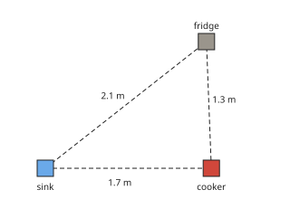

Answer: **5.1 m**
- Typed **3** (two) → “Add all three sides: sink–cooker, cooker–fridge and fridge–sink.”

Full working after a second miss:

> Add the three sides.  
> 1.7 + 1.3 + 2.1 = 5.1 m.  

**Card hec13-3** (draft)

> A good work triangle: each side 1.2 m to 2.7 m, and a total of 4 m to 7.9 m.
>
> _Too long: too much walking. Too short: the cook has no room to work._  

Check question: `hec13-3-check` · multiple choice, level 1 · **authored key**

> Why should the work triangle not be too long?

- ◻️ The kitchen would look too small.  
  _↳ feedback if chosen: The problem is wasted walking, not looks._
- ◻️ The food would cook faster.  
  _↳ feedback if chosen: A long triangle only means more walking._
- ✅ The cook would walk too much and waste time and energy.
- ◻️ The fridge would get too cold.  
  _↳ feedback if chosen: The length of the triangle does not change the fridge._

Full working after a second miss:

> The true statement is “The cook would walk too much and waste time and energy.”.  
> “The kitchen would look too small.” is false: The problem is wasted walking, not looks.  
> “The food would cook faster.” is false: A long triangle only means more walking.  
> “The fridge would get too cold.” is false: The length of the triangle does not change the fridge.  

**Worked example** (draft)

> The sink is 1.8 m from the cooker, the cooker 2.1 m from the fridge, and the fridge 2.4 m from the sink. How long is the work triangle? Is it well planned?

1. Total: 1.8 + 2.1 + 2.4 = 6.3 m.
2. Each side is between 1.2 m and 2.7 m.
3. The total is between 4 m and 7.9 m.

**Answer:** 6.3 m: it is well planned.

**Practice** (one generated question per template, easiest first)

Practice 1: `he13-total` · number, level 1 · computed by rule

> How long is this work triangle altogether?

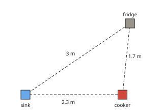

Answer: **7 m**
- Typed **4** (two) → “Add all three sides: sink–cooker, cooker–fridge and fridge–sink.”

Full working after a second miss:

> Add the three sides.  
> 2.3 + 1.7 + 3 = 7 m.  

Practice 2: `he13-centre` · multiple choice, level 1 · **authored key**

> Where in the kitchen should you do this: washing vegetables and plates?

- ✅ the sink
- ◻️ the fridge  
  _↳ feedback if chosen: That is a different work centre._
- ◻️ the cooker  
  _↳ feedback if chosen: That is a different work centre._

Full working after a second miss:

> The sink: washing vegetables and plates.  
> Answer: the sink.  

Practice 3: `he13-verdict` · multiple choice, level 2 · computed by rule

> Is this work triangle well planned? (Each side 1.2 m to 2.7 m; total 4 m to 7.9 m.)

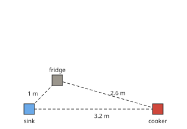

- ◻️ the total is too long: too much walking  
  _↳ feedback if chosen: Check each side first, then add them: total 6.8 m._
- ✅ a side is too long: too much walking
- ◻️ the total is too short: the work centres are crowded  
  _↳ feedback if chosen: Check each side first, then add them: total 6.8 m._

Full working after a second miss:

> Sides: 3.2 m, 2.6 m, 1 m. Total: 6.8 m.  
> So a side is too long: too much walking.  

Practice 4: `he13-manage` · multiple choice, level 2 · **authored key**

> Which is good kitchen management?

- ◻️ Leave the gas on low all day.  
  _↳ feedback if chosen: That wastes gas and is dangerous._
- ◻️ Buy food without a plan.  
  _↳ feedback if chosen: Planning saves money and avoids waste._
- ◻️ Put a table in the middle of the work triangle.  
  _↳ feedback if chosen: Nothing should block the work triangle._
- ✅ Turn off the cooker as soon as the food is ready.

Full working after a second miss:

> The true statement is “Turn off the cooker as soon as the food is ready.”.  
> “Leave the gas on low all day.” is false: That wastes gas and is dangerous.  
> “Buy food without a plan.” is false: Planning saves money and avoids waste.  
> “Put a table in the middle of the work triangle.” is false: Nothing should block the work triangle.  

Practice 5: `he13-spot` · spot the error, level 3 · **authored key**

> One sentence is wrong. Which one?

- ◻️ The work triangle joins the sink, the cooker and the fridge.
- ◻️ Cleaning as you go keeps the kitchen tidy.
- ✅ The fridge is the cooking centre.  
  _↳ explanation: The fridge is the storage centre; the cooker is the cooking centre._
- ◻️ A very long work triangle means too much walking.

Full working after a second miss:

> The wrong statement is “The fridge is the cooking centre.”.  
> The fridge is the storage centre; the cooker is the cooking centre.  

**Summary (the note)**

> A kitchen has three main work centres:
> • the storage centre: the fridge and cupboards;
> • the preparation and cleaning centre: the sink;
> • the cooking centre: the cooker.
> The work triangle is the path between the sink, the cooker and the fridge. A good triangle saves walking and time. A common guide: each side 1.2 m to 2.7 m long, and the three sides together 4 m to 7.9 m. Nothing (a table, a cupboard) should block the triangle.
> Managing a kitchen means: planning meals in advance, keeping it clean and tidy, storing food properly, working in a sensible order, cleaning as you go, and using fuel, water and money carefully.

## All drafts

| Lesson | Title (sheet) | Status | Cards | Practice | Paper task |
|---|---|---|---|---|---|
| 1 | Basic terms used in Nutrition: Malnutrition (under- nutrition, over-nutrition, hidden hunger). Metabolism etc..) | draft | 3 | 5 | — |
| 2 | Factors associated with health (diet, exercise, recreation) | draft | 3 | 5 | — |
| 3 | Types of food and their nutrients.Food groups | draft | 3 | 5 | — |
| 4 | Functions of food. Dietary guidelines. Subjects related to food and nutrition, | draft | 3 | 5 | — |
| 5 | Careers associated with Food and Nutrition | draft | 3 | 4 | — |
| 6 | Diagram of a traditional kitchen | draft | 3 | 4 | — |
| 7 | Types of fire places used in a traditional kitchen | draft | 3 | 4 | — |
| 10 | Diagram of the different types of fire places in a traditional kitchen | draft | 3 | 4 | — |
| 11 | Advantages and disadvantages of a traditional kitchen | draft | 3 | 4 | — |
| 12 | Care of a traditional kitchen | draft | 3 | 4 | — |
| 13 | Kitchen planning and management | draft | 3 | 5 | — |
| 14 | Different shapes of modern kitchens | draft | 3 | 4 | — |
| 15 | Identify kitchen elements/Kitchen units | draft | 3 | 4 | — |
| 16 | Types of kitchen units | draft | 3 | 4 | — |
| 17 | Points to consider when planning a modern kitchen | draft | 3 | 4 | — |
| 20 | Advantages of time management in the kitchen | draft | 3 | 4 | — |
| 21 | Care of a modern kitchen | draft | 3 | 4 | — |

## Lesson 1: Basic terms used in Nutrition: Malnutrition (under- nutrition, over-nutrition, hidden hunger). Metabolism etc..)

Prerequisites: none · Skill: he1 (Basic terms in nutrition)

**Note** (draft)

> Nutrition is the way the body takes in food and uses it. A nutrient is a substance in food that the body needs (carbohydrates, proteins, fats and oils, vitamins, minerals, water).
> Your diet is the food you usually eat. A balanced diet has all the nutrients in the right amounts.
> Malnutrition means bad nutrition:
> • under-nutrition: not enough food or nutrients (for example kwashiorkor from too little protein, marasmus from too little food);
> • over-nutrition: too much food for a long time, which can lead to obesity;
> • hidden hunger: a lack of vitamins and minerals even when the stomach is full.
> Metabolism is all the chemical processes in the body that turn food into energy and body tissue.

**Card hec1-1** (draft)

> Nutrition is how the body takes in and uses food. Nutrients are the substances in food the body needs. Your diet is the food you usually eat.
>
> _Beans contain the nutrient protein. Rice, beans and vegetables can be part of a good diet._  

Check question: `he1-which` · multiple choice, level 1 · **authored key**, reused from practice

> Which word means: a diet with all the nutrients in the right amounts?

- ✅ balanced diet
- ◻️ hidden hunger  
  _↳ feedback if chosen: Not this word. Read the meanings again._
- ◻️ obesity  
  _↳ feedback if chosen: Not this word. Read the meanings again._
- ◻️ malnutrition  
  _↳ feedback if chosen: Not this word. Read the meanings again._

Full working after a second miss:

> Balanced diet: a diet with all the nutrients in the right amounts.  
> Answer: balanced diet.  

**Card hec1-2** (draft)

> Malnutrition is bad nutrition: under-nutrition (too little), over-nutrition (too much) or hidden hunger (missing vitamins and minerals).
>
> _A very thin child with too little food has under-nutrition. Eating fried food and sweets every day can lead to obesity._  

Check question: `hec1-2-check` · multiple choice, level 1 · **authored key**

> Which is an example of malnutrition?

- ◻️ a boy who drinks clean water  
  _↳ feedback if chosen: Clean water is good for health._
- ✅ a person who becomes obese from eating too much
- ◻️ a child who eats a balanced diet  
  _↳ feedback if chosen: A balanced diet has all the nutrients in the right amounts: that is good nutrition._
- ◻️ a family that eats beans, vegetables and rice  
  _↳ feedback if chosen: That is a varied, healthy meal._

Full working after a second miss:

> The true statement is “a person who becomes obese from eating too much”.  
> “a boy who drinks clean water” is false: Clean water is good for health.  
> “a child who eats a balanced diet” is false: A balanced diet has all the nutrients in the right amounts: that is good nutrition.  
> “a family that eats beans, vegetables and rice” is false: That is a varied, healthy meal.  

**Card hec1-3** (draft)

> Metabolism is all the chemical processes that turn food into energy and body tissue.
>
> _When you run, your metabolism uses the energy from your food._  

Check question: `he1-match` · matching, level 1 · **authored key**, reused from practice

> Match each word with its meaning.

Right-hand side (shuffled): eating more food than the body needs for a long time · the way the body takes in food and uses it · a substance in food that the body needs, such as protein or a vitamin · bad nutrition: too little food, too much food or the wrong kinds of food
- over-nutrition → **eating more food than the body needs for a long time**
- malnutrition → **bad nutrition: too little food, too much food or the wrong kinds of food**
- nutrient → **a substance in food that the body needs, such as protein or a vitamin**
- nutrition → **the way the body takes in food and uses it**

Full working after a second miss:

> The right pairs are:  
> over-nutrition → eating more food than the body needs for a long time  
> malnutrition → bad nutrition: too little food, too much food or the wrong kinds of food  
> nutrient → a substance in food that the body needs, such as protein or a vitamin  
> nutrition → the way the body takes in food and uses it  

**Worked example** (draft)

> Enow eats a big plate of garri every day but almost never eats fruit, vegetables, beans or fish. He is not hungry. Is his diet balanced? What kind of malnutrition could he have?

1. Garri gives energy, but Enow gets few proteins, vitamins and minerals.
2. So his diet is not balanced.
3. He is not hungry, but his body lacks vitamins and minerals: this is hidden hunger.

**Answer:** No, his diet is not balanced; he could have hidden hunger.

**Practice** `he1-match` · matching, level 1 · **authored key**

> Match each word with its meaning.

Right-hand side (shuffled): not getting enough food or nutrients · being very overweight because of too much body fat · all the chemical processes in the body that turn food into energy and body tissue · the way the body takes in food and uses it
- metabolism → **all the chemical processes in the body that turn food into energy and body tissue**
- obesity → **being very overweight because of too much body fat**
- under-nutrition → **not getting enough food or nutrients**
- nutrition → **the way the body takes in food and uses it**

Full working after a second miss:

> The right pairs are:  
> metabolism → all the chemical processes in the body that turn food into energy and body tissue  
> obesity → being very overweight because of too much body fat  
> under-nutrition → not getting enough food or nutrients  
> nutrition → the way the body takes in food and uses it  

> Match each word with its meaning.

Right-hand side (shuffled): not getting enough food or nutrients · a lack of vitamins and minerals even when the stomach is full · the food a person usually eats · bad nutrition: too little food, too much food or the wrong kinds of food
- under-nutrition → **not getting enough food or nutrients**
- diet → **the food a person usually eats**
- malnutrition → **bad nutrition: too little food, too much food or the wrong kinds of food**
- hidden hunger → **a lack of vitamins and minerals even when the stomach is full**

Full working after a second miss:

> The right pairs are:  
> under-nutrition → not getting enough food or nutrients  
> diet → the food a person usually eats  
> malnutrition → bad nutrition: too little food, too much food or the wrong kinds of food  
> hidden hunger → a lack of vitamins and minerals even when the stomach is full  

**Practice** `he1-which` · multiple choice, level 1 · **authored key**

> Which word means: a lack of vitamins and minerals even when the stomach is full?

- ◻️ over-nutrition  
  _↳ feedback if chosen: Not this word. Read the meanings again._
- ◻️ nutrition  
  _↳ feedback if chosen: Not this word. Read the meanings again._
- ◻️ metabolism  
  _↳ feedback if chosen: Not this word. Read the meanings again._
- ✅ hidden hunger

Full working after a second miss:

> Hidden hunger: a lack of vitamins and minerals even when the stomach is full.  
> Answer: hidden hunger.  

> Which word means: eating more food than the body needs for a long time?

- ✅ over-nutrition
- ◻️ malnutrition  
  _↳ feedback if chosen: Not this word. Read the meanings again._
- ◻️ under-nutrition  
  _↳ feedback if chosen: Not this word. Read the meanings again._
- ◻️ balanced diet  
  _↳ feedback if chosen: Not this word. Read the meanings again._

Full working after a second miss:

> Over-nutrition: eating more food than the body needs for a long time.  
> Answer: over-nutrition.  

**Practice** `he1-sort` · matching, level 2 · **authored key**

> Sort these: under-nutrition or over-nutrition?

Groups: under-nutrition · over-nutrition
- kwashiorkor: a swollen belly from too little protein → **under-nutrition**
- eating much more than the body needs → **over-nutrition**
- only one small meal a day for a long time → **under-nutrition**
- marasmus: very thin from too little food → **under-nutrition**
- a very thin child who does not get enough food → **under-nutrition**
- putting on too much weight → **over-nutrition**

Full working after a second miss:

> The right pairs are:  
> kwashiorkor: a swollen belly from too little protein → under-nutrition  
> eating much more than the body needs → over-nutrition  
> only one small meal a day for a long time → under-nutrition  
> marasmus: very thin from too little food → under-nutrition  
> a very thin child who does not get enough food → under-nutrition  
> putting on too much weight → over-nutrition  

> Sort these: under-nutrition or over-nutrition?

Groups: under-nutrition · over-nutrition
- eating much more than the body needs → **over-nutrition**
- kwashiorkor: a swollen belly from too little protein → **under-nutrition**
- obesity → **over-nutrition**
- marasmus: very thin from too little food → **under-nutrition**
- a very thin child who does not get enough food → **under-nutrition**
- putting on too much weight → **over-nutrition**

Full working after a second miss:

> The right pairs are:  
> eating much more than the body needs → over-nutrition  
> kwashiorkor: a swollen belly from too little protein → under-nutrition  
> obesity → over-nutrition  
> marasmus: very thin from too little food → under-nutrition  
> a very thin child who does not get enough food → under-nutrition  
> putting on too much weight → over-nutrition  

**Practice** `he1-hidden` · multiple choice, level 2 · **authored key**

> Which is an example of hidden hunger?

- ◻️ A girl eats a balanced diet.  
  _↳ feedback if chosen: A balanced diet gives all the nutrients: no hunger._
- ◻️ A man eats so much that he becomes obese.  
  _↳ feedback if chosen: That is over-nutrition._
- ◻️ A child has nothing to eat for two days.  
  _↳ feedback if chosen: That is under-nutrition: there is too little food._
- ✅ A child eats enough garri every day but no fruit or vegetables, and lacks vitamins.

Full working after a second miss:

> The true statement is “A child eats enough garri every day but no fruit or vegetables, and lacks vitamins.”.  
> “A girl eats a balanced diet.” is false: A balanced diet gives all the nutrients: no hunger.  
> “A man eats so much that he becomes obese.” is false: That is over-nutrition.  
> “A child has nothing to eat for two days.” is false: That is under-nutrition: there is too little food.  

> Which is an example of hidden hunger?

- ✅ A child eats enough garri every day but no fruit or vegetables, and lacks vitamins.
- ◻️ A boy is hungry just before lunch.  
  _↳ feedback if chosen: Feeling hungry before a meal is normal._
- ◻️ A man eats so much that he becomes obese.  
  _↳ feedback if chosen: That is over-nutrition._
- ◻️ A child has nothing to eat for two days.  
  _↳ feedback if chosen: That is under-nutrition: there is too little food._

Full working after a second miss:

> The true statement is “A child eats enough garri every day but no fruit or vegetables, and lacks vitamins.”.  
> “A boy is hungry just before lunch.” is false: Feeling hungry before a meal is normal.  
> “A man eats so much that he becomes obese.” is false: That is over-nutrition.  
> “A child has nothing to eat for two days.” is false: That is under-nutrition: there is too little food.  

**Practice** `he1-spot` · spot the error, level 3 · **authored key**

> One sentence is wrong. Which one?

- ✅ A person with hidden hunger always feels hungry.  
  _↳ explanation: With hidden hunger the stomach can be full; vitamins and minerals are missing._
- ◻️ A balanced diet has all the nutrients in the right amounts.
- ◻️ Obesity can come from over-nutrition.
- ◻️ Nutrients are substances in food that the body needs.

Full working after a second miss:

> The wrong statement is “A person with hidden hunger always feels hungry.”.  
> With hidden hunger the stomach can be full; vitamins and minerals are missing.  

> One sentence is wrong. Which one?

- ◻️ Obesity can come from over-nutrition.
- ◻️ Hidden hunger is a lack of vitamins and minerals.
- ✅ A person with hidden hunger always feels hungry.  
  _↳ explanation: With hidden hunger the stomach can be full; vitamins and minerals are missing._
- ◻️ Nutrients are substances in food that the body needs.

Full working after a second miss:

> The wrong statement is “A person with hidden hunger always feels hungry.”.  
> With hidden hunger the stomach can be full; vitamins and minerals are missing.  

## Lesson 2: Factors associated with health (diet, exercise, recreation)

Prerequisites: 1 · Skill: he2 (Factors for good health)

**Note** (draft)

> Health is being well in body, mind and in our life with other people, not only being free from disease.
> Factors that keep us healthy:
> • a good diet: a balanced diet, regular meals and clean water;
> • exercise: walking, running, games and sport make the heart, lungs and muscles strong and keep weight right;
> • rest and sleep: the body repairs itself and grows;
> • recreation: games, music, hobbies and time with friends refresh the mind and reduce stress;
> • personal hygiene: washing the body, hands, teeth and clothes;
> • a clean environment: no rubbish or stagnant water near the house;
> • avoiding harmful habits: smoking, alcohol and drugs;
> • going to the health centre for vaccinations and when ill.

**Card hec2-1** (draft)

> Health is being well in body, mind and in our life with other people, not only being free from disease.
>
> _A pupil who is not sick but is always sad and alone is not fully healthy._  

Check question: `hec2-1-check` · multiple choice, level 1 · **authored key**

> What does “health” mean?

- ✅ being well in body, mind and life with others, not only free from disease
- ◻️ being very strong  
  _↳ feedback if chosen: Strength is only one part of health._
- ◻️ eating a lot of food  
  _↳ feedback if chosen: Too much food can cause obesity._
- ◻️ being rich  
  _↳ feedback if chosen: Money does not make a person healthy._

Full working after a second miss:

> The true statement is “being well in body, mind and life with others, not only free from disease”.  
> “being very strong” is false: Strength is only one part of health.  
> “eating a lot of food” is false: Too much food can cause obesity.  
> “being rich” is false: Money does not make a person healthy.  

**Card hec2-2** (draft)

> A good diet and regular exercise keep the body strong.
>
> _Walking to school and playing games are good exercise._  

Check question: `he2-factor` · multiple choice, level 1 · **authored key**, reused from practice

> Which health factor is this?
> Bih sings in the choir and plays draughts at the weekend.

- ◻️ a good diet  
  _↳ feedback if chosen: Not this one. Read the situation again._
- ✅ recreation
- ◻️ exercise  
  _↳ feedback if chosen: Not this one. Read the situation again._
- ◻️ a clean environment  
  _↳ feedback if chosen: Not this one. Read the situation again._

Full working after a second miss:

> Recreation: Bih sings in the choir and plays draughts at the weekend.  
> Answer: recreation.  

**Card hec2-3** (draft)

> Rest, sleep and recreation (games, music, hobbies) refresh the body and the mind.
>
> _After a day of lessons, a game of football with friends is recreation._  

Check question: `he2-sort` · matching, level 1 · **authored key**, reused from practice

> Sort these habits: good or bad for health?

Groups: good for health · bad for health
- smoking → **bad for health**
- drinking clean water → **good for health**
- eating fruit and vegetables → **good for health**
- walking or running often → **good for health**
- never doing any exercise → **bad for health**
- drinking alcohol → **bad for health**

Full working after a second miss:

> The right pairs are:  
> smoking → bad for health  
> drinking clean water → good for health  
> eating fruit and vegetables → good for health  
> walking or running often → good for health  
> never doing any exercise → bad for health  
> drinking alcohol → bad for health  

**Worked example** (draft)

> Ashu eats well, but he sits in front of the television every evening and goes to bed very late. Which two health factors does he need to improve?

1. He does not move his body much: he needs more exercise.
2. He goes to bed very late: he needs more rest and sleep.

**Answer:** Exercise, and rest and sleep.

**Practice** `he2-factor` · multiple choice, level 1 · **authored key**

> Which health factor is this?
> Ewane goes to bed early and sleeps well.

- ✅ rest and sleep
- ◻️ personal hygiene  
  _↳ feedback if chosen: Not this one. Read the situation again._
- ◻️ a clean environment  
  _↳ feedback if chosen: Not this one. Read the situation again._
- ◻️ a good diet  
  _↳ feedback if chosen: Not this one. Read the situation again._

Full working after a second miss:

> Rest and sleep: Ewane goes to bed early and sleeps well.  
> Answer: rest and sleep.  

> Which health factor is this?
> The family eats rice, beans, vegetables and fruit.

- ✅ a good diet
- ◻️ recreation  
  _↳ feedback if chosen: Not this one. Read the situation again._
- ◻️ exercise  
  _↳ feedback if chosen: Not this one. Read the situation again._
- ◻️ a clean environment  
  _↳ feedback if chosen: Not this one. Read the situation again._

Full working after a second miss:

> A good diet: The family eats rice, beans, vegetables and fruit.  
> Answer: a good diet.  

**Practice** `he2-sort` · matching, level 1 · **authored key**

> Sort these habits: good or bad for health?

Groups: good for health · bad for health
- leaving rubbish near the house → **bad for health**
- smoking → **bad for health**
- playing games with friends → **good for health**
- drinking clean water → **good for health**
- sleeping very late every night → **bad for health**
- sleeping enough every night → **good for health**

Full working after a second miss:

> The right pairs are:  
> leaving rubbish near the house → bad for health  
> smoking → bad for health  
> playing games with friends → good for health  
> drinking clean water → good for health  
> sleeping very late every night → bad for health  
> sleeping enough every night → good for health  

> Sort these habits: good or bad for health?

Groups: good for health · bad for health
- eating sweets all day → **bad for health**
- sleeping enough every night → **good for health**
- sleeping very late every night → **bad for health**
- walking or running often → **good for health**
- washing hands before eating → **good for health**
- leaving rubbish near the house → **bad for health**

Full working after a second miss:

> The right pairs are:  
> eating sweets all day → bad for health  
> sleeping enough every night → good for health  
> sleeping very late every night → bad for health  
> walking or running often → good for health  
> washing hands before eating → good for health  
> leaving rubbish near the house → bad for health  

**Practice** `he2-exercise` · multiple choice, level 2 · **authored key**

> Which is a benefit of regular exercise?

- ◻️ It cures all diseases.  
  _↳ feedback if chosen: Exercise helps health but does not cure every disease._
- ◻️ It is only useful for footballers.  
  _↳ feedback if chosen: Everyone benefits from exercise._
- ✅ It makes the heart, lungs and muscles strong.
- ◻️ It makes you need no sleep.  
  _↳ feedback if chosen: You still need rest and sleep after exercise._

Full working after a second miss:

> The true statement is “It makes the heart, lungs and muscles strong.”.  
> “It cures all diseases.” is false: Exercise helps health but does not cure every disease.  
> “It is only useful for footballers.” is false: Everyone benefits from exercise.  
> “It makes you need no sleep.” is false: You still need rest and sleep after exercise.  

> Which is a benefit of regular exercise?

- ◻️ It means you never need to eat.  
  _↳ feedback if chosen: Exercise uses energy: you still need good food._
- ◻️ It is only useful for footballers.  
  _↳ feedback if chosen: Everyone benefits from exercise._
- ◻️ It cures all diseases.  
  _↳ feedback if chosen: Exercise helps health but does not cure every disease._
- ✅ It helps you sleep well.

Full working after a second miss:

> The true statement is “It helps you sleep well.”.  
> “It means you never need to eat.” is false: Exercise uses energy: you still need good food.  
> “It is only useful for footballers.” is false: Everyone benefits from exercise.  
> “It cures all diseases.” is false: Exercise helps health but does not cure every disease.  

**Practice** `he2-recreation` · multiple choice, level 2 · **authored key**

> Which is recreation?

- ✅ playing draughts with friends
- ◻️ washing your clothes  
  _↳ feedback if chosen: That is personal hygiene._
- ◻️ taking medicine  
  _↳ feedback if chosen: That is treatment when ill._
- ◻️ eating lunch  
  _↳ feedback if chosen: That is diet._

Full working after a second miss:

> The true statement is “playing draughts with friends”.  
> “washing your clothes” is false: That is personal hygiene.  
> “taking medicine” is false: That is treatment when ill.  
> “eating lunch” is false: That is diet.  

> Which is recreation?

- ◻️ sleeping at night  
  _↳ feedback if chosen: That is rest and sleep._
- ◻️ washing your clothes  
  _↳ feedback if chosen: That is personal hygiene._
- ◻️ taking medicine  
  _↳ feedback if chosen: That is treatment when ill._
- ✅ playing draughts with friends

Full working after a second miss:

> The true statement is “playing draughts with friends”.  
> “sleeping at night” is false: That is rest and sleep.  
> “washing your clothes” is false: That is personal hygiene.  
> “taking medicine” is false: That is treatment when ill.  

**Practice** `he2-spot` · spot the error, level 3 · **authored key**

> One sentence is wrong. Which one?

- ◻️ Personal hygiene helps to prevent disease.
- ◻️ Stagnant water near the house can breed mosquitoes.
- ✅ Smoking is good for the lungs.  
  _↳ explanation: Smoking damages the lungs._
- ◻️ Exercise makes the heart stronger.

Full working after a second miss:

> The wrong statement is “Smoking is good for the lungs.”.  
> Smoking damages the lungs.  

> One sentence is wrong. Which one?

- ✅ Smoking is good for the lungs.  
  _↳ explanation: Smoking damages the lungs._
- ◻️ Exercise makes the heart stronger.
- ◻️ Personal hygiene helps to prevent disease.
- ◻️ Stagnant water near the house can breed mosquitoes.

Full working after a second miss:

> The wrong statement is “Smoking is good for the lungs.”.  
> Smoking damages the lungs.  

## Lesson 3: Types of food and their nutrients.Food groups

Prerequisites: 1 · Skill: he3 (Nutrients and food groups)

**Note** (draft)

> Food contains nutrients:
> • carbohydrates: rice, maize, cassava, yams, plantains, bread;
> • proteins: beans, groundnuts, eggs, fish, meat, milk;
> • fats and oils: palm oil, groundnut oil, butter;
> • vitamins: fruits and vegetables such as oranges, mangoes, pawpaw, carrots, huckleberry;
> • minerals: for example calcium (milk, small fish) and iron (liver, green leaves);
> • water and fibre (roughage) are also needed.
> The three food groups:
> • energy-giving foods: carbohydrates, fats and oils;
> • body-building foods: proteins;
> • protective foods: vitamins and minerals.
> A balanced meal has food from each group, for example rice, beans with fish, and a green vegetable, with fruit after.

**Card hec3-1** (draft)

> Each food is rich in certain nutrients: carbohydrates, proteins, fats and oils, vitamins or minerals.
>
> _Rice is rich in carbohydrates. Beans are rich in proteins. Oranges are rich in vitamins._  

Check question: `he3-nutrient` · matching, level 1 · **authored key**, reused from practice

> Match each food with the main nutrient it gives.

Right-hand side (shuffled): vitamins · carbohydrates · proteins
- yams → **carbohydrates**
- mangoes → **vitamins**
- groundnuts → **proteins**

Full working after a second miss:

> The right pairs are:  
> yams → carbohydrates  
> mangoes → vitamins  
> groundnuts → proteins  

**Card hec3-2** (draft)

> Foods are put into three groups: energy-giving, body-building and protective.
>
> _Yams give energy. Eggs build the body. Pawpaw protects against disease._  

Check question: `he3-group` · matching, level 1 · **authored key**, reused from practice

> Sort these foods into food groups.

Groups: energy-giving · body-building · protective
- yams → **energy-giving**
- beans → **body-building**
- huckleberry (njama njama) → **protective**
- maize → **energy-giving**
- fish → **body-building**
- butter → **energy-giving**

Full working after a second miss:

> The right pairs are:  
> yams → energy-giving  
> beans → body-building  
> huckleberry (njama njama) → protective  
> maize → energy-giving  
> fish → body-building  
> butter → energy-giving  

**Card hec3-3** (draft)

> Water and fibre (roughage) are needed too: water carries nutrients, fibre helps food move through the gut.
>
> _Fruits, vegetables and whole grains give fibre._  

Check question: `hec3-3-check` · multiple choice, level 1 · **authored key**

> Why does the body need fibre (roughage)?

- ◻️ It builds muscles.  
  _↳ feedback if chosen: Proteins build and repair the body._
- ✅ It helps food move through the gut.
- ◻️ It gives most of our energy.  
  _↳ feedback if chosen: Carbohydrates, fats and oils give energy._
- ◻️ It keeps the body warm.  
  _↳ feedback if chosen: Fats and oils help keep the body warm._

Full working after a second miss:

> The true statement is “It helps food move through the gut.”.  
> “It builds muscles.” is false: Proteins build and repair the body.  
> “It gives most of our energy.” is false: Carbohydrates, fats and oils give energy.  
> “It keeps the body warm.” is false: Fats and oils help keep the body warm.  

**Worked example** (draft)

> Is this meal balanced: boiled plantains, fried fish and a mango? If not, what could be added?

1. Plantains: energy-giving (carbohydrates). The frying oil is also energy-giving.
2. Fish: body-building (proteins).
3. Mango: protective (vitamins).
4. All three groups are there; a green vegetable would add more minerals.

**Answer:** Yes, it has all three food groups.

**Practice** `he3-nutrient` · matching, level 1 · **authored key**

> Match each food with the main nutrient it gives.

Right-hand side (shuffled): proteins · fats and oils · vitamins
- mangoes → **vitamins**
- groundnuts → **proteins**
- palm oil → **fats and oils**

Full working after a second miss:

> The right pairs are:  
> mangoes → vitamins  
> groundnuts → proteins  
> palm oil → fats and oils  

> Match each food with the main nutrient it gives.

Right-hand side (shuffled): fats and oils · vitamins · carbohydrates
- palm oil → **fats and oils**
- bread → **carbohydrates**
- mangoes → **vitamins**

Full working after a second miss:

> The right pairs are:  
> palm oil → fats and oils  
> bread → carbohydrates  
> mangoes → vitamins  

**Practice** `he3-group` · matching, level 1 · **authored key**

> Sort these foods into food groups.

Groups: energy-giving · body-building
- cassava → **energy-giving**
- maize → **energy-giving**
- yams → **energy-giving**
- rice → **energy-giving**
- plantains → **energy-giving**
- fish → **body-building**

Full working after a second miss:

> The right pairs are:  
> cassava → energy-giving  
> maize → energy-giving  
> yams → energy-giving  
> rice → energy-giving  
> plantains → energy-giving  
> fish → body-building  

> Sort these foods into food groups.

Groups: energy-giving · body-building · protective
- pawpaw → **protective**
- plantains → **energy-giving**
- eggs → **body-building**
- butter → **energy-giving**
- mangoes → **protective**
- huckleberry (njama njama) → **protective**

Full working after a second miss:

> The right pairs are:  
> pawpaw → protective  
> plantains → energy-giving  
> eggs → body-building  
> butter → energy-giving  
> mangoes → protective  
> huckleberry (njama njama) → protective  

**Practice** `he3-which` · multiple choice, level 2 · **authored key**

> Which nutrient is groundnuts rich in?

- ✅ proteins
- ◻️ fats and oils  
  _↳ feedback if chosen: Not the main one. Think: does this food give energy, build the body, or protect it?_
- ◻️ vitamins  
  _↳ feedback if chosen: Not the main one. Think: does this food give energy, build the body, or protect it?_
- ◻️ carbohydrates  
  _↳ feedback if chosen: Not the main one. Think: does this food give energy, build the body, or protect it?_

Full working after a second miss:

> Groundnuts is rich in proteins.  
> Answer: proteins.  

> Which nutrient is carrots rich in?

- ◻️ fats and oils  
  _↳ feedback if chosen: Not the main one. Think: does this food give energy, build the body, or protect it?_
- ✅ vitamins
- ◻️ proteins  
  _↳ feedback if chosen: Not the main one. Think: does this food give energy, build the body, or protect it?_
- ◻️ carbohydrates  
  _↳ feedback if chosen: Not the main one. Think: does this food give energy, build the body, or protect it?_

Full working after a second miss:

> Carrots is rich in vitamins.  
> Answer: vitamins.  

**Practice** `he3-job` · multiple choice, level 2 · **authored key**

> Which nutrient helps to build and repair the body?

- ◻️ carbohydrates  
  _↳ feedback if chosen: That nutrient has a different job._
- ✅ proteins
- ◻️ water  
  _↳ feedback if chosen: That nutrient has a different job._
- ◻️ fats and oils  
  _↳ feedback if chosen: That nutrient has a different job._

Full working after a second miss:

> Proteins: build and repair the body.  
> Answer: proteins.  

> Which nutrient helps to give energy and keep the body warm?

- ✅ fats and oils
- ◻️ proteins  
  _↳ feedback if chosen: That nutrient has a different job._
- ◻️ minerals  
  _↳ feedback if chosen: That nutrient has a different job._
- ◻️ carbohydrates  
  _↳ feedback if chosen: That nutrient has a different job._

Full working after a second miss:

> Fats and oils: give energy and keep the body warm.  
> Answer: fats and oils.  

**Practice** `he3-spot` · spot the error, level 3 · **authored key**

> One sentence is wrong. Which one?

- ◻️ Oranges are a protective food.
- ◻️ Rice is rich in carbohydrates.
- ✅ Vitamins give us most of our energy.  
  _↳ explanation: Carbohydrates, fats and oils give energy; vitamins protect the body._
- ◻️ Fish is rich in proteins.

Full working after a second miss:

> The wrong statement is “Vitamins give us most of our energy.”.  
> Carbohydrates, fats and oils give energy; vitamins protect the body.  

> One sentence is wrong. Which one?

- ◻️ Fish is rich in proteins.
- ◻️ Beans are a body-building food.
- ✅ Vitamins give us most of our energy.  
  _↳ explanation: Carbohydrates, fats and oils give energy; vitamins protect the body._
- ◻️ Oranges are a protective food.

Full working after a second miss:

> The wrong statement is “Vitamins give us most of our energy.”.  
> Carbohydrates, fats and oils give energy; vitamins protect the body.  

## Lesson 4: Functions of food. Dietary guidelines. Subjects related to food and nutrition,

Prerequisites: 3 · Skill: he4 (Functions of food and dietary guidelines)

**Note** (draft)

> Functions of food in the body: it gives energy, builds and repairs the body, protects against disease, keeps the body warm and helps the body work well.
> Food also has social uses: families eat together, we welcome visitors with food, and we share meals at weddings, birthdays and festivals. Food can also comfort us and make us happy.
> Dietary guidelines (advice for healthy eating):
> • eat a variety of foods from all the food groups;
> • eat plenty of fruit and vegetables;
> • use less salt, sugar and fat;
> • drink clean, safe water;
> • eat regular meals, including breakfast;
> • keep food and hands clean.
> Subjects related to food and nutrition: Biology (the body), Chemistry (nutrients), Agriculture (growing food), Health education, and Physics (heat in cooking).

**Card hec4-1** (draft)

> Food gives energy, builds and repairs the body, protects against disease and keeps us warm. It also brings people together.
>
> _A wedding feast is a social use of food._  

Check question: `he4-func` · matching, level 1 · **authored key**, reused from practice

> Sort these: a function of food in the body, or a social use of food?

Groups: in the body · social use
- a family eating together → **social use**
- gives energy to work and play → **in the body**
- a feast at a wedding → **social use**
- builds and repairs the body → **in the body**
- keeps the body warm → **in the body**
- protects against disease → **in the body**

Full working after a second miss:

> The right pairs are:  
> a family eating together → social use  
> gives energy to work and play → in the body  
> a feast at a wedding → social use  
> builds and repairs the body → in the body  
> keeps the body warm → in the body  
> protects against disease → in the body  

**Card hec4-2** (draft)

> Dietary guidelines are advice for healthy eating: variety, plenty of fruit and vegetables, less salt, sugar and fat, clean water, regular meals.
>
> _Breakfast gives energy for morning lessons._  

Check question: `he4-guide` · multiple choice, level 1 · **authored key**, reused from practice

> Which is good advice for healthy eating?

- ◻️ Eat as much sugar as you like.  
  _↳ feedback if chosen: Too much sugar harms the teeth and can lead to obesity._
- ✅ Use less salt.
- ◻️ Skip meals to save time.  
  _↳ feedback if chosen: Regular meals keep your energy steady._
- ◻️ Fried food is best every day.  
  _↳ feedback if chosen: Too much fat is unhealthy._

Full working after a second miss:

> The true statement is “Use less salt.”.  
> “Eat as much sugar as you like.” is false: Too much sugar harms the teeth and can lead to obesity.  
> “Skip meals to save time.” is false: Regular meals keep your energy steady.  
> “Fried food is best every day.” is false: Too much fat is unhealthy.  

**Card hec4-3** (draft)

> Food and nutrition is linked to other subjects: Biology, Chemistry, Agriculture, Health education and Physics.
>
> _Agriculture teaches how food is grown; Biology teaches how the body uses it._  

Check question: `hec4-3-check` · multiple choice, level 1 · **authored key**

> Which subject teaches how crops are grown for food?

- ◻️ French  
  _↳ feedback if chosen: French is a language._
- ◻️ Computer Science  
  _↳ feedback if chosen: Computer Science studies computers._
- ◻️ Geography only  
  _↳ feedback if chosen: Geography studies the land; Agriculture teaches how crops are grown._
- ✅ Agriculture

Full working after a second miss:

> The true statement is “Agriculture”.  
> “French” is false: French is a language.  
> “Computer Science” is false: Computer Science studies computers.  
> “Geography only” is false: Geography studies the land; Agriculture teaches how crops are grown.  

**Worked example** (draft)

> Every day Nkeng drinks two bottles of sweet soft drink and eats no fruit. Which two dietary guidelines should Nkeng follow?

1. Soft drinks contain a lot of sugar: eat and drink less sugar.
2. No fruit means few vitamins: eat plenty of fruit and vegetables.

**Answer:** Drink less sugar; eat plenty of fruit and vegetables.

**Practice** `he4-func` · matching, level 1 · **authored key**

> Sort these: a function of food in the body, or a social use of food?

Groups: in the body · social use
- a family eating together → **social use**
- welcoming visitors with food → **social use**
- protects against disease → **in the body**
- gives energy to work and play → **in the body**
- sharing a meal with friends → **social use**
- builds and repairs the body → **in the body**

Full working after a second miss:

> The right pairs are:  
> a family eating together → social use  
> welcoming visitors with food → social use  
> protects against disease → in the body  
> gives energy to work and play → in the body  
> sharing a meal with friends → social use  
> builds and repairs the body → in the body  

> Sort these: a function of food in the body, or a social use of food?

Groups: in the body · social use
- welcoming visitors with food → **social use**
- a family eating together → **social use**
- keeps the body warm → **in the body**
- gives energy to work and play → **in the body**
- sharing a meal with friends → **social use**
- protects against disease → **in the body**

Full working after a second miss:

> The right pairs are:  
> welcoming visitors with food → social use  
> a family eating together → social use  
> keeps the body warm → in the body  
> gives energy to work and play → in the body  
> sharing a meal with friends → social use  
> protects against disease → in the body  

**Practice** `he4-guide` · multiple choice, level 1 · **authored key**

> Which is good advice for healthy eating?

- ◻️ Eat only one kind of food.  
  _↳ feedback if chosen: One food cannot give all the nutrients._
- ◻️ Fried food is best every day.  
  _↳ feedback if chosen: Too much fat is unhealthy._
- ✅ Eat breakfast every day.
- ◻️ Skip meals to save time.  
  _↳ feedback if chosen: Regular meals keep your energy steady._

Full working after a second miss:

> The true statement is “Eat breakfast every day.”.  
> “Eat only one kind of food.” is false: One food cannot give all the nutrients.  
> “Fried food is best every day.” is false: Too much fat is unhealthy.  
> “Skip meals to save time.” is false: Regular meals keep your energy steady.  

> Which is good advice for healthy eating?

- ◻️ Skip meals to save time.  
  _↳ feedback if chosen: Regular meals keep your energy steady._
- ◻️ Fried food is best every day.  
  _↳ feedback if chosen: Too much fat is unhealthy._
- ✅ Drink clean, safe water.
- ◻️ Eat as much sugar as you like.  
  _↳ feedback if chosen: Too much sugar harms the teeth and can lead to obesity._

Full working after a second miss:

> The true statement is “Drink clean, safe water.”.  
> “Skip meals to save time.” is false: Regular meals keep your energy steady.  
> “Fried food is best every day.” is false: Too much fat is unhealthy.  
> “Eat as much sugar as you like.” is false: Too much sugar harms the teeth and can lead to obesity.  

**Practice** `he4-advice` · multiple choice, level 2 · **authored key**

> Which advice fits best?
> Nfor never eats breakfast.

- ◻️ eat and drink less sugar  
  _↳ feedback if chosen: That advice is good, but it does not fit this problem._
- ✅ eat regular meals, including breakfast
- ◻️ eat a variety of foods  
  _↳ feedback if chosen: That advice is good, but it does not fit this problem._
- ◻️ drink clean, safe water  
  _↳ feedback if chosen: That advice is good, but it does not fit this problem._

Full working after a second miss:

> Eat regular meals, including breakfast: Nfor never eats breakfast.  
> Answer: eat regular meals, including breakfast.  

> Which advice fits best?
> Ebai drinks water from an open stream.

- ◻️ use less salt  
  _↳ feedback if chosen: That advice is good, but it does not fit this problem._
- ◻️ eat and drink less sugar  
  _↳ feedback if chosen: That advice is good, but it does not fit this problem._
- ✅ drink clean, safe water
- ◻️ eat regular meals, including breakfast  
  _↳ feedback if chosen: That advice is good, but it does not fit this problem._

Full working after a second miss:

> Drink clean, safe water: Ebai drinks water from an open stream.  
> Answer: drink clean, safe water.  

**Practice** `he4-link` · matching, level 2 · **authored key**

> Match each subject with what it teaches about food.

Right-hand side (shuffled): how heat cooks food · how food keeps us healthy · what nutrients are made of · how food is grown
- Health education → **how food keeps us healthy**
- Chemistry → **what nutrients are made of**
- Physics → **how heat cooks food**
- Agriculture → **how food is grown**

Full working after a second miss:

> The right pairs are:  
> Health education → how food keeps us healthy  
> Chemistry → what nutrients are made of  
> Physics → how heat cooks food  
> Agriculture → how food is grown  

> Match each subject with what it teaches about food.

Right-hand side (shuffled): how food keeps us healthy · how the body digests and uses food · how heat cooks food · how food is grown
- Health education → **how food keeps us healthy**
- Agriculture → **how food is grown**
- Biology → **how the body digests and uses food**
- Physics → **how heat cooks food**

Full working after a second miss:

> The right pairs are:  
> Health education → how food keeps us healthy  
> Agriculture → how food is grown  
> Biology → how the body digests and uses food  
> Physics → how heat cooks food  

**Practice** `he4-spot` · spot the error, level 3 · **authored key**

> One sentence is wrong. Which one?

- ◻️ Too much salt is bad for health.
- ◻️ Food builds and repairs the body.
- ◻️ Sharing a meal is a social use of food.
- ✅ Food has no use except to fill the stomach.  
  _↳ explanation: Food gives energy, builds the body, protects it and brings people together._

Full working after a second miss:

> The wrong statement is “Food has no use except to fill the stomach.”.  
> Food gives energy, builds the body, protects it and brings people together.  

> One sentence is wrong. Which one?

- ◻️ Sharing a meal is a social use of food.
- ◻️ Too much salt is bad for health.
- ◻️ Eating breakfast gives energy for the morning.
- ✅ Healthy eating means eating one kind of food.  
  _↳ explanation: Healthy eating means a variety of foods._

Full working after a second miss:

> The wrong statement is “Healthy eating means eating one kind of food.”.  
> Healthy eating means a variety of foods.  

## Lesson 5: Careers associated with Food and Nutrition

Prerequisites: 4 · Skill: he5 (Careers in food and nutrition)

**Note** (draft)

> Many jobs use knowledge of food and nutrition:
> • dietitian: plans special diets for patients, for example in a hospital;
> • nutritionist: teaches people how to eat well;
> • chef or cook: cooks and plans meals in hotels and restaurants;
> • caterer: prepares and serves food for events such as weddings;
> • baker: makes bread, cakes and pastries;
> • food scientist: studies food and makes new food products;
> • food inspector (health inspector): checks that food sold is clean and safe;
> • Home Economics teacher;
> • waiter or waitress, hotel manager.
> These careers need Home Economics, Biology and Chemistry, and also good hygiene, care and honesty.

**Card hec5-1** (draft)

> Some food careers prepare food: chef, cook, caterer, baker.
>
> _A caterer prepares food for a wedding of three hundred guests._  

Check question: `he5-which` · multiple choice, level 1 · **authored key**, reused from practice

> Who prepares and serves food for events such as weddings?

- ◻️ dietitian  
  _↳ feedback if chosen: Not this job. Read what each person does._
- ◻️ Home Economics teacher  
  _↳ feedback if chosen: Not this job. Read what each person does._
- ◻️ chef  
  _↳ feedback if chosen: Not this job. Read what each person does._
- ✅ caterer

Full working after a second miss:

> Caterer: prepares and serves food for events such as weddings.  
> Answer: caterer.  

**Card hec5-2** (draft)

> Some food careers advise, teach or check: dietitian, nutritionist, food inspector, Home Economics teacher.
>
> _A food inspector visits restaurants to check that food is safe._  

Check question: `he5-match` · matching, level 1 · **authored key**, reused from practice

> Match each job with what the person does.

Right-hand side (shuffled): teaches people how to eat well · checks that food sold to people is clean and safe · teaches food, nutrition and home management in school · prepares and serves food for events such as weddings
- nutritionist → **teaches people how to eat well**
- caterer → **prepares and serves food for events such as weddings**
- Home Economics teacher → **teaches food, nutrition and home management in school**
- food inspector → **checks that food sold to people is clean and safe**

Full working after a second miss:

> The right pairs are:  
> nutritionist → teaches people how to eat well  
> caterer → prepares and serves food for events such as weddings  
> Home Economics teacher → teaches food, nutrition and home management in school  
> food inspector → checks that food sold to people is clean and safe  

**Card hec5-3** (draft)

> Food careers need knowledge of Home Economics, Biology and Chemistry, and good hygiene.
>
> _A baker must wash hands and keep the bakery clean._  

Check question: `hec5-3-check` · multiple choice, level 1 · **authored key**

> Which is a career in food and nutrition?

- ✅ caterer
- ◻️ electrician  
  _↳ feedback if chosen: An electrician works with electricity._
- ◻️ driver  
  _↳ feedback if chosen: A driver drives vehicles._
- ◻️ carpenter  
  _↳ feedback if chosen: A carpenter works with wood._

Full working after a second miss:

> The true statement is “caterer”.  
> “electrician” is false: An electrician works with electricity.  
> “driver” is false: A driver drives vehicles.  
> “carpenter” is false: A carpenter works with wood.  

**Worked example** (draft)

> A hospital patient with diabetes needs a special plan for what to eat each day. Who should make the plan?

1. A special diet for a patient is planned by a health professional who knows nutrition.
2. That is the job of a dietitian.

**Answer:** A dietitian.

**Practice** `he5-match` · matching, level 1 · **authored key**

> Match each job with what the person does.

Right-hand side (shuffled): cooks and plans meals in a hotel or restaurant · makes bread, cakes and pastries · studies food and makes new food products · teaches food, nutrition and home management in school
- baker → **makes bread, cakes and pastries**
- Home Economics teacher → **teaches food, nutrition and home management in school**
- chef → **cooks and plans meals in a hotel or restaurant**
- food scientist → **studies food and makes new food products**

Full working after a second miss:

> The right pairs are:  
> baker → makes bread, cakes and pastries  
> Home Economics teacher → teaches food, nutrition and home management in school  
> chef → cooks and plans meals in a hotel or restaurant  
> food scientist → studies food and makes new food products  

> Match each job with what the person does.

Right-hand side (shuffled): plans special diets for patients, for example in a hospital · serves food to customers in a restaurant · checks that food sold to people is clean and safe · studies food and makes new food products
- food inspector → **checks that food sold to people is clean and safe**
- waiter or waitress → **serves food to customers in a restaurant**
- food scientist → **studies food and makes new food products**
- dietitian → **plans special diets for patients, for example in a hospital**

Full working after a second miss:

> The right pairs are:  
> food inspector → checks that food sold to people is clean and safe  
> waiter or waitress → serves food to customers in a restaurant  
> food scientist → studies food and makes new food products  
> dietitian → plans special diets for patients, for example in a hospital  

**Practice** `he5-which` · multiple choice, level 1 · **authored key**

> Who checks that food sold to people is clean and safe?

- ◻️ nutritionist  
  _↳ feedback if chosen: Not this job. Read what each person does._
- ✅ food inspector
- ◻️ Home Economics teacher  
  _↳ feedback if chosen: Not this job. Read what each person does._
- ◻️ dietitian  
  _↳ feedback if chosen: Not this job. Read what each person does._

Full working after a second miss:

> Food inspector: checks that food sold to people is clean and safe.  
> Answer: food inspector.  

> Who teaches food, nutrition and home management in school?

- ◻️ nutritionist  
  _↳ feedback if chosen: Not this job. Read what each person does._
- ◻️ baker  
  _↳ feedback if chosen: Not this job. Read what each person does._
- ✅ Home Economics teacher
- ◻️ chef  
  _↳ feedback if chosen: Not this job. Read what each person does._

Full working after a second miss:

> Home Economics teacher: teaches food, nutrition and home management in school.  
> Answer: Home Economics teacher.  

**Practice** `he5-need` · multiple choice, level 2 · **authored key**

> What do people in food careers need most?

- ◻️ knowing how to build houses  
  _↳ feedback if chosen: That is building, not food._
- ◻️ a big car  
  _↳ feedback if chosen: That does not help to prepare safe, healthy food._
- ✅ good hygiene and knowledge of food and nutrition
- ◻️ a driving licence  
  _↳ feedback if chosen: Some jobs need it, but food careers need hygiene and food knowledge._

Full working after a second miss:

> The true statement is “good hygiene and knowledge of food and nutrition”.  
> “knowing how to build houses” is false: That is building, not food.  
> “a big car” is false: That does not help to prepare safe, healthy food.  
> “a driving licence” is false: Some jobs need it, but food careers need hygiene and food knowledge.  

> What do people in food careers need most?

- ◻️ knowing how to build houses  
  _↳ feedback if chosen: That is building, not food._
- ◻️ strong muscles only  
  _↳ feedback if chosen: Food careers need knowledge and hygiene, not only strength._
- ◻️ a big car  
  _↳ feedback if chosen: That does not help to prepare safe, healthy food._
- ✅ good hygiene and knowledge of food and nutrition

Full working after a second miss:

> The true statement is “good hygiene and knowledge of food and nutrition”.  
> “knowing how to build houses” is false: That is building, not food.  
> “strong muscles only” is false: Food careers need knowledge and hygiene, not only strength.  
> “a big car” is false: That does not help to prepare safe, healthy food.  

**Practice** `he5-spot` · spot the error, level 3 · **authored key**

> One sentence is wrong. Which one?

- ◻️ A food inspector checks that food is safe.
- ◻️ A baker makes bread and cakes.
- ◻️ A caterer prepares food for events.
- ✅ A food scientist serves customers in a restaurant.  
  _↳ explanation: Waiters serve customers; a food scientist studies food and makes new products._

Full working after a second miss:

> The wrong statement is “A food scientist serves customers in a restaurant.”.  
> Waiters serve customers; a food scientist studies food and makes new products.  

> One sentence is wrong. Which one?

- ◻️ A baker makes bread and cakes.
- ◻️ A chef cooks in a hotel or restaurant.
- ◻️ A caterer prepares food for events.
- ✅ A nutritionist builds kitchens.  
  _↳ explanation: A nutritionist teaches people how to eat well._

Full working after a second miss:

> The wrong statement is “A nutritionist builds kitchens.”.  
> A nutritionist teaches people how to eat well.  

## Lesson 6: Diagram of a traditional kitchen

Prerequisites: none · Skill: he6 (Parts of a traditional kitchen)

**Note** (draft)

> A traditional kitchen is often a separate house near the main house, with walls of mud or mud bricks and a roof of thatch or zinc. The floor is often earth.
> Its main parts:
> • the fireplace, often three stones in the middle of the floor, holding the pot;
> • the smoke rack (often bamboo) above the fire, for drying and smoking meat, fish, maize and firewood;
> • the firewood store, keeping wood dry;
> • water pots or containers;
> • shelves, baskets or hooks for plates, pots and spoons;
> • the mortar and pestle and the grinding stone, for pounding and grinding food;
> • stools to sit on, and small openings to let smoke out.

**Card hec6-1** (draft)

> A traditional kitchen has a fireplace, a smoke rack above it, a firewood store, water pots, shelves and a mortar and pestle.
>
> _The fireplace is usually in the middle of the floor._  

Check question: `he6-part` · multiple choice, level 1 · **authored key**, reused from practice

> What is the part labelled E?

- ✅ smoke rack
- ◻️ shelf for utensils  
  _↳ feedback if chosen: Look again at what the letter is next to._
- ◻️ water pot  
  _↳ feedback if chosen: Look again at what the letter is next to._
- ◻️ mortar and pestle  
  _↳ feedback if chosen: Look again at what the letter is next to._

Full working after a second miss:

> Letter E is next to the smoke rack.  
> The smoke rack above the fire dries and smokes meat, fish, maize and firewood.  

**Card hec6-2** (draft)

> The smoke rack hangs above the fire. Heat and smoke dry and preserve food and firewood.
>
> _Smoked fish keeps for a long time._  

Check question: `he6-letter` · multiple choice, level 1 · **authored key**, reused from practice

> Which letter shows the smoke rack?

- ◻️ D  
  _↳ feedback if chosen: That letter is next to a different part._
- ✅ B
- ◻️ A  
  _↳ feedback if chosen: That letter is next to a different part._
- ◻️ C  
  _↳ feedback if chosen: That letter is next to a different part._

Full working after a second miss:

> The smoke rack is labelled B.  

**Card hec6-3** (draft)

> Each part has a use: the shelf keeps utensils clean; the mortar and pestle pound food.
>
> _Groundnuts are pounded in the mortar for groundnut soup._  

Check question: `hec6-3-check` · multiple choice, level 1 · **authored key**

> What is the smoke rack above the fire used for?

- ◻️ holding the pot over the fire  
  _↳ feedback if chosen: The three stones hold the pot._
- ✅ drying and smoking meat, fish, maize and firewood
- ◻️ pounding groundnuts  
  _↳ feedback if chosen: That is done with the mortar and pestle._
- ◻️ storing water  
  _↳ feedback if chosen: Water is kept in water pots._

Full working after a second miss:

> The true statement is “drying and smoking meat, fish, maize and firewood”.  
> “holding the pot over the fire” is false: The three stones hold the pot.  
> “pounding groundnuts” is false: That is done with the mortar and pestle.  
> “storing water” is false: Water is kept in water pots.  

**Worked example** (draft)

> In the drawing, which part is labelled B, and what is it for?

1. Letter B is on the frame of bamboo hanging above the fire.
2. That is the smoke rack. The heat and smoke from the fire dry food and firewood placed on it.

**Answer:** The smoke rack: it dries and smokes meat, fish, maize and firewood.

**Practice** `he6-part` · multiple choice, level 1 · **authored key**

> What is the part labelled A?

- ◻️ three-stone fireplace  
  _↳ feedback if chosen: Look again at what the letter is next to._
- ◻️ mortar and pestle  
  _↳ feedback if chosen: Look again at what the letter is next to._
- ◻️ water pot  
  _↳ feedback if chosen: Look again at what the letter is next to._
- ✅ smoke rack

Full working after a second miss:

> Letter A is next to the smoke rack.  
> The smoke rack above the fire dries and smokes meat, fish, maize and firewood.  

> What is the part labelled A?

- ◻️ smoke rack  
  _↳ feedback if chosen: Look again at what the letter is next to._
- ◻️ firewood store  
  _↳ feedback if chosen: Look again at what the letter is next to._
- ✅ three-stone fireplace
- ◻️ water pot  
  _↳ feedback if chosen: Look again at what the letter is next to._

Full working after a second miss:

> Letter A is next to the three-stone fireplace.  
> The three-stone fireplace holds the pot over the fire.  

**Practice** `he6-letter` · multiple choice, level 1 · **authored key**

> Which letter shows the water pot?

- ✅ B
- ◻️ C  
  _↳ feedback if chosen: That letter is next to a different part._
- ◻️ A  
  _↳ feedback if chosen: That letter is next to a different part._
- ◻️ F  
  _↳ feedback if chosen: That letter is next to a different part._

Full working after a second miss:

> The water pot is labelled B.  

> Which letter shows the mortar and pestle?

- ◻️ E  
  _↳ feedback if chosen: That letter is next to a different part._
- ◻️ A  
  _↳ feedback if chosen: That letter is next to a different part._
- ◻️ F  
  _↳ feedback if chosen: That letter is next to a different part._
- ✅ B

Full working after a second miss:

> The mortar and pestle is labelled B.  

**Practice** `he6-use` · multiple choice, level 2 · **authored key**

> What is the mortar and pestle used for?

- ◻️ storing water and keeping it cool  
  _↳ feedback if chosen: That is the use of a different part._
- ◻️ holding the pot over the fire  
  _↳ feedback if chosen: That is the use of a different part._
- ✅ pounding food such as cocoyams, groundnuts and spices
- ◻️ keeping plates and pots clean and off the floor  
  _↳ feedback if chosen: That is the use of a different part._

Full working after a second miss:

> The mortar and pestle pound food such as cocoyams, groundnuts and spices.  
> Answer: pounding food such as cocoyams, groundnuts and spices.  

> What is the mortar and pestle used for?

- ✅ pounding food such as cocoyams, groundnuts and spices
- ◻️ keeping plates and pots clean and off the floor  
  _↳ feedback if chosen: That is the use of a different part._
- ◻️ drying and smoking meat, fish, maize and firewood  
  _↳ feedback if chosen: That is the use of a different part._
- ◻️ storing water and keeping it cool  
  _↳ feedback if chosen: That is the use of a different part._

Full working after a second miss:

> The mortar and pestle pound food such as cocoyams, groundnuts and spices.  
> Answer: pounding food such as cocoyams, groundnuts and spices.  

**Practice** `he6-spot` · spot the error, level 3 · **authored key**

> One sentence is wrong. Which one?

- ✅ The smoke rack is used to store water.  
  _↳ explanation: Water is kept in water pots; the smoke rack dries and smokes food._
- ◻️ Firewood is kept dry in the firewood store.
- ◻️ The mortar and pestle are used to pound food.
- ◻️ A traditional kitchen often has mud walls.

Full working after a second miss:

> The wrong statement is “The smoke rack is used to store water.”.  
> Water is kept in water pots; the smoke rack dries and smokes food.  

> One sentence is wrong. Which one?

- ◻️ The mortar and pestle are used to pound food.
- ◻️ A traditional kitchen often has mud walls.
- ✅ The fireplace is usually on the roof.  
  _↳ explanation: The fireplace is on the floor, often in the middle._
- ◻️ The smoke rack is above the fire.

Full working after a second miss:

> The wrong statement is “The fireplace is usually on the roof.”.  
> The fireplace is on the floor, often in the middle.  

## Lesson 7: Types of fire places used in a traditional kitchen

Prerequisites: 6 · Skill: he7 (Types of fireplaces)

**Note** (draft)

> Fireplaces used in traditional kitchens:
> • Three-stone fireplace: three stones hold the pot over an open wood fire. It is cheap and easy to make, but it wastes firewood, makes a lot of smoke, and children can be burnt.
> • Improved (mud or clay) stove: walls of mud or clay around the fire keep the heat in; the pot sits on top. It saves firewood, makes less smoke and is safer, but it must be built and repaired.
> • Charcoal stove: a metal stove that burns charcoal. It can be carried, makes little smoke and cooks fast, but charcoal costs money, and burning it indoors without fresh air is dangerous (carbon monoxide).
> Saving firewood protects forests.

**Card hec7-1** (draft)

> The three-stone fireplace: three stones hold the pot over an open fire. Cheap, but it wastes firewood and is smoky.
>
> _Much of the heat escapes round the sides of the pot._  

Check question: `he7-which` · multiple choice, level 1 · **authored key**, reused from practice

> Which fireplace is this: it saves firewood and must be built from clay?

- ◻️ three-stone fireplace  
  _↳ feedback if chosen: Not that one. Read the descriptions again._
- ✅ improved (mud) stove
- ◻️ charcoal stove  
  _↳ feedback if chosen: Not that one. Read the descriptions again._

Full working after a second miss:

> Improved (mud) stove: it saves firewood and must be built from clay.  
> Answer: improved (mud) stove.  

**Card hec7-2** (draft)

> The improved mud stove keeps the heat in with mud or clay walls, so it saves firewood and makes less smoke.
>
> _Less firewood means fewer trees cut down._  

Check question: `he7-match` · matching, level 1 · **authored key**, reused from practice

> Match each fireplace with its description.

Right-hand side (shuffled): mud or clay walls around the fire hold the heat; the pot sits on top · three stones hold the pot over an open wood fire · a metal stove that burns charcoal and can be carried
- three-stone fireplace → **three stones hold the pot over an open wood fire**
- charcoal stove → **a metal stove that burns charcoal and can be carried**
- improved (mud) stove → **mud or clay walls around the fire hold the heat; the pot sits on top**

Full working after a second miss:

> The right pairs are:  
> three-stone fireplace → three stones hold the pot over an open wood fire  
> charcoal stove → a metal stove that burns charcoal and can be carried  
> improved (mud) stove → mud or clay walls around the fire hold the heat; the pot sits on top  

**Card hec7-3** (draft)

> The charcoal stove is metal, burns charcoal and can be carried. Use it only where there is fresh air.
>
> _Burning charcoal in a closed room can poison people._  

Check question: `hec7-3-check` · multiple choice, level 1 · **authored key**

> Why must a charcoal stove be used only where there is fresh air?

- ◻️ Charcoal is heavy.  
  _↳ feedback if chosen: Weight is not the danger: the gas is._
- ◻️ Fresh air makes food taste better.  
  _↳ feedback if chosen: Fresh air is needed for safety: charcoal gives off carbon monoxide._
- ✅ Burning charcoal gives off a poisonous gas (carbon monoxide).
- ◻️ The stove gets too cold.  
  _↳ feedback if chosen: The problem is a poisonous gas, not cold._

Full working after a second miss:

> The true statement is “Burning charcoal gives off a poisonous gas (carbon monoxide).”.  
> “Charcoal is heavy.” is false: Weight is not the danger: the gas is.  
> “Fresh air makes food taste better.” is false: Fresh air is needed for safety: charcoal gives off carbon monoxide.  
> “The stove gets too cold.” is false: The problem is a poisonous gas, not cold.  

**Worked example** (draft)

> A family wants a fireplace that uses less firewood and makes less smoke, and they have clay nearby. Which fireplace should they build?

1. The three-stone fireplace wastes firewood and is smoky.
2. An improved mud or clay stove keeps the heat in, so it uses less wood and makes less smoke, and clay is free nearby.

**Answer:** An improved (mud or clay) stove.

**Practice** `he7-match` · matching, level 1 · **authored key**

> Match each fireplace with its description.

Right-hand side (shuffled): a metal stove that burns charcoal and can be carried · three stones hold the pot over an open wood fire · mud or clay walls around the fire hold the heat; the pot sits on top
- three-stone fireplace → **three stones hold the pot over an open wood fire**
- charcoal stove → **a metal stove that burns charcoal and can be carried**
- improved (mud) stove → **mud or clay walls around the fire hold the heat; the pot sits on top**

Full working after a second miss:

> The right pairs are:  
> three-stone fireplace → three stones hold the pot over an open wood fire  
> charcoal stove → a metal stove that burns charcoal and can be carried  
> improved (mud) stove → mud or clay walls around the fire hold the heat; the pot sits on top  

> Match each fireplace with its description.

Right-hand side (shuffled): mud or clay walls around the fire hold the heat; the pot sits on top · three stones hold the pot over an open wood fire · a metal stove that burns charcoal and can be carried
- charcoal stove → **a metal stove that burns charcoal and can be carried**
- three-stone fireplace → **three stones hold the pot over an open wood fire**
- improved (mud) stove → **mud or clay walls around the fire hold the heat; the pot sits on top**

Full working after a second miss:

> The right pairs are:  
> charcoal stove → a metal stove that burns charcoal and can be carried  
> three-stone fireplace → three stones hold the pot over an open wood fire  
> improved (mud) stove → mud or clay walls around the fire hold the heat; the pot sits on top  

**Practice** `he7-which` · multiple choice, level 1 · **authored key**

> Which fireplace is this: it wastes the most firewood?

- ◻️ charcoal stove  
  _↳ feedback if chosen: Not that one. Read the descriptions again._
- ✅ three-stone fireplace
- ◻️ improved (mud) stove  
  _↳ feedback if chosen: Not that one. Read the descriptions again._

Full working after a second miss:

> Three-stone fireplace: it wastes the most firewood.  
> Answer: three-stone fireplace.  

> Which fireplace is this: it wastes the most firewood?

- ◻️ improved (mud) stove  
  _↳ feedback if chosen: Not that one. Read the descriptions again._
- ◻️ charcoal stove  
  _↳ feedback if chosen: Not that one. Read the descriptions again._
- ✅ three-stone fireplace

Full working after a second miss:

> Three-stone fireplace: it wastes the most firewood.  
> Answer: three-stone fireplace.  

**Practice** `he7-sort` · matching, level 2 · **authored key**

> Three-stone fireplace: sort these into advantages and disadvantages.

Groups: advantage · disadvantage
- children can fall into the fire → **disadvantage**
- gives light and warmth in the kitchen → **advantage**
- makes a lot of smoke → **disadvantage**
- can take pots of any size → **advantage**
- soot blackens pots and walls → **disadvantage**
- easy to make → **advantage**

Full working after a second miss:

> The right pairs are:  
> children can fall into the fire → disadvantage  
> gives light and warmth in the kitchen → advantage  
> makes a lot of smoke → disadvantage  
> can take pots of any size → advantage  
> soot blackens pots and walls → disadvantage  
> easy to make → advantage  

> Three-stone fireplace: sort these into advantages and disadvantages.

Groups: advantage · disadvantage
- soot blackens pots and walls → **disadvantage**
- children can fall into the fire → **disadvantage**
- gives light and warmth in the kitchen → **advantage**
- wastes firewood → **disadvantage**
- cheap: the stones cost nothing → **advantage**
- makes a lot of smoke → **disadvantage**

Full working after a second miss:

> The right pairs are:  
> soot blackens pots and walls → disadvantage  
> children can fall into the fire → disadvantage  
> gives light and warmth in the kitchen → advantage  
> wastes firewood → disadvantage  
> cheap: the stones cost nothing → advantage  
> makes a lot of smoke → disadvantage  

**Practice** `he7-spot` · spot the error, level 3 · **authored key**

> One sentence is wrong. Which one?

- ◻️ A charcoal stove can be carried.
- ✅ A charcoal stove is safe to use in a closed room.  
  _↳ explanation: Burning charcoal gives off carbon monoxide: use it only with fresh air._
- ◻️ An improved mud stove saves firewood.
- ◻️ Saving firewood helps to protect forests.

Full working after a second miss:

> The wrong statement is “A charcoal stove is safe to use in a closed room.”.  
> Burning charcoal gives off carbon monoxide: use it only with fresh air.  

> One sentence is wrong. Which one?

- ◻️ Saving firewood helps to protect forests.
- ◻️ A three-stone fireplace makes a lot of smoke.
- ◻️ An improved mud stove saves firewood.
- ✅ A charcoal stove is safe to use in a closed room.  
  _↳ explanation: Burning charcoal gives off carbon monoxide: use it only with fresh air._

Full working after a second miss:

> The wrong statement is “A charcoal stove is safe to use in a closed room.”.  
> Burning charcoal gives off carbon monoxide: use it only with fresh air.  

## Lesson 10: Diagram of the different types of fire places in a traditional kitchen

Prerequisites: 7 · Skill: he10 (Recognising fireplaces in a drawing)

**Note** (draft)

> How to recognise each fireplace in a drawing:
> • Three-stone fireplace: three stones on the ground, the fire between them, the pot resting on the stones.
> • Improved (mud) stove: a solid block of mud or clay with a small door in front for the firewood and a hole on top for the pot.
> • Charcoal stove: a small metal stove, often on legs, with black pieces of charcoal glowing red under the pot.
> When you draw a fireplace, label the pot, the fire, the fuel (wood or charcoal) and what holds the pot.

**Card hec10-1** (draft)

> A three-stone fireplace shows three stones on the ground with the fire between them.
>
> _The pot rests on the three stones._  

Check question: `he10-name` · multiple choice, level 1 · **authored key**, reused from practice

> What is fireplace B?

- ◻️ charcoal stove  
  _↳ feedback if chosen: Three stones: three-stone fireplace. A block of mud with a door: improved stove. Metal on legs with charcoal: charcoal stove._
- ◻️ three-stone fireplace  
  _↳ feedback if chosen: Three stones: three-stone fireplace. A block of mud with a door: improved stove. Metal on legs with charcoal: charcoal stove._
- ✅ improved (mud) stove

Full working after a second miss:

> Look at what holds the pot and what burns.  
> Fireplace B is the improved (mud) stove.  

**Card hec10-2** (draft)

> An improved stove is a solid block of mud or clay with a door in front for wood.
>
> _Only a little of the fire can be seen, through the door._  

Check question: `he10-find` · multiple choice, level 1 · **authored key**, reused from practice

> Which letter shows the charcoal stove?

- ◻️ B  
  _↳ feedback if chosen: That letter shows a different fireplace._
- ◻️ C  
  _↳ feedback if chosen: That letter shows a different fireplace._
- ✅ A

Full working after a second miss:

> The charcoal stove is labelled A.  

**Card hec10-3** (draft)

> A charcoal stove is a small metal stove, often on legs, with glowing charcoal under the pot.
>
> _Charcoal is black; it glows red when it burns._  

Check question: `hec10-3-check` · multiple choice, level 1 · **authored key**

> Which letter shows the charcoal stove?

- ◻️ A  
  _↳ feedback if chosen: That one is a block of mud: the improved stove._
- ✅ B
- ◻️ C  
  _↳ feedback if chosen: That one has three stones: the three-stone fireplace._

Full working after a second miss:

> The charcoal stove is metal, on legs, with charcoal under the pot.  
> It is B.  

**Worked example** (draft)

> Which fireplace in the drawing is the charcoal stove?

1. Look for a small metal stove on legs, with black charcoal under the pot.
2. That is fireplace B.

**Answer:** Fireplace B.

**Practice** `he10-name` · multiple choice, level 1 · **authored key**

> What is fireplace C?

- ✅ improved (mud) stove
- ◻️ charcoal stove  
  _↳ feedback if chosen: Three stones: three-stone fireplace. A block of mud with a door: improved stove. Metal on legs with charcoal: charcoal stove._
- ◻️ three-stone fireplace  
  _↳ feedback if chosen: Three stones: three-stone fireplace. A block of mud with a door: improved stove. Metal on legs with charcoal: charcoal stove._

Full working after a second miss:

> Look at what holds the pot and what burns.  
> Fireplace C is the improved (mud) stove.  

> What is fireplace B?

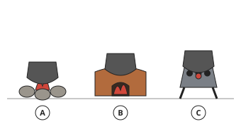

- ◻️ three-stone fireplace  
  _↳ feedback if chosen: Three stones: three-stone fireplace. A block of mud with a door: improved stove. Metal on legs with charcoal: charcoal stove._
- ✅ improved (mud) stove
- ◻️ charcoal stove  
  _↳ feedback if chosen: Three stones: three-stone fireplace. A block of mud with a door: improved stove. Metal on legs with charcoal: charcoal stove._

Full working after a second miss:

> Look at what holds the pot and what burns.  
> Fireplace B is the improved (mud) stove.  

**Practice** `he10-find` · multiple choice, level 1 · **authored key**

> Which letter shows the three-stone fireplace?

- ✅ B
- ◻️ C  
  _↳ feedback if chosen: That letter shows a different fireplace._
- ◻️ A  
  _↳ feedback if chosen: That letter shows a different fireplace._

Full working after a second miss:

> The three-stone fireplace is labelled B.  

> Which letter shows the charcoal stove?

- ◻️ A  
  _↳ feedback if chosen: That letter shows a different fireplace._
- ◻️ C  
  _↳ feedback if chosen: That letter shows a different fireplace._
- ✅ B

Full working after a second miss:

> The charcoal stove is labelled B.  

**Practice** `he10-which` · multiple choice, level 2 · **authored key**

> Which fireplace stands on legs and can be carried?

- ◻️ B  
  _↳ feedback if chosen: Think about what each fireplace is made of and how it works._
- ✅ A
- ◻️ C  
  _↳ feedback if chosen: Think about what each fireplace is made of and how it works._

Full working after a second miss:

> The charcoal stove stands on legs and can be carried.  
> It is labelled A.  

> Which fireplace has a small door at the front for the firewood?

- ◻️ A  
  _↳ feedback if chosen: Think about what each fireplace is made of and how it works._
- ◻️ B  
  _↳ feedback if chosen: Think about what each fireplace is made of and how it works._
- ✅ C

Full working after a second miss:

> The improved (mud) stove has a small door at the front for the firewood.  
> It is labelled C.  

**Practice** `he10-spot` · spot the error, level 3 · **authored key**

> One sentence is wrong. Which one?

- ◻️ An improved stove has a door in front for firewood.
- ◻️ In a drawing, a three-stone fireplace shows three stones on the ground.
- ◻️ A charcoal stove is often made of metal.
- ✅ A charcoal stove is drawn as three stones.  
  _↳ explanation: Three stones show the three-stone fireplace; a charcoal stove is a metal stove._

Full working after a second miss:

> The wrong statement is “A charcoal stove is drawn as three stones.”.  
> Three stones show the three-stone fireplace; a charcoal stove is a metal stove.  

> One sentence is wrong. Which one?

- ◻️ A charcoal stove is often made of metal.
- ✅ A charcoal stove is drawn as three stones.  
  _↳ explanation: Three stones show the three-stone fireplace; a charcoal stove is a metal stove._
- ◻️ An improved stove has a door in front for firewood.
- ◻️ In a drawing, a three-stone fireplace shows three stones on the ground.

Full working after a second miss:

> The wrong statement is “A charcoal stove is drawn as three stones.”.  
> Three stones show the three-stone fireplace; a charcoal stove is a metal stove.  

## Lesson 11: Advantages and disadvantages of a traditional kitchen

Prerequisites: 6, 7 · Skill: he11 (Advantages and disadvantages of a traditional kitchen)

**Note** (draft)

> Advantages of a traditional kitchen:
> • cheap to build with local materials (mud, wood, thatch);
> • firewood is cheap or free;
> • the smoke rack dries and preserves food;
> • smoke keeps some insects away;
> • warm in the cold season; a place where the family sits and talks.
> Disadvantages:
> • smoke hurts the eyes and the lungs;
> • soot makes walls, pots and clothes black and is hard to clean;
> • risk of fire, especially with a thatch roof;
> • earth floors are dusty and hard to keep clean;
> • it uses a lot of firewood, so trees are cut down;
> • it is often dark, and children can be burnt by the open fire.

**Card hec11-1** (draft)

> A traditional kitchen is cheap to build and to run, and its smoke rack preserves food.
>
> _Mud, wood and thatch can be found locally._  

Check question: `he11-sort` · matching, level 1 · **authored key**, reused from practice

> Traditional kitchen: sort these into advantages and disadvantages.

Groups: advantage · disadvantage
- a place for the family to sit together → **advantage**
- the earth floor is dusty → **disadvantage**
- the smoke rack preserves food → **advantage**
- soot blackens the walls and pots → **disadvantage**
- cheap to build with local materials → **advantage**
- risk of fire with a thatch roof → **disadvantage**

Full working after a second miss:

> The right pairs are:  
> a place for the family to sit together → advantage  
> the earth floor is dusty → disadvantage  
> the smoke rack preserves food → advantage  
> soot blackens the walls and pots → disadvantage  
> cheap to build with local materials → advantage  
> risk of fire with a thatch roof → disadvantage  

**Card hec11-2** (draft)

> But smoke harms the eyes and lungs, soot blackens everything, and there is a risk of fire and burns.
>
> _A thatch roof can catch fire from sparks._  

Check question: `he11-dis` · multiple choice, level 1 · **authored key**, reused from practice

> Which is a disadvantage of a traditional kitchen?

- ✅ Smoke hurts the eyes and lungs.
- ◻️ It is warm in the cold season.  
  _↳ feedback if chosen: That is an advantage._
- ◻️ It is cheap to build.  
  _↳ feedback if chosen: That is an advantage._
- ◻️ The smoke rack preserves food.  
  _↳ feedback if chosen: That is an advantage._

Full working after a second miss:

> The true statement is “Smoke hurts the eyes and lungs.”.  
> “It is warm in the cold season.” is false: That is an advantage.  
> “It is cheap to build.” is false: That is an advantage.  
> “The smoke rack preserves food.” is false: That is an advantage.  

**Card hec11-3** (draft)

> An improved stove and a window or chimney reduce the smoke in a traditional kitchen.
>
> _A chimney carries smoke out of the kitchen._  

Check question: `hec11-3-check` · multiple choice, level 1 · **authored key**

> Which change makes a traditional kitchen less smoky?

- ◻️ adding more firewood  
  _↳ feedback if chosen: More wood makes more smoke._
- ✅ making a window to let smoke out
- ◻️ using wet firewood  
  _↳ feedback if chosen: Wet wood makes more smoke._
- ◻️ cooking with the door closed  
  _↳ feedback if chosen: That keeps the smoke inside._

Full working after a second miss:

> The true statement is “making a window to let smoke out”.  
> “adding more firewood” is false: More wood makes more smoke.  
> “using wet firewood” is false: Wet wood makes more smoke.  
> “cooking with the door closed” is false: That keeps the smoke inside.  

**Worked example** (draft)

> Give one advantage and one disadvantage of the smoke in a traditional kitchen.

1. Smoke dries and preserves meat, fish and maize on the smoke rack, and keeps some insects away: an advantage.
2. Smoke also hurts the eyes and the lungs of the cook: a disadvantage.

**Answer:** Advantage: it preserves food. Disadvantage: it harms the eyes and lungs.

**Practice** `he11-sort` · matching, level 1 · **authored key**

> Traditional kitchen: sort these into advantages and disadvantages.

Groups: advantage · disadvantage
- it uses a lot of firewood → **disadvantage**
- soot blackens the walls and pots → **disadvantage**
- the earth floor is dusty → **disadvantage**
- smoke hurts the eyes and lungs → **disadvantage**
- risk of fire with a thatch roof → **disadvantage**
- the smoke rack preserves food → **advantage**

Full working after a second miss:

> The right pairs are:  
> it uses a lot of firewood → disadvantage  
> soot blackens the walls and pots → disadvantage  
> the earth floor is dusty → disadvantage  
> smoke hurts the eyes and lungs → disadvantage  
> risk of fire with a thatch roof → disadvantage  
> the smoke rack preserves food → advantage  

> Traditional kitchen: sort these into advantages and disadvantages.

Groups: advantage · disadvantage
- the smoke rack preserves food → **advantage**
- risk of fire with a thatch roof → **disadvantage**
- smoke hurts the eyes and lungs → **disadvantage**
- a place for the family to sit together → **advantage**
- warm in the cold season → **advantage**
- soot blackens the walls and pots → **disadvantage**

Full working after a second miss:

> The right pairs are:  
> the smoke rack preserves food → advantage  
> risk of fire with a thatch roof → disadvantage  
> smoke hurts the eyes and lungs → disadvantage  
> a place for the family to sit together → advantage  
> warm in the cold season → advantage  
> soot blackens the walls and pots → disadvantage  

**Practice** `he11-adv` · multiple choice, level 2 · **authored key**

> Which is an advantage of a traditional kitchen?

- ◻️ It needs electricity.  
  _↳ feedback if chosen: It uses wood, not electricity._
- ◻️ It is easy to keep clean.  
  _↳ feedback if chosen: Soot and earth floors make it hard to clean._
- ◻️ It has no fire risk.  
  _↳ feedback if chosen: Open fires and thatch roofs are a fire risk._
- ✅ It is cheap to build with local materials.

Full working after a second miss:

> The true statement is “It is cheap to build with local materials.”.  
> “It needs electricity.” is false: It uses wood, not electricity.  
> “It is easy to keep clean.” is false: Soot and earth floors make it hard to clean.  
> “It has no fire risk.” is false: Open fires and thatch roofs are a fire risk.  

> Which is an advantage of a traditional kitchen?

- ✅ The smoke rack preserves food.
- ◻️ It is free of smoke.  
  _↳ feedback if chosen: Traditional kitchens are usually smoky._
- ◻️ It is easy to keep clean.  
  _↳ feedback if chosen: Soot and earth floors make it hard to clean._
- ◻️ It has no fire risk.  
  _↳ feedback if chosen: Open fires and thatch roofs are a fire risk._

Full working after a second miss:

> The true statement is “The smoke rack preserves food.”.  
> “It is free of smoke.” is false: Traditional kitchens are usually smoky.  
> “It is easy to keep clean.” is false: Soot and earth floors make it hard to clean.  
> “It has no fire risk.” is false: Open fires and thatch roofs are a fire risk.  

**Practice** `he11-dis` · multiple choice, level 1 · **authored key**

> Which is a disadvantage of a traditional kitchen?

- ◻️ It is cheap to build.  
  _↳ feedback if chosen: That is an advantage._
- ◻️ It is warm in the cold season.  
  _↳ feedback if chosen: That is an advantage._
- ✅ It uses a lot of firewood.
- ◻️ The smoke rack preserves food.  
  _↳ feedback if chosen: That is an advantage._

Full working after a second miss:

> The true statement is “It uses a lot of firewood.”.  
> “It is cheap to build.” is false: That is an advantage.  
> “It is warm in the cold season.” is false: That is an advantage.  
> “The smoke rack preserves food.” is false: That is an advantage.  

> Which is a disadvantage of a traditional kitchen?

- ◻️ The smoke rack preserves food.  
  _↳ feedback if chosen: That is an advantage._
- ◻️ It is cheap to build.  
  _↳ feedback if chosen: That is an advantage._
- ✅ It uses a lot of firewood.
- ◻️ It is warm in the cold season.  
  _↳ feedback if chosen: That is an advantage._

Full working after a second miss:

> The true statement is “It uses a lot of firewood.”.  
> “The smoke rack preserves food.” is false: That is an advantage.  
> “It is cheap to build.” is false: That is an advantage.  
> “It is warm in the cold season.” is false: That is an advantage.  

**Practice** `he11-spot` · spot the error, level 3 · **authored key**

> One sentence is wrong. Which one?

- ◻️ A traditional kitchen is cheap to build.
- ◻️ Burning a lot of firewood leads to cutting down trees.
- ✅ Children are safe near an open fire.  
  _↳ explanation: Children can be burnt by an open fire._
- ◻️ A thatch roof can catch fire.

Full working after a second miss:

> The wrong statement is “Children are safe near an open fire.”.  
> Children can be burnt by an open fire.  

> One sentence is wrong. Which one?

- ◻️ Smoke from a wood fire can harm the lungs.
- ◻️ A thatch roof can catch fire.
- ◻️ A traditional kitchen is cheap to build.
- ✅ Soot is easy to wash off walls.  
  _↳ explanation: Soot is hard to clean._

Full working after a second miss:

> The wrong statement is “Soot is easy to wash off walls.”.  
> Soot is hard to clean.  

## Lesson 12: Care of a traditional kitchen

Prerequisites: 11 · Skill: he12 (Care of a traditional kitchen)

**Note** (draft)

> Caring for a traditional kitchen keeps it clean and safe:
> • sweep the floor every day;
> • remove the ashes when they are cold and throw them away safely (they can go on the garden);
> • remove soot and cobwebs from the walls and roof regularly;
> • keep firewood dry, stacked, and away from the fire;
> • cover water pots and food to keep out dust, insects and rats;
> • wash plates and pots after use and put them on the shelf to dry;
> • put out the fire before leaving the kitchen;
> • keep goats and chickens out;
> • repair cracks in the walls, floor and roof.

**Card hec12-1** (draft)

> Sweep the floor daily and remove ashes, soot and cobwebs to keep the kitchen clean.
>
> _Food crumbs on the floor attract insects and rats._  

Check question: `he12-sort` · matching, level 1 · **authored key**, reused from practice

> Sort these: good care or bad practice in a traditional kitchen?

Groups: good care · bad practice
- stacking firewood next to the fire → **bad practice**
- sweeping the floor every day → **good care**
- throwing hot ashes near the thatch → **bad practice**
- letting goats into the kitchen → **bad practice**
- washing pots after use → **good care**
- leaving food uncovered → **bad practice**

Full working after a second miss:

> The right pairs are:  
> stacking firewood next to the fire → bad practice  
> sweeping the floor every day → good care  
> throwing hot ashes near the thatch → bad practice  
> letting goats into the kitchen → bad practice  
> washing pots after use → good care  
> leaving food uncovered → bad practice  

**Card hec12-2** (draft)

> Keep firewood dry and away from the fire, and put the fire out before leaving.
>
> _A fire left burning can spread to the roof._  

Check question: `he12-best` · multiple choice, level 1 · **authored key**, reused from practice

> Which is the safest way to deal with ashes?

- ◻️ Put them on the smoke rack.  
  _↳ feedback if chosen: Ashes do not belong on the rack: they fall onto the food._
- ✅ Wait until they are cold, then throw them away in a safe place.
- ◻️ Throw them out while still hot.  
  _↳ feedback if chosen: Hot ashes can start a fire._
- ◻️ Pour them into the water pot.  
  _↳ feedback if chosen: That would make the drinking water dirty._

Full working after a second miss:

> The true statement is “Wait until they are cold, then throw them away in a safe place.”.  
> “Put them on the smoke rack.” is false: Ashes do not belong on the rack: they fall onto the food.  
> “Throw them out while still hot.” is false: Hot ashes can start a fire.  
> “Pour them into the water pot.” is false: That would make the drinking water dirty.  

**Card hec12-3** (draft)

> Cover water and food, and keep animals out of the kitchen.
>
> _Goats and chickens bring dirt and germs._  

Check question: `hec12-3-check` · multiple choice, level 1 · **authored key**

> Why should water pots be covered?

- ◻️ to hide the water from visitors  
  _↳ feedback if chosen: The reason is cleanliness._
- ◻️ so the pot does not break  
  _↳ feedback if chosen: The cover keeps dirt and insects out; it does not protect the pot._
- ◻️ to make the water taste sweet  
  _↳ feedback if chosen: A cover keeps water clean; it does not change the taste._
- ✅ to keep dust and insects out of the water

Full working after a second miss:

> The true statement is “to keep dust and insects out of the water”.  
> “to hide the water from visitors” is false: The reason is cleanliness.  
> “so the pot does not break” is false: The cover keeps dirt and insects out; it does not protect the pot.  
> “to make the water taste sweet” is false: A cover keeps water clean; it does not change the taste.  

**Worked example** (draft)

> After cooking, Mbong throws the hot ashes behind the kitchen near the thatch wall. What is wrong, and what should Mbong do?

1. Hot ashes can still set dry thatch or grass on fire.
2. Ashes should be removed only when they are cold, and thrown away in a safe place.

**Answer:** Let the ashes cool first, then throw them away safely, far from the thatch.

**Practice** `he12-sort` · matching, level 1 · **authored key**

> Sort these: good care or bad practice in a traditional kitchen?

Groups: good care · bad practice
- removing cold ashes → **good care**
- sweeping the floor every day → **good care**
- letting goats into the kitchen → **bad practice**
- keeping firewood dry → **good care**
- covering water pots → **good care**
- washing pots after use → **good care**

Full working after a second miss:

> The right pairs are:  
> removing cold ashes → good care  
> sweeping the floor every day → good care  
> letting goats into the kitchen → bad practice  
> keeping firewood dry → good care  
> covering water pots → good care  
> washing pots after use → good care  

> Sort these: good care or bad practice in a traditional kitchen?

Groups: good care · bad practice
- letting goats into the kitchen → **bad practice**
- leaving the fire burning when you go out → **bad practice**
- removing cold ashes → **good care**
- leaving food uncovered → **bad practice**
- stacking firewood next to the fire → **bad practice**
- sweeping the floor every day → **good care**

Full working after a second miss:

> The right pairs are:  
> letting goats into the kitchen → bad practice  
> leaving the fire burning when you go out → bad practice  
> removing cold ashes → good care  
> leaving food uncovered → bad practice  
> stacking firewood next to the fire → bad practice  
> sweeping the floor every day → good care  

**Practice** `he12-why` · multiple choice, level 2 · **authored key**

> Why do we put out the fire before leaving the kitchen?

- ◻️ to keep the walls and roof clean  
  _↳ feedback if chosen: That is the reason for a different task._
- ◻️ to remove dust and food that attract insects and rats  
  _↳ feedback if chosen: That is the reason for a different task._
- ◻️ to keep the fireplace clean and stop the fire spreading  
  _↳ feedback if chosen: That is the reason for a different task._
- ✅ to prevent a fire

Full working after a second miss:

> We put out the fire before leaving the kitchen to prevent a fire.  
> Answer: to prevent a fire.  

> Why do we sweep the floor every day?

- ◻️ so it burns well and does not catch fire by accident  
  _↳ feedback if chosen: That is the reason for a different task._
- ✅ to remove dust and food that attract insects and rats
- ◻️ to keep the fireplace clean and stop the fire spreading  
  _↳ feedback if chosen: That is the reason for a different task._
- ◻️ to keep dust and insects out of the water  
  _↳ feedback if chosen: That is the reason for a different task._

Full working after a second miss:

> We sweep the floor every day to remove dust and food that attract insects and rats.  
> Answer: to remove dust and food that attract insects and rats.  

**Practice** `he12-best` · multiple choice, level 1 · **authored key**

> Which is the safest way to deal with ashes?

- ◻️ Throw them out while still hot.  
  _↳ feedback if chosen: Hot ashes can start a fire._
- ◻️ Leave them in the fireplace for weeks.  
  _↳ feedback if chosen: Old ashes make the kitchen dirty and dusty._
- ✅ Wait until they are cold, then throw them away in a safe place.
- ◻️ Pour them into the water pot.  
  _↳ feedback if chosen: That would make the drinking water dirty._

Full working after a second miss:

> The true statement is “Wait until they are cold, then throw them away in a safe place.”.  
> “Throw them out while still hot.” is false: Hot ashes can start a fire.  
> “Leave them in the fireplace for weeks.” is false: Old ashes make the kitchen dirty and dusty.  
> “Pour them into the water pot.” is false: That would make the drinking water dirty.  

> Which is the safest way to deal with ashes?

- ◻️ Throw them out while still hot.  
  _↳ feedback if chosen: Hot ashes can start a fire._
- ◻️ Pour them into the water pot.  
  _↳ feedback if chosen: That would make the drinking water dirty._
- ◻️ Leave them in the fireplace for weeks.  
  _↳ feedback if chosen: Old ashes make the kitchen dirty and dusty._
- ✅ Wait until they are cold, then throw them away in a safe place.

Full working after a second miss:

> The true statement is “Wait until they are cold, then throw them away in a safe place.”.  
> “Throw them out while still hot.” is false: Hot ashes can start a fire.  
> “Pour them into the water pot.” is false: That would make the drinking water dirty.  
> “Leave them in the fireplace for weeks.” is false: Old ashes make the kitchen dirty and dusty.  

**Practice** `he12-spot` · spot the error, level 3 · **authored key**

> One sentence is wrong. Which one?

- ◻️ Keep firewood dry.
- ✅ Leave food uncovered so it cools faster.  
  _↳ explanation: Uncovered food attracts flies and dust: cover it._
- ◻️ Wash pots after use.
- ◻️ Repair cracks in the walls.

Full working after a second miss:

> The wrong statement is “Leave food uncovered so it cools faster.”.  
> Uncovered food attracts flies and dust: cover it.  

> One sentence is wrong. Which one?

- ◻️ Wash pots after use.
- ◻️ Sweep the kitchen floor every day.
- ◻️ Put out the fire before leaving the kitchen.
- ✅ Leave food uncovered so it cools faster.  
  _↳ explanation: Uncovered food attracts flies and dust: cover it._

Full working after a second miss:

> The wrong statement is “Leave food uncovered so it cools faster.”.  
> Uncovered food attracts flies and dust: cover it.  

## Lesson 13: Kitchen planning and management

Prerequisites: 12 · Skill: he13 (Kitchen planning and the work triangle)

**Note** (draft)

> A kitchen has three main work centres:
> • the storage centre: the fridge and cupboards;
> • the preparation and cleaning centre: the sink;
> • the cooking centre: the cooker.
> The work triangle is the path between the sink, the cooker and the fridge. A good triangle saves walking and time. A common guide: each side 1.2 m to 2.7 m long, and the three sides together 4 m to 7.9 m. Nothing (a table, a cupboard) should block the triangle.
> Managing a kitchen means: planning meals in advance, keeping it clean and tidy, storing food properly, working in a sensible order, cleaning as you go, and using fuel, water and money carefully.

**Card hec13-1** (draft)

> A kitchen has three work centres: storage (fridge), preparation and cleaning (sink), and cooking (cooker).
>
> _Vegetables come from the fridge, are washed at the sink, and are cooked on the cooker._  

Check question: `he13-centre` · multiple choice, level 1 · **authored key**, reused from practice

> Where in the kitchen should you do this: baking a cake?

- ✅ the cooker
- ◻️ the sink  
  _↳ feedback if chosen: That is a different work centre._
- ◻️ the fridge  
  _↳ feedback if chosen: That is a different work centre._

Full working after a second miss:

> The cooker: baking a cake.  
> Answer: the cooker.  

**Card hec13-2** (draft)

> The work triangle joins the sink, the cooker and the fridge. Add its three sides to find its total length.
>
> _1.5 m + 2 m + 2.2 m = 5.7 m._  

Check question: `he13-total` · number, level 1 · computed by rule, reused from practice

> How long is this work triangle altogether?

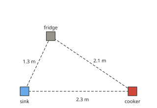

Answer: **5.7 m**
- Typed **4.4** (two) → “Add all three sides: sink–cooker, cooker–fridge and fridge–sink.”

Full working after a second miss:

> Add the three sides.  
> 2.3 + 2.1 + 1.3 = 5.7 m.  

**Card hec13-3** (draft)

> A good work triangle: each side 1.2 m to 2.7 m, and a total of 4 m to 7.9 m.
>
> _Too long: too much walking. Too short: the cook has no room to work._  

Check question: `hec13-3-check` · multiple choice, level 1 · **authored key**

> Why should the work triangle not be too long?

- ◻️ The sink would not work.  
  _↳ feedback if chosen: The sink works anywhere; the problem is the walking._
- ✅ The cook would walk too much and waste time and energy.
- ◻️ The fridge would get too cold.  
  _↳ feedback if chosen: The length of the triangle does not change the fridge._
- ◻️ The kitchen would look too small.  
  _↳ feedback if chosen: The problem is wasted walking, not looks._

Full working after a second miss:

> The true statement is “The cook would walk too much and waste time and energy.”.  
> “The sink would not work.” is false: The sink works anywhere; the problem is the walking.  
> “The fridge would get too cold.” is false: The length of the triangle does not change the fridge.  
> “The kitchen would look too small.” is false: The problem is wasted walking, not looks.  

**Worked example** (draft)

> The sink is 1.8 m from the cooker, the cooker 2.1 m from the fridge, and the fridge 2.4 m from the sink. How long is the work triangle? Is it well planned?

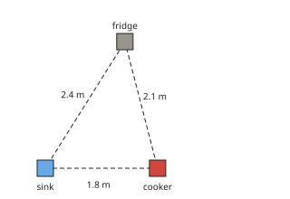

1. Total: 1.8 + 2.1 + 2.4 = 6.3 m.
2. Each side is between 1.2 m and 2.7 m.
3. The total is between 4 m and 7.9 m.

**Answer:** 6.3 m: it is well planned.

**Practice** `he13-total` · number, level 1 · computed by rule

> How long is this work triangle altogether?

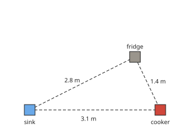

Answer: **7.3 m**
- Typed **4.5** (two) → “Add all three sides: sink–cooker, cooker–fridge and fridge–sink.”

Full working after a second miss:

> Add the three sides.  
> 3.1 + 1.4 + 2.8 = 7.3 m.  

> How long is this work triangle altogether?

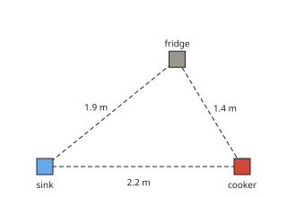

Answer: **5.5 m**
- Typed **3.6** (two) → “Add all three sides: sink–cooker, cooker–fridge and fridge–sink.”

Full working after a second miss:

> Add the three sides.  
> 2.2 + 1.4 + 1.9 = 5.5 m.  

**Practice** `he13-centre` · multiple choice, level 1 · **authored key**

> Where in the kitchen should you do this: baking a cake?

- ◻️ the fridge  
  _↳ feedback if chosen: That is a different work centre._
- ◻️ the sink  
  _↳ feedback if chosen: That is a different work centre._
- ✅ the cooker

Full working after a second miss:

> The cooker: baking a cake.  
> Answer: the cooker.  

> Where in the kitchen should you do this: baking a cake?

- ✅ the cooker
- ◻️ the fridge  
  _↳ feedback if chosen: That is a different work centre._
- ◻️ the sink  
  _↳ feedback if chosen: That is a different work centre._

Full working after a second miss:

> The cooker: baking a cake.  
> Answer: the cooker.  

**Practice** `he13-verdict` · multiple choice, level 2 · computed by rule

> Is this work triangle well planned? (Each side 1.2 m to 2.7 m; total 4 m to 7.9 m.)

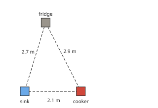

- ◻️ the total is too long: too much walking  
  _↳ feedback if chosen: Check each side first, then add them: total 7.7 m._
- ◻️ a side is too short: the work centres are crowded  
  _↳ feedback if chosen: Check each side first, then add them: total 7.7 m._
- ✅ a side is too long: too much walking

Full working after a second miss:

> Sides: 2.1 m, 2.9 m, 2.7 m. Total: 7.7 m.  
> So a side is too long: too much walking.  

> Is this work triangle well planned? (Each side 1.2 m to 2.7 m; total 4 m to 7.9 m.)

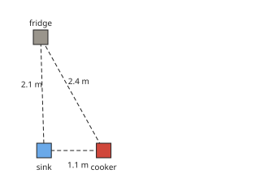

- ◻️ it is well planned  
  _↳ feedback if chosen: Check each side first, then add them: total 5.6 m._
- ◻️ the total is too short: the work centres are crowded  
  _↳ feedback if chosen: Check each side first, then add them: total 5.6 m._
- ✅ a side is too short: the work centres are crowded

Full working after a second miss:

> Sides: 1.1 m, 2.4 m, 2.1 m. Total: 5.6 m.  
> So a side is too short: the work centres are crowded.  

**Practice** `he13-manage` · multiple choice, level 2 · **authored key**

> Which is good kitchen management?

- ◻️ Leave the gas on low all day.  
  _↳ feedback if chosen: That wastes gas and is dangerous._
- ◻️ Leave the washing-up until the next day.  
  _↳ feedback if chosen: Dirty dishes attract flies and take longer to clean later._
- ◻️ Buy food without a plan.  
  _↳ feedback if chosen: Planning saves money and avoids waste._
- ✅ Turn off the cooker as soon as the food is ready.

Full working after a second miss:

> The true statement is “Turn off the cooker as soon as the food is ready.”.  
> “Leave the gas on low all day.” is false: That wastes gas and is dangerous.  
> “Leave the washing-up until the next day.” is false: Dirty dishes attract flies and take longer to clean later.  
> “Buy food without a plan.” is false: Planning saves money and avoids waste.  

> Which is good kitchen management?

- ◻️ Leave the washing-up until the next day.  
  _↳ feedback if chosen: Dirty dishes attract flies and take longer to clean later._
- ◻️ Put a table in the middle of the work triangle.  
  _↳ feedback if chosen: Nothing should block the work triangle._
- ◻️ Leave the gas on low all day.  
  _↳ feedback if chosen: That wastes gas and is dangerous._
- ✅ Turn off the cooker as soon as the food is ready.

Full working after a second miss:

> The true statement is “Turn off the cooker as soon as the food is ready.”.  
> “Leave the washing-up until the next day.” is false: Dirty dishes attract flies and take longer to clean later.  
> “Put a table in the middle of the work triangle.” is false: Nothing should block the work triangle.  
> “Leave the gas on low all day.” is false: That wastes gas and is dangerous.  

**Practice** `he13-spot` · spot the error, level 3 · **authored key**

> One sentence is wrong. Which one?

- ◻️ The sink is the cleaning centre.
- ◻️ The work triangle joins the sink, the cooker and the fridge.
- ✅ A cupboard in the middle of the work triangle makes work easier.  
  _↳ explanation: Nothing should block the work triangle._
- ◻️ A very long work triangle means too much walking.

Full working after a second miss:

> The wrong statement is “A cupboard in the middle of the work triangle makes work easier.”.  
> Nothing should block the work triangle.  

> One sentence is wrong. Which one?

- ✅ The fridge is the cooking centre.  
  _↳ explanation: The fridge is the storage centre; the cooker is the cooking centre._
- ◻️ The sink is the cleaning centre.
- ◻️ Cleaning as you go keeps the kitchen tidy.
- ◻️ A very long work triangle means too much walking.

Full working after a second miss:

> The wrong statement is “The fridge is the cooking centre.”.  
> The fridge is the storage centre; the cooker is the cooking centre.  

## Lesson 14: Different shapes of modern kitchens

Prerequisites: 13 · Skill: he14 (Shapes of modern kitchens)

**Note** (draft)

> Modern kitchens are planned in a few common shapes (seen from above):
> • One-wall (single-line): all the counters and units along one wall. Good for small spaces, but the work triangle becomes a line.
> • Galley (corridor): two rows of counters facing each other. Efficient for one cook.
> • L-shaped: counters on two walls that meet at a corner. Leaves space for a table.
> • U-shaped: counters on three walls. A lot of storage and work space.
> • Island: a free-standing counter in the middle of the room, as well as wall counters. Needs a big room.
> Choose the shape to fit the size of the room, the family and the work done in it.

**Card hec14-1** (draft)

> A kitchen plan is drawn from above. The shaded strips are the counters and units.
>
> _Count how many walls have counters, and look for a counter in the middle._  

Check question: `he14-shape` · multiple choice, level 1 · **authored key**, reused from practice

> The counters are shaded. Which kitchen shape is this?

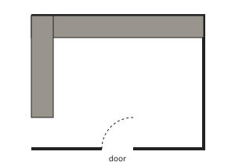

- ◻️ galley (corridor)  
  _↳ feedback if chosen: Count the walls with counters, and look for a counter standing in the middle._
- ✅ L-shaped
- ◻️ one-wall (single-line)  
  _↳ feedback if chosen: Count the walls with counters, and look for a counter standing in the middle._
- ◻️ island  
  _↳ feedback if chosen: Count the walls with counters, and look for a counter standing in the middle._

Full working after a second miss:

> Counters on two walls that meet at a corner.  
> So it is L-shaped.  

**Card hec14-2** (draft)

> One wall: one-wall kitchen. Two facing walls: galley. Two walls at a corner: L-shaped. Three walls: U-shaped. A counter in the middle: island.
>
> _A narrow kitchen with counters on both long sides is a galley._  

Check question: `he14-desc` · multiple choice, level 1 · **authored key**, reused from practice

> Which kitchen shape has counters on two walls that meet at a corner?

- ✅ L-shaped
- ◻️ island  
  _↳ feedback if chosen: Not that shape. Count the walls with counters._
- ◻️ one-wall (single-line)  
  _↳ feedback if chosen: Not that shape. Count the walls with counters._
- ◻️ U-shaped  
  _↳ feedback if chosen: Not that shape. Count the walls with counters._

Full working after a second miss:

> Counters on two walls that meet at a corner.  
> Answer: L-shaped.  

**Card hec14-3** (draft)

> Choose the shape that fits the room: one-wall or galley for small rooms, U-shaped or island for big ones.
>
> _An island needs space to walk all round it._  

Check question: `hec14-3-check` · multiple choice, level 1 · **authored key**

> Which shape suits a very small kitchen best?

- ✅ one-wall (single-line)
- ◻️ L-shaped with an island  
  _↳ feedback if chosen: That needs a big room._
- ◻️ a kitchen with two islands  
  _↳ feedback if chosen: That needs a very big room._
- ◻️ U-shaped  
  _↳ feedback if chosen: A U-shape needs space on three walls._

Full working after a second miss:

> The true statement is “one-wall (single-line)”.  
> “L-shaped with an island” is false: That needs a big room.  
> “a kitchen with two islands” is false: That needs a very big room.  
> “U-shaped” is false: A U-shape needs space on three walls.  

**Worked example** (draft)

> The drawing shows a kitchen from above; the counters are shaded. Which shape is it?

1. Count the walls with counters: three.
2. Counters on three walls make a U.

**Answer:** U-shaped

**Practice** `he14-shape` · multiple choice, level 1 · **authored key**

> The counters are shaded. Which kitchen shape is this?

- ◻️ one-wall (single-line)  
  _↳ feedback if chosen: Count the walls with counters, and look for a counter standing in the middle._
- ◻️ island  
  _↳ feedback if chosen: Count the walls with counters, and look for a counter standing in the middle._
- ✅ U-shaped
- ◻️ L-shaped  
  _↳ feedback if chosen: Count the walls with counters, and look for a counter standing in the middle._

Full working after a second miss:

> Counters on three walls: a lot of storage and work space.  
> So it is U-shaped.  

> The counters are shaded. Which kitchen shape is this?

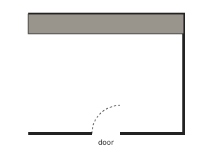

- ◻️ U-shaped  
  _↳ feedback if chosen: Count the walls with counters, and look for a counter standing in the middle._
- ◻️ island  
  _↳ feedback if chosen: Count the walls with counters, and look for a counter standing in the middle._
- ✅ one-wall (single-line)
- ◻️ galley (corridor)  
  _↳ feedback if chosen: Count the walls with counters, and look for a counter standing in the middle._

Full working after a second miss:

> Counters along one wall only: good for a very small kitchen.  
> So it is one-wall (single-line).  

**Practice** `he14-desc` · multiple choice, level 1 · **authored key**

> Which kitchen shape has counters along one wall only?

- ◻️ galley (corridor)  
  _↳ feedback if chosen: Not that shape. Count the walls with counters._
- ◻️ L-shaped  
  _↳ feedback if chosen: Not that shape. Count the walls with counters._
- ✅ one-wall (single-line)
- ◻️ island  
  _↳ feedback if chosen: Not that shape. Count the walls with counters._

Full working after a second miss:

> Counters along one wall only: good for a very small kitchen.  
> Answer: one-wall (single-line).  

> Which kitchen shape has counters on two walls that meet at a corner?

- ◻️ galley (corridor)  
  _↳ feedback if chosen: Not that shape. Count the walls with counters._
- ✅ L-shaped
- ◻️ one-wall (single-line)  
  _↳ feedback if chosen: Not that shape. Count the walls with counters._
- ◻️ island  
  _↳ feedback if chosen: Not that shape. Count the walls with counters._

Full working after a second miss:

> Counters on two walls that meet at a corner.  
> Answer: L-shaped.  

**Practice** `he14-best` · multiple choice, level 2 · **authored key**

> Which shape gives the most storage and work space around the cook?

- ◻️ galley (corridor)  
  _↳ feedback if chosen: Two walls only._
- ✅ U-shaped
- ◻️ one-wall (single-line)  
  _↳ feedback if chosen: Only one wall of storage._
- ◻️ L-shaped  
  _↳ feedback if chosen: Two walls only._

Full working after a second miss:

> The true statement is “U-shaped”.  
> “galley (corridor)” is false: Two walls only.  
> “one-wall (single-line)” is false: Only one wall of storage.  
> “L-shaped” is false: Two walls only.  

> Which shape gives the most storage and work space around the cook?

- ◻️ one-wall (single-line)  
  _↳ feedback if chosen: Only one wall of storage._
- ◻️ galley (corridor)  
  _↳ feedback if chosen: Two walls only._
- ✅ U-shaped
- ◻️ L-shaped  
  _↳ feedback if chosen: Two walls only._

Full working after a second miss:

> The true statement is “U-shaped”.  
> “one-wall (single-line)” is false: Only one wall of storage.  
> “galley (corridor)” is false: Two walls only.  
> “L-shaped” is false: Two walls only.  

**Practice** `he14-spot` · spot the error, level 3 · **authored key**

> One sentence is wrong. Which one?

- ✅ A one-wall kitchen has counters on every wall.  
  _↳ explanation: A one-wall kitchen has counters on one wall only._
- ◻️ An L-shaped kitchen has counters on two walls that meet.
- ◻️ A U-shaped kitchen has counters on three walls.
- ◻️ A one-wall kitchen suits a small room.

Full working after a second miss:

> The wrong statement is “A one-wall kitchen has counters on every wall.”.  
> A one-wall kitchen has counters on one wall only.  

> One sentence is wrong. Which one?

- ✅ An island kitchen suits a very small room.  
  _↳ explanation: An island needs a big room: you must walk round it._
- ◻️ A one-wall kitchen suits a small room.
- ◻️ A galley kitchen has two rows of counters facing each other.
- ◻️ An L-shaped kitchen has counters on two walls that meet.

Full working after a second miss:

> The wrong statement is “An island kitchen suits a very small room.”.  
> An island needs a big room: you must walk round it.  

## Lesson 15: Identify kitchen elements/Kitchen units

Prerequisites: 14 · Skill: he15 (Kitchen units and elements)

**Note** (draft)

> The main elements of a modern kitchen:
> • base units: cupboards and drawers on the floor, under the worktop, for heavy things (pots, pans, bags of rice);
> • wall units: cupboards fixed on the wall above the worktop, for light things (cups, plates, spices);
> • tall units: from the floor almost to the ceiling, for brooms and mops, or for food in bulk;
> • the worktop: the flat surface on top of the base units, where food is prepared;
> • the sink with its tap, for washing;
> • the cooker (hob and oven), sometimes with a hood above it to take away steam and smoke;
> • the fridge.

**Card hec15-1** (draft)

> Base units stand on the floor under the worktop; wall units hang on the wall above it.
>
> _Heavy pots go low, in a base unit; cups go high, in a wall unit._  

Check question: `he15-part` · multiple choice, level 1 · **authored key**, reused from practice

> What is the part labelled C?

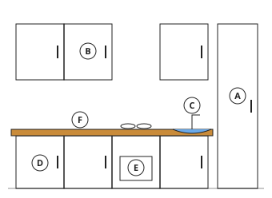

- ◻️ wall unit  
  _↳ feedback if chosen: Look again at what the letter is next to._
- ◻️ base unit  
  _↳ feedback if chosen: Look again at what the letter is next to._
- ◻️ tall unit  
  _↳ feedback if chosen: Look again at what the letter is next to._
- ✅ sink

Full working after a second miss:

> Letter C is next to the sink.  
> The sink is where food and dishes are washed.  

**Card hec15-2** (draft)

> A tall unit goes from the floor almost to the ceiling. The worktop is the flat surface for preparing food.
>
> _Brooms and mops fit in a tall unit._  

Check question: `he15-letter` · multiple choice, level 1 · **authored key**, reused from practice

> Which letter shows the sink?

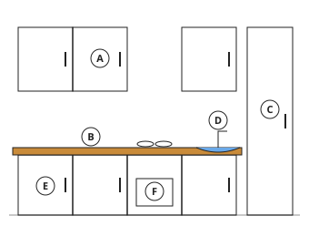

- ✅ D
- ◻️ C  
  _↳ feedback if chosen: That letter is next to a different part._
- ◻️ E  
  _↳ feedback if chosen: That letter is next to a different part._
- ◻️ F  
  _↳ feedback if chosen: That letter is next to a different part._

Full working after a second miss:

> The sink is labelled D.  

**Card hec15-3** (draft)

> The sink is for washing and the cooker for cooking; a hood above the cooker takes away steam and smoke.
>
> _The sink is placed under or near a window for light._  

Check question: `hec15-3-check` · multiple choice, level 1 · **authored key**

> Where should heavy pots and pans be kept?

- ◻️ in a wall unit, high up  
  _↳ feedback if chosen: Heavy things high up can fall on someone._
- ✅ in a base unit, under the worktop
- ◻️ on top of the cooker  
  _↳ feedback if chosen: That is unsafe and in the way._
- ◻️ on the floor by the door  
  _↳ feedback if chosen: That is in the way and dirty._

Full working after a second miss:

> The true statement is “in a base unit, under the worktop”.  
> “in a wall unit, high up” is false: Heavy things high up can fall on someone.  
> “on top of the cooker” is false: That is unsafe and in the way.  
> “on the floor by the door” is false: That is in the way and dirty.  

**Worked example** (draft)

> In the drawing, what is the part labelled B, and what would you keep in it?

1. Letter B is on a cupboard on the floor, under the worktop.
2. That is a base unit: it holds heavy things.

**Answer:** A base unit, for heavy things such as pots and pans.

**Practice** `he15-part` · multiple choice, level 1 · **authored key**

> What is the part labelled D?

- ◻️ worktop  
  _↳ feedback if chosen: Look again at what the letter is next to._
- ✅ base unit
- ◻️ wall unit  
  _↳ feedback if chosen: Look again at what the letter is next to._
- ◻️ sink  
  _↳ feedback if chosen: Look again at what the letter is next to._

Full working after a second miss:

> Letter D is next to the base unit.  
> A base unit stands on the floor under the worktop, for heavy things such as pots and pans.  

> What is the part labelled E?

- ✅ wall unit
- ◻️ cooker  
  _↳ feedback if chosen: Look again at what the letter is next to._
- ◻️ tall unit  
  _↳ feedback if chosen: Look again at what the letter is next to._
- ◻️ worktop  
  _↳ feedback if chosen: Look again at what the letter is next to._

Full working after a second miss:

> Letter E is next to the wall unit.  
> A wall unit is fixed on the wall above the worktop, for light things such as cups, plates and spices.  

**Practice** `he15-letter` · multiple choice, level 1 · **authored key**

> Which letter shows the wall unit?

- ✅ F
- ◻️ D  
  _↳ feedback if chosen: That letter is next to a different part._
- ◻️ A  
  _↳ feedback if chosen: That letter is next to a different part._
- ◻️ E  
  _↳ feedback if chosen: That letter is next to a different part._

Full working after a second miss:

> The wall unit is labelled F.  

> Which letter shows the base unit?

- ✅ F
- ◻️ B  
  _↳ feedback if chosen: That letter is next to a different part._
- ◻️ E  
  _↳ feedback if chosen: That letter is next to a different part._
- ◻️ D  
  _↳ feedback if chosen: That letter is next to a different part._

Full working after a second miss:

> The base unit is labelled F.  

**Practice** `he15-use` · multiple choice, level 2 · **authored key**

> Which part of the kitchen is for washing dishes?

- ◻️ wall unit  
  _↳ feedback if chosen: That part has a different use._
- ◻️ cooker  
  _↳ feedback if chosen: That part has a different use._
- ◻️ worktop  
  _↳ feedback if chosen: That part has a different use._
- ✅ sink

Full working after a second miss:

> Sink: washing dishes.  
> Answer: sink.  

> Which part of the kitchen is for light things such as cups and spices?

- ✅ wall unit
- ◻️ cooker  
  _↳ feedback if chosen: That part has a different use._
- ◻️ tall unit  
  _↳ feedback if chosen: That part has a different use._
- ◻️ sink  
  _↳ feedback if chosen: That part has a different use._

Full working after a second miss:

> Wall unit: light things such as cups and spices.  
> Answer: wall unit.  

**Practice** `he15-spot` · spot the error, level 3 · **authored key**

> One sentence is wrong. Which one?

- ◻️ Wall units are fixed above the worktop.
- ◻️ The worktop is where food is prepared.
- ✅ A tall unit is fixed to the ceiling.  
  _↳ explanation: A tall unit stands on the floor and reaches almost to the ceiling._
- ◻️ A hood above the cooker takes away steam and smoke.

Full working after a second miss:

> The wrong statement is “A tall unit is fixed to the ceiling.”.  
> A tall unit stands on the floor and reaches almost to the ceiling.  

> One sentence is wrong. Which one?

- ◻️ Wall units are fixed above the worktop.
- ◻️ A hood above the cooker takes away steam and smoke.
- ✅ A tall unit is fixed to the ceiling.  
  _↳ explanation: A tall unit stands on the floor and reaches almost to the ceiling._
- ◻️ The worktop is where food is prepared.

Full working after a second miss:

> The wrong statement is “A tall unit is fixed to the ceiling.”.  
> A tall unit stands on the floor and reaches almost to the ceiling.  

## Lesson 16: Types of kitchen units

Prerequisites: 15 · Skill: he16 (Types of kitchen units)

**Note** (draft)

> Types of kitchen units:
> • Base units: on the floor, under the worktop. Cupboards or drawers for heavy and large things: pots, pans, bags of food, the gas bottle.
> • Wall units: fixed to the wall above the worktop. For light things used often: cups, glasses, plates, spices.
> • Tall units: from the floor almost to the ceiling. Broom cupboards, larders (food stores), or a space for the fridge.
> • Corner units: fit into a corner, often with a turning shelf, so the space is not wasted.
> • Drawer units: drawers for cutlery, knives and kitchen cloths.
> Put heavy things low and light things high; keep things near where they are used.

**Card hec16-1** (draft)

> Heavy things go low, in base units; light things go high, in wall units.
>
> _A bag of rice goes in a base unit; a jar of spices goes in a wall unit._  

Check question: `he16-sort` · matching, level 1 · **authored key**, reused from practice

> Where should these be kept?

Groups: base unit · wall unit · tall unit
- the gas bottle → **base unit**
- glasses → **wall unit**
- jars of spices → **wall unit**
- cups → **wall unit**
- the mop → **tall unit**
- plates → **wall unit**

Full working after a second miss:

> The right pairs are:  
> the gas bottle → base unit  
> glasses → wall unit  
> jars of spices → wall unit  
> cups → wall unit  
> the mop → tall unit  
> plates → wall unit  

**Card hec16-2** (draft)

> Tall units hold long things such as brooms, or food in bulk. Corner units use the space in a corner.
>
> _A turning shelf in a corner unit lets you reach things at the back._  

Check question: `he16-which` · multiple choice, level 1 · **authored key**, reused from practice

> Which unit is from the floor almost to the ceiling?

- ◻️ base unit  
  _↳ feedback if chosen: Not that one. Read the descriptions again._
- ✅ tall unit
- ◻️ drawer unit  
  _↳ feedback if chosen: Not that one. Read the descriptions again._
- ◻️ wall unit  
  _↳ feedback if chosen: Not that one. Read the descriptions again._

Full working after a second miss:

> Tall unit: from the floor almost to the ceiling.  
> Answer: tall unit.  

**Card hec16-3** (draft)

> Drawer units hold cutlery, knives and kitchen cloths.
>
> _Spoons and forks are kept in a drawer near the worktop._  

Check question: `hec16-3-check` · multiple choice, level 1 · **authored key**

> Where are spoons and forks usually kept?

- ◻️ in the fridge  
  _↳ feedback if chosen: The fridge is for food that must stay cold._
- ✅ in a drawer unit
- ◻️ in the tall broom cupboard  
  _↳ feedback if chosen: That is for brooms and mops._
- ◻️ inside the oven  
  _↳ feedback if chosen: The oven is for cooking._

Full working after a second miss:

> The true statement is “in a drawer unit”.  
> “in the fridge” is false: The fridge is for food that must stay cold.  
> “in the tall broom cupboard” is false: That is for brooms and mops.  
> “inside the oven” is false: The oven is for cooking.  

**Worked example** (draft)

> Where should these go: a heavy cooking pot, a set of glasses, and the mop?

1. Heavy things go low: the pot goes in a base unit.
2. Light things can go high: the glasses go in a wall unit.
3. Long things such as the mop go in a tall unit.

**Answer:** Pot: base unit. Glasses: wall unit. Mop: tall unit.

**Practice** `he16-sort` · matching, level 1 · **authored key**

> Where should these be kept?

Groups: base unit · wall unit · tall unit
- plates → **wall unit**
- a bag of rice → **base unit**
- jars of spices → **wall unit**
- the gas bottle → **base unit**
- a heavy cooking pot → **base unit**
- the ironing board → **tall unit**

Full working after a second miss:

> The right pairs are:  
> plates → wall unit  
> a bag of rice → base unit  
> jars of spices → wall unit  
> the gas bottle → base unit  
> a heavy cooking pot → base unit  
> the ironing board → tall unit  

> Where should these be kept?

Groups: base unit · wall unit · tall unit
- the ironing board → **tall unit**
- jars of spices → **wall unit**
- a heavy cooking pot → **base unit**
- the mop → **tall unit**
- the broom → **tall unit**
- a bag of rice → **base unit**

Full working after a second miss:

> The right pairs are:  
> the ironing board → tall unit  
> jars of spices → wall unit  
> a heavy cooking pot → base unit  
> the mop → tall unit  
> the broom → tall unit  
> a bag of rice → base unit  

**Practice** `he16-which` · multiple choice, level 1 · **authored key**

> Which unit is a set of drawers for cutlery and cloths?

- ◻️ corner unit  
  _↳ feedback if chosen: Not that one. Read the descriptions again._
- ◻️ tall unit  
  _↳ feedback if chosen: Not that one. Read the descriptions again._
- ◻️ base unit  
  _↳ feedback if chosen: Not that one. Read the descriptions again._
- ✅ drawer unit

Full working after a second miss:

> Drawer unit: a set of drawers for cutlery and cloths.  
> Answer: drawer unit.  

> Which unit is fits into a corner, often with a turning shelf?

- ◻️ base unit  
  _↳ feedback if chosen: Not that one. Read the descriptions again._
- ✅ corner unit
- ◻️ tall unit  
  _↳ feedback if chosen: Not that one. Read the descriptions again._
- ◻️ wall unit  
  _↳ feedback if chosen: Not that one. Read the descriptions again._

Full working after a second miss:

> Corner unit: fits into a corner, often with a turning shelf.  
> Answer: corner unit.  

**Practice** `he16-why` · multiple choice, level 2 · **authored key**

> Why should heavy things be kept in base units and not wall units?

- ✅ Heavy things up high can fall and hurt someone, and are hard to lift down.
- ◻️ Wall units are only for food.  
  _↳ feedback if chosen: Wall units hold light things such as cups and plates._
- ◻️ Base units are colder.  
  _↳ feedback if chosen: The reason is safety, not temperature._
- ◻️ Base units have no doors.  
  _↳ feedback if chosen: Base units have doors or drawers; the reason is safety._

Full working after a second miss:

> The true statement is “Heavy things up high can fall and hurt someone, and are hard to lift down.”.  
> “Wall units are only for food.” is false: Wall units hold light things such as cups and plates.  
> “Base units are colder.” is false: The reason is safety, not temperature.  
> “Base units have no doors.” is false: Base units have doors or drawers; the reason is safety.  

> Why should heavy things be kept in base units and not wall units?

- ✅ Heavy things up high can fall and hurt someone, and are hard to lift down.
- ◻️ Wall units are only for food.  
  _↳ feedback if chosen: Wall units hold light things such as cups and plates._
- ◻️ Heavy things look better on the floor.  
  _↳ feedback if chosen: The reason is safety._
- ◻️ Base units have no doors.  
  _↳ feedback if chosen: Base units have doors or drawers; the reason is safety._

Full working after a second miss:

> The true statement is “Heavy things up high can fall and hurt someone, and are hard to lift down.”.  
> “Wall units are only for food.” is false: Wall units hold light things such as cups and plates.  
> “Heavy things look better on the floor.” is false: The reason is safety.  
> “Base units have no doors.” is false: Base units have doors or drawers; the reason is safety.  

**Practice** `he16-spot` · spot the error, level 3 · **authored key**

> One sentence is wrong. Which one?

- ◻️ A tall unit can hold brooms and mops.
- ✅ Knives should be left loose on the floor of the cupboard.  
  _↳ explanation: Knives are kept safely in a drawer or knife block._
- ◻️ Cutlery is kept in a drawer.
- ◻️ Cups and glasses can go in a wall unit.

Full working after a second miss:

> The wrong statement is “Knives should be left loose on the floor of the cupboard.”.  
> Knives are kept safely in a drawer or knife block.  

> One sentence is wrong. Which one?

- ◻️ Cutlery is kept in a drawer.
- ◻️ A tall unit can hold brooms and mops.
- ✅ The gas bottle should go in a high wall unit.  
  _↳ explanation: Heavy things such as the gas bottle go low, in a base unit._
- ◻️ A corner unit uses the space in a corner.

Full working after a second miss:

> The wrong statement is “The gas bottle should go in a high wall unit.”.  
> Heavy things such as the gas bottle go low, in a base unit.  

## Lesson 17: Points to consider when planning a modern kitchen

Prerequisites: 13, 16 · Skill: he17 (Planning a modern kitchen)

**Note** (draft)

> Points to consider when planning a modern kitchen:
> • the size of the room and of the family;
> • the budget: how much money there is;
> • the work triangle between the sink, cooker and fridge;
> • lighting: windows for daylight, and lamps over the work areas;
> • ventilation: windows, an extractor fan or a hood, to remove smoke, steam and smells;
> • water supply and drainage: taps and a drain for the sink;
> • electricity: enough sockets, away from water;
> • safety: the cooker away from doors and curtains, a fire blanket or extinguisher;
> • surfaces that are easy to clean, and enough storage;
> • being close to the dining area.

**Card hec17-1** (draft)

> Plan for the people and the money: the size of the family and the budget.
>
> _A large family needs more storage and work space._  

Check question: `he17-point` · multiple choice, level 1 · **authored key**, reused from practice

> Which point was not planned well?
> Smoke and steam stay in the kitchen.

- ◻️ the work triangle  
  _↳ feedback if chosen: Not that one. What is the problem here?_
- ◻️ water supply and drainage  
  _↳ feedback if chosen: Not that one. What is the problem here?_
- ◻️ the budget (cost)  
  _↳ feedback if chosen: Not that one. What is the problem here?_
- ✅ ventilation

Full working after a second miss:

> Ventilation: Smoke and steam stay in the kitchen.  
> Answer: ventilation.  

**Card hec17-2** (draft)

> Plan for light, air and water: lighting, ventilation, water supply and drainage.
>
> _A window over the sink gives light and lets steam out._  

Check question: `he17-vent` · multiple choice, level 1 · **authored key**, reused from practice

> Why does a kitchen need good ventilation?

- ◻️ so that no lights are needed  
  _↳ feedback if chosen: Light and air are both needed._
- ◻️ to make the food cook faster  
  _↳ feedback if chosen: Ventilation removes smoke and steam; it does not cook food._
- ✅ to remove smoke, steam and cooking smells
- ◻️ to save water  
  _↳ feedback if chosen: Ventilation is about air, not water._

Full working after a second miss:

> The true statement is “to remove smoke, steam and cooking smells”.  
> “so that no lights are needed” is false: Light and air are both needed.  
> “to make the food cook faster” is false: Ventilation removes smoke and steam; it does not cook food.  
> “to save water” is false: Ventilation is about air, not water.  

**Card hec17-3** (draft)

> Plan for safety: keep the cooker away from doors and curtains, and sockets away from water.
>
> _Water near a socket can give an electric shock._  

Check question: `hec17-3-check` · multiple choice, level 1 · **authored key**

> Which plan is safe?

- ◻️ a socket right next to the tap  
  _↳ feedback if chosen: Water near electricity can give a shock._
- ◻️ curtains hanging over the cooker  
  _↳ feedback if chosen: Curtains can catch fire._
- ◻️ the cooker next to the door  
  _↳ feedback if chosen: People passing can knock hot pots._
- ✅ the cooker away from the door and the curtains

Full working after a second miss:

> The true statement is “the cooker away from the door and the curtains”.  
> “a socket right next to the tap” is false: Water near electricity can give a shock.  
> “curtains hanging over the cooker” is false: Curtains can catch fire.  
> “the cooker next to the door” is false: People passing can knock hot pots.  

**Worked example** (draft)

> In a new kitchen, the cooker is placed under a window with curtains, next to the door. Which point was forgotten, and why does it matter?

1. Curtains can catch fire from the cooker.
2. People passing through the door can knock pots of hot food.
3. So the point forgotten is safety.

**Answer:** Safety: keep the cooker away from curtains and doors.

**Practice** `he17-point` · multiple choice, level 1 · **authored key**

> Which point was not planned well?
> There is only a little money.

- ◻️ the size of the family  
  _↳ feedback if chosen: Not that one. What is the problem here?_
- ◻️ ventilation  
  _↳ feedback if chosen: Not that one. What is the problem here?_
- ◻️ lighting  
  _↳ feedback if chosen: Not that one. What is the problem here?_
- ✅ the budget (cost)

Full working after a second miss:

> The budget (cost): There is only a little money.  
> Answer: the budget (cost).  

> Which point was not planned well?
> The kitchen is dark and the cook cannot see well.

- ✅ lighting
- ◻️ ventilation  
  _↳ feedback if chosen: Not that one. What is the problem here?_
- ◻️ the size of the family  
  _↳ feedback if chosen: Not that one. What is the problem here?_
- ◻️ water supply and drainage  
  _↳ feedback if chosen: Not that one. What is the problem here?_

Full working after a second miss:

> Lighting: The kitchen is dark and the cook cannot see well.  
> Answer: lighting.  

**Practice** `he17-sort` · matching, level 2 · **authored key**

> Sort these: good or poor kitchen planning?

Groups: good planning · poor planning
- a fridge far from the sink and cooker → **poor planning**
- the kitchen close to the dining area → **good planning**
- curtains near the cooker → **poor planning**
- sockets away from the sink → **good planning**
- a window over the sink → **good planning**
- no window or fan → **poor planning**

Full working after a second miss:

> The right pairs are:  
> a fridge far from the sink and cooker → poor planning  
> the kitchen close to the dining area → good planning  
> curtains near the cooker → poor planning  
> sockets away from the sink → good planning  
> a window over the sink → good planning  
> no window or fan → poor planning  

> Sort these: good or poor kitchen planning?

Groups: good planning · poor planning
- a window over the sink → **good planning**
- curtains near the cooker → **poor planning**
- the kitchen close to the dining area → **good planning**
- a hood above the cooker → **good planning**
- surfaces that are easy to clean → **good planning**
- no window or fan → **poor planning**

Full working after a second miss:

> The right pairs are:  
> a window over the sink → good planning  
> curtains near the cooker → poor planning  
> the kitchen close to the dining area → good planning  
> a hood above the cooker → good planning  
> surfaces that are easy to clean → good planning  
> no window or fan → poor planning  

**Practice** `he17-vent` · multiple choice, level 1 · **authored key**

> Why does a kitchen need good ventilation?

- ◻️ so that no lights are needed  
  _↳ feedback if chosen: Light and air are both needed._
- ◻️ to keep the fridge cold  
  _↳ feedback if chosen: The fridge keeps itself cold._
- ✅ to remove smoke, steam and cooking smells
- ◻️ to make the food cook faster  
  _↳ feedback if chosen: Ventilation removes smoke and steam; it does not cook food._

Full working after a second miss:

> The true statement is “to remove smoke, steam and cooking smells”.  
> “so that no lights are needed” is false: Light and air are both needed.  
> “to keep the fridge cold” is false: The fridge keeps itself cold.  
> “to make the food cook faster” is false: Ventilation removes smoke and steam; it does not cook food.  

> Why does a kitchen need good ventilation?

- ◻️ to keep the fridge cold  
  _↳ feedback if chosen: The fridge keeps itself cold._
- ◻️ to make the food cook faster  
  _↳ feedback if chosen: Ventilation removes smoke and steam; it does not cook food._
- ✅ to remove smoke, steam and cooking smells
- ◻️ so that no lights are needed  
  _↳ feedback if chosen: Light and air are both needed._

Full working after a second miss:

> The true statement is “to remove smoke, steam and cooking smells”.  
> “to keep the fridge cold” is false: The fridge keeps itself cold.  
> “to make the food cook faster” is false: Ventilation removes smoke and steam; it does not cook food.  
> “so that no lights are needed” is false: Light and air are both needed.  

**Practice** `he17-spot` · spot the error, level 3 · **authored key**

> One sentence is wrong. Which one?

- ◻️ Good lighting helps the cook work safely.
- ◻️ Surfaces should be easy to clean.
- ◻️ A hood or fan helps remove steam and smoke.
- ✅ Curtains should hang next to the cooker.  
  _↳ explanation: Curtains near a cooker can catch fire._

Full working after a second miss:

> The wrong statement is “Curtains should hang next to the cooker.”.  
> Curtains near a cooker can catch fire.  

> One sentence is wrong. Which one?

- ◻️ Good lighting helps the cook work safely.
- ◻️ A hood or fan helps remove steam and smoke.
- ✅ Sockets should be placed right next to the sink.  
  _↳ explanation: Water and electricity together are dangerous._
- ◻️ The budget must be considered.

Full working after a second miss:

> The wrong statement is “Sockets should be placed right next to the sink.”.  
> Water and electricity together are dangerous.  

## Lesson 20: Advantages of time management in the kitchen

Prerequisites: 13 · Skill: he20 (Time management in the kitchen)

**Note** (draft)

> Time management in the kitchen means planning work so that it is done well and on time.
> Advantages:
> • meals are ready on time;
> • the cook saves energy and is less tired and stressed;
> • fuel, water and money are saved;
> • there are fewer accidents, because the cook does not rush;
> • there is time for other activities: school work, rest, family.
> How to manage time:
> • plan the menu and the shopping;
> • prepare all the ingredients first;
> • dovetail: do two jobs at once (wash up while the rice boils);
> • use labour-saving equipment;
> • clean as you go.
> Order of work: plan the menu → buy the food → prepare the ingredients → cook → serve → wash up.

**Card hec20-1** (draft)

> Managing time in the kitchen means meals on time, less tiredness, fewer accidents, and fuel and money saved.
>
> _A cook who rushes is more likely to get burnt._  

Check question: `he20-adv` · multiple choice, level 1 · **authored key**, reused from practice

> Which is an advantage of managing time in the kitchen?

- ◻️ The cook must rush.  
  _↳ feedback if chosen: Good planning means the cook does not need to rush._
- ◻️ More fuel is used.  
  _↳ feedback if chosen: Good time management saves fuel._
- ◻️ The food tastes of smoke.  
  _↳ feedback if chosen: That has nothing to do with time management._
- ✅ The cook is less tired.

Full working after a second miss:

> The true statement is “The cook is less tired.”.  
> “The cook must rush.” is false: Good planning means the cook does not need to rush.  
> “More fuel is used.” is false: Good time management saves fuel.  
> “The food tastes of smoke.” is false: That has nothing to do with time management.  

**Card hec20-2** (draft)

> Ways to save time: plan the menu, prepare ingredients first, dovetail, use labour-saving equipment, clean as you go.
>
> _Dovetailing: wash up while the rice boils._  

Check question: `he20-how` · multiple choice, level 1 · **authored key**, reused from practice

> Which way of saving time is this?
> grinding pepper with a blender instead of a grinding stone

- ✅ using labour-saving equipment
- ◻️ planning the menu  
  _↳ feedback if chosen: Not that one. Read what the cook does._
- ◻️ cleaning as you go  
  _↳ feedback if chosen: Not that one. Read what the cook does._
- ◻️ dovetailing  
  _↳ feedback if chosen: Not that one. Read what the cook does._

Full working after a second miss:

> Using labour-saving equipment: grinding pepper with a blender instead of a grinding stone.  
> Answer: using labour-saving equipment.  

**Card hec20-3** (draft)

> Work in order: plan the menu, buy the food, prepare, cook, serve, then wash up.
>
> _Planning first means nothing is forgotten at the market._  

Check question: `hec20-3-check` · multiple choice, level 1 · **authored key**

> What should come first when preparing a meal?

- ◻️ washing up  
  _↳ feedback if chosen: Washing up comes at the end._
- ✅ planning the menu
- ◻️ cooking  
  _↳ feedback if chosen: You must plan, buy and prepare before cooking._
- ◻️ eating  
  _↳ feedback if chosen: Eating comes after the food is served._

Full working after a second miss:

> The true statement is “planning the menu”.  
> “washing up” is false: Washing up comes at the end.  
> “cooking” is false: You must plan, buy and prepare before cooking.  
> “eating” is false: Eating comes after the food is served.  

**Worked example** (draft)

> Lum must cook rice and stew and wash yesterday's pots before lunch. How can dovetailing save time?

1. Start the rice first, since it takes the longest.
2. While the rice boils, make the stew and wash the pots.
3. Doing jobs at the same time is dovetailing: the meal is ready sooner.

**Answer:** Wash the pots and make the stew while the rice boils.

**Practice** `he20-adv` · multiple choice, level 1 · **authored key**

> Which is an advantage of managing time in the kitchen?

- ✅ The cook is less tired.
- ◻️ The food tastes of smoke.  
  _↳ feedback if chosen: That has nothing to do with time management._
- ◻️ The cook must rush.  
  _↳ feedback if chosen: Good planning means the cook does not need to rush._
- ◻️ Meals are always late.  
  _↳ feedback if chosen: Good time management makes meals ready on time._

Full working after a second miss:

> The true statement is “The cook is less tired.”.  
> “The food tastes of smoke.” is false: That has nothing to do with time management.  
> “The cook must rush.” is false: Good planning means the cook does not need to rush.  
> “Meals are always late.” is false: Good time management makes meals ready on time.  

> Which is an advantage of managing time in the kitchen?

- ◻️ More fuel is used.  
  _↳ feedback if chosen: Good time management saves fuel._
- ✅ Meals are ready on time.
- ◻️ The food tastes of smoke.  
  _↳ feedback if chosen: That has nothing to do with time management._
- ◻️ The cook must rush.  
  _↳ feedback if chosen: Good planning means the cook does not need to rush._

Full working after a second miss:

> The true statement is “Meals are ready on time.”.  
> “More fuel is used.” is false: Good time management saves fuel.  
> “The food tastes of smoke.” is false: That has nothing to do with time management.  
> “The cook must rush.” is false: Good planning means the cook does not need to rush.  

**Practice** `he20-how` · multiple choice, level 1 · **authored key**

> Which way of saving time is this?
> washing each pot as soon as you finish with it

- ◻️ dovetailing  
  _↳ feedback if chosen: Not that one. Read what the cook does._
- ◻️ planning the menu  
  _↳ feedback if chosen: Not that one. Read what the cook does._
- ✅ cleaning as you go
- ◻️ using labour-saving equipment  
  _↳ feedback if chosen: Not that one. Read what the cook does._

Full working after a second miss:

> Cleaning as you go: washing each pot as soon as you finish with it.  
> Answer: cleaning as you go.  

> Which way of saving time is this?
> doing two jobs at the same time, such as washing up while the rice boils

- ◻️ using labour-saving equipment  
  _↳ feedback if chosen: Not that one. Read what the cook does._
- ◻️ cleaning as you go  
  _↳ feedback if chosen: Not that one. Read what the cook does._
- ◻️ planning the menu  
  _↳ feedback if chosen: Not that one. Read what the cook does._
- ✅ dovetailing

Full working after a second miss:

> Dovetailing: doing two jobs at the same time, such as washing up while the rice boils.  
> Answer: dovetailing.  

**Practice** `he20-order` · ordering, level 2 · **authored key**

> Put the work in order.

Shown as: plan the menu · wash up · prepare the ingredients · buy the food · cook · serve
Correct order: plan the menu → buy the food → prepare the ingredients → cook → serve → wash up

Full working after a second miss:

> The correct order is: plan the menu → buy the food → prepare the ingredients → cook → serve → wash up.  

> Put the work in order.

Shown as: serve · plan the menu · wash up · buy the food · cook · prepare the ingredients
Correct order: plan the menu → buy the food → prepare the ingredients → cook → serve → wash up

Full working after a second miss:

> The correct order is: plan the menu → buy the food → prepare the ingredients → cook → serve → wash up.  

**Practice** `he20-spot` · spot the error, level 3 · **authored key**

> One sentence is wrong. Which one?

- ◻️ A blender can save time.
- ✅ Time management wastes fuel.  
  _↳ explanation: Good time management saves fuel._
- ◻️ Cleaning as you go saves time at the end.
- ◻️ Planning the menu saves time at the market.

Full working after a second miss:

> The wrong statement is “Time management wastes fuel.”.  
> Good time management saves fuel.  

> One sentence is wrong. Which one?

- ◻️ A blender can save time.
- ◻️ Cleaning as you go saves time at the end.
- ◻️ Dovetailing means doing two jobs at once.
- ✅ Time management wastes fuel.  
  _↳ explanation: Good time management saves fuel._

Full working after a second miss:

> The wrong statement is “Time management wastes fuel.”.  
> Good time management saves fuel.  

## Lesson 21: Care of a modern kitchen

Prerequisites: 15 · Skill: he21 (Care of a modern kitchen)

**Note** (draft)

> Caring for a modern kitchen keeps it clean, safe and working well:
> • wipe worktops, tables and the cooker after use;
> • clean spills on the cooker when it is cool;
> • wash and dry dishes; keep the sink and drain clean, and never pour fat or oil down the sink;
> • empty and wash the dustbin often;
> • sweep and mop the floor;
> • defrost and clean the fridge regularly, and throw away old food;
> • keep food covered and stored in the right place;
> • switch off appliances after use; check gas taps and pipes for leaks;
> • clean cupboards and wall units from time to time.

**Card hec21-1** (draft)

> Wipe worktops and the cooker after use, sweep and mop the floor, and empty the dustbin often.
>
> _Crumbs and a full bin attract flies, cockroaches and rats._  

Check question: `he21-sort` · matching, level 1 · **authored key**, reused from practice

> Sort these: good care or bad practice in a modern kitchen?

Groups: good care · bad practice
- pouring oil down the sink → **bad practice**
- leaving the gas tap on → **bad practice**
- cleaning the hot cooker with a wet cloth → **bad practice**
- emptying the dustbin every day → **good care**
- cleaning the fridge regularly → **good care**
- wiping the worktop after use → **good care**

Full working after a second miss:

> The right pairs are:  
> pouring oil down the sink → bad practice  
> leaving the gas tap on → bad practice  
> cleaning the hot cooker with a wet cloth → bad practice  
> emptying the dustbin every day → good care  
> cleaning the fridge regularly → good care  
> wiping the worktop after use → good care  

**Card hec21-2** (draft)

> Look after equipment: clean the cooker when cool, defrost the fridge, keep fat out of the sink.
>
> _Fat poured down the sink sets hard and blocks the drain._  

Check question: `he21-why` · multiple choice, level 1 · **authored key**, reused from practice

> Why do we empty the dustbin every day?

- ◻️ so it works well and food stays safe  
  _↳ feedback if chosen: That is the reason for a different task._
- ✅ to stop bad smells, flies and rats
- ◻️ because it blocks the drain when it cools  
  _↳ feedback if chosen: That is the reason for a different task._
- ◻️ to remove germs and food that attract insects  
  _↳ feedback if chosen: That is the reason for a different task._

Full working after a second miss:

> We empty the dustbin every day to stop bad smells, flies and rats.  
> Answer: to stop bad smells, flies and rats.  

**Card hec21-3** (draft)

> Stay safe: switch off appliances after use and check gas taps and pipes for leaks.
>
> _If you smell gas, open the windows and do not light a match or switch anything on._  

Check question: `hec21-3-check` · multiple choice, level 1 · **authored key**

> You smell gas in the kitchen. What should you do first?

- ◻️ Switch on the light to see better.  
  _↳ feedback if chosen: A spark from a switch can light the gas._
- ◻️ Close the windows and wait.  
  _↳ feedback if chosen: Fresh air is needed to clear the gas._
- ◻️ Light a match to find the leak.  
  _↳ feedback if chosen: A flame can make the gas explode._
- ✅ Open the windows and do not light anything; tell an adult.

Full working after a second miss:

> The true statement is “Open the windows and do not light anything; tell an adult.”.  
> “Switch on the light to see better.” is false: A spark from a switch can light the gas.  
> “Close the windows and wait.” is false: Fresh air is needed to clear the gas.  
> “Light a match to find the leak.” is false: A flame can make the gas explode.  

**Worked example** (draft)

> After frying plantains, Tabot pours the hot oil down the sink. Why is this a bad idea, and what should Tabot do?

1. Oil cools and becomes thick in the pipe, so the drain gets blocked.
2. Let the oil cool, keep it to use again or pour it into a container and throw it away with the rubbish.

**Answer:** It blocks the drain; let it cool and put it in a container instead.

**Practice** `he21-sort` · matching, level 1 · **authored key**

> Sort these: good care or bad practice in a modern kitchen?

Groups: good care · bad practice
- cleaning the hot cooker with a wet cloth → **bad practice**
- pouring oil down the sink → **bad practice**
- keeping old food in the fridge → **bad practice**
- wiping the worktop after use → **good care**
- covering food → **good care**
- switching off the cooker after use → **good care**

Full working after a second miss:

> The right pairs are:  
> cleaning the hot cooker with a wet cloth → bad practice  
> pouring oil down the sink → bad practice  
> keeping old food in the fridge → bad practice  
> wiping the worktop after use → good care  
> covering food → good care  
> switching off the cooker after use → good care  

> Sort these: good care or bad practice in a modern kitchen?

Groups: good care · bad practice
- cleaning the hot cooker with a wet cloth → **bad practice**
- keeping old food in the fridge → **bad practice**
- cleaning the fridge regularly → **good care**
- leaving the gas tap on → **bad practice**
- switching off the cooker after use → **good care**
- wiping the worktop after use → **good care**

Full working after a second miss:

> The right pairs are:  
> cleaning the hot cooker with a wet cloth → bad practice  
> keeping old food in the fridge → bad practice  
> cleaning the fridge regularly → good care  
> leaving the gas tap on → bad practice  
> switching off the cooker after use → good care  
> wiping the worktop after use → good care  

**Practice** `he21-why` · multiple choice, level 1 · **authored key**

> Why do we empty the dustbin every day?

- ✅ to stop bad smells, flies and rats
- ◻️ so they do not burn on and to avoid burns  
  _↳ feedback if chosen: That is the reason for a different task._
- ◻️ so it works well and food stays safe  
  _↳ feedback if chosen: That is the reason for a different task._
- ◻️ to save electricity and prevent fires  
  _↳ feedback if chosen: That is the reason for a different task._

Full working after a second miss:

> We empty the dustbin every day to stop bad smells, flies and rats.  
> Answer: to stop bad smells, flies and rats.  

> Why do we wipe the worktops after use?

- ◻️ to stop bad smells, flies and rats  
  _↳ feedback if chosen: That is the reason for a different task._
- ◻️ so it works well and food stays safe  
  _↳ feedback if chosen: That is the reason for a different task._
- ✅ to remove germs and food that attract insects
- ◻️ so they do not burn on and to avoid burns  
  _↳ feedback if chosen: That is the reason for a different task._

Full working after a second miss:

> We wipe the worktops after use to remove germs and food that attract insects.  
> Answer: to remove germs and food that attract insects.  

**Practice** `he21-fridge` · multiple choice, level 2 · **authored key**

> Why should old food be thrown out of the fridge?

- ◻️ Because the fridge only works when empty.  
  _↳ feedback if chosen: A fridge works with food in it; old food can make people ill._
- ◻️ To make the fridge colder.  
  _↳ feedback if chosen: The reason is food safety._
- ◻️ Because fridges cannot hold cooked food.  
  _↳ feedback if chosen: Cooked food can be kept for a short time._
- ✅ Old food can go bad and make people ill.

Full working after a second miss:

> The true statement is “Old food can go bad and make people ill.”.  
> “Because the fridge only works when empty.” is false: A fridge works with food in it; old food can make people ill.  
> “To make the fridge colder.” is false: The reason is food safety.  
> “Because fridges cannot hold cooked food.” is false: Cooked food can be kept for a short time.  

> Why should old food be thrown out of the fridge?

- ◻️ To save electricity only.  
  _↳ feedback if chosen: The main reason is that old food can make people ill._
- ◻️ Because fridges cannot hold cooked food.  
  _↳ feedback if chosen: Cooked food can be kept for a short time._
- ◻️ To make the fridge colder.  
  _↳ feedback if chosen: The reason is food safety._
- ✅ Old food can go bad and make people ill.

Full working after a second miss:

> The true statement is “Old food can go bad and make people ill.”.  
> “To save electricity only.” is false: The main reason is that old food can make people ill.  
> “Because fridges cannot hold cooked food.” is false: Cooked food can be kept for a short time.  
> “To make the fridge colder.” is false: The reason is food safety.  

**Practice** `he21-spot` · spot the error, level 3 · **authored key**

> One sentence is wrong. Which one?

- ◻️ The dustbin should be emptied often.
- ◻️ Spills on the cooker should be cleaned when it is cool.
- ✅ The fridge never needs cleaning.  
  _↳ explanation: The fridge should be defrosted and cleaned regularly._
- ◻️ Appliances should be switched off after use.

Full working after a second miss:

> The wrong statement is “The fridge never needs cleaning.”.  
> The fridge should be defrosted and cleaned regularly.  

> One sentence is wrong. Which one?

- ✅ A gas smell can be checked with a lit match.  
  _↳ explanation: A flame can make the gas explode._
- ◻️ The dustbin should be emptied often.
- ◻️ Food in the kitchen should be covered.
- ◻️ Spills on the cooker should be cleaned when it is cool.

Full working after a second miss:

> The wrong statement is “A gas smell can be checked with a lit match.”.  
> A flame can make the gas explode.  

