# Physics Form 1, Batch P1: drafts for review (Lessons 1–19)

Generated by `npm run review:physics` from `content/physics/*.json`. Every question and drawing below was built by the engine.
All notes, teach cards, worked examples and paper tasks are **status: draft**. “Authored key” means a person fixed the
right answer (see `AUTHORED.md`); “computed by rule” means code worked it out (a formula, a conversion, a spelling rule).

Teach mode: cards (idea + example + 1 level-1 check) → worked example → practice (levels 1–3) → the note as a summary.

## Sample rendered lesson: Lesson 16 in teach mode

### Lesson 16: Define volume & state its units; Measurement of volumes of liquids, regular & irregular solids

**Card pc16-1** (draft)

> Volume is the space a body takes up. 1 L = 1000 mL = 1000 cm³, so 1 mL = 1 cm³.
>
> _A 500 mL bottle of water holds 500 cm³ of water._  

Check question: `p16-convert1` · number, level 1 · computed by rule, reused from practice

> 13.5 L = ? cm³

Answer: **13 500 cm³**
- Typed **13.5** (small) → “Change the unit: 1 L = 1000 cm³.”

Full working after a second miss:

> 1 L = 1000 cm³.  
> 13.5 × 1000 = 13 500 cm³.  

**Card pc16-2** (draft)

> Read a measuring cylinder with your eye level with the surface, at the bottom of the curve (the meniscus).
>
> _The bottom of the meniscus is on 46 mL._  

Check question: `p16-cyl` · number, level 1 · computed by rule, reused from practice

> How much water is in the measuring cylinder?

Answer: **18 mL**
- Typed **20** (top) → “Read at the bottom of the curved surface, not at the edges.”

Hint (draft): Each small mark is 2 mL. Look at the bottom of the curve.

Full working after a second miss:

> Each small mark is 2 mL.  
> The bottom of the meniscus is on 18 mL.  

**Card pc16-3** (draft)

> A cuboid: volume = length × width × height.
>
> _A box 5 cm × 4 cm × 3 cm: 5 × 4 × 3 = 60 cm³._  

Check question: `p16-cuboid` · number, level 1 · computed by rule, reused from practice

> A box of matches is 7 cm long, 4 cm wide and 5 cm high. What is its volume?

Answer: **140 cm³**
- Typed **16** (add) → “Volume = length × width × height: multiply, do not add.”

Full working after a second miss:

> Volume = length × width × height = 7 × 4 × 5.  
> = 140 cm³.  

**Card pc16-4** (draft)

> An irregular solid: read the water level before and after the stone goes in. The difference is the stone's volume.
>
> _Before 40 mL, after 58 mL: the stone is 18 cm³._  

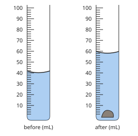

Check question: `p16-disp` · number, level 1 · computed by rule, reused from practice

> What is the volume of the stone, in cm³?

Answer: **22 cm³**
- Typed **66** (after) → “That is the water and the stone together. Subtract the reading before the stone went in.”

Hint (draft): Read both cylinders, then subtract.

Full working after a second miss:

> Before: 44 mL. After: 66 mL.  
> Stone = 66 − 44 = 22 mL = 22 cm³.  

**Worked example** (draft)

> Ewane puts water in a measuring cylinder, then lowers a stone into it. What is the volume of the stone?

1. Before: the bottom of the meniscus is at 40 mL.
2. After: it is at 58 mL.
3. Volume of the stone = 58 − 40 = 18 mL = 18 cm³.

**Answer:** 18 cm³

**Practice** (one generated question per template, easiest first)

Practice 1: `p16-convert1` · number, level 1 · computed by rule

> 8 L = ? mL

Answer: **8000 mL**
- Typed **8** (small) → “Change the unit: 1 L = 1000 mL.”

Full working after a second miss:

> 1 L = 1000 mL.  
> 8 × 1000 = 8000 mL.  

Practice 2: `p16-cyl` · number, level 1 · computed by rule

> How much water is in the measuring cylinder?

Answer: **42 mL**
- Typed **44** (top) → “Read at the bottom of the curved surface, not at the edges.”

Hint (draft): Each small mark is 2 mL. Look at the bottom of the curve.

Full working after a second miss:

> Each small mark is 2 mL.  
> The bottom of the meniscus is on 42 mL.  

Practice 3: `p16-cuboid` · number, level 1 · computed by rule

> A box of chalk is 4 cm long, 3 cm wide and 4 cm high. What is its volume?

Answer: **48 cm³**
- Typed **11** (add) → “Volume = length × width × height: multiply, do not add.”

Full working after a second miss:

> Volume = length × width × height = 4 × 3 × 4.  
> = 48 cm³.  

Practice 4: `p16-disp` · number, level 1 · computed by rule

> What is the volume of the stone, in cm³?

Answer: **12 cm³**
- Typed **54** (after) → “That is the water and the stone together. Subtract the reading before the stone went in.”

Hint (draft): Read both cylinders, then subtract.

Full working after a second miss:

> Before: 42 mL. After: 54 mL.  
> Stone = 54 − 42 = 12 mL = 12 cm³.  

Practice 5: `p16-tank` · number, level 2 · computed by rule

> A water tank is 2 m long, 3 m wide and 1 m high. How many litres of water can it hold?

Answer: **6000 L**
- Typed **6** (m3) → “That is in cubic metres. 1 m³ = 1000 L.”

Full working after a second miss:

> Volume = 2 × 3 × 1 = 6 m³.  
> 1 m³ = 1000 L, so the tank holds 6000 L.  

Practice 6: `p16-convert` · number, level 2 · computed by rule

> Convert this volume: 9.2 dm³ = ? cm³

Answer: **9200 cm³**
- Typed **0.0092** (wrong-way) → “You went the wrong way. From a bigger unit to a smaller one, the number gets bigger; from smaller to bigger, it gets smaller.”

Full working after a second miss:

> 1 dm³ = 1000 cm³.  
> Multiply by 1000: 9.2 dm³ = 9200 cm³.  

Practice 7: `p16-spot` · spot the error, level 3 · computed by rule

> One answer is wrong. Which one?

- ◻️ Water rises from 56 mL to 68 mL: the stone is 12 cm³.
- ◻️ 5 L = 5000 mL.
- ✅ A box 6 cm × 5 cm × 2 cm has a volume of 13 cm³.  
  _↳ explanation: Multiply, do not add: 6 × 5 × 2 = 60 cm³._
- ◻️ A box 5 cm × 2 cm × 5 cm has a volume of 50 cm³.

Full working after a second miss:

> The wrong statement is “A box 6 cm × 5 cm × 2 cm has a volume of 13 cm³.”.  
> Multiply, do not add: 6 × 5 × 2 = 60 cm³.  

**Summary (the note)**

> Volume is the space a body takes up. Its SI unit is the cubic metre (m³). We also use cm³, litres (L) and millilitres (mL): 1 L = 1000 mL = 1000 cm³, so 1 mL = 1 cm³; 1 m³ = 1000 L.
> • Liquids: pour into a measuring cylinder; put your eye level with the surface and read at the bottom of the curved surface (the meniscus).
> • Regular solids: volume of a cuboid = length × width × height.
> • Irregular solids (a stone): put water in a measuring cylinder and read it; lower the stone in and read again. Volume of the stone = second reading − first reading (displacement).

## All drafts

| Lesson | Title (sheet) | Status | Cards | Practice | Paper task |
|---|---|---|---|---|---|
| 1 | Definition and branches of science | draft | 3 | 4 | — |
| 2 | Prominent scientists and discoveries and contributions to improvement in the lives of humans | draft | 3 | 5 | — |
| 3 | Definition of physics and some of its branches | draft | 3 | 4 | — |
| 4 | What physicists do and how. Observing nature and seeking comprehension | draft | 3 | 4 | — |
| 5 | Some basic equipment in the Physics laboratory | draft | 3 | 4 | — |
| 6 | Safety rules for working in the Physics laboratory | draft | 3 | 3 | — |
| 7 | Job opportunities for science students | draft | 3 | 3 | — |
| 8 | Concepts of simple measurements using measuring instruments | draft | 3 | 5 | — |
| 9 | Identifying physical and non-physical quantities | draft | 3 | 5 | — |
| 10 | Some Units of measurement and S.I units | draft | 3 | 6 | — |
| 11 | States of matter and differences between them | draft | 3 | 5 | — |
| 12 | Interconversion processes | draft | 3 | 5 | — |
| 13 | Length: Definition, Units and Measurement | draft | 3 | 6 | — |
| 14 | Mass: Definition, Units and Measurement | draft | 3 | 5 | — |
| 15 | Weight: Definition, Units and Measurement. Differences between weight and mass | draft | 3 | 6 | — |
| 16 | Define volume & state its units; Measurement of volumes of liquids, regular & irregular solids | draft | 4 | 7 | — |
| 17 | Density: Definition, Units, and Measurement | draft | 3 | 5 | — |
| 18 | Temperature: Definition, Units and Measurements | draft | 3 | 5 | — |
| 19 | Safety rules on products and materials. Using information on products | draft | 3 | 6 | — |

## Lesson 1: Definition and branches of science

Prerequisites: none · Skill: p1 (Science and its branches)

**Note** (draft)

> Science is knowledge about the natural world that we get by observing carefully, asking questions and testing our ideas with experiments.
> The three main branches of science are:
> • Physics: matter and energy: forces, motion, heat, light, sound, electricity.
> • Chemistry: what substances are made of and how they change into new substances.
> • Biology: living things: plants, animals and people.
> Other branches study the Earth and the sky: Geology (rocks), Meteorology (weather) and Astronomy (planets and stars).
> Science helps us in daily life: medicines, electricity, phones, clean water and better farming all come from science.

**Card pc1-1** (draft)

> Science is knowledge we get by observing, asking questions and testing ideas with experiments.
>
> _A farmer sees that maize grows better where there is manure. A scientist tests it: two plots, one with manure, one without._  

Check question: `pc1-1-check` · multiple choice, level 1 · **authored key**

> Which sentence describes science?

- ◻️ Science is a list of facts we must believe without checking.  
  _↳ feedback if chosen: Scientists check their ideas with observations and experiments._
- ◻️ Science is the same thing as magic.  
  _↳ feedback if chosen: Science explains things by observing and testing, not by magic._
- ✅ Science is knowledge we get by observing and testing our ideas.
- ◻️ Science is only done by people in big laboratories.  
  _↳ feedback if chosen: Anyone who observes carefully and tests ideas is doing science, even at home or on a farm._

Full working after a second miss:

> The true statement is “Science is knowledge we get by observing and testing our ideas.”.  
> “Science is a list of facts we must believe without checking.” is false: Scientists check their ideas with observations and experiments.  
> “Science is the same thing as magic.” is false: Science explains things by observing and testing, not by magic.  
> “Science is only done by people in big laboratories.” is false: Anyone who observes carefully and tests ideas is doing science, even at home or on a farm.  

**Card pc1-2** (draft)

> The three main branches: Physics (matter and energy), Chemistry (substances and how they change), Biology (living things).
>
> _A rolling ball: Physics. Rusting iron: Chemistry. A growing plant: Biology._  

Check question: `p1-branch` · matching, level 1 · **authored key**, reused from practice

> Match each branch of science with what it studies.

Right-hand side (shuffled): weather · planets and stars · substances and how they change · matter, energy, forces and motion
- Astronomy → **planets and stars**
- Physics → **matter, energy, forces and motion**
- Chemistry → **substances and how they change**
- Meteorology → **weather**

Full working after a second miss:

> The right pairs are:  
> Astronomy → planets and stars  
> Physics → matter, energy, forces and motion  
> Chemistry → substances and how they change  
> Meteorology → weather  

**Card pc1-3** (draft)

> Other branches study the Earth and the sky: Geology (rocks), Meteorology (weather), Astronomy (planets and stars).
>
> _The rocks of Mount Cameroon: Geology. The rainy season: Meteorology. The Moon: Astronomy._  

Check question: `p1-which` · multiple choice, level 1 · **authored key**, reused from practice

> A scientist studies how the heart pumps blood. Which branch of science is this?

- ◻️ Chemistry  
  _↳ feedback if chosen: Not this branch. Think: is it about energy and motion, substances, living things, rocks, weather or the sky?_
- ✅ Biology
- ◻️ Physics  
  _↳ feedback if chosen: Not this branch. Think: is it about energy and motion, substances, living things, rocks, weather or the sky?_
- ◻️ Meteorology  
  _↳ feedback if chosen: Not this branch. Think: is it about energy and motion, substances, living things, rocks, weather or the sky?_

Full working after a second miss:

> The heart is part of a living body: Biology.  
> Answer: Biology.  

**Worked example** (draft)

> Ndi wants to know why the water in a black pot gets hot faster in the sun than the water in a white pot. Which branch of science studies this?

1. The question is about heat, which is a form of energy.
2. Energy, heat, light and motion are studied in Physics.

**Answer:** Physics.

**Practice** `p1-branch` · matching, level 1 · **authored key**

> Match each branch of science with what it studies.

Right-hand side (shuffled): matter, energy, forces and motion · planets and stars · weather · substances and how they change
- Chemistry → **substances and how they change**
- Meteorology → **weather**
- Physics → **matter, energy, forces and motion**
- Astronomy → **planets and stars**

Full working after a second miss:

> The right pairs are:  
> Chemistry → substances and how they change  
> Meteorology → weather  
> Physics → matter, energy, forces and motion  
> Astronomy → planets and stars  

> Match each branch of science with what it studies.

Right-hand side (shuffled): planets and stars · substances and how they change · matter, energy, forces and motion · weather
- Meteorology → **weather**
- Astronomy → **planets and stars**
- Chemistry → **substances and how they change**
- Physics → **matter, energy, forces and motion**

Full working after a second miss:

> The right pairs are:  
> Meteorology → weather  
> Astronomy → planets and stars  
> Chemistry → substances and how they change  
> Physics → matter, energy, forces and motion  

**Practice** `p1-which` · multiple choice, level 1 · **authored key**

> A scientist studies what table salt is made of. Which branch of science is this?

- ✅ Chemistry
- ◻️ Physics  
  _↳ feedback if chosen: Not this branch. Think: is it about energy and motion, substances, living things, rocks, weather or the sky?_
- ◻️ Meteorology  
  _↳ feedback if chosen: Not this branch. Think: is it about energy and motion, substances, living things, rocks, weather or the sky?_
- ◻️ Biology  
  _↳ feedback if chosen: Not this branch. Think: is it about energy and motion, substances, living things, rocks, weather or the sky?_

Full working after a second miss:

> What substances are made of is Chemistry.  
> Answer: Chemistry.  

> A scientist studies how the heart pumps blood. Which branch of science is this?

- ◻️ Geology  
  _↳ feedback if chosen: Not this branch. Think: is it about energy and motion, substances, living things, rocks, weather or the sky?_
- ◻️ Chemistry  
  _↳ feedback if chosen: Not this branch. Think: is it about energy and motion, substances, living things, rocks, weather or the sky?_
- ◻️ Physics  
  _↳ feedback if chosen: Not this branch. Think: is it about energy and motion, substances, living things, rocks, weather or the sky?_
- ✅ Biology

Full working after a second miss:

> The heart is part of a living body: Biology.  
> Answer: Biology.  

**Practice** `p1-true` · multiple choice, level 2 · **authored key**

> Which sentence is true?

- ◻️ Science cannot help farmers.  
  _↳ feedback if chosen: Science gives better seeds, fertilisers and ways to fight pests._
- ✅ Physics, Chemistry and Biology are the three main branches of science.
- ◻️ Physics is the study of living things.  
  _↳ feedback if chosen: Physics studies matter and energy. Living things are Biology._
- ◻️ Biology studies rocks and soil only.  
  _↳ feedback if chosen: Biology studies living things. Rocks are studied in Geology._

Full working after a second miss:

> The true statement is “Physics, Chemistry and Biology are the three main branches of science.”.  
> “Science cannot help farmers.” is false: Science gives better seeds, fertilisers and ways to fight pests.  
> “Physics is the study of living things.” is false: Physics studies matter and energy. Living things are Biology.  
> “Biology studies rocks and soil only.” is false: Biology studies living things. Rocks are studied in Geology.  

> Which sentence is true?

- ◻️ Physics is the study of living things.  
  _↳ feedback if chosen: Physics studies matter and energy. Living things are Biology._
- ✅ Medicines, electricity and phones all came from science.
- ◻️ Chemistry studies the weather.  
  _↳ feedback if chosen: Weather is Meteorology. Chemistry studies substances and how they change._
- ◻️ Science cannot help farmers.  
  _↳ feedback if chosen: Science gives better seeds, fertilisers and ways to fight pests._

Full working after a second miss:

> The true statement is “Medicines, electricity and phones all came from science.”.  
> “Physics is the study of living things.” is false: Physics studies matter and energy. Living things are Biology.  
> “Chemistry studies the weather.” is false: Weather is Meteorology. Chemistry studies substances and how they change.  
> “Science cannot help farmers.” is false: Science gives better seeds, fertilisers and ways to fight pests.  

**Practice** `p1-spot` · spot the error, level 3 · **authored key**

> One sentence is wrong. Which one?

- ◻️ Chemistry studies what substances are made of.
- ◻️ Physics studies forces, motion, heat, light and sound.
- ◻️ Astronomy studies the Moon, the planets and the stars.
- ✅ Biology studies how a lamp makes light.  
  _↳ explanation: Light is studied in Physics. Biology studies living things._

Full working after a second miss:

> The wrong statement is “Biology studies how a lamp makes light.”.  
> Light is studied in Physics. Biology studies living things.  

> One sentence is wrong. Which one?

- ◻️ Physics studies forces, motion, heat, light and sound.
- ◻️ Astronomy studies the Moon, the planets and the stars.
- ✅ Geology studies the weather.  
  _↳ explanation: Geology studies rocks. The weather is studied in Meteorology._
- ◻️ Meteorology helps farmers know when the rains will come.

Full working after a second miss:

> The wrong statement is “Geology studies the weather.”.  
> Geology studies rocks. The weather is studied in Meteorology.  

## Lesson 2: Prominent scientists and discoveries and contributions to improvement in the lives of humans

Prerequisites: 1 · Skill: p2 (Scientists and their discoveries)

**Note** (draft)

> Scientists have made discoveries that changed our lives.
> • Isaac Newton described the laws of motion and gravity (1687).
> • Michael Faraday showed how to make electricity with magnets (1831): this led to generators.
> • Alexander Graham Bell made the telephone (1876).
> • Marie Curie studied radioactivity (1898), used today in medicine.
> • The Wright brothers made the first powered aeroplane flight (1903).
> • Alexander Fleming discovered penicillin (1928), the first antibiotic.
> • Arthur Zang, a Cameroonian engineer, created the Cardiopad (about 2011), a tablet that records heart tests and sends them to a doctor.
> Science is done by people everywhere, including in Cameroon. You can be one of them.

**Card pc2-1** (draft)

> Many great discoveries changed daily life: the telephone, electricity from generators, aeroplanes and medicines.
>
> _Bell → the telephone. Faraday → electricity from magnets. Fleming → penicillin._  

Check question: `p2-match` · matching, level 1 · **authored key**, reused from practice

> Match each scientist with the discovery.

Right-hand side (shuffled): radioactivity (with radium and polonium) · the first powered aeroplane flight · penicillin (the first antibiotic) · the laws of motion and gravity
- Isaac Newton → **the laws of motion and gravity**
- Marie Curie → **radioactivity (with radium and polonium)**
- the Wright brothers → **the first powered aeroplane flight**
- Alexander Fleming → **penicillin (the first antibiotic)**

Full working after a second miss:

> The right pairs are:  
> Isaac Newton → the laws of motion and gravity  
> Marie Curie → radioactivity (with radium and polonium)  
> the Wright brothers → the first powered aeroplane flight  
> Alexander Fleming → penicillin (the first antibiotic)  

**Card pc2-2** (draft)

> Each discovery helps people in a different way: to talk, to travel, to have light and power, to stay healthy.
>
> _Penicillin cures infections. The telephone carries our voice far away._  

Check question: `pc2-2-check` · multiple choice, level 1 · **authored key**

> Which discovery lets people talk to each other across long distances?

- ◻️ penicillin  
  _↳ feedback if chosen: Penicillin cures infections._
- ◻️ the laws of motion  
  _↳ feedback if chosen: The laws of motion help engineers design machines and vehicles._
- ✅ the telephone
- ◻️ the aeroplane  
  _↳ feedback if chosen: The aeroplane lets people travel by air._

Full working after a second miss:

> The true statement is “the telephone”.  
> “penicillin” is false: Penicillin cures infections.  
> “the laws of motion” is false: The laws of motion help engineers design machines and vehicles.  
> “the aeroplane” is false: The aeroplane lets people travel by air.  

**Card pc2-3** (draft)

> Science is done everywhere, including in Cameroon: Arthur Zang created the Cardiopad for heart tests.
>
> _A heart test done in a village can be read by a doctor in Yaoundé._  

Check question: `p2-who` · multiple choice, level 1 · **authored key**, reused from practice

> Who is known for how to make electricity with magnets (the dynamo)?

- ◻️ Arthur Zang (Cameroon)  
  _↳ feedback if chosen: That person is known for a different discovery._
- ◻️ Marie Curie  
  _↳ feedback if chosen: That person is known for a different discovery._
- ◻️ Alexander Graham Bell  
  _↳ feedback if chosen: That person is known for a different discovery._
- ✅ Michael Faraday

Full working after a second miss:

> Michael Faraday: how to make electricity with magnets (the dynamo).  
> Answer: Michael Faraday.  

**Worked example** (draft)

> A nurse in a village health centre records a patient's heart test on a tablet and sends it to a heart doctor in Yaoundé. Which discovery made this possible, and who made it?

1. The tablet that records heart tests and sends them is the Cardiopad.
2. It was created by Arthur Zang, a Cameroonian engineer.

**Answer:** The Cardiopad, created by Arthur Zang.

**Practice** `p2-match` · matching, level 1 · **authored key**

> Match each scientist with the discovery.

Right-hand side (shuffled): penicillin (the first antibiotic) · how to make electricity with magnets (the dynamo) · radioactivity (with radium and polonium) · the laws of motion and gravity
- Michael Faraday → **how to make electricity with magnets (the dynamo)**
- Marie Curie → **radioactivity (with radium and polonium)**
- Isaac Newton → **the laws of motion and gravity**
- Alexander Fleming → **penicillin (the first antibiotic)**

Full working after a second miss:

> The right pairs are:  
> Michael Faraday → how to make electricity with magnets (the dynamo)  
> Marie Curie → radioactivity (with radium and polonium)  
> Isaac Newton → the laws of motion and gravity  
> Alexander Fleming → penicillin (the first antibiotic)  

> Match each scientist with the discovery.

Right-hand side (shuffled): the telephone · penicillin (the first antibiotic) · the Cardiopad, a tablet that records heart tests · how to make electricity with magnets (the dynamo)
- Arthur Zang (Cameroon) → **the Cardiopad, a tablet that records heart tests**
- Alexander Fleming → **penicillin (the first antibiotic)**
- Michael Faraday → **how to make electricity with magnets (the dynamo)**
- Alexander Graham Bell → **the telephone**

Full working after a second miss:

> The right pairs are:  
> Arthur Zang (Cameroon) → the Cardiopad, a tablet that records heart tests  
> Alexander Fleming → penicillin (the first antibiotic)  
> Michael Faraday → how to make electricity with magnets (the dynamo)  
> Alexander Graham Bell → the telephone  

**Practice** `p2-who` · multiple choice, level 1 · **authored key**

> Who is known for how to make electricity with magnets (the dynamo)?

- ◻️ Arthur Zang (Cameroon)  
  _↳ feedback if chosen: That person is known for a different discovery._
- ◻️ the Wright brothers  
  _↳ feedback if chosen: That person is known for a different discovery._
- ✅ Michael Faraday
- ◻️ Alexander Fleming  
  _↳ feedback if chosen: That person is known for a different discovery._

Full working after a second miss:

> Michael Faraday: how to make electricity with magnets (the dynamo).  
> Answer: Michael Faraday.  

> Who is known for the telephone?

- ◻️ Michael Faraday  
  _↳ feedback if chosen: That person is known for a different discovery._
- ◻️ Isaac Newton  
  _↳ feedback if chosen: That person is known for a different discovery._
- ◻️ Alexander Fleming  
  _↳ feedback if chosen: That person is known for a different discovery._
- ✅ Alexander Graham Bell

Full working after a second miss:

> Alexander Graham Bell: the telephone.  
> Answer: Alexander Graham Bell.  

**Practice** `p2-life` · multiple choice, level 2 · **authored key**

> How does the laws of motion and gravity help people today?

- ◻️ led to X-ray machines and cancer treatment  
  _↳ feedback if chosen: That is what a different discovery does._
- ✅ helps engineers design bridges, cars and rockets
- ◻️ made travel by air possible  
  _↳ feedback if chosen: That is what a different discovery does._
- ◻️ led to the generators that give us electric power  
  _↳ feedback if chosen: That is what a different discovery does._

Full working after a second miss:

> the laws of motion and gravity helps engineers design bridges, cars and rockets.  
> Answer: helps engineers design bridges, cars and rockets.  

> How does the telephone help people today?

- ◻️ led to X-ray machines and cancer treatment  
  _↳ feedback if chosen: That is what a different discovery does._
- ◻️ cures many infections caused by bacteria  
  _↳ feedback if chosen: That is what a different discovery does._
- ✅ lets people talk to each other across long distances
- ◻️ led to the generators that give us electric power  
  _↳ feedback if chosen: That is what a different discovery does._

Full working after a second miss:

> the telephone lets people talk to each other across long distances.  
> Answer: lets people talk to each other across long distances.  

**Practice** `p2-order` · ordering, level 2 · **authored key**

> Put these discoveries in order, from the oldest to the newest.

Shown as: Alexander Fleming: penicillin (the first antibiotic) · Michael Faraday: how to make electricity with magnets (the dynamo) · the Wright brothers: the first powered aeroplane flight · Alexander Graham Bell: the telephone
Correct order: Michael Faraday: how to make electricity with magnets (the dynamo) → Alexander Graham Bell: the telephone → the Wright brothers: the first powered aeroplane flight → Alexander Fleming: penicillin (the first antibiotic)

Full working after a second miss:

> The correct order is: Michael Faraday: how to make electricity with magnets (the dynamo) → Alexander Graham Bell: the telephone → the Wright brothers: the first powered aeroplane flight → Alexander Fleming: penicillin (the first antibiotic).  

> Put these discoveries in order, from the oldest to the newest.

Shown as: the Wright brothers: the first powered aeroplane flight · Michael Faraday: how to make electricity with magnets (the dynamo) · Alexander Fleming: penicillin (the first antibiotic) · Marie Curie: radioactivity (with radium and polonium)
Correct order: Michael Faraday: how to make electricity with magnets (the dynamo) → Marie Curie: radioactivity (with radium and polonium) → the Wright brothers: the first powered aeroplane flight → Alexander Fleming: penicillin (the first antibiotic)

Full working after a second miss:

> The correct order is: Michael Faraday: how to make electricity with magnets (the dynamo) → Marie Curie: radioactivity (with radium and polonium) → the Wright brothers: the first powered aeroplane flight → Alexander Fleming: penicillin (the first antibiotic).  

**Practice** `p2-spot` · spot the error, level 3 · **authored key**

> One sentence is wrong. Which one?

- ◻️ Alexander Fleming discovered penicillin.
- ✅ Marie Curie made the telephone.  
  _↳ explanation: Marie Curie studied radioactivity. The telephone was made by Bell._
- ◻️ Arthur Zang created the Cardiopad.
- ◻️ Alexander Graham Bell made the telephone.

Full working after a second miss:

> The wrong statement is “Marie Curie made the telephone.”.  
> Marie Curie studied radioactivity. The telephone was made by Bell.  

> One sentence is wrong. Which one?

- ◻️ Alexander Fleming discovered penicillin.
- ◻️ Alexander Graham Bell made the telephone.
- ◻️ Arthur Zang created the Cardiopad.
- ✅ Marie Curie made the telephone.  
  _↳ explanation: Marie Curie studied radioactivity. The telephone was made by Bell._

Full working after a second miss:

> The wrong statement is “Marie Curie made the telephone.”.  
> Marie Curie studied radioactivity. The telephone was made by Bell.  

## Lesson 3: Definition of physics and some of its branches

Prerequisites: 1 · Skill: p3 (Physics and its branches)

**Note** (draft)

> Physics is the branch of science that studies matter and energy and how they act on each other.
> Some branches of physics:
> • Mechanics: forces and motion (a rolling ball, a lever, a moving car).
> • Heat: temperature and how heat moves (a hot iron, a cooking pot).
> • Optics: light (mirrors, lenses, rainbows).
> • Sound (acoustics): how sound is made and travels (drums, echoes).
> • Electricity and magnetism: batteries, bulbs, wires, magnets, compasses.
> Physics is all around us: in a taxi's brakes, a solar lamp, a radio and a phone.

**Card pc3-1** (draft)

> Physics studies matter and energy: forces, motion, heat, light, sound, electricity and magnetism.
>
> _A football kicked into the air: forces and motion._  
> _A radio playing music: electricity and sound._  

Check question: `pc3-1-check` · multiple choice, level 1 · **authored key**

> Which question is a physics question?

- ◻️ What is soap made of?  
  _↳ feedback if chosen: What substances are made of is Chemistry._
- ◻️ Why do maize leaves turn yellow?  
  _↳ feedback if chosen: Plant health is Biology._
- ✅ Why does a ball roll down a slope?
- ◻️ How does a goat digest grass?  
  _↳ feedback if chosen: Digestion in an animal is Biology._

Full working after a second miss:

> The true statement is “Why does a ball roll down a slope?”.  
> “What is soap made of?” is false: What substances are made of is Chemistry.  
> “Why do maize leaves turn yellow?” is false: Plant health is Biology.  
> “How does a goat digest grass?” is false: Digestion in an animal is Biology.  

**Card pc3-2** (draft)

> Mechanics is about forces and motion. Heat is about temperature. Optics is about light.
>
> _Brakes stopping a taxi: Mechanics._  
> _A hot iron: Heat. A mirror: Optics._  

Check question: `p3-match` · matching, level 1 · **authored key**, reused from practice

> Match each branch of physics with what it studies.

Right-hand side (shuffled): temperature and how heat moves · batteries, wires and magnets · forces and motion · light, mirrors and lenses
- Mechanics → **forces and motion**
- Optics → **light, mirrors and lenses**
- Electricity and magnetism → **batteries, wires and magnets**
- Heat → **temperature and how heat moves**

Full working after a second miss:

> The right pairs are:  
> Mechanics → forces and motion  
> Optics → light, mirrors and lenses  
> Electricity and magnetism → batteries, wires and magnets  
> Heat → temperature and how heat moves  

**Card pc3-3** (draft)

> Sound (acoustics) is about how sound is made and travels. Electricity and magnetism are about batteries, wires and magnets.
>
> _A talking drum: Sound._  
> _A torch: Electricity._  

Check question: `p3-which` · multiple choice, level 1 · **authored key**, reused from practice

> Which branch of physics studies how a compass needle points north?

- ◻️ Heat  
  _↳ feedback if chosen: Not this one. Is it about forces and motion, heat, light, sound, or electricity and magnets?_
- ◻️ Optics  
  _↳ feedback if chosen: Not this one. Is it about forces and motion, heat, light, sound, or electricity and magnets?_
- ◻️ Sound (acoustics)  
  _↳ feedback if chosen: Not this one. Is it about forces and motion, heat, light, sound, or electricity and magnets?_
- ✅ Electricity and magnetism

Full working after a second miss:

> A compass is a magnet: magnetism.  
> Answer: Electricity and magnetism.  

**Worked example** (draft)

> At night, Ayuk switches on a solar lamp that was charged in the sun during the day. Which branches of physics explain this?

1. The solar panel turns sunlight into electricity, which charges the battery: Electricity.
2. The lamp then gives out light: Optics.

**Answer:** Electricity (the battery and panel) and Optics (the light).

**Practice** `p3-match` · matching, level 1 · **authored key**

> Match each branch of physics with what it studies.

Right-hand side (shuffled): batteries, wires and magnets · how sound is made and travels · temperature and how heat moves · light, mirrors and lenses
- Optics → **light, mirrors and lenses**
- Sound (acoustics) → **how sound is made and travels**
- Electricity and magnetism → **batteries, wires and magnets**
- Heat → **temperature and how heat moves**

Full working after a second miss:

> The right pairs are:  
> Optics → light, mirrors and lenses  
> Sound (acoustics) → how sound is made and travels  
> Electricity and magnetism → batteries, wires and magnets  
> Heat → temperature and how heat moves  

> Match each branch of physics with what it studies.

Right-hand side (shuffled): forces and motion · batteries, wires and magnets · how sound is made and travels · light, mirrors and lenses
- Optics → **light, mirrors and lenses**
- Mechanics → **forces and motion**
- Electricity and magnetism → **batteries, wires and magnets**
- Sound (acoustics) → **how sound is made and travels**

Full working after a second miss:

> The right pairs are:  
> Optics → light, mirrors and lenses  
> Mechanics → forces and motion  
> Electricity and magnetism → batteries, wires and magnets  
> Sound (acoustics) → how sound is made and travels  

**Practice** `p3-which` · multiple choice, level 1 · **authored key**

> Which branch of physics studies why a metal spoon in hot tea gets hot?

- ◻️ Mechanics  
  _↳ feedback if chosen: Not this one. Is it about forces and motion, heat, light, sound, or electricity and magnets?_
- ◻️ Optics  
  _↳ feedback if chosen: Not this one. Is it about forces and motion, heat, light, sound, or electricity and magnets?_
- ◻️ Electricity and magnetism  
  _↳ feedback if chosen: Not this one. Is it about forces and motion, heat, light, sound, or electricity and magnets?_
- ✅ Heat

Full working after a second miss:

> How heat moves: Heat (thermal physics).  
> Answer: Heat.  

> Which branch of physics studies how a torch battery lights a bulb?

- ◻️ Heat  
  _↳ feedback if chosen: Not this one. Is it about forces and motion, heat, light, sound, or electricity and magnets?_
- ◻️ Optics  
  _↳ feedback if chosen: Not this one. Is it about forces and motion, heat, light, sound, or electricity and magnets?_
- ✅ Electricity and magnetism
- ◻️ Sound (acoustics)  
  _↳ feedback if chosen: Not this one. Is it about forces and motion, heat, light, sound, or electricity and magnets?_

Full working after a second miss:

> Batteries and bulbs: electricity.  
> Answer: Electricity and magnetism.  

**Practice** `p3-sort` · matching, level 2 · **authored key**

> Which branch of science does each question belong to?

Groups: Physics · Chemistry · Biology
- Why do maize leaves turn yellow? → **Biology**
- Why does a ball roll down a slope? → **Physics**
- How does a bulb light up? → **Physics**
- Why does iron rust? → **Chemistry**
- How does a goat digest grass? → **Biology**

Full working after a second miss:

> The right pairs are:  
> Why do maize leaves turn yellow? → Biology  
> Why does a ball roll down a slope? → Physics  
> How does a bulb light up? → Physics  
> Why does iron rust? → Chemistry  
> How does a goat digest grass? → Biology  

> Which branch of science does each question belong to?

Groups: Physics · Chemistry · Biology
- How does a bulb light up? → **Physics**
- How does a goat digest grass? → **Biology**
- Why do maize leaves turn yellow? → **Biology**
- Why does a ball roll down a slope? → **Physics**
- Why does iron rust? → **Chemistry**

Full working after a second miss:

> The right pairs are:  
> How does a bulb light up? → Physics  
> How does a goat digest grass? → Biology  
> Why do maize leaves turn yellow? → Biology  
> Why does a ball roll down a slope? → Physics  
> Why does iron rust? → Chemistry  

**Practice** `p3-spot` · spot the error, level 3 · **authored key**

> One sentence is wrong. Which one?

- ◻️ Mechanics studies forces and motion.
- ◻️ Physics studies matter and energy.
- ✅ Optics studies sound.  
  _↳ explanation: Optics studies light. Sound is acoustics._
- ◻️ Optics studies light and mirrors.

Full working after a second miss:

> The wrong statement is “Optics studies sound.”.  
> Optics studies light. Sound is acoustics.  

> One sentence is wrong. Which one?

- ◻️ Optics studies light and mirrors.
- ✅ Optics studies sound.  
  _↳ explanation: Optics studies light. Sound is acoustics._
- ◻️ Mechanics studies forces and motion.
- ◻️ Physics studies matter and energy.

Full working after a second miss:

> The wrong statement is “Optics studies sound.”.  
> Optics studies light. Sound is acoustics.  

## Lesson 4: What physicists do and how. Observing nature and seeking comprehension

Prerequisites: 3 · Skill: p4 (How scientists work)

**Note** (draft)

> Physicists observe nature and try to understand it. They work in steps (the scientific method):
> 1. Observe something carefully.
> 2. Ask a question about it.
> 3. Suggest an answer that can be tested (a hypothesis).
> 4. Test it with an experiment.
> 5. Record and study the results.
> 6. Draw a conclusion, and share it.
> A fair test changes only one thing at a time and keeps everything else the same. Scientists measure carefully, repeat experiments, and are honest about their results, even when the results show their idea was wrong.

**Card pc4-1** (draft)

> Scientists work in steps: observe, ask a question, suggest an answer, test it, record the results, conclude.
>
> _Observe: the black pot heats faster. Question: does colour matter? Test: two pots in the sun._  

Check question: `p4-steps` · ordering, level 1 · **authored key**, reused from practice

> Put the steps of the scientific method in order.

Shown as: Suggest an answer to test (a hypothesis) · Ask a question about it · Observe something carefully · Draw a conclusion · Test it with an experiment · Record and study the results
Correct order: Observe something carefully → Ask a question about it → Suggest an answer to test (a hypothesis) → Test it with an experiment → Record and study the results → Draw a conclusion

Full working after a second miss:

> The correct order is: Observe something carefully → Ask a question about it → Suggest an answer to test (a hypothesis) → Test it with an experiment → Record and study the results → Draw a conclusion.  

**Card pc4-2** (draft)

> Each part of an investigation is one of these steps.
>
> _“Every ten minutes Bih writes the temperature in a table” is recording the results._  

Check question: `p4-which` · multiple choice, level 1 · **authored key**, reused from practice

> Bih says: “The black pot heated faster, so colour does matter.”
> Which step is this?

- ◻️ Observe something carefully  
  _↳ feedback if chosen: Not quite. Is Bih looking, asking, guessing, testing, writing results, or deciding?_
- ◻️ Test it with an experiment  
  _↳ feedback if chosen: Not quite. Is Bih looking, asking, guessing, testing, writing results, or deciding?_
- ◻️ Ask a question about it  
  _↳ feedback if chosen: Not quite. Is Bih looking, asking, guessing, testing, writing results, or deciding?_
- ✅ Draw a conclusion

Full working after a second miss:

> This is the step “Draw a conclusion”.  
> Answer: Draw a conclusion.  

**Card pc4-3** (draft)

> A fair test changes only one thing at a time and keeps everything else the same.
>
> _To test salt, both pots get the same water and the same fire; only one gets salt._  

Check question: `pc4-3-check` · multiple choice, level 1 · **authored key**

> In a fair test, how many things do you change at a time?

- ✅ only one
- ◻️ all of them  
  _↳ feedback if chosen: Then you cannot tell what caused the result._
- ◻️ none  
  _↳ feedback if chosen: If nothing changes, there is nothing to test._
- ◻️ two  
  _↳ feedback if chosen: If two things change, you cannot tell which one caused the result._

Full working after a second miss:

> The true statement is “only one”.  
> “all of them” is false: Then you cannot tell what caused the result.  
> “none” is false: If nothing changes, there is nothing to test.  
> “two” is false: If two things change, you cannot tell which one caused the result.  

**Worked example** (draft)

> Tabe wants to know if salt makes water boil faster. How can he make his test fair?

1. Use two pots that are the same, with the same amount of water, on the same fire.
2. Add salt to one pot only: change just one thing.
3. Measure the time each pot takes to boil.
4. Repeat the test to check the result.

**Answer:** Change only the salt; keep everything else the same, measure, and repeat.

**Practice** `p4-steps` · ordering, level 1 · **authored key**

> Put the steps of the scientific method in order.

Shown as: Suggest an answer to test (a hypothesis) · Test it with an experiment · Observe something carefully · Record and study the results · Draw a conclusion · Ask a question about it
Correct order: Observe something carefully → Ask a question about it → Suggest an answer to test (a hypothesis) → Test it with an experiment → Record and study the results → Draw a conclusion

Full working after a second miss:

> The correct order is: Observe something carefully → Ask a question about it → Suggest an answer to test (a hypothesis) → Test it with an experiment → Record and study the results → Draw a conclusion.  

> Put the steps of the scientific method in order.

Shown as: Observe something carefully · Record and study the results · Test it with an experiment · Ask a question about it · Suggest an answer to test (a hypothesis) · Draw a conclusion
Correct order: Observe something carefully → Ask a question about it → Suggest an answer to test (a hypothesis) → Test it with an experiment → Record and study the results → Draw a conclusion

Full working after a second miss:

> The correct order is: Observe something carefully → Ask a question about it → Suggest an answer to test (a hypothesis) → Test it with an experiment → Record and study the results → Draw a conclusion.  

**Practice** `p4-which` · multiple choice, level 1 · **authored key**

> Bih puts the same amount of water in a black pot and a white pot, side by side in the sun.
> Which step is this?

- ✅ Test it with an experiment
- ◻️ Draw a conclusion  
  _↳ feedback if chosen: Not quite. Is Bih looking, asking, guessing, testing, writing results, or deciding?_
- ◻️ Observe something carefully  
  _↳ feedback if chosen: Not quite. Is Bih looking, asking, guessing, testing, writing results, or deciding?_
- ◻️ Record and study the results  
  _↳ feedback if chosen: Not quite. Is Bih looking, asking, guessing, testing, writing results, or deciding?_

Full working after a second miss:

> This is the step “Test it with an experiment”.  
> Answer: Test it with an experiment.  

> Bih notices that water in a black pot gets hot faster than in a white pot.
> Which step is this?

- ◻️ Test it with an experiment  
  _↳ feedback if chosen: Not quite. Is Bih looking, asking, guessing, testing, writing results, or deciding?_
- ◻️ Record and study the results  
  _↳ feedback if chosen: Not quite. Is Bih looking, asking, guessing, testing, writing results, or deciding?_
- ✅ Observe something carefully
- ◻️ Suggest an answer to test (a hypothesis)  
  _↳ feedback if chosen: Not quite. Is Bih looking, asking, guessing, testing, writing results, or deciding?_

Full working after a second miss:

> This is the step “Observe something carefully”.  
> Answer: Observe something carefully.  

**Practice** `p4-fair` · multiple choice, level 2 · **authored key**

> Ndi wants to test whether plants grow taller with fertiliser. Which plan is a fair test?

- ◻️ One plant in the sun with fertiliser, one in the shade without.  
  _↳ feedback if chosen: Two things change (sun and fertiliser), so we cannot tell which one made the difference._
- ✅ Two plants of the same kind, the same pot, soil, water and sunlight; fertiliser for one plant only.
- ◻️ Give both plants fertiliser and see which grows taller.  
  _↳ feedback if chosen: Nothing is compared: both get fertiliser._
- ◻️ Ask friends whether fertiliser works.  
  _↳ feedback if chosen: A scientist tests the idea with an experiment, not by asking opinions._

Full working after a second miss:

> The true statement is “Two plants of the same kind, the same pot, soil, water and sunlight; fertiliser for one plant only.”.  
> “One plant in the sun with fertiliser, one in the shade without.” is false: Two things change (sun and fertiliser), so we cannot tell which one made the difference.  
> “Give both plants fertiliser and see which grows taller.” is false: Nothing is compared: both get fertiliser.  
> “Ask friends whether fertiliser works.” is false: A scientist tests the idea with an experiment, not by asking opinions.  

> Ndi wants to test whether plants grow taller with fertiliser. Which plan is a fair test?

- ◻️ One plant in the sun with fertiliser, one in the shade without.  
  _↳ feedback if chosen: Two things change (sun and fertiliser), so we cannot tell which one made the difference._
- ◻️ Ask friends whether fertiliser works.  
  _↳ feedback if chosen: A scientist tests the idea with an experiment, not by asking opinions._
- ◻️ Give both plants fertiliser and see which grows taller.  
  _↳ feedback if chosen: Nothing is compared: both get fertiliser._
- ✅ Two plants of the same kind, the same pot, soil, water and sunlight; fertiliser for one plant only.

Full working after a second miss:

> The true statement is “Two plants of the same kind, the same pot, soil, water and sunlight; fertiliser for one plant only.”.  
> “One plant in the sun with fertiliser, one in the shade without.” is false: Two things change (sun and fertiliser), so we cannot tell which one made the difference.  
> “Ask friends whether fertiliser works.” is false: A scientist tests the idea with an experiment, not by asking opinions.  
> “Give both plants fertiliser and see which grows taller.” is false: Nothing is compared: both get fertiliser.  

**Practice** `p4-spot` · spot the error, level 3 · **authored key**

> One sentence about how scientists work is wrong. Which one?

- ◻️ In a fair test only one thing is changed.
- ◻️ A hypothesis is an answer that can be tested.
- ◻️ Scientists repeat experiments to check their results.
- ✅ If the results do not match the idea, a scientist should change the results.  
  _↳ explanation: Scientists must be honest: if the results disagree, they change the idea, not the results._

Full working after a second miss:

> The wrong statement is “If the results do not match the idea, a scientist should change the results.”.  
> Scientists must be honest: if the results disagree, they change the idea, not the results.  

> One sentence about how scientists work is wrong. Which one?

- ✅ A scientist draws a conclusion before doing the experiment.  
  _↳ explanation: The conclusion comes after testing and studying the results._
- ◻️ In a fair test only one thing is changed.
- ◻️ Scientists repeat experiments to check their results.
- ◻️ A hypothesis is an answer that can be tested.

Full working after a second miss:

> The wrong statement is “A scientist draws a conclusion before doing the experiment.”.  
> The conclusion comes after testing and studying the results.  

## Lesson 5: Some basic equipment in the Physics laboratory

Prerequisites: none · Skill: p5 (Basic laboratory equipment)

**Note** (draft)

> Each measuring instrument measures one quantity:
> • metre rule or ruler: length (short lengths); measuring tape: long lengths;
> • beam balance or top-pan balance: mass;
> • measuring cylinder: the volume of a liquid;
> • stopwatch or stop clock: time;
> • thermometer: temperature;
> • spring balance (newton meter): weight, which is a force.
> Other equipment helps us do experiments: a retort stand and clamp hold apparatus; a beaker holds liquids; a Bunsen burner or spirit lamp heats things; a magnifying glass makes small things look bigger.
> Always choose the instrument that fits what you measure.

**Card pc5-1** (draft)

> Each instrument measures one quantity: a ruler measures length, a balance measures mass, a thermometer measures temperature.
>
> _A stopwatch measures time._  
> _A measuring cylinder measures the volume of a liquid._  

Check question: `p5-match` · matching, level 1 · **authored key**, reused from practice

> Match each instrument with what it measures.

Groups: temperature · length · mass · time
- metre rule → **length**
- thermometer → **temperature**
- beam balance → **mass**
- stopwatch → **time**

Full working after a second miss:

> The right pairs are:  
> metre rule → length  
> thermometer → temperature  
> beam balance → mass  
> stopwatch → time  

**Card pc5-2** (draft)

> Choose the instrument that fits: a metre rule for a desk, a measuring tape for a field.
>
> _The length of a football field: a measuring tape._  

Check question: `p5-choose` · multiple choice, level 1 · **authored key**, reused from practice

> Which instrument would you use to measure the length of your desk?

- ✅ metre rule
- ◻️ stopwatch  
  _↳ feedback if chosen: That instrument measures something else. Ask: is it a length, a mass, a volume, a time, a temperature or a weight?_
- ◻️ measuring tape  
  _↳ feedback if chosen: That instrument measures something else. Ask: is it a length, a mass, a volume, a time, a temperature or a weight?_
- ◻️ measuring cylinder  
  _↳ feedback if chosen: That instrument measures something else. Ask: is it a length, a mass, a volume, a time, a temperature or a weight?_

Full working after a second miss:

> To measure the length of your desk, use a metre rule.  
> Answer: metre rule.  

**Card pc5-3** (draft)

> Some equipment does not measure: it holds or heats things. A retort stand holds; a Bunsen burner heats; a beaker holds liquids.
>
> _A thermometer held in hot water by a clamp on a retort stand._  

Check question: `pc5-3-check` · multiple choice, level 1 · **authored key**

> Which piece of equipment is used to HOLD apparatus in place?

- ◻️ measuring cylinder  
  _↳ feedback if chosen: A measuring cylinder measures the volume of a liquid._
- ✅ retort stand and clamp
- ◻️ stopwatch  
  _↳ feedback if chosen: A stopwatch measures time._
- ◻️ thermometer  
  _↳ feedback if chosen: A thermometer measures temperature._

Full working after a second miss:

> The true statement is “retort stand and clamp”.  
> “measuring cylinder” is false: A measuring cylinder measures the volume of a liquid.  
> “stopwatch” is false: A stopwatch measures time.  
> “thermometer” is false: A thermometer measures temperature.  

**Worked example** (draft)

> Ewane wants to find out how long it takes a pot of water to boil and how hot the water gets. Which two instruments does he need?

1. “How long” is a time: he needs a stopwatch.
2. “How hot” is a temperature: he needs a thermometer.

**Answer:** A stopwatch and a thermometer.

**Practice** `p5-match` · matching, level 1 · **authored key**

> Match each instrument with what it measures.

Groups: time · volume of a liquid · mass · length
- stopwatch → **time**
- top-pan balance → **mass**
- measuring cylinder → **volume of a liquid**
- metre rule → **length**

Full working after a second miss:

> The right pairs are:  
> stopwatch → time  
> top-pan balance → mass  
> measuring cylinder → volume of a liquid  
> metre rule → length  

> Match each instrument with what it measures.

Groups: weight (a force) · mass · length · volume of a liquid
- spring balance (newton meter) → **weight (a force)**
- measuring tape → **length**
- top-pan balance → **mass**
- measuring cylinder → **volume of a liquid**

Full working after a second miss:

> The right pairs are:  
> spring balance (newton meter) → weight (a force)  
> measuring tape → length  
> top-pan balance → mass  
> measuring cylinder → volume of a liquid  

**Practice** `p5-choose` · multiple choice, level 1 · **authored key**

> Which instrument would you use to measure the length of your desk?

- ◻️ top-pan balance  
  _↳ feedback if chosen: That instrument measures something else. Ask: is it a length, a mass, a volume, a time, a temperature or a weight?_
- ✅ metre rule
- ◻️ thermometer  
  _↳ feedback if chosen: That instrument measures something else. Ask: is it a length, a mass, a volume, a time, a temperature or a weight?_
- ◻️ spring balance (newton meter)  
  _↳ feedback if chosen: That instrument measures something else. Ask: is it a length, a mass, a volume, a time, a temperature or a weight?_

Full working after a second miss:

> To measure the length of your desk, use a metre rule.  
> Answer: metre rule.  

> Which instrument would you use to measure the volume of some palm oil?

- ✅ measuring cylinder
- ◻️ measuring tape  
  _↳ feedback if chosen: That instrument measures something else. Ask: is it a length, a mass, a volume, a time, a temperature or a weight?_
- ◻️ beam balance  
  _↳ feedback if chosen: That instrument measures something else. Ask: is it a length, a mass, a volume, a time, a temperature or a weight?_
- ◻️ top-pan balance  
  _↳ feedback if chosen: That instrument measures something else. Ask: is it a length, a mass, a volume, a time, a temperature or a weight?_

Full working after a second miss:

> To measure the volume of some palm oil, use a measuring cylinder.  
> Answer: measuring cylinder.  

**Practice** `p5-sort` · matching, level 2 · **authored key**

> Does each piece of equipment measure something, or hold or heat things?

Groups: measures something · holds or heats
- tripod stand → **holds or heats**
- stopwatch → **measures something**
- Bunsen burner → **holds or heats**
- metre rule → **measures something**
- thermometer → **measures something**

Full working after a second miss:

> The right pairs are:  
> tripod stand → holds or heats  
> stopwatch → measures something  
> Bunsen burner → holds or heats  
> metre rule → measures something  
> thermometer → measures something  

> Does each piece of equipment measure something, or hold or heat things?

Groups: measures something · holds or heats
- retort stand → **holds or heats**
- thermometer → **measures something**
- Bunsen burner → **holds or heats**
- beaker → **holds or heats**
- beam balance → **measures something**

Full working after a second miss:

> The right pairs are:  
> retort stand → holds or heats  
> thermometer → measures something  
> Bunsen burner → holds or heats  
> beaker → holds or heats  
> beam balance → measures something  

**Practice** `p5-spot` · spot the error, level 3 · **authored key**

> One sentence is wrong. Which one?

- ◻️ A stopwatch measures time.
- ◻️ A measuring tape is good for long lengths.
- ✅ A spring balance measures temperature.  
  _↳ explanation: A spring balance measures weight, which is a force._
- ◻️ A measuring cylinder measures the volume of a liquid.

Full working after a second miss:

> The wrong statement is “A spring balance measures temperature.”.  
> A spring balance measures weight, which is a force.  

> One sentence is wrong. Which one?

- ◻️ A measuring cylinder measures the volume of a liquid.
- ✅ A spring balance measures temperature.  
  _↳ explanation: A spring balance measures weight, which is a force._
- ◻️ A measuring tape is good for long lengths.
- ◻️ A beam balance measures mass.

Full working after a second miss:

> The wrong statement is “A spring balance measures temperature.”.  
> A spring balance measures weight, which is a force.  

## Lesson 6: Safety rules for working in the Physics laboratory

Prerequisites: 5 · Skill: p6 (Laboratory safety)

**Note** (draft)

> The laboratory is safe when everyone follows the rules.
> • Enter only with the teacher's permission, and follow instructions.
> • Walk; never run or play.
> • Do not eat, drink or taste anything.
> • Tie back long hair and keep loose clothes away from flames.
> • Keep water away from electric sockets and never touch them with wet hands.
> • Do not touch apparatus that has just been heated.
> • Never pick up broken glass with your hands: tell the teacher.
> • Report every accident, cut, burn or breakage at once.
> • Switch off electricity and gas, tidy your bench and wash your hands when you finish.

**Card pc6-1** (draft)

> Safe habits: walk, follow instructions, keep food and drink out, tie back long hair.
>
> _Mih ties her hair back before lighting the burner._  

Check question: `p6-sort` · matching, level 1 · **authored key**, reused from practice

> Is each action safe or not safe in the laboratory?

Groups: safe · not safe
- Touch apparatus that has just been heated. → **not safe**
- Eat or drink in the laboratory. → **not safe**
- Wash your hands after an experiment. → **safe**
- Tie back long hair near a flame. → **safe**
- Touch electric sockets with wet hands. → **not safe**
- Tell the teacher at once about any accident or breakage. → **safe**

Full working after a second miss:

> The right pairs are:  
> Touch apparatus that has just been heated. → not safe  
> Eat or drink in the laboratory. → not safe  
> Wash your hands after an experiment. → safe  
> Tie back long hair near a flame. → safe  
> Touch electric sockets with wet hands. → not safe  
> Tell the teacher at once about any accident or breakage. → safe  

**Card pc6-2** (draft)

> Report every accident or breakage to the teacher at once. Never pick up broken glass with bare hands.
>
> _A beaker breaks: tell the teacher; do not touch the glass._  

Check question: `pc6-2-check` · multiple choice, level 1 · **authored key**

> A test tube breaks on your bench. What do you do first?

- ◻️ Carry on with the experiment.  
  _↳ feedback if chosen: Stop and report it first._
- ✅ Tell the teacher and do not touch the glass.
- ◻️ Hide the pieces in your bag.  
  _↳ feedback if chosen: Always report a breakage so it can be cleaned up safely._
- ◻️ Pick up the pieces with your fingers.  
  _↳ feedback if chosen: Broken glass cuts: never touch it with bare hands._

Full working after a second miss:

> The true statement is “Tell the teacher and do not touch the glass.”.  
> “Carry on with the experiment.” is false: Stop and report it first.  
> “Hide the pieces in your bag.” is false: Always report a breakage so it can be cleaned up safely.  
> “Pick up the pieces with your fingers.” is false: Broken glass cuts: never touch it with bare hands.  

**Card pc6-3** (draft)

> Electricity and heat can hurt: keep water away from sockets, and do not touch apparatus that has just been heated.
>
> _Wait for a heated tripod to cool before moving it._  

Check question: `pc6-3-check` · multiple choice, level 1 · **authored key**

> Which is the safe thing to do?

- ◻️ Touch the socket with wet hands to see if it works.  
  _↳ feedback if chosen: Water and electricity together can give a dangerous shock._
- ◻️ Pour water on a burning electric wire.  
  _↳ feedback if chosen: Water on electricity is dangerous: switch off and call the teacher._
- ◻️ Pick up the hot tripod quickly.  
  _↳ feedback if chosen: Heated apparatus can burn you: let it cool first._
- ✅ Dry your hands before you touch a switch.

Full working after a second miss:

> The true statement is “Dry your hands before you touch a switch.”.  
> “Touch the socket with wet hands to see if it works.” is false: Water and electricity together can give a dangerous shock.  
> “Pour water on a burning electric wire.” is false: Water on electricity is dangerous: switch off and call the teacher.  
> “Pick up the hot tripod quickly.” is false: Heated apparatus can burn you: let it cool first.  

**Worked example** (draft)

> During an experiment, Mih knocks over a beaker and it breaks on the floor. What should she do?

1. Stay calm and do not pick up the glass with her hands.
2. Tell the teacher at once.
3. Keep other pupils away until it is cleaned up safely.

**Answer:** Do not touch the glass; tell the teacher at once and keep others away.

**Practice** `p6-sort` · matching, level 1 · **authored key**

> Is each action safe or not safe in the laboratory?

Groups: safe · not safe
- Point a heated test tube at a classmate. → **not safe**
- Tie back long hair near a flame. → **safe**
- Touch apparatus that has just been heated. → **not safe**
- Walk, never run, in the laboratory. → **safe**
- Tell the teacher at once about any accident or breakage. → **safe**
- Touch electric sockets with wet hands. → **not safe**

Full working after a second miss:

> The right pairs are:  
> Point a heated test tube at a classmate. → not safe  
> Tie back long hair near a flame. → safe  
> Touch apparatus that has just been heated. → not safe  
> Walk, never run, in the laboratory. → safe  
> Tell the teacher at once about any accident or breakage. → safe  
> Touch electric sockets with wet hands. → not safe  

> Is each action safe or not safe in the laboratory?

Groups: safe · not safe
- Switch off electricity and gas after use. → **safe**
- Touch electric sockets with wet hands. → **not safe**
- Tie back long hair near a flame. → **safe**
- Point a heated test tube at a classmate. → **not safe**
- Follow the teacher's instructions. → **safe**
- Pick up broken glass with bare hands. → **not safe**

Full working after a second miss:

> The right pairs are:  
> Switch off electricity and gas after use. → safe  
> Touch electric sockets with wet hands. → not safe  
> Tie back long hair near a flame. → safe  
> Point a heated test tube at a classmate. → not safe  
> Follow the teacher's instructions. → safe  
> Pick up broken glass with bare hands. → not safe  

**Practice** `p6-what` · multiple choice, level 2 · **authored key**

> You smell gas in the laboratory. What should you do?

- ✅ Do not light anything and tell the teacher at once.
- ◻️ Hide it so you are not punished.  
  _↳ feedback if chosen: Not the best choice here. Read what happened again._
- ◻️ Carry on with the experiment.  
  _↳ feedback if chosen: Not the best choice here. Read what happened again._
- ◻️ Tell the teacher and do not touch the glass.  
  _↳ feedback if chosen: Not the best choice here. Read what happened again._

Full working after a second miss:

> Safety first: the teacher must know, and no one should take a risk.  
> Answer: Do not light anything and tell the teacher at once..  

> You smell gas in the laboratory. What should you do?

- ✅ Do not light anything and tell the teacher at once.
- ◻️ Tell the teacher at once.  
  _↳ feedback if chosen: Not the best choice here. Read what happened again._
- ◻️ Ask the teacher before you start.  
  _↳ feedback if chosen: Not the best choice here. Read what happened again._
- ◻️ Tell the teacher and do not touch the glass.  
  _↳ feedback if chosen: Not the best choice here. Read what happened again._

Full working after a second miss:

> Safety first: the teacher must know, and no one should take a risk.  
> Answer: Do not light anything and tell the teacher at once..  

**Practice** `p6-spot` · spot the error, level 3 · **authored key**

> One rule is wrong. Which one?

- ✅ You may taste a substance if it looks like sugar.  
  _↳ explanation: Never taste anything in a laboratory: it could be poisonous._
- ◻️ Keep your bag away from the floor path.
- ◻️ Switch off the gas when you finish.
- ◻️ Walk, never run, in the laboratory.

Full working after a second miss:

> The wrong statement is “You may taste a substance if it looks like sugar.”.  
> Never taste anything in a laboratory: it could be poisonous.  

> One rule is wrong. Which one?

- ✅ You may taste a substance if it looks like sugar.  
  _↳ explanation: Never taste anything in a laboratory: it could be poisonous._
- ◻️ Walk, never run, in the laboratory.
- ◻️ Keep your bag away from the floor path.
- ◻️ Wash your hands after an experiment.

Full working after a second miss:

> The wrong statement is “You may taste a substance if it looks like sugar.”.  
> Never taste anything in a laboratory: it could be poisonous.  

## Lesson 7: Job opportunities for science students

Prerequisites: 1 · Skill: p7 (Jobs that use science)

**Note** (draft)

> Studying science opens the door to many jobs, in Cameroon and abroad:
> • electrician: electric wiring in homes and offices;
> • engineer (civil, electrical, mechanical, agricultural): roads, bridges, machines, power;
> • doctor, nurse, pharmacist, radiographer, laboratory technician: health;
> • meteorologist: the weather; pilot: aeroplanes;
> • teacher of science; computer programmer; mining and petroleum engineer.
> Many of these jobs need good results in Mathematics, Physics, Chemistry and Biology. Ask a teacher or a worker about the job you like.

**Card pc7-1** (draft)

> Science leads to many jobs: electrician, engineer, doctor, pharmacist, pilot, meteorologist and more.
>
> _An electrician installs wiring. A pharmacist prepares medicines._  

Check question: `p7-match` · matching, level 1 · **authored key**, reused from practice

> Match each job with what the person does.

Right-hand side (shuffled): prepares and looks after apparatus for experiments · studies and forecasts the weather · installs and repairs electric wiring · designs roads, bridges and buildings
- electrician → **installs and repairs electric wiring**
- meteorologist → **studies and forecasts the weather**
- civil engineer → **designs roads, bridges and buildings**
- laboratory technician → **prepares and looks after apparatus for experiments**

Full working after a second miss:

> The right pairs are:  
> electrician → installs and repairs electric wiring  
> meteorologist → studies and forecasts the weather  
> civil engineer → designs roads, bridges and buildings  
> laboratory technician → prepares and looks after apparatus for experiments  

**Card pc7-2** (draft)

> Choose a job that matches what you enjoy and what you are good at.
>
> _Likes fixing radios → electrician. Likes rain and storms → meteorologist._  

Check question: `pc7-2-check` · multiple choice, level 1 · **authored key**

> Which job is about electric wiring?

- ◻️ pilot  
  _↳ feedback if chosen: A pilot flies aeroplanes._
- ◻️ pharmacist  
  _↳ feedback if chosen: A pharmacist prepares medicines._
- ✅ electrician
- ◻️ meteorologist  
  _↳ feedback if chosen: A meteorologist forecasts the weather._

Full working after a second miss:

> The true statement is “electrician”.  
> “pilot” is false: A pilot flies aeroplanes.  
> “pharmacist” is false: A pharmacist prepares medicines.  
> “meteorologist” is false: A meteorologist forecasts the weather.  

**Card pc7-3** (draft)

> Many science jobs are in health: doctor, nurse, pharmacist, radiographer, laboratory technician.
>
> _A radiographer takes X-ray pictures in a hospital._  

Check question: `pc7-3-check` · multiple choice, level 1 · **authored key**

> Which of these is a health job?

- ✅ radiographer
- ◻️ pilot  
  _↳ feedback if chosen: A pilot flies aeroplanes._
- ◻️ civil engineer  
  _↳ feedback if chosen: A civil engineer designs roads and bridges._
- ◻️ meteorologist  
  _↳ feedback if chosen: A meteorologist studies the weather._

Full working after a second miss:

> The true statement is “radiographer”.  
> “pilot” is false: A pilot flies aeroplanes.  
> “civil engineer” is false: A civil engineer designs roads and bridges.  
> “meteorologist” is false: A meteorologist studies the weather.  

**Worked example** (draft)

> Tabe likes Physics and wants to bring electricity to villages that have none. Which jobs could he aim for?

1. Bringing electricity needs people who install wiring: electrician.
2. Planning power lines and solar systems needs an electrical engineer.

**Answer:** Electrician or electrical engineer.

**Practice** `p7-match` · matching, level 1 · **authored key**

> Match each job with what the person does.

Right-hand side (shuffled): studies and forecasts the weather · finds out what is wrong with sick people and treats them · prepares and looks after apparatus for experiments · flies aeroplanes
- pilot → **flies aeroplanes**
- laboratory technician → **prepares and looks after apparatus for experiments**
- doctor → **finds out what is wrong with sick people and treats them**
- meteorologist → **studies and forecasts the weather**

Full working after a second miss:

> The right pairs are:  
> pilot → flies aeroplanes  
> laboratory technician → prepares and looks after apparatus for experiments  
> doctor → finds out what is wrong with sick people and treats them  
> meteorologist → studies and forecasts the weather  

> Match each job with what the person does.

Right-hand side (shuffled): designs roads, bridges and buildings · flies aeroplanes · prepares and gives out medicines · studies and forecasts the weather
- pharmacist → **prepares and gives out medicines**
- pilot → **flies aeroplanes**
- civil engineer → **designs roads, bridges and buildings**
- meteorologist → **studies and forecasts the weather**

Full working after a second miss:

> The right pairs are:  
> pharmacist → prepares and gives out medicines  
> pilot → flies aeroplanes  
> civil engineer → designs roads, bridges and buildings  
> meteorologist → studies and forecasts the weather  

**Practice** `p7-like` · multiple choice, level 2 · **authored key**

> Ewane wants to build bridges over rivers. Which job suits this pupil best?

- ◻️ doctor  
  _↳ feedback if chosen: That job is about something else. What does the pupil enjoy?_
- ✅ civil engineer
- ◻️ laboratory technician  
  _↳ feedback if chosen: That job is about something else. What does the pupil enjoy?_
- ◻️ pharmacist  
  _↳ feedback if chosen: That job is about something else. What does the pupil enjoy?_

Full working after a second miss:

> Ewane wants to build bridges over rivers. A good job to think about: civil engineer.  
> Answer: civil engineer.  

> Ndi likes fixing radios and wiring torches. Which job suits this pupil best?

- ◻️ civil engineer  
  _↳ feedback if chosen: That job is about something else. What does the pupil enjoy?_
- ◻️ pharmacist  
  _↳ feedback if chosen: That job is about something else. What does the pupil enjoy?_
- ◻️ doctor  
  _↳ feedback if chosen: That job is about something else. What does the pupil enjoy?_
- ✅ electrician

Full working after a second miss:

> Ndi likes fixing radios and wiring torches. A good job to think about: electrician.  
> Answer: electrician.  

**Practice** `p7-spot` · spot the error, level 3 · **authored key**

> One sentence is wrong. Which one?

- ◻️ An electrician repairs electric wiring.
- ◻️ A pharmacist prepares and gives out medicines.
- ✅ A pilot takes X-ray pictures.  
  _↳ explanation: A pilot flies aeroplanes. X-ray pictures are taken by a radiographer._
- ◻️ A meteorologist forecasts the weather.

Full working after a second miss:

> The wrong statement is “A pilot takes X-ray pictures.”.  
> A pilot flies aeroplanes. X-ray pictures are taken by a radiographer.  

> One sentence is wrong. Which one?

- ◻️ An electrician repairs electric wiring.
- ✅ A radiographer designs bridges.  
  _↳ explanation: A radiographer takes X-ray pictures. Bridges are designed by civil engineers._
- ◻️ A pharmacist prepares and gives out medicines.
- ◻️ A meteorologist forecasts the weather.

Full working after a second miss:

> The wrong statement is “A radiographer designs bridges.”.  
> A radiographer takes X-ray pictures. Bridges are designed by civil engineers.  

## Lesson 8: Concepts of simple measurements using measuring instruments

Prerequisites: 5 · Skill: p8 (Simple measurement)

**Note** (draft)

> To measure something is to compare it with a standard unit. A measurement always has a number and a unit: 25 cm, 3 kg, 40 s. A number alone (just “25”) means nothing.
> Use the right instrument: a ruler for length, a balance for mass, a measuring cylinder for the volume of a liquid, a stopwatch for time, a thermometer for temperature.
> Read carefully:
> • Put your eye level with the mark, looking straight at the scale, not from the side (this avoids parallax error).
> • If the object does not start at zero, subtract: length = end reading − start reading.
> • Measure more than once and take the average.

**Card pc8-1** (draft)

> A measurement has a number and a unit. “25” alone means nothing; “25 cm” is a measurement.
>
> _The table is 120 cm long. The bag of rice has a mass of 25 kg._  

Check question: `pc8-1-check` · multiple choice, level 1 · **authored key**

> Which is a complete measurement?

- ◻️ 83  
  _↳ feedback if chosen: A measurement needs a unit as well as a number._
- ◻️ centimetres  
  _↳ feedback if chosen: A unit alone is not a measurement: give the number too._
- ✅ 83 cm
- ◻️ very long  
  _↳ feedback if chosen: Words like “very long” are not a measurement: give a number and a unit._

Full working after a second miss:

> The true statement is “83 cm”.  
> “83” is false: A measurement needs a unit as well as a number.  
> “centimetres” is false: A unit alone is not a measurement: give the number too.  
> “very long” is false: Words like “very long” are not a measurement: give a number and a unit.  

**Card pc8-2** (draft)

> Each quantity has its own instrument: length → ruler, mass → balance, volume of a liquid → measuring cylinder, time → stopwatch, temperature → thermometer.
>
> _To time a race, use a stopwatch._  

Check question: `p8-instrument` · multiple choice, level 1 · **authored key**, reused from practice

> Which instrument measures length?

- ◻️ a stopwatch  
  _↳ feedback if chosen: That instrument measures a different quantity._
- ◻️ a thermometer  
  _↳ feedback if chosen: That instrument measures a different quantity._
- ✅ a ruler or metre rule
- ◻️ a measuring cylinder  
  _↳ feedback if chosen: That instrument measures a different quantity._

Full working after a second miss:

> Length is measured with a ruler or metre rule.  
> Answer: a ruler or metre rule.  

**Card pc8-3** (draft)

> Read a ruler with your eye straight above the mark. If the object does not start at zero, subtract the start reading from the end reading.
>
> _Start: 1 cm. End: 7.4 cm._  
> _Length = 7.4 − 1 = 6.4 cm._  

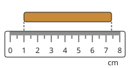

Check question: `p8-ruler0` · number, level 1 · computed by rule, reused from practice

> How long is the pencil, in centimetres?

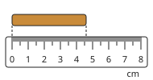

Answer: **4.6 cm**
- Typed **46** (mm) → “That is the number of millimetre marks. Read the centimetre numbers: 1 cm = 10 mm.”

Full working after a second miss:

> The pencil starts at zero and ends at 4.6 cm.  
> Length = 4.6 cm.  

**Worked example** (draft)

> How long is the object on the ruler?

1. The object starts at 1.5 cm, not at zero.
2. It ends at 7.3 cm.
3. Length = end − start = 7.3 − 1.5 = 5.8 cm.

**Answer:** 5.8 cm

**Practice** `p8-instrument` · multiple choice, level 1 · **authored key**

> Which instrument measures temperature?

- ◻️ a ruler or metre rule  
  _↳ feedback if chosen: That instrument measures a different quantity._
- ◻️ a balance  
  _↳ feedback if chosen: That instrument measures a different quantity._
- ◻️ a measuring cylinder  
  _↳ feedback if chosen: That instrument measures a different quantity._
- ✅ a thermometer

Full working after a second miss:

> Temperature is measured with a thermometer.  
> Answer: a thermometer.  

> Which instrument measures time?

- ◻️ a balance  
  _↳ feedback if chosen: That instrument measures a different quantity._
- ◻️ a thermometer  
  _↳ feedback if chosen: That instrument measures a different quantity._
- ◻️ a ruler or metre rule  
  _↳ feedback if chosen: That instrument measures a different quantity._
- ✅ a stopwatch

Full working after a second miss:

> Time is measured with a stopwatch.  
> Answer: a stopwatch.  

**Practice** `p8-ruler0` · number, level 1 · computed by rule

> How long is the piece of chalk, in centimetres?

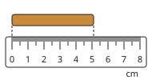

Answer: **5.1 cm**
- Typed **51** (mm) → “That is the number of millimetre marks. Read the centimetre numbers: 1 cm = 10 mm.”

Full working after a second miss:

> The piece of chalk starts at zero and ends at 5.1 cm.  
> Length = 5.1 cm.  

> How long is the key, in centimetres?

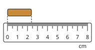

Answer: **2.4 cm**
- Typed **24** (mm) → “That is the number of millimetre marks. Read the centimetre numbers: 1 cm = 10 mm.”

Full working after a second miss:

> The key starts at zero and ends at 2.4 cm.  
> Length = 2.4 cm.  

**Practice** `p8-ruler` · number, level 2 · computed by rule

> How long is the matchbox, in centimetres?

Answer: **2.8 cm**
- Typed **5.1** (end) → “That is only where the matchbox ends. It does not start at 0: subtract the start reading.”
- Typed **28** (mm) → “That is in millimetres. Give the length in centimetres.”

Hint (draft): Read where the matchbox starts and where it ends. Then subtract.

Full working after a second miss:

> Start: 2.3 cm. End: 5.1 cm.  
> Length = 5.1 − 2.3 = 2.8 cm.  

> How long is the stick, in centimetres?

Answer: **4.5 cm**
- Typed **7** (end) → “That is only where the stick ends. It does not start at 0: subtract the start reading.”
- Typed **45** (mm) → “That is in millimetres. Give the length in centimetres.”

Hint (draft): Read where the stick starts and where it ends. Then subtract.

Full working after a second miss:

> Start: 2.5 cm. End: 7 cm.  
> Length = 7 − 2.5 = 4.5 cm.  

**Practice** `p8-eye` · multiple choice, level 2 · **authored key**

> Where should your eye be when you read a scale?

- ◻️ Above the mark, looking down at a slant.  
  _↳ feedback if chosen: Looking at a slant gives a wrong reading (parallax error)._
- ◻️ Below the mark, looking up.  
  _↳ feedback if chosen: Looking up at a slant also gives a wrong reading._
- ◻️ Far to one side of the scale.  
  _↳ feedback if chosen: From the side the mark seems to move: a wrong reading._
- ✅ Level with the mark, looking straight at the scale.

Full working after a second miss:

> The true statement is “Level with the mark, looking straight at the scale.”.  
> “Above the mark, looking down at a slant.” is false: Looking at a slant gives a wrong reading (parallax error).  
> “Below the mark, looking up.” is false: Looking up at a slant also gives a wrong reading.  
> “Far to one side of the scale.” is false: From the side the mark seems to move: a wrong reading.  

> Where should your eye be when you read a scale?

- ✅ Level with the mark, looking straight at the scale.
- ◻️ Far to one side of the scale.  
  _↳ feedback if chosen: From the side the mark seems to move: a wrong reading._
- ◻️ Above the mark, looking down at a slant.  
  _↳ feedback if chosen: Looking at a slant gives a wrong reading (parallax error)._
- ◻️ Below the mark, looking up.  
  _↳ feedback if chosen: Looking up at a slant also gives a wrong reading._

Full working after a second miss:

> The true statement is “Level with the mark, looking straight at the scale.”.  
> “Far to one side of the scale.” is false: From the side the mark seems to move: a wrong reading.  
> “Above the mark, looking down at a slant.” is false: Looking at a slant gives a wrong reading (parallax error).  
> “Below the mark, looking up.” is false: Looking up at a slant also gives a wrong reading.  

**Practice** `p8-spot` · spot the error, level 3 · computed by rule

> Each object lies on a ruler. One length is worked out wrongly. Which one?

- ✅ From 3 cm to 6 cm: the object is 6 cm long.  
  _↳ explanation: That is the end reading. The object starts at 3 cm, so it is 6 − 3 = 3 cm long._
- ◻️ From 4 cm to 8 cm: the object is 4 cm long.
- ◻️ From 3 cm to 6 cm: the object is 3 cm long.
- ◻️ From 2 cm to 7 cm: the object is 5 cm long.

Full working after a second miss:

> The wrong statement is “From 3 cm to 6 cm: the object is 6 cm long.”.  
> That is the end reading. The object starts at 3 cm, so it is 6 − 3 = 3 cm long.  

> Each object lies on a ruler. One length is worked out wrongly. Which one?

- ◻️ From 2 cm to 5 cm: the object is 3 cm long.
- ◻️ From 3 cm to 8 cm: the object is 5 cm long.
- ✅ From 6 cm to 10 cm: the object is 10 cm long.  
  _↳ explanation: That is the end reading. The object starts at 6 cm, so it is 10 − 6 = 4 cm long._
- ◻️ From 5 cm to 7 cm: the object is 2 cm long.

Full working after a second miss:

> The wrong statement is “From 6 cm to 10 cm: the object is 10 cm long.”.  
> That is the end reading. The object starts at 6 cm, so it is 10 − 6 = 4 cm long.  

## Lesson 9: Identifying physical and non-physical quantities

Prerequisites: 8 · Skill: p9 (Physical and non-physical quantities)

**Note** (draft)

> A physical quantity is anything that can be measured with an instrument and written as a number with a unit.
> Examples: length (2.5 m), mass (50 kg), time (30 s), temperature (37 °C), volume (1.5 L), area, speed, weight.
> A non-physical quantity cannot be measured with an instrument and has no unit. Examples: love, kindness, beauty, honesty, happiness, fear, anger, courage.
> We can talk about them and feel them, but there is no instrument or unit to measure them.

**Card pc9-1** (draft)

> A physical quantity can be measured with an instrument and written as a number with a unit.
>
> _Length: 2.5 m. Mass: 50 kg. Time: 30 s._  

Check question: `p9-which` · multiple choice, level 1 · **authored key**, reused from practice

> Which of these is a physical quantity?

- ◻️ courage  
  _↳ feedback if chosen: Courage cannot be measured with an instrument and has no unit._
- ◻️ beauty  
  _↳ feedback if chosen: Beauty cannot be measured with an instrument and has no unit._
- ✅ length
- ◻️ fear  
  _↳ feedback if chosen: Fear cannot be measured with an instrument and has no unit._

Full working after a second miss:

> The true statement is “length”.  
> “courage” is false: Courage cannot be measured with an instrument and has no unit.  
> “beauty” is false: Beauty cannot be measured with an instrument and has no unit.  
> “fear” is false: Fear cannot be measured with an instrument and has no unit.  

**Card pc9-2** (draft)

> Love, kindness, beauty and fear are not physical quantities: no instrument measures them and they have no unit.
>
> _We can feel happiness, but we cannot write “happiness = 5 kg”._  

Check question: `p9-sort` · matching, level 1 · **authored key**, reused from practice

> Sort them: physical quantity or not?

Groups: physical quantity · not a physical quantity
- beauty → **not a physical quantity**
- length → **physical quantity**
- weight → **physical quantity**
- time → **physical quantity**
- mass → **physical quantity**
- kindness → **not a physical quantity**

Full working after a second miss:

> The right pairs are:  
> beauty → not a physical quantity  
> length → physical quantity  
> weight → physical quantity  
> time → physical quantity  
> mass → physical quantity  
> kindness → not a physical quantity  

**Card pc9-3** (draft)

> Every physical quantity has a unit: metres for length, kilograms for mass, seconds for time.
>
> _Temperature: degrees Celsius (°C). Volume: litres (L)._  

Check question: `p9-unit` · multiple choice, level 1 · **authored key**, reused from practice

> Which unit can be used to measure volume of a liquid?

- ✅ litre (L)
- ◻️ second (s)  
  _↳ feedback if chosen: That unit is for a different quantity._
- ◻️ degree Celsius (°C)  
  _↳ feedback if chosen: That unit is for a different quantity._
- ◻️ metre (m)  
  _↳ feedback if chosen: That unit is for a different quantity._

Full working after a second miss:

> volume of a liquid can be measured in litre (L).  
> Answer: litre (L).  

**Worked example** (draft)

> Is “the height of a mango tree” a physical quantity? Is “how much Bih likes mangoes”?

1. The height of the tree can be measured with a measuring tape, in metres: it is a physical quantity.
2. How much Bih likes mangoes cannot be measured with an instrument and has no unit: it is not a physical quantity.

**Answer:** The height is a physical quantity; how much she likes mangoes is not.

**Practice** `p9-sort` · matching, level 1 · **authored key**

> Sort them: physical quantity or not?

Groups: physical quantity · not a physical quantity
- time → **physical quantity**
- length → **physical quantity**
- happiness → **not a physical quantity**
- mass → **physical quantity**
- courage → **not a physical quantity**
- honesty → **not a physical quantity**

Full working after a second miss:

> The right pairs are:  
> time → physical quantity  
> length → physical quantity  
> happiness → not a physical quantity  
> mass → physical quantity  
> courage → not a physical quantity  
> honesty → not a physical quantity  

> Sort them: physical quantity or not?

Groups: physical quantity · not a physical quantity
- mass → **physical quantity**
- kindness → **not a physical quantity**
- temperature → **physical quantity**
- volume → **physical quantity**
- honesty → **not a physical quantity**
- weight → **physical quantity**

Full working after a second miss:

> The right pairs are:  
> mass → physical quantity  
> kindness → not a physical quantity  
> temperature → physical quantity  
> volume → physical quantity  
> honesty → not a physical quantity  
> weight → physical quantity  

**Practice** `p9-which` · multiple choice, level 1 · **authored key**

> Which of these is a physical quantity?

- ◻️ happiness  
  _↳ feedback if chosen: Happiness cannot be measured with an instrument and has no unit._
- ◻️ love  
  _↳ feedback if chosen: Love cannot be measured with an instrument and has no unit._
- ◻️ courage  
  _↳ feedback if chosen: Courage cannot be measured with an instrument and has no unit._
- ✅ weight

Full working after a second miss:

> The true statement is “weight”.  
> “happiness” is false: Happiness cannot be measured with an instrument and has no unit.  
> “love” is false: Love cannot be measured with an instrument and has no unit.  
> “courage” is false: Courage cannot be measured with an instrument and has no unit.  

> Which of these is a physical quantity?

- ◻️ beauty  
  _↳ feedback if chosen: Beauty cannot be measured with an instrument and has no unit._
- ◻️ kindness  
  _↳ feedback if chosen: Kindness cannot be measured with an instrument and has no unit._
- ◻️ honesty  
  _↳ feedback if chosen: Honesty cannot be measured with an instrument and has no unit._
- ✅ length

Full working after a second miss:

> The true statement is “length”.  
> “beauty” is false: Beauty cannot be measured with an instrument and has no unit.  
> “kindness” is false: Kindness cannot be measured with an instrument and has no unit.  
> “honesty” is false: Honesty cannot be measured with an instrument and has no unit.  

**Practice** `p9-unit` · multiple choice, level 1 · **authored key**

> Which unit can be used to measure length?

- ✅ metre (m)
- ◻️ litre (L)  
  _↳ feedback if chosen: That unit is for a different quantity._
- ◻️ kilogram (kg)  
  _↳ feedback if chosen: That unit is for a different quantity._
- ◻️ second (s)  
  _↳ feedback if chosen: That unit is for a different quantity._

Full working after a second miss:

> length can be measured in metre (m).  
> Answer: metre (m).  

> Which unit can be used to measure mass?

- ✅ kilogram (kg)
- ◻️ degree Celsius (°C)  
  _↳ feedback if chosen: That unit is for a different quantity._
- ◻️ second (s)  
  _↳ feedback if chosen: That unit is for a different quantity._
- ◻️ metre (m)  
  _↳ feedback if chosen: That unit is for a different quantity._

Full working after a second miss:

> mass can be measured in kilogram (kg).  
> Answer: kilogram (kg).  

**Practice** `p9-why` · multiple choice, level 2 · **authored key**

> Why is kindness NOT a physical quantity?

- ◻️ Because only scientists can measure it.  
  _↳ feedback if chosen: No one can measure it: there is no instrument and no unit._
- ◻️ Because it changes from day to day.  
  _↳ feedback if chosen: Temperature changes too, and it is a physical quantity. The reason is: no instrument, no unit._
- ✅ No instrument can measure it, and it has no unit.
- ◻️ Because it is too small to see.  
  _↳ feedback if chosen: Small things can still be measured. Kindness has no instrument and no unit._

Full working after a second miss:

> The true statement is “No instrument can measure it, and it has no unit.”.  
> “Because only scientists can measure it.” is false: No one can measure it: there is no instrument and no unit.  
> “Because it changes from day to day.” is false: Temperature changes too, and it is a physical quantity. The reason is: no instrument, no unit.  
> “Because it is too small to see.” is false: Small things can still be measured. Kindness has no instrument and no unit.  

> Why is kindness NOT a physical quantity?

- ◻️ Because it changes from day to day.  
  _↳ feedback if chosen: Temperature changes too, and it is a physical quantity. The reason is: no instrument, no unit._
- ◻️ Because only scientists can measure it.  
  _↳ feedback if chosen: No one can measure it: there is no instrument and no unit._
- ◻️ Because it is too small to see.  
  _↳ feedback if chosen: Small things can still be measured. Kindness has no instrument and no unit._
- ✅ No instrument can measure it, and it has no unit.

Full working after a second miss:

> The true statement is “No instrument can measure it, and it has no unit.”.  
> “Because it changes from day to day.” is false: Temperature changes too, and it is a physical quantity. The reason is: no instrument, no unit.  
> “Because only scientists can measure it.” is false: No one can measure it: there is no instrument and no unit.  
> “Because it is too small to see.” is false: Small things can still be measured. Kindness has no instrument and no unit.  

**Practice** `p9-spot` · spot the error, level 3 · **authored key**

> One sentence is wrong. Which one?

- ◻️ Beauty is not a physical quantity.
- ◻️ Mass is a physical quantity measured in kilograms.
- ✅ Length is not a physical quantity.  
  _↳ explanation: Length is measured with a ruler, in metres: it is a physical quantity._
- ◻️ Time is a physical quantity measured in seconds.

Full working after a second miss:

> The wrong statement is “Length is not a physical quantity.”.  
> Length is measured with a ruler, in metres: it is a physical quantity.  

> One sentence is wrong. Which one?

- ◻️ Beauty is not a physical quantity.
- ◻️ Time is a physical quantity measured in seconds.
- ✅ Length is not a physical quantity.  
  _↳ explanation: Length is measured with a ruler, in metres: it is a physical quantity._
- ◻️ Temperature can be measured with a thermometer.

Full working after a second miss:

> The wrong statement is “Length is not a physical quantity.”.  
> Length is measured with a ruler, in metres: it is a physical quantity.  

## Lesson 10: Some Units of measurement and S.I units

Prerequisites: 8, 9 · Skill: p10 (Units and SI units)

**Note** (draft)

> Scientists everywhere use the same units: the International System of Units (SI). Some SI base units:
> • length: metre (m) • mass: kilogram (kg) • time: second (s) • temperature: kelvin (K) • electric current: ampere (A).
> Other units come from these: area in m², volume in m³, speed in m/s.
> Prefixes make units bigger or smaller:
> • kilo (k) = 1000: 1 km = 1000 m, 1 kg = 1000 g
> • centi (c) = one hundredth: 1 m = 100 cm
> • milli (m) = one thousandth: 1 m = 1000 mm, 1 g = 1000 mg, 1 L = 1000 mL
> Careful: the SI unit of mass is the kilogram, not the gram.

**Card pc10-1** (draft)

> The SI units are used by scientists everywhere: metre for length, kilogram for mass, second for time, kelvin for temperature, ampere for electric current.
>
> _Mass of a pupil: about 45 kg. A race: 12 s._  

Check question: `p10-si` · matching, level 1 · **authored key**, reused from practice

> Match each quantity with its SI unit.

Right-hand side (shuffled): second · kelvin · kilogram · ampere
- time → **second**
- mass → **kilogram**
- temperature → **kelvin**
- electric current → **ampere**

Full working after a second miss:

> The right pairs are:  
> time → second  
> mass → kilogram  
> temperature → kelvin  
> electric current → ampere  

**Card pc10-2** (draft)

> Each unit has a symbol: metre m, kilogram kg, second s, kelvin K, ampere A. Symbols take no full stop and no s.
>
> _5 m (not 5 ms, and no full stop after m)._  

Check question: `p10-symbol` · matching, level 1 · **authored key**, reused from practice

> Match each unit with its symbol.

Right-hand side (shuffled): s · A · K · g
- gram → **g**
- kelvin → **K**
- second → **s**
- ampere → **A**

Full working after a second miss:

> The right pairs are:  
> gram → g  
> kelvin → K  
> second → s  
> ampere → A  

**Card pc10-3** (draft)

> Prefixes: kilo = 1000, centi = one hundredth, milli = one thousandth.
>
> _1 km = 1000 m. 1 m = 100 cm. 1 g = 1000 mg._  

Check question: `p10-prefix` · number, level 1 · computed by rule, reused from practice

> How many mm make 1 cm?

Answer: **10 mm**

Full working after a second miss:

> 1 cm = 10 mm.  

**Worked example** (draft)

> A bag of rice has a mass of 2.5 kg. What is its mass in g?

1. Kilo means one thousand: 1 kg = 1000 g.
2. 2.5 kg = 2.5 × 1000 = 2500 g.

**Answer:** 2500 g

**Practice** `p10-si` · matching, level 1 · **authored key**

> Match each quantity with its SI unit.

Right-hand side (shuffled): kelvin · ampere · metre · second
- time → **second**
- temperature → **kelvin**
- length → **metre**
- electric current → **ampere**

Full working after a second miss:

> The right pairs are:  
> time → second  
> temperature → kelvin  
> length → metre  
> electric current → ampere  

> Match each quantity with its SI unit.

Right-hand side (shuffled): kelvin · ampere · kilogram · second
- time → **second**
- temperature → **kelvin**
- electric current → **ampere**
- mass → **kilogram**

Full working after a second miss:

> The right pairs are:  
> time → second  
> temperature → kelvin  
> electric current → ampere  
> mass → kilogram  

**Practice** `p10-symbol` · matching, level 1 · **authored key**

> Match each unit with its symbol.

Right-hand side (shuffled): m · kg · g · A
- kilogram → **kg**
- gram → **g**
- ampere → **A**
- metre → **m**

Full working after a second miss:

> The right pairs are:  
> kilogram → kg  
> gram → g  
> ampere → A  
> metre → m  

> Match each unit with its symbol.

Right-hand side (shuffled): kg · m · s · L
- kilogram → **kg**
- second → **s**
- litre → **L**
- metre → **m**

Full working after a second miss:

> The right pairs are:  
> kilogram → kg  
> second → s  
> litre → L  
> metre → m  

**Practice** `p10-prefix` · number, level 1 · computed by rule

> How many mL make 1 L?

Answer: **1000 mL**
- Typed **10** (ten) → “Not 10 here. Look at the prefix: kilo = 1000, centi = one hundredth, milli = one thousandth.”

Full working after a second miss:

> 1 L = 1000 mL.  

> How many g make 1 kg?

Answer: **1000 g**
- Typed **10** (ten) → “Not 10 here. Look at the prefix: kilo = 1000, centi = one hundredth, milli = one thousandth.”

Full working after a second miss:

> 1 kg = 1000 g.  

**Practice** `p10-convert` · number, level 2 · computed by rule

> Convert 7.1 m into mm.

Answer: **7100 mm**
- Typed **0.0071** (wrong-way) → “You went the wrong way. Bigger units → smaller units: the number gets bigger.”

Full working after a second miss:

> 1 m = 1000 mm.  
> Multiply by 1000: 7.1 m = 7100 mm.  

> Convert 920 g into kg.

Answer: **0.92 kg**
- Typed **920 000** (wrong-way) → “You went the wrong way. Bigger units → smaller units: the number gets bigger.”

Full working after a second miss:

> 1 kg = 1000 g.  
> Divide by 1000: 920 g = 0.92 kg.  

**Practice** `p10-trap` · multiple choice, level 2 · **authored key**

> Which sentence is true?

- ◻️ The SI unit of length is the centimetre.  
  _↳ feedback if chosen: The SI unit of length is the metre (m)._
- ◻️ The SI unit of time is the minute.  
  _↳ feedback if chosen: The SI unit of time is the second (s)._
- ✅ The SI unit of length is the metre.
- ◻️ The SI unit of mass is the gram.  
  _↳ feedback if chosen: The SI unit of mass is the kilogram (kg). The gram is a smaller unit._

Full working after a second miss:

> The true statement is “The SI unit of length is the metre.”.  
> “The SI unit of length is the centimetre.” is false: The SI unit of length is the metre (m).  
> “The SI unit of time is the minute.” is false: The SI unit of time is the second (s).  
> “The SI unit of mass is the gram.” is false: The SI unit of mass is the kilogram (kg). The gram is a smaller unit.  

> Which sentence is true?

- ◻️ The SI unit of mass is the gram.  
  _↳ feedback if chosen: The SI unit of mass is the kilogram (kg). The gram is a smaller unit._
- ✅ The SI unit of time is the second.
- ◻️ The SI unit of length is the centimetre.  
  _↳ feedback if chosen: The SI unit of length is the metre (m)._
- ◻️ The SI unit of temperature is the degree Celsius.  
  _↳ feedback if chosen: °C is used every day, but the SI unit is the kelvin (K)._

Full working after a second miss:

> The true statement is “The SI unit of time is the second.”.  
> “The SI unit of mass is the gram.” is false: The SI unit of mass is the kilogram (kg). The gram is a smaller unit.  
> “The SI unit of length is the centimetre.” is false: The SI unit of length is the metre (m).  
> “The SI unit of temperature is the degree Celsius.” is false: °C is used every day, but the SI unit is the kelvin (K).  

**Practice** `p10-spot` · spot the error, level 3 · computed by rule

> One conversion is wrong. Which one?

- ◻️ 6 L = 6000 mL
- ✅ 6 g = 60 mg  
  _↳ explanation: 1 g = 1000 mg, not 10._
- ◻️ 6 km = 6000 m
- ◻️ 6 m = 6000 mm

Full working after a second miss:

> The wrong statement is “6 g = 60 mg”.  
> 1 g = 1000 mg, not 10.  

> One conversion is wrong. Which one?

- ◻️ 2 cm = 20 mm
- ◻️ 2 kg = 2000 g
- ◻️ 2 g = 2000 mg
- ✅ 2 km = 20 m  
  _↳ explanation: 1 km = 1000 m, not 10._

Full working after a second miss:

> The wrong statement is “2 km = 20 m”.  
> 1 km = 1000 m, not 10.  

## Lesson 11: States of matter and differences between them

Prerequisites: 9 · Skill: p11 (States of matter)

**Note** (draft)

> Matter is anything that has mass and takes up space. It exists in three states:
> • Solid (stone, ice, wood): fixed shape and fixed volume. Particles are very close, in fixed places; they only vibrate.
> • Liquid (water, palm oil, kerosene): no fixed shape, it takes the shape of its container; fixed volume; it flows. Particles are close but can move past each other.
> • Gas (air, steam, oxygen): no fixed shape and no fixed volume; it spreads to fill its container and can be squashed. Particles are far apart and move fast.
> The same substance can be in all three states: ice, water and steam.

**Card pc11-1** (draft)

> Matter has three states: solid, liquid and gas.
>
> _Solid: a stone. Liquid: palm oil. Gas: the air in a football._  

Check question: `p11-sort` · matching, level 1 · **authored key**, reused from practice

> Sort each one: solid, liquid or gas?

Groups: solid · liquid · gas
- kerosene → **liquid**
- oxygen → **gas**
- ice → **solid**
- chalk → **solid**
- an iron nail → **solid**
- wood → **solid**

Full working after a second miss:

> The right pairs are:  
> kerosene → liquid  
> oxygen → gas  
> ice → solid  
> chalk → solid  
> an iron nail → solid  
> wood → solid  

**Card pc11-2** (draft)

> A solid keeps its shape. A liquid takes the shape of its container but keeps its volume. A gas fills its container.
>
> _Pour water from a bottle into a bowl: the shape changes, the volume stays the same._  

Check question: `p11-prop` · multiple choice, level 1 · **authored key**, reused from practice

> Which state of matter has a fixed shape and a fixed volume?

- ◻️ liquid  
  _↳ feedback if chosen: Not this state. Think: does it keep its shape? Its volume?_
- ✅ solid
- ◻️ gas  
  _↳ feedback if chosen: Not this state. Think: does it keep its shape? Its volume?_

Full working after a second miss:

> A solid has a fixed shape and a fixed volume.  
> Answer: solid.  

**Card pc11-3** (draft)

> Particles: very close and fixed in a solid; close but moving in a liquid; far apart and fast in a gas.
>
> _That is why a gas can be squashed, but a liquid cannot._  

Check question: `pc11-3-check` · multiple choice, level 1 · **authored key**

> In which state are the particles far apart, moving fast in all directions?

- ◻️ solid  
  _↳ feedback if chosen: Think about how close the particles are and how they move._
- ✅ gas
- ◻️ liquid  
  _↳ feedback if chosen: Think about how close the particles are and how they move._

Full working after a second miss:

> In a gas, the particles are far apart, moving fast in all directions.  
> Answer: gas.  

**Worked example** (draft)

> Why can we pump more air into a football, but not more water into a full bottle?

1. Air is a gas: its particles are far apart, so they can be pushed closer together (compressed).
2. Water is a liquid: its particles are already close together, so it cannot be squashed.

**Answer:** Gas particles are far apart and can be squashed together; liquid particles are already close.

**Practice** `p11-sort` · matching, level 1 · **authored key**

> Sort each one: solid, liquid or gas?

Groups: solid · gas
- stone → **solid**
- water vapour (steam) → **gas**
- air → **gas**
- ice → **solid**
- carbon dioxide → **gas**
- chalk → **solid**

Full working after a second miss:

> The right pairs are:  
> stone → solid  
> water vapour (steam) → gas  
> air → gas  
> ice → solid  
> carbon dioxide → gas  
> chalk → solid  

> Sort each one: solid, liquid or gas?

Groups: solid · liquid · gas
- milk → **liquid**
- water → **liquid**
- water vapour (steam) → **gas**
- oxygen → **gas**
- kerosene → **liquid**
- chalk → **solid**

Full working after a second miss:

> The right pairs are:  
> milk → liquid  
> water → liquid  
> water vapour (steam) → gas  
> oxygen → gas  
> kerosene → liquid  
> chalk → solid  

**Practice** `p11-prop` · multiple choice, level 1 · **authored key**

> Which state of matter spreads out to fill any container?

- ◻️ liquid  
  _↳ feedback if chosen: Not this state. Think: does it keep its shape? Its volume?_
- ◻️ solid  
  _↳ feedback if chosen: Not this state. Think: does it keep its shape? Its volume?_
- ✅ gas

Full working after a second miss:

> A gas spreads out to fill any container.  
> Answer: gas.  

> Which state of matter spreads out to fill any container?

- ✅ gas
- ◻️ liquid  
  _↳ feedback if chosen: Not this state. Think: does it keep its shape? Its volume?_
- ◻️ solid  
  _↳ feedback if chosen: Not this state. Think: does it keep its shape? Its volume?_

Full working after a second miss:

> A gas spreads out to fill any container.  
> Answer: gas.  

**Practice** `p11-particles` · multiple choice, level 2 · **authored key**

> In which state are the particles far apart, moving fast in all directions?

- ✅ gas
- ◻️ solid  
  _↳ feedback if chosen: Think about how close the particles are and how they move._
- ◻️ liquid  
  _↳ feedback if chosen: Think about how close the particles are and how they move._

Full working after a second miss:

> In a gas, the particles are far apart, moving fast in all directions.  
> Answer: gas.  

> In which state are the particles far apart, moving fast in all directions?

- ◻️ liquid  
  _↳ feedback if chosen: Think about how close the particles are and how they move._
- ◻️ solid  
  _↳ feedback if chosen: Think about how close the particles are and how they move._
- ✅ gas

Full working after a second miss:

> In a gas, the particles are far apart, moving fast in all directions.  
> Answer: gas.  

**Practice** `p11-why` · multiple choice, level 2 · **authored key**

> Why can a gas be squashed (compressed) but a liquid cannot?

- ◻️ Liquids are heavier than gases.  
  _↳ feedback if chosen: It is not about weight but about the space between the particles._
- ◻️ Gases are always hot.  
  _↳ feedback if chosen: Gases can be cold. It is about the space between the particles._
- ✅ The particles of a gas are far apart; those of a liquid are already close together.
- ◻️ Gases have no particles.  
  _↳ feedback if chosen: Gases are made of particles too, but they are far apart._

Full working after a second miss:

> The true statement is “The particles of a gas are far apart; those of a liquid are already close together.”.  
> “Liquids are heavier than gases.” is false: It is not about weight but about the space between the particles.  
> “Gases are always hot.” is false: Gases can be cold. It is about the space between the particles.  
> “Gases have no particles.” is false: Gases are made of particles too, but they are far apart.  

> Why can a gas be squashed (compressed) but a liquid cannot?

- ◻️ Gases are always hot.  
  _↳ feedback if chosen: Gases can be cold. It is about the space between the particles._
- ✅ The particles of a gas are far apart; those of a liquid are already close together.
- ◻️ Liquids are heavier than gases.  
  _↳ feedback if chosen: It is not about weight but about the space between the particles._
- ◻️ Gases have no particles.  
  _↳ feedback if chosen: Gases are made of particles too, but they are far apart._

Full working after a second miss:

> The true statement is “The particles of a gas are far apart; those of a liquid are already close together.”.  
> “Gases are always hot.” is false: Gases can be cold. It is about the space between the particles.  
> “Liquids are heavier than gases.” is false: It is not about weight but about the space between the particles.  
> “Gases have no particles.” is false: Gases are made of particles too, but they are far apart.  

**Practice** `p11-spot` · spot the error, level 3 · **authored key**

> One sentence is wrong. Which one?

- ◻️ A stone keeps its shape.
- ◻️ Water, ice and steam are the same substance.
- ◻️ Palm oil takes the shape of the bottle it is in.
- ✅ A solid takes the shape of its container.  
  _↳ explanation: A solid keeps its own shape. It is a liquid that takes the shape of its container._

Full working after a second miss:

> The wrong statement is “A solid takes the shape of its container.”.  
> A solid keeps its own shape. It is a liquid that takes the shape of its container.  

> One sentence is wrong. Which one?

- ✅ The particles in a gas are very close together.  
  _↳ explanation: In a gas the particles are far apart._
- ◻️ Palm oil takes the shape of the bottle it is in.
- ◻️ Water, ice and steam are the same substance.
- ◻️ A stone keeps its shape.

Full working after a second miss:

> The wrong statement is “The particles in a gas are very close together.”.  
> In a gas the particles are far apart.  

## Lesson 12: Interconversion processes

Prerequisites: 11 · Skill: p12 (Changes of state)

**Note** (draft)

> Heating or cooling can change matter from one state to another:
> • melting: solid → liquid (ice melts)
> • freezing (solidification): liquid → solid (palm oil turns solid on a cold morning)
> • evaporation: liquid → gas (wet clothes dry); boiling is fast evaporation at the boiling point
> • condensation: gas → liquid (dew; drops on a cold bottle)
> • sublimation: solid → gas, with no liquid (mothballs)
> • deposition: gas → solid (frost)
> Melting, evaporation and sublimation take in heat. Freezing, condensation and deposition give out heat. The substance stays the same: ice, water and steam are all water.

**Card pc12-1** (draft)

> Heating: solid → liquid is melting; liquid → gas is evaporation (boiling when it is fast).
>
> _Ice → water: melting. Water → steam: evaporation._  

Check question: `p12-name` · multiple choice, level 1 · computed by rule, reused from practice

> When a solid changes into a liquid, the change is called:

- ◻️ condensation  
  _↳ feedback if chosen: Not this one. Check which state it starts in and which state it ends in._
- ◻️ deposition  
  _↳ feedback if chosen: Not this one. Check which state it starts in and which state it ends in._
- ✅ melting
- ◻️ freezing  
  _↳ feedback if chosen: Not this one. Check which state it starts in and which state it ends in._

Full working after a second miss:

> solid → liquid: melting.  

**Card pc12-2** (draft)

> Cooling: gas → liquid is condensation; liquid → solid is freezing.
>
> _Dew on the grass: condensation. Palm oil hardening: freezing._  

Check question: `p12-example` · multiple choice, level 1 · **authored key**, reused from practice

> Palm oil turns solid on a cold morning in Bamenda. What is this change of state called?

- ✅ freezing
- ◻️ melting  
  _↳ feedback if chosen: Not this change. Which state does it start in, and which state does it end in?_
- ◻️ condensation  
  _↳ feedback if chosen: Not this change. Which state does it start in, and which state does it end in?_
- ◻️ evaporation  
  _↳ feedback if chosen: Not this change. Which state does it start in, and which state does it end in?_

Full working after a second miss:

> Palm oil turns solid on a cold morning in Bamenda. This is freezing.  
> Answer: freezing.  

**Card pc12-3** (draft)

> Some solids turn straight into a gas, with no liquid: sublimation. The reverse, gas → solid, is deposition.
>
> _Mothballs getting smaller: sublimation._  

Check question: `pc12-3-check` · multiple choice, level 1 · computed by rule

> A gas turns into a solid. What is this change called?

- ◻️ freezing  
  _↳ feedback if chosen: Not this one. Melting: solid → liquid; freezing: liquid → solid; evaporation: liquid → gas; condensation: gas → liquid; sublimation: solid → gas; deposition: gas → solid._
- ◻️ evaporation  
  _↳ feedback if chosen: Not this one. Melting: solid → liquid; freezing: liquid → solid; evaporation: liquid → gas; condensation: gas → liquid; sublimation: solid → gas; deposition: gas → solid._
- ✅ deposition

Full working after a second miss:

> gas → solid: deposition.  

**Worked example** (draft)

> Drops of water form on the outside of a cold bottle taken from the fridge. Where do they come from, and what is this change called?

1. The air around the bottle has water vapour in it, a gas.
2. The cold bottle cools the vapour, which turns into a liquid.
3. A gas turning into a liquid is condensation. Heat is given out.

**Answer:** Water vapour from the air turns into liquid water: condensation.

**Practice** `p12-name` · multiple choice, level 1 · computed by rule

> When a liquid changes into a gas, the change is called:

- ◻️ sublimation  
  _↳ feedback if chosen: Not this one. Check which state it starts in and which state it ends in._
- ◻️ condensation  
  _↳ feedback if chosen: Not this one. Check which state it starts in and which state it ends in._
- ◻️ deposition  
  _↳ feedback if chosen: Not this one. Check which state it starts in and which state it ends in._
- ✅ evaporation

Full working after a second miss:

> liquid → gas: evaporation.  

> When a liquid changes into a solid, the change is called:

- ◻️ sublimation  
  _↳ feedback if chosen: Not this one. Check which state it starts in and which state it ends in._
- ✅ freezing
- ◻️ deposition  
  _↳ feedback if chosen: Not this one. Check which state it starts in and which state it ends in._
- ◻️ melting  
  _↳ feedback if chosen: Not this one. Check which state it starts in and which state it ends in._

Full working after a second miss:

> liquid → solid: freezing.  

**Practice** `p12-example` · multiple choice, level 1 · **authored key**

> In the morning, there are drops of dew on the grass. What is this change of state called?

- ◻️ sublimation  
  _↳ feedback if chosen: Not this change. Which state does it start in, and which state does it end in?_
- ◻️ freezing  
  _↳ feedback if chosen: Not this change. Which state does it start in, and which state does it end in?_
- ✅ condensation
- ◻️ evaporation  
  _↳ feedback if chosen: Not this change. Which state does it start in, and which state does it end in?_

Full working after a second miss:

> In the morning, there are drops of dew on the grass. This is condensation.  
> Answer: condensation.  

> Wet clothes dry on the line. What is this change of state called?

- ◻️ sublimation  
  _↳ feedback if chosen: Not this change. Which state does it start in, and which state does it end in?_
- ◻️ melting  
  _↳ feedback if chosen: Not this change. Which state does it start in, and which state does it end in?_
- ✅ evaporation
- ◻️ freezing  
  _↳ feedback if chosen: Not this change. Which state does it start in, and which state does it end in?_

Full working after a second miss:

> Wet clothes dry on the line. This is evaporation.  
> Answer: evaporation.  

**Practice** `p12-heat` · multiple choice, level 2 · computed by rule

> During condensation (gas → liquid), is heat taken in or given out?

- ◻️ taken in  
  _↳ feedback if chosen: To move particles further apart (solid → liquid → gas) needs heat. Coming closer together gives heat out._
- ✅ given out

Full working after a second miss:

> gas → liquid: the particles move closer together, which gives out heat.  
> Heat is given out.  

> During deposition (gas → solid), is heat taken in or given out?

- ✅ given out
- ◻️ taken in  
  _↳ feedback if chosen: To move particles further apart (solid → liquid → gas) needs heat. Coming closer together gives heat out._

Full working after a second miss:

> gas → solid: the particles move closer together, which gives out heat.  
> Heat is given out.  

**Practice** `p12-reverse` · multiple choice, level 2 · computed by rule

> Sublimation changes a solid into a:

- ✅ gas
- ◻️ liquid  
  _↳ feedback if chosen: Not this state. Think about what sublimation does._
- ◻️ solid  
  _↳ feedback if chosen: Not this state. Think about what sublimation does._

Full working after a second miss:

> Sublimation: solid → gas.  

> Evaporation changes a liquid into a:

- ◻️ liquid  
  _↳ feedback if chosen: Not this state. Think about what evaporation does._
- ✅ gas
- ◻️ solid  
  _↳ feedback if chosen: Not this state. Think about what evaporation does._

Full working after a second miss:

> Evaporation: liquid → gas.  

**Practice** `p12-spot` · spot the error, level 3 · **authored key**

> One sentence is wrong. Which one?

- ◻️ Dew forms by condensation.
- ◻️ Melting changes a solid into a liquid.
- ◻️ Evaporation takes in heat.
- ✅ Freezing changes a gas into a solid.  
  _↳ explanation: Freezing changes a liquid into a solid. Gas → solid is deposition._

Full working after a second miss:

> The wrong statement is “Freezing changes a gas into a solid.”.  
> Freezing changes a liquid into a solid. Gas → solid is deposition.  

> One sentence is wrong. Which one?

- ◻️ Melting changes a solid into a liquid.
- ◻️ Evaporation takes in heat.
- ✅ Wet clothes dry by condensation.  
  _↳ explanation: Wet clothes dry by evaporation: liquid → gas._
- ◻️ Condensation changes a gas into a liquid.

Full working after a second miss:

> The wrong statement is “Wet clothes dry by condensation.”.  
> Wet clothes dry by evaporation: liquid → gas.  

## Lesson 13: Length: Definition, Units and Measurement

Prerequisites: 8, 10 · Skill: p13 (Length)

**Note** (draft)

> Length is the distance between two points. Its SI unit is the metre (m).
> Other units: 1 km = 1000 m; 1 m = 100 cm; 1 cm = 10 mm (the same ladder as in Maths: km, hm, dam, m, dm, cm, mm).
> Instruments:
> • ruler or metre rule: lengths up to about 1 m; the smallest mark is 1 mm;
> • measuring tape: long lengths, such as a room or a football field.
> To measure with a ruler: put the start of the object on a mark (0 if you can), keep your eye straight above the mark, and if you did not start at 0, subtract: length = end − start.

**Card pc13-1** (draft)

> Length is the distance between two points. SI unit: the metre (m). 1 km = 1000 m, 1 m = 100 cm, 1 cm = 10 mm.
>
> _Kumba to Mamfe is measured in km; a classroom in m; a pencil in cm; a grain of rice in mm._  

Check question: `p13-convert` · number, level 1 · computed by rule, reused from practice

> Convert this length: 4.4 km = ? m

Answer: **4400 m**
- Typed **0.0044** (wrong-way) → “You went the wrong way. From a bigger unit to a smaller one, the number gets bigger; from smaller to bigger, it gets smaller.”

Full working after a second miss:

> 1 km = 1000 m.  
> Multiply by 1000: 4.4 km = 4400 m.  

**Card pc13-2** (draft)

> Choose the instrument: a ruler for short lengths, a metre rule for about a metre, a measuring tape for long lengths.
>
> _The length of the classroom: a measuring tape._  

Check question: `p13-tool` · multiple choice, level 1 · **authored key**, reused from practice

> Which instrument is best to measure the width of your desk?

- ✅ metre rule
- ◻️ balance  
  _↳ feedback if chosen: That instrument is too short, too long, or measures something else._
- ◻️ ruler  
  _↳ feedback if chosen: That instrument is too short, too long, or measures something else._
- ◻️ measuring tape  
  _↳ feedback if chosen: That instrument is too short, too long, or measures something else._

Full working after a second miss:

> For the width of your desk, a metre rule is best.  
> Answer: metre rule.  

**Card pc13-3** (draft)

> On a ruler, the small marks are millimetres: there are 10 between two centimetre numbers.
>
> _This object is 46 mm long, that is 4.6 cm._  

Check question: `p13-mm` · number, level 1 · computed by rule, reused from practice

> How long is the piece of chalk, in millimetres?

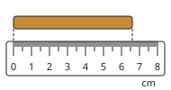

Answer: **66 mm**
- Typed **6.6** (cm) → “That is in centimetres. Each centimetre has 10 millimetres.”

Full working after a second miss:

> The piece of chalk ends at 6.6 cm.  
> 6.6 cm = 6.6 × 10 = 66 mm.  

**Worked example** (draft)

> How long is the nail, in millimetres?

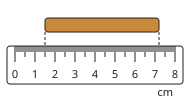

1. Start: 1.5 cm. End: 7.2 cm.
2. Length = 7.2 − 1.5 = 5.7 cm.
3. 1 cm = 10 mm, so 5.7 cm = 57 mm.

**Answer:** 57 mm

**Practice** `p13-convert` · number, level 1 · computed by rule

> Convert this length: 8 m = ? cm

Answer: **800 cm**
- Typed **0.08** (wrong-way) → “You went the wrong way. From a bigger unit to a smaller one, the number gets bigger; from smaller to bigger, it gets smaller.”

Full working after a second miss:

> 1 m = 100 cm.  
> Multiply by 100: 8 m = 800 cm.  

> Convert this length: 4.9 cm = ? mm

Answer: **49 mm**
- Typed **0.49** (wrong-way) → “You went the wrong way. From a bigger unit to a smaller one, the number gets bigger; from smaller to bigger, it gets smaller.”

Full working after a second miss:

> 1 cm = 10 mm.  
> Multiply by 10: 4.9 cm = 49 mm.  

**Practice** `p13-tool` · multiple choice, level 1 · **authored key**

> Which instrument is best to measure the length of a pencil?

- ◻️ balance  
  _↳ feedback if chosen: That instrument is too short, too long, or measures something else._
- ◻️ metre rule  
  _↳ feedback if chosen: That instrument is too short, too long, or measures something else._
- ◻️ measuring tape  
  _↳ feedback if chosen: That instrument is too short, too long, or measures something else._
- ✅ ruler

Full working after a second miss:

> For the length of a pencil, a ruler is best.  
> Answer: ruler.  

> Which instrument is best to measure the length of the classroom?

- ◻️ metre rule  
  _↳ feedback if chosen: That instrument is too short, too long, or measures something else._
- ◻️ balance  
  _↳ feedback if chosen: That instrument is too short, too long, or measures something else._
- ✅ measuring tape
- ◻️ ruler  
  _↳ feedback if chosen: That instrument is too short, too long, or measures something else._

Full working after a second miss:

> For the length of the classroom, a measuring tape is best.  
> Answer: measuring tape.  

**Practice** `p13-mm` · number, level 1 · computed by rule

> How long is the nail, in millimetres?

Answer: **19 mm**
- Typed **1.9** (cm) → “That is in centimetres. Each centimetre has 10 millimetres.”

Full working after a second miss:

> The nail ends at 1.9 cm.  
> 1.9 cm = 1.9 × 10 = 19 mm.  

> How long is the nail, in millimetres?

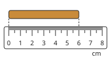

Answer: **60 mm**
- Typed **6** (cm) → “That is in centimetres. Each centimetre has 10 millimetres.”

Full working after a second miss:

> The nail ends at 6 cm.  
> 6 cm = 6 × 10 = 60 mm.  

**Practice** `p13-read` · number, level 2 · computed by rule

> How long is the piece of chalk, in millimetres?

Answer: **44 mm**
- Typed **56** (end) → “That is where the piece of chalk ends. Subtract where it starts.”
- Typed **4.4** (cm) → “That is in centimetres. Give the answer in millimetres.”

Hint (draft): Read the start and the end in millimetres, then subtract.

Full working after a second miss:

> Start: 12 mm. End: 56 mm.  
> Length = 56 − 12 = 44 mm.  

> How long is the pencil, in millimetres?

Answer: **44 mm**
- Typed **68** (end) → “That is where the pencil ends. Subtract where it starts.”
- Typed **4.4** (cm) → “That is in centimetres. Give the answer in millimetres.”

Hint (draft): Read the start and the end in millimetres, then subtract.

Full working after a second miss:

> Start: 24 mm. End: 68 mm.  
> Length = 68 − 24 = 44 mm.  

**Practice** `p13-walk` · number, level 2 · computed by rule

> Tabe walks 0.8 km to the market and then 650 m to the stream. How far is that altogether, in metres?

Answer: **1450 m**
- Typed **650.8** (no-convert) → “Change the kilometres into metres before you add.”

Full working after a second miss:

> 0.8 km = 0.8 × 1000 = 800 m.  
> 800 + 650 = 1450 m.  

> Tabe walks 0.4 km to the market and then 450 m to the stream. How far is that altogether, in metres?

Answer: **850 m**
- Typed **450.4** (no-convert) → “Change the kilometres into metres before you add.”

Full working after a second miss:

> 0.4 km = 0.4 × 1000 = 400 m.  
> 400 + 450 = 850 m.  

**Practice** `p13-spot` · spot the error, level 3 · computed by rule

> One conversion is wrong. Which one?

- ◻️ 4 m = 400 cm
- ◻️ 4 m = 4000 mm
- ◻️ 4 cm = 40 mm
- ✅ 4 km = 40 m  
  _↳ explanation: 1 km = 1000 m, so 4 km = 4000 m._

Full working after a second miss:

> The wrong statement is “4 km = 40 m”.  
> 1 km = 1000 m, so 4 km = 4000 m.  

> One conversion is wrong. Which one?

- ◻️ 4 cm = 40 mm
- ◻️ 4 m = 400 cm
- ◻️ 4 m = 4000 mm
- ✅ 4 km = 40 m  
  _↳ explanation: 1 km = 1000 m, so 4 km = 4000 m._

Full working after a second miss:

> The wrong statement is “4 km = 40 m”.  
> 1 km = 1000 m, so 4 km = 4000 m.  

## Lesson 14: Mass: Definition, Units and Measurement

Prerequisites: 10 · Skill: p14 (Mass)

**Note** (draft)

> Mass is the quantity of matter in a body. Its SI unit is the kilogram (kg).
> Other units: 1 tonne (t) = 1000 kg; 1 kg = 1000 g; 1 g = 1000 mg.
> Mass is measured with a balance: a beam balance compares the object with standard masses; a top-pan (electronic) balance shows the mass on a screen.
> The mass of a body is the same everywhere: in Buea, in Yaoundé or on the Moon. It only changes if matter is added or taken away.

**Card pc14-1** (draft)

> Mass is the quantity of matter in a body. Its SI unit is the kilogram (kg).
>
> _A bag of cement: about 50 kg. A pupil: about 40 kg._  

Check question: `pc14-1-check` · multiple choice, level 1 · **authored key**

> What is mass?

- ◻️ The space a body takes up.  
  _↳ feedback if chosen: That is volume._
- ◻️ The pull of the Earth on a body.  
  _↳ feedback if chosen: That is weight, a force._
- ◻️ How hot a body is.  
  _↳ feedback if chosen: That is temperature._
- ✅ The quantity of matter in a body.

Full working after a second miss:

> The true statement is “The quantity of matter in a body.”.  
> “The space a body takes up.” is false: That is volume.  
> “The pull of the Earth on a body.” is false: That is weight, a force.  
> “How hot a body is.” is false: That is temperature.  

**Card pc14-2** (draft)

> 1 t = 1000 kg, 1 kg = 1000 g, 1 g = 1000 mg.
>
> _1 kg = 1000 g. 1 t = 1000 kg._  

Check question: `p14-convert` · number, level 1 · computed by rule, reused from practice

> Convert this mass: 4 t = ? kg

Answer: **4000 kg**
- Typed **0.004** (wrong-way) → “You went the wrong way. From a bigger unit to a smaller one, the number gets bigger; from smaller to bigger, it gets smaller.”

Full working after a second miss:

> 1 t = 1000 kg.  
> Multiply by 1000: 4 t = 4000 kg.  

**Card pc14-3** (draft)

> Mass is measured with a balance, and it is the same everywhere, even on the Moon.
>
> _A 25 kg bag of rice still has a mass of 25 kg on the Moon._  

Check question: `p14-same` · multiple choice, level 1 · computed by rule, reused from practice

> A bag of rice has a mass of 55 kg in Buea. What is its mass in Yaoundé?

- ◻️ 0 kg  
  _↳ feedback if chosen: Mass is the quantity of matter. Nothing was added or taken away, so the mass does not change._
- ◻️ 9.2 kg  
  _↳ feedback if chosen: Mass is the quantity of matter. Nothing was added or taken away, so the mass does not change._
- ✅ 55 kg
- ◻️ 550 kg  
  _↳ feedback if chosen: Mass is the quantity of matter. Nothing was added or taken away, so the mass does not change._

Full working after a second miss:

> Mass does not depend on the place.  
> It is still 55 kg.  

**Worked example** (draft)

> Mother buys 2.5 kg of rice and 750 g of beans. What is the total mass in grams?

1. Change the rice into grams: 2.5 kg = 2.5 × 1000 = 2500 g.
2. Add: 2500 + 750 = 3250 g.

**Answer:** 3250 g

**Practice** `p14-convert` · number, level 1 · computed by rule

> Convert this mass: 2.7 g = ? mg

Answer: **2700 mg**
- Typed **0.0027** (wrong-way) → “You went the wrong way. From a bigger unit to a smaller one, the number gets bigger; from smaller to bigger, it gets smaller.”

Full working after a second miss:

> 1 g = 1000 mg.  
> Multiply by 1000: 2.7 g = 2700 mg.  

> Convert this mass: 2.9 t = ? kg

Answer: **2900 kg**
- Typed **0.0029** (wrong-way) → “You went the wrong way. From a bigger unit to a smaller one, the number gets bigger; from smaller to bigger, it gets smaller.”

Full working after a second miss:

> 1 t = 1000 kg.  
> Multiply by 1000: 2.9 t = 2900 kg.  

**Practice** `p14-same` · multiple choice, level 1 · computed by rule

> A bag of rice has a mass of 14 kg in Buea. What is its mass on the Moon?

- ◻️ 140 kg  
  _↳ feedback if chosen: Mass is the quantity of matter. Nothing was added or taken away, so the mass does not change._
- ◻️ 0 kg  
  _↳ feedback if chosen: Mass is the quantity of matter. Nothing was added or taken away, so the mass does not change._
- ✅ 14 kg
- ◻️ 2.3 kg  
  _↳ feedback if chosen: Mass is the quantity of matter. Nothing was added or taken away, so the mass does not change._

Full working after a second miss:

> Mass does not depend on the place.  
> It is still 14 kg.  

> A bag of rice has a mass of 35 kg in Buea. What is its mass in Yaoundé?

- ◻️ 5.8 kg  
  _↳ feedback if chosen: Mass is the quantity of matter. Nothing was added or taken away, so the mass does not change._
- ◻️ 0 kg  
  _↳ feedback if chosen: Mass is the quantity of matter. Nothing was added or taken away, so the mass does not change._
- ✅ 35 kg
- ◻️ 350 kg  
  _↳ feedback if chosen: Mass is the quantity of matter. Nothing was added or taken away, so the mass does not change._

Full working after a second miss:

> Mass does not depend on the place.  
> It is still 35 kg.  

**Practice** `p14-total` · number, level 2 · computed by rule

> Mother buys 4.2 kg of rice and 150 g of beans. What is the total mass, in grams?

Answer: **4350 g**
- Typed **154.2** (no-convert) → “Change the kilograms into grams before you add.”

Full working after a second miss:

> 4.2 kg = 4200 g.  
> 4200 + 150 = 4350 g.  

> Mother buys 3.2 kg of rice and 250 g of beans. What is the total mass, in grams?

Answer: **3450 g**
- Typed **253.2** (no-convert) → “Change the kilograms into grams before you add.”

Full working after a second miss:

> 3.2 kg = 3200 g.  
> 3200 + 250 = 3450 g.  

**Practice** `p14-share` · number, level 2 · computed by rule

> A trader shares 9 kg of groundnuts equally into 4 small bags. What is the mass of one bag, in grams?

Answer: **2250 g**
- Typed **2.25** (kg) → “That is in kilograms. Change into grams first.”

Full working after a second miss:

> 9 kg = 9000 g.  
> 9000 ÷ 4 = 2250 g.  

> A trader shares 6 kg of groundnuts equally into 8 small bags. What is the mass of one bag, in grams?

Answer: **750 g**
- Typed **0.75** (kg) → “That is in kilograms. Change into grams first.”

Full working after a second miss:

> 6 kg = 6000 g.  
> 6000 ÷ 8 = 750 g.  

**Practice** `p14-spot` · spot the error, level 3 · computed by rule

> One conversion is wrong. Which one?

- ◻️ 6 kg = 6000 g
- ◻️ 6 kg = 6 000 000 mg
- ✅ 6 t = 60 kg  
  _↳ explanation: 1 t = 1000 kg, so 6 t = 6000 kg._
- ◻️ 6 g = 6000 mg

Full working after a second miss:

> The wrong statement is “6 t = 60 kg”.  
> 1 t = 1000 kg, so 6 t = 6000 kg.  

> One conversion is wrong. Which one?

- ◻️ 6 kg = 6 000 000 mg
- ◻️ 6 kg = 6000 g
- ✅ 6 t = 60 kg  
  _↳ explanation: 1 t = 1000 kg, so 6 t = 6000 kg._
- ◻️ 6 g = 6000 mg

Full working after a second miss:

> The wrong statement is “6 t = 60 kg”.  
> 1 t = 1000 kg, so 6 t = 6000 kg.  

## Lesson 15: Weight: Definition, Units and Measurement. Differences between weight and mass

Prerequisites: 14 · Skill: p15 (Weight and mass)

**Note** (draft)

> Weight is the force with which the Earth pulls a body. Its SI unit is the newton (N). It is measured with a spring balance (newton meter).
> Weight = mass × g, where g is the pull on each kilogram. On Earth we use g = 10 N/kg, so a 5 kg bag weighs 5 × 10 = 50 N.
> On the Moon, g is about 1.6 N/kg, so the same bag weighs much less, but its mass is still 5 kg.
> Mass and weight are different:
> • mass: quantity of matter, kilograms, beam balance, the same everywhere;
> • weight: a force, newtons, spring balance, changes from place to place.

**Card pc15-1** (draft)

> Weight is a force: the pull of the Earth on a body. It is measured in newtons (N) with a spring balance.
>
> _A bag of cement pulls down on your hands: that pull is its weight._  

Check question: `p15-diff` · matching, level 1 · **authored key**, reused from practice

> Does each sentence describe mass or weight?

Groups: mass · weight
- measured in kilograms → **mass**
- measured in newtons → **weight**
- smaller on the Moon → **weight**
- measured with a beam balance → **mass**
- the same everywhere → **mass**
- the quantity of matter in a body → **mass**

Full working after a second miss:

> The right pairs are:  
> measured in kilograms → mass  
> measured in newtons → weight  
> smaller on the Moon → weight  
> measured with a beam balance → mass  
> the same everywhere → mass  
> the quantity of matter in a body → mass  

**Card pc15-2** (draft)

> Weight = mass × g. On Earth, g = 10 N/kg.
>
> _A 5 kg bag: 5 × 10 = 50 N._  

Check question: `p15-w` · number, level 1 · computed by rule, reused from practice

> A bucket of water has a mass of 13 kg. What is its weight on Earth? (g = 10 N/kg)

Answer: **130 N**
- Typed **13** (mass) → “That is the mass in kilograms. Weight = mass × g, in newtons.”

Full working after a second miss:

> Weight = mass × g = 13 × 10.  
> = 130 N.  

**Card pc15-3** (draft)

> On the Moon, g is smaller (about 1.6 N/kg): weight is smaller, but the mass does not change.
>
> _A 10 kg bag weighs 100 N on Earth and about 16 N on the Moon. Its mass is 10 kg in both places._  

Check question: `pc15-3-check` · multiple choice, level 1 · **authored key**

> An astronaut goes from the Earth to the Moon. What happens?

- ◻️ Her mass gets smaller, but her weight stays the same.  
  _↳ feedback if chosen: Mass is the matter in her body: it does not change. The Moon pulls less, so her weight changes._
- ◻️ Her mass and weight both become zero.  
  _↳ feedback if chosen: The Moon still pulls on her, and her body still has matter._
- ✅ Her weight gets smaller, but her mass stays the same.
- ◻️ Both her mass and her weight stay the same.  
  _↳ feedback if chosen: The Moon pulls less than the Earth, so her weight is smaller._

Full working after a second miss:

> The true statement is “Her weight gets smaller, but her mass stays the same.”.  
> “Her mass gets smaller, but her weight stays the same.” is false: Mass is the matter in her body: it does not change. The Moon pulls less, so her weight changes.  
> “Her mass and weight both become zero.” is false: The Moon still pulls on her, and her body still has matter.  
> “Both her mass and her weight stay the same.” is false: The Moon pulls less than the Earth, so her weight is smaller.  

**Worked example** (draft)

> A tin of tomatoes has a mass of 250 g. What is its weight on Earth?

1. Change the mass into kilograms: 250 g = 0.25 kg.
2. Weight = mass × g = 0.25 × 10 = 2.5 N.

**Answer:** 2.5 N

**Practice** `p15-diff` · matching, level 1 · **authored key**

> Does each sentence describe mass or weight?

Groups: mass · weight
- smaller on the Moon → **weight**
- measured in kilograms → **mass**
- measured with a beam balance → **mass**
- a force: the pull of gravity → **weight**
- the quantity of matter in a body → **mass**
- measured with a spring balance → **weight**

Full working after a second miss:

> The right pairs are:  
> smaller on the Moon → weight  
> measured in kilograms → mass  
> measured with a beam balance → mass  
> a force: the pull of gravity → weight  
> the quantity of matter in a body → mass  
> measured with a spring balance → weight  

> Does each sentence describe mass or weight?

Groups: mass · weight
- measured in kilograms → **mass**
- measured with a spring balance → **weight**
- measured in newtons → **weight**
- the same everywhere → **mass**
- a force: the pull of gravity → **weight**
- measured with a beam balance → **mass**

Full working after a second miss:

> The right pairs are:  
> measured in kilograms → mass  
> measured with a spring balance → weight  
> measured in newtons → weight  
> the same everywhere → mass  
> a force: the pull of gravity → weight  
> measured with a beam balance → mass  

**Practice** `p15-w` · number, level 1 · computed by rule

> A box of books has a mass of 50 kg. What is its weight on Earth? (g = 10 N/kg)

Answer: **500 N**
- Typed **50** (mass) → “That is the mass in kilograms. Weight = mass × g, in newtons.”

Full working after a second miss:

> Weight = mass × g = 50 × 10.  
> = 500 N.  

> A goat has a mass of 71 kg. What is its weight on Earth? (g = 10 N/kg)

Answer: **710 N**
- Typed **71** (mass) → “That is the mass in kilograms. Weight = mass × g, in newtons.”

Full working after a second miss:

> Weight = mass × g = 71 × 10.  
> = 710 N.  

**Practice** `p15-g` · number, level 2 · computed by rule

> A packet of sugar has a mass of 950 g. What is its weight on Earth? (g = 10 N/kg)

Answer: **9.5 N**
- Typed **9500** (no-convert) → “Change grams into kilograms first: g is in newtons per kilogram.”

Hint (draft): Change the grams into kilograms, then multiply by g.

Full working after a second miss:

> 950 g = 0.95 kg.  
> Weight = 0.95 × 10 = 9.5 N.  

> A packet of sugar has a mass of 2000 g. What is its weight on Earth? (g = 10 N/kg)

Answer: **20 N**
- Typed **20 000** (no-convert) → “Change grams into kilograms first: g is in newtons per kilogram.”

Hint (draft): Change the grams into kilograms, then multiply by g.

Full working after a second miss:

> 2000 g = 2 kg.  
> Weight = 2 × 10 = 20 N.  

**Practice** `p15-m` · number, level 2 · computed by rule

> A spring balance shows that a sack of maize weighs 520 N. What is its mass? (g = 10 N/kg)

Answer: **52 kg**
- Typed **5200** (times) → “To find the mass, divide the weight by g.”

Full working after a second miss:

> Mass = weight ÷ g = 520 ÷ 10.  
> = 52 kg.  

> A spring balance shows that a sack of maize weighs 680 N. What is its mass? (g = 10 N/kg)

Answer: **68 kg**
- Typed **6800** (times) → “To find the mass, divide the weight by g.”

Full working after a second miss:

> Mass = weight ÷ g = 680 ÷ 10.  
> = 68 kg.  

**Practice** `p15-moon` · number, level 3 · computed by rule

> An astronaut's tool bag has a mass of 18 kg. On the Moon, g is about 1.6 N/kg. What does the bag weigh on the Moon?

Answer: **28.8 N**
- Typed **180** (earth) → “That is its weight on Earth. On the Moon use g = 1.6 N/kg.”
- Typed **18** (mass) → “That is the mass. Weight = mass × g.”

Full working after a second miss:

> The mass is still 18 kg.  
> Weight on the Moon = 18 × 1.6 = 28.8 N.  

> An astronaut's tool bag has a mass of 22 kg. On the Moon, g is about 1.6 N/kg. What does the bag weigh on the Moon?

Answer: **35.2 N**
- Typed **220** (earth) → “That is its weight on Earth. On the Moon use g = 1.6 N/kg.”
- Typed **22** (mass) → “That is the mass. Weight = mass × g.”

Full working after a second miss:

> The mass is still 22 kg.  
> Weight on the Moon = 22 × 1.6 = 35.2 N.  

**Practice** `p15-spot` · spot the error, level 3 · **authored key**

> One sentence is wrong. Which one?

- ✅ Mass is smaller on the Moon.  
  _↳ explanation: Mass is the same everywhere. It is weight that is smaller on the Moon._
- ◻️ A spring balance measures weight.
- ◻️ Weight is a force.
- ◻️ Weight is measured in newtons.

Full working after a second miss:

> The wrong statement is “Mass is smaller on the Moon.”.  
> Mass is the same everywhere. It is weight that is smaller on the Moon.  

> One sentence is wrong. Which one?

- ◻️ Weight is measured in newtons.
- ◻️ Mass is the same on the Moon as on Earth.
- ◻️ A spring balance measures weight.
- ✅ Mass is smaller on the Moon.  
  _↳ explanation: Mass is the same everywhere. It is weight that is smaller on the Moon._

Full working after a second miss:

> The wrong statement is “Mass is smaller on the Moon.”.  
> Mass is the same everywhere. It is weight that is smaller on the Moon.  

## Lesson 16: Define volume & state its units; Measurement of volumes of liquids, regular & irregular solids

Prerequisites: 13 · Skill: p16 (Volume)

**Note** (draft)

> Volume is the space a body takes up. Its SI unit is the cubic metre (m³). We also use cm³, litres (L) and millilitres (mL): 1 L = 1000 mL = 1000 cm³, so 1 mL = 1 cm³; 1 m³ = 1000 L.
> • Liquids: pour into a measuring cylinder; put your eye level with the surface and read at the bottom of the curved surface (the meniscus).
> • Regular solids: volume of a cuboid = length × width × height.
> • Irregular solids (a stone): put water in a measuring cylinder and read it; lower the stone in and read again. Volume of the stone = second reading − first reading (displacement).

**Card pc16-1** (draft)

> Volume is the space a body takes up. 1 L = 1000 mL = 1000 cm³, so 1 mL = 1 cm³.
>
> _A 500 mL bottle of water holds 500 cm³ of water._  

Check question: `p16-convert1` · number, level 1 · computed by rule, reused from practice

> 1 L = ? mL

Answer: **1000 mL**
- Typed **1** (small) → “Change the unit: 1 L = 1000 mL.”

Full working after a second miss:

> 1 L = 1000 mL.  
> 1 × 1000 = 1000 mL.  

**Card pc16-2** (draft)

> Read a measuring cylinder with your eye level with the surface, at the bottom of the curve (the meniscus).
>
> _The bottom of the meniscus is on 46 mL._  

Check question: `p16-cyl` · number, level 1 · computed by rule, reused from practice

> How much water is in the measuring cylinder?

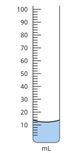

Answer: **12 mL**
- Typed **14** (top) → “Read at the bottom of the curved surface, not at the edges.”

Hint (draft): Each small mark is 2 mL. Look at the bottom of the curve.

Full working after a second miss:

> Each small mark is 2 mL.  
> The bottom of the meniscus is on 12 mL.  

**Card pc16-3** (draft)

> A cuboid: volume = length × width × height.
>
> _A box 5 cm × 4 cm × 3 cm: 5 × 4 × 3 = 60 cm³._  

Check question: `p16-cuboid` · number, level 1 · computed by rule, reused from practice

> A wooden block is 2 cm long, 2 cm wide and 5 cm high. What is its volume?

Answer: **20 cm³**
- Typed **9** (add) → “Volume = length × width × height: multiply, do not add.”

Full working after a second miss:

> Volume = length × width × height = 2 × 2 × 5.  
> = 20 cm³.  

**Card pc16-4** (draft)

> An irregular solid: read the water level before and after the stone goes in. The difference is the stone's volume.
>
> _Before 40 mL, after 58 mL: the stone is 18 cm³._  

Check question: `p16-disp` · number, level 1 · computed by rule, reused from practice

> What is the volume of the stone, in cm³?

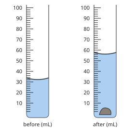

Answer: **24 cm³**
- Typed **56** (after) → “That is the water and the stone together. Subtract the reading before the stone went in.”

Hint (draft): Read both cylinders, then subtract.

Full working after a second miss:

> Before: 32 mL. After: 56 mL.  
> Stone = 56 − 32 = 24 mL = 24 cm³.  

**Worked example** (draft)

> Ewane puts water in a measuring cylinder, then lowers a stone into it. What is the volume of the stone?

1. Before: the bottom of the meniscus is at 40 mL.
2. After: it is at 58 mL.
3. Volume of the stone = 58 − 40 = 18 mL = 18 cm³.

**Answer:** 18 cm³

**Practice** `p16-convert1` · number, level 1 · computed by rule

> 12.5 L = ? cm³

Answer: **12 500 cm³**
- Typed **12.5** (small) → “Change the unit: 1 L = 1000 cm³.”

Full working after a second miss:

> 1 L = 1000 cm³.  
> 12.5 × 1000 = 12 500 cm³.  

> 11 L = ? cm³

Answer: **11 000 cm³**
- Typed **11** (small) → “Change the unit: 1 L = 1000 cm³.”

Full working after a second miss:

> 1 L = 1000 cm³.  
> 11 × 1000 = 11 000 cm³.  

**Practice** `p16-cyl` · number, level 1 · computed by rule

> How much water is in the measuring cylinder?

Answer: **80 mL**
- Typed **82** (top) → “Read at the bottom of the curved surface, not at the edges.”

Hint (draft): Each small mark is 2 mL. Look at the bottom of the curve.

Full working after a second miss:

> Each small mark is 2 mL.  
> The bottom of the meniscus is on 80 mL.  

> How much water is in the measuring cylinder?

Answer: **76 mL**
- Typed **78** (top) → “Read at the bottom of the curved surface, not at the edges.”

Hint (draft): Each small mark is 2 mL. Look at the bottom of the curve.

Full working after a second miss:

> Each small mark is 2 mL.  
> The bottom of the meniscus is on 76 mL.  

**Practice** `p16-cuboid` · number, level 1 · computed by rule

> A box of chalk is 2 cm long, 5 cm wide and 5 cm high. What is its volume?

Answer: **50 cm³**
- Typed **12** (add) → “Volume = length × width × height: multiply, do not add.”

Full working after a second miss:

> Volume = length × width × height = 2 × 5 × 5.  
> = 50 cm³.  

> A brick is 7 cm long, 9 cm wide and 6 cm high. What is its volume?

Answer: **378 cm³**
- Typed **22** (add) → “Volume = length × width × height: multiply, do not add.”

Full working after a second miss:

> Volume = length × width × height = 7 × 9 × 6.  
> = 378 cm³.  

**Practice** `p16-disp` · number, level 1 · computed by rule

> What is the volume of the stone, in cm³?

Answer: **28 cm³**
- Typed **58** (after) → “That is the water and the stone together. Subtract the reading before the stone went in.”

Hint (draft): Read both cylinders, then subtract.

Full working after a second miss:

> Before: 30 mL. After: 58 mL.  
> Stone = 58 − 30 = 28 mL = 28 cm³.  

> What is the volume of the stone, in cm³?

Answer: **30 cm³**
- Typed **82** (after) → “That is the water and the stone together. Subtract the reading before the stone went in.”

Hint (draft): Read both cylinders, then subtract.

Full working after a second miss:

> Before: 52 mL. After: 82 mL.  
> Stone = 82 − 52 = 30 mL = 30 cm³.  

**Practice** `p16-tank` · number, level 2 · computed by rule

> A water tank is 3 m long, 1 m wide and 2 m high. How many litres of water can it hold?

Answer: **6000 L**
- Typed **6** (m3) → “That is in cubic metres. 1 m³ = 1000 L.”

Full working after a second miss:

> Volume = 3 × 1 × 2 = 6 m³.  
> 1 m³ = 1000 L, so the tank holds 6000 L.  

> A water tank is 1 m long, 3 m wide and 3 m high. How many litres of water can it hold?

Answer: **9000 L**
- Typed **9** (m3) → “That is in cubic metres. 1 m³ = 1000 L.”

Full working after a second miss:

> Volume = 1 × 3 × 3 = 9 m³.  
> 1 m³ = 1000 L, so the tank holds 9000 L.  

**Practice** `p16-convert` · number, level 2 · computed by rule

> Convert this volume: 1.6 L = ? cm³

Answer: **1600 cm³**
- Typed **0.0016** (wrong-way) → “You went the wrong way. From a bigger unit to a smaller one, the number gets bigger; from smaller to bigger, it gets smaller.”

Full working after a second miss:

> 1 L = 1000 cm³.  
> Multiply by 1000: 1.6 L = 1600 cm³.  

> Convert this volume: 9 m³ = ? L

Answer: **9000 L**
- Typed **0.009** (wrong-way) → “You went the wrong way. From a bigger unit to a smaller one, the number gets bigger; from smaller to bigger, it gets smaller.”

Full working after a second miss:

> 1 m³ = 1000 L.  
> Multiply by 1000: 9 m³ = 9000 L.  

**Practice** `p16-spot` · spot the error, level 3 · computed by rule

> One answer is wrong. Which one?

- ✅ A box 7 cm × 3 cm × 3 cm has a volume of 13 cm³.  
  _↳ explanation: Multiply, do not add: 7 × 3 × 3 = 63 cm³._
- ◻️ 6 L = 6000 mL.
- ◻️ Water rises from 38 mL to 50 mL: the stone is 12 cm³.
- ◻️ A box 6 cm × 4 cm × 3 cm has a volume of 72 cm³.

Full working after a second miss:

> The wrong statement is “A box 7 cm × 3 cm × 3 cm has a volume of 13 cm³.”.  
> Multiply, do not add: 7 × 3 × 3 = 63 cm³.  

> One answer is wrong. Which one?

- ◻️ Water rises from 60 mL to 76 mL: the stone is 16 cm³.
- ◻️ 2 L = 2000 mL.
- ◻️ A box 2 cm × 4 cm × 3 cm has a volume of 24 cm³.
- ✅ A box 4 cm × 5 cm × 4 cm has a volume of 13 cm³.  
  _↳ explanation: Multiply, do not add: 4 × 5 × 4 = 80 cm³._

Full working after a second miss:

> The wrong statement is “A box 4 cm × 5 cm × 4 cm has a volume of 13 cm³.”.  
> Multiply, do not add: 4 × 5 × 4 = 80 cm³.  

## Lesson 17: Density: Definition, Units, and Measurement

Prerequisites: 14, 16 · Skill: p17 (Density)

**Note** (draft)

> Density is the mass of each unit of volume: density = mass ÷ volume.
> Units: g/cm³ or kg/m³ (the SI unit). 1 g/cm³ = 1000 kg/m³.
> To find the density of a stone: measure its mass with a balance and its volume by displacement, then divide.
> The density of water is 1 g/cm³. A body less dense than water floats; a body more dense than water sinks. Some densities: ice about 0.92 g/cm³ (it floats), kerosene about 0.8 g/cm³, iron about 7.9 g/cm³ (it sinks).
> Two bodies of the same size can have different masses because their densities are different: a block of iron is much heavier than a block of wood of the same size.

**Card pc17-1** (draft)

> Density = mass ÷ volume. It tells how much mass is packed into each cm³.
>
> _30 g in 12 cm³: 30 ÷ 12 = 2.5 g/cm³._  

Check question: `p17-d` · number, level 1 · computed by rule, reused from practice

> A block has a mass of 51.3 g and a volume of 19 cm³. What is its density?

Answer: **2.7 g/cm³**
- Typed **974.7** (times) → “Density = mass ÷ volume: divide, do not multiply.”
- Typed **0.37** (upside) → “Divide the mass by the volume, not the volume by the mass.”

Full working after a second miss:

> Density = mass ÷ volume = 51.3 ÷ 19.  
> = 2.7 g/cm³.  

**Card pc17-2** (draft)

> Water has a density of 1 g/cm³. Less dense than water: it floats. More dense: it sinks.
>
> _Wood (about 0.6 g/cm³) floats. Iron (about 7.9 g/cm³) sinks._  

Check question: `pc17-2-check` · multiple choice, level 1 · computed by rule

> A block has a density of 2 g/cm³. Will it float or sink in water?

- ✅ It sinks.
- ◻️ It floats.  
  _↳ feedback if chosen: Compare with water, 1 g/cm³: less than 1 floats, more than 1 sinks._

Full working after a second miss:

> 2 g/cm³ is more than the density of water.  
> It sinks.  

**Card pc17-3** (draft)

> Units of density: g/cm³ or kg/m³. 1 g/cm³ = 1000 kg/m³.
>
> _Water: 1 g/cm³ = 1000 kg/m³._  

Check question: `p17-unit-l1` · number, level 1 · computed by rule, reused from practice

> Change 0.8 g/cm³ into kg/m³.

Answer: **800 kg/m³**
- Typed **0.0008** (divide) → “1 g/cm³ = 1000 kg/m³: multiply by 1000.”

Full working after a second miss:

> 1 g/cm³ = 1000 kg/m³.  
> 0.8 × 1000 = 800 kg/m³.  

**Worked example** (draft)

> A metal block has a mass of 54 g and a volume of 20 cm³. What is its density? Will it float in water?

1. Density = mass ÷ volume = 54 ÷ 20 = 2.7 g/cm³.
2. Water is 1 g/cm³. 2.7 is more than 1, so the block sinks.

**Answer:** 2.7 g/cm³; it sinks.

**Practice** `p17-d` · number, level 1 · computed by rule

> A block has a mass of 10 g and a volume of 5 cm³. What is its density?

Answer: **2 g/cm³**
- Typed **50** (times) → “Density = mass ÷ volume: divide, do not multiply.”
- Typed **0.5** (upside) → “Divide the mass by the volume, not the volume by the mass.”

Full working after a second miss:

> Density = mass ÷ volume = 10 ÷ 5.  
> = 2 g/cm³.  

> A block has a mass of 26 g and a volume of 13 cm³. What is its density?

Answer: **2 g/cm³**
- Typed **338** (times) → “Density = mass ÷ volume: divide, do not multiply.”
- Typed **0.5** (upside) → “Divide the mass by the volume, not the volume by the mass.”

Full working after a second miss:

> Density = mass ÷ volume = 26 ÷ 13.  
> = 2 g/cm³.  

**Practice** `p17-unit-l1` · number, level 1 · computed by rule

> Change 4 g/cm³ into kg/m³.

Answer: **4000 kg/m³**
- Typed **0.004** (divide) → “1 g/cm³ = 1000 kg/m³: multiply by 1000.”

Full working after a second miss:

> 1 g/cm³ = 1000 kg/m³.  
> 4 × 1000 = 4000 kg/m³.  

> Change 2.5 g/cm³ into kg/m³.

Answer: **2500 kg/m³**
- Typed **0.0025** (divide) → “1 g/cm³ = 1000 kg/m³: multiply by 1000.”

Full working after a second miss:

> 1 g/cm³ = 1000 kg/m³.  
> 2.5 × 1000 = 2500 kg/m³.  

**Practice** `p17-m` · number, level 2 · computed by rule

> A stone has a density of 0.8 g/cm³ and a volume of 5 cm³. What is its mass?

Answer: **4 g**
- Typed **0.16** (divide) → “Mass = density × volume.”

Full working after a second miss:

> Mass = density × volume = 0.8 × 5.  
> = 4 g.  

> A stone has a density of 8 g/cm³ and a volume of 15 cm³. What is its mass?

Answer: **120 g**
- Typed **0.53** (divide) → “Mass = density × volume.”

Full working after a second miss:

> Mass = density × volume = 8 × 15.  
> = 120 g.  

**Practice** `p17-float` · multiple choice, level 2 · computed by rule

> A block has a mass of 30 g and a volume of 12 cm³. Will it float or sink in water?

- ✅ It sinks.
- ◻️ It floats.  
  _↳ feedback if chosen: Work out the density (mass ÷ volume) and compare it with water, 1 g/cm³._

Full working after a second miss:

> Density = 30 ÷ 12 = 2.5 g/cm³.  
> That is more than water (1 g/cm³): It sinks.  

> A block has a mass of 8.8 g and a volume of 11 cm³. Will it float or sink in water?

- ◻️ It sinks.  
  _↳ feedback if chosen: Work out the density (mass ÷ volume) and compare it with water, 1 g/cm³._
- ✅ It floats.

Full working after a second miss:

> Density = 8.8 ÷ 11 = 0.8 g/cm³.  
> That is less than water (1 g/cm³): It floats.  

**Practice** `p17-spot` · spot the error, level 3 · **authored key**

> One sentence is wrong. Which one?

- ◻️ A body denser than water sinks.
- ◻️ Density = mass ÷ volume.
- ◻️ Ice floats because it is less dense than water.
- ✅ Iron floats in water.  
  _↳ explanation: Iron (about 7.9 g/cm³) is denser than water: it sinks._

Full working after a second miss:

> The wrong statement is “Iron floats in water.”.  
> Iron (about 7.9 g/cm³) is denser than water: it sinks.  

> One sentence is wrong. Which one?

- ◻️ A body denser than water sinks.
- ✅ Density = mass × volume.  
  _↳ explanation: Density = mass ÷ volume._
- ◻️ Density = mass ÷ volume.
- ◻️ 1 g/cm³ = 1000 kg/m³.

Full working after a second miss:

> The wrong statement is “Density = mass × volume.”.  
> Density = mass ÷ volume.  

## Lesson 18: Temperature: Definition, Units and Measurements

Prerequisites: 8 · Skill: p18 (Temperature)

**Note** (draft)

> Temperature tells how hot or cold a body is. The SI unit is the kelvin (K); in daily life we use degrees Celsius (°C).
> T(K) = T(°C) + 273. So 0 °C = 273 K and 100 °C = 373 K.
> Fixed points (at normal air pressure): pure ice melts at 0 °C; pure water boils at 100 °C.
> A liquid-in-glass thermometer has mercury or coloured alcohol in a thin tube. When it gets warmer, the liquid expands and rises. Read it with your eye level with the top of the liquid.
> A change of 1 °C is the same as a change of 1 K.

**Card pc18-1** (draft)

> Temperature tells how hot or cold something is. We read it on a thermometer, in °C.
>
> _The liquid rises when it gets warmer. This one shows 31 °C._  

Check question: `p18-read` · number, level 1 · computed by rule, reused from practice

> What temperature does the thermometer show?

Answer: **24 °C**
- Typed **34** (next) → “Count the small marks after the last number carefully: each one is 1 °C.”

Hint (draft): Find the last number before the end of the red liquid, then count the small marks.

Full working after a second miss:

> Each small mark is 1 °C.  
> The red liquid ends at 24 °C.  

**Card pc18-2** (draft)

> The SI unit is the kelvin: T(K) = T(°C) + 273.
>
> _0 °C = 273 K. 37 °C = 310 K._  

Check question: `p18-k` · number, level 1 · computed by rule, reused from practice

> Change 15 °C into kelvin.

Answer: **288 K**
- Typed **−258** (minus) → “From °C to K, add 273.”

Full working after a second miss:

> T(K) = T(°C) + 273 = 15 + 273.  
> = 288 K.  

**Card pc18-3** (draft)

> Fixed points: pure ice melts at 0 °C; pure water boils at 100 °C (at normal air pressure).
>
> _Boiling water: 100 °C = 373 K._  

Check question: `pc18-3-check` · multiple choice, level 1 · **authored key**

> At normal air pressure, pure water boils at:

- ◻️ 273 °C  
  _↳ feedback if chosen: 273 is the number added to change °C into kelvin._
- ✅ 100 °C
- ◻️ 37 °C  
  _↳ feedback if chosen: 37 °C is about normal body temperature._
- ◻️ 0 °C  
  _↳ feedback if chosen: 0 °C is where pure ice melts._

Full working after a second miss:

> The true statement is “100 °C”.  
> “273 °C” is false: 273 is the number added to change °C into kelvin.  
> “37 °C” is false: 37 °C is about normal body temperature.  
> “0 °C” is false: 0 °C is where pure ice melts.  

**Worked example** (draft)

> Read the thermometer, then give the temperature in kelvin.

1. Each small mark is 1 °C. The red liquid ends at 25 °C.
2. T(K) = T(°C) + 273 = 25 + 273 = 298 K.

**Answer:** 25 °C = 298 K

**Practice** `p18-read` · number, level 1 · computed by rule

> What temperature does the thermometer show?

Answer: **18 °C**
- Typed **28** (next) → “Count the small marks after the last number carefully: each one is 1 °C.”

Hint (draft): Find the last number before the end of the red liquid, then count the small marks.

Full working after a second miss:

> Each small mark is 1 °C.  
> The red liquid ends at 18 °C.  

> What temperature does the thermometer show?

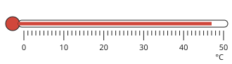

Answer: **47 °C**
- Typed **57** (next) → “Count the small marks after the last number carefully: each one is 1 °C.”

Hint (draft): Find the last number before the end of the red liquid, then count the small marks.

Full working after a second miss:

> Each small mark is 1 °C.  
> The red liquid ends at 47 °C.  

**Practice** `p18-k` · number, level 1 · computed by rule

> Change −19 °C into kelvin.

Answer: **254 K**
- Typed **−292** (minus) → “From °C to K, add 273.”

Full working after a second miss:

> T(K) = T(°C) + 273 = −19 + 273.  
> = 254 K.  

> Change −10 °C into kelvin.

Answer: **263 K**
- Typed **−283** (minus) → “From °C to K, add 273.”

Full working after a second miss:

> T(K) = T(°C) + 273 = −10 + 273.  
> = 263 K.  

**Practice** `p18-c` · number, level 2 · computed by rule

> Change 391 K into degrees Celsius.

Answer: **118 °C**
- Typed **664** (plus) → “From K to °C, subtract 273.”

Full working after a second miss:

> T(°C) = T(K) − 273 = 391 − 273.  
> = 118 °C.  

> Change 387 K into degrees Celsius.

Answer: **114 °C**
- Typed **660** (plus) → “From K to °C, subtract 273.”

Full working after a second miss:

> T(°C) = T(K) − 273 = 387 − 273.  
> = 114 °C.  

**Practice** `p18-rise` · number, level 2 · computed by rule

> Water in a pot was at 18 °C. After heating it is at 43 °C. By how many kelvin did its temperature rise?

Answer: **25 K**
- Typed **298** (add273) → “A change of 1 °C is the same as a change of 1 K: do not add 273 to a difference.”

Full working after a second miss:

> Rise = 43 − 18 = 25 °C.  
> A rise of 1 °C is a rise of 1 K, so the rise is 25 K.  

> Water in a pot was at 30 °C. After heating it is at 64 °C. By how many kelvin did its temperature rise?

Answer: **34 K**
- Typed **307** (add273) → “A change of 1 °C is the same as a change of 1 K: do not add 273 to a difference.”

Full working after a second miss:

> Rise = 64 − 30 = 34 °C.  
> A rise of 1 °C is a rise of 1 K, so the rise is 34 K.  

**Practice** `p18-spot` · spot the error, level 3 · **authored key**

> One sentence is wrong. Which one?

- ◻️ The SI unit of temperature is the kelvin.
- ◻️ Pure water boils at 100 °C at normal air pressure.
- ✅ Pure ice melts at 100 °C.  
  _↳ explanation: Pure ice melts at 0 °C._
- ◻️ 0 °C = 273 K.

Full working after a second miss:

> The wrong statement is “Pure ice melts at 100 °C.”.  
> Pure ice melts at 0 °C.  

> One sentence is wrong. Which one?

- ◻️ The SI unit of temperature is the kelvin.
- ✅ To change °C into kelvin, subtract 273.  
  _↳ explanation: From °C to K, add 273: 0 °C = 273 K._
- ◻️ Pure water boils at 100 °C at normal air pressure.
- ◻️ The liquid in a thermometer rises when it gets warmer.

Full working after a second miss:

> The wrong statement is “To change °C into kelvin, subtract 273.”.  
> From °C to K, add 273: 0 °C = 273 K.  

## Lesson 19: Safety rules on products and materials. Using information on products

Prerequisites: 6 · Skill: p19 (Safety information on products)

**Note** (draft)

> Read the label before you use any product. A label tells you the name, how to use it, how to store it, warnings, who made it, and the date of manufacture and the expiry date (“use before …”). Do not use a product after its expiry date.
> Hazard symbols warn of danger:
> • a flame: flammable (kerosene, petrol);
> • a skull and crossbones: toxic (rat poison);
> • liquid dripping onto a hand and metal: corrosive (battery acid);
> • an exclamation mark: harmful or irritant;
> • a gas bottle: gas under pressure (cooking gas);
> • a dead tree and fish: dangerous for the environment.
> Keep such products away from children and food, in their own containers, never in drink bottles.

**Card pc19-1** (draft)

> Hazard symbols warn of danger. A flame means flammable; a skull and crossbones means toxic.
>
> _Kerosene has the flame symbol: keep it away from fire._  

Check question: `p19-symbol` · matching, level 1 · **authored key**, reused from practice

> Match each hazard symbol (described in words) with what it means.

Right-hand side (shuffled): explosive · corrosive: burns skin and eats metal · flammable: catches fire easily · harmful or irritant: can hurt skin, eyes or breathing
- an exploding bomb → **explosive**
- a flame → **flammable: catches fire easily**
- an exclamation mark → **harmful or irritant: can hurt skin, eyes or breathing**
- liquid dripping onto a hand and a metal bar → **corrosive: burns skin and eats metal**

Full working after a second miss:

> The right pairs are:  
> an exploding bomb → explosive  
> a flame → flammable: catches fire easily  
> an exclamation mark → harmful or irritant: can hurt skin, eyes or breathing  
> liquid dripping onto a hand and a metal bar → corrosive: burns skin and eats metal  

**Card pc19-2** (draft)

> A label tells how to use and store a product, warnings, who made it and the expiry date.
>
> _“Keep out of reach of children” is a warning._  

Check question: `p19-label-l1` · multiple choice, level 1 · **authored key**, reused from practice

> A label says “Keep out of reach of children.” What does this part of the label tell you?

- ◻️ how to store it  
  _↳ feedback if chosen: That is a different part of the label._
- ◻️ the expiry date  
  _↳ feedback if chosen: That is a different part of the label._
- ✅ a warning
- ◻️ how to use it  
  _↳ feedback if chosen: That is a different part of the label._

Full working after a second miss:

> “Keep out of reach of children.” tells a warning.  
> Answer: a warning.  

**Card pc19-3** (draft)

> Never use a product after its expiry (“use before”) date.
>
> _Today 07/10/2026; use before 01/03/2027: still good._  

Check question: `p19-expiry` · multiple choice, level 1 · computed by rule, reused from practice

> Today is 13/02/2026. A bottle of cough syrup says “Use before 11/07/2026”. Can it still be used?

- ◻️ No, it has expired.  
  _↳ feedback if chosen: Compare the year first, then the month, then the day._
- ✅ Yes, it is still good.

Full working after a second miss:

> Today: 13/02/2026. Use before: 11/07/2026.  
> The use-before date is after today: Yes, it is still good.  

**Worked example** (draft)

> Today is 07/10/2026. A tin of milk says “Use before 30/09/2026”. Can we still use it?

1. Compare the dates: first the year, then the month, then the day.
2. The use-before date, 30/09/2026, is before today, 07/10/2026.

**Answer:** No: it has expired. Do not use it.

**Practice** `p19-symbol` · matching, level 1 · **authored key**

> Match each hazard symbol (described in words) with what it means.

Right-hand side (shuffled): explosive · toxic: poisonous · corrosive: burns skin and eats metal · dangerous for the environment
- a skull and crossbones → **toxic: poisonous**
- liquid dripping onto a hand and a metal bar → **corrosive: burns skin and eats metal**
- a dead tree and a dead fish → **dangerous for the environment**
- an exploding bomb → **explosive**

Full working after a second miss:

> The right pairs are:  
> a skull and crossbones → toxic: poisonous  
> liquid dripping onto a hand and a metal bar → corrosive: burns skin and eats metal  
> a dead tree and a dead fish → dangerous for the environment  
> an exploding bomb → explosive  

> Match each hazard symbol (described in words) with what it means.

Right-hand side (shuffled): corrosive: burns skin and eats metal · flammable: catches fire easily · explosive · gas under pressure: can burst if heated
- an exploding bomb → **explosive**
- liquid dripping onto a hand and a metal bar → **corrosive: burns skin and eats metal**
- a flame → **flammable: catches fire easily**
- a gas bottle → **gas under pressure: can burst if heated**

Full working after a second miss:

> The right pairs are:  
> an exploding bomb → explosive  
> liquid dripping onto a hand and a metal bar → corrosive: burns skin and eats metal  
> a flame → flammable: catches fire easily  
> a gas bottle → gas under pressure: can burst if heated  

**Practice** `p19-label-l1` · multiple choice, level 1 · **authored key**

> A label says “Use before 03/2027.” What does this part of the label tell you?

- ◻️ how to store it  
  _↳ feedback if chosen: That is a different part of the label._
- ◻️ how to use it  
  _↳ feedback if chosen: That is a different part of the label._
- ✅ the expiry date
- ◻️ a warning  
  _↳ feedback if chosen: That is a different part of the label._

Full working after a second miss:

> “Use before 03/2027.” tells the expiry date.  
> Answer: the expiry date.  

> A label says “Shake well before use.” What does this part of the label tell you?

- ✅ how to use it
- ◻️ a warning  
  _↳ feedback if chosen: That is a different part of the label._
- ◻️ the expiry date  
  _↳ feedback if chosen: That is a different part of the label._
- ◻️ how to store it  
  _↳ feedback if chosen: That is a different part of the label._

Full working after a second miss:

> “Shake well before use.” tells how to use it.  
> Answer: how to use it.  

**Practice** `p19-product` · multiple choice, level 1 · **authored key**

> Which danger does acid from a car battery have?

- ◻️ toxic: poisonous  
  _↳ feedback if chosen: That warning is for a different product._
- ✅ corrosive: burns skin and eats metal
- ◻️ gas under pressure: can burst if heated  
  _↳ feedback if chosen: That warning is for a different product._
- ◻️ flammable: catches fire easily  
  _↳ feedback if chosen: That warning is for a different product._

Full working after a second miss:

> acid from a car battery: corrosive: burns skin and eats metal.  
> Answer: corrosive: burns skin and eats metal.  

> Which danger does rat poison have?

- ✅ toxic: poisonous
- ◻️ corrosive: burns skin and eats metal  
  _↳ feedback if chosen: That warning is for a different product._
- ◻️ gas under pressure: can burst if heated  
  _↳ feedback if chosen: That warning is for a different product._
- ◻️ flammable: catches fire easily  
  _↳ feedback if chosen: That warning is for a different product._

Full working after a second miss:

> rat poison: toxic: poisonous.  
> Answer: toxic: poisonous.  

**Practice** `p19-expiry` · multiple choice, level 1 · computed by rule

> Today is 02/06/2026. A tin of milk says “Use before 26/03/2027”. Can it still be used?

- ✅ Yes, it is still good.
- ◻️ No, it has expired.  
  _↳ feedback if chosen: Compare the year first, then the month, then the day._

Full working after a second miss:

> Today: 02/06/2026. Use before: 26/03/2027.  
> The use-before date is after today: Yes, it is still good.  

> Today is 24/09/2026. A packet of biscuits says “Use before 09/08/2026”. Can it still be used?

- ◻️ Yes, it is still good.  
  _↳ feedback if chosen: Compare the year first, then the month, then the day._
- ✅ No, it has expired.

Full working after a second miss:

> Today: 24/09/2026. Use before: 09/08/2026.  
> The use-before date is before today: No, it has expired.  

**Practice** `p19-what` · multiple choice, level 2 · **authored key**

> Your little brother wants to play with a cooking-gas bottle. What should you do?

- ◻️ Do not touch or taste it, and keep it away from children.  
  _↳ feedback if chosen: Not the safe choice. Read the situation again._
- ✅ Keep children away from the gas bottle and tell an adult: it can burst or leak.
- ◻️ Taste a little to find out what it is.  
  _↳ feedback if chosen: Not the safe choice. Read the situation again._
- ◻️ Nothing: it is not dangerous.  
  _↳ feedback if chosen: Not the safe choice. Read the situation again._

Full working after a second miss:

> Your little brother wants to play with a cooking-gas bottle. → Keep children away from the gas bottle and tell an adult: it can burst or leak.  
> Answer: Keep children away from the gas bottle and tell an adult: it can burst or leak..  

> Your little brother wants to play with a cooking-gas bottle. What should you do?

- ✅ Keep children away from the gas bottle and tell an adult: it can burst or leak.
- ◻️ Taste a little to find out what it is.  
  _↳ feedback if chosen: Not the safe choice. Read the situation again._
- ◻️ Tell an adult so it can go into a labelled container, away from food and children.  
  _↳ feedback if chosen: Not the safe choice. Read the situation again._
- ◻️ Nothing: it is not dangerous.  
  _↳ feedback if chosen: Not the safe choice. Read the situation again._

Full working after a second miss:

> Your little brother wants to play with a cooking-gas bottle. → Keep children away from the gas bottle and tell an adult: it can burst or leak.  
> Answer: Keep children away from the gas bottle and tell an adult: it can burst or leak..  

**Practice** `p19-spot` · spot the error, level 3 · **authored key**

> One sentence is wrong. Which one?

- ✅ A product is still good after its expiry date.  
  _↳ explanation: After the expiry date, do not use it._
- ◻️ The flame symbol means the product catches fire easily.
- ◻️ Keep dangerous products away from children.
- ◻️ Rat poison is toxic.

Full working after a second miss:

> The wrong statement is “A product is still good after its expiry date.”.  
> After the expiry date, do not use it.  

> One sentence is wrong. Which one?

- ◻️ Keep dangerous products away from children.
- ◻️ Read the label before using a product.
- ◻️ Rat poison is toxic.
- ✅ It is fine to keep kerosene in a drink bottle.  
  _↳ explanation: Someone could drink it by mistake. Keep it in its own labelled container._

Full working after a second miss:

> The wrong statement is “It is fine to keep kerosene in a drink bottle.”.  
> Someone could drink it by mistake. Keep it in its own labelled container.  

